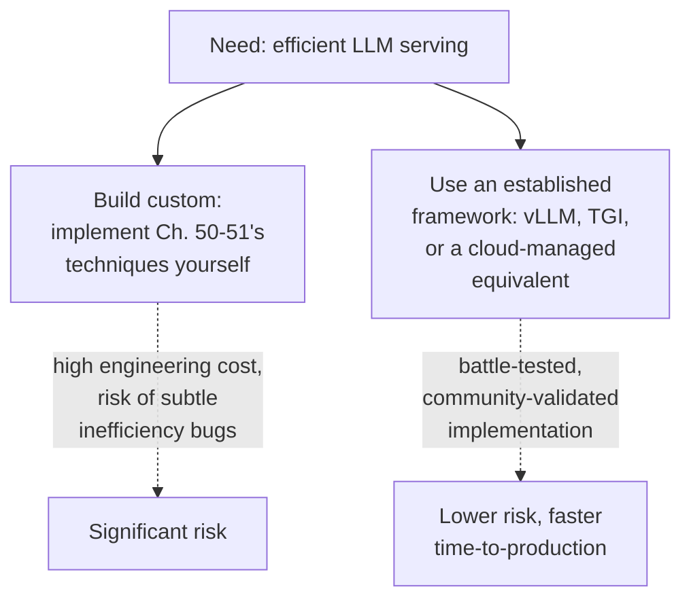
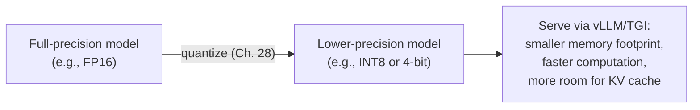

## Introduction

Chapters 50-51 built the conceptual foundation — KV caching, continuous batching, speculative decoding, and related techniques. This chapter answers the practical system design question: how do you actually deploy these optimizations in production, rather than reimplementing them from scratch? It covers the established serving frameworks that package this Part's techniques into deployable systems, and where quantization (Chapter 28) fits alongside them as a complementary, not competing, optimization.

## Why Use an Established Serving Framework Rather Than Building Custom

Chapters 50-51's techniques — PagedAttention-style memory management (Chapter 53 will name this specifically), continuous batching schedulers, speculative decoding coordination — are non-trivial to implement correctly and efficiently. This is a direct instance of the general build-vs-buy reasoning from Chapter 41, now applied specifically to inference-serving infrastructure: implementing these techniques from scratch requires deep, specialized systems engineering expertise, and getting the details wrong (an inefficient scheduler, a memory-management bug) directly undermines the very efficiency gains these techniques exist to provide.



## vLLM: PagedAttention and Throughput-Optimized Serving

**vLLM** is an open-source serving framework built around **PagedAttention** — a KV cache memory management technique (named here, developed fully in Chapter 53) that manages GPU memory in fixed-size, non-contiguous blocks, similar in spirit to how an operating system manages virtual memory in pages, directly addressing the KV cache memory fragmentation and waste that a naive, contiguous-allocation approach to Chapter 50's KV cache would suffer from. vLLM implements continuous batching, efficient KV cache management, and (in more recent versions) speculative decoding support, and has become a widely-adopted default choice for self-hosted, throughput-optimized LLM serving.

```python
# Illustrative usage of vLLM's serving API — the interface abstracts
# away Chapters 50-51's scheduling and memory-management complexity
# entirely, exposing a simple generation call.

from vllm import LLM, SamplingParams

llm = LLM(model="meta-llama/Llama-3-8B-Instruct")  # loads and prepares
                                                      # the model, internally
                                                      # setting up continuous
                                                      # batching and
                                                      # PagedAttention

sampling_params = SamplingParams(
    temperature=0.7,   # Ch. 39's decoding strategy configuration,
    top_p=0.9,          # exposed as a simple parameter here
    max_tokens=512,
)

# vLLM's engine internally handles continuous batching across
# however many concurrent requests are submitted — the caller
# doesn't need to implement any of Ch. 50's scheduling logic.
outputs = llm.generate(["Explain KV caching in one sentence."], sampling_params)
```

## Text Generation Inference (TGI): Hugging Face's Production Server

**TGI** (Text Generation Inference) is Hugging Face's production serving solution, offering similar core capabilities (continuous batching, efficient attention implementations, quantization support) with tighter integration into the broader Hugging Face model ecosystem — a natural choice for teams already using Hugging Face's model hub and tooling throughout their ML lifecycle (echoing the general principle from Chapter 13 that ecosystem fit and existing tooling investment are legitimate factors in a build-vs-buy or tool-selection decision, not just raw feature comparison).

## Choosing Between Serving Frameworks: A Decision Framework

| Consideration | Favors |
|---|---|
| Maximum raw throughput for self-hosted serving | vLLM (widely benchmarked as throughput-leading for many workloads) |
| Tight integration with existing Hugging Face tooling/ecosystem | TGI |
| No self-hosting infrastructure at all | A closed-source API (Chapter 41) — this Part's techniques are the provider's concern, not yours |
| Managed, cloud-provider-hosted open-source serving | A cloud provider's managed inference endpoint (Chapter 41's "managed open-source hosting" middle ground) |

This decision should be validated empirically for the specific model, hardware, and traffic pattern in question (per this series' consistent evaluation discipline) rather than assumed from general reputation alone — benchmark results for one model/hardware combination don't always transfer perfectly to a different one.

## Quantization's Role Alongside These Frameworks

Chapter 28 introduced quantization as a general model compression technique, and Chapter 45 revisited it as QLoRA's memory-saving mechanism during fine-tuning. In the serving context, quantization reduces the numerical precision of the model's weights (and sometimes activations) specifically to reduce the **memory footprint and computational cost of inference** — both established serving frameworks support loading and serving quantized models directly.



**Why this matters specifically in the serving context, beyond Chapter 28's general discussion**: a quantized model's smaller memory footprint doesn't just make the model itself fit on smaller hardware — it directly frees up more GPU memory for the KV cache (Chapter 50), which, since KV cache memory is often the binding constraint on concurrent request capacity (Chapter 50's closing discussion), can allow a serving system to handle meaningfully more concurrent requests on the same hardware. Quantization and Chapter 50's inference optimizations are therefore complementary in a very direct, compounding way: quantization frees memory, and that freed memory directly translates into more capacity for the continuous batching and KV caching machinery to exploit.

## Key Takeaways

- Implementing Chapters 50-51's serving optimizations from scratch is a substantial, specialized engineering undertaking — a direct build-vs-buy decision (Chapter 41) generally favoring established, battle-tested serving frameworks for most organizations.
- vLLM (built around PagedAttention) and TGI (Hugging Face's production server) are the two most widely-adopted open-source serving frameworks, each implementing continuous batching and efficient KV cache management as core, built-in capabilities.
- Framework choice should be validated empirically for the specific model, hardware, and traffic pattern, rather than assumed from general reputation — and should also weigh ecosystem fit and existing tooling investment, not raw feature comparison alone.
- Quantization directly compounds with these serving frameworks' optimizations: a quantized model's smaller memory footprint frees GPU memory that can be redirected toward supporting more concurrent requests' KV caches, directly increasing serving capacity on the same hardware.

---

## Interview Questions

**1. Why does this chapter frame the choice between building a custom LLM serving stack and using an established framework like vLLM or TGI as a direct application of Chapter 41's build-vs-buy reasoning?**
Chapter 41 established that build-vs-buy decisions should weigh the cost, risk, and required expertise of building something in-house against the benefits of an existing, validated solution — implementing Chapters 50-51's techniques (efficient KV cache memory management, correct continuous batching scheduling, speculative decoding coordination) correctly and efficiently requires deep, specialized systems engineering expertise, and subtle implementation errors could silently undermine the exact efficiency gains these techniques are meant to provide, without necessarily being obvious from the outside; an established, widely-used, community-validated framework like vLLM or TGI has already had this specific engineering investment made and validated by a broad community of users and contributors, making it, for the vast majority of organizations, a lower-risk, faster, and more cost-effective choice than independently re-implementing this same specialized functionality from scratch — precisely the same underlying build-vs-buy logic Chapter 41 established for the model-sourcing decision, now applied one layer down to the serving-infrastructure decision specifically.
*Follow-up: Under what circumstance might an organization still reasonably choose to build custom serving infrastructure despite this general recommendation?*
An organization with a genuinely unusual serving requirement not well-supported by existing frameworks (an unusual hardware target, a highly specialized model architecture not yet supported by these frameworks' existing implementations, or an extremely specific, novel optimization need unique to their particular workload) — combined with substantial in-house systems engineering expertise and resources to properly implement and maintain such custom infrastructure — might reasonably justify a custom build, following the same "genuinely unusual, well-resourced exception" pattern this series has recognized for other similar build-vs-buy decisions (e.g., Chapter 41's discussion of when building a custom model registry might be justified despite mature existing platforms being available).

**2. What is PagedAttention, at a conceptual level, and why does its "operating-system-style paging" analogy make sense given the KV cache memory challenge from Chapter 50?**
PagedAttention manages KV cache memory in fixed-size, non-contiguous blocks (or "pages"), rather than requiring each sequence's entire KV cache to be stored in one large, contiguous block of memory — this directly mirrors how an operating system manages virtual memory by dividing it into fixed-size pages that don't need to be physically contiguous, allowing more flexible, efficient allocation and reducing memory fragmentation; this analogy makes sense in the KV cache context because Chapter 50 established that KV cache memory demand is highly variable (different sequences have different, and dynamically-growing, lengths) — a naive, contiguous-allocation approach would need to either over-allocate memory upfront for each sequence's maximum possible length (wasting memory for sequences that end up shorter) or suffer significant fragmentation as sequences of varying lengths are allocated and freed over time, exactly the kind of memory-management inefficiency that paged, block-based allocation (as operating systems have long used for exactly this class of problem) is specifically designed to solve.
*Follow-up: Why might this specific memory-management technique be considered enough of a genuine engineering achievement to warrant being named and discussed as vLLM's signature, defining feature, rather than being treated as an obvious, expected implementation detail?*
Naive, contiguous KV cache memory allocation was apparently a genuine, significant source of memory waste and inefficiency in earlier LLM serving implementations before this technique's introduction — the "obvious" default approach (pre-allocating a large, contiguous block per sequence, sized for its maximum possible length) can waste substantial GPU memory when actual generated sequence lengths vary significantly and are shorter than this pre-allocated maximum, and adapting operating-system-style paging concepts to this specific GPU-memory, attention-computation context required genuine, non-trivial engineering insight and implementation work to do correctly and efficiently — the fact that this specific technique produced a measurable, significant improvement in serving throughput and memory efficiency (as documented in vLLM's own research and adoption) is exactly why it's specifically named and highlighted as a defining innovation, rather than being dismissed as an unremarkable, obvious implementation detail that any serving system would trivially already have.

**3. Why should a team validate serving framework performance claims empirically for their SPECIFIC model, hardware, and traffic pattern, rather than relying on general benchmark reputation alone?**
General benchmark results (like "vLLM is X% faster than TGI on benchmark Y") are typically measured under specific, particular conditions — a specific model, specific hardware, specific traffic pattern (request rate, prompt lengths, response lengths) — and framework performance characteristics can genuinely vary depending on how well each framework's specific optimizations (its particular memory management approach, its specific batching scheduler tuning) happen to match a given deployment's actual characteristics; a framework that performs excellently on the benchmark's specific conditions might perform less favorably (relatively) for a different model architecture, different hardware generation, or a meaningfully different traffic pattern (e.g., very long-context RAG-heavy traffic versus short, simple chat traffic) than what the published benchmark actually measured — following this series' consistent principle (established since Chapter 21) that model and infrastructure choices should be validated against your own specific, actual conditions and evaluation criteria, not assumed to transfer perfectly from a general, possibly non-representative benchmark result.
*Follow-up: What specific metrics would you measure during this kind of empirical validation, connecting to concepts from Chapters 50-51?*
I'd measure time-to-first-token (TTFT) and per-subsequent-token generation latency separately (per Chapter 50's discussion of why these behave differently and matter differently for different use cases), overall system throughput (total tokens processed per second across all concurrent requests, reflecting the combined effectiveness of the framework's continuous batching and memory management), and GPU memory utilization efficiency (how much of the available GPU memory is actually being productively used for KV cache and computation, versus wasted to fragmentation or overhead) — measuring all of these under a traffic pattern that closely mirrors the actual, expected production traffic (representative prompt lengths, response lengths, and concurrent request rate) rather than a generic, possibly unrepresentative synthetic benchmark, ensuring the empirical validation genuinely reflects how each candidate framework would actually perform for this specific deployment's real conditions.

**4. Explain why a quantized model's reduced memory footprint directly translates into increased serving CAPACITY (more concurrent requests), not just a smaller model file on disk.**
As Chapter 50 established, KV cache memory is often the binding constraint on how many concurrent requests a serving system can handle on a given piece of hardware, since each additional concurrent sequence requires its own growing KV cache memory allocation; a quantized model occupies meaningfully less GPU memory for its own weights (per Chapter 28's compression discussion) than the same model at full precision would, meaning more of the GPU's total available memory remains free for other purposes after the model's weights have been loaded — this freed-up memory can then be allocated toward supporting a larger number of concurrent sequences' KV caches simultaneously, directly increasing the maximum number of concurrent requests the serving system can handle on that same piece of hardware, beyond simply making the model itself smaller and more portable as Chapter 28's original, more general discussion emphasized.
*Follow-up: Why might this specific "quantization frees memory for more KV cache capacity" benefit be MORE pronounced for a smaller model than for a very large model, on the same GPU?*
For a very large model, the model's own weights (even after quantization) likely still consume a substantial fraction of the GPU's total memory, meaning the ABSOLUTE amount of memory freed by quantization, while still significant in absolute terms, represents a smaller PROPORTION of the GPU's total memory budget compared to a smaller model, where the model's weights (even at full precision) might already be a comparatively modest fraction of total GPU memory, leaving proportionally more "headroom" for the freed memory from quantization to have a larger relative impact on the remaining available KV cache capacity — this means the practical, capacity-increasing benefit of quantization specifically for increasing concurrent-request capacity can vary meaningfully based on the specific ratio between the model's own memory footprint and the GPU's total available memory, a nuance worth empirically validating for any specific model/hardware combination rather than assuming a uniform, fixed benefit magnitude across all model sizes.

**5. In an interview, if asked "vLLM or TGI — which would you choose?", how would you use this chapter's decision framework to avoid giving an unjustified, memorized answer?**
I'd decline to give a single, universal answer and instead walk through the relevant decision factors from this chapter's framework — asking about the specific priorities and context (is raw self-hosted throughput the dominant concern, favoring vLLM's typically strong benchmarked performance; is tight integration with an existing Hugging Face-centric ML tooling ecosystem important, favoring TGI; or is the team not self-hosting at all, in which case neither framework is directly relevant and a closed-source API or managed hosting option, per Chapter 41, would be the more appropriate discussion) — and I'd explicitly note that, per this chapter's empirical-validation recommendation, a final decision should be grounded in benchmarking both candidates against the SPECIFIC model, hardware, and traffic pattern relevant to this particular scenario, rather than defaulting to whichever framework happens to be more well-known or reputationally favored in general, generic discussions.
*Follow-up: Why might an interviewer specifically value this kind of "it depends, here's the framework for deciding" answer over a confident, single "vLLM is better" assertion?*
An interviewer is typically trying to assess a candidate's underlying reasoning process and judgment, not merely whether they've memorized which of two specific tools currently has better general benchmark numbers (a fact that could easily become outdated as both frameworks continue to be actively developed and improved) — a candidate who demonstrates the ability to correctly identify the RELEVANT decision factors and explain how they'd apply empirical validation to a specific scenario shows a more durable, transferable skill (the ability to make a well-reasoned tool-selection decision in ANY similar future scenario, even involving tools that don't yet exist) than a candidate who simply asserts a confident but potentially superficial, memorized preference for one specific tool without this underlying reasoning process.

**6. Why might a team using a closed-source LLM API (per Chapter 41's build-vs-buy framework) have essentially no direct decision to make regarding vLLM versus TGI, and what does this reveal about the scope of this chapter's material?**
A closed-source API provider (per Chapter 41's discussion) handles all of the underlying model serving infrastructure themselves, entirely behind their API — the specific serving framework, optimization techniques, and hardware configuration used to actually run the model are the provider's internal implementation details, invisible to and not directly controllable by the API's external customers; this means the entire question of "which serving framework should we use" (this chapter's core topic) simply doesn't arise for a team consuming a closed-source API, since they never directly interact with or choose the underlying serving infrastructure at all — this reveals that this chapter's material (and, more broadly, much of this Part's inference-optimization content) is specifically and primarily relevant to teams that have chosen the self-hosted, open-source path from Chapter 41's build-vs-buy framework, representing a genuine and important scope boundary on when this chapter's specific content applies versus when it's simply not directly actionable for a given team's specific infrastructure situation.
*Follow-up: Why might understanding this Part's content still be valuable for a team that has chosen the closed-source API path, even though they don't directly implement or choose these serving optimizations themselves?*
Understanding these underlying serving optimization techniques (KV caching, continuous batching, quantization, and the frameworks that implement them) still provides valuable context for interpreting a closed-source provider's observed behavior and performance characteristics (as discussed in Chapter 51's "why did this API get faster" question), for having more informed technical conversations with the provider or in vendor evaluation discussions, and for correctly reasoning about the trade-offs of the build-vs-buy decision itself (Chapter 41) — a team can't fully evaluate whether self-hosting might eventually become worthwhile (per Chapter 41's break-even discussion) without understanding what specific engineering investment and complexity self-hosting would actually entail, which this Part's material (even if not directly, hands-on actionable for a currently API-based team) provides the necessary background to properly assess.

**7. How would you use this chapter's understanding of quantization's serving-capacity benefit to push back on a claim that "quantization only matters for running models on small, resource-constrained devices"?**
I'd point out that while quantization is indeed valuable and often necessary for resource-constrained edge deployment (a use case this chapter doesn't focus on but that Chapter 28 touched on), this chapter has established a distinct, equally important benefit specifically relevant to large-scale, GPU-based production serving — quantization's memory savings directly translate into increased KV cache capacity and therefore increased concurrent-request-handling capability on the SAME GPU hardware, meaning quantization is a genuine, valuable cost and capacity optimization even for large-scale, well-resourced production serving infrastructure, not merely a technique needed only when squeezing a model onto genuinely constrained, small-scale hardware — this reframes quantization as a broadly applicable capacity and cost optimization technique relevant across the full spectrum of deployment scales, not a narrow, edge-case-only concern.
*Follow-up: How would you quantify the specific business value of this serving-capacity benefit, to make a concrete case for investing in quantization for a large-scale production system?*
I'd calculate the increase in maximum concurrent request capacity a specific quantization scheme would provide on the existing hardware (based on the freed memory and Chapter 50's KV-cache-per-sequence memory cost), and translate this into either a reduction in the total number of GPUs needed to serve the current production traffic volume (a direct cost savings, per Chapter 42's cost modeling) or an increase in the traffic volume the current hardware fleet could handle without requiring additional GPU investment (deferring or avoiding a capital expenditure) — presenting this as a concrete, quantified cost-and-capacity business case, following this series' consistent preference for grounding infrastructure investment recommendations in specific, measurable, business-relevant terms rather than purely qualitative or technical arguments alone.

**8. Why might a team need to re-validate their quantization scheme's quality impact (per Chapter 28's compression-accuracy trade-off) SEPARATELY from validating the serving framework's throughput benefits, rather than treating "quantization + framework X" as a single, unified evaluation?**
Quantization's potential quality impact (how much, if any, accuracy or output quality degrades from reducing numerical precision, per Chapter 28's discussion) and a serving framework's throughput/latency characteristics are two genuinely independent dimensions of evaluation — a specific quantization scheme could provide excellent throughput and memory benefits (this chapter's focus) while still introducing an unacceptable quality degradation for a specific use case (a concern squarely within Chapter 28's scope, not this chapter's), or vice versa; treating "quantization + framework X" as a single, undifferentiated unit of evaluation risks conflating these two independent concerns, potentially either wrongly attributing a genuine quality problem to the serving framework choice (when it's actually the quantization scheme's quality trade-off) or wrongly attributing a throughput limitation to the quantization approach (when it might actually be the specific serving framework's configuration or implementation) — properly isolating and separately validating each of these two genuinely independent variables (following the same "isolate the specific variable under test" discipline this series has recommended throughout, e.g., Chapter 26's latency decomposition, Chapter 48's forgetting-versus-data-quality diagnosis) produces more precise, actionable evaluation results than a single, conflated evaluation would.
*Follow-up: How would you structure an evaluation process that properly isolates these two independent variables?*
I'd first validate the quantization scheme's quality impact independently (per Chapter 28's evaluation discipline — comparing the quantized model's task performance against the full-precision baseline on a representative evaluation set, Chapter 21) using a simple, controlled inference setup, before introducing any serving-framework-specific considerations at all; only after confirming the quantization scheme's quality impact is acceptable would I then separately evaluate the actual serving throughput and latency characteristics achieved when deploying that already-quality-validated quantized model through each candidate serving framework (vLLM, TGI, or others) — this two-stage, sequential evaluation approach (quality first, independent of serving framework; then serving performance, using an already quality-validated model) cleanly separates these two genuinely independent concerns, ensuring any observed serving-framework performance difference isn't confounded by an unaddressed quantization quality question, and vice versa.

**9. How would you explain to a junior engineer why a serving framework's continuous batching implementation (Chapter 50) still matters even after applying quantization, rather than assuming quantization alone "solves" LLM serving efficiency?**
I'd explain that quantization and continuous batching address two genuinely different, independent sources of inefficiency — quantization reduces the memory footprint and per-computation cost of the model's weights, freeing up memory and reducing per-step computational cost, while continuous batching addresses how efficiently the GPU's available capacity (whatever that capacity happens to be, quantized or not) is actually utilized ACROSS multiple concurrent requests over time, specifically solving the straggler-induced idle-time problem covered in Chapter 50; a serving system using a quantized model but naive, non-continuous batching would still suffer from Chapter 50's GPU-idling straggler problem, just with somewhat lower absolute memory usage and per-step compute cost than an unquantized equivalent would have — meaning quantization alone doesn't eliminate the need for continuous batching's genuinely distinct, complementary efficiency benefit, and a well-designed serving system needs both working together (exactly as this chapter's closing discussion emphasized) rather than assuming either technique alone is a complete, sufficient solution to LLM serving efficiency.
*Follow-up: How would you use a concrete, illustrative numerical example to make this distinction vivid for the junior engineer?*
I'd walk through a hypothetical scenario: quantizing a model might reduce its memory footprint by 4x and its per-token compute cost by roughly 2x — a genuinely substantial improvement — but if the serving system still uses naive static batching, a batch of 10 concurrent requests with widely varying response lengths might still spend, say, 40% of its total processing time with the GPU only serving 2-3 active requests while waiting for the remaining stragglers to finish, wasting a substantial fraction of even this now-more-efficient quantized model's available throughput; adding continuous batching on top of this same quantized model would eliminate most of that wasted 40% idle-capacity period, providing an ADDITIONAL, independent throughput improvement on top of whatever quantization alone already provided — illustrating concretely that these are two separate, additive sources of efficiency gain, not two different ways of achieving the same single improvement, and that skipping either one leaves real, quantifiable efficiency on the table.

**10. How would you use this chapter's material to structure an answer to "design the LLM serving infrastructure for a company processing 10 million chat messages per day," addressing both framework choice and quantization?**
I'd first apply Chapter 41's build-vs-buy framework to determine whether self-hosting (making this chapter's framework and quantization discussion directly relevant) or a closed-source API is the appropriate starting point, given the described volume and any data-sensitivity or cost considerations; assuming self-hosting is justified (perhaps due to the volume crossing Chapter 42's break-even calculation, or a data-residency requirement), I'd propose using an established serving framework (vLLM, given the described emphasis on serving a high volume, which typically prioritizes throughput) rather than custom-building this infrastructure, and I'd propose evaluating a quantized version of the chosen model (validating its quality impact per Chapter 28's discipline) specifically to increase the concurrent-request capacity achievable on the available GPU fleet, directly reducing the total hardware footprint (and therefore cost, per Chapter 42) needed to reliably serve this described volume — presenting this as an integrated design combining this Part's serving-optimization concepts with the broader build-vs-buy and cost-modeling framework established in Chapters 41-42.
*Follow-up: What additional information would you want to gather before finalizing this design, following Chapter 2's "clarify before diving in" framework?*
I'd want to clarify the expected distribution of request characteristics (typical prompt lengths, especially whether RAG-augmented context is involved per Chapter 38, and typical/maximum expected response lengths), the required latency SLA (per Chapter 5's latency budget framework, since this directly affects the appropriate max_batch_size and whether techniques like speculative decoding, Chapter 51, are worth the added complexity), and any data sensitivity or compliance requirements (per Chapter 41's build-vs-buy gating question) that might override a pure cost-based self-hosting-versus-API decision — gathering this information first ensures the proposed design (framework choice, quantization strategy, and overall architecture) is genuinely well-justified for THIS specific scenario's actual requirements, rather than a generic, one-size-fits-all answer applied without this necessary clarification.

**11. Why might the specific choice of serving framework matter LESS for a company primarily using RAG-based, knowledge-intensive applications (Part 11 preview) compared to a company running highly latency-sensitive, real-time interactive chat?**
For a RAG-based, knowledge-intensive application, a meaningful portion of the total end-to-end latency and system complexity often comes from the retrieval step itself (querying a vector database, re-ranking results, per Part 11's upcoming discussion) rather than purely from the LLM generation step alone — meaning the marginal benefit of squeezing out the absolute maximum possible generation-serving efficiency from a specific framework choice may be proportionally less impactful on the OVERALL end-to-end user experience for this kind of application, compared to a pure, real-time interactive chat application where the LLM generation step itself is likely to be a much larger fraction of the total request latency and therefore where serving framework efficiency differences would have a proportionally larger impact on overall perceived performance — this is a direct application of Chapter 26's latency decomposition principle (also invoked in Chapter 51's question 13), now specifically applied to comparing the RELATIVE importance of serving-framework optimization across these two different application archetypes.
*Follow-up: Does this mean a RAG-heavy application team should simply not bother with the serving framework considerations this chapter has covered?*
Not entirely — even if the RELATIVE impact of serving framework choice on overall end-to-end latency is somewhat lower for a RAG-heavy application compared to a pure chat application, the serving framework still directly affects both LATENCY (still a meaningful component of the overall experience, even if not the dominant one) and, importantly, COST and CAPACITY (this chapter's quantization-and-capacity discussion applies just as directly regardless of application type, since KV cache memory efficiency and GPU utilization matter for cost-effectiveness regardless of what specifically drives the overall request's total latency) — a RAG-heavy application team should still apply this chapter's framework-selection and quantization considerations for their genuine, real benefits to cost and capacity, while correctly calibrating their expectations that these choices may have a somewhat smaller RELATIVE impact on the application's overall, perceived end-to-end latency specifically, compared to a pure chat application where LLM generation dominates the total latency budget more completely.

**12. How would you handle a situation where switching from one serving framework to another (e.g., from a custom implementation to vLLM) reveals a previously-undetected quality issue in your model's output, unrelated to the framework switch itself?**
I'd investigate whether the framework switch has inadvertently changed some aspect of the actual generation configuration beyond pure serving efficiency — for example, a different default decoding strategy configuration (Chapter 39), a subtly different tokenizer handling or version (Chapter 38), or a different default system prompt handling — since these are all genuinely separate concerns from pure serving efficiency, and a framework switch could inadvertently change one of these alongside the intended efficiency improvement if the migration wasn't carefully validated to hold all of these other factors constant; I'd apply the same "isolate the specific variable" discipline discussed elsewhere in this Part (e.g., this chapter's earlier quantization-versus-framework isolation question) — reverting to the previous framework's exact configuration for decoding parameters, prompts, and tokenization while keeping the new framework's underlying serving mechanism, to determine whether the quality issue persists purely from the framework switch itself, or whether it stems from an inadvertent, unintended configuration change that happened to occur alongside the framework migration.
*Follow-up: Why is it important to catch and correctly diagnose this kind of issue BEFORE fully committing to and deploying the new serving framework in production?*
Following this series' consistent staged-rollout and evaluation discipline (Chapters 21-23, and Chapter 43's prompt regression testing, now applied to a serving infrastructure migration), deploying a new serving framework without first confirming it produces behaviorally equivalent output (aside from the intended efficiency improvements) to the previous system risks silently introducing a genuine quality regression into production, potentially affecting real users and business metrics (Chapter 6) before it's detected and correctly diagnosed — treating a serving framework migration with the same rigor as any other significant system change (proper pre-deployment validation, comparing behavior against the existing baseline, not just measuring the intended efficiency improvement in isolation) is essential precisely because, as this specific scenario illustrates, a change intended purely as an infrastructure/efficiency improvement can inadvertently introduce unintended behavioral changes if not carefully and comprehensively validated before full production deployment.

**13. Why might an organization choose to run DIFFERENT serving frameworks for different models or use cases within the same overall system, rather than standardizing on a single framework for everything?**
Following this chapter's own decision framework, different models or use cases within the same organization might have genuinely different priorities along the dimensions this chapter identified — one internal application might prioritize maximum raw throughput for a high-volume, latency-tolerant batch task (favoring vLLM), while another might specifically benefit from tight Hugging Face ecosystem integration for its particular model and tooling workflow (favoring TGI), or a specific model architecture might simply have better, more mature support in one framework than the other at a given point in time — rather than forcing a single, universal framework choice that might be suboptimal for some subset of the organization's actual, varied use cases, allowing different frameworks to be used where each is genuinely best-suited follows the same right-sizing, per-use-case optimization principle this series has applied to model selection (Chapter 40-41), decoding strategy (Chapter 39), and now serving framework choice as well.
*Follow-up: What operational cost does this "different frameworks for different use cases" approach introduce, that would need to be weighed against its potential per-use-case optimization benefit?*
Running and maintaining multiple different serving frameworks introduces genuine operational complexity — the team needs to maintain expertise, monitoring, and operational familiarity (Chapter 33's observability discussion) across multiple, potentially quite different underlying systems, rather than being able to build deep, focused expertise and streamlined operational tooling around a single, unified serving stack — this is directly analogous to the operational complexity cost discussed for Chapter 41's "hybrid" model-sourcing approach, and the same "justify the added complexity against its demonstrated, measured benefit" principle applies here: an organization should only adopt this multi-framework approach if the per-use-case optimization benefit genuinely, measurably outweighs this real, ongoing operational overhead cost, rather than defaulting to multiple frameworks simply because different teams happen to have different individual preferences without this kind of broader, deliberate cost-benefit justification.

**14. How would you use this chapter's material to explain why "our LLM serving costs are too high" might have multiple, independent, and simultaneously-applicable remediation strategies, rather than a single fix?**
I'd point out that this chapter and the preceding two chapters in this Part have established several genuinely independent levers that each contribute to overall serving cost: choosing a well-optimized serving framework (this chapter) that correctly implements continuous batching and efficient memory management (rather than a naive, unoptimized implementation); applying quantization (this chapter, Chapter 28) to reduce memory footprint and increase concurrent-request capacity on existing hardware; applying speculative decoding (Chapter 51) where a suitable draft model is available, to reduce the number of expensive sequential passes needed; and applying model cascades (Chapter 51) to right-size model capability to each specific request's actual difficulty — since these are independent, compounding levers rather than alternative solutions to the identical problem, a comprehensive cost-reduction effort should evaluate and apply ALL of them where applicable, rather than assuming any single one of these techniques alone represents "the" complete solution to a high serving cost problem.
*Follow-up: How would you prioritize which of these several levers to investigate and implement FIRST, given limited engineering time to address a genuine, pressing cost concern?*
I'd prioritize based on a combination of expected impact and implementation effort — first confirming the foundational serving framework choice and configuration (this chapter, Chapters 50-51) is already well-optimized, since this is often achievable with comparatively low implementation effort (adopting or properly configuring an established framework) relative to its potentially large efficiency impact; then evaluating quantization's applicability and quality impact (Chapter 28), since it's also generally a comparatively lower-effort change (choosing a pre-quantized model or applying a straightforward quantization process) with a directly measurable capacity benefit; and reserving the more involved techniques requiring additional model management and validation (speculative decoding's draft model requirement, model cascades' escalation-logic design) for later investigation, once the lower-effort, foundational optimizations have already been confirmed and their resulting cost impact has been measured — following a general "highest expected impact per unit of engineering effort, in decreasing order" prioritization heuristic that this series has recommended for similar multi-lever optimization scenarios throughout.

**15. How would you summarize, for someone moving on to Chapter 53's GPU memory management discussion, why this chapter's PagedAttention preview and quantization discussion set up that next chapter's deeper technical treatment?**
This chapter introduced PagedAttention at a conceptual level (as vLLM's signature memory-management innovation) and established quantization's specific, direct benefit for serving capacity (freeing memory for more KV cache) — Chapter 53 will develop the full technical depth of GPU memory management that this chapter only previewed, including PagedAttention's specific mechanics in more detail, how a serving system tracks and allocates GPU memory across the model's weights, the KV cache, and activation memory simultaneously, and how a production system handles the genuinely difficult problem of what to do when memory demand exceeds available capacity (eviction, preemption, or admission control strategies) — having this chapter's conceptual grounding in WHY memory management matters so much for LLM serving (the KV cache being the typical binding constraint, established since Chapter 50) makes Chapter 53's deeper technical treatment of HOW to actually manage this memory efficiently and correctly a natural, well-motivated continuation rather than an abrupt introduction of new, disconnected technical complexity.
*Follow-up: What specific open question from this chapter would you expect Chapter 53 to directly resolve?*
This chapter introduced PagedAttention's block-based memory allocation concept but didn't explain what happens when a serving system's total memory demand (across all currently active sequences' KV caches) genuinely exceeds the GPU's available memory capacity, even with efficient, non-fragmented paged allocation — Chapter 53 should directly address this specific open question, covering the admission-control, eviction, or preemption strategies a production serving system needs when it genuinely cannot fit every currently-desired concurrent request's memory needs simultaneously, extending this chapter's "how is memory efficiently organized" discussion into "what happens when even efficiently-organized memory isn't enough," which is the natural, necessary next question this chapter's material leaves open for Chapter 53 to resolve.
