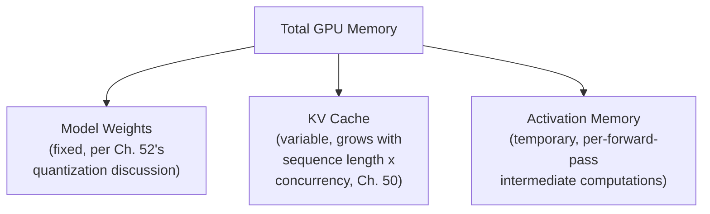
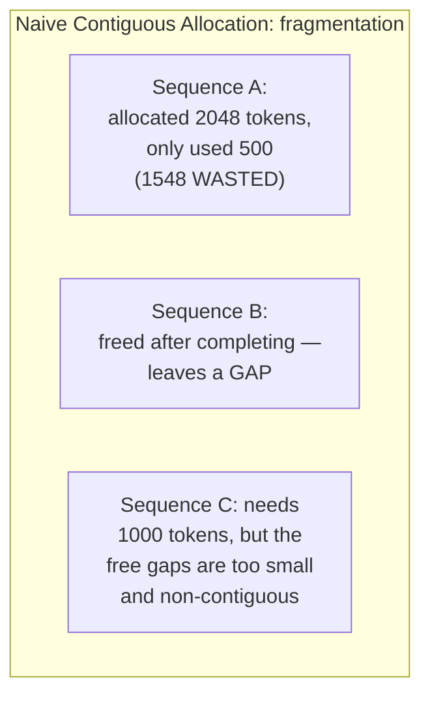
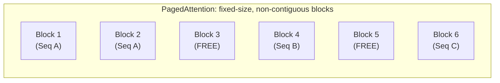
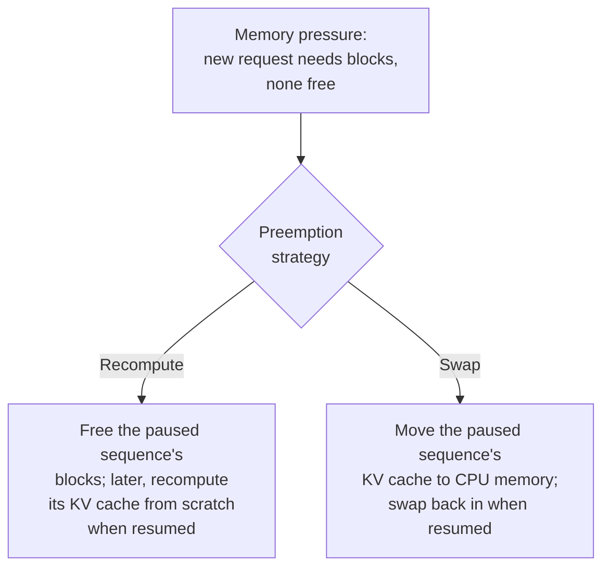

## Introduction

Chapter 52 closed with an open question: what happens when total memory demand exceeds available GPU capacity, even with efficient allocation? This chapter answers it — developing PagedAttention's mechanics in full depth, covering the three-way memory budget every LLM serving system must manage, and addressing the admission-control and eviction strategies a production system needs when demand outstrips supply.

## The Three-Way GPU Memory Budget

Every LLM serving system divides its GPU memory budget across three competing needs:



- **Model weights**: fixed once the model is loaded — this is where quantization (Chapter 28, Chapter 52) directly helps, by reducing this fixed cost.
- **KV cache**: variable and dynamic, growing as sequences lengthen and as more concurrent sequences are served — established in Chapter 50 as typically the *dominant, most variable* consumer of memory, and the focus of this chapter.
- **Activation memory**: temporary memory needed during each forward pass's intermediate computations — generally smaller and more predictable than the KV cache, but not negligible, especially for longer sequences or larger batch sizes.

A serving system's effective capacity is determined by how much memory remains for the KV cache after the (comparatively fixed) weights and (comparatively predictable) activation memory have been accounted for — meaning **KV cache management is the primary lever** for maximizing how many concurrent requests a given piece of hardware can serve.

## PagedAttention: The Mechanics

Chapter 52 introduced PagedAttention conceptually. Here is the mechanism in depth. A naive KV cache implementation allocates a single, contiguous block of memory per sequence, sized for that sequence's maximum possible length — this causes two distinct problems:

1. **Internal fragmentation**: if a sequence ends up shorter than its pre-allocated maximum, the unused portion of that contiguous block is wasted — it can't be used by any other sequence, since it sits in the middle of an allocated block reserved for one specific sequence.
2. **External fragmentation**: as sequences of varying lengths are allocated and freed over time, the GPU's free memory can become a patchwork of small, non-contiguous gaps — even if the *total* free memory would be sufficient for a new sequence, no single contiguous block might be large enough to hold it.



**PagedAttention's solution**: divide the KV cache into fixed-size **blocks** (analogous to memory pages), and allow a single sequence's KV cache to be stored across multiple, **non-contiguous** blocks, tracked via a block table (analogous to a page table) mapping each sequence to its assigned blocks.

```python
class PagedKVCache:
    """
    A simplified illustration of PagedAttention's block-based
    allocation. Real implementations manage this at the CUDA kernel
    level for performance, but the logical structure is exactly this.
    """
    def __init__(self, block_size: int = 16, total_blocks: int = 1000):
        self.block_size = block_size  # tokens per block
        self.free_blocks = list(range(total_blocks))
        self.sequence_block_tables = {}  # sequence_id -> list of block IDs

    def allocate_block_for_sequence(self, sequence_id: str) -> int | None:
        if not self.free_blocks:
            return None  # out of memory — triggers admission control below
        block_id = self.free_blocks.pop()
        self.sequence_block_tables.setdefault(sequence_id, []).append(block_id)
        return block_id

    def free_sequence(self, sequence_id: str):
        # Immediately returns ALL of this sequence's blocks to the free
        # pool — no fragmentation, since blocks are fixed-size and
        # individually, independently reusable by any future sequence.
        freed_blocks = self.sequence_block_tables.pop(sequence_id, [])
        self.free_blocks.extend(freed_blocks)
```

This directly eliminates both fragmentation problems: internal fragmentation is bounded to at most one partially-used block per sequence (rather than potentially an entire, large, mostly-empty contiguous allocation), and external fragmentation is eliminated entirely, since any free block can be assigned to any sequence needing more space, regardless of memory address contiguity.



## What Happens When Memory Demand Exceeds Capacity

Even with PagedAttention's efficient allocation, total memory demand can genuinely exceed what a GPU can provide — this is where admission control and eviction strategies become necessary.

### Admission Control

Before admitting a new request into the active batch, a serving system checks whether sufficient free blocks are available for that request's expected memory needs — if not, the request is **queued** rather than admitted, directly connecting to Chapter 50's continuous batching discussion: the scheduler's admission decision now depends on memory availability, not just batch slot availability.

### Preemption and Swapping

When memory is under severe pressure, some serving systems implement **preemption** — temporarily pausing a lower-priority active sequence, freeing its blocks for a higher-priority or longer-waiting request, and later resuming the paused sequence (either by recomputing its KV cache from scratch, or by swapping it out to CPU memory and back, trading some latency for the ability to serve more requests than would otherwise fit simultaneously).



This is a direct, LLM-serving-specific instance of the general memory-hierarchy trade-off from Chapter 16 — recomputation trades GPU time for memory (cheaper in memory, more expensive in compute when resumed), while swapping trades PCIe transfer bandwidth and latency for memory (data must move between GPU and CPU memory, which is itself not free), and the right choice depends on the specific hardware's relative costs for compute versus data transfer.

## Key Takeaways

- GPU memory for LLM serving divides into three competing needs — model weights (fixed, reduced by quantization), KV cache (variable, typically the dominant and most capacity-limiting consumer), and activation memory (temporary, generally smaller and more predictable).
- Naive, contiguous KV cache allocation suffers both internal fragmentation (wasted space within an over-allocated block) and external fragmentation (free memory scattered into unusable, non-contiguous gaps).
- PagedAttention solves both fragmentation problems by dividing the KV cache into fixed-size, independently-allocatable blocks tracked via a per-sequence block table — directly analogous to operating-system virtual memory paging.
- When memory demand genuinely exceeds capacity, a serving system needs admission control (queuing new requests when insufficient memory is free) and potentially preemption strategies (recomputation or swapping) — a direct, LLM-specific instance of the general memory-hierarchy cost trade-offs from Chapter 16.

---

## Interview Questions

**1. Why is KV cache memory typically described as "the dominant, most variable" consumer of GPU memory in LLM serving, compared to model weights and activation memory?**
Model weights are a fixed cost, determined once the model is loaded and unchanging regardless of how many requests are being served or how long any individual sequence grows (aside from the one-time reduction quantization, Chapter 28/52, can provide); activation memory, needed for each forward pass's intermediate computations, scales with batch size and sequence length but in a comparatively bounded, predictable way tied closely to the model's architecture; KV cache memory, by contrast, grows continuously and without a fixed ceiling as sequences lengthen (per Chapter 38's context window discussion, itself already potentially very large) and multiplies directly with however many concurrent sequences are being served simultaneously (Chapter 50's continuous batching) — this combination of unbounded, request-dependent, concurrency-multiplied growth makes KV cache memory demand the single most variable and, in most realistic high-concurrency or long-context serving scenarios, the largest and most binding memory consumer, directly motivating this chapter's focus on it as the primary memory-management challenge.
*Follow-up: Under what specific scenario might activation memory, rather than KV cache memory, actually become the binding memory constraint instead?*
For a serving scenario involving very large batch sizes of relatively SHORT sequences (where KV cache demand per sequence is modest, and total concurrency is high but not extreme), activation memory's scaling with batch size could become proportionally more significant relative to the comparatively modest KV cache demand from these short sequences — this would be a less typical scenario for most conversational LLM applications (which often involve longer, more variable-length sequences, per Chapter 38), but could plausibly arise in certain high-throughput, short-sequence batch-processing workloads, illustrating that while KV cache memory is the DOMINANT consideration for most realistic LLM serving scenarios this Part has focused on, it's not an absolute, universal law — the specific binding constraint should still be empirically verified (per this series' consistent evaluation discipline) for any given, specific serving workload's actual characteristics.

**2. Explain internal and external fragmentation as they apply to naive, contiguous KV cache allocation, and why PagedAttention's block-based approach eliminates both.**
Internal fragmentation occurs when a sequence is allocated a large, contiguous block of memory sized for its maximum possible length, but the sequence actually turns out to be shorter — the unused portion within that specific, already-allocated block is wasted, since it's reserved exclusively for that one sequence and can't be used by any other sequence even though it's sitting unused; external fragmentation occurs as sequences of varying sizes are allocated and freed over time, leaving the GPU's overall free memory scattered into a patchwork of small, non-contiguous gaps — even if the total free memory across all these gaps would be sufficient for a new sequence's needs, no single gap might be large enough on its own, since a naive contiguous allocator requires one single, unbroken span of memory for each new allocation. PagedAttention's fixed-size, independently-allocatable block approach eliminates internal fragmentation because a sequence only ever wastes, at most, the unused remainder of its single most recently allocated block (a small, bounded amount, proportional to block size, rather than potentially its entire over-provisioned maximum-length allocation) — and it eliminates external fragmentation because any free block, regardless of where it sits in memory, can be assigned to any sequence needing more space, with no requirement for the sequence's blocks to be physically contiguous with each other at all.
*Follow-up: Why does PagedAttention's approach still leave SOME internal fragmentation (bounded to "at most one partially-used block per sequence"), rather than eliminating fragmentation entirely?*
Since each sequence's KV cache still grows by allocating whole, fixed-size blocks (not by allocating memory in arbitrarily small, exactly-fitting increments), a sequence whose actual length doesn't perfectly divide evenly into the block size will have some unused space within its LAST allocated block — for example, if the block size is 16 tokens and a sequence's actual length is 20 tokens, it needs 2 blocks (32 tokens' worth of capacity) but only uses 20, wasting 12 tokens' worth of space within that second block; this remaining, bounded waste (at most one block's worth, per sequence, rather than potentially a much larger amount under naive contiguous allocation) is an accepted, deliberate trade-off in exchange for the much larger fragmentation problems this approach otherwise eliminates — a smaller block size would reduce this remaining internal fragmentation further but at the cost of more block-table management overhead (more, smaller blocks to individually track), representing yet another tunable trade-off in the overall memory-management design.

**3. Why does this chapter describe PagedAttention's block table as "directly analogous to a page table" in operating systems, and what specific operating-system concept does this analogy most directly map to?**
An operating system's virtual memory system uses a page table to map a process's virtual (logical) memory addresses to the actual, physical memory locations where that data is stored, allowing a process's memory to be physically scattered across non-contiguous physical memory locations while still presenting a simple, contiguous logical view to the process itself; PagedAttention's block table serves the exact same conceptual function, but for a sequence's KV cache — mapping a sequence's logical position within its own KV cache (e.g., "this sequence's tokens 17-32") to the actual, physical GPU memory blocks where that data is stored, which can be scattered non-contiguously across the GPU's memory — this analogy maps most directly to the operating system's virtual-to-physical address translation mechanism, which is precisely the mechanism that allows an operating system to manage memory flexibly and efficiently without requiring every process's memory to occupy a single, contiguous physical region, exactly the same benefit PagedAttention provides for KV cache management.
*Follow-up: What's a meaningful difference between PagedAttention's block table and a full operating-system virtual memory system, despite this strong conceptual analogy?*
A full operating-system virtual memory system typically also supports demand paging to disk (moving inactive memory pages out to slower disk storage when physical RAM is full, and bringing them back in when needed again) as a core, foundational feature; PagedAttention's core mechanism, as described in this chapter, primarily addresses efficient allocation and reuse of GPU memory blocks among currently-active sequences, with swapping to CPU memory (this chapter's later discussion of preemption strategies) being a related but somewhat more specialized, LLM-specific additional consideration rather than as deeply and universally integrated into the base PagedAttention mechanism as disk-based demand paging is to a general-purpose operating system's virtual memory system — the analogy is strong and genuinely illuminating for understanding the core allocation mechanism, but shouldn't be extended to assume every feature of a full operating-system virtual memory system has a direct, one-to-one PagedAttention equivalent.

**4. How would you decide the appropriate "block size" for a PagedAttention-style memory management system, given the trade-offs this chapter discussed?**
A smaller block size reduces the maximum possible internal fragmentation per sequence (since a sequence's unused space in its last, partially-filled block is bounded by the block size itself), but increases the total number of blocks needed to represent any given sequence's KV cache, which increases the size and management overhead of the block table itself (more individual block-table entries to track and look up per sequence) and could introduce additional computational overhead in the attention computation itself, which now needs to correctly gather and combine data from potentially many more, smaller, non-contiguous blocks per sequence; a larger block size reduces this block-table and computational overhead but increases the potential internal fragmentation per sequence — I'd determine an appropriate block size empirically, benchmarking actual serving throughput and memory efficiency across a few candidate block sizes for the specific hardware and typical sequence-length distribution in question, following the same "validate a tunable parameter empirically for your specific workload" principle this Part has applied to other parameters like max_batch_size (Chapter 50) and chunk size for chunked prefill (Chapter 51).
*Follow-up: Why might the OPTIMAL block size potentially differ for a workload with mostly very short sequences versus a workload with mostly very long sequences?*
For a workload with mostly short sequences, a larger block size risks a proportionally larger internal fragmentation cost RELATIVE to each sequence's total (short) length — a single partially-wasted large block could represent a significant fraction of that short sequence's total memory footprint; for a workload with mostly long sequences, this same absolute amount of internal fragmentation per sequence represents a much smaller PROPORTION of that sequence's much larger total memory footprint, meaning the relative cost of a larger block size's internal fragmentation is less significant for long-sequence workloads, while the reduced block-table overhead a larger block size provides could offer a proportionally more valuable benefit for these longer sequences with many blocks to track — this kind of workload-dependent trade-off is exactly why empirical validation specific to the actual expected traffic pattern (rather than a single, universal "best" block size) is the right approach, echoing this series' consistent theme.

**5. Why is admission control (queuing a new request rather than admitting it) a necessary complement to PagedAttention's efficient memory allocation, rather than PagedAttention alone being sufficient?**
PagedAttention makes memory allocation efficient and largely fragmentation-free, ensuring that whatever total free memory exists can actually be productively used — but it doesn't and cannot increase the GPU's TOTAL memory capacity itself; if the aggregate memory demand from all currently active AND newly arriving requests genuinely exceeds this fixed total capacity, no allocation scheme, however efficient, can somehow create additional memory out of nothing — admission control is the necessary complementary mechanism that decides what to do in this genuine scarcity scenario (queue the new request until capacity frees up, rather than attempting an allocation that would fail or corrupt existing sequences' data), directly addressing the "what happens when even efficient allocation isn't enough" question this chapter opened with, which is a fundamentally different problem from "how do we allocate available memory efficiently" that PagedAttention itself solves.
*Follow-up: What would likely happen to a serving system's correctness or stability if it had efficient PagedAttention-style allocation but NO admission control at all?*
Without admission control, a serving system might attempt to admit and begin processing a new request even when insufficient free memory blocks are actually available to support its needs — this could result in either an outright allocation failure and crash (if the system doesn't gracefully handle this scenario), or worse, some form of memory corruption or incorrect behavior if the system attempted to proceed with an inadequate memory allocation for the new request without properly checking availability first — admission control's explicit "check availability before admitting" step is precisely the safeguard that prevents a serving system from getting into this kind of unstable, potentially catastrophic scenario, making it a genuinely necessary safety and correctness mechanism, not merely an optional efficiency refinement layered on top of PagedAttention's core allocation efficiency.

**6. Explain the trade-off between "recomputation" and "swapping" as preemption strategies, and how this connects to Chapter 16's memory hierarchy discussion.**
Recomputation frees a paused sequence's memory entirely (returning its blocks to the free pool) and, when that sequence is later resumed, recomputes its entire KV cache from scratch by reprocessing its full prior context through the model again — this is memory-efficient (no memory reserved for a paused sequence at all) but computationally expensive to resume (a full, potentially costly prefill-equivalent recomputation); swapping instead moves a paused sequence's KV cache data out to CPU memory (rather than discarding it and losing the computed values entirely) and moves it back to GPU memory when resumed — this avoids the computational cost of recomputation, but requires data transfer between GPU and CPU memory (across the PCIe bus, or a similar interconnect), which itself takes time and consumes bandwidth, and requires reserving CPU memory capacity for the swapped-out data in the meantime; this is a direct, concrete instance of Chapter 16's memory hierarchy discussion — trading between different tiers of memory (GPU memory, CPU memory, and effectively "recompute from source" as an even more extreme tier) each with different capacity, speed, and cost characteristics, now applied specifically to the question of what to do with a temporarily-paused LLM sequence's KV cache state.
*Follow-up: Under what circumstance would recomputation likely be preferable to swapping, and under what circumstance would swapping likely be preferable?*
Recomputation is likely preferable when the paused sequence's original context (prompt) is relatively short (making the recomputation cost, upon resumption, relatively cheap) or when the interconnect bandwidth between GPU and CPU memory is comparatively slow relative to the GPU's own compute throughput (making the data-transfer cost of swapping comparatively more expensive than simply recomputing); swapping is likely preferable when the paused sequence has a very long context (making recomputation upon resumption expensive) and the GPU-CPU interconnect bandwidth is fast relative to compute (making data transfer cheap relative to recomputation) — the specific, correct choice depends on this ratio between the hardware's actual compute throughput and its actual data-transfer bandwidth, exactly the kind of hardware-specific trade-off calculation Chapter 16's general memory hierarchy discussion established as necessary for reasoning correctly about any specific memory-tier trade-off decision.

**7. In an interview, if asked "how would you handle a situation where your LLM serving system starts rejecting requests during a traffic spike," how would you use this chapter's concepts to structure your answer?**
I'd first diagnose whether the rejection is due to genuine GPU memory exhaustion (this chapter's core topic) or a different bottleneck (raw compute capacity, or a different system component entirely, following the general "isolate the actual bottleneck before proposing a fix" principle from Chapter 26) — if it is genuinely memory-driven, I'd discuss this chapter's admission control mechanism as the correct, expected behavior under genuine memory scarcity (queuing rather than crashing or corrupting), and I'd propose several possible mitigations: verifying PagedAttention-style efficient allocation is actually in use (rather than a naive, fragmentation-prone allocator, Chapter 52's framework discussion), considering quantization (Chapter 52) to free additional memory headroom, considering a preemption strategy (this chapter's recomputation/swapping trade-off) if the system doesn't already implement one, and, if the traffic spike represents a genuine, sustained increase in demand beyond what memory optimization alone can address, considering horizontal scaling (adding more GPU capacity, echoing Chapter 29's general auto-scaling discussion) as the appropriate complementary response.
*Follow-up: Why is it important to first confirm the rejection is genuinely memory-driven, rather than immediately proposing memory-specific fixes?*
If the actual bottleneck is something else entirely (e.g., a network-level rate limiter, an application-level bug, or a different resource constraint like CPU-side request processing overhead unrelated to GPU memory), applying this chapter's memory-specific remediations (quantization, PagedAttention tuning, preemption strategies) would be misdirected effort that fails to address the actual root cause, wasting engineering time on a fix that wouldn't resolve the actual problem — this directly echoes the general "correctly diagnose before remediating" discipline this series has emphasized throughout (e.g., Chapter 32's drift-versus-skew diagnosis, Chapter 48's forgetting-versus-data-quality diagnosis), now specifically applied to this GPU memory context, reinforcing that a strong system design answer always starts with correct diagnosis before proposing a specific remediation.

**8. Why might a serving system need different admission control policies for different PRIORITY levels of requests (e.g., a paying enterprise customer versus a free-tier user), connecting to concepts previewed for Chapter 55's multi-tenant discussion?**
Under genuine memory scarcity (this chapter's core scenario), a serving system might need to make a deliberate business decision about which requests to admit, queue, or even reject when not everyone can be served immediately — treating every request with strictly equal priority (pure first-come-first-served admission) might mean a lower-priority, free-tier request happens to consume the last available memory capacity right before a higher-priority, paying enterprise customer's request arrives, potentially causing that higher-priority customer to experience an unacceptable delay or rejection despite their higher business priority; a more sophisticated admission control policy that accounts for request priority (reserving some memory capacity for high-priority requests, or preferentially admitting them over lower-priority requests when capacity is scarce) directly serves the business need to provide differentiated service levels, which Chapter 55 will develop in full as part of its broader multi-tenant serving and rate-limiting discussion.
*Follow-up: What's a risk of an overly aggressive priority-based admission policy that ALWAYS preempts or rejects lower-priority requests in favor of higher-priority ones, even during only moderate (not severe) memory pressure?*
An overly aggressive priority policy could result in lower-priority (e.g., free-tier) users experiencing consistently poor, unreliable service even during only moderately busy periods (not genuine, severe scarcity), potentially harming the broader user base's experience and trust in the product more than strictly necessary — if the free tier exists specifically to build a broader user base, drive future paid conversions, or serve a genuine strategic purpose, treating it as an unconditionally lowest-priority tier that's aggressively deprioritized at the first sign of even moderate resource contention could undermine that broader strategic goal — this illustrates that priority-based admission control policies need careful, deliberate calibration (informed by the specific business strategy and goals behind having differentiated service tiers in the first place, not purely a technical resource-allocation optimization) rather than a simplistic, purely mechanical "always prioritize the higher tier" rule applied without this broader business context, a nuance Chapter 55 will develop further.

**9. How would you use this chapter's understanding of the three-way memory budget to explain why a model with a longer supported context window (Chapter 38) requires proportionally MORE GPU memory to serve at the same concurrency level, beyond simply "longer context needs more memory"?**
A longer supported context window directly and proportionally increases the maximum possible KV cache size per sequence (per Chapter 50's linear-growth-with-sequence-length discussion), which — per this chapter's three-way budget — means a correspondingly larger share of the GPU's total memory needs to be reserved or made available for KV cache purposes to support requests that actually use this longer context, at any given level of concurrent request capacity; this isn't merely a vague, general "more memory needed" statement — it's a precise, quantifiable relationship (this chapter's linear-per-sequence, multiplied-by-concurrency KV cache growth model) that a system designer can use to calculate exactly how much additional GPU memory (or, conversely, how much REDUCED concurrent-request capacity on the same fixed hardware) a longer context window commitment specifically requires, directly informing capacity planning and hardware provisioning decisions for any system committing to support a specific, advertised maximum context window length.
*Follow-up: How would you use this quantifiable relationship to push back on a product requirement for "unlimited context length" without any further qualification?*
I'd use this chapter's and Chapter 50's mechanics to explain that "unlimited context length," taken literally, would imply unbounded KV cache memory growth per sequence, which no fixed amount of GPU memory could ever accommodate for arbitrarily long sequences — meaning ANY real, practical system must have SOME maximum supported context length, whether the product team explicitly specifies one or not, and an unstated, undefined maximum would mean the SYSTEM (rather than a deliberate, informed product decision) ends up implicitly determining this limit through whatever memory happens to run out first, in an unpredictable, potentially inconsistent way — I'd recommend the product team make an explicit, deliberate choice about a specific, bounded maximum context length, informed by this chapter's quantifiable memory-cost relationship and Chapter 42's cost modeling, rather than leaving this as an undefined, "unlimited" requirement that the underlying physical memory constraints would inevitably and unpredictably violate in practice regardless of the stated aspiration.

**10. Why might a team choose to accept a small amount of increased latency from a preemption/swapping strategy (this chapter) rather than simply rejecting requests outright when memory is under pressure?**
Rejecting a request outright means that request receives no response at all and the user must retry (or simply fails to get service), which is generally a worse user experience and a more direct negative business outcome (Chapter 6) than a request experiencing somewhat increased latency due to being temporarily paused and later resumed via preemption; a preemption strategy allows the system to accept MORE total concurrent requests than its immediately-available memory would otherwise allow (by temporarily pausing some active but lower-priority sequences to make room for others), trading some additional latency for a subset of requests in exchange for higher overall system throughput and fewer outright rejections — this represents a genuine, deliberate trade-off (echoing the general latency-versus-throughput and graceful-degradation principles from earlier in this series, e.g., Chapter 26's caching and Chapter 29's auto-scaling discussions) that a team might reasonably choose to accept specifically to avoid the more severe, more clearly negative outcome of outright rejecting requests during periods of genuine resource contention.
*Follow-up: Why might this trade-off NOT be worthwhile for a use case with an extremely strict, hard real-time latency SLA?*
For a use case where even a modest amount of added latency (from a preemption-induced pause-and-resume cycle) would violate a strict, hard real-time SLA requirement (Chapter 5's latency budget framework, treated as a hard constraint rather than a soft optimization target for this specific use case), accepting this kind of latency variability in exchange for higher overall throughput would directly violate the use case's actual, non-negotiable requirement — for this kind of strict-SLA scenario, a team might instead prefer the simpler, more predictable behavior of outright rejecting a request when capacity is genuinely unavailable (providing a clear, immediate, and predictable failure signal that the calling application can handle explicitly, per general resilience-engineering principles) rather than accepting the less predictable, potentially SLA-violating latency variability that a preemption strategy could introduce for some fraction of requests during periods of resource contention.

**11. How would you use this chapter's memory management discussion to reason about whether a serving system should reserve a fixed "memory safety margin" (never fully utilizing 100% of available GPU memory) rather than attempting to use every last byte of available capacity?**
I'd recommend reserving a deliberate safety margin, since attempting to use literally 100% of available GPU memory leaves no buffer for the natural, expected variability in actual memory usage — a slight, unexpected spike in a particular request's activation memory usage (this chapter's third memory category), a brief period where PagedAttention's block allocation hasn't yet reclaimed some just-freed blocks, or simply the general operational risk of operating at a hard, zero-margin capacity limit, could push the system into an out-of-memory error or crash if no safety margin exists — following the same general "provision with headroom, don't operate at the exact theoretical maximum" principle that Chapter 29's auto-scaling discussion and general systems-engineering practice broadly recommend, this chapter's specific GPU memory context is a clear, direct instance where this same general principle applies, given the genuinely severe consequences (a crashed serving process, potentially affecting many concurrently-active requests at once) of actually exhausting GPU memory entirely.
*Follow-up: How would you determine an appropriate size for this safety margin, rather than choosing an arbitrary percentage?*
I'd determine this empirically by observing the actual, measured variability in memory usage (particularly activation memory, this chapter's more variable-in-practice category, and any observed delays in block reclamation) under realistic production-like traffic conditions, sizing the safety margin to comfortably accommodate the range of variability actually observed (plus some additional conservative buffer) rather than picking an arbitrary, unvalidated percentage — I'd also monitor (per Chapter 33's observability discipline) actual near-miss events (times when utilization approached but didn't quite exceed the safety margin) as an ongoing signal for whether the current safety margin is well-calibrated, adjusting it over time as the system's actual traffic patterns and memory usage characteristics become better understood through this kind of ongoing, empirical observation, rather than treating the initially-chosen safety margin as a permanent, unrevisited constant.

**12. Why might this chapter's admission control and preemption concepts need to interact carefully with the automated retraining and canary deployment concepts from Chapter 34, when a NEW model version is being rolled out?**
During a canary deployment (Chapter 34), a new model version is initially serving only a small percentage of traffic alongside the existing, stable model version — this means the serving infrastructure needs to correctly manage GPU memory allocation across TWO different model versions simultaneously (potentially with different memory footprints, if the new version has a different architecture or has been quantized differently, per Chapter 52), each needing its own share of the available KV cache and weight-storage memory budget, adding a layer of complexity to this chapter's admission control and memory-budgeting logic beyond the single-model scenario this chapter primarily described — the admission control system needs to correctly account for both models' combined memory demands during this transitional canary period, ensuring neither model's serving is inadvertently starved of necessary memory due to the other's presence, a genuinely more complex memory-management scenario than serving a single, stable model version alone.
*Follow-up: How might this added complexity during a canary deployment period specifically affect the appropriate canary traffic percentage chosen for an LLM model rollout, compared to the general canary percentage guidance from Chapter 34?*
Given that running two model versions simultaneously divides the available GPU memory budget between them (rather than the new version simply replacing the old version's full memory allocation), a team might need to choose a more conservative (smaller) initial canary traffic percentage specifically to ensure the new model version has sufficient memory allocated to serve its (small) share of traffic reliably without either model experiencing memory-pressure-induced admission control rejections or degraded performance purely due to this shared-memory constraint during the transitional canary period — this is a genuinely LLM-specific, memory-driven consideration layered on top of Chapter 34's more general canary percentage guidance (which focused primarily on statistical confidence and risk exposure considerations), illustrating how this chapter's GPU memory management concepts can meaningfully interact with and refine the general MLOps deployment practices established earlier in this series when applied specifically to the LLM serving context.

**13. How would you explain to a stakeholder why "we need more GPUs" might not always be the correct response to observing frequent admission control rejections or long request queue times?**
I'd explain that per this chapter's discussion, frequent rejections or queuing could stem from inefficient memory management (fragmentation from a naive, non-PagedAttention-style allocator, per Chapter 52's framework discussion) rather than genuine, irreducible capacity scarcity — if the underlying serving framework or configuration isn't using efficient, paged memory allocation, a significant amount of the GPU's actual physical memory capacity could be wasted to fragmentation, causing rejections and queuing that a more efficient allocation scheme (achievable through better framework choice or configuration, without adding any new hardware at all) could resolve; I'd recommend first auditing and confirming the current serving infrastructure is using efficient, PagedAttention-style memory management and reasonable quantization (Chapter 52) before concluding that additional GPU hardware is genuinely necessary — following this Part's recurring theme (and Chapter 50's earlier "just add more GPUs doesn't automatically solve utilization problems" discussion) that software-level efficiency should generally be verified and optimized before assuming additional hardware investment is the only or best available lever.
*Follow-up: What specific, concrete evidence would definitively demonstrate that additional GPU hardware genuinely IS necessary, rather than a software/configuration inefficiency being the real culprit?*
I'd want to see that, even after confirming efficient PagedAttention-style allocation and appropriate quantization are already properly implemented and correctly configured (ruling out the software-inefficiency explanation), the system's actual, measured memory utilization consistently and genuinely approaches its safety-margin-adjusted capacity limit (this chapter's earlier safety margin discussion) during periods when admission control rejections or queuing are observed — this kind of direct, measured evidence (genuine memory exhaustion under an already-efficient configuration, not merely observed rejections that COULD have multiple possible causes) provides the concrete, specific confirmation needed to justify the additional GPU hardware investment as the genuinely correct, well-evidenced next step, rather than jumping to this more expensive hardware-scaling conclusion based only on the initial, ambiguous symptom (rejections/queuing) without first ruling out the cheaper, software-level explanation this chapter and Chapter 50 have both emphasized checking first.

**14. How would you use this chapter's concepts to design a monitoring dashboard (connecting to Chapter 33's observability discussion) specifically for GPU memory health in an LLM serving system?**
I'd design a dashboard tracking, for each serving instance: the current breakdown of memory usage across this chapter's three categories (model weights, KV cache, activation memory) as a stacked or breakdown view, the current number of free PagedAttention blocks versus total blocks (a direct, concrete measure of available KV cache capacity), the admission control rejection/queuing rate over time (a leading indicator of memory pressure, directly connecting to Chapter 32's alerting discipline — sustained increases in this rate, not just brief transient spikes, warranting investigation or escalation per Chapter 32's alert-fatigue-avoiding "sustained deviation" principle), and, if a preemption strategy is implemented, the rate of preemption events and their resulting added latency impact — providing the specific, structured visibility needed to diagnose exactly which of this chapter's memory-management mechanisms is under pressure or behaving unexpectedly, directly extending Chapter 33's general observability framework with these LLM-serving-specific, memory-focused metrics.
*Follow-up: Why might tracking the "free blocks versus total blocks" metric specifically be more actionable for a serving-infrastructure engineer than a generic "GPU memory utilization percentage" metric alone?*
A generic GPU memory utilization percentage conflates all three of this chapter's memory categories (weights, KV cache, activations) into a single, undifferentiated number, making it hard to tell from that metric ALONE whether high utilization stems from the KV cache genuinely being near capacity (this chapter's primary, most actionable concern) or from some other source; the specific "free PagedAttention blocks versus total blocks" metric directly and unambiguously measures exactly the KV-cache-specific capacity this chapter has established as the typical binding constraint, giving a serving-infrastructure engineer a much more precise, directly actionable signal specifically about KV cache pressure (the metric this chapter's admission control and preemption mechanisms directly respond to) rather than a generic, blended metric that requires additional investigation to determine which specific memory category is actually responsible for any observed high utilization.

**15. How would you summarize, for someone moving on to Chapter 54's cost and latency trade-offs discussion, why this chapter's GPU memory management material is a necessary technical foundation for that next chapter's more business-and-decision-focused treatment?**
Chapter 54 will step back from this chapter's low-level memory mechanics to address the higher-level cost-and-latency trade-off decisions a system designer actually needs to make (how much to invest in additional hardware versus software optimization, how to think about the cost-per-token economics of different serving configurations) — but every one of those higher-level decisions is ultimately grounded in and constrained by this chapter's specific mechanics: how much concurrent-request capacity a given GPU can actually provide (determined by this chapter's memory budget and PagedAttention efficiency), what happens under genuine capacity scarcity (this chapter's admission control and preemption trade-offs), and how quantization and context-window choices (Chapter 52, Chapter 38) directly translate into this chapter's memory budget — without this chapter's concrete, mechanistic grounding, Chapter 54's cost-and-latency trade-off discussion would risk being an abstract, disconnected business discussion rather than one properly grounded in the actual, specific technical mechanisms (established across this entire Part) that determine what trade-offs are genuinely available and what their real, quantifiable costs and benefits actually are.
*Follow-up: What specific quantitative relationship established in this chapter would you expect Chapter 54 to directly build upon for its cost-and-latency analysis?*
I'd expect Chapter 54 to directly build upon this chapter's KV-cache-memory-determines-concurrent-capacity relationship (itself building on Chapter 50's linear-per-sequence, multiplied-by-concurrency growth model) as the technical foundation for calculating cost-per-request or cost-per-token at different serving configurations — since the number of concurrent requests a given piece of hardware can serve (determined by this chapter's memory mechanics) directly determines that hardware's effective throughput, which directly determines the amortized cost-per-request when that hardware's fixed cost (Chapter 42's cost modeling) is spread across its actual, achievable request volume — this specific relationship (memory capacity → concurrent capacity → throughput → cost-per-request) is exactly the kind of chain Chapter 54 would need to build upon and make explicit for its cost-and-latency trade-off analysis to be grounded in genuine, mechanistic understanding rather than treated as an independent, disconnected business calculation.
