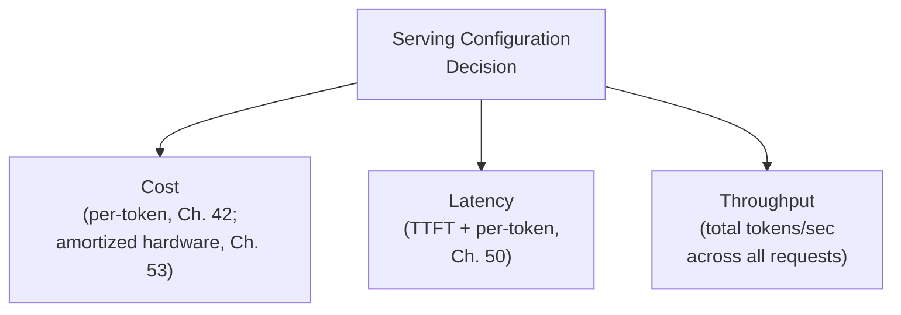
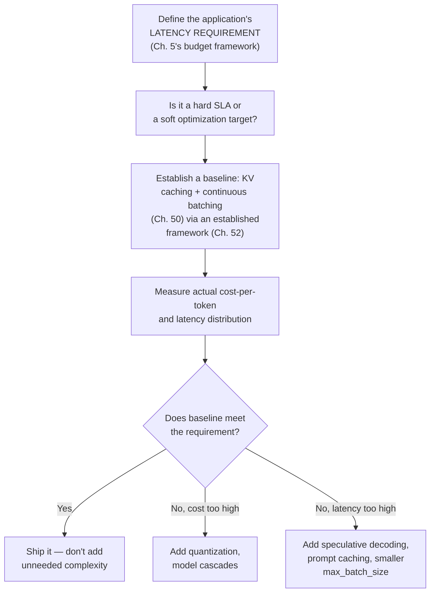

## Introduction

Chapters 50-53 built the mechanics: KV caching, continuous batching, speculative decoding, serving frameworks, and GPU memory management. This chapter synthesizes them into what a system designer actually needs to produce in an interview or real design document: a quantitative framework for reasoning about the **cost-latency-throughput trade-off space** — and a clear methodology for deciding where in that space a given system should sit.

## The Three-Way Trade-off

Every LLM serving configuration decision ultimately trades off between three, often competing, objectives:



Improving one often costs another: a larger `max_batch_size` (Chapter 50) improves throughput but can increase per-request latency under load; a larger, more capable model improves quality but increases both cost and latency (Chapter 40, Chapter 42); aggressive quantization (Chapter 52) reduces cost and can improve capacity, but risks a quality trade-off (Chapter 28) that must be separately validated. There is no universally "optimal" point in this space — the right configuration depends entirely on the specific application's requirements, exactly as this series has argued for every prior trade-off since Chapter 5's latency budgets.

## Building a Cost-Per-Token Model, End to End

This chapter's central quantitative tool combines every relevant mechanic from this Part into a single calculation:

```python
def estimate_cost_per_million_output_tokens(
    gpu_hourly_cost: float,
    achieved_throughput_tokens_per_sec: float,  # empirically measured,
                                                   # reflecting Ch. 50-53's
                                                   # combined efficiency
    utilization_factor: float = 0.85,  # accounts for the safety margin
                                          # and realistic, non-peak
                                          # utilization from Ch. 53
) -> float:
    effective_throughput = achieved_throughput_tokens_per_sec * utilization_factor
    tokens_per_hour = effective_throughput * 3600
    cost_per_token = gpu_hourly_cost / tokens_per_hour
    return cost_per_token * 1_000_000

# Compare two configurations for the SAME model on the SAME hardware:
naive_config = estimate_cost_per_million_output_tokens(
    gpu_hourly_cost=2.50, achieved_throughput_tokens_per_sec=800,  # naive serving
)
optimized_config = estimate_cost_per_million_output_tokens(
    gpu_hourly_cost=2.50, achieved_throughput_tokens_per_sec=3200,  # vLLM + quantization
)
print(f"Naive: ${naive_config:.2f}/M tokens, Optimized: ${optimized_config:.2f}/M tokens")
print(f"Improvement: {naive_config / optimized_config:.1f}x")
```

This single calculation makes concrete something this Part has argued implicitly throughout: **`achieved_throughput_tokens_per_sec` is not a fixed property of a GPU** — it's the direct, measurable output of every decision covered in Chapters 50-53 (continuous batching configuration, KV cache efficiency, quantization, speculative decoding). A 4x difference in this single number, entirely achievable through the techniques this Part has covered, translates directly into a 4x difference in cost-per-token for identical hardware — making this Part's technical content directly, quantifiably relevant to the cost conversations Chapter 42 introduced.

## Where Each Optimization Lever Sits in the Trade-off Space

| Lever | Cost Impact | Latency Impact | When to Prioritize |
|---|---|---|---|
| Continuous batching (Ch. 50) | Reduces cost (better utilization) | Neutral to slightly negative for individual requests under high load | Nearly always — foundational, low-downside |
| Quantization (Ch. 28, 52) | Reduces cost (more capacity per GPU) | Can improve latency (smaller model = faster compute) | Nearly always, once quality validated |
| Speculative decoding (Ch. 51) | Neutral to slightly negative (extra draft model compute) | Improves latency significantly, IF acceptance rate is high | Latency-sensitive applications with a well-matched draft model |
| Model cascades (Ch. 51) | Reduces cost significantly | Can improve OR worsen latency (escalation adds a round-trip) | High-volume applications with genuinely variable query difficulty |
| Larger `max_batch_size` (Ch. 50) | Reduces cost (better utilization) | Can increase per-request latency under load | Throughput-prioritized, latency-tolerant applications |

## A Decision Process for a Specific System



This decision process directly embodies this series' recurring discipline: **establish the simplest, foundational baseline first, measure it against the actual requirement, and add complexity only where a measured gap justifies it** — never adding a Chapter 51 optimization technique because it sounds sophisticated, but only because the baseline's measured performance genuinely falls short of a validated, specific requirement.

## Key Takeaways

- LLM serving decisions trade off between cost, latency, and throughput — there is no universally optimal configuration, only the configuration best suited to a specific application's validated requirements.
- Cost-per-token is not a fixed hardware property; it's the direct output of achieved throughput, which is itself the measurable result of every technique covered in Chapters 50-53 working together (or failing to).
- Different optimization levers occupy different points in the trade-off space — continuous batching and validated quantization are nearly always worth adopting; speculative decoding and model cascades are situational, justified by specific latency or cost gaps.
- The correct process is to establish a simple, foundational baseline, measure it against the application's actual requirement, and add further optimization only where a measured, validated gap justifies the additional complexity.

---

## Interview Questions

**1. Why does this chapter insist that "achieved throughput is not a fixed property of a GPU," and why is this framing important for a system designer?**
A given GPU's theoretical maximum compute and memory capacity are fixed, physical properties — but the ACTUAL, achieved throughput a serving system realizes from that hardware depends entirely on how efficiently the software layer utilizes that capacity: whether continuous batching (Chapter 50) is properly implemented, whether KV cache memory is efficiently allocated via PagedAttention (Chapter 53) rather than wasted to fragmentation, whether quantization (Chapter 52) has freed additional capacity, and whether speculative decoding (Chapter 51) is reducing the number of expensive sequential passes needed — the same physical GPU can produce dramatically different actual throughput numbers depending entirely on these software-level choices, meaning a system designer should never treat "GPU X provides Y tokens/second" as a fixed, hardware-determined fact, but rather as a specific, measured outcome of a specific software configuration that could be substantially improved through the techniques this Part has covered.
*Follow-up: Why might this framing be particularly important to communicate clearly to a non-technical stakeholder evaluating a proposed infrastructure investment?*
A non-technical stakeholder might reasonably assume that achieving better performance or lower cost requires purchasing more or better hardware (a capital expenditure decision they understand well) — clearly communicating that a substantial portion of achievable cost and performance improvement can come from software-level optimization of EXISTING hardware (a comparatively lower-cost engineering investment) helps the stakeholder make a more informed, complete resource-allocation decision, potentially avoiding an unnecessarily large hardware investment when a smaller, more cost-effective software optimization investment could achieve much or all of the same benefit — directly connecting this chapter's technical framing to the practical business decision-making this series has consistently aimed to inform.

**2. Explain why a larger max_batch_size (Chapter 50) can simultaneously REDUCE overall cost while potentially INCREASING individual request latency, and why this represents a genuine trade-off rather than a simple win-win.**
A larger max_batch_size allows more concurrent requests to share the GPU's compute resources, improving overall throughput (more total tokens processed per unit time across all requests) and therefore reducing the amortized cost-per-token (this chapter's cost-per-token formula directly reflects this — higher throughput directly lowers cost-per-token for the same fixed hardware cost); however, since more requests are now sharing the same GPU's compute resources during each individual generation step, each individual request may need to wait slightly longer for its own turn within that step, or the increased memory pressure (Chapter 53) from more concurrent KV caches could introduce additional scheduling overhead — meaning while AGGREGATE throughput and cost-efficiency improve, INDIVIDUAL request latency can worsen, representing a genuine trade-off between these two distinct objectives (aggregate cost-efficiency versus individual-request responsiveness) rather than an unambiguous improvement along both dimensions simultaneously.
*Follow-up: How would you determine whether this specific trade-off is worthwhile for a given application, rather than assuming either "always maximize batch size" or "always minimize batch size for lowest latency"?*
I'd apply this chapter's decision process directly — first establishing the application's actual latency requirement (Chapter 5's budget framework, as either a hard SLA or a softer optimization target) and then empirically testing different max_batch_size values to find the largest value that still keeps measured latency within that validated requirement, maximizing cost-efficiency (throughput) subject to the constraint of not violating the actual, specific latency requirement — rather than either extreme (assuming maximum throughput is always the goal, ignoring latency entirely, or assuming minimum latency is always the goal, ignoring cost-efficiency entirely) which would each be an unjustified, un-empirically-validated assumption about what actually matters for this specific application's real, validated requirements.

**3. Why does this chapter recommend continuous batching and validated quantization as "nearly always worth adopting," while treating speculative decoding and model cascades as more "situational"?**
Continuous batching (Chapter 50) provides throughput and cost benefits with very little meaningful downside for essentially any LLM serving scenario — it doesn't introduce any quality trade-off, and its implementation complexity is largely absorbed by using an established serving framework (Chapter 52) rather than requiring bespoke, per-application engineering effort; validated quantization similarly provides broad, low-downside benefits (freed memory, reduced cost) once its quality impact has been confirmed acceptable for the specific application (Chapter 28's validation discipline) — these two techniques address genuinely universal inefficiencies present in essentially any naive serving setup. Speculative decoding, by contrast, requires a genuinely WELL-MATCHED draft model to provide its benefit (Chapter 51's acceptance-rate discussion) — a requirement that isn't automatically satisfied for every application, and that requires additional engineering investment to establish and validate; model cascades require a genuinely difficulty-VARYING traffic mix to provide their cost benefit (Chapter 51's discussion) — a requirement that also isn't automatically true for every application's specific traffic pattern. These latter two techniques' benefits are conditional on specific, application-dependent circumstances being true, making them appropriately "situational" recommendations requiring case-by-case validation, unlike the more universally-applicable first two techniques.
*Follow-up: Could there be a scenario where even continuous batching or quantization would NOT be worth adopting, despite this chapter's "nearly always" framing?*
For an extremely low-volume application (perhaps a rarely-used internal tool processing only a handful of requests per day) where the engineering effort of properly setting up and validating even a well-established serving framework's continuous batching or a quantization pipeline might exceed the marginal cost savings such a low-volume application would ever realize, a team might reasonably choose the simplest possible unoptimized deployment instead, following this series' consistent "don't add complexity beyond what's genuinely justified by actual, demonstrated need" principle — this remains a genuinely rare exception given how comparatively low the implementation effort for these two techniques typically is (especially when using an established framework, per Chapter 52), which is exactly why this chapter still frames them as "nearly always" (not "universally, unconditionally") worth adopting.

**4. How would you use this chapter's decision process to respond to a stakeholder who asks you to implement speculative decoding "because it makes things faster," without first establishing whether the application actually needs it?**
I'd walk through this chapter's decision process explicitly — first asking what the application's actual, validated latency requirement is (Chapter 5's budget framework) and whether the CURRENT, baseline serving configuration (assuming continuous batching and quantization are already properly implemented, per this chapter's "nearly always" recommendations) already meets that requirement; if the baseline already meets the actual requirement, I'd explain that adding speculative decoding's additional complexity (maintaining a separate, well-matched draft model, per Chapter 51's requirements) wouldn't be justified purely because it "makes things faster" in the abstract, since the application doesn't have a demonstrated, unmet latency need that this additional complexity would actually need to solve — following this series' consistent "escalate complexity only when justified by a measured, validated gap" principle, redirecting the stakeholder's understandable enthusiasm for a specific technique toward the more fundamental question of whether it's actually needed for this specific application's validated requirements.
*Follow-up: What would change your recommendation if the stakeholder could point to specific, measured evidence that the current baseline's latency IS causing a real business problem?*
If there's genuine, measured evidence of a real business impact (e.g., a measured correlation between response latency and user drop-off or dissatisfaction, per Chapter 6's business-metric discipline) demonstrating that the current baseline's latency IS falling short of what the application genuinely needs, I would then proceed to evaluate speculative decoding as a well-justified potential remediation — checking whether a suitable, well-matched draft model is available or could be reasonably created (per Chapter 51's draft-model-quality requirement) for this specific target model and use case, and empirically validating the actual achievable acceptance rate and resulting latency improvement before committing to this specific technique — this represents the exact same decision process, just now correctly triggered by genuine, demonstrated evidence of need rather than a request based purely on the technique's general reputation for being fast.

**5. Why might the SAME optimization technique (e.g., aggressive quantization) be the right choice for one application but the wrong choice for another, even if both applications use the exact same underlying model?**
This chapter's core framework establishes that the right point in the cost-latency-throughput trade-off space depends entirely on the SPECIFIC application's requirements, not on the model alone — an application with a strict, validated quality bar (perhaps a medical or legal domain-adapted application, per Chapter 47, where even a small quality regression from aggressive quantization could be unacceptable given the stakes involved) might reasonably reject an aggressive quantization scheme that a different, more quality-tolerant application (perhaps a casual, low-stakes creative writing assistant) would happily adopt for the exact same underlying base model, specifically because the cost savings and capacity benefits quantization provides are judged, for THIS specific application's specific requirements and risk tolerance, to be worth a small, validated quality trade-off, while the other application's specific requirements judge that same trade-off to be unacceptable — illustrating that these optimization decisions are fundamentally application-specific and requirement-driven, not universal, model-level truths.
*Follow-up: How would you communicate this application-specific nature of these decisions to a platform team that wants to standardize on a single, universal serving configuration for ALL applications using a shared model across the organization?*
I'd explain that while sharing a common BASE model and common foundational infrastructure (Chapter 52's serving framework, Chapter 50's continuous batching) across applications is generally sensible and efficient (avoiding redundant infrastructure investment), the SPECIFIC optimization configuration layered on top (the exact quantization scheme, whether speculative decoding is enabled, the specific max_batch_size) should remain configurable on a PER-APPLICATION basis, since — as this chapter has established — the right configuration genuinely depends on each specific application's own validated latency, cost, and quality requirements, which can legitimately differ even among applications sharing the same underlying model; I'd propose a shared, common infrastructure platform that exposes these specific optimization parameters as application-level configuration options, rather than a single, universally fixed configuration that would force every application into the same trade-off point regardless of whether that point is actually well-suited to each individual application's own specific needs.

**6. In an interview, if given a scenario with an unusually tight latency SLA (e.g., under 200ms total response time) for a moderately complex LLM task, how would you use this chapter's framework to prioritize which optimizations to consider first?**
Given a very tight latency requirement, I'd prioritize latency-focused levers first, per this chapter's decision table — checking whether prompt caching (Chapter 51) can be applied for any shared, repeated prompt prefix to reduce TTFT, evaluating whether a well-matched draft model exists to enable speculative decoding (Chapter 51) for reducing per-token generation latency, and likely favoring a smaller, faster model or a model cascade (Chapter 51) that defaults to a smaller model for most requests specifically to keep the common case comfortably within this tight budget — I'd deprioritize purely throughput/cost-focused levers like maximizing max_batch_size (Chapter 50), since this chapter established that a larger batch size can WORSEN individual request latency, which would be directly counterproductive to this scenario's dominant, binding constraint (the tight latency SLA), even though it would improve aggregate cost-efficiency — correctly prioritizing the specific lever category (latency-focused) that this chapter's framework indicates is most relevant given the scenario's specific, stated binding constraint.
*Follow-up: How would you validate that your proposed combination of optimizations actually achieves the required 200ms SLA, rather than assuming it will based on this chapter's general guidance alone?*
I'd propose building and measuring an actual, working prototype (or at minimum, a carefully-reasoned latency budget decomposition, per Chapter 26's discipline) implementing the proposed combination of techniques, directly measuring the ACTUAL achieved end-to-end latency (TTFT plus generation time, plus any other pipeline stages like retrieval per Part 11) under realistic, representative load conditions — following this series' consistent "validate empirically, don't assume from general principles alone" discipline; if the measured latency doesn't yet meet the 200ms requirement even after applying this chapter's recommended latency-focused levers, I'd iterate further (perhaps needing an even smaller model, more aggressive caching, or reconsidering whether the specific task can be decomposed to avoid needing the full latency-intensive path for every single request) rather than assuming the theoretical application of these techniques automatically and reliably guarantees meeting a specific, hard numerical latency target without this kind of direct, empirical confirmation.

**7. How would you explain the relationship between this chapter's cost-per-token formula and Chapter 42's earlier LLM pricing discussion, given that Chapter 42 focused on API pricing rather than self-hosted infrastructure cost?**
Chapter 42's pricing discussion addressed the cost structure of using a CLOSED-SOURCE API (a fixed, provider-set price per token, reflecting the provider's own internal costs and margin, which are opaque to the API consumer) — this chapter's cost-per-token formula instead addresses the cost structure of SELF-HOSTING (Chapter 41's build-vs-buy alternative), where the "price per token" isn't set by a provider at all, but is instead a DIRECTLY CALCULABLE outcome of your own infrastructure cost (GPU hourly rate) divided by your own achieved throughput (a function of how well you've applied Chapters 50-53's techniques) — these are two different cost models for two different build-vs-buy paths (Chapter 41), and this chapter's formula is specifically the tool needed to calculate the "cost" side of the self-hosting break-even calculation Chapter 42 introduced but deferred the full mechanics of until this Part's deeper serving-optimization content was available to support it.
*Follow-up: How would you use both chapters' cost models together to make a complete, evidence-based decision about whether to switch from a closed-source API to self-hosting for a specific, growing application?*
I'd use Chapter 42's API pricing model to calculate the current, ongoing cost of continuing with the closed-source API at the application's actual and projected traffic volume, and I'd use this chapter's cost-per-token formula — informed by empirically measuring achievable throughput using the specific self-hosting configuration and optimization techniques from Chapters 50-53 that I'd actually plan to implement — to calculate the projected cost of the self-hosting alternative at that same volume; comparing these two cost projections directly gives the concrete, evidence-based break-even analysis Chapter 41 and Chapter 42 both pointed toward, now fully grounded in this chapter's realistic, achievable self-hosting cost-per-token figure (reflecting genuinely achievable optimization, not a naive, unoptimized baseline that would make self-hosting look artificially more expensive than it needs to be).

**8. Why might a team that has successfully reduced their cost-per-token through the optimizations in this Part still see their TOTAL LLM infrastructure spending increase over time, and why would this not necessarily indicate a failure of these optimization efforts?**
If the application's total request volume (and therefore total tokens processed) grows faster than the rate of cost-per-token reduction achieved through optimization, total spending can still increase even while cost-EFFICIENCY (cost per unit of actual work done) genuinely improves — this is analogous to a manufacturing process becoming more cost-efficient per unit produced while total costs still rise because production volume has grown even faster than that efficiency gain; a team should track and report BOTH total spending (relevant for overall budget planning) AND cost-per-token or cost-per-request (the more meaningful measure of whether this chapter's optimization efforts are genuinely succeeding), since conflating these two distinct metrics could lead to an incorrect, discouraging conclusion that optimization efforts have "failed" simply because total spending increased, when the more relevant, efficiency-focused metric may show clear, genuine, and successful improvement.
*Follow-up: How would you present this distinction to a finance-focused stakeholder who is primarily concerned with the TOTAL spending trend, to help them correctly interpret a scenario where total spending is rising despite genuine efficiency improvements?*
I'd present both metrics side by side with clear context — showing the cost-per-token or cost-per-request trend declining (demonstrating the genuine value of the engineering optimization investment) alongside the total request volume trend growing (explaining, with this specific growth context, why total spending is still rising despite this efficiency improvement) — framing the situation not as "spending is out of control" but as "the unit cost of our work has meaningfully decreased, and total spending growth reflects genuine, presumably desired business growth in usage/demand, not an efficiency failure" — this kind of clear, appropriately-decomposed metric presentation helps a finance-focused stakeholder correctly interpret what's actually happening, rather than drawing an incorrect conclusion from the total spending number viewed in isolation, without this necessary efficiency-versus-volume decomposition.

**9. How would you use this chapter's trade-off framework to design an experiment (connecting to Chapter 22's A/B testing discipline) validating whether a proposed latency optimization actually improves a real business metric, not just a technical latency measurement?**
I'd design a randomized experiment comparing the current baseline serving configuration against the proposed optimized configuration (e.g., with speculative decoding enabled), following Chapter 22's full experimental rigor — measuring not just the technical latency improvement itself (confirming the optimization achieves its intended technical effect) but also a genuine business or user-experience metric (Chapter 6) that the latency improvement is theorized to actually affect, such as user engagement, task completion rate, or conversion, depending on the specific application — since this chapter has established that optimizing a technical metric (latency) is only valuable insofar as it actually serves a genuine underlying business goal, directly applying the proxy-metric discipline first established in Chapter 6 to this specific LLM-serving-optimization context, rather than assuming a measured technical improvement automatically and necessarily translates into a meaningful, validated business benefit.
*Follow-up: Under what circumstance might a technically successful latency optimization show NO measurable improvement in the associated business metric, and how would you interpret this result?*
If the application's current latency, even before the optimization, was already comfortably within the range where users don't perceive or care about further reductions (echoing the general diminishing-returns concept from Chapter 40, now applied to user-perceived latency sensitivity rather than model capability), a technically successful, measurable latency improvement might simply not translate into any additional, measurable business benefit, since users weren't meaningfully bothered by the pre-optimization latency in the first place; this would be an important, informative result suggesting that further investment in this specific latency optimization direction may not be well-justified by actual business value, even though the underlying technique itself is genuinely working as intended from a pure engineering perspective — reinforcing, once again, that a measured technical improvement and a genuine, validated business benefit are two distinct things that should both be explicitly confirmed, not conflated or assumed to be equivalent.

**10. Why might a system designer need to reconsider their chosen cost-latency-throughput trade-off point periodically, rather than treating an initial, well-justified configuration decision as permanent?**
The underlying inputs to this chapter's trade-off calculations are all genuinely dynamic over time — GPU hardware costs and capabilities continue to evolve (Chapter 40's broader efficiency-trend discussion), serving framework implementations continue to improve (Chapter 52's frameworks receiving ongoing development), and the application's own actual traffic patterns and business requirements can shift (potentially changing the actual, validated latency requirement or cost sensitivity that originally informed the trade-off decision) — a configuration that was well-justified and optimal at one point in time, given the specific technology and business context available then, may no longer represent the best achievable point in the trade-off space once these underlying factors have meaningfully changed, directly echoing the general "periodically revisit infrastructure and build-vs-buy decisions" discipline this series has recommended throughout (Chapter 34's threshold recalibration, Chapter 41's periodic build-vs-buy reconsideration, Chapter 48's regression suite evolution).
*Follow-up: What specific, concrete triggers would you recommend a team use to decide WHEN to revisit their LLM serving configuration, rather than relying on an arbitrary, fixed schedule alone?*
I'd recommend triggers tied to genuine, concrete changes — a new major version release of the serving framework being used (Chapter 52), a new, significantly more capable or efficient GPU generation becoming available and cost-effective, a meaningful shift in the application's own measured traffic patterns or business requirements (perhaps growth crossing a threshold that changes the cost-benefit calculus for a previously-unjustified optimization technique, per this chapter's decision process), or the availability of a new, more capable base model that might change the underlying model-selection decision entirely (Chapter 40-41) — combined with a periodic, scheduled baseline review (perhaps annually, echoing Chapter 41's periodic build-vs-buy review cadence) as a backstop to catch gradual, cumulative changes that might not correspond to any single, sharply-defined triggering event, ensuring the configuration doesn't drift into being suboptimal purely through inertia and the passage of time without any specific triggering event to prompt a deliberate reconsideration.

**11. How would you use this chapter's material to explain why "we optimized our LLM serving and cut costs by 75%" is an impressive but INCOMPLETE claim, without further context?**
I'd want to know what BASELINE this 75% reduction was measured against — if the baseline was a genuinely naive, unoptimized implementation (no continuous batching, no quantization, using a naive contiguous KV cache allocator), a 75% cost reduction from simply adopting this Part's foundational, "nearly always worth it" techniques (Chapter 50's continuous batching, Chapter 52's quantization and established framework) would represent a valuable but fairly expected, achievable improvement, not necessarily a sign of unusually sophisticated or hard-won optimization work; if the baseline was already a reasonably well-optimized configuration, and the 75% reduction came from something more advanced or effortful (careful speculative decoding tuning, a well-designed model cascade, per Chapter 51), that would represent a more genuinely impressive, harder-won achievement — this chapter's framework provides the specific vocabulary and decomposition needed to ask this clarifying question and correctly interpret the SIGNIFICANCE of a given optimization claim, rather than taking an impressive-sounding percentage at face value without this necessary context about what specifically was compared against what.
*Follow-up: What ADDITIONAL information, beyond the baseline comparison, would you want to know to fully evaluate whether this cost reduction claim represents a genuinely well-validated, sustainable improvement?*
I'd want to confirm that any quality-affecting techniques involved (quantization, in particular) were properly validated for acceptable quality impact (per Chapter 28's discipline) rather than the cost reduction coming at an undisclosed, unvalidated quality cost, and I'd want to confirm the reported cost reduction reflects genuine, sustained production performance under realistic traffic conditions (per this chapter's empirical-validation discipline) rather than a favorable but potentially non-representative benchmark or synthetic test scenario — a genuinely complete, trustworthy claim of this kind should be accompanied by both a clear baseline comparison AND confirmation that any relevant quality trade-offs were properly measured and found acceptable, and that the improvement has been validated under real, representative production conditions rather than only under idealized testing conditions that might not fully transfer to actual production reality.

**12. How would you use this chapter's decision process to handle a situation where a proposed optimization technique would improve cost efficiency but the team lacks the specific expertise needed to implement and validate it correctly (e.g., speculative decoding without ML systems expertise)?**
I'd factor this "team capability" consideration into the decision process directly, alongside the purely technical cost-benefit calculation — even if a technique like speculative decoding would theoretically provide a meaningful benefit for this application (per a validated need, following this chapter's earlier decision process), attempting to implement it without the requisite specialized expertise (correctly selecting and validating a well-matched draft model, correctly implementing the acceptance-probability mechanics, per Chapter 51) introduces a genuine risk of an incorrect, poorly-validated implementation that could fail to provide the expected benefit or, worse, introduce subtle correctness bugs — I'd recommend either investing in building this specific expertise (training, hiring, or engaging specialized consulting support) before attempting this specific technique, or deprioritizing it in favor of techniques the team can currently implement and validate with genuine confidence and competence (like adopting an established serving framework's built-in continuous batching and quantization support, which requires considerably less specialized, bespoke expertise to correctly apply, per Chapter 52's discussion).
*Follow-up: Why might relying on an established serving framework's BUILT-IN implementation of a more advanced technique (like a framework's own speculative decoding support, if available) meaningfully reduce this specific expertise-gap risk, compared to a from-scratch custom implementation?*
An established, widely-used serving framework's built-in implementation of a technique like speculative decoding has already had the specialized correctness and performance validation work done by the framework's own maintainers and a broad community of users (echoing this chapter's earlier discussion of vLLM/TGI as validated, battle-tested implementations of Chapters 50-51's techniques) — a team lacking deep, specialized ML systems expertise can often still safely and effectively USE such a built-in feature (configuring and validating it for their specific application) without needing the same depth of expertise that would be required to correctly IMPLEMENT that same technique entirely from scratch — this is precisely the same build-vs-buy logic this chapter and Chapter 52 have both emphasized, now specifically applied to resolving this particular expertise-gap concern: using an established framework's built-in support for an advanced technique can make that technique accessible to teams who couldn't safely or effectively build a correct, well-validated implementation of it entirely on their own.

**13. How would you use this chapter's cost-per-token model to make a case for or against investing engineering time in a specific optimization technique, when that engineering time itself has a real, quantifiable cost?**
I'd calculate the projected cost-per-token reduction the optimization would provide (using this chapter's formula, based on the expected improvement to achieved throughput), multiply this by the application's expected token volume over a relevant time period (e.g., the next year) to get the projected total cost savings, and compare this against the estimated engineering time cost required to implement, validate, and maintain the optimization (translated into a comparable monetary cost, using standard engineering cost accounting) — if the projected savings clearly and substantially exceed the engineering investment cost within a reasonable payback period, the optimization is well-justified on pure cost-benefit grounds; if the projected savings are marginal or would take an unreasonably long time to pay back the engineering investment, this provides clear, quantified evidence that the engineering time might be better allocated to a different priority, following the same kind of explicit ROI-based reasoning this series has recommended for other similar infrastructure investment decisions throughout (e.g., Chapter 31's CI/CD/CT investment justification, Chapter 34's automation investment sequencing).
*Follow-up: Why might this kind of purely cost-focused ROI calculation still be insufficient on its own, missing an important consideration this chapter and other parts of this series have raised?*
This purely cost-focused calculation doesn't account for the LATENCY or QUALITY dimensions of this chapter's three-way trade-off — an optimization might have a marginal, hard-to-justify pure cost-savings ROI on its own, but could still be well-justified if it also provides a meaningful latency improvement that serves a genuine, validated business need (per Chapter 6's business-metric discipline and this chapter's broader decision process), meaning a complete evaluation should consider the FULL value the optimization provides across all three dimensions (cost, latency, and any quality implications), not cost savings in isolation — a purely cost-focused ROI calculation, while a valuable and necessary part of the overall evaluation, shouldn't be treated as the sole, complete basis for the final investment decision without also considering these other genuinely relevant dimensions this chapter's broader framework has established as part of the complete trade-off space.

**14. How would you use this chapter's synthesis of Chapters 50-53 to structure the OPENING of your answer to a comprehensive "design an LLM serving system" interview question, before diving into any specific technique?**
I'd open by explicitly naming this chapter's three-way trade-off space (cost, latency, throughput) and stating that the specific optimization techniques I'd recommend depend entirely on where this specific application's requirements place it within that space — then I'd ask a clarifying question (following Chapter 2's framework) about the application's specific latency requirements (a hard SLA or a softer target) and expected traffic volume and pattern, using the answer to inform which of this chapter's decision-table levers (continuous batching and quantization as a near-universal baseline; speculative decoding, model cascades, or aggressive batch-size tuning as situational additions) I'd actually recommend and in what priority order — this opening framing immediately signals to the interviewer that I understand this isn't a "list every optimization technique you know" question, but a "correctly diagnose the specific requirements, then select the appropriately-justified subset of techniques" question, exactly the discipline this chapter has built toward as Part 10's synthesis and capstone.
*Follow-up: Why might opening with this explicit trade-off framing be a stronger interview strategy than immediately describing KV caching and continuous batching in technical detail?*
Immediately diving into technical details like KV caching without first establishing this higher-level decision framework risks the interviewer perceiving the answer as a memorized recitation of known techniques rather than a genuinely reasoned, requirements-driven design process — opening with the trade-off framework and a clarifying question first demonstrates the more senior-level skill of correctly scoping a problem and identifying what specific information is needed to make a well-justified recommendation, BEFORE diving into implementation-level technical details, exactly the same "clarify before diving in, don't jump straight to solutioning" discipline Chapter 2 established as foundational to a strong system design answer at the very start of this entire series — providing a much stronger, more structurally sound impression to an interviewer than launching directly into technical details without this necessary opening framing and clarification step.

**15. How would you summarize, for someone completing Part 10 and moving into Part 11's RAG chapters, why this chapter's synthesis is a fitting close to this Part, and what specific carry-over concept from this Part will be most directly relevant to Part 11's opening content?**
This chapter closed Part 10 by synthesizing every preceding chapter's technical mechanics into a single, actionable, requirements-driven decision framework — exactly the kind of integration this series has consistently used to close out each major Part (Chapters 30, 35, 43, and 49 all served this same synthesizing role for their respective Parts) — leaving the reader equipped not just with a list of LLM serving techniques, but with the judgment to know when and why each one applies to a specific system's specific requirements; Part 11 will shift focus to RAG and retrieval systems, and the single most directly relevant carry-over concept is this chapter's (and Chapter 53's) KV-cache-memory-and-context-length relationship — since RAG's core mechanism involves retrieving and including external context directly into the LLM's prompt, every one of Part 11's chunking, retrieval, and re-ranking design decisions will have a DIRECT, quantifiable cost and capacity impact through exactly the mechanisms this Part has established (Chapter 38's context window, Chapter 50's KV cache growth, this chapter's cost-per-token model), making this Part's material not a separate, already-concluded topic, but an active, ongoing constraint that Part 11's RAG system design must explicitly account for throughout.
*Follow-up: What specific question would you recommend a reader carry forward from this chapter into Part 11's discussion of how much context to retrieve for a given RAG query?*
I'd recommend carrying forward the question: "given this chapter's cost-per-token model and Chapter 53's KV-cache-memory-determines-concurrent-capacity relationship, what is the marginal cost — in both direct token cost (Chapter 42) and reduced serving capacity (this chapter, Chapter 53) — of retrieving and including one additional chunk of context, and does the marginal QUALITY benefit of that additional chunk genuinely justify this marginal, quantifiable cost?" — this question directly applies this Part's complete cost-and-capacity framework to what will be one of Part 11's most central, recurring design decisions (how much context to retrieve and include), ensuring the reader approaches that upcoming material with this Part's quantitative, requirements-driven discipline already fully internalized, rather than treating RAG's retrieval-quantity decision as a purely quality-focused question disconnected from the cost and capacity considerations this entire Part has worked to establish as equally essential.
