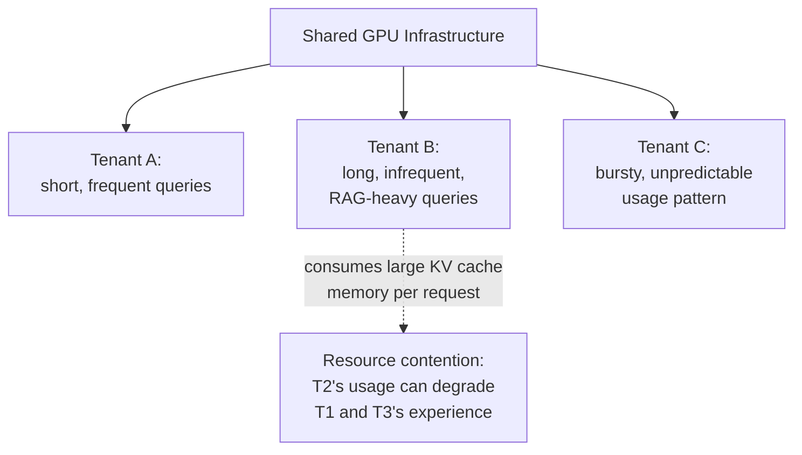
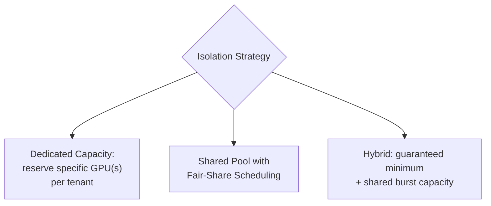

## Introduction

Chapter 53 flagged, in its priority-admission-control discussion, that a serving system often needs to treat different requests differently — a paying enterprise customer versus a free-tier user. This chapter develops that concern fully: how to serve **multiple tenants** (customers, applications, or internal teams) from **shared LLM infrastructure**, fairly and safely, without one tenant's usage degrading another's experience — and how to rate-limit in a way that reflects Chapter 38's central lesson that tokens, not requests, are the real unit of cost and consumption.

## Why Multi-Tenancy Is Harder for LLMs Than for Classical Services

Chapter 55-style multi-tenant concerns aren't new to this series — but LLM serving's specific characteristics (established throughout Part 10) make the problem meaningfully harder than for a typical classical web service:

- **Variable, unpredictable resource consumption per request**: Chapter 50 established that LLM requests vary enormously in resource cost — a short factual query and a long, RAG-heavy document summarization request consume wildly different amounts of GPU time and KV cache memory, unlike a classical API's typically-uniform per-request cost.
- **Shared, scarce GPU memory**: Chapter 53 established that GPU memory (specifically KV cache capacity) is often the binding constraint — one tenant's heavy, long-context usage can directly reduce the memory available for every other tenant sharing that same GPU, a form of resource contention with no direct classical-web-service equivalent.
- **Token-based cost, not request-based cost**: Chapter 42 established that LLM cost scales with tokens processed, not request count — meaning a fair, cost-reflective rate-limiting scheme must account for token volume, not simply request frequency.



## Token-Based Rate Limiting

Directly following from Chapter 42's cost model and Chapter 38's tokenization discussion: a rate limit expressed purely in **requests per second** fails to reflect actual resource consumption — a tenant sending many short requests and a tenant sending few very long requests could consume wildly different amounts of actual compute and memory while appearing identical under a request-count-based limit.

```python
from dataclasses import dataclass, field
from collections import deque
import time

@dataclass
class TokenBucketRateLimiter:
    """
    A token-bucket rate limiter operating on TOKEN volume, not
    request count — directly reflecting Ch. 42's cost model rather
    than the classical, request-count-based rate limiting common
    in non-LLM API design.
    """
    tokens_per_minute_limit: int
    bucket: float = field(init=False)
    last_refill: float = field(default_factory=time.monotonic, init=False)

    def __post_init__(self):
        self.bucket = self.tokens_per_minute_limit

    def _refill(self):
        now = time.monotonic()
        elapsed_minutes = (now - self.last_refill) / 60
        self.bucket = min(
            self.tokens_per_minute_limit,
            self.bucket + elapsed_minutes * self.tokens_per_minute_limit,
        )
        self.last_refill = now

    def try_consume(self, estimated_tokens: int) -> bool:
        self._refill()
        if self.bucket >= estimated_tokens:
            self.bucket -= estimated_tokens
            return True
        return False  # rejected — over the tenant's token budget
```

**A key practical wrinkle**: the exact token count for a request's *output* isn't known until generation completes (Chapter 39's variable response lengths) — a production rate limiter typically must **estimate** expected token usage upfront (based on the input length and a configured or historical average output length) to make an admission decision before generation begins, then reconcile the actual usage afterward, directly connecting to the general "advance length estimation is genuinely hard" problem Chapter 50 raised in its scheduling discussion.

## Tenant Isolation Strategies



- **Dedicated capacity**: reserve specific GPU instances exclusively for a specific tenant — provides the strongest isolation guarantee (no tenant can affect another at all) but is the least cost-efficient, since a tenant's dedicated capacity sits idle whenever their actual usage is below their reserved allocation, directly echoing Chapter 29's general discussion of dedicated-versus-shared infrastructure trade-offs, now specifically in the LLM serving context.
- **Shared pool with fair-share scheduling**: all tenants share the same GPU pool, with the scheduler (extending Chapter 50's continuous batching admission logic) ensuring no single tenant can monopolize the shared capacity — more cost-efficient (better aggregate utilization, since idle capacity from one tenant can be used by another) but requires more sophisticated scheduling logic to guarantee fairness.
- **Hybrid**: guarantee each tenant a minimum reserved capacity (ensuring a baseline quality of service even under contention) while allowing tenants to burst into shared, unreserved capacity when available — a common, practical middle ground balancing isolation guarantees against cost efficiency, directly analogous to reserved-versus-on-demand capacity patterns from general cloud infrastructure design.

## Priority-Aware Admission Control (Extending Chapter 53)

```python
from enum import IntEnum

class TenantPriority(IntEnum):
    FREE_TIER = 0
    STANDARD = 1
    ENTERPRISE = 2

def admit_request(request, current_memory_pressure: bool, tenant_priority: TenantPriority):
    """
    Extends Ch. 53's admission control with tenant-priority awareness —
    directly addressing the business need Ch. 53 flagged but deferred.
    """
    if not current_memory_pressure:
        return True  # plenty of capacity — admit everyone equally

    # Under memory pressure, reserve capacity preferentially for
    # higher-priority tenants, per Ch. 53's business-driven admission
    # control discussion.
    if tenant_priority >= TenantPriority.STANDARD:
        return True
    return False  # free-tier requests queue or are rejected under pressure
```

This directly extends Chapter 53's admission control mechanism with the tenant-priority dimension it flagged but didn't develop — and directly connects to Chapter 53's closing caution: this kind of priority scheme should be calibrated deliberately against actual business strategy (how aggressively should free-tier service degrade under load, given its role in the broader product strategy), not applied as a blunt, unconditional rule.

## Key Takeaways

- Multi-tenant LLM serving is harder than classical multi-tenant serving because per-request resource consumption is highly variable, GPU memory (KV cache) is a shared and scarce resource, and cost scales with tokens, not requests.
- Rate limiting should be denominated in tokens, not requests, directly reflecting Chapter 42's cost model — requiring upfront token estimation since actual output length isn't known until generation completes.
- Tenant isolation exists on a spectrum from dedicated capacity (strongest isolation, least cost-efficient) to a shared pool with fair-share scheduling (most cost-efficient, requires more sophisticated scheduling) to a hybrid guaranteed-minimum-plus-burst model.
- Priority-aware admission control, extending Chapter 53's mechanism, should be calibrated deliberately against actual business strategy for how different tenant tiers should be treated under resource contention, not applied as an unconditional, one-size-fits-all rule.

---

## Interview Questions

**1. Why is request-count-based rate limiting insufficient for a multi-tenant LLM API, and why does this connect directly to Chapter 42's cost modeling?**
Chapter 42 established that LLM cost and resource consumption scale with the number of TOKENS processed, not the number of requests — a tenant sending 100 very short requests and a tenant sending 10 very long, RAG-heavy requests could consume dramatically different amounts of actual compute and memory resources while appearing identical or even inverted under a purely request-count-based rate limit (the second tenant, sending far fewer requests, could actually be consuming far MORE total resources); a rate-limiting scheme that doesn't account for this token-volume reality risks either unfairly restricting a tenant sending many small, cheap requests while allowing a tenant sending fewer but much more resource-intensive requests to consume a disproportionate, unfair share of shared infrastructure capacity, directly undermining the fair and cost-reflective resource allocation multi-tenant serving is meant to provide.
*Follow-up: Why might a hybrid rate-limiting scheme, combining BOTH a request-count limit and a token-volume limit, sometimes be preferable to a pure token-volume-only limit?*
A pure token-volume-only limit could still allow a tenant to send an extremely large NUMBER of very small requests (each individually consuming few tokens but collectively imposing significant per-request overhead — connection handling, scheduling overhead, per Chapter 50's discussion of the bookkeeping cost of managing many concurrent requests) that might strain the serving system's request-handling capacity in ways not fully captured by pure token volume alone; combining both a token-volume limit (reflecting Chapter 42's actual resource-consumption cost model) and a secondary, generally more generous request-count limit (as a backstop against this kind of many-small-requests strain on request-handling overhead specifically) provides more complete protection against both forms of potential resource strain than either limit alone would provide.

**2. Explain why estimating a request's expected token usage BEFORE generation begins is necessary for rate limiting, and why this estimation is inherently imperfect, connecting to Chapter 50's scheduling discussion.**
A rate limiter needs to make an admission decision (admit or reject/queue this request) at the time the request arrives, before any generation has occurred — but the actual total token usage (particularly the OUTPUT token count) isn't definitively known until generation has actually completed, since Chapter 39 established that response length is determined dynamically by the model itself during generation, not fixed or knowable in advance; this forces the rate limiter to rely on an ESTIMATE (based on the known input length and some assumption or historical average about likely output length) to make its admission decision, which is inherently imperfect — directly echoing Chapter 50's discussion of why accurately estimating generation length in advance is a genuinely difficult problem, now applied specifically to the rate-limiting context rather than the scheduling-priority context Chapter 50 originally raised it in.
*Follow-up: How would you handle the reconciliation between an estimated token usage (used for the initial admission decision) and the actual, final token usage (known only after generation completes), for accurate tenant billing or quota tracking?*
I'd implement a two-phase accounting approach — using the upfront estimate to make the immediate admission decision and provisionally reserve that estimated amount against the tenant's quota/rate-limit bucket, then, once generation actually completes and the true token usage is known, reconciling the tenant's actual quota consumption to reflect the REAL usage (crediting back any difference if the estimate was too high, or debiting further if the estimate was too low) — ensuring the tenant's rate-limit bucket and any associated billing accurately reflect true, final usage over time, even though the real-time admission decision necessarily had to rely on an imperfect upfront estimate; this two-phase approach (estimate for admission, reconcile after actual completion) is a common, practical pattern for handling exactly this kind of "must decide before the true cost is known" scenario.

**3. Why does dedicated capacity provide the "strongest isolation guarantee" among the tenant isolation strategies, and what specific cost inefficiency does this strength come with?**
Dedicated capacity means a specific GPU (or set of GPUs) is reserved exclusively for one tenant's use, with no other tenant able to submit requests that would compete for or consume that same reserved capacity — this provides an absolute, structural guarantee that one tenant's usage pattern (however heavy, bursty, or resource-intensive) can never directly degrade another tenant's experience, since there's no shared resource contention possible at all between tenants using entirely separate, dedicated hardware; the direct cost inefficiency this strength introduces is that this dedicated capacity sits IDLE (and is still being paid for, per Chapter 42's cost modeling) during any period when that specific tenant's actual usage falls below their full reserved capacity — unlike a shared pool, where one tenant's idle capacity can be immediately and automatically utilized by another tenant's demand, dedicated capacity's idle periods represent pure, unrecoverable waste specific to that one tenant's own usage pattern.
*Follow-up: For which specific kind of tenant or use case would this cost inefficiency be MOST tolerable, making dedicated capacity a reasonable choice despite this trade-off?*
A tenant with very high, consistently sustained usage (minimal idle periods, meaning the dedicated capacity is genuinely well-utilized most of the time, minimizing the waste from idle periods) or a tenant with a specific, non-negotiable contractual or regulatory requirement for guaranteed, isolated capacity (where the strong isolation guarantee itself is a required deliverable, not merely a preference, making the cost inefficiency an accepted, necessary cost of meeting that specific hard requirement) would make dedicated capacity's cost trade-off most tolerable — for a smaller, more variable, or lower-priority tenant without either of these specific characteristics, the cost inefficiency of dedicated capacity would generally be harder to justify compared to a more cost-efficient shared-pool or hybrid approach.

**4. How does a hybrid isolation model (guaranteed minimum plus shared burst capacity) attempt to capture the benefits of both dedicated and shared-pool approaches, and what's the key trade-off it still involves?**
The guaranteed minimum component provides each tenant a baseline level of assured capacity, similar in spirit to dedicated capacity's strong isolation guarantee, ensuring no tenant's basic service level can be completely crowded out by another tenant's heavy usage even under contention; the shared burst capacity component allows tenants to access additional, otherwise-idle capacity beyond their guaranteed minimum when it's available, capturing much of shared-pool's cost efficiency (idle capacity from one tenant's guaranteed-but-unused allocation can still be productively used by another tenant's burst demand, rather than sitting entirely dedicated and idle) — the key trade-off this hybrid model still involves is that the STRENGTH of isolation is now intermediate rather than absolute: a tenant is still guaranteed their reserved minimum (a real, meaningful isolation guarantee), but their ability to burst BEYOND that minimum is not guaranteed and can genuinely be affected by other tenants' simultaneous burst demand, meaning the hybrid model doesn't provide the same complete, unconditional isolation guarantee that fully dedicated capacity would for usage beyond each tenant's specific guaranteed minimum.
*Follow-up: How would you determine an appropriate "guaranteed minimum" allocation for a specific tenant, balancing their need for reliable service against the shared pool's overall cost efficiency?*
I'd base the guaranteed minimum on the tenant's typical, sustained baseline usage pattern (perhaps their median or a lower percentile of their historical usage, ensuring their normal, everyday usage is comfortably covered by the guarantee) rather than their peak or burst usage (which would be better served by the shared burst capacity component instead) — sizing the guarantee generously enough to provide genuine, meaningful reliability for the tenant's normal operations, while keeping it modest enough (relative to their occasional peaks) that a meaningful portion of their total capacity need still flows through the more cost-efficient shared burst pool, striking the same kind of empirically-informed, workload-specific balance this series has recommended for other similar capacity-sizing decisions throughout (e.g., Chapter 29's auto-scaling threshold calibration).

**5. Why should a priority-aware admission control scheme (this chapter's extension of Chapter 53) be "calibrated deliberately against actual business strategy," rather than applied as a simple, unconditional "always prioritize higher tiers" rule?**
As Chapter 53's closing discussion flagged, an unconditionally aggressive priority scheme that deprioritizes lower-tier tenants at the very first sign of even moderate resource contention (not just genuine, severe scarcity) risks providing a consistently poor experience to that lower tier, potentially undermining whatever broader strategic purpose that tier serves (building a broader user base, driving future paid conversions, serving a genuine non-revenue business goal) — the appropriate calibration of how aggressively and at what threshold to prioritize higher tiers over lower ones is fundamentally a BUSINESS decision reflecting the actual strategic role and importance of each tier, not a purely technical optimization that can be resolved by engineering judgment alone; applying a simplistic, purely mechanical "always prioritize" rule without this business-informed calibration risks technically "solving" the resource contention problem while inadvertently undermining the broader business strategy that having multiple service tiers was originally meant to serve.
*Follow-up: How would you structure a conversation with a product or business stakeholder to properly calibrate this admission control policy, rather than making this determination purely as an engineering decision?*
I'd present the specific, concrete trade-off explicitly — describing what would happen to free-tier (or lower-priority) service quality under different possible calibration choices (e.g., "under this threshold, free-tier requests would experience noticeably degraded service during our top 5% busiest periods; under this more conservative threshold, free-tier degradation would only occur during our top 1% busiest periods, but would require us to provision X% more capacity to maintain the same enterprise-tier service guarantee") — giving the stakeholder the concrete, quantified trade-off information needed to make an informed business decision about where to set this threshold, rather than either making this calibration decision unilaterally as a purely engineering choice, or presenting the stakeholder with an underspecified request for guidance that doesn't give them the concrete information needed to actually make a well-informed decision.

**6. In an interview, if asked to design a rate-limiting scheme for a company offering three pricing tiers (free, standard, enterprise) with an LLM-based API, how would you use this chapter's concepts to structure your answer?**
I'd propose a token-based rate-limiting scheme (this chapter's core recommendation, directly reflecting Chapter 42's cost model) with different token-per-minute limits calibrated to each tier's specific pricing and expected usage level, combined with a hybrid tenant isolation model (this chapter's middle-ground approach) providing each tier a different guaranteed minimum capacity allocation (larger for enterprise, smaller or none for free tier) while allowing controlled bursting into shared capacity when available — and I'd propose a priority-aware admission control scheme (extending Chapter 53's mechanism) that only meaningfully differentiates tier treatment specifically under genuine resource contention (not under normal, low-contention conditions where all tiers would receive equivalent, good service), explicitly noting that the specific thresholds and exact degree of prioritization should be calibrated in conversation with the business/product team (per this chapter's calibration discussion) rather than being a purely engineering-determined choice.
*Follow-up: How would you handle a specific edge case where a "free tier" user's single request happens to be unusually large (e.g., a very long document summarization request) that would consume a disproportionate share of their token budget in one request?**
I'd apply a maximum per-request token cap (in addition to the aggregate token-per-minute rate limit) specifically for lower tiers, ensuring no single request from a free-tier user can consume an outsized, disproportionate share of shared capacity or their own budget in one request — this per-request cap could be tier-specific (a more generous cap for higher tiers reflecting their higher overall allocation and different expected usage patterns), directly addressing this specific edge case by bounding the maximum possible impact of any single request, complementing the aggregate rate limit's protection against sustained, high-volume usage with this additional protection against a single unusually large individual request.

**7. How would you design a monitoring dashboard (connecting to Chapter 33's observability discussion) specifically for multi-tenant fairness and resource contention in an LLM serving system?**
I'd track, per tenant: actual token consumption rate over time (compared against their configured rate limit, to catch tenants approaching or exceeding their allocation), the rate of rejected/queued requests specifically attributable to that tenant hitting their own rate limit versus rejections attributable to overall system-wide resource contention (an important distinction, since these two rejection causes call for different remediation), and, at the system level, the overall distribution of resource consumption across all tenants (checking whether resource usage is reasonably proportional to each tenant's expected/paid allocation, or whether one tenant is disproportionately and unfairly consuming shared capacity relative to their intended allocation) — this combination directly supports diagnosing both individual-tenant-level issues (is a specific tenant being unfairly rate-limited, or conversely, unfairly consuming a disproportionate share) and system-level fairness issues (is the overall multi-tenant allocation scheme working as intended across the full tenant population).
*Follow-up: Why is it specifically important to distinguish "rejected due to the tenant's OWN rate limit" from "rejected due to overall SYSTEM-WIDE resource contention" as two separate, distinctly-tracked metrics?*
These two rejection causes call for entirely different remediation actions and involve different accountability — a tenant being rejected due to their OWN configured rate limit is functioning exactly as intended (the system is correctly enforcing that tenant's specific, agreed-upon allocation) and doesn't indicate any system problem at all, simply reflecting that tenant's own usage exceeding their own configured limit; a tenant being rejected due to overall SYSTEM-WIDE resource contention (even though that specific tenant hasn't exceeded their own individual limit) indicates a genuine system capacity problem (potentially requiring additional infrastructure investment, or a review of the overall admission control and priority calibration, per this chapter's earlier discussion) — conflating these two genuinely different scenarios into a single, undifferentiated "rejection rate" metric would obscure this important distinction, potentially leading to an incorrect diagnosis (e.g., mistakenly concluding a specific tenant's rate limit needs adjustment, when the actual issue is genuine system-wide capacity contention affecting multiple tenants simultaneously) and an correspondingly misdirected remediation effort.

**8. Why might a "noisy neighbor" problem be a particularly acute concern for multi-tenant LLM serving specifically, compared to multi-tenant serving for a more traditional, classical web service?**
The "noisy neighbor" problem — one tenant's heavy usage degrading another tenant's experience on shared infrastructure — exists in classical multi-tenant serving too, but LLM serving's specific characteristics (established throughout this Part) make it particularly acute: a single tenant sending unusually long-context requests can consume a disproportionately large and immediately impactful share of the shared, scarce GPU memory (KV cache capacity, per Chapter 53) that EVERY other tenant sharing that same GPU also depends on, in a way that's both more immediately consequential (memory exhaustion can directly cause OTHER tenants' requests to be rejected via admission control, per Chapter 53) and less easily isolated at a finer granularity (unlike, say, a classical web service where one tenant's heavy CPU usage might be more readily isolated or throttled at a per-process level) than a typical classical multi-tenant resource contention scenario, making robust tenant isolation and fair-share scheduling (this chapter's core topics) a particularly high-priority concern for multi-tenant LLM serving specifically.
*Follow-up: How would you use Chapter 53's admission control and this chapter's rate-limiting concepts TOGETHER to specifically prevent a single tenant's unusually large request from triggering this kind of noisy-neighbor memory exhaustion?*
I'd combine a per-request memory/token cap (bounding how much KV cache memory or how many tokens any single request, regardless of tenant, is allowed to request — echoing this chapter's earlier per-request cap discussion) with tenant-aware admission control (Chapter 53's mechanism, extended with this chapter's tenant-priority dimension) that specifically tracks and limits how much of the SHARED memory pool any single tenant can consume AT ONE TIME (not just over a rate-limited time window, but as an instantaneous, concurrent allocation cap) — ensuring that even a tenant technically within their overall token-per-minute rate limit cannot submit a burst of simultaneously very-large, memory-intensive requests that would collectively exhaust shared memory capacity and trigger admission-control rejections for OTHER tenants who haven't themselves done anything to warrant that degraded service.

**9. How would you use this chapter's concepts to explain to a customer who complains "my requests are being rate-limited even though I haven't sent many requests" why token-based rate limiting might produce this seemingly counter-intuitive result?**
I'd explain that the rate limit is based on the actual VOLUME of content processed (measured in tokens, per Chapter 38's tokenization discussion), not the NUMBER of requests sent — if the customer's requests, even though few in number, each involve unusually long input content (perhaps large documents being processed, or extensive retrieved context in a RAG application, per Chapter 38) or generate unusually long responses, the total token volume from even a small number of such requests could legitimately and correctly exceed their configured token-based rate limit, even though the raw REQUEST COUNT remains low — directly explaining that this is the intended, correct behavior of a rate-limiting scheme designed to reflect actual resource consumption (this chapter's core justification) rather than a system bug or an unfair, miscalibrated limit, and reframing the customer's mental model from "number of requests" to "volume of content processed" as the actual relevant unit being limited.
*Follow-up: What proactive communication or product design change would you recommend to reduce the likelihood of this kind of customer confusion occurring in the first place?*
I'd recommend clearly communicating the rate limit in TOKEN terms (not just request-count terms) in the product's documentation and any rate-limit-related error messages or API responses, and potentially providing the customer with real-time or near-real-time visibility into their own current token consumption relative to their limit (a self-service dashboard or an API endpoint reporting current usage) — proactively surfacing this token-based accounting to customers, rather than only communicating in the less accurate, more intuitive-but-misleading "requests" framing, directly addresses the root cause of this kind of confusion by ensuring customers understand and can directly observe the actual unit their usage is being measured and limited against, consistent with this series' general emphasis (Chapter 38, Chapter 42) on the importance of token-based accounting being made explicit and transparent rather than left as an opaque, easily-misunderstood implementation detail.

**10. How would you use this chapter's tenant isolation spectrum to advise a company currently using fully dedicated capacity for every customer, considering whether to move toward a more shared, cost-efficient model?**
I'd first help the company understand and quantify their current cost inefficiency from dedicated capacity's idle-time waste (per this chapter's earlier discussion) — measuring actual utilization rates across their dedicated tenant allocations to see how much capacity genuinely sits idle on average; if this analysis reveals substantial idle capacity (common when tenant usage is naturally variable or bursty rather than constantly at peak), I'd propose migrating toward this chapter's hybrid model — establishing a guaranteed minimum allocation per tenant (informed by each tenant's actual baseline usage pattern, preserving a meaningful isolation guarantee for their normal operations) while pooling the remaining capacity for shared, burst-capacity use across all tenants, capturing much of the cost efficiency benefit of a shared pool while still providing tenants a reasonable, contractually-meaningful isolation guarantee for their typical, non-peak usage.
*Follow-up: What would you specifically want to validate BEFORE recommending this migration, given the stakes involved in potentially degrading an existing customer's service level?*
I'd want to validate, through careful analysis of each specific tenant's actual historical usage patterns, that the proposed guaranteed-minimum allocation would genuinely and reliably cover each tenant's typical, expected usage under the new hybrid model (ensuring the migration doesn't inadvertently degrade any specific tenant's normal, expected service level even during the transition), and I'd recommend a careful, staged migration approach (echoing this series' consistent staged-rollout discipline, Chapters 22-23, 34) — perhaps migrating a small subset of lower-risk tenants first, closely monitoring their actual experience under the new model, before proceeding to migrate higher-stakes or more usage-variable tenants — rather than attempting an abrupt, all-at-once migration for the entire tenant base that would carry a much higher risk of an unexpected, negative surprise affecting many customers simultaneously if the hybrid model's calibration turns out to be imperfect in some unanticipated way.

**11. Why might a company choose to expose different LLM MODELS (not just different rate limits or capacity allocations) to different tenant tiers, connecting to Chapter 51's model cascade discussion?**
Following Chapter 51's model cascade logic, a company might reasonably offer a smaller, faster, cheaper model to free-tier or lower-paying tenants (whose usage the company wants to serve cost-effectively, perhaps accepting somewhat lower quality as an appropriate trade-off for this tier) while reserving a larger, more capable (and more expensive to serve) model specifically for higher-paying enterprise tenants who have both paid for and genuinely need or expect that higher capability level — this represents a DIFFERENT, complementary dimension of tenant differentiation from this chapter's core rate-limiting and capacity-isolation discussion, specifically differentiating on MODEL CAPABILITY/QUALITY rather than purely on RESOURCE ALLOCATION QUANTITY, directly connecting Chapter 51's per-request model-cascade logic to this chapter's broader multi-tenant differentiation strategy, now applied at the tenant-tier level rather than the per-request-difficulty level Chapter 51 originally discussed.
*Follow-up: How would you combine this model-tier differentiation with this chapter's token-based rate limiting, given that different models likely have different per-token costs (per Chapter 42)?*
I'd apply tier-specific token-per-minute limits calibrated to each tier's SPECIFIC model's actual per-token cost (Chapter 42) and the tier's associated pricing — since a smaller, cheaper model's tokens cost less to serve, a free tier using that smaller model could reasonably be given a numerically larger token-per-minute limit (in raw token count) while still representing a comparable or lower overall INFRASTRUCTURE cost to the company compared to a much smaller token limit on the more expensive, larger model given to the enterprise tier — this illustrates that a well-designed multi-tenant system needs to jointly consider BOTH the model-tier assignment AND the token-based rate limit TOGETHER, calibrated to each tier's specific model's actual cost profile, rather than treating model selection and rate limiting as two entirely independent, separately-calibrated decisions.

**12. How would you handle a situation where two enterprise tenants, both with the SAME contractually-guaranteed minimum capacity allocation, are simultaneously experiencing peak demand that together would exceed the shared pool's total available burst capacity?**
This scenario tests the boundary of this chapter's hybrid isolation model — each tenant's GUARANTEED minimum should be honored regardless (this is the core, non-negotiable commitment of the hybrid model, per this chapter's earlier discussion), meaning the admission control system must ensure both tenants' guaranteed allocations are protected and served even under this simultaneous-peak scenario; the contention specifically arises in the SHARED BURST portion beyond each tenant's guarantee — for this shared, non-guaranteed burst capacity, I'd apply a fair-share allocation scheme (proportionally splitting the available burst capacity between the two contending tenants, rather than a first-come-first-served or arbitrary allocation) unless the specific contractual terms with these tenants specify a different, agreed-upon tie-breaking approach for this kind of simultaneous-peak-burst-contention scenario — ensuring the system's behavior in this edge case is both fair (proportional, not arbitrary) and consistent with whatever specific commitments were actually made to each tenant.
*Follow-up: Why is it important to have this specific tie-breaking policy defined and tested BEFORE this scenario actually occurs in production, rather than deciding on an ad-hoc basis when it first arises?*
Deciding on an ad-hoc basis when this scenario first actually occurs in production risks an inconsistent, potentially unfair, or poorly-justified real-time decision made under time pressure, and risks violating implicit or explicit expectations either tenant may have about how this kind of contention would be resolved — having this policy explicitly defined, documented, and ideally tested in advance (through a controlled simulation or load test specifically designed to trigger this scenario, echoing this series' general emphasis on testing edge cases rather than only happy-path scenarios, e.g., Chapter 43's prompt regression testing discussion) ensures the system's actual behavior in this genuinely important edge case is deliberate, consistent, and defensible, rather than being determined reactively and potentially inconsistently each time this kind of contention scenario happens to arise in real production operation.

**13. How would you use this chapter's material to design an alerting strategy (connecting to Chapter 32's alerting discipline) specifically for detecting a tenant that's systematically and repeatedly hitting their rate limit, potentially indicating an unmet business need?**
I'd track, per tenant, the frequency and pattern of rate-limit rejections over time, applying Chapter 32's "sustained deviation, not a single anomalous point" alerting principle — a tenant occasionally and briefly hitting their rate limit during an unusual, one-off burst of activity likely doesn't warrant proactive outreach, but a tenant CONSISTENTLY and REPEATEDLY hitting their rate limit over an extended period (suggesting their actual, sustained usage need genuinely exceeds their current tier's allocation) represents a meaningful business signal worth surfacing — I'd route this kind of sustained, repeated rate-limiting pattern to the account management or sales team (rather than only to an engineering on-call rotation) as a potential upsell or tier-upgrade opportunity, directly connecting a purely technical monitoring signal (rate-limit rejection patterns) to a genuine, proactive business action, following this series' broader theme (established since Chapter 6) that technical metrics should ultimately connect to and serve real business outcomes and opportunities.
*Follow-up: Why might this same "consistently hitting rate limits" signal sometimes indicate a PROBLEM requiring a different kind of response, rather than a straightforward upsell opportunity?*
If a tenant's consistent rate-limiting stems from an inefficient or unintended usage pattern on THEIR side (e.g., a bug in their integration causing excessive, unintended retry requests, or an inefficient application design generating unnecessarily large prompts) rather than genuine, legitimate need for more capacity, simply upselling them to a higher tier would address the symptom (relieving the rate-limiting) without addressing the tenant's underlying inefficiency, potentially costing them more money than necessary for what might actually be a fixable usage pattern on their end — this suggests that a consistently rate-limited tenant should ideally receive a diagnostic outreach (understanding WHY their usage is consistently high before assuming it reflects genuine, appropriate demand) rather than an automatic, reflexive upsell recommendation, distinguishing between "genuine need for more capacity" and "an inefficiency that a higher tier would merely mask rather than solve" — a nuance requiring human judgment and direct tenant communication, not something a purely automated alerting system could fully resolve on its own.

**14. How would you use this chapter's concepts to explain why a company's LLM-based product might need a fundamentally different capacity-planning approach than their existing, well-established classical web-service capacity planning?**
I'd explain that classical web-service capacity planning (Chapter 29's general auto-scaling discussion) typically reasons in terms of REQUESTS per second and relatively uniform per-request resource cost, making capacity planning comparatively straightforward (estimate expected request volume, provision proportional compute capacity); LLM-based product capacity planning, per this entire Part's cumulative discussion, needs to reason in terms of TOKEN volume (not request count, per this chapter and Chapter 42), account for highly variable per-request resource cost (Chapter 50), account for GPU MEMORY (not just compute) as a frequently-binding constraint (Chapter 53), and, in a multi-tenant context specifically (this chapter), account for the fair allocation of this scarce, shared, memory-constrained capacity across tenants with potentially very different and unpredictable usage patterns — this combination of factors (token-based rather than request-based accounting, memory as a distinct and often-binding constraint, and more complex multi-tenant fairness considerations) makes LLM capacity planning a genuinely different, more complex discipline than the team's existing classical web-service capacity-planning experience and tooling would directly, automatically transfer to without this Part's specific additional considerations.
*Follow-up: What specific existing capacity-planning tool or process from the team's classical web-service experience would need the MOST significant adaptation for this new LLM context, and why?*
Their existing auto-scaling triggers and thresholds (likely based on CPU utilization, request queue depth, or request latency, per Chapter 29's classical discussion) would need the most significant adaptation, since these classical signals don't directly capture the LLM-specific binding constraint (GPU memory / KV cache capacity, per Chapter 53) that this Part has established as often the actual, primary determinant of serving capacity — a team naively applying their existing CPU-utilization-based or request-queue-based auto-scaling triggers to LLM serving infrastructure would likely fail to trigger scaling actions at the appropriate, memory-constraint-driven moments, potentially experiencing memory-exhaustion-related admission control rejections (Chapter 53) well before their existing, classically-calibrated auto-scaling triggers would have indicated any need for additional capacity — requiring this specific monitoring and triggering logic to be substantially redesigned around this Part's LLM-specific memory and token-volume metrics, rather than simply reusing the existing classical infrastructure's triggering logic unchanged.

**15. How would you summarize, for someone moving on to Chapter 56's streaming responses discussion, why this chapter's multi-tenant and rate-limiting material provides useful context for that upcoming topic?**
Chapter 56 will cover streaming responses — delivering generated tokens to the user incrementally as they're produced, rather than waiting for the full response to complete — and this has a direct interaction with this chapter's multi-tenant and rate-limiting concerns: a streaming connection to a client remains OPEN and holds resources (a connection slot, and the ongoing KV cache memory for that in-progress generation, per Chapter 53) for the ENTIRE duration of the response generation, meaning this chapter's admission control and rate-limiting logic needs to account for the full expected duration and resource commitment of a STREAMING request, not just its initial admission moment, and a tenant holding open many simultaneous long-running streaming connections represents a different, ongoing resource-commitment pattern that this chapter's rate-limiting and fair-share scheduling mechanisms need to correctly account for, compared to a simpler, single-shot, non-streaming request-response pattern.
*Follow-up: What specific concern from this chapter would you expect to become MORE pronounced, specifically because of streaming's longer-held resource commitment, that Chapter 56 might need to directly address?*
The "noisy neighbor" memory-contention concern (discussed earlier in this chapter's Q&A) would likely become more pronounced with streaming responses specifically, since a long-running streaming generation holds its KV cache memory allocation (Chapter 53) for the ENTIRE duration of that potentially lengthy generation, rather than the resource commitment being brief and quickly released as it might be for extremely short, non-streaming requests — this means a tenant initiating many simultaneous, long-running streaming requests could hold shared memory resources "locked up" for extended periods in a way that's more consequential for other tenants sharing that same infrastructure than an equivalent volume of quick, non-streaming requests would be, making this chapter's tenant isolation and admission control mechanisms (dedicated capacity, hybrid guaranteed-minimum models, per-tenant concurrent-allocation caps) even more directly relevant and important to get right specifically in a streaming-response context, which is exactly the kind of interaction Chapter 56 should be expected to address as it develops the streaming-specific serving considerations in full.
