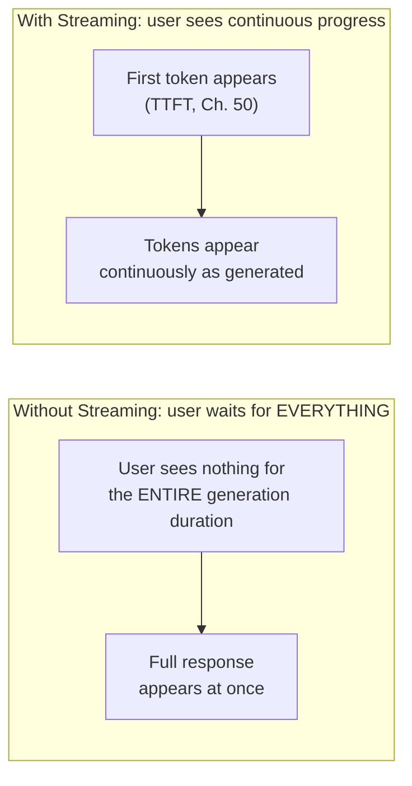
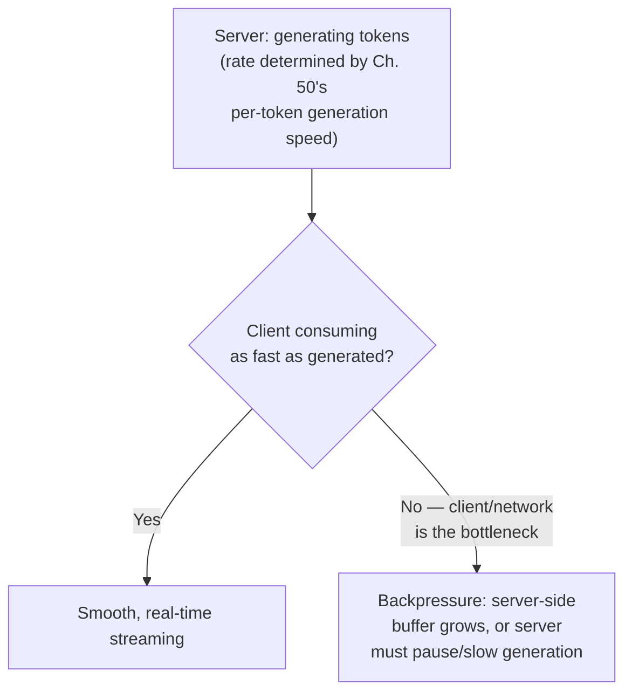

## Introduction

Chapter 55 closed by flagging that a streaming connection holds resources open for the entire duration of generation — a direct consequence of the pattern this chapter now covers in full. Streaming is the practice of delivering generated tokens to the client incrementally, as they're produced, rather than waiting for the entire response to complete before sending anything back. Given Chapter 50's establishment that generation is inherently sequential and can take seconds for a complete response, streaming isn't an optional nicety for LLM systems — it's close to a requirement for any interactive, user-facing application.

## Why Streaming Matters More for LLMs Than for Classical APIs

A classical API request (Chapter 26) typically completes in milliseconds — the difference between waiting for the full response and streaming partial results is imperceptible. LLM generation, per Chapter 50's TTFT and per-token latency discussion, can take seconds to fully complete a lengthy response. Without streaming, a user submits a query and stares at a blank, unresponsive interface for that entire duration — a poor experience regardless of how technically "correct" or fast the underlying generation actually is, echoing Chapter 5's distinction between actual latency and *perceived* latency.



## Server-Sent Events (SSE): The Standard Mechanism

Most LLM APIs stream responses using **Server-Sent Events (SSE)** — a simple, one-directional protocol built on standard HTTP, where the server keeps the connection open and sends a sequence of discrete events (each containing one or more newly generated tokens) as they become available.

```python
# A simplified illustration of an SSE streaming endpoint, directly
# built on the continuous batching generation loop from Chapter 50.

from fastapi import FastAPI
from fastapi.responses import StreamingResponse
import json

app = FastAPI()

async def generate_token_stream(prompt: str):
    context = tokenize(prompt)
    async for token in model_generate_streaming(context):  # yields one
                                                              # token at a
                                                              # time, per
                                                              # Ch. 50's
                                                              # per-step loop
        event_data = json.dumps({"token": token, "finished": False})
        yield f"data: {event_data}\n\n"  # SSE's required format:
                                            # "data: <payload>\n\n"
    yield f"data: {json.dumps({'finished': True})}\n\n"

@app.post("/chat/stream")
async def stream_chat(prompt: str):
    return StreamingResponse(
        generate_token_stream(prompt),
        media_type="text/event-stream",
    )
```

```python
# Client-side consumption — the browser's native EventSource API,
# or an equivalent client library, incrementally renders each token
# as it arrives, rather than waiting for the connection to close.

# (illustrative JavaScript, shown for completeness of the request/response cycle)
# const eventSource = new EventSource("/chat/stream");
# eventSource.onmessage = (event) => {
#     const data = JSON.parse(event.data);
#     if (data.finished) { eventSource.close(); }
#     else { appendToUI(data.token); }
# };
```

**Why SSE, rather than WebSockets, is the more common choice for LLM streaming**: SSE is simpler, works over standard HTTP (better compatibility with existing infrastructure like load balancers and proxies, and simpler to reason about from a caching and CDN perspective), and — critically — LLM streaming is inherently **one-directional** (server to client, token by token) for a single request/response cycle; WebSockets provide full bidirectional communication, which is valuable for genuinely bidirectional use cases (a persistent chat session where the client might send additional signals mid-stream) but is unnecessary complexity for the simpler, one-directional token-streaming pattern most LLM chat completions actually need.

## Backpressure: What Happens When the Client Can't Keep Up

**Backpressure** is the general systems concept of what happens when a producer generates data faster than a consumer can process it. For LLM streaming, this manifests specifically when the network connection to the client is slow, or the client-side rendering can't keep pace with the rate of incoming tokens.



**Why this matters for a system designer**: an LLM serving system streaming to many concurrent clients (Chapter 55's multi-tenant discussion) needs to handle the case where one client's connection is slow without that slow client causing memory to accumulate unboundedly on the server (buffering generated-but-not-yet-delivered tokens) or, worse, without that one slow client's backpressure somehow blocking or degrading the generation process for other, unrelated concurrent requests — directly connecting to Chapter 50's continuous batching scheduler, which must remain correctly decoupled from any individual client's specific network delivery speed.

## Streaming's Interaction with This Part's Prior Chapters

This chapter is deliberately positioned as a near-final chapter in Part 10 because streaming interacts with nearly everything covered so far:

- **KV cache and continuous batching (Chapter 50)**: a streaming request's generation proceeds through the exact same per-step, KV-cache-backed loop — streaming only changes how each newly generated token is *delivered* to the client, not how it's *computed*.
- **TTFT (Chapter 50)**: streaming is precisely what makes TTFT the metric that matters most for perceived responsiveness — once streaming is in place, the user's experience is dominated by "how long until I see *something*," which is exactly TTFT, rather than total generation time.
- **GPU memory (Chapter 53)**: as Chapter 55 flagged, a streaming connection holds its KV cache allocation open for the full generation duration — a slow client doesn't slow down the model's actual token generation rate (that's determined by GPU compute, per Chapter 50), but it does mean that request's memory allocation remains reserved for longer if the server must wait for the client to consume already-generated tokens before proceeding, depending on the specific buffering architecture.
- **Multi-tenancy (Chapter 55)**: a tenant with many concurrent, slow-to-consume streaming connections holds shared memory resources for longer, directly amplifying the "noisy neighbor" concern Chapter 55 raised.

## Handling Client Disconnection Mid-Stream

A practical, easily-overlooked design detail: if a client disconnects before a streaming response completes (a closed browser tab, a lost network connection), the server should detect this and **immediately stop generation**, freeing the associated KV cache memory (Chapter 53) rather than continuing to generate and consume GPU resources for a response no one will ever receive — a direct, necessary application of Chapter 53's memory-conservation discipline to this specific streaming failure mode.

```python
async def generate_token_stream(prompt: str, request: "Request"):
    context = tokenize(prompt)
    async for token in model_generate_streaming(context):
        if await request.is_disconnected():  # detect client disconnection
            break  # stop generation immediately, freeing KV cache memory
                    # rather than wastefully continuing to completion
        yield f"data: {json.dumps({'token': token})}\n\n"
```

## Key Takeaways

- Streaming delivers generated tokens incrementally rather than waiting for the full response, directly addressing the perceived-latency problem created by LLM generation's multi-second, sequential nature (Chapter 50) — a near-requirement for interactive applications, not an optional nicety.
- Server-Sent Events (SSE) is the standard mechanism for LLM streaming, favored over WebSockets for its simplicity and good fit with streaming's inherently one-directional, server-to-client data flow.
- Backpressure — a slow client unable to consume tokens as fast as they're generated — must be handled without unbounded server-side buffering and without degrading other concurrent requests sharing the same serving infrastructure.
- Streaming interacts directly with every prior chapter in this Part: it doesn't change how tokens are computed (still the KV-cache-backed loop from Chapter 50), but it changes how long a request's memory allocation (Chapter 53) may need to remain reserved, and amplifies multi-tenant resource-contention concerns (Chapter 55) — and a disconnected client should trigger immediate generation cancellation to free that memory.

---

## Interview Questions

**1. Why is streaming described as "close to a requirement" for interactive LLM applications, rather than merely a nice-to-have latency optimization?**
Chapter 50 established that LLM generation for anything beyond a very short response can take multiple seconds to fully complete, given generation's inherently sequential, one-token-at-a-time nature; without streaming, a user submitting a query to an interactive application would need to wait through this ENTIRE multi-second duration seeing no feedback at all before any part of the response appears, which — per Chapter 5's distinction between actual and perceived latency — creates a perception of unresponsiveness or malfunction regardless of whether the underlying generation is actually proceeding efficiently; for any application where users interact in real time and expect a responsive, conversational experience, this kind of extended, feedback-free wait is generally considered unacceptable by current user-experience standards, making streaming a practical necessity for this class of application rather than an optional enhancement layered on top of an already-acceptable baseline experience.
*Follow-up: For what kind of LLM application might streaming genuinely NOT be necessary or valuable, despite this general "close to a requirement" framing?*
For a non-interactive, offline batch-processing application (e.g., an overnight job summarizing a large collection of documents, where no human is watching or waiting for any individual result in real time), streaming provides little to no practical benefit, since there's no user perceiving or being affected by the intermediate, partial generation progress at all — the application only cares about the final, complete result becoming available at some point, making streaming an unnecessary complexity for this specific kind of non-interactive, batch-oriented use case, directly illustrating that streaming's value is specifically tied to INTERACTIVE, human-observed use cases rather than being a universally necessary feature for every possible LLM application regardless of its specific interaction pattern.

**2. Why does this chapter argue that SSE is generally preferable to WebSockets for LLM chat completion streaming, despite WebSockets providing more general bidirectional capability?**
SSE is simpler to implement and operate (built directly on standard HTTP, working well with existing infrastructure like load balancers, proxies, and CDNs without requiring special protocol-upgrade handling that WebSockets require), and LLM chat completion streaming for a single request/response cycle is inherently one-directional — the server sends a stream of generated tokens to the client, and the client doesn't need to send anything back to the server DURING that specific stream (the next user message, if any, would be a new, separate request) — WebSockets' additional bidirectional capability, while genuinely useful for certain other real-time application patterns, represents unneeded complexity for this specific, one-directional use case, following this series' general "don't adopt more complexity than the actual requirement justifies" principle, now applied to protocol selection specifically.
*Follow-up: Describe a genuine LLM-related use case where WebSockets' bidirectional capability WOULD be specifically justified, unlike the simple chat completion streaming case this chapter primarily discussed.*
A real-time voice assistant or a collaborative, multi-user AI-assisted application (previewed as a topic for a later chapter in this series) might genuinely need bidirectional communication — for example, a voice assistant needing to receive continuous audio input from the client WHILE simultaneously streaming back generated audio or text response tokens, or a collaborative application where multiple users' inputs need to be received by the server in real time while the server simultaneously streams updates back to all connected clients — in these genuinely bidirectional scenarios, WebSockets' full duplex capability provides a necessary capability that SSE's one-directional design simply cannot support, making WebSockets the appropriately-justified, necessary protocol choice for this different category of use case, in contrast to the simpler, one-directional chat completion streaming this chapter primarily addressed.

**3. Explain backpressure in the context of LLM streaming, and why a naive, unbounded server-side buffering approach to handling a slow client is problematic.**
Backpressure occurs when the LLM server generates tokens faster (per Chapter 50's generation rate, determined by GPU compute) than a specific client can actually receive and process them (due to a slow network connection or slow client-side rendering) — if the server naively continues generating and buffering all these tokens in server-side memory while waiting for the slow client to eventually catch up, this buffer grows unboundedly for as long as the slowness persists, consuming server memory that could otherwise be used productively for other requests; at scale, with many concurrent slow clients each accumulating their own growing server-side buffer, this unbounded buffering could exhaust available server memory entirely, causing a much broader system failure that harms ALL concurrent requests, not just the one specific slow client whose connection originally caused the problem — directly connecting to Chapter 53's general emphasis on memory as a scarce, carefully-managed resource in LLM serving.
*Follow-up: What would be a more robust approach to handling a persistently slow client, beyond simply hoping the buffering problem never becomes severe in practice?*
A more robust approach would impose an explicit, bounded limit on how much unconsumed data can be buffered for any single client's connection — if a client's consumption rate falls too far behind the generation rate and this buffer limit is reached, the server could either pause the actual token generation for that specific request (temporarily halting further GPU computation for that one sequence until the client catches up, directly trading some generation efficiency for bounded memory usage) or, in a more aggressive policy, terminate the connection entirely after a sufficiently long period of client unresponsiveness (treating a persistently unresponsive client similarly to the disconnection-detection mechanism this chapter described, freeing that request's resources for other use) — either approach provides a bounded, predictable response to this scenario rather than allowing unbounded resource consumption to accumulate indefinitely for a single problematic client connection.

**4. Why should a server detect and respond to client disconnection during a streaming response, rather than simply continuing to generate the full response regardless?**
As this chapter established, continuing to generate a response after the client has already disconnected (closed their browser tab, lost network connectivity) means the server is consuming real, valuable GPU compute and holding real KV cache memory (Chapter 53) to produce a response that will never actually be delivered to or used by anyone — this is pure, avoidable waste of scarce, shared serving resources (echoing Chapter 55's multi-tenant fairness concerns, since this wasted capacity could otherwise be serving a different, still-connected client's legitimate request); detecting disconnection and immediately halting generation, freeing that request's KV cache memory allocation right away, directly prevents this waste, ensuring the serving system's finite capacity is always being productively used for requests that will actually be consumed, rather than continuing to expend resources on requests that have already become moot.
*Follow-up: What's a potential risk or limitation of relying on the server's disconnection-detection mechanism alone, without any additional safeguard?*
Detecting a genuine, clean disconnection (e.g., the client explicitly closing the connection) is generally reliable, but detecting a more ambiguous scenario — like a client that has become unresponsive due to a network issue without a clean, explicit disconnection signal ever being sent — can be less immediate or less reliable, potentially taking longer to detect (relying on a timeout-based mechanism rather than an explicit signal) than a clean disconnection would; this is why a well-designed system typically ALSO implements the bounded-buffering and timeout-based safeguards discussed in the previous question as an additional, complementary layer of protection, rather than relying purely on explicit disconnection detection alone to catch every possible scenario where a client has effectively, even if not explicitly and cleanly, stopped consuming the stream.

**5. Why might a slow client's backpressure, if not properly isolated, risk affecting OTHER, unrelated concurrent requests sharing the same serving infrastructure, connecting to Chapter 50's continuous batching discussion?**
Chapter 50's continuous batching scheduler generates tokens for all currently active requests at each shared scheduling step, largely independent of how quickly any individual request's generated tokens are actually being consumed and delivered to its specific client — if the mechanism for actually SENDING already-generated tokens to a slow client somehow became coupled with or blocked the underlying generation loop itself (for example, if a poorly-designed implementation synchronously waited for a slow client's acknowledgment before proceeding to generate the NEXT token for that same sequence, and this blocking somehow affected the shared scheduler's ability to process other, unrelated sequences), a single slow client could inadvertently degrade the generation speed for entirely unrelated requests sharing that same batch — a well-designed streaming implementation must ensure the (potentially slow) process of delivering already-generated tokens to a specific client remains fully decoupled and asynchronous relative to the shared, continuous-batching generation loop that's independently producing new tokens for every active request.
*Follow-up: What specific architectural pattern would you recommend to ensure this necessary decoupling between token generation and token delivery is actually achieved in practice?*
I'd recommend an architecture where token generation writes each newly-produced token into a per-request output buffer or queue (a lightweight, in-memory data structure, with the bounded-size safeguard discussed earlier in this chapter's Q&A) completely independently of and without waiting for the client's actual consumption rate, while a SEPARATE, asynchronous process or coroutine is responsible for reading from that buffer and actually transmitting data to the specific client over the network at whatever rate that specific client's connection can support — this producer-consumer pattern, with an explicitly decoupling buffer in between, ensures the shared generation loop (the producer, serving many requests via continuous batching) never needs to directly wait on or be blocked by any individual client's specific, potentially slow consumption rate (the consumer side), correctly achieving the necessary isolation this question's scenario requires.

**6. In an interview, if asked "why does streaming a response make the SAME underlying LLM generation feel faster to the user, even though the total generation time is unchanged," how would you answer using this chapter's and Chapter 50's concepts?**
I'd explain that streaming doesn't actually change the TOTAL time required to generate the complete response (which is still determined by TTFT plus the sum of all subsequent per-token generation times, per Chapter 50) — what streaming changes is the user's PERCEIVED experience of that same total duration: without streaming, the user perceives a single, undifferentiated wait of the FULL total duration before seeing anything at all; with streaming, the user perceives a much shorter initial wait (just TTFT, before the first token appears) followed by continuous, visible progress as subsequent tokens appear one after another — this directly exploits the well-established human psychology finding (echoing Chapter 5's actual-versus-perceived-latency distinction) that visible, continuous progress feels substantially faster and less frustrating than an equally long but entirely opaque, feedback-free wait, even when the two experiences have IDENTICAL total underlying duration.
*Follow-up: Why might this same perceived-latency benefit NOT apply as strongly to a very SHORT response (e.g., a single-word or single-sentence answer)?*
For a very short response, the total generation time itself might already be quite brief (a small number of tokens, generated quickly per Chapter 50's per-token latency) — meaning the difference between "wait for the full short response" and "see it stream in token by token" is itself a very small, perhaps imperceptible difference in absolute time, since there simply isn't much total duration for streaming's perceived-progress benefit to meaningfully improve upon; streaming's perceived-latency benefit is most pronounced and most valuable specifically for LONGER responses, where the total generation duration is substantial enough that the difference between an opaque, full-duration wait and a visible, incremental, token-by-token reveal becomes genuinely noticeable and meaningfully impactful to the user's actual experience.

**7. How would you use this chapter's material to explain why a company's decision to implement streaming might require CHANGES to their client-side application code, beyond just the server-side serving infrastructure changes this chapter primarily discussed?**
I'd explain that streaming fundamentally changes the SHAPE of the data the client receives — rather than a single, complete response object arriving all at once (which a client application might be designed to simply parse and render as a finished, complete unit), the client now receives a SEQUENCE of partial, incremental updates over time (as this chapter's SSE code example illustrated) that the client-side application needs to be specifically designed to incrementally accumulate and render as they arrive — this requires genuine client-side application logic changes (handling the SSE event stream, incrementally updating the UI as each token arrives, correctly handling the stream's eventual completion signal) that go well beyond simply changing how the server responds; a company adopting streaming needs to budget for and coordinate this necessary CLIENT-side development work alongside the server-side serving infrastructure changes this chapter has primarily focused on, treating this as a genuinely full-stack change, not a purely backend/serving-infrastructure-only change.
*Follow-up: Why might this client-side requirement make streaming adoption more complex for a company supporting MULTIPLE different client platforms (web, iOS, Android) simultaneously?*
Each distinct client platform (a web browser, a native iOS app, a native Android app) has its own specific mechanisms and libraries for consuming a streaming HTTP response and its own specific UI frameworks and patterns for incrementally rendering accumulating content — meaning the client-side streaming-consumption and incremental-rendering logic this question's premise identified as necessary generally needs to be independently implemented and maintained SEPARATELY for each distinct client platform, rather than being a single, shared piece of logic that automatically works everywhere — this multiplies the genuine client-side engineering effort required to fully and correctly adopt streaming across a company's full range of supported client platforms, an additional practical consideration a system designer should factor into the overall cost and effort estimate (echoing Chapter 42's cost-modeling discipline, now applied to engineering effort rather than pure infrastructure cost) for a proposed streaming adoption initiative.

**8. Why might a serving system need to handle the scenario where a client wants to CANCEL an in-progress streaming generation mid-way (e.g., the user clicks a "stop generating" button), and how does this connect to this chapter's disconnection-handling discussion?**
A user might reasonably want to interrupt a long, in-progress generation partway through — perhaps they've already seen enough of the response to know it's not what they wanted, or they want to submit a different, corrected query instead of waiting for the current one to fully complete — supporting this explicit cancellation capability directly serves genuine user experience needs, and mechanically, this is very similar to (and can often reuse) this chapter's disconnection-handling mechanism: an explicit "cancel" signal from the client can be treated much like a detected disconnection, immediately halting further generation and freeing the associated KV cache memory (Chapter 53) rather than continuing to needlessly generate content the user has explicitly indicated they no longer want, directly extending this chapter's "don't waste resources on unwanted generation" principle from the passive, disconnection-detected scenario to this active, explicitly-requested cancellation scenario.
*Follow-up: Why might explicit, client-initiated cancellation be considered a MORE important feature to support well than passive disconnection detection alone, from a pure resource-efficiency perspective?*
Explicit cancellation can be signaled and acted upon IMMEDIATELY, the instant the user decides they want to stop (a clear, deliberate, low-latency signal), whereas passive disconnection detection (this chapter's earlier discussion) may rely on a less immediate mechanism (a timeout, or detecting a lost network connection, which may take longer to definitively confirm than an explicit "cancel" button click) — supporting explicit cancellation well, in addition to passive disconnection detection, allows the serving system to reclaim wasted resources more QUICKLY and more RELIABLY in the (likely common) scenario where a user actively decides mid-generation that they no longer want the response, compared to relying solely on the less immediate, less certain passive detection mechanism to eventually catch this same underlying "no longer needed" situation.

**9. How would you use this chapter's material to design a monitoring metric specifically for measuring the effectiveness of a streaming implementation, beyond the general TTFT and throughput metrics already established in Chapter 50?**
I'd track the rate of PREMATURE STREAM TERMINATIONS — connections that end (via either detected disconnection or explicit cancellation, per this chapter's discussion) before the generation naturally reaches its own completion (an EOS token, per Chapter 39) — as a distinct, dedicated metric, since a consistently high rate of premature terminations could indicate either a genuine, valuable user behavior (users satisfied enough with an early portion of the response that they don't need to wait for the rest, or actively finding the response unhelpful and stopping it) or a technical problem (persistent connection issues causing accidental disconnections that users didn't intend) — distinguishing between these two very different underlying causes (following this series' consistent theme of correctly diagnosing before concluding, e.g., Chapter 32's drift diagnosis, Chapter 48's forgetting diagnosis) would require correlating this termination-rate metric with other signals (explicit user cancellation versus a detected network-level disconnection, and potentially direct user feedback) rather than treating a high termination rate as inherently either a purely positive or purely negative signal on its own.
*Follow-up: Why might a very LOW premature-termination rate NOT necessarily indicate a well-functioning streaming implementation, contrary to what might initially seem intuitive?*
A very low premature-termination rate could simply mean users are consistently waiting for the FULL response regardless of whether the early portion was already sufficient or the response wasn't meeting their needs — this could actually indicate that the user experience makes it inconvenient or unclear how to interrupt a stream early (poor "stop generating" UI affordance, or a general lack of user awareness that early stopping is even possible), rather than genuinely indicating high response quality or genuine user satisfaction with the FULL response consistently being needed — this illustrates why this specific metric, like many others discussed throughout this series (echoing the general theme that a single metric rarely tells a complete, unambiguous story on its own, e.g., Chapter 6's metric-tier discussion), needs to be interpreted carefully and in combination with other signals rather than assuming either a high or low value straightforwardly and unambiguously indicates good or poor system performance without this kind of more careful, multi-signal interpretation.

**10. How would you explain to a stakeholder why implementing streaming might INCREASE, not decrease, the overall engineering complexity of an LLM-based system, even though it improves user-perceived performance?**
I'd explain that while streaming provides a genuine, valuable user-experience improvement (this chapter's core benefit), it introduces genuine additional engineering complexity across multiple layers — server-side infrastructure needs to correctly implement the token-by-token delivery mechanism (SSE, this chapter's code example) with proper backpressure handling (avoiding unbounded buffering) and disconnection/cancellation detection (freeing wasted resources promptly); client-side applications need genuinely new logic to consume and incrementally render a streaming response, across every supported client platform (this chapter's earlier "multiple platforms" discussion); and the overall system now needs to handle a genuinely new class of partial-completion states and failure modes (a connection dropping mid-stream, a client canceling partway through) that a simpler, non-streaming request-response pattern never needed to consider at all — this represents a real, non-trivial engineering investment that should be weighed against its genuine user-experience benefit (following this series' consistent cost-benefit discipline), not assumed to be a simple, low-effort "just turn on streaming" toggle.
*Follow-up: Under what circumstance might this added complexity NOT be justified, leading a team to reasonably choose NOT to implement streaming despite its general benefits?*
For an application where responses are consistently very short (this chapter's earlier discussion of streaming's diminished benefit for short responses) or for a genuinely non-interactive, offline batch-processing use case (also discussed earlier in this chapter's Q&A) where no human is actively waiting for or perceiving the response in real time at all, the user-experience benefit streaming would provide is minimal or entirely absent, meaning the genuine, non-trivial engineering complexity cost this chapter has described wouldn't be justified by a correspondingly meaningful benefit — in these specific scenarios, a team might reasonably and correctly choose to skip streaming entirely, following this series' consistent "don't add complexity beyond what the actual, validated need justifies" principle, applied here specifically to the streaming-adoption decision.

**11. How does streaming's interaction with Chapter 53's GPU memory management specifically differ from a non-streaming request's interaction with that same memory management system?**
For a non-streaming request, the KV cache memory allocation (Chapter 53) is held for the duration of the generation process itself, and released as soon as generation completes (whether the client immediately receives the full response or not, since the SERVER-side generation process itself has already finished regardless of network delivery timing) — the memory-holding duration is purely a function of generation speed (Chapter 50), independent of network or client-side factors; for a STREAMING request, if the delivery mechanism isn't properly decoupled from generation (per this chapter's earlier "decoupling" discussion), the memory-holding duration could ALSO become dependent on how quickly the CLIENT consumes the stream, not just how quickly the server generates tokens — meaning a slow client, in a poorly-decoupled streaming implementation, could cause that request's KV cache memory to remain allocated for LONGER than the pure generation time alone would require, directly connecting this chapter's backpressure discussion to Chapter 53's memory-management concerns in a way that simply doesn't arise for non-streaming requests.
*Follow-up: Why does this specific interaction reinforce the importance of the producer-consumer decoupling architecture discussed earlier in this chapter's Q&A, beyond just preventing one slow client from affecting OTHER concurrent requests?*
Beyond preventing cross-request interference (this chapter's earlier concern), proper decoupling ALSO ensures that a single slow client's OWN request doesn't hold onto its OWN KV cache memory for longer than strictly necessary — with proper decoupling (generation writing to an intermediate buffer independently of client consumption speed), the server-side generation for that specific request can complete and its KV cache memory can be freed (Chapter 53) as soon as generation itself finishes, even if the client is still slowly consuming the already-buffered output from that intermediate buffer — without this decoupling, the KV cache memory might remain allocated for the ENTIRE, potentially much longer duration until the slow client has fully consumed everything, unnecessarily extending that specific request's own memory footprint well beyond what the actual generation computation required, illustrating that proper decoupling serves BOTH the cross-request fairness concern AND this same-request memory-efficiency concern simultaneously.

**12. How would you use this chapter's concepts to design a graceful degradation strategy for a scenario where the serving infrastructure is under severe load, and streaming's added overhead (compared to a simpler, non-streaming response) becomes a genuine concern?**
I'd consider a fallback mechanism that temporarily disables streaming (falling back to a simpler, complete, non-streaming response) specifically during periods of severe, measured system-wide load or resource contention (echoing Chapter 53's admission-control discussion, now applied to a feature-level degradation decision rather than a pure request-admission decision) — since streaming introduces genuine additional overhead (maintaining the open connection, the buffering/decoupling infrastructure this chapter discussed) beyond a simple, complete response, temporarily reverting to the simpler non-streaming pattern under genuinely severe load could reduce this overhead and help the system prioritize successfully completing MORE requests overall (even without the streaming UX benefit) rather than risking a worse outcome (widespread admission-control rejections, per Chapter 53) if the system attempted to maintain full streaming support even under this kind of severe resource pressure.
*Follow-up: How would you validate that this kind of graceful degradation, if implemented, actually provides a net positive outcome for users, rather than simply trading one form of degraded experience (no streaming) for another?*
I'd run a controlled experiment or careful analysis (echoing Chapter 22's evaluation discipline) specifically measuring user experience and business outcomes (Chapter 6) under both this degradation policy and the alternative of maintaining full streaming even under severe load (accepting a potentially higher rejection rate instead) — comparing which approach actually produces better OVERALL outcomes during genuine periods of severe load (e.g., is a slower-feeling but still-successfully-completed non-streaming response, during a brief period of severe load, actually preferable to an outright request rejection that a maintained-streaming policy might produce more of under that same severe load) — ensuring this graceful degradation strategy is validated as a genuine net improvement for the specific severe-load scenario it's meant to address, rather than assumed to be beneficial purely from a plausible-sounding theoretical argument without this kind of empirical confirmation.

**13. Why might a system designer need to reason differently about rate limiting (Chapter 55) for a STREAMING request compared to a non-streaming request, given that the total token count for a streaming request also isn't fully known until the stream completes?**
This connects directly to Chapter 55's earlier discussion of needing to ESTIMATE token usage upfront for rate-limiting admission decisions — for a streaming request specifically, this estimation challenge is compounded by the fact that the connection remains open and actively consuming resources for an EXTENDED period (this chapter's core characteristic), meaning a rate-limiting or admission-control system needs to account not just for the eventual TOTAL token cost (Chapter 55's estimation challenge) but also for the DURATION of resource commitment (this chapter's discussion) that a streaming request specifically represents — a tenant with many concurrent, long-running streaming connections could be well within their aggregate TOKEN-based rate limit while still consuming a disproportionate share of concurrent CONNECTION or MEMORY capacity (Chapter 53) simply due to how many requests they have simultaneously open and in-progress, a distinct resource-consumption dimension (concurrent duration/connections) that a pure token-volume-based rate limit alone (Chapter 55's primary recommendation) doesn't fully capture.
*Follow-up: What additional rate-limiting dimension, beyond pure token volume, would you recommend adding specifically to account for this streaming-specific concern?*
I'd recommend adding an explicit limit on the MAXIMUM NUMBER OF CONCURRENT, SIMULTANEOUSLY-OPEN streaming connections per tenant, independent of and in addition to the token-volume-based rate limit (Chapter 55's primary mechanism) — this directly bounds how many simultaneous, resource-holding streaming connections any single tenant can maintain at once, regardless of their aggregate token consumption over a longer time window, directly addressing this chapter's specific concern about a tenant's CONCURRENT resource commitment (via many simultaneous open connections) rather than only their TOTAL, aggregated token volume over time — combining this concurrent-connection limit with Chapter 55's token-volume-based limit provides more complete protection against both dimensions of potential resource-consumption unfairness that a multi-tenant, streaming-enabled LLM serving system needs to guard against.

**14. How would you use this chapter's disconnection-handling discussion to explain a potential subtle bug where a serving system continues to bill or count tokens toward a tenant's rate limit even after the tenant has disconnected mid-stream?**
I'd explain that if the disconnection-detection and generation-cancellation logic (this chapter's core mechanism) is implemented correctly and promptly, the tenant's actual token usage accounting (feeding into Chapter 55's rate-limiting and billing reconciliation) should accurately reflect only the tokens ACTUALLY generated before the disconnection was detected and generation was halted — a subtle bug could arise if the disconnection-detection mechanism itself has some delay or unreliability (as discussed earlier in this chapter's Q&A regarding ambiguous, non-clean disconnections), causing the system to continue generating (and therefore continuing to accumulate token counts against the tenant's rate limit or billing) for some additional period after the client has ALREADY effectively disconnected, even though this generation is now entirely wasted and unobserved — leading to a tenant being unfairly billed or rate-limited for tokens that were technically generated but never actually delivered to or used by them, directly connecting this chapter's disconnection-handling reliability concern to a genuine, concrete tenant-fairness and billing-accuracy issue from Chapter 55's discussion.
*Follow-up: How would you design a testing strategy to specifically catch this kind of subtle disconnection-handling and billing-accuracy bug before it affects real tenants in production?*
I'd design specific, deliberate test scenarios simulating various disconnection patterns (a clean, explicit disconnection; an abrupt network-level connection loss without a clean signal; a client that stops actively consuming data without formally disconnecting at all) and directly measure, for each scenario, both HOW QUICKLY the server detects and responds to each disconnection type, and WHETHER the resulting token accounting accurately reflects only genuinely-delivered tokens rather than continuing to count tokens generated after the effective disconnection point — following this series' consistent emphasis on testing edge cases explicitly rather than only happy-path scenarios (e.g., Chapter 43's prompt regression testing, Chapter 49's pipeline evaluation gate discussion), this kind of deliberate, disconnection-scenario-specific testing would be necessary to catch this class of subtle billing-accuracy bug before it could affect real tenants and erode their trust in the accuracy of the platform's usage accounting and billing.

**15. How would you summarize, for someone completing Part 10's inference and serving chapters and moving on to Chapter 57's LLM gateway/router hands-on chapter, why this chapter's streaming material is directly relevant to that closing, integrative chapter?**
Chapter 57 will build an actual, working LLM gateway/router that ties together this entire Part's concepts — and a production-grade gateway needs to correctly handle streaming as a first-class capability, not an afterthought: it needs to properly proxy or relay a streaming SSE connection from the backend serving infrastructure (this chapter's core mechanism) through to the actual end client, correctly propagate disconnection signals in both directions (this chapter's disconnection-handling discussion), and correctly apply the multi-tenant rate-limiting and admission-control logic (Chapter 55) to streaming requests specifically, accounting for their extended, concurrent resource-holding characteristics (this chapter's closing discussion) — having this chapter's grounding in streaming's specific mechanics and its interactions with memory management and multi-tenancy equips a reader to recognize and correctly implement these considerations as genuine, necessary components of Chapter 57's gateway design, rather than overlooking them as an assumed-trivial detail in that chapter's more integrative, hands-on implementation.
*Follow-up: What specific architectural component would you expect Chapter 57's gateway implementation to include, directly motivated by this chapter's streaming and disconnection-handling discussion?*
I'd expect Chapter 57's gateway to include an explicit, bidirectional disconnection-propagation mechanism — detecting when the ORIGINAL, external client disconnects from the gateway itself, and correctly propagating that disconnection signal THROUGH the gateway to the backend LLM serving infrastructure (so the backend can apply this chapter's generation-cancellation and memory-freeing logic), rather than the gateway naively continuing to relay a backend stream to a client connection that has already closed, or continuing to hold the backend generation open indefinitely after the original external client has already disconnected — this is exactly the kind of necessary, easily-overlooked architectural detail that a reader equipped with this chapter's specific disconnection-handling discussion would know to explicitly ask about and verify is correctly implemented in Chapter 57's gateway design, rather than assuming a naive, pass-through-only proxy implementation would automatically and correctly handle this scenario without this specific, deliberate design consideration.
