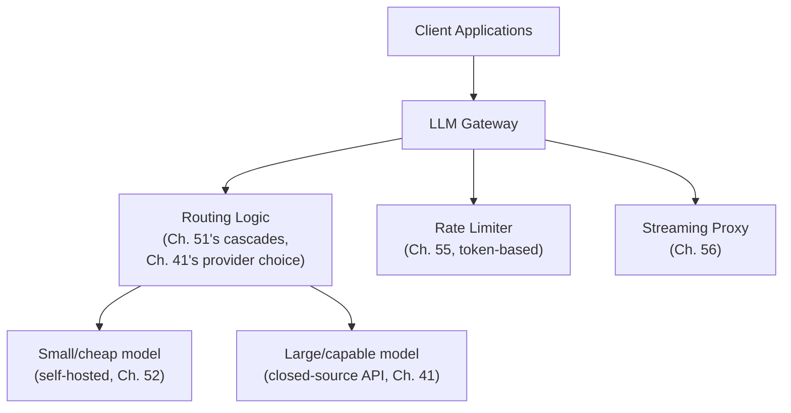

## Introduction

Part 10 closes the way every major Part in this series has — with a hands-on chapter that makes every preceding concept concrete. This chapter builds an **LLM gateway**: a single service sitting between client applications and one or more underlying LLM providers (closed-source APIs, self-hosted models, or both), responsible for routing, rate limiting, model cascading, and streaming proxying — the practical, integrative artifact that embodies Chapters 50-56's concepts as a real, deployable system.

## Why a Gateway, Architecturally

Chapter 41 established the choice between closed-source APIs and self-hosted models; Chapter 51 introduced model cascades; Chapter 55 established multi-tenant rate limiting. A gateway is the architectural answer to "where does all of this logic actually live" — rather than every client application independently re-implementing rate limiting, provider selection, and cascading logic, a gateway centralizes this shared concern, exactly the same architectural motivation as an API gateway in classical microservices architecture, now applied specifically to the LLM-serving context.



## Step 1: Provider Abstraction

```python
# providers.py
from abc import ABC, abstractmethod
from dataclasses import dataclass

@dataclass
class GenerationRequest:
    prompt: str
    max_tokens: int
    temperature: float = 0.7  # Ch. 39's decoding configuration
    stream: bool = False       # Ch. 56

@dataclass
class GenerationResult:
    text: str
    input_tokens: int
    output_tokens: int  # Ch. 42's cost-relevant token accounting
    provider: str
    model: str

class LLMProvider(ABC):
    """
    Abstracts over closed-source APIs and self-hosted models — directly
    implementing the clean architectural separation Chapter 41
    recommended to avoid vendor lock-in.
    """
    @abstractmethod
    async def generate(self, request: GenerationRequest) -> GenerationResult: ...

    @abstractmethod
    async def generate_stream(self, request: GenerationRequest):
        """Yields tokens incrementally — Ch. 56's streaming interface."""
        ...

class ClosedSourceAPIProvider(LLMProvider):
    def __init__(self, api_client, model_name: str):
        self.api_client = api_client
        self.model_name = model_name

    async def generate(self, request: GenerationRequest) -> GenerationResult:
        response = await self.api_client.complete(
            prompt=request.prompt, max_tokens=request.max_tokens,
            temperature=request.temperature, model=self.model_name,
        )
        return GenerationResult(
            text=response.text, input_tokens=response.usage.input_tokens,
            output_tokens=response.usage.output_tokens,
            provider="closed_api", model=self.model_name,
        )

    async def generate_stream(self, request: GenerationRequest):
        async for chunk in self.api_client.stream(
            prompt=request.prompt, max_tokens=request.max_tokens, model=self.model_name
        ):
            yield chunk.token

class SelfHostedProvider(LLMProvider):
    """Wraps a vLLM/TGI-served model (Ch. 52) behind the same interface."""
    def __init__(self, vllm_client, model_name: str):
        self.vllm_client = vllm_client
        self.model_name = model_name

    async def generate(self, request: GenerationRequest) -> GenerationResult:
        response = await self.vllm_client.generate(request.prompt, request.max_tokens)
        return GenerationResult(
            text=response.text, input_tokens=response.prompt_tokens,
            output_tokens=response.completion_tokens,
            provider="self_hosted", model=self.model_name,
        )

    async def generate_stream(self, request: GenerationRequest):
        async for token in self.vllm_client.generate_streaming(request.prompt):
            yield token
```

## Step 2: Model Cascade Routing (Chapter 51)

```python
# routing.py
class ModelCascadeRouter:
    """
    Implements Chapter 51's model cascade — try the small, cheap
    model first; escalate to the large model only when confidence
    is insufficient.
    """
    def __init__(self, small_model: LLMProvider, large_model: LLMProvider,
                 confidence_threshold: float = 0.7):
        self.small_model = small_model
        self.large_model = large_model
        self.confidence_threshold = confidence_threshold

    async def route(self, request: GenerationRequest) -> GenerationResult:
        small_result = await self.small_model.generate(request)
        confidence = self._estimate_confidence(small_result)

        if confidence >= self.confidence_threshold:
            return small_result  # cheap path — Ch. 42's cost savings realized

        # Escalate — Ch. 51's cascade logic
        return await self.large_model.generate(request)

    def _estimate_confidence(self, result: GenerationResult) -> float:
        # Simplified placeholder — a real implementation might use the
        # model's own reported log-probabilities, a separate lightweight
        # classifier, or heuristics on response length/structure (Ch. 51).
        if len(result.text.strip()) < 10 or "I'm not sure" in result.text:
            return 0.3
        return 0.9
```

## Step 3: Token-Based Rate Limiting (Chapter 55)

```python
# rate_limiting.py
from rate_limiting_bucket import TokenBucketRateLimiter  # Ch. 55's implementation

class TenantRateLimitManager:
    def __init__(self):
        self.limiters: dict[str, TokenBucketRateLimiter] = {}
        self.tier_limits = {"free": 10_000, "standard": 100_000, "enterprise": 1_000_000}

    def get_limiter(self, tenant_id: str, tier: str) -> TokenBucketRateLimiter:
        if tenant_id not in self.limiters:
            self.limiters[tenant_id] = TokenBucketRateLimiter(
                tokens_per_minute_limit=self.tier_limits[tier]
            )
        return self.limiters[tenant_id]

    def check_and_reserve(self, tenant_id: str, tier: str, estimated_tokens: int) -> bool:
        limiter = self.get_limiter(tenant_id, tier)
        return limiter.try_consume(estimated_tokens)  # Ch. 55's admission decision
```

## Step 4: The Gateway Endpoint, Tying It All Together

```python
# gateway.py
from fastapi import FastAPI, HTTPException, Request
from fastapi.responses import StreamingResponse
import json

app = FastAPI(title="LLM Gateway")

rate_limit_manager = TenantRateLimitManager()
cascade_router = ModelCascadeRouter(
    small_model=SelfHostedProvider(vllm_client=..., model_name="llama-3-8b"),
    large_model=ClosedSourceAPIProvider(api_client=..., model_name="gpt-4-class"),
)

def estimate_tokens(text: str) -> int:
    return len(text) // 4  # Ch. 38's rough heuristic

@app.post("/v1/chat")
async def chat(request: Request, tenant_id: str, tier: str, prompt: str, max_tokens: int = 512):
    estimated_input = estimate_tokens(prompt)
    estimated_total = estimated_input + max_tokens  # conservative upfront estimate, Ch. 55

    if not rate_limit_manager.check_and_reserve(tenant_id, tier, estimated_total):
        raise HTTPException(429, "Rate limit exceeded")  # Ch. 55's admission control

    gen_request = GenerationRequest(prompt=prompt, max_tokens=max_tokens)
    result = await cascade_router.route(gen_request)  # Ch. 51's cascade

    return {
        "text": result.text,
        "provider": result.provider,     # transparency for debugging/billing
        "output_tokens": result.output_tokens,
    }

@app.post("/v1/chat/stream")
async def chat_stream(request: Request, tenant_id: str, tier: str, prompt: str, max_tokens: int = 512):
    estimated_total = estimate_tokens(prompt) + max_tokens
    if not rate_limit_manager.check_and_reserve(tenant_id, tier, estimated_total):
        raise HTTPException(429, "Rate limit exceeded")

    async def stream_and_watch_disconnect():
        gen_request = GenerationRequest(prompt=prompt, max_tokens=max_tokens, stream=True)
        # Cascade routing decision made once, upfront, for the whole stream —
        # switching providers mid-stream isn't practical, unlike per-request
        # cascading in the non-streaming endpoint above.
        provider = cascade_router.small_model  # simplified: real implementation
                                                  # would run a fast pre-check
        async for token in provider.generate_stream(gen_request):
            if await request.is_disconnected():  # Ch. 56's disconnection handling
                break
            yield f"data: {json.dumps({'token': token})}\n\n"
        yield f"data: {json.dumps({'finished': True})}\n\n"

    return StreamingResponse(stream_and_watch_disconnect(), media_type="text/event-stream")
```

## How This Gateway Embodies Every Chapter in Part 10

- **Chapter 50 (KV caching, continuous batching)**: entirely encapsulated behind `SelfHostedProvider`'s `vllm_client` — the gateway doesn't reimplement this, it *depends on* a properly-optimized backend (Chapter 52's framework choice) to provide it.
- **Chapter 51 (speculative decoding, model cascades)**: `ModelCascadeRouter` directly implements the cascade pattern; a well-matched draft model for speculative decoding would similarly live inside the `SelfHostedProvider`'s backend, invisible to the gateway.
- **Chapter 52 (serving frameworks, quantization)**: the gateway is provider-agnostic by design (the `LLMProvider` abstraction) — whether `SelfHostedProvider` wraps a quantized or full-precision model is an implementation detail the gateway doesn't need to know.
- **Chapter 53 (GPU memory)**: invisible to the gateway by design — this is exactly the right layering, since memory management is the serving backend's concern, not the routing/rate-limiting layer's.
- **Chapter 54 (cost/latency trade-offs)**: the cascade's `confidence_threshold` and the choice of which model sits in the "small" versus "large" role are the gateway's concrete, tunable expression of this chapter's trade-off framework.
- **Chapter 55 (multi-tenancy, rate limiting)**: `TenantRateLimitManager` directly implements token-based, tier-aware rate limiting.
- **Chapter 56 (streaming)**: the `/v1/chat/stream` endpoint directly implements SSE streaming with disconnection detection.

## Key Takeaways

- An LLM gateway centralizes routing, rate limiting, and provider abstraction that would otherwise need to be redundantly re-implemented by every client application — the same architectural motivation as a classical API gateway, applied to LLM serving.
- A clean `LLMProvider` abstraction directly implements Chapter 41's vendor-lock-in mitigation, allowing closed-source APIs and self-hosted models to be swapped or combined behind a single, stable interface.
- Model cascade routing belongs in the gateway layer, since it's a cross-cutting request-routing concern independent of any single provider's internal serving optimizations.
- The gateway deliberately does NOT reimplement KV caching, continuous batching, or GPU memory management — those remain correctly encapsulated within the serving backend, illustrating proper separation of concerns across this Part's full technology stack.

---

## Interview Questions

**1. Why does this chapter's gateway architecture deliberately NOT reimplement KV caching, continuous batching, or GPU memory management, even though these are central topics of this Part?**
These are all backend serving-infrastructure concerns specifically tied to how a SPECIFIC model is efficiently computed on SPECIFIC hardware (Chapters 50, 53) — properly implementing them requires the specialized serving frameworks (Chapter 52) this Part established as the appropriate, battle-tested tools for this job; the gateway's role, by contrast, is a cross-cutting concern that sits ABOVE any single model's serving details — routing requests to the appropriate backend, enforcing tenant-level policy, and managing the client-facing streaming protocol — mixing these two genuinely different layers of concern into a single component would violate the same separation-of-concerns principle this series has emphasized throughout (e.g., Chapter 26's clean protocol abstraction, Chapter 41's provider abstraction), producing a more tightly-coupled, harder-to-maintain system than cleanly delegating the low-level serving optimizations to a specialized backend the gateway simply calls into.
*Follow-up: What would go wrong, architecturally, if the gateway tried to directly implement its OWN continuous batching logic across requests destined for different backend providers?*
Continuous batching (Chapter 50) fundamentally requires shared, coordinated access to a SPECIFIC model's GPU-resident state (its KV cache, its loaded weights) to work correctly — a gateway routing requests to entirely different backend providers (a self-hosted model on one GPU cluster, a closed-source API on entirely separate, external infrastructure) has no way to meaningfully batch these fundamentally separate, independently-operating backend systems together at all, since they don't share the same underlying compute resources or model state; attempting to implement batching logic at the gateway layer, across these architecturally separate backends, would be a category error — batching only makes sense WITHIN a single backend's own serving process, which is exactly why this chapter correctly delegates this concern entirely to each provider's own backend implementation rather than attempting to implement it at the gateway's cross-provider routing layer.

**2. Why is the `LLMProvider` abstract base class specifically designed to expose both `generate` and `generate_stream` as separate methods, rather than a single, unified method with a `stream` boolean flag internally deciding the behavior?**
While a single method with an internal boolean flag is a valid alternative design, exposing them as separate, explicitly-named methods makes the fundamentally different RETURN TYPES and calling conventions clear at the interface level — `generate` returns a single, complete `GenerationResult` object, while `generate_stream` is an async generator yielding a sequence of incremental tokens (Chapter 56's streaming pattern) — these are genuinely different consumption patterns for the calling code (the gateway's endpoint handlers), and making this difference explicit in the interface itself (rather than hidden behind a runtime flag that changes the return type's fundamental shape) produces clearer, more type-safe, and less error-prone calling code, directly following general software engineering best practices around interface design clarity, now applied specifically to this LLM-provider abstraction.
*Follow-up: What's a risk of the alternative design (a single method with an internal streaming flag) that this chapter's explicit two-method design specifically avoids?*
A single method whose return type or behavior changes dramatically based on a boolean flag value creates a more error-prone interface — a caller might accidentally pass the wrong flag value and receive a fundamentally different kind of object than expected (a generator instead of a complete result, or vice versa) without this mismatch being caught by static type-checking or being immediately obvious from the method signature alone, whereas two explicitly and separately named methods with distinct, clearly-typed return signatures make this kind of confusion structurally much harder to introduce, since the calling code's INTENT (do I want a complete result, or a stream) is explicit in which method name is actually called, rather than being an easily-overlooked flag buried within a single, more ambiguous method's parameters.

**3. Why does the streaming endpoint's cascade routing logic differ from the non-streaming endpoint's, specifically regarding when the small-versus-large model decision is made?**
As the code comment notes, the non-streaming endpoint can fully execute the small model's complete generation, evaluate its confidence AFTER seeing the complete result, and only THEN decide whether to escalate to the large model (Chapter 51's cascade pattern applied straightforwardly, since the complete small-model output is available for confidence evaluation before any decision is needed); for a STREAMING response, tokens are being delivered to the client incrementally and in real time as they're generated (Chapter 56) — by the time enough of the small model's output has been generated to meaningfully evaluate confidence, some of that (potentially inadequate) output may have ALREADY been streamed to and displayed for the user, making a clean, invisible "switch to the large model instead" escalation mid-stream architecturally awkward or impossible without either confusingly revising already-displayed content or accepting a visible, jarring restart — this genuine architectural constraint is why the cascade decision needs to be made more definitively UPFRONT for a streaming request, rather than being deferred until after seeing a complete (but not-yet-displayed) result, as the simpler non-streaming case allows.
*Follow-up: How would you design a MORE sophisticated streaming cascade that still captures SOME of the cost-saving benefit of Chapter 51's cascade pattern, despite this architectural constraint?*
I'd propose a "fast pre-check" approach — using a very quick, lightweight heuristic or a separate, extremely fast classifier (not the small model's actual FULL generation) to make a rapid, upfront prediction of whether this SPECIFIC prompt is likely to be handled adequately by the small model or likely to need the large model's capability, based on the prompt's characteristics alone (before any generation begins at all) — this allows the cascade decision to be made quickly enough to commit to one specific provider for the ENTIRE streaming response upfront, avoiding the mid-stream-switch problem this question identified, while still capturing SOME of Chapter 51's cost-saving cascade benefit for prompts that this fast pre-check confidently classifies as suitable for the smaller, cheaper model — this represents a genuine, more sophisticated design evolution beyond this chapter's deliberately simplified illustrative code, directly motivated by the specific architectural constraint streaming introduces.

**4. Why does the `estimate_tokens` function use "a rough heuristic" (character count divided by 4, per Chapter 38) for the rate-limiting admission check, rather than running the actual target model's tokenizer for a precise count?**
As Chapter 38 established, running the ACTUAL, specific tokenizer for precise token counting requires either loading that specific tokenizer locally or making a separate API call — for a rate-limiting ADMISSION decision that needs to happen quickly, before any actual generation begins, adding this additional latency and complexity for a fully precise count may not be justified, especially since the gateway needs to make this admission decision BEFORE even knowing which specific backend provider (and therefore which specific tokenizer) will ultimately handle this request (in the cascade-routing scenario, Chapter 51) — using Chapter 38's rough, fast heuristic provides a reasonably accurate, low-latency ESTIMATE sufficient for the coarse-grained admission-control decision this specific step needs to make, deferring more precise, tokenizer-specific accounting to the RECONCILIATION step (Chapter 55's earlier discussion) that happens after the actual generation and its actual provider/tokenizer are definitively known.
*Follow-up: Why might this specific design choice (rough estimate for admission, precise reconciliation after the fact) be a reasonable trade-off specifically for RATE LIMITING, even though it might be less acceptable for, say, precise per-customer billing?*
For rate limiting specifically, the primary goal is preventing gross, order-of-magnitude resource overconsumption and providing a reasonably fair, protective admission-control mechanism (Chapter 55) — a modest degree of imprecision in the upfront estimate (potentially admitting a request that turns out to be slightly over or under the tenant's remaining budget) is a comparatively low-stakes error that self-corrects through the reconciliation process on the NEXT request; for precise billing, where a customer expects to be charged EXACTLY for what they actually used (a stronger accuracy expectation, potentially with real financial and trust implications if consistently wrong), relying solely on this rough estimate without ultimately reconciling against actual, precise token counts (using the real tokenizer, after the fact) would be inappropriate — this is exactly why Chapter 55 recommended a two-phase approach (rough estimate for the fast, upfront admission decision; precise reconciliation using actual measured usage for ongoing quota tracking and billing), which this chapter's gateway code implicitly assumes but doesn't fully elaborate in its simplified illustrative form.

**5. How would you extend this chapter's gateway to support the priority-aware admission control discussed in Chapter 53 and Chapter 55, given the current code only checks a simple per-tenant token bucket?**
I'd extend the `check_and_reserve` method (or add a new check alongside it) to also query the current overall system-wide memory/capacity pressure (perhaps via a health/status endpoint exposed by the backend serving infrastructure, reflecting Chapter 53's memory-pressure signal) and incorporate the tenant's TIER (already available as a parameter in this chapter's endpoint) into the admission decision specifically under this detected pressure condition — directly implementing Chapter 53's `admit_request` priority logic (extending it beyond just Chapter 55's per-tenant rate limit check) as an ADDITIONAL admission gate that specifically activates and starts differentiating between tiers only when the backend reports genuine resource pressure, while treating all tiers equally under normal, non-pressured conditions (per Chapter 53's original "under pressure" conditional framing) — this would require the gateway to actively monitor and query the backend's current resource state, adding a new dependency and integration point beyond the current, simpler token-bucket-only implementation shown in this chapter's illustrative code.
*Follow-up: Why might this extension require the gateway to maintain some awareness of backend infrastructure state, breaking somewhat from the clean provider-abstraction principle established earlier in this chapter?*
This does represent a genuine, deliberate tension with the clean provider-abstraction principle (Chapter 41's vendor-lock-in mitigation, this chapter's `LLMProvider` interface) — to correctly implement priority-aware admission control under genuine resource pressure, the gateway needs SOME visibility into the backend's actual current capacity/memory state (Chapter 53), which is technically an internal implementation detail of the backend that the clean abstraction was originally designed to hide; this illustrates a common, realistic system design trade-off where a genuinely valuable cross-cutting capability (priority-aware admission control) requires SOME limited, deliberate leakage of backend-specific information across an otherwise clean abstraction boundary — a well-designed system would minimize this leakage to the smallest necessary signal (e.g., a simple, backend-agnostic "current pressure level: normal/elevated/severe" status, rather than fully exposing the backend's complete internal memory-management details) to preserve as much of the original abstraction's benefits as possible while still enabling this genuinely necessary cross-cutting capability.

**6. Why does the `ModelCascadeRouter`'s `_estimate_confidence` method use simple heuristics (response length, a specific phrase check) rather than a more sophisticated confidence-estimation mechanism, and what would motivate upgrading it?**
This chapter's code deliberately uses a simplified, illustrative placeholder to keep the core cascade-routing STRUCTURE clear and readable, consistent with this series' general approach of using simplified code to illustrate architectural concepts (Chapter 35's registry, Chapter 49's fine-tuning pipeline) without getting lost in the full complexity a genuinely production-grade implementation would require; a real, production system would likely upgrade this to something more rigorous — potentially using the small model's own reported token-level log-probabilities (a more principled, model-internal confidence signal, if exposed by the specific serving framework, Chapter 52) or a separately-trained, lightweight classifier specifically trained to predict whether a given small-model response is likely to be adequate (echoing the general "train a specific model for a specific narrow task" pattern from earlier in this series) — the motivation to upgrade would come from this chapter's own earlier "validate the cascade design empirically" recommendation (Chapter 51's Q&A): if this simple heuristic proves insufficiently accurate (misclassifying too many genuinely-inadequate small-model responses as confident, or vice versa) when measured against real production outcomes, investing in a more sophisticated confidence-estimation mechanism would become justified.
*Follow-up: How would you empirically determine whether this simple heuristic is "good enough" or needs this kind of upgrade, before investing engineering effort in a more sophisticated confidence mechanism?*
I'd run an evaluation (per Chapter 21's discipline) comparing the heuristic's escalation decisions against a ground-truth assessment of whether escalation was ACTUALLY warranted for a representative sample of requests (perhaps using human review, or a more expensive, high-quality LLM-as-judge assessment, as a stand-in for ground truth) — measuring both false negatives (cases where the heuristic judged the small model's response adequate, but it genuinely wasn't, meaning quality suffered) and false positives (cases where the heuristic unnecessarily escalated to the large model despite the small model's response actually being adequate, meaning cost savings were needlessly forfeited) — if this evaluation reveals an unacceptable rate of either error type for the specific application's needs, this concrete, measured evidence would justify investing in the more sophisticated confidence-estimation upgrade discussed above, following this series' consistent "validate empirically before investing in additional complexity" principle.

**7. In an interview, if asked to explain why this gateway includes the `provider` field in its response (per the non-streaming endpoint's returned dictionary), what system design justification would you give?**
I'd explain that exposing which specific provider (and, by extension via the cascade router, which specific model tier) actually handled a given request provides valuable transparency for several legitimate purposes — debugging (if a specific response seems unexpectedly poor in quality, knowing whether it came from the small or large model immediately narrows the investigation, directly connecting to Chapter 33's observability discipline of logging enough context to diagnose issues after the fact), cost attribution and monitoring (tracking what proportion of traffic is actually being handled by the cheaper small model versus the more expensive large model, directly validating whether Chapter 51's cascade design is achieving its intended cost-savings ratio in real production use, per this chapter's earlier "validate the cascade empirically" discussion), and potential client-side logic (a client application might reasonably want to behave slightly differently, or display a different UI indicator, depending on which model actually generated a given response) — this small, seemingly minor design choice directly supports several genuinely important operational and business needs that this Part has emphasized throughout.
*Follow-up: Why might a company choose to keep this `provider` field internal (used for their own monitoring/debugging) but explicitly NOT expose it in the response returned to EXTERNAL, paying customers?*
A company might reasonably want to preserve flexibility to change their internal cascade logic, provider mix, or specific model choices over time (per Chapter 41's periodic build-vs-buy reconsideration discussion) without this being perceived by external customers as a breaking change to a documented, relied-upon API contract, and they might also have legitimate competitive or strategic reasons not to publicly disclose the specific internal architecture and cost-optimization techniques (like model cascading) they're using to serve requests — keeping this field available for INTERNAL monitoring and debugging purposes (via internal logs, per Chapter 33, rather than the external API response itself) while omitting it from the external-facing API response preserves both this internal operational value and this external flexibility/confidentiality, illustrating a common, sensible pattern of exposing operationally-useful detail internally while presenting a simpler, more stable, and less internally-revealing external interface to paying customers.

**8. How would you extend this chapter's gateway to support the standing regression evaluation suite concept from Chapter 48, specifically for validating that a NEW backend provider or model version doesn't degrade overall system quality?**
I'd add a staging/canary mode to the gateway's routing logic (directly extending Chapter 34's canary deployment pattern, now applied at the gateway's routing layer rather than purely within a single model-serving backend) — allowing a small percentage of production traffic to be routed to a NEW candidate provider or model version (registered via an extension of Chapter 35's registry, now tracking gateway-level provider configurations) while the majority of traffic continues to the existing, stable configuration, and I'd implement automated monitoring (per Chapter 33) comparing key quality and business metrics (Chapter 6) between the new candidate's traffic and the stable baseline's concurrent traffic (following Chapter 34's "concurrent, not historical, comparison" principle) — directly extending this chapter's gateway architecture to support the full staged-rollout and regression-validation discipline this series has established throughout, now specifically applied at the LLM-gateway routing layer covered in this closing chapter.
*Follow-up: Why might implementing this kind of canary/staging capability AT THE GATEWAY LEVEL be particularly valuable, compared to implementing it independently within each individual backend provider?*
Implementing this capability at the gateway level provides a SINGLE, unified place to manage staged rollouts and quality validation across potentially MULTIPLE different backend providers and model types simultaneously (both self-hosted models and closed-source APIs, per this chapter's provider abstraction) — rather than needing to independently build and maintain separate canary/staging infrastructure within each different backend's own serving system (which, for a closed-source API provider, might not even be possible to implement at all, since you don't control their internal infrastructure), the gateway's centralized position (sitting between all clients and all backend providers) makes it the natural, uniquely well-positioned place to implement this kind of cross-cutting, provider-agnostic staged-rollout and validation capability, directly reinforcing this chapter's opening architectural justification for why a gateway exists as a distinct, valuable architectural layer in the first place.

**9. Why might a team choose to deploy this gateway as a genuinely SEPARATE, independently-scaled service, rather than embedding this logic directly within each client application that needs to call an LLM?**
Embedding this routing, rate-limiting, and provider-abstraction logic independently within EVERY client application that needs LLM access would mean duplicating this same, non-trivial logic across potentially many different applications and teams, each needing to independently implement and maintain the exact same cascade routing, token-based rate limiting, and streaming-proxying logic this chapter has developed — this is a direct violation of the general "don't repeat yourself" software engineering principle, and would also make it much harder to enforce CONSISTENT policy (a single, organization-wide rate-limiting and provider-selection policy) across all of an organization's different LLM-consuming applications; deploying the gateway as a single, separate, centrally-managed service means this logic is implemented and maintained ONCE, with every client application simply calling this shared gateway rather than reimplementing its own version of this same substantial logic, directly mirroring the well-established architectural rationale for API gateways in classical microservices architecture, now applied specifically to this LLM-serving context.
*Follow-up: What operational responsibility does the TEAM MAINTAINING this gateway now bear, that individual application teams would otherwise have each independently borne themselves?*
The gateway-maintaining team now bears the operational responsibility for the gateway's own availability, scalability, and correctness (following the general reliability-engineering principles this series has emphasized for any critical, shared infrastructure component, e.g., Chapter 26's serving infrastructure discussion) — since EVERY client application depends on this single, shared gateway, any downtime, bug, or performance problem in the gateway itself now has a BROADER, more consequential blast radius, potentially affecting every single LLM-consuming application across the organization SIMULTANEOUSLY, rather than a bug in one specific application's own independent, embedded LLM-calling logic only affecting that one specific application — this concentration of responsibility and consequence is a genuine, important trade-off of the centralized-gateway architecture, requiring the gateway-maintaining team to apply correspondingly rigorous reliability engineering practices (redundancy, careful testing, staged rollouts for the gateway's OWN changes, echoing this chapter's own earlier canary-deployment extension discussion) given this concentrated, organization-wide dependency.

**10. How would you use this chapter's complete gateway example to explain, to someone finishing Part 10, why "LLM system design" ultimately requires the SAME kind of layered, separation-of-concerns architectural thinking as classical distributed systems design (Parts 1-7), despite Part 10's LLM-specific technical content?**
I'd point to this chapter's gateway architecture as direct, concrete evidence — despite this Part covering genuinely new, LLM-specific technical mechanics (KV caching, continuous batching, speculative decoding, PagedAttention), the actual SYSTEM DESIGN of a complete, production-grade LLM serving solution still follows exactly the same layered architectural principles this series established in its classical ML chapters — a clean provider/protocol abstraction (echoing Chapter 27's REST/gRPC discussion and Chapter 41's vendor-lock-in mitigation), a centralized gateway pattern for cross-cutting concerns (echoing classical API gateway architecture), and a clear separation between routing/policy logic (the gateway) and the actual computational serving logic (the backend, encapsulating Chapters 50 and 53's genuinely LLM-specific complexity) — this reinforces Chapter 36's original framing at the very start of this Part: LLM system design extends and applies the SAME foundational system design discipline this series began with, layering new, LLM-specific technical content on top of that same enduring, transferable architectural foundation, rather than requiring an entirely separate, disconnected way of thinking about system architecture.
*Follow-up: What single architectural principle, demonstrated by this chapter's gateway, would you want a reader to remember as the MOST transferable lesson from this entire Part, applicable well beyond LLM systems specifically?*
The principle of encapsulating genuinely complex, specialized, rapidly-evolving technical machinery (this Part's KV caching, continuous batching, and memory management techniques) behind a STABLE, simple, well-defined interface (this chapter's `LLMProvider` abstraction) — allowing the complex, specialized implementation details to evolve, improve, or even be entirely replaced (a new serving framework, a new model, a switch between self-hosted and closed-source) WITHOUT requiring changes to the higher-level system components (the gateway's routing and rate-limiting logic, and every downstream client application) that depend on that interface — this is a timeless, universally transferable software architecture principle (information hiding and stable abstraction boundaries) that long predates LLMs and will remain valuable and applicable regardless of how this specific Part's LLM-serving technology continues to evolve in the future, making it the single most durable, broadly-transferable lesson this closing chapter's concrete example illustrates.
