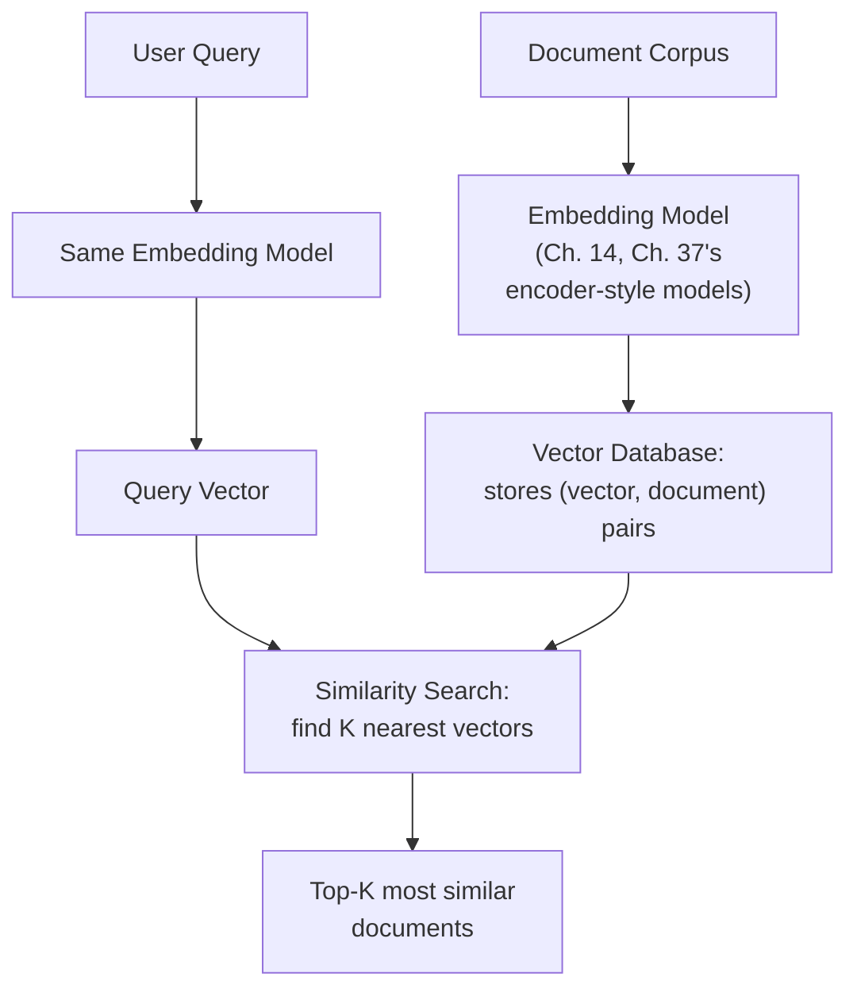
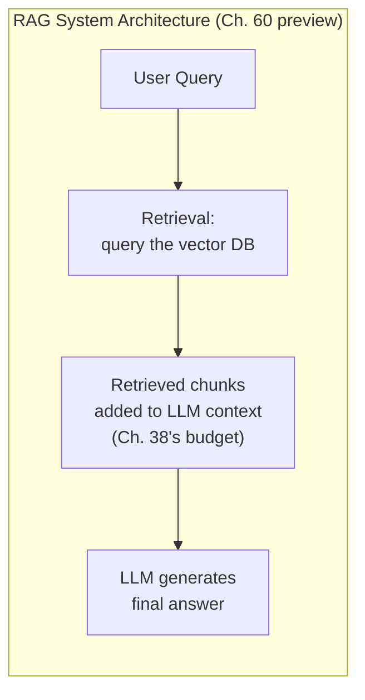

## Introduction

Part 10 closed with a gateway proxying requests to LLMs. Part 11 opens the topic those LLMs most often need help with: giving them access to knowledge they don't have — Chapter 44's central knowledge-gap case, addressed by RAG. Before RAG's architecture can be covered (Chapter 60), its foundational infrastructure needs to be understood: the **vector database**, built directly on Chapter 14's embeddings concept, now developed into the full storage and retrieval system that makes similarity search over large document collections practical at scale.

## What a Vector Database Actually Stores and Retrieves

Chapter 14 established embeddings as dense numeric vectors representing semantic meaning, where similar meanings produce nearby vectors in the embedding space. A vector database is purpose-built infrastructure for storing a large collection of these vectors (each typically paired with the original text or content it represents) and efficiently answering one core query type: **given a query vector, find the K most similar stored vectors**.



## Why This Isn't Just Another Database from Chapter 9

Chapter 9 covered data lakes, warehouses, and lakehouses — structured and semi-structured data storage optimized for exact-match queries, aggregations, and analytical scans. A vector database solves a fundamentally different query problem: **similarity**, not equality. A classical database's index (a B-tree, for example) is built to answer "find the row where `id = 42`" efficiently — an exact-match lookup. A vector database needs to answer "find the vectors closest to this one, in a space with hundreds or thousands of dimensions" — a fundamentally different computational problem that classical indexing structures don't solve efficiently at all, motivating the specialized indexing algorithms Chapter 59 will cover in depth.

## Why This Isn't the Feature Store from Chapter 13, Either

This is a common point of confusion this series flagged back in Chapter 36: Chapter 13's feature store serves structured, typically numeric or categorical feature vectors for a *specific, known entity* (look up "the features for user ID 42"), fetched via a fast key-based lookup, not a similarity search. A vector database serves a fundamentally different need: given an arbitrary query (which might not correspond to any specific pre-known entity at all — a user's freshly-typed natural language question), find whichever *unknown, not-pre-specified* set of stored items are most semantically similar to it. The feature store answers "give me entity X's known features"; the vector database answers "what's most similar to this new, arbitrary input" — different query patterns requiring different underlying infrastructure.

## Core Operations

```python
# Illustrative vector database interface — real implementations
# (Pinecone, Weaviate, Milvus, pgvector, and others) vary in specifics
# but share this same fundamental operation set.

class VectorDatabase:
    def upsert(self, id: str, vector: list[float], metadata: dict) -> None:
        """
        Insert or update a vector and its associated metadata
        (the original text chunk, source document, timestamps, etc.).
        """
        ...

    def query(self, query_vector: list[float], top_k: int = 5,
              metadata_filter: dict | None = None) -> list[dict]:
        """
        Find the top_k most similar stored vectors to query_vector.
        metadata_filter allows narrowing the search (e.g., only
        search documents from a specific customer or date range) —
        this HYBRID of exact-match filtering plus similarity search
        is a common, important real-world requirement.
        """
        ...

    def delete(self, id: str) -> None:
        """Remove a vector — necessary for keeping the knowledge base current."""
        ...
```

**Metadata filtering deserves particular attention**: a real RAG application rarely wants pure, unconstrained similarity search across an entire corpus — a multi-tenant application (Chapter 55's concerns apply directly here too) needs to search only within a specific customer's own documents, and a time-sensitive application might need to exclude outdated documents. Combining exact-match metadata filtering with similarity search efficiently is a genuinely non-trivial engineering problem (naively applying the filter *after* similarity search can return too few or zero results if the filter is restrictive; applying it naively *before* can be too slow if it requires scanning) that a production-grade vector database needs to solve well.

## Similarity Metrics

The specific mathematical definition of "similar" matters and is a configuration choice:

- **Cosine similarity**: measures the angle between two vectors, ignoring their magnitude — the most common choice for text embeddings, since it captures directional (semantic) similarity independent of vector length.
- **Euclidean (L2) distance**: measures straight-line distance between two vectors — sensitive to magnitude, more common in some non-text embedding contexts (certain image or numeric embeddings).
- **Dot product**: a computationally cheaper operation that, for normalized vectors, is mathematically equivalent to cosine similarity — favored in some high-throughput systems specifically for this computational efficiency.

This choice isn't arbitrary: it must match how the specific embedding model was actually trained (most modern text embedding models are trained and validated using cosine similarity specifically, and using a different metric with such a model would produce unreliable, uncalibrated results) — directly echoing this series' recurring theme that a model's training assumptions constrain how it can correctly be used downstream.

## Where a Vector Database Fits in the Broader System



The vector database is specifically the **retrieval** component of a RAG system — Chapter 60 will cover the full architecture, but it's worth previewing here that the vector database's output (the top-K retrieved chunks) directly becomes context injected into the LLM's prompt, meaning every consideration from Chapter 38 (context budget), Chapter 42 (token cost), and Chapter 53 (KV cache memory) applies directly to however many chunks the vector database returns and however large they are.

## Key Takeaways

- A vector database stores embedding vectors paired with their source content and answers similarity queries ("find the K nearest vectors"), a fundamentally different query pattern than the exact-match, key-based lookups classical databases (Chapter 9) and feature stores (Chapter 13) are built for.
- Core operations are upsert, similarity query (often combined with metadata filtering), and delete — with metadata filtering combined efficiently with similarity search being a genuinely non-trivial engineering challenge.
- The similarity metric (cosine, Euclidean, dot product) must match the specific embedding model's training assumptions — an arbitrary or mismatched choice produces unreliable results.
- The vector database is the retrieval component of a RAG system; every chunk it returns directly consumes context window budget, token cost, and KV cache memory downstream, connecting this chapter directly to Chapters 38, 42, and 53.

---

## Interview Questions

**1. Why is a vector database's core query pattern ("find the K nearest vectors") fundamentally different from a classical database's core query pattern ("find the row matching this exact condition"), and why does this difference require entirely different underlying infrastructure?**
A classical database's indexing structures (B-trees, hash indexes) are specifically designed to efficiently narrow down to an exact match or a bounded range using a well-ordered or hashable key — this works because equality and range comparisons on a single dimension (or a small number of indexed dimensions) can be efficiently structured and searched; similarity search operates in a high-dimensional embedding space (often hundreds or thousands of dimensions, per Chapter 14) where there's no natural, single ordering that would let you efficiently narrow down candidates the way a B-tree does for a single sortable key — determining which of millions of stored vectors are "closest" to a query vector, across many simultaneous dimensions, is a geometrically and computationally different problem that requires specialized approximate search structures (which Chapter 59 will cover) rather than the exact-match indexing structures classical databases rely on.
*Follow-up: Why might a naive approach of simply computing the exact similarity between the query vector and EVERY stored vector (a brute-force linear scan) become impractical at scale?*
Brute-force linear scan requires computing a similarity calculation against every single stored vector for every single query, meaning the computational cost scales linearly with the total number of stored vectors — for a corpus with millions or billions of vectors (a realistic scale for many production knowledge bases), this linear scan would take an impractically long time for each individual query, especially under the latency requirements Chapter 5 established for most interactive applications; this is precisely the scaling problem that motivates the approximate nearest-neighbor indexing algorithms (HNSW, IVF, and others) Chapter 59 will cover, which trade a small amount of retrieval accuracy for dramatically faster query times at large scale, avoiding this impractical linear-scan cost.

**2. Why does this chapter emphasize that a vector database is NOT simply "the feature store from Chapter 13, but for embeddings," and what's the core distinction?**
Chapter 13's feature store is fundamentally a KEY-BASED lookup system — you provide a known entity identifier (a specific user ID, a specific item ID) and retrieve that entity's pre-computed features, an operation structurally similar to a classical database's exact-match lookup, just optimized for the specific low-latency, real-time serving requirements Chapter 13 established; a vector database instead answers a fundamentally different question — given an ARBITRARY, not-necessarily-pre-known query (which might be a user's freshly-typed natural language question that has never been seen before and doesn't correspond to any specific, pre-existing entity ID at all), find whichever UNKNOWN set of stored items happen to be most semantically similar to it — this is a search/retrieval operation over the space of stored content, not a lookup of a specific, already-identified entity's associated data, making the two systems fundamentally different in their core query pattern despite both technically "storing vectors."
*Follow-up: Could a single, unified system theoretically serve BOTH the feature store's key-based lookup needs and the vector database's similarity-search needs? What would be the trade-off of building such a unified system versus using two separate, specialized systems?*
Theoretically, a single system COULD support both query patterns if it maintained both a traditional key-based index AND a similarity-search index over the same or related data — but building and maintaining a single system optimized for two genuinely different query patterns and their correspondingly different underlying data structures and performance characteristics is generally more complex than using two separate, purpose-built systems (Chapter 13's feature store, this chapter's vector database), each independently optimized for its own specific query pattern; this reflects the same specialization-versus-unification trade-off this series has discussed for other similar architectural decisions (e.g., Chapter 37's discussion of using a separate embedding model versus a single unified model for both RAG retrieval and generation) — most production systems today favor the specialized, separate-systems approach, given the genuinely different optimization requirements of these two query patterns, though some emerging "multi-modal" or unified data platforms are beginning to blur this line.

**3. Why must the similarity metric (cosine similarity, Euclidean distance, dot product) used by a vector database match how the specific embedding model was actually trained?**
An embedding model is trained with a specific training objective that determines what "similar" means in its learned vector space — most modern text embedding models are trained using a contrastive learning objective (echoing Chapter 14's embedding discussion) specifically calibrated around cosine similarity, meaning the model has learned to place semantically similar texts at a small ANGULAR distance from each other in the embedding space, not necessarily at a small absolute (Euclidean) distance or a specific dot-product magnitude; using a mismatched similarity metric at query time (e.g., using Euclidean distance with a model trained and calibrated for cosine similarity) means you're measuring a property the model was never actually optimized to produce meaningful, well-calibrated values for, potentially producing unreliable or nonsensical similarity rankings even though the underlying embedding vectors themselves are perfectly valid and well-trained.
*Follow-up: How would you determine, for a new or unfamiliar embedding model, which similarity metric is actually appropriate to use with it?*
I'd check the specific embedding model's documentation or the original research paper describing how it was trained and evaluated, since a well-documented model should explicitly state which similarity metric it was designed and validated for — in the absence of clear documentation, I'd empirically validate by testing the model's retrieval quality (using a representative set of known similar/dissimilar text pairs, following this series' consistent "validate empirically rather than assume" principle) under a few different candidate similarity metrics, selecting whichever metric produces the most sensible, well-calibrated similarity rankings for that specific model, rather than assuming any particular metric is universally correct across all embedding models without this kind of verification.

**4. Why is combining metadata filtering with similarity search described as a "genuinely non-trivial engineering problem," rather than simply applying one operation before or after the other?**
Applying the metadata filter STRICTLY BEFORE similarity search (first narrowing to only the matching subset of vectors, then searching for similarity within just that subset) requires either a full scan of the filtered subset (potentially still slow if that subset is still large) or a specialized index supporting this combined filter-then-search pattern efficiently, which isn't automatically provided by a similarity-search index alone; applying the filter STRICTLY AFTER similarity search (first finding the overall top-K most similar vectors across the ENTIRE corpus, then discarding any that don't match the metadata filter) risks returning too few or even zero results if the filter is restrictive and the top-K similarity results happen not to include many filter-matching items, since the approximate similarity search (Chapter 59) might not have even considered enough candidates from the specific filtered subset to guarantee a sufficient number of filter-matching results in its initial top-K search — this genuine tension between filtering-first (potentially slow) and filtering-after (potentially insufficient results) is exactly why production vector databases need specialized, more sophisticated techniques to correctly and efficiently support this combined query pattern.
*Follow-up: Why might this specific engineering challenge be particularly important for a multi-tenant RAG application, connecting to Chapter 55's discussion?*
A multi-tenant RAG application typically needs every retrieval query to be filtered to ONLY that specific tenant's own documents (a hard, non-negotiable metadata filter for data isolation and privacy, echoing Chapter 11's and Chapter 55's tenant-isolation concerns) — if the vector database's filtering-and-search combination doesn't work efficiently and correctly, a tenant with a smaller document corpus (a more restrictive effective filter, since their own document set is a small subset of the overall multi-tenant corpus) could experience notably worse retrieval quality (too few or lower-quality results) or unacceptably slow query performance compared to a tenant with a larger document corpus, making this combined filtering-and-search engineering challenge directly and materially relevant to providing fair, consistent quality of service across all tenants in exactly the way Chapter 55 established multi-tenant fairness generally requires.

**5. How would you decide, for a new RAG application, whether a specialized vector database (like Pinecone, Weaviate, or Milvus) or a vector-search EXTENSION to an existing classical database (like pgvector for PostgreSQL) is the more appropriate choice?**
I'd apply Chapter 13's general "does this specific infrastructure investment's benefit outweigh its cost and complexity for our actual, specific scale and needs" framework, now applied to this vector-storage-technology decision — a specialized, dedicated vector database is generally the better choice for a large-scale, vector-search-heavy application where similarity search is a core, high-volume, performance-critical workload, since these systems are purpose-built and typically more optimized specifically for this workload; a vector-search extension to an existing classical database a team already operates (like pgvector) can be a pragmatic, lower-overhead choice for a smaller-scale application, or one where the team wants to avoid introducing an entirely new, separate database technology and its associated operational overhead (echoing the general "don't add infrastructure complexity beyond what's justified by actual need" principle this series has applied throughout, e.g., Chapter 13's feature store adoption timing) — particularly if that team's existing database already comfortably handles their expected vector-search volume and latency requirements.
*Follow-up: What specific signal would indicate that a team should migrate from a database-extension approach (pgvector) to a dedicated, specialized vector database?*
Signals indicating this migration is warranted would include: the vector corpus growing to a scale where the extension's search performance (query latency, throughput) no longer meets the application's requirements (validated empirically, per Chapter 21's evaluation discipline, rather than assumed); a growing need for more sophisticated vector-search-specific features (like more advanced indexing algorithm options, per Chapter 59, or more sophisticated metadata filtering capabilities than the extension provides); or the vector-search workload growing to consume a disproportionate, problematic share of the existing classical database's overall capacity, in a way that starts negatively affecting the database's OTHER, non-vector-search workloads — any of these concrete, measured signals would provide the evidence-based justification for this migration, following this series' consistent "escalate infrastructure investment when a measured, demonstrated need justifies it" principle.

**6. In an interview, if asked "how would you store and retrieve a company's internal documentation for an AI assistant," how would you use this chapter's concepts to structure your answer?**
I'd explain the two-step process this chapter established — first, using an embedding model (Chapter 14, Chapter 37's encoder-style models) to convert each piece of documentation content (likely broken into smaller chunks, a topic Chapter 61 will cover) into a vector representation capturing its semantic meaning, then storing these vectors, along with their associated original text and relevant metadata (document source, last-updated date, access permissions), in a vector database; at query time, I'd explain that the user's question gets converted into a query vector using the SAME embedding model (a critical consistency requirement, echoing Chapter 15's training-serving consistency theme now applied to embedding consistency), and the vector database's similarity search retrieves the most semantically relevant chunks of documentation, which then get included in the LLM's context (Chapter 38) to generate a well-grounded, informed answer — directly setting up the full RAG architecture Chapter 60 will develop in complete detail.
*Follow-up: Why is it critical that the SAME embedding model be used for both indexing the documentation upfront and embedding the user's query at retrieval time?*
Since an embedding model's vector space is specific to that particular model's own learned representations (different embedding models, even ones trained for similar purposes, generally produce vectors in different, non-comparable vector spaces, per Chapter 14's discussion of embeddings being model-specific learned representations), computing similarity between a query vector from one embedding model and stored document vectors from a DIFFERENT embedding model would be comparing vectors from fundamentally different, incompatible spaces — this would produce meaningless or arbitrary similarity scores, since there's no guarantee that "similar meaning" in one model's vector space corresponds to "similar meaning" in a different model's vector space at all; using the same embedding model consistently for both indexing and querying is a hard, non-negotiable requirement, directly analogous to Chapter 15's training-serving consistency requirement for classical ML features, now specifically applied to ensuring the query and stored vectors being compared actually live in the same, meaningful vector space.

**7. Why might a vector database need to support UPDATING or DELETING vectors, and what specific real-world RAG scenario would make this a critical, non-optional capability rather than a nice-to-have?**
A RAG system's underlying knowledge base — the documents being indexed and made retrievable — is rarely static; company documentation gets updated, corrected, or deprecated, product information changes, and outdated or incorrect information needs to be removed from what the RAG system can retrieve and present as current, accurate content; a vector database without efficient update/delete support would require the entire index to be rebuilt from scratch every time the underlying knowledge base changes even slightly, which — echoing Chapter 44's earlier "fine-tuning is a poor fit for frequently-changing knowledge" argument, now applied to the RAG retrieval infrastructure itself — would be far too slow and operationally impractical for any knowledge base that changes with any regular frequency, making efficient update/delete support a genuinely critical, non-optional capability for realistic, production RAG applications rather than an occasionally-useful nice-to-have feature.
*Follow-up: Why might DELETING a vector be particularly important for compliance reasons, connecting to Chapter 11's data governance discussion?*
If a RAG system's knowledge base includes any content containing personal or sensitive information (Chapter 11's discussion) that a user has a legal right to have deleted (e.g., under a "right to be forgotten" regulatory requirement), the vector database's delete operation is the specific mechanism needed to actually and completely remove that content from what the RAG system can ever retrieve and potentially surface again — a vector database that only supported adding new vectors, without a genuine, reliable ability to fully remove existing ones, would create a serious compliance gap, since sensitive content that should have been deleted could continue to be retrievable and surfaced by the RAG system indefinitely, directly connecting this chapter's operational discussion of vector database capabilities to the genuine legal and compliance requirements Chapter 11 established earlier in this series.

**8. How would you use this chapter's understanding of vector databases to explain why a company's RAG-based customer support assistant might occasionally retrieve and present clearly OUTDATED information, even though their documentation team diligently updates the underlying source documents?**
I'd investigate whether the vector database is being kept in sync with the actual, current source documents — if there's a delay or failure in the pipeline that re-embeds and updates (or deletes) vectors in the vector database whenever the underlying source document changes (the update/delete capability this chapter just discussed), the vector database could be serving STALE, outdated vector representations even though the "true," authoritative source document has already been updated — this represents a genuine data-synchronization problem directly analogous to the training-serving skew concept from Chapter 15 (though manifesting here as a document-database synchronization issue rather than a feature-computation consistency issue), where the RAG system's actual retrieval behavior no longer accurately reflects the current, true state of the underlying source of truth due to some breakdown in the pipeline responsible for keeping these two systems synchronized.
*Follow-up: How would you design a monitoring or validation process to catch this kind of vector-database staleness issue before it causes a customer-facing problem?*
I'd implement a periodic reconciliation/validation job comparing the vector database's indexed content (or at least its content hashes or last-updated timestamps) against the actual, current state of the source documents, flagging any discrepancies where a source document has been updated more recently than its corresponding vector database entry — this is directly analogous to Chapter 32's general data-quality and consistency monitoring discipline, now applied specifically to detecting vector-database-to-source-of-truth synchronization staleness, and I'd also monitor the underlying document-update-to-vector-database pipeline's own health and latency directly (per Chapter 33's observability discipline) to catch this kind of synchronization failure closer to its actual root cause, rather than only discovering it indirectly through the more delayed and less specific symptom of a customer receiving an outdated answer.

**9. How would you use this chapter's cost and system-design concepts (connecting to Chapter 42) to reason about the cost implications of choosing a larger, higher-dimensional embedding model for a RAG application?**
A higher-dimensional embedding vector requires proportionally more storage space per stored document chunk in the vector database (directly increasing storage costs at scale, for a large corpus), and similarity search computation itself typically scales with vector dimensionality (a higher-dimensional similarity calculation requires more computation per comparison), potentially increasing query latency and compute cost for the vector database's own search operations — this represents a cost and performance trade-off distinct from, but conceptually parallel to, Chapter 40's model-size trade-off discussion: a larger, higher-dimensional embedding model may capture more nuanced semantic distinctions (potentially improving retrieval quality) at the direct cost of increased storage and computational cost for the vector database infrastructure itself, requiring the same kind of empirical, task-specific validation (does the retrieval quality improvement from higher dimensionality actually justify its increased infrastructure cost for this specific application) that this series has recommended for every other similar capability-versus-cost trade-off.
*Follow-up: Why might this specific trade-off be somewhat DIFFERENT in character from the LLM model-size trade-off discussed in Chapter 40, given that embedding models and generation models serve different roles in a RAG system?*
While Chapter 40's model-size trade-off primarily concerns computational cost and latency for the GENERATION step, this embedding-dimensionality trade-off primarily concerns STORAGE cost (which compounds and persists over the entire life of the indexed corpus, rather than being a per-request computational cost) and the vector database's OWN query performance — meaning the cost calculus here needs to specifically account for the total, ongoing storage cost of a potentially very large indexed corpus (which could be dramatically larger in aggregate than the embedding model's own inference cost, especially for a very large document collection) as a distinct, additional consideration beyond the pure computational cost comparison that dominated Chapter 40's generation-model-size discussion — illustrating that while both trade-offs share the same underlying "more capability costs more resources" structure, the SPECIFIC resource being traded off (compute/latency for generation models, versus storage plus search compute for embedding dimensionality) differs in a way that requires distinct, appropriately-tailored cost modeling for each.

**10. How would you handle a situation where a stakeholder wants to build a RAG system but insists on using their EXISTING classical relational database (with no vector-search capability at all) rather than adopting ANY new vector-search technology, citing a desire to minimize infrastructure complexity?**
I'd explain, using this chapter's core distinction, that a classical relational database's indexing structures (Chapter 9-style B-trees and exact-match indexes) are fundamentally not designed to efficiently answer the similarity-search query pattern that RAG retrieval genuinely requires — while it's technically POSSIBLE to compute similarity scores using standard SQL operations (or by exporting data for external processing), doing so without proper vector-search indexing would require either a full linear scan for every query (this chapter's earlier "impractical at scale" discussion) or accepting significantly degraded query performance compared to purpose-built vector-search infrastructure; I'd propose the pragmatic middle ground this chapter's earlier decision framework identified — a vector-search extension to their EXISTING database technology (like pgvector, if they're using PostgreSQL) as a way to add the necessary similarity-search capability while still minimizing the introduction of an entirely new, separate database technology, directly addressing their stated concern about infrastructure complexity while still providing the genuinely necessary vector-search capability their RAG system requires.
*Follow-up: What would you say if, even after this explanation, the stakeholder still insists on avoiding any vector-search-specific technology at all, even an extension to their existing database?*
I'd clearly and directly communicate the specific, concrete consequence of this constraint — that the RAG system's retrieval quality and/or performance would very likely be meaningfully worse than what proper vector-search infrastructure would provide (either through slow, brute-force similarity computation at query time, or through a cruder, less semantically-accurate retrieval approach like simple keyword matching alone, which Chapter 62's hybrid search discussion will address as a complementary but not fully sufficient alternative on its own) — presenting this as an explicit, informed trade-off the stakeholder is choosing to accept, rather than either refusing to proceed at all or silently building a system I know will underperform without having clearly flagged this specific, foreseeable consequence — ensuring the stakeholder makes this infrastructure decision with full, clear visibility into its genuine technical trade-offs, following this series' consistent principle of surfacing trade-offs explicitly rather than making significant technical compromises silently on a stakeholder's behalf.

**11. Why might a RAG system need to periodically RE-EMBED its entire existing document corpus, even without any changes to the underlying source documents themselves?**
If the organization decides to switch to a new, improved embedding model (perhaps a newer model release with better semantic understanding, or a switch motivated by the same kind of periodic technology-evaluation discipline Chapter 41 recommended for foundation models generally), ALL existing vectors in the vector database — even for completely unchanged source documents — would need to be recomputed using this new embedding model, since (per this chapter's earlier discussion) different embedding models produce vectors in different, non-comparable vector spaces; mixing OLD vectors (from the previous embedding model) with NEW vectors (from the new embedding model) within the same vector database would be meaningless and would produce inconsistent, unreliable similarity search results, since the similarity comparison would effectively be comparing vectors from two different, incompatible representational spaces — requiring a full re-embedding of the entire corpus as a necessary, all-or-nothing migration whenever the underlying embedding model itself changes.
*Follow-up: How would you manage this kind of full re-embedding migration for a large, actively-used production RAG system, without causing a significant service disruption?*
I'd apply the same staged-rollout and canary-deployment discipline this series has recommended throughout (Chapters 22-23, 34) — building the new embedding model's complete, re-embedded index as a SEPARATE, parallel vector database index alongside the existing, still-serving old index, validating the new index's retrieval quality (per Chapter 21's evaluation discipline) against a representative set of test queries before cutting over, and then performing a staged, gradual traffic cutover from the old index to the new one (directly analogous to Chapter 34's canary deployment pattern, now applied to vector database index migration specifically) — ensuring the production system continues serving from the validated, still-functioning old index throughout the migration process, only fully cutting over once the new, re-embedded index has been thoroughly validated and proven ready, rather than performing a risky, all-at-once "swap out the entire index" migration that could cause significant service disruption or degraded retrieval quality if any issue is discovered only after the cutover has already occurred.

**12. How would you use this chapter's material to distinguish, for a junior engineer, between "the vector database" and "the embedding model" as two genuinely separate architectural components, even though they're often discussed together?**
I'd explain that the embedding model is the component RESPONSIBLE FOR CONVERTING text (or other content) into a numeric vector representation — it's a machine learning model (Chapter 14, Chapter 37) that performs this specific transformation, and it's used both when initially indexing the document corpus and when processing each incoming query; the vector database is the STORAGE AND RETRIEVAL INFRASTRUCTURE that takes already-computed vectors (produced by the embedding model) and efficiently stores them, indexes them for fast similarity search (Chapter 59's algorithms), and returns the most similar stored vectors for a given query vector — these are genuinely separate, independently-selectable and independently-upgradable components (you could swap in a different, better embedding model while keeping the same vector database technology, or vice versa, migrate to a different vector database technology while keeping the same embedding model, provided you handle the necessary re-embedding migration discussed in the previous question if the embedding model itself changes), and conflating them into a single, undifferentiated "the vector search thing" risks missing this important architectural separation and the independent upgrade/decision paths it enables.
*Follow-up: Why might understanding this separation be particularly useful when troubleshooting a RAG system's poor retrieval quality?*
Correctly diagnosing whether poor retrieval quality stems from the EMBEDDING MODEL (producing embeddings that don't well capture the semantic distinctions relevant to this specific domain or use case, an embedding-quality problem) versus the VECTOR DATABASE's search configuration (an inappropriate similarity metric, per this chapter's earlier discussion, or a poorly-tuned approximate search index, a topic Chapter 59 will cover) requires understanding these as separate, independently-diagnosable components — a team that conflates them into a single undifferentiated system might apply the wrong remediation (e.g., trying to fix an actual embedding-quality problem by tuning vector database search parameters, which wouldn't address the real underlying issue at all) — this same "correctly isolate which specific component is responsible before remediating" discipline this series has emphasized throughout (e.g., Chapter 48's forgetting-versus-data-quality diagnosis) applies directly here, and depends on first correctly understanding these as genuinely separate, independently-diagnosable architectural components rather than a single, undifferentiated "vector search" black box.

**13. How would you use this chapter's material to push back on an assumption that "using a vector database automatically means our RAG system will retrieve relevant, high-quality results"?**
I'd point out that a vector database is INFRASTRUCTURE — it efficiently executes whatever similarity search you ask it to perform, but it doesn't guarantee that the QUERY itself (how well the user's actual information need is captured by the embedded query vector) or the underlying EMBEDDING MODEL's quality (how well it captures genuinely relevant semantic similarity for this specific domain and use case, per the previous question's discussion) will actually produce relevant, high-quality results — a vector database can very efficiently and correctly return the "most similar" vectors according to its configured similarity metric, while those results still being genuinely UNHELPFUL or IRRELEVANT to what the user actually needs, if the underlying embedding representations or the chunking strategy (a topic Chapter 61 will cover) aren't well-suited to the specific task; achieving genuinely good RAG retrieval quality requires getting several components right together (embedding model choice, chunking strategy, similarity metric, and, as Part 11 will develop further, hybrid search and re-ranking techniques), not simply "having a vector database" as an infrastructure checkbox.
*Follow-up: What would be your recommended first step for a team that has already deployed a vector-database-based RAG system but is unhappy with its retrieval quality?*
I'd recommend first conducting a systematic, qualitative review of actual retrieval failures (following this series' consistent "diagnose before remediating" principle) — examining a representative sample of queries where the RAG system's final answers were judged inadequate, and specifically checking whether the VECTOR DATABASE actually retrieved genuinely relevant source content that the LLM then failed to use well (pointing toward a generation/prompting issue, Chapter 43-44's territory) versus the vector database failing to retrieve relevant content in the first place (pointing toward an embedding model, chunking strategy, or similarity search configuration issue, this chapter's and Chapters 59/61's territory) — this diagnostic step, directly informed by this chapter's clear separation of the retrieval and generation stages of a RAG pipeline, is essential before investing further effort in either stage, since the two failure modes call for entirely different remediation approaches.

**14. How would you use this chapter's discussion of vector databases to explain, at a system-design level, why a RAG system's overall QUALITY is fundamentally bounded by the quality of its underlying vector database retrieval, no matter how capable the final generation model is?**
This directly echoes the general "garbage in, garbage out" principle applied specifically to RAG's two-stage architecture — if the vector database's similarity search fails to retrieve the genuinely relevant source content needed to answer a user's question (whether due to a poor embedding model, a suboptimal chunking strategy, or an inappropriate similarity metric), even the most capable, well-aligned LLM (Chapter 46) has no way to generate a correct, well-grounded answer, since it simply doesn't have access to the necessary information in its context (Chapter 38) at all — no amount of generation-model capability can compensate for or "make up for" a fundamental retrieval failure, since the LLM can only reason over and synthesize the specific content it's actually been given, making the vector database's retrieval quality a genuine, hard UPPER BOUND on the entire RAG system's achievable answer quality, regardless of how much the generation model itself might otherwise be capable of.
*Follow-up: Why might this "retrieval quality is a hard upper bound" insight lead a team to invest MORE engineering effort in retrieval-quality improvements than in trying to use an even larger, more capable generation model?*
Given this hard upper-bound relationship, once a RAG system's retrieval quality is genuinely the binding constraint on overall answer quality (as diagnosed through the kind of systematic failure analysis discussed in the previous question), further investment in an even larger, more expensive, more capable generation model (Chapter 40's diminishing-returns discussion) would provide little to no additional benefit, since the generation model still wouldn't have access to the correctly-relevant source content it needs regardless of its own capability level — in this specific, diagnosed scenario, investing engineering effort in improving retrieval quality (better embedding models, better chunking, hybrid search and re-ranking, topics Part 11 will continue to develop) would provide a much better return on investment than upgrading the generation model, directly illustrating this series' consistent theme of investing effort where a DIAGNOSED, ACTUAL bottleneck exists, rather than defaulting to the most technically impressive-sounding lever (a bigger, better generation model) without this kind of specific, evidence-based justification.

**15. How would you summarize, for someone moving on to Chapter 59's vector indexing algorithms discussion, why this chapter's foundational material is a necessary prerequisite for that next chapter's deeper technical treatment?**
This chapter established WHAT a vector database does (store embeddings, answer similarity queries) and WHY this is a fundamentally different problem from classical database indexing (this chapter's core distinction) — but it deliberately deferred the technical question of HOW a vector database actually performs fast similarity search efficiently at scale, given that a brute-force linear scan (this chapter's earlier discussion) becomes impractical for large corpora; Chapter 59 will develop the specific algorithms (HNSW, IVF, and product quantization) that solve this exact "how do we search efficiently at scale" problem this chapter identified but didn't yet resolve, making this chapter's conceptual foundation (the problem being solved, and why it's hard) a necessary prerequisite for appreciating why these specific, sophisticated algorithmic techniques are needed and how they achieve their specific approximate-search speed benefits.
*Follow-up: What specific trade-off, hinted at but not fully developed in this chapter, would you expect Chapter 59 to address directly?*
This chapter briefly mentioned that approximate nearest-neighbor algorithms "trade a small amount of retrieval accuracy for dramatically faster query times at large scale" — Chapter 59 should be expected to develop this accuracy-versus-speed trade-off in full technical depth, explaining exactly HOW and WHY specific algorithms like HNSW and IVF achieve their speed improvements by sacrificing GUARANTEED exact correctness (finding the TRUE top-K most similar vectors, which brute-force search guarantees) in favor of a fast, APPROXIMATE search that finds a very likely, but not always mathematically guaranteed, correct top-K result — this specific approximate-versus-exact trade-off, and how to reason about and tune it for a specific application's actual accuracy and latency requirements, is exactly the kind of deeper technical content this chapter's foundational discussion sets up but appropriately leaves for Chapter 59's more focused, algorithm-specific treatment.
