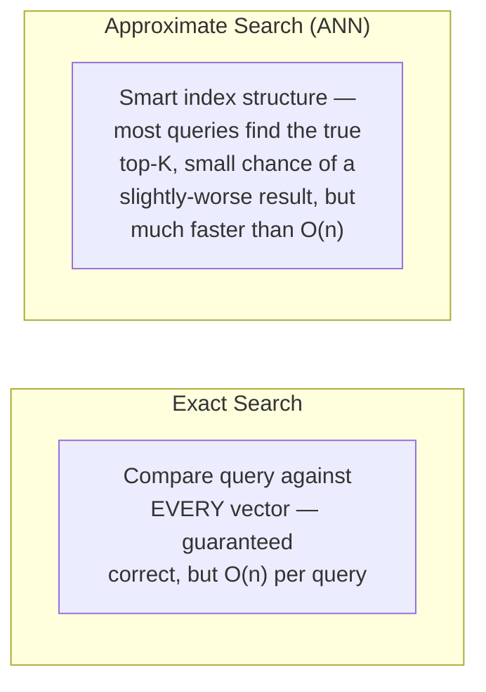
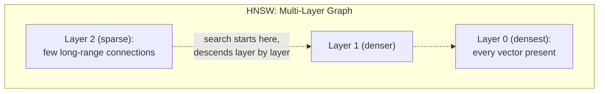
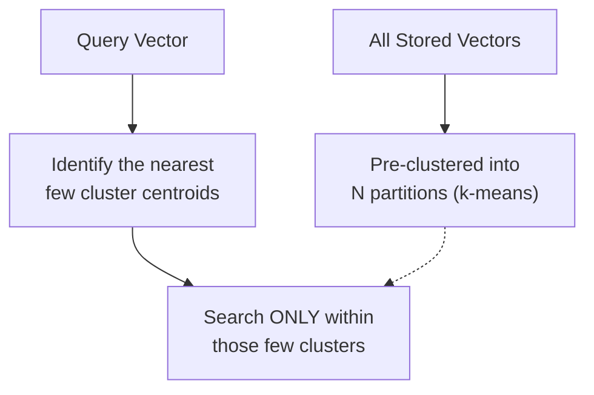
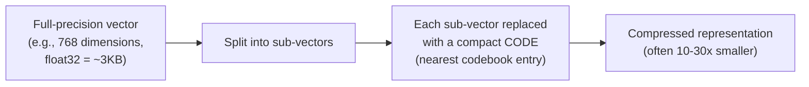

## Introduction

Chapter 58 closed by identifying the problem this chapter solves: brute-force similarity search doesn't scale, and approximate nearest-neighbor (ANN) algorithms trade a small amount of accuracy for dramatically faster search. This chapter delivers the mechanics of the three algorithmic families that make this trade-off work in practice — HNSW, IVF, and product quantization — at the depth a system designer needs to choose intelligently among them, echoing Chapter 37's "what you need versus don't need to know" framing now applied to vector indexing specifically.

## The Core Trade-off: Approximate, Not Exact

**Exact** nearest-neighbor search (brute-force, comparing the query against every stored vector) guarantees finding the true top-K most similar vectors, at linear-scan cost. **Approximate** nearest-neighbor (ANN) search accepts a small, usually tunable probability of missing the true top-K (returning a slightly-less-similar result instead) in exchange for search times that scale far better than linear — often sublinear, meaning search time grows much more slowly than the corpus size does.



This is a direct, concrete instance of the accuracy-versus-latency trade-off this series has discussed since Chapter 28's model compression — here applied to search infrastructure rather than model weights, but governed by the same underlying discipline: the acceptable level of approximation should be validated against the specific application's actual tolerance for occasionally missing a marginally-better result, not assumed universally acceptable.

## HNSW: Hierarchical Navigable Small World Graphs

**HNSW** builds a multi-layer graph structure where each stored vector is a node, and nodes are connected to their approximate nearest neighbors — search proceeds by starting at a sparse top layer and "zooming in" through progressively denser layers, following edges toward increasingly close neighbors, similar in spirit to how a skip list allows efficient search through a sorted structure without needing to scan every element.



```python
# Conceptual illustration of HNSW's greedy search — real implementations
# (via libraries like hnswlib or FAISS) handle the graph construction
# and multi-layer traversal with substantial additional engineering;
# this shows the core "greedy nearest-neighbor descent" idea.

def hnsw_search(query_vector, entry_point, graph_layers, top_k=5):
    current = entry_point
    for layer in reversed(graph_layers):  # start at the sparsest top layer
        current = _greedy_search_in_layer(query_vector, current, layer)
        # Move to this same node's position in the next, denser layer down
    # Final, most thorough search happens in the densest bottom layer
    candidates = _greedy_search_in_layer(
        query_vector, current, graph_layers[0], num_candidates=top_k * 4
    )
    return sorted(candidates, key=lambda c: c.distance_to(query_vector))[:top_k]
```

**Why HNSW is widely favored**: it typically provides an excellent balance of high recall (finding the true top-K most of the time) and low query latency, and supports efficient incremental insertion of new vectors (important for the update/delete capability Chapter 58 established as necessary for a real, evolving knowledge base) — at the cost of relatively high memory usage, since the full graph structure with its many connections must be held in memory.

## IVF: Inverted File Index

**IVF** takes a fundamentally different approach: it first **clusters** the entire vector space into a fixed number of partitions (using a clustering algorithm like k-means), then, at query time, identifies which few clusters the query vector likely belongs to and searches only *within those clusters* — dramatically reducing the search space compared to scanning everything, at the cost of potentially missing a true nearest neighbor that happens to sit in a different cluster than the one searched.



```python
def ivf_search(query_vector, cluster_centroids, cluster_assignments, n_probe=8, top_k=5):
    # Find the n_probe closest cluster centroids to the query —
    # this is the key tunable parameter: more probes = higher
    # recall, but proportionally slower search.
    nearest_clusters = find_nearest_centroids(query_vector, cluster_centroids, n_probe)

    candidates = []
    for cluster_id in nearest_clusters:
        candidates.extend(cluster_assignments[cluster_id])  # only search
                                                                # within these
                                                                # selected clusters

    return sorted(candidates, key=lambda c: c.distance_to(query_vector))[:top_k]
```

**The key tunable parameter, `n_probe`**: searching more clusters (a higher `n_probe`) increases recall (reduces the chance the true nearest neighbor was in an unsearched cluster) at the direct cost of proportionally slower search — a tunable dial directly analogous to the beam-width trade-off from Chapter 39's beam search discussion, where more exploration costs more compute in exchange for a better chance of finding a better result.

## Product Quantization (PQ): Compressing Vectors for Memory Efficiency

**Product quantization** addresses a different concern than HNSW or IVF's search-speed focus: **memory footprint**. PQ compresses each high-dimensional vector by splitting it into smaller sub-vectors and replacing each sub-vector with a compact code representing its nearest entry in a small, pre-learned "codebook" — directly analogous to Chapter 28's quantization technique, now applied to embedding vectors rather than model weights.



This is often **combined with** IVF (a common configuration called "IVF-PQ") — IVF handles the search-space reduction (which clusters to search), while PQ handles the memory reduction (compressing the vectors within those clusters) — illustrating that these three techniques are not mutually exclusive alternatives, but frequently-combined, complementary tools addressing different specific bottlenecks (search speed for HNSW/IVF, memory footprint for PQ), exactly the same "complementary, compounding techniques" pattern Chapter 51 established for LLM serving optimizations.

## Choosing Among These Techniques

| Priority | Recommendation |
|---|---|
| Best overall recall/latency balance, moderate corpus size, memory not tightly constrained | HNSW |
| Very large corpus, need to control the recall/speed trade-off explicitly via a tunable parameter | IVF |
| Memory footprint is the binding constraint (very large corpus, limited RAM) | IVF-PQ (or plain PQ) |
| Frequent insertions/deletions of individual vectors | HNSW (generally better incremental-update support than IVF's cluster-based structure) |

As with every other configuration choice this series has covered, most production vector databases (Chapter 58) implement one or more of these algorithms internally and expose them as a configuration choice — the system designer's job is understanding these trade-offs well enough to choose and tune appropriately for their specific corpus size, update frequency, and latency/recall requirements, validated empirically (per this series' consistent discipline) rather than assumed from general reputation alone.

## Key Takeaways

- Approximate nearest-neighbor (ANN) search trades a small, tunable chance of missing the true top-K result for dramatically better-than-linear search speed — the foundational trade-off underlying all vector indexing algorithms.
- HNSW builds a multi-layer graph structure enabling fast, greedy nearest-neighbor descent, generally offering an excellent recall/latency balance and good support for incremental updates, at the cost of higher memory usage.
- IVF pre-clusters the vector space and searches only within the most relevant clusters at query time, with `n_probe` as an explicit, tunable recall-versus-speed dial.
- Product quantization compresses vectors for memory efficiency (directly analogous to Chapter 28's model weight quantization) and is frequently combined with IVF, illustrating that these techniques are complementary tools addressing different bottlenecks, not mutually exclusive alternatives.

---

## Interview Questions

**1. Why is the "approximate" nature of ANN search a deliberate, accepted trade-off rather than a limitation to be avoided wherever possible?**
Exact nearest-neighbor search guarantees correctness but scales linearly with corpus size (Chapter 58's closing discussion), making it impractically slow for the large corpora typical of real production RAG applications; ANN algorithms deliberately sacrifice a small, generally tunable amount of guaranteed correctness (occasionally returning a slightly-less-similar result instead of the absolute best match) in exchange for dramatically faster search times that scale much better with corpus size — this is a deliberate, well-reasoned engineering trade-off (echoing Chapter 28's compression-accuracy trade-off) rather than a limitation to be minimized at all costs, since for the vast majority of RAG applications, retrieving the 2nd or 3rd most similar document instead of the absolute 1st most similar one has a negligible practical impact on the final answer quality, while the search speed improvement is essential for making the system practically usable at scale at all.
*Follow-up: Under what circumstance might this small accuracy sacrifice actually matter enough that a team should specifically avoid or minimize it, even at some search-speed cost?*
For an application where a very small number of documents contain the SPECIFIC, precise information needed to answer a query correctly, and where missing that ONE specific correct document (in favor of a merely "similar" but ultimately unhelpful alternative) would directly cause the RAG system to fail to answer correctly at all — for example, a legal or medical application searching for one very specific, narrow precedent or fact where near-misses genuinely don't substitute for the correct source — a team might reasonably tune their ANN algorithm's parameters toward HIGHER recall (accepting somewhat slower search) or, in an extreme case, use exact search for a smaller, particularly critical subset of the corpus, reflecting this series' consistent principle that the acceptable degree of approximation should be validated against the SPECIFIC application's actual tolerance for this kind of near-miss error, not assumed uniformly acceptable across all use cases.

**2. Explain HNSW's multi-layer graph structure and why searching from a sparse top layer down to a dense bottom layer is more efficient than searching the dense bottom layer directly.**
HNSW's top layers contain only a small subset of the total vectors, connected by relatively long-range edges — searching this sparse layer first allows the search to quickly cover large "distances" across the overall vector space with very few comparisons, efficiently narrowing down to the general region of the space where the query's true nearest neighbors likely reside; as the search descends to progressively denser layers (with more vectors and more, shorter-range connections), it refines this initial rough location into an increasingly precise answer — this hierarchical, coarse-to-fine approach avoids the cost of exhaustively exploring the DENSEST layer's many local connections from the very start, which would require many more comparisons to reach the correct general region purely through short, local hops, directly analogous to how a skip list or a multi-level index structure in classical computer science achieves faster search by combining sparse, long-range navigation with denser, local refinement.
*Follow-up: Why might this specific hierarchical approach be less beneficial (or even counterproductive) for a very SMALL vector corpus?*
For a very small corpus, the overhead of maintaining and traversing multiple graph layers (the construction and memory cost of the sparser upper layers) may not provide a meaningful speed benefit over simply and directly searching the single, already-small bottom layer (or even, for a small enough corpus, a full brute-force linear scan, per Chapter 58's discussion) — the hierarchical structure's benefit specifically comes from avoiding the cost of navigating a LARGE, densely-connected search space through purely local hops, and this benefit only meaningfully materializes once the corpus is large enough that this navigation cost would otherwise be significant, meaning HNSW's hierarchical complexity is a worthwhile investment specifically for large-scale corpora, not a universally beneficial structure regardless of corpus size.

**3. Why does IVF's `n_probe` parameter represent a direct, explicit trade-off between recall and speed, and how would you determine an appropriate value for a specific application?**
Since IVF only searches within the `n_probe` clusters closest to the query vector (rather than the entire corpus), there's always some chance that the TRUE nearest neighbor actually resides in a cluster that wasn't among the `n_probe` clusters selected for searching — increasing `n_probe` searches more clusters, directly increasing the probability of including whichever cluster the true nearest neighbor happens to reside in (improving recall), but proportionally increases the total search cost, since more clusters' worth of vectors must be compared against the query; I'd determine an appropriate `n_probe` value empirically (following this series' consistent evaluation discipline) — measuring actual recall (using a representative test set with known, verified correct nearest neighbors) and actual query latency across a few candidate `n_probe` values, selecting the smallest value that achieves acceptable recall for the specific application's requirements, rather than assuming a single, universal "correct" value applies regardless of the corpus's specific characteristics and clustering quality.
*Follow-up: Why might the OPTIMAL n_probe value differ significantly between two different corpora, even with the same number of total clusters configured?*
The appropriate `n_probe` depends heavily on how well the underlying clustering (the k-means clustering step establishing the IVF partitions) actually separates the corpus's true semantic structure — a corpus with well-separated, distinct semantic clusters (where similar documents cluster together cleanly and cluster boundaries rarely split closely-related content) can achieve good recall with a smaller `n_probe`, since the true nearest neighbors are more reliably concentrated within a query's nearest few clusters; a corpus with less distinct, more overlapping semantic structure (where similar content might legitimately straddle multiple cluster boundaries) would require a LARGER `n_probe` to achieve the same recall level, since relevant results are more likely to be scattered across a larger number of clusters near the query — this corpus-specific clustering quality is exactly why empirical validation (rather than assuming a universal, corpus-independent `n_probe` setting) is necessary for each specific application.

**4. Why is product quantization described as "directly analogous to Chapter 28's quantization technique," and what's the specific conceptual parallel between compressing model weights and compressing embedding vectors?**
Chapter 28's model weight quantization reduces the numerical precision used to represent each individual weight value (e.g., from 16-bit to 4-bit), accepting a small, generally well-tolerated accuracy trade-off in exchange for a dramatically smaller memory footprint; product quantization applies this same fundamental "accept a small precision loss for a large memory savings" trade-off to embedding VECTORS specifically — rather than reducing the precision of individual numeric values directly, PQ replaces entire SUB-VECTORS (groups of dimensions) with a compact code representing the nearest entry in a small, pre-learned codebook, achieving a similarly dramatic memory reduction (often 10-30x) through a conceptually parallel mechanism (approximating a more precise, larger representation with a smaller, compressed one) applied to a different kind of data (embedding vectors rather than model weights) but governed by the exact same underlying "small controlled accuracy loss for large memory savings" engineering trade-off philosophy established in Chapter 28.
*Follow-up: Why might the appropriate compression aggressiveness (how many sub-vectors, how large the codebook) for product quantization need to be validated separately and specifically for embedding vectors, rather than assuming the same compression settings that work well for model weight quantization (Chapter 28) would transfer directly?*
Model weights and embedding vectors have genuinely different statistical distributions and different roles in the overall system — a model's weights directly determine its learned computational behavior (Chapter 37), while an embedding vector's role is specifically to preserve MEANINGFUL RELATIVE DISTANCES between different vectors (since similarity search depends entirely on these relative distances being reasonably preserved, per Chapter 58's core similarity-search purpose) — over-aggressive compression of embedding vectors could distort these crucial relative distances more than an equivalent compression aggressiveness would distort a model weight's contribution to overall model behavior, meaning the acceptable compression trade-off for embeddings needs its own specific, empirical validation (measuring actual retrieval quality/recall degradation, following this series' consistent evaluation discipline) rather than assuming Chapter 28's model-weight-quantization settings and acceptable-degradation thresholds transfer directly to this structurally different compression context.

**5. Why might IVF-PQ (combining both techniques) be described as addressing "different specific bottlenecks" rather than being redundant, and what would happen if you tried to use ONLY PQ without IVF's clustering?**
IVF addresses SEARCH SPEED by reducing how many vectors must be compared against the query (searching only within the nearest few clusters, rather than the entire corpus), while PQ addresses MEMORY FOOTPRINT by compressing how much space each individual vector occupies — these are genuinely independent concerns: a corpus could have a search-speed problem without a memory problem (if the corpus is large but the compressed vectors would still comfortably fit in available memory even uncompressed) or a memory problem without wanting to sacrifice the exhaustiveness of searching the full corpus (if the corpus is memory-constrained but not so large that searching everything is prohibitively slow) — combining both in "IVF-PQ" addresses BOTH bottlenecks simultaneously when both are genuinely present, but using ONLY PQ without IVF's clustering would still require comparing the query against every (now compressed, but still individually processed) vector in the ENTIRE corpus, meaning you'd get PQ's memory savings but NOT IVF's search-space-reduction speed benefit — illustrating that PQ alone addresses memory but not search speed, while IVF alone addresses search speed but not memory, and the combination is specifically valuable when a system needs both benefits simultaneously.
*Follow-up: In what scenario might a team choose to use ONLY IVF (without PQ) or ONLY PQ (without IVF), rather than always combining them?*
A team with a large corpus needing faster search but with ample, non-constrained memory available might use IVF alone, since the additional complexity and small accuracy trade-off of PQ's compression wouldn't be providing any genuinely needed benefit if memory isn't actually a binding constraint for their specific deployment; conversely, a team with a corpus small enough that exhaustive search remains fast enough for their latency requirements, but where memory is genuinely tightly constrained (perhaps deploying on more limited hardware), might use PQ alone (without IVF's clustering) specifically to reduce memory footprint while still searching the entire, now-compressed corpus exhaustively — in both cases, the decision to use one technique alone rather than combining both reflects this series' consistent "add complexity (here, combining two techniques) only when both underlying problems are genuinely, simultaneously present" principle, rather than defaulting to the more complex combined configuration regardless of whether both specific benefits are actually needed.

**6. In an interview, if asked to choose a vector indexing strategy for a RAG application with a rapidly and continuously growing document corpus (millions of new documents added daily), how would you use this chapter's framework to justify your recommendation?**
I'd favor HNSW specifically because of this chapter's noted advantage in supporting efficient incremental insertion of new vectors — a rapidly, continuously growing corpus needs an indexing structure that can accommodate frequent, ongoing additions without requiring expensive, disruptive full-index rebuilds; IVF's cluster-based structure, by contrast, can become less well-calibrated over time as new vectors are added that may not fit well into the ORIGINALLY-computed cluster boundaries (since those clusters were computed via k-means on the corpus as it existed AT THAT TIME), potentially requiring periodic, more disruptive re-clustering to maintain good search quality as the corpus's actual distribution evolves and grows — HNSW's graph-based structure, which can more naturally and incrementally accommodate new nodes without this same kind of "the original clustering no longer fits" degradation, makes it the more naturally well-suited choice for this specific, continuously-growing corpus scenario this question describes.
*Follow-up: What would you monitor over time to confirm that HNSW's incremental-insertion advantage is actually holding up well for this specific, continuously-growing corpus, rather than assuming it indefinitely?*
I'd monitor actual retrieval recall and query latency over time (per this series' consistent empirical-validation discipline) as the corpus continues to grow through ongoing incremental insertions, watching for any gradual degradation in either metric that might indicate the incrementally-built graph structure is becoming less optimally organized than a structure built from a full, fresh construction over the current, larger corpus would be — even HNSW's generally good incremental-insertion support isn't necessarily perfectly equivalent to a fresh, from-scratch index build indefinitely, and periodically validating (and, if a meaningful degradation is measured, periodically rebuilding) the index from scratch might still be a reasonable, evidence-based practice even while primarily relying on HNSW's incremental-insertion capability for the ongoing, day-to-day addition of new documents between these periodic full rebuilds.

**7. How would you use this chapter's material to explain, to a stakeholder unfamiliar with the technical details, why a RAG system might occasionally fail to retrieve a document that seems, to a human, obviously and highly relevant to a query?**
I'd explain that the vector database's search process (using one of this chapter's approximate algorithms — HNSW, IVF, or a combination) makes a deliberate, generally very effective but not perfectly infallible trade-off between search speed and guaranteed correctness — in the rare cases where the approximate search doesn't find the true best match (an accepted, small-probability outcome of this deliberate speed-versus-perfect-accuracy trade-off, this chapter's foundational concept), a genuinely relevant document could be missed even though a human, examining the full corpus directly, would immediately recognize its relevance; I'd frame this not as "the system is broken" but as an inherent, deliberate, and generally well-justified characteristic of the approximate search technology that makes RAG retrieval practically fast enough to be usable at the corpus scale this system operates at, while noting that this failure mode's frequency can be measured and, if it's occuring too often for this specific application's needs, the underlying algorithm's parameters (like IVF's `n_probe`) can be tuned toward higher recall at some cost to search speed.
*Follow-up: How would you distinguish, when investigating a specific reported "missed relevant document" complaint, whether this was actually caused by the approximate search algorithm's inherent trade-off, versus a different root cause entirely (like a poor embedding model or chunking strategy, per Chapter 58's earlier diagnostic discussion)?*
I'd first check whether an EXACT (brute-force) search, using the SAME embedding vectors and similarity metric, would have actually found and ranked the missed document highly — if an exact search DOES find it as a genuinely strong match, this confirms the failure was specifically due to the approximate search algorithm's inherent trade-off (this chapter's core concern), pointing toward tuning the algorithm's parameters (increasing IVF's `n_probe`, or reviewing HNSW's construction parameters) as the appropriate remediation; if an exact search using the SAME vectors ALSO fails to rank the document highly (meaning even a perfect, exhaustive search over the CURRENT embeddings wouldn't have found it as similar), this indicates the actual root cause lies elsewhere — likely in the embedding model's quality or the chunking strategy (Chapter 58's and Chapter 61's territory) rather than in this chapter's approximate-search algorithms at all, directly applying the same "isolate the specific variable" diagnostic discipline this series has consistently recommended (e.g., Chapter 52's quantization-versus-framework isolation).

**8. Why might a team need to periodically REBUILD their vector index (not just incrementally update it) even when using HNSW's generally good incremental-insertion support?**
Even with good incremental-insertion support, a graph or index structure built up entirely through a long sequence of individual incremental insertions over time can, in some cases, become somewhat less optimally organized than a structure built fresh, all at once, from the complete, current corpus — accumulated incremental changes (especially combined with deletions, per Chapter 58's discussion of the necessary delete capability) can introduce a kind of structural inefficiency or "drift" from the theoretically optimal graph structure that a from-scratch rebuild, using the current, complete corpus, would produce; periodically rebuilding the index from scratch (following the same staged, canary-deployment-style migration process discussed in Chapter 58's earlier re-embedding-migration question) can restore this optimal structure, providing a genuine, measurable performance and/or recall improvement compared to continuing to rely solely on an ever-more-incrementally-modified structure — a maintenance practice directly analogous to periodic database index rebuilding or defragmentation in classical database administration.
*Follow-up: How would you decide on an appropriate CADENCE for this periodic full rebuild, balancing its benefit against its cost and operational complexity?*
I'd monitor the actual, measured search quality and performance (recall, latency) over time as incremental changes accumulate, looking for a measurable degradation trend that would indicate the index structure is becoming meaningfully less optimal — using this empirical signal (rather than an arbitrary, fixed calendar schedule) to determine when a rebuild is actually warranted, following this series' consistent "trigger maintenance based on measured need, not an arbitrary fixed schedule" principle (echoing, for example, Chapter 34's evidence-based retraining triggers) — if this monitoring shows the index's performance remains stable and acceptable over a long period of ongoing incremental changes, a full rebuild might reasonably be deferred; if a meaningful degradation trend is detected, that provides the concrete, evidence-based trigger for scheduling the next rebuild, rather than either rebuilding unnecessarily often (wasting engineering effort and computational resources) or never rebuilding at all despite a genuine, measured degradation.

**9. How would you use this chapter's concepts to reason about the cost implications of choosing a highly memory-intensive indexing configuration (like HNSW without any compression) versus a more memory-efficient one (like IVF-PQ), for a very large-scale RAG deployment?**
I'd directly connect this to Chapter 42's cost-modeling discipline — a highly memory-intensive index (uncompressed HNSW) requires provisioning more expensive, higher-memory infrastructure to hold the entire index in memory for fast search, directly increasing infrastructure cost proportionally to the corpus size; a more memory-efficient configuration (IVF-PQ) allows serving the same corpus size on less expensive, lower-memory infrastructure, at the cost of the small recall degradation from PQ's compression (this chapter's earlier discussion) and IVF's cluster-based search-space reduction — I'd calculate the actual infrastructure cost difference between these two configurations at the specific corpus scale in question, and weigh this concrete cost savings against the measured recall/quality impact (validated empirically, per this series' consistent discipline) to determine whether the more memory-efficient, cost-saving configuration provides an acceptable trade-off for this specific application's requirements, rather than defaulting to either the most memory-intensive "safest" option or the most memory-efficient "cheapest" option without this kind of explicit, quantified cost-quality trade-off analysis.
*Follow-up: At what SCALE of corpus size would this cost difference likely become a MORE significant consideration in the overall system design decision, compared to a smaller-scale deployment?*
For a smaller corpus (perhaps thousands to low tens of thousands of documents), the absolute memory footprint difference between an uncompressed and a compressed index configuration is likely to be small in absolute terms, meaning the resulting infrastructure cost difference would also be comparatively minor and perhaps not worth the added complexity of adopting PQ; as the corpus scales into the millions or tens of millions of documents (a realistic scale for many enterprise knowledge bases or large-scale consumer applications), the ABSOLUTE memory footprint difference between compressed and uncompressed configurations becomes proportionally much larger, correspondingly making the resulting infrastructure cost difference a much more significant, decision-relevant factor — illustrating that, much like several other trade-offs this series has discussed (e.g., Chapter 41's self-hosting break-even point), the RIGHT choice can genuinely shift as scale changes, reinforcing the importance of validating this decision against the SPECIFIC scale of the actual deployment in question rather than applying a single, fixed rule of thumb regardless of scale.

**10. How would you explain to a data scientist why understanding these vector indexing algorithms at a conceptual level (this chapter's depth) is valuable, even if they'll never personally implement HNSW or IVF from scratch?**
Echoing Chapter 37's "what a system designer needs to know" framing, understanding these algorithms' core trade-offs (approximate versus exact, the specific recall-versus-speed dials each algorithm exposes, and PQ's memory-versus-accuracy trade-off) equips a data scientist to make informed, justified configuration decisions when using an established vector database (Chapter 58) that exposes these algorithms as configuration choices, rather than blindly accepting default settings without understanding what trade-offs those defaults actually represent, or, conversely, tuning parameters (like IVF's `n_probe`) without understanding what they're actually trading off against — this conceptual understanding, without requiring the ability to implement these algorithms from scratch (which is more the domain of specialized vector database engineering teams, per this series' recurring build-vs-buy discipline, Chapter 41), is exactly the practical, decision-relevant depth needed to correctly evaluate and tune a production RAG system's retrieval infrastructure.
*Follow-up: What specific, concrete decision would a data scientist be better equipped to make, having read this chapter, compared to a data scientist who has only heard that "vector databases use approximate search" without this chapter's specific algorithmic detail?*
A data scientist equipped with this chapter's detail would know to specifically investigate and potentially tune the `n_probe` parameter (if using an IVF-based configuration) when diagnosing a retrieval-quality problem, rather than only knowing "the search is approximate" without any actionable lever to investigate or adjust — they would also know to specifically consider whether memory constraints (motivating PQ) or update-frequency requirements (favoring HNSW) are the more relevant consideration for their specific deployment scenario, rather than treating "which vector database indexing option should I choose" as an opaque, unexplainable configuration setting to be selected arbitrarily or based purely on a vendor's default recommendation without this kind of informed, trade-off-aware understanding of what that specific choice actually represents and controls.

**11. Why might a system designer need to reason about vector indexing algorithm choice DIFFERENTLY for a RAG application compared to a recommendation system's similarity search (echoing Chapter 14's original embeddings discussion), even though both use the same underlying ANN techniques?**
While both applications share the same underlying ANN algorithmic toolkit (HNSW, IVF, PQ), their specific requirements can differ meaningfully — a RAG application's retrieval typically needs to happen within a tight, interactive latency budget as part of a larger, synchronous request-response cycle (Chapter 5, Chapter 50's TTFT discussion, since the retrieval result directly feeds into and blocks the subsequent LLM generation step), while a recommendation system's similarity search might sometimes be computed more asynchronously or with somewhat more latency tolerance (e.g., pre-computing recommendations in a batch process rather than purely real-time, depending on the specific recommendation use case) — additionally, a RAG application's corpus (a knowledge base of documents) might have different growth and update patterns than a recommendation system's embedding space (e.g., user or item embeddings, which might update on a different cadence, per Chapter 15's original online feature computation discussion) — these differing specific requirements (latency tolerance, update patterns) could reasonably lead to different specific algorithm and parameter choices even though the underlying algorithmic toolkit is shared between these two application types.
*Follow-up: What specific SHARED underlying principle from this chapter would apply equally well to informing BOTH of these applications' specific configuration choices, despite their differing specific requirements?*
The shared, underlying principle is this chapter's core discipline of VALIDATING the accuracy-versus-speed (and, where relevant, memory) trade-off EMPIRICALLY, against the SPECIFIC application's own actual requirements and corpus characteristics, rather than assuming a single, universal configuration is correct across all applications regardless of their differing specific needs — whether the specific application is a RAG system or a recommendation system, the fundamental discipline of measuring actual recall and latency under representative conditions and tuning the specific algorithm's parameters accordingly (this chapter's `n_probe` discussion, and the general "validate rather than assume" theme running throughout this entire series) applies equally and transferably to both application types, even though the SPECIFIC resulting configuration choices might reasonably differ between them given their differing specific latency tolerances and corpus update patterns.

**12. How would you use this chapter's material to critically evaluate a vendor's claim that "our vector database achieves 99.9% recall with sub-10ms query latency," without further context?**
I'd want to know the SPECIFIC corpus size and dimensionality this benchmark was measured against (since, per this chapter's discussion, achievable recall-latency trade-offs depend heavily on corpus scale and the specific algorithm/parameter configuration used), and specifically what algorithm and parameter configuration (which specific `n_probe` value for IVF, or which specific HNSW construction parameters) produced this reported result — a benchmark measured on a small, easy corpus with a very generous (accuracy-favoring, but computationally more expensive) parameter configuration might not transfer at all to a much larger, more realistically-scaled corpus, or might not hold if the vendor's default, out-of-the-box configuration for a new customer is actually tuned differently (more toward speed, less toward recall) than whatever specific configuration produced this particular reported benchmark number — following this series' consistent "validate any headline claim against your own specific conditions" discipline (echoing Chapter 52's serving-framework benchmark skepticism), rather than accepting this kind of impressive-sounding but potentially non-representative or context-free vendor claim at face value.
*Follow-up: What specific test would you run, using your own actual corpus and query patterns, to validate or refute this kind of vendor claim before committing to this technology for your production system?*
I'd construct a representative test set from MY OWN specific corpus (at a realistic, representative scale for my actual production use case) along with a set of test queries with KNOWN, verified true nearest neighbors (perhaps computed via exact, brute-force search on this same test corpus, per this chapter's earlier discussion of using exact search as a validation baseline) — then measuring the vendor's actual achieved recall and latency on THIS specific test set, under a configuration reasonably representative of what I'd actually deploy in production, rather than relying solely on the vendor's own reported, potentially non-representative benchmark numbers — this kind of direct, self-conducted empirical validation, using my own actual data and query patterns, is the only reliable way to confirm whether a vendor's general performance claims will actually hold for MY specific production deployment scenario.

**13. How would you handle a situation where switching from one vector indexing algorithm to another (e.g., from IVF to HNSW) for cost or performance reasons reveals an unexpected change in WHICH specific documents get retrieved for certain queries, even for queries that previously worked well?**
I'd first confirm this is an expected, inherent consequence of switching between two DIFFERENT approximate algorithms (which, per this chapter's core "approximate, not exact" framing, can each independently and differently approximate the true nearest-neighbor result, meaning switching algorithms can genuinely change which specific near-ties get returned even when both algorithms are functioning correctly according to their own respective approximation guarantees) rather than assuming this indicates an implementation bug in the new algorithm; I'd then specifically evaluate (per this chapter's and Chapter 21's evaluation discipline) whether this change in RETRIEVED documents actually translates into a meaningful change in the RAG system's overall FINAL ANSWER quality for the affected queries — a change in which specific near-tied document gets retrieved might have negligible impact on final answer quality if both the old and new retrieved documents happen to contain similarly relevant, sufficient information, in which case this observed change, while real, wouldn't represent a genuine regression worth blocking the algorithm migration over.
*Follow-up: What would you do if this evaluation DID reveal a genuine, meaningful quality regression for a specific subset of queries after the algorithm switch?*
I'd investigate whether this specific subset of affected queries shares a common characteristic (perhaps queries near a particular region of the embedding space where the new algorithm's specific approximation behavior happens to perform less well than the old algorithm's did, or queries relying on a particular kind of document that the new algorithm's clustering or graph structure handles less optimally) — using this diagnostic insight to either tune the new algorithm's parameters specifically to address this identified weak spot (following this chapter's `n_probe`-style tuning discipline), or, if no acceptable tuning resolves the issue, reconsidering whether the algorithm switch is actually well-justified overall once this specific, measured quality regression for this identified query subset is properly weighed against whatever cost or performance benefit motivated considering the switch in the first place — treating this as a genuine, evidence-based trade-off evaluation (following this series' consistent discipline) rather than either abandoning the switch reflexively at the first sign of ANY difference, or proceeding with the switch while ignoring a genuinely measured, meaningful quality regression.

**14. Why might a very large enterprise with multiple, genuinely distinct RAG applications (each with different corpus sizes, update frequencies, and latency requirements) reasonably use DIFFERENT vector indexing algorithm configurations across these different applications, rather than standardizing on a single configuration organization-wide?**
This directly echoes the same "different use cases have different specific requirements, warranting different specific configurations" principle this series has applied to model selection (Chapter 40-41), decoding strategy (Chapter 39), and serving framework choice (Chapter 52) — a small, rarely-updated internal documentation corpus with relaxed latency requirements might reasonably use a simpler, more memory-efficient IVF-PQ configuration, while a large, rapidly-growing, latency-sensitive customer-facing application might justify HNSW's higher memory cost for its superior incremental-update support and generally excellent recall-latency balance — forcing a single, uniform configuration across these genuinely different use cases, purely for organizational standardization's sake, would likely mean at least some applications end up using a poorly-suited configuration for their own specific, actual requirements, following this series' consistent principle that per-use-case optimization, validated against each specific application's own actual needs, generally produces better overall outcomes than premature, one-size-fits-all standardization.
*Follow-up: What GENUINE benefit might standardization still provide, even if it means some individual applications don't get the theoretically most optimal configuration for their specific needs?*
Standardizing on a smaller, more limited set of vector database technologies and indexing configurations (even if not perfectly optimal for every single individual application) provides genuine operational benefits — a smaller number of technologies and configurations for the organization's engineering teams to develop deep expertise in, build shared tooling and monitoring around (per Chapter 33's observability discipline, now applied to vector-database-specific operational metrics), and troubleshoot effectively when problems arise, rather than needing to maintain deep expertise across many different, bespoke configurations — this represents the same standardization-versus-per-use-case-optimization trade-off this series has discussed for other similar organizational technology decisions (e.g., Chapter 52's "different frameworks for different use cases" discussion), where a reasonable middle ground often involves standardizing on a SMALL, well-chosen SET of configurations covering the organization's most common use-case patterns, rather than either forcing complete uniformity or allowing complete, unconstrained per-application customization.

**15. How would you summarize, for someone moving on to Chapter 60's RAG architecture deep dive, why this chapter's vector indexing material is a necessary technical foundation for that next chapter's broader architectural discussion?**
Chapter 60 will develop the FULL RAG architecture — how retrieval, augmentation, and generation fit together as a complete system — and this chapter's material establishes the specific technical mechanics and trade-offs underlying the RETRIEVAL half of that architecture, which Chapter 60 will build upon rather than re-derive; understanding that retrieval is APPROXIMATE (this chapter's core theme), that it involves explicit, tunable recall-versus-speed trade-offs (IVF's `n_probe`), and that memory and update-frequency considerations meaningfully constrain the achievable configuration (HNSW versus IVF-PQ) equips a reader to understand Chapter 60's discussion of RAG system design with appropriate technical grounding — recognizing, for instance, that a RAG system's occasional retrieval failures aren't necessarily bugs but can be inherent, expected consequences of this chapter's approximate-search trade-offs, exactly the kind of grounded, mechanistic understanding this series has consistently aimed to build before addressing higher-level architectural questions.
*Follow-up: What specific question from this chapter would you expect Chapter 60 to directly build upon when discussing the overall RAG system's end-to-end latency budget?*
I'd expect Chapter 60 to directly build upon this chapter's recall-versus-speed trade-off (IVF's `n_probe`, HNSW's construction parameters) when decomposing the RAG system's overall end-to-end latency budget (echoing Chapter 26's latency decomposition discipline, now applied to a RAG pipeline specifically) — explicitly identifying the vector database's search latency as one distinct, separately-tunable component of the overall pipeline (alongside the embedding computation, the LLM generation step from Part 10, and any additional processing like re-ranking, a topic Chapter 63 will cover), with THIS chapter's specific algorithm and parameter choices being the concrete, actionable lever available for tuning that specific component's contribution to the overall latency budget, directly connecting this chapter's algorithmic detail to Chapter 60's necessarily more holistic, end-to-end architectural and latency-budgeting perspective.
