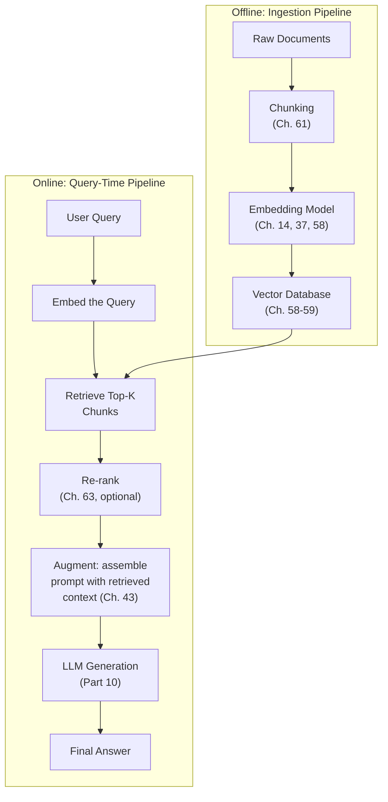
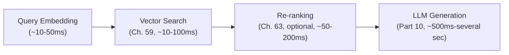

## Introduction

Chapters 58-59 built the vector database and its indexing algorithms — the retrieval engine. This chapter assembles the complete **retrieval-augmented generation (RAG)** architecture: every stage from raw documents to a final, grounded answer, the failure modes specific to each stage, and the end-to-end latency and cost budget that ties directly back to Part 10's serving concepts. This is the architectural centerpiece Chapter 44 first motivated and this Part has been building toward since Chapter 58.

## The Complete Pipeline



RAG's name describes exactly these three online stages: **R**etrieve relevant context, **A**ugment the prompt with it, **G**enerate the final answer — but the *offline* ingestion pipeline (chunking, embedding, indexing) is equally consequential and is where many real-world RAG quality problems actually originate.

## Stage 1: Ingestion (Offline)

Documents must be **chunked** (Chapter 61 will cover this in full depth — for now, understand that raw documents are broken into smaller, individually-embeddable and individually-retrievable pieces) and embedded before they can be indexed. This is a data pipeline in the classical sense (Chapter 8's batch pipeline concepts apply directly), and its quality directly bounds everything downstream — echoing Chapter 58's closing point that retrieval quality is a hard ceiling on overall RAG system quality.

## Stage 2: Retrieval (Online)

The user's query is embedded using the *same* embedding model used during ingestion (Chapter 58's non-negotiable consistency requirement) and used to search the vector database (Chapters 58-59) for the top-K most similar chunks.

**A critical, easily-overlooked failure mode**: a user's query and the relevant document content are often phrased very differently — a user might ask "how do I get my money back," while the relevant policy document says "refund eligibility criteria." Pure semantic similarity search generally handles this reasonably well (that's precisely what embeddings are designed to capture, per Chapter 14), but it isn't perfect, motivating the **hybrid search** approach (combining semantic and keyword search) Chapter 62 will develop.

## Stage 3: Augmentation

The retrieved chunks are assembled into the LLM's prompt, alongside the system prompt and the user's actual query — directly consuming the context window budget established in Chapter 38, at the token cost established in Chapter 42, and the KV cache memory established in Chapter 50 and Chapter 53. This is where most of this Part's earlier chapters converge: **every chunk retrieved has a real, quantifiable cost**, motivating why retrieval should prioritize precision (fewer, more relevant chunks) over recall-maximizing volume (many chunks, hoping something useful is in there), a theme Chapter 37 previewed and this chapter now makes central.

```python
def assemble_rag_prompt(system_prompt: str, retrieved_chunks: list[str],
                          user_query: str, max_context_tokens: int) -> str:
    """
    Illustrative prompt assembly — note the explicit budget check,
    directly connecting Ch. 38's context window discipline to this
    chapter's augmentation stage.
    """
    context_section = "\n\n".join(
        f"[Source {i+1}]: {chunk}" for i, chunk in enumerate(retrieved_chunks)
    )
    full_prompt = f"{system_prompt}\n\nContext:\n{context_section}\n\nQuestion: {user_query}"

    estimated_tokens = estimate_tokens(full_prompt)  # Ch. 38's heuristic
    if estimated_tokens > max_context_tokens:
        # Truncate the LEAST relevant chunks first (assuming chunks are
        # already ranked by relevance) rather than failing outright —
        # a graceful degradation strategy, echoing Ch. 56's discussion.
        retrieved_chunks = retrieved_chunks[:len(retrieved_chunks) - 1]
        return assemble_rag_prompt(system_prompt, retrieved_chunks, user_query, max_context_tokens)
    return full_prompt
```

## Stage 4: Generation

The augmented prompt is sent to the LLM (Part 10's entire serving infrastructure applies here unchanged) to produce the final answer. A well-designed system prompt for RAG specifically instructs the model to **ground its answer in the provided context** and, ideally, to acknowledge when the retrieved context doesn't actually contain a sufficient answer — directly mitigating the hallucination risk Chapter 36 first flagged, since an LLM given insufficient or irrelevant context can still confidently generate a plausible-sounding but ungrounded answer if not explicitly instructed otherwise.

```python
rag_system_prompt = """
Answer the user's question using ONLY the information in the provided
context. If the context does not contain sufficient information to
answer the question, say so explicitly rather than guessing or using
outside knowledge.
"""
```

## Failure Modes by Stage

| Stage | Failure Mode | Root Cause |
|---|---|---|
| Ingestion | Poor chunk boundaries splitting related content | Chunking strategy (Chapter 61) |
| Retrieval | Query phrasing doesn't match document phrasing | Pure semantic search limitations (Chapter 62's hybrid search) |
| Retrieval | Approximate search misses the true best match | ANN trade-off (Chapter 59) |
| Augmentation | Relevant content displaced by less-relevant chunks due to context budget | Chunk count/ordering strategy, re-ranking (Chapter 63) |
| Generation | Model ignores provided context, hallucinates instead | Insufficient grounding instructions, or model not following them reliably |

This decomposition directly enables the diagnostic discipline Chapter 58 introduced: a RAG failure should be traced to the *specific stage* responsible, not treated as an undifferentiated "the RAG system is bad" symptom — exactly the "isolate the specific variable" discipline this series has applied since Chapter 26.

## The End-to-End Latency and Cost Budget



Directly extending Chapter 26's latency decomposition discipline: generation (Part 10) typically dominates total latency, but retrieval and re-ranking are not negligible, especially at scale or with a large corpus — and every stage's cost (Chapter 42's per-token cost for generation, Chapter 59's compute cost for search, any re-ranking model's own inference cost) sums into the system's total per-query cost, meaning a genuinely complete RAG cost model must account for the *entire* pipeline, not generation alone.

## Key Takeaways

- RAG consists of an offline ingestion pipeline (chunking, embedding, indexing) and an online query pipeline (retrieve, augment, generate) — ingestion quality is a hard ceiling on retrieval quality, which is itself a hard ceiling on final answer quality.
- Every retrieved chunk has a real, quantifiable cost in tokens, latency, and KV cache memory (directly connecting to Chapters 38, 42, 50, 53) — motivating retrieval precision over indiscriminate recall-maximizing volume.
- A well-designed RAG system prompt explicitly instructs the model to ground its answer in retrieved context and acknowledge insufficient context, directly mitigating hallucination risk.
- RAG failures should be diagnosed by isolating the specific responsible stage (ingestion, retrieval, augmentation, or generation) rather than treated as an undifferentiated system-wide symptom, and the full cost/latency budget spans every stage, not generation alone.

---

## Interview Questions

**1. Why does this chapter insist that the OFFLINE ingestion pipeline is "equally consequential" to the online query pipeline, even though most RAG discussions focus heavily on retrieval and generation?**
Chapter 58 established that retrieval quality is a hard ceiling on overall RAG answer quality — but retrieval quality itself is entirely dependent on the quality of what was actually indexed during ingestion: if documents are poorly chunked (splitting related content awkwardly, per Chapter 61), embedded with an inappropriate model, or simply not kept current with the source of truth (Chapter 58's staleness discussion), no amount of sophistication in the online retrieval or generation stages can compensate for retrieving from a fundamentally flawed or incomplete index — this makes ingestion pipeline quality a genuine, foundational constraint on the entire system, deserving the same engineering rigor (data validation, per Chapter 10; pipeline monitoring, per Chapter 33) as any other data pipeline this series has covered, rather than being treated as a one-time, "set it and forget it" preprocessing step.
*Follow-up: What specific Chapter 10 data-quality practice would you recommend applying to a RAG ingestion pipeline specifically?*
I'd apply Chapter 10's schema and content validation checks to the ingestion pipeline — verifying that documents are successfully parsed and chunked without silent truncation or corruption, that embeddings are successfully generated for every chunk (catching any embedding-model API failures or malformed inputs that might silently produce missing or invalid vectors), and that the vector database's upsert operations complete successfully and are verifiable (perhaps via a periodic reconciliation check, echoing Chapter 58's staleness-detection discussion) — treating the ingestion pipeline with the same "validate at every step, don't assume silent success" discipline Chapter 10 established for classical ML data pipelines, since a silent ingestion failure (a document that failed to embed or index correctly) would create an invisible gap in the RAG system's knowledge that could persist undetected for a long time without this kind of explicit validation.

**2. Explain the specific failure mode this chapter identifies — "query phrasing doesn't match document phrasing" — and why pure semantic (embedding-based) search doesn't always fully solve it.**
This failure mode arises because a user's natural, conversational way of asking a question (e.g., "how do I get my money back") can differ substantially in vocabulary and phrasing from how the relevant answer is actually written in the source documents (e.g., "refund eligibility criteria") — embeddings (Chapter 14) are specifically designed to capture semantic similarity beyond exact keyword overlap, and generally handle a meaningful degree of this phrasing mismatch well, but embedding models aren't perfect, and for certain domains with highly specific terminology, acronyms, or exact phrase matching needs (e.g., a specific product SKU, a specific legal clause number, or a precise technical term), pure semantic similarity can sometimes fail to surface the correct match if the semantic embedding doesn't happen to capture the specific, narrow lexical overlap that would be the strongest and most reliable signal for that particular kind of query.
*Follow-up: Why might this specific failure mode be MORE pronounced for a domain-adapted RAG application (Chapter 47) using highly specialized terminology, compared to a general-purpose RAG application?*
As Chapter 47 discussed, specialized domains often use precise, narrow terminology, acronyms, and exact phrasing conventions where getting the SPECIFIC term or code exactly right matters a great deal (a legal citation, a medical diagnosis code, a specific part number) — a general-purpose embedding model (even if reasonably good at capturing general semantic similarity) may not have been trained on enough domain-specific text to reliably capture the FINE-GRAINED semantic distinctions between similar-sounding but importantly different specialized terms, making pure semantic search comparatively less reliable for this kind of precise, terminology-sensitive retrieval need — directly motivating why Chapter 62's hybrid search (combining semantic search with exact keyword matching) is often PARTICULARLY valuable and commonly adopted specifically for these kinds of specialized, terminology-precise domains, more so than for a general-purpose, conversational RAG application where this specific failure mode is less pronounced.

**3. Why does this chapter argue that "retrieval should prioritize precision over recall-maximizing volume," directly connecting this recommendation to Chapters 38, 42, 50, and 53?**
Each additional retrieved chunk directly and proportionally consumes context window budget (Chapter 38), increases token cost (Chapter 42), and increases KV cache memory usage for that request (Chapters 50, 53) — meaning retrieving MORE chunks isn't a "free" way to increase the chance of including something useful; it has a real, quantifiable, and compounding cost across multiple dimensions this Part has established; additionally, Chapter 37 established that self-attention's computational cost scales quadratically with total context length, meaning more retrieved chunks doesn't just add linear cost but potentially super-linear computational cost as well — given these very real costs, a retrieval strategy that returns a SMALLER number of highly relevant, precisely-matched chunks (prioritizing precision) is generally more cost-effective than one that returns a LARGER number of chunks with lower average relevance (prioritizing recall/coverage) hoping the LLM will "figure out" which parts are actually useful, especially since a longer, noisier context can also potentially degrade the LLM's ability to focus on and correctly ground its answer in the truly relevant portions.
*Follow-up: Under what circumstance might a team deliberately choose to retrieve MORE chunks than strictly necessary, accepting this additional cost, despite this chapter's general precision-favoring guidance?*
For a task genuinely requiring synthesis across MULTIPLE distinct pieces of information that might not all be captured by a small number of highly-precise top matches (e.g., a comprehensive research summary question requiring information scattered across several different source documents, rather than a single, precisely-answerable factual question), a team might deliberately retrieve a larger number of chunks specifically because the task's genuine information need spans more content than a narrow, precision-focused retrieval would capture — this represents a genuine, task-specific exception to the general precision-favoring guidance, validated by the actual nature of the specific task's information need (echoing this series' consistent "the right configuration depends on the specific application's actual requirements" principle) rather than a wholesale rejection of the general precision-favoring recommendation for tasks that don't have this particular multi-source synthesis characteristic.

**4. Why is instructing the LLM to "acknowledge when the retrieved context doesn't contain a sufficient answer" described as directly mitigating hallucination risk, connecting to Chapter 36's original discussion?**
Chapter 36 established hallucination as an LLM generating fluent, confident-sounding but factually incorrect or unsupported content — without explicit instruction, an LLM given an insufficient or irrelevant retrieved context for a specific question might still attempt to generate a plausible-sounding answer anyway, potentially drawing on its own general pre-trained knowledge (which may be outdated, incomplete, or simply wrong for this specific, narrow context) rather than correctly recognizing and communicating that the provided context doesn't actually support a confident, grounded answer; explicitly instructing the model to acknowledge insufficient context directly counteracts this specific failure mode by giving the model an explicit, sanctioned "out" — a way to respond honestly and usefully ("I don't have enough information to answer that based on the provided sources") rather than feeling compelled (due to its general training toward being helpful and providing an answer, per Chapter 46's alignment discussion) to generate SOME kind of answer even when the actual, correct, honest answer would be "I don't know."
*Follow-up: Why might this instruction alone not be fully sufficient to reliably prevent hallucination, even when included in a well-designed system prompt?*
As Chapter 43 and Chapter 46 both established, an LLM's adherence to any given instruction — including this specific "acknowledge insufficient context" instruction — is not perfectly guaranteed; the model's underlying training and alignment (Chapter 46) shapes a general tendency toward helpfulness that can sometimes still override or insufficiently weight this specific grounding instruction, especially for a query where the model's own general, pre-trained knowledge happens to provide a plausible-sounding (but not properly grounded in the ACTUAL provided context) answer that the model might generate instead of correctly recognizing the context's insufficiency — this is precisely why a comprehensive RAG evaluation strategy (a topic Chapter 66 will develop) needs to specifically and directly test for this exact failure mode (providing an insufficient or irrelevant context and checking whether the model correctly acknowledges this, rather than confidently hallucinating an answer anyway) rather than assuming the system prompt instruction alone guarantees this desired behavior.

**5. Why does this chapter recommend diagnosing a RAG failure by "isolating the specific responsible stage" rather than treating "the RAG system is bad" as an actionable diagnosis?**
A RAG pipeline has multiple, structurally distinct stages (ingestion, retrieval, augmentation, generation), each with its OWN specific, independent failure modes (this chapter's table) and correspondingly different remediation approaches — a poor final answer could stem from any one (or a combination) of these stages, and applying a remediation intended for one stage (e.g., upgrading the generation model) to a problem actually rooted in a DIFFERENT stage (e.g., a poor chunking strategy causing relevant content to never even be retrieved in the first place) would waste effort and fail to actually resolve the underlying issue — this directly echoes the general "correctly diagnose before remediating" discipline this series has emphasized throughout (Chapter 32's drift-versus-skew diagnosis, Chapter 48's forgetting-versus-data-quality diagnosis, Chapter 58's retrieval-versus-generation diagnosis), now specifically applied to RAG's multi-stage pipeline architecture.
*Follow-up: Describe a concrete diagnostic test you would run to determine whether a specific RAG failure originated in the RETRIEVAL stage versus the GENERATION stage.*
I'd take the specific failing query, manually inspect what chunks the retrieval stage actually returned for it, and manually assess (or have a domain expert assess, per Chapter 47's discussion) whether those retrieved chunks actually DO contain the information needed to correctly answer the question — if the retrieved chunks genuinely DO contain sufficient, correct information but the LLM's final answer still fails to correctly use or ground itself in that information, this points to a GENERATION-stage failure (a prompting, grounding-instruction, or model-capability issue); if the retrieved chunks DON'T actually contain the necessary information at all, this points to a RETRIEVAL-stage failure (requiring investigation into the chunking strategy, embedding model, or search algorithm/parameters, per Chapters 58-59, 61) — this is directly the same diagnostic test Chapter 44 originally established for distinguishing knowledge gaps from behavior gaps, now applied specifically within this chapter's more detailed, staged RAG architecture.

**6. Why does the `assemble_rag_prompt` illustrative code choose to truncate the LEAST relevant chunks first when the context budget is exceeded, rather than truncating an equal amount from every chunk, or simply failing the request outright?**
Truncating the least relevant chunks first preserves the MOST valuable content (the highest-relevance retrieved chunks) within the available, limited context budget (Chapter 38), maximizing the likelihood that the final, budget-respecting prompt still contains the information most likely to be needed for a correct, well-grounded answer; truncating an equal amount from every chunk (rather than dropping entire lower-relevance chunks) risks damaging or incompletely representing EVERY chunk (potentially cutting off a chunk mid-sentence or mid-thought, per Chapter 61's upcoming chunking discussion, in a way that could make even the highest-relevance chunk less useful or coherent); failing the request outright (rather than gracefully degrading) would provide a worse user experience than returning a still-potentially-useful answer based on a slightly reduced but still meaningfully relevant context, following the same graceful-degradation principle Chapter 56 established for handling resource constraints in the streaming context, now applied to this specific context-budget-exceeded scenario.
*Follow-up: What assumption does this truncation strategy rely on that might not always hold, and what would happen if that assumption were violated?*
This strategy assumes the retrieved chunks are already reliably RANKED by relevance (with the LEAST relevant chunks correctly identified and positioned last) BEFORE this truncation step occurs — if the chunks were not actually well-ranked (e.g., if they were returned in an arbitrary order, or if a re-ranking step, Chapter 63, either wasn't applied or wasn't functioning correctly), this truncation strategy could inadvertently drop a genuinely HIGH-relevance chunk simply because it happened to occupy a later position in an improperly-ordered list, rather than because it was actually judged less relevant — this illustrates why this chapter's augmentation stage genuinely depends on and assumes a well-functioning retrieval (and, where applicable, re-ranking) stage having already correctly ordered the chunks by actual relevance before this truncation logic is applied, directly connecting this chapter's augmentation-stage code to the correctness of the earlier retrieval-stage output it depends on.

**7. In an interview, if asked to design "an AI assistant that answers questions using our company's internal wiki," how would you use this chapter's four-stage architecture to structure your complete answer?**
I'd walk through all four stages explicitly: for INGESTION, I'd describe a pipeline that periodically syncs and chunks (Chapter 61) the wiki's content, embeds each chunk (Chapter 14, using a consistent embedding model), and indexes it in a vector database (Chapters 58-59), with appropriate handling for updates and deletions as the wiki content changes over time (Chapter 58's staleness discussion); for RETRIEVAL, I'd describe embedding the user's query with the same model and searching the vector index for the top-K most relevant chunks, potentially combined with hybrid search (Chapter 62) given internal wikis often contain specific terminology, product names, or internal jargon that benefits from exact-match keyword support alongside semantic search; for AUGMENTATION, I'd describe assembling a prompt combining a grounding-focused system prompt (this chapter's example), the retrieved chunks, and the user's query, respecting the context budget (Chapter 38); and for GENERATION, I'd describe using an appropriately-sized LLM (Chapters 40-41) served through the infrastructure covered in Part 10, explicitly noting the importance of the grounding instruction to reduce hallucination risk given the potential real-world consequences of an employee receiving confidently-stated but incorrect internal information.
*Follow-up: Which of these four stages would you prioritize investing the MOST engineering effort in first, if given limited initial engineering time, and why?*
I'd prioritize the INGESTION pipeline's correctness and the RETRIEVAL stage's basic functionality first, since — per this chapter's "ingestion quality is a hard ceiling" and Chapter 58's "retrieval quality is a hard ceiling on final answer quality" arguments — even a very sophisticated generation stage cannot compensate for a fundamentally broken or low-quality retrieval foundation; getting a solid, well-validated ingestion and basic retrieval pipeline working correctly first (even with a simpler, more basic generation/prompting approach initially) provides a stronger foundation to iteratively improve upon (later adding hybrid search, re-ranking, and more sophisticated prompting) than investing heavily in generation-stage sophistication on top of an unvalidated or poor-quality retrieval foundation, which risks wasted effort if the retrieval foundation later needs significant rework.

**8. Why might the "context budget exceeded, truncate least relevant chunks" scenario be a genuinely rare occurrence for SOME RAG applications, but a routine, expected occurrence for OTHERS?**
This depends directly on the relationship between the application's typical retrieval volume/chunk size and the specific LLM's available context window (Chapter 38) — an application retrieving only a small number of short, tightly-scoped chunks for typically narrow, factual questions, using a model with a generously large context window, would rarely if ever approach this budget limit; an application that retrieves a larger number of chunks (perhaps for complex, multi-source synthesis questions, per this chapter's earlier "when more chunks are justified" discussion) or uses a model with a more limited context window, combined with a lengthy, detailed system prompt (Chapter 43) and substantial conversation history (Chapter 38), would routinely and predictably approach or exceed this budget, making the truncation logic this chapter's code demonstrates a frequently-exercised, essential part of that specific application's normal, everyday operation rather than a rare, edge-case-only scenario.
*Follow-up: How would you determine, for a NEW RAG application being designed, whether this truncation scenario is likely to be rare or routine, before the system has actually launched?*
I'd estimate the TYPICAL expected token usage across the system prompt, expected retrieved-chunk volume and size (informed by the chunking strategy, Chapter 61, and the expected number of chunks the retrieval strategy would return), and expected conversation history length (Chapter 38), comparing this estimated typical usage against the chosen model's actual context window size (Chapter 38) — following this series' consistent "estimate before launch, validate with real data after launch" discipline (echoing Chapter 42's cost-forecasting methodology) — if this estimated typical usage comfortably fits within the context window with substantial headroom, truncation would likely be rare; if the estimated typical usage is already close to or exceeding the context window even under NORMAL, expected conditions, truncation logic (and its correctness and quality impact) becomes a routine, high-priority design and testing concern that should receive commensurately more design and testing attention before launch.

**9. How would you use this chapter's end-to-end latency and cost budget discussion to push back on a claim that "since generation dominates total latency, we don't need to worry about optimizing retrieval speed"?**
While this chapter does note that generation TYPICALLY dominates total latency, it explicitly qualifies this with "especially at scale or with a large corpus," directly warning against assuming this relationship holds universally without validation — for a corpus large enough that vector search (Chapter 59) genuinely takes a non-trivial amount of time (especially if using a less-optimized indexing configuration, or if `n_probe`/similar parameters are tuned aggressively toward recall at the cost of speed), or for a pipeline that includes an additional re-ranking stage (Chapter 63, itself adding meaningful latency), retrieval and its associated stages could represent a much LARGER fraction of total latency than this generalization might suggest — I'd recommend directly measuring the ACTUAL latency breakdown for this specific system (following Chapter 26's latency decomposition discipline, now applied to this specific RAG pipeline) before assuming retrieval optimization is unnecessary, rather than relying on this chapter's general statement as if it were a universal, always-true rule that eliminates the need for this specific measurement.
*Follow-up: What specific scenario would make retrieval latency MORE likely to become the dominant factor, even relative to a lengthy LLM generation step?*
A scenario combining a very large, poorly-optimized vector index (Chapter 59's algorithm/parameter choices not well-tuned for this corpus's scale), a retrieval strategy requiring multiple sequential retrieval steps (e.g., a multi-hop retrieval pattern, a topic Chapter 64's advanced RAG patterns will cover), and a computationally-intensive re-ranking stage (Chapter 63) applied to a large number of initially-retrieved candidates, combined with a relatively SHORT expected generation response (a brief, factual answer rather than a long, elaborated one) — in this specific combination, the cumulative retrieval-and-reranking latency could plausibly exceed or rival the comparatively short generation step's latency, directly illustrating why this chapter's general "generation typically dominates" observation is a helpful starting expectation but not a substitute for actual, system-specific latency measurement before concluding retrieval optimization is unnecessary.

**10. Why might a company choose to invest significant engineering effort in RAG's ingestion pipeline monitoring (per this chapter's Chapter 10-inspired recommendation) even before their RAG application has experienced any user-visible quality problems?**
This reflects the same proactive, "catch problems before they manifest as user-visible symptoms" discipline this series has emphasized since Chapter 10's data validation discussion and Chapter 32's monitoring discussion — a silent ingestion pipeline failure (a batch of documents that failed to embed correctly, or a synchronization issue causing the vector database to fall behind the actual source of truth, per Chapter 58's staleness discussion) might not immediately or obviously manifest as a user-visible quality problem, especially if the affected documents happen to cover a topic that isn't frequently queried — by the time this kind of silent gap DOES manifest as a visible quality issue (a user asking about the specific, affected topic and receiving an incomplete or outdated answer), the underlying root cause might be difficult to trace back to a specific historical ingestion failure that occurred much earlier, making proactive ingestion pipeline monitoring (rather than purely reactive, symptom-driven investigation) a valuable investment for catching and correcting these kinds of silent failures before they eventually surface as a harder-to-diagnose, delayed user-facing problem.
*Follow-up: What specific monitoring signal would provide the EARLIEST possible warning of a developing ingestion pipeline problem, before it has had a chance to affect a meaningful number of documents?*
I'd monitor the ingestion pipeline's own SUCCESS RATE and ERROR RATE in near-real-time (per Chapter 33's observability discipline) — tracking the proportion of documents that successfully complete the full chunk-embed-index pipeline versus those that fail or produce unexpected results at any stage — a sudden increase in this error rate (even before any specific user has noticed a downstream quality problem) would provide the earliest possible signal that something has gone wrong in the ingestion pipeline (perhaps an API change in the embedding model provider, a bug introduced in a recent chunking logic update, or a vector database connectivity issue), allowing the team to investigate and remediate the root cause BEFORE it has had time to accumulate into a larger, more consequential, and more widely user-visible gap in the RAG system's underlying knowledge base.

**11. How would you use this chapter's grounding-instruction discussion to design an evaluation test SPECIFICALLY for verifying a RAG system correctly handles queries it genuinely cannot answer from its knowledge base?**
I'd construct a specific, deliberate test set of queries that are DELIBERATELY outside the scope of or not covered by the RAG system's actual indexed knowledge base (following the same "test edge cases explicitly" discipline this series has recommended throughout, e.g., Chapter 43's prompt regression testing), and directly measure whether the system's actual behavior for these queries matches the desired "acknowledge insufficient context" pattern (this chapter's grounding instruction) rather than confidently hallucinating a plausible-but-incorrect or ungrounded answer — this test set should specifically include queries that are ADJACENT to but not actually covered by the knowledge base (a more subtle, harder test than a wildly off-topic query, since adjacent-but-uncovered topics are more likely to tempt the model into drawing on its own general pre-trained knowledge rather than correctly recognizing the specific gap in the PROVIDED context) as well as clearly, obviously out-of-scope queries (an easier, sanity-check-level test).
*Follow-up: Why is testing with "adjacent but not actually covered" queries specifically important, beyond just testing with clearly out-of-scope queries?*
A clearly, obviously out-of-scope query (e.g., asking a company's internal-documentation RAG assistant about an entirely unrelated topic like a celebrity's biography) is a comparatively easy case for the model to correctly recognize as unanswerable from the provided context, since there would be essentially no retrieved content even loosely related to the query at all; a query that's ADJACENT to the knowledge base's actual coverage (e.g., asking about a specific product feature that's similar to but distinct from features that ARE covered in the documentation) is a much harder, more realistic test, since the retrieval stage might still return SOMEWHAT related (but not actually sufficient or correct) chunks, creating a much stronger temptation for the model to generate a plausible-sounding but ultimately incorrect or ungrounded answer by extrapolating from this partially-relevant but insufficient context — this harder, more realistic test case is exactly the kind of genuinely challenging scenario a production RAG system needs to be validated against, since it's far more likely to occur in real, everyday production usage than the easier, obviously-out-of-scope case.

**12. How would you handle a situation where a stakeholder wants to skip the re-ranking stage (Chapter 63, mentioned as optional in this chapter's pipeline diagram) entirely, citing a desire to minimize latency and cost?**
I'd explain that re-ranking's optionality (as this chapter's diagram indicates) means it's a legitimate, valid architectural choice to omit for SOME applications, but this decision should be validated against the specific application's actual retrieval quality needs rather than assumed to be a costless simplification — I'd recommend evaluating (per this series' consistent empirical-validation discipline) whether the initial retrieval stage (without re-ranking) already achieves acceptable precision and relevance for this specific application's queries, since re-ranking specifically exists to improve upon the initial, faster retrieval stage's ranking quality (a topic Chapter 63 will develop) — if this evaluation shows the simpler, re-ranking-free pipeline already meets the application's quality bar, omitting re-ranking is a well-justified, evidence-based simplification consistent with this series' "don't add complexity beyond what's genuinely needed" principle; if the evaluation reveals a meaningful quality gap that re-ranking would likely close, I'd present this as a concrete, quantified trade-off (the specific latency/cost increase re-ranking would add, versus the specific quality improvement it would likely provide) for the stakeholder to make an informed decision about, rather than omitting it based purely on an unvalidated cost-minimization preference.
*Follow-up: What specific evidence, beyond a general quality assessment, would most directly and concretely demonstrate re-ranking's value (or lack thereof) for this specific stakeholder's application?*
I'd run a direct, controlled comparison (following Chapter 22's A/B testing discipline, or at minimum a rigorous offline evaluation per Chapter 21) measuring the actual, final RAG system answer quality WITH and WITHOUT the re-ranking stage, using a representative sample of the application's real or realistic queries — if this comparison shows the re-ranking stage provides a measurable, meaningful improvement in final answer quality (not just retrieval precision in isolation, but the DOWNSTREAM impact on what the LLM actually generates using the re-ranked versus non-re-ranked context), this concrete, quantified evidence would be far more persuasive and decision-relevant for the stakeholder than an abstract, general argument about re-ranking's theoretical benefits, directly following this series' consistent preference for concrete, measured evidence over theoretical argument alone when making this kind of specific architectural trade-off decision.

**13. How would you use this chapter's material to explain why a RAG system's overall behavior can change meaningfully even without any change to the underlying LLM or the vector database technology itself?**
Since this chapter established RAG as a MULTI-STAGE pipeline with several independently-configurable components (the chunking strategy, the embedding model, the retrieval algorithm and parameters, the system prompt's grounding instructions, and the specific set and ordering of retrieved chunks included in the final prompt), a change to ANY one of these components — even while holding the underlying LLM and vector database TECHNOLOGY constant — can meaningfully change the system's overall observed behavior; for example, simply updating the chunking strategy (Chapter 61) to produce differently-sized or differently-boundaried chunks would change what specific content gets embedded and indexed, which would change what gets retrieved for a given query, which would change what context the LLM ultimately sees and generates its answer from, all without touching the LLM or vector database technology at all — this illustrates that a RAG system's true "configuration surface" spans this entire, multi-stage pipeline, not just the choice of underlying LLM and database technology, making comprehensive regression testing (echoing Chapter 43's and Chapter 48's regression-testing discipline) across ALL of these components necessary whenever ANY of them changes.
*Follow-up: How would you design a regression test suite that could catch an UNINTENDED quality regression introduced by a seemingly minor change to just the chunking strategy, connecting to Chapter 48's continual learning discussion?*
I'd maintain a standing set of representative test queries with known, previously-validated GOOD answers (directly analogous to Chapter 48's standing regression evaluation suite, now applied to the full RAG pipeline rather than just a fine-tuned model's weights), running this full test suite (through the ENTIRE pipeline — ingestion with the new chunking strategy, retrieval, augmentation, and generation) whenever ANY pipeline component changes, including a seemingly minor chunking strategy adjustment — comparing the resulting answers against the previously-validated baseline answers (or against explicit quality criteria) to catch any UNINTENDED regression this specific change might have introduced, exactly the same "test the whole system after any component change, don't assume a component-level change's effects are fully predictable or isolated" discipline Chapter 48 established for sequential model fine-tuning, now directly and analogously applied to RAG's own multi-stage, multi-component pipeline architecture.

**14. How would you use this chapter's four-stage decomposition to explain, to a new team member, why "our RAG system" is actually a composition of several genuinely independent engineering decisions, rather than a single, monolithic technology choice?**
I'd walk through each stage as its OWN independent decision point: the chunking strategy (Chapter 61) is a decision about how to segment documents, independent of which embedding model is chosen; the embedding model (Chapter 14, 37) is a decision about how to represent semantic meaning, independent of which vector database technology stores those embeddings; the vector database and its indexing algorithm (Chapters 58-59) is a decision about how to efficiently search those embeddings, independent of which LLM ultimately generates the final answer; and the LLM and its prompting strategy (Part 8-10, Chapter 43) is a decision about how to synthesize a final answer from retrieved context, independent of all the preceding retrieval-stage decisions — helping the new team member understand that "improving our RAG system" isn't a single, undifferentiated task, but potentially involves independently evaluating and improving any one (or several) of these genuinely separate, independently-optimizable architectural decisions, each with its own specific trade-offs and evaluation criteria this Part has developed.
*Follow-up: Why might this decomposed understanding be particularly valuable for helping this new team member correctly prioritize their own work when asked to "improve RAG quality" without more specific guidance?*
Without this decomposed understanding, a new team member might default to focusing on whichever component seems most familiar, most technically interesting, or most prominently discussed in general industry conversation (often the LLM/generation stage, given its high visibility) — with this chapter's decomposed understanding, the team member is equipped to first DIAGNOSE (following this chapter's and this series' consistent diagnostic discipline) which SPECIFIC stage is actually the current bottleneck or weakest link for their organization's particular RAG system, before committing their effort to improving that specific, correctly-identified stage — this diagnostic-first approach, informed by this chapter's clear stage decomposition, is far more likely to produce a genuinely impactful improvement than defaulting to effort on a stage that happens to be interesting or familiar but isn't actually where the system's current, real limitation lies.

**15. How would you summarize, for someone moving on to Chapter 61's chunking strategies discussion, why this chapter's complete architectural picture is a necessary prerequisite for appreciating chunking's specific importance?**
This chapter established that ingestion (which chunking is the first step of) is a hard ceiling on retrieval quality, which is itself a hard ceiling on final answer quality (this chapter's core "quality ceiling" chain, extending Chapter 58's original discussion) — without this chapter's full, end-to-end architectural picture, chunking might seem like a narrow, purely mechanical preprocessing detail (simply "how do we split up documents"); having this chapter's complete picture in mind, a reader understands that CHUNKING DECISIONS DIRECTLY DETERMINE what content is even POSSIBLE to retrieve later (a poorly-chunked document might have its most relevant sentence split across two separate chunks, neither of which alone provides sufficient context for a good retrieval match), making chunking strategy a genuinely consequential, high-leverage decision point within this chapter's broader architecture, not a minor implementation detail — setting up Chapter 61 to be read with this appropriately elevated sense of its actual importance within the complete pipeline this chapter has now fully established.
*Follow-up: What specific trade-off would you expect Chapter 61 to address, given this chapter's establishment that both very small chunks (potentially losing necessary context) and very large chunks (potentially diluting relevance and wasting context budget, per this chapter's precision-over-volume discussion) could each cause problems?*
I'd expect Chapter 61 to directly address the chunk-SIZE trade-off this chapter has implicitly set up — very small chunks risk losing necessary surrounding context needed to correctly interpret an isolated piece of information (a sentence fragment that only makes sense alongside its surrounding paragraph), while very large chunks risk diluting a specific relevant piece of information within a lot of less-relevant surrounding text (directly connecting to this chapter's "prioritize precision" discussion, since a large chunk retrieved primarily for one small relevant portion still consumes the FULL chunk's token cost and context budget, per Chapters 38, 42, 50, 53, even though most of that retrieved content isn't actually useful) — this specific chunk-size trade-off, and the various chunking strategies (fixed-size, semantic, recursive, and others) that attempt to navigate it well, is exactly the kind of focused, technical content Chapter 61 should be expected to develop in depth, building directly on this chapter's establishment of WHY getting chunking right matters so consequentially for the entire downstream pipeline.
