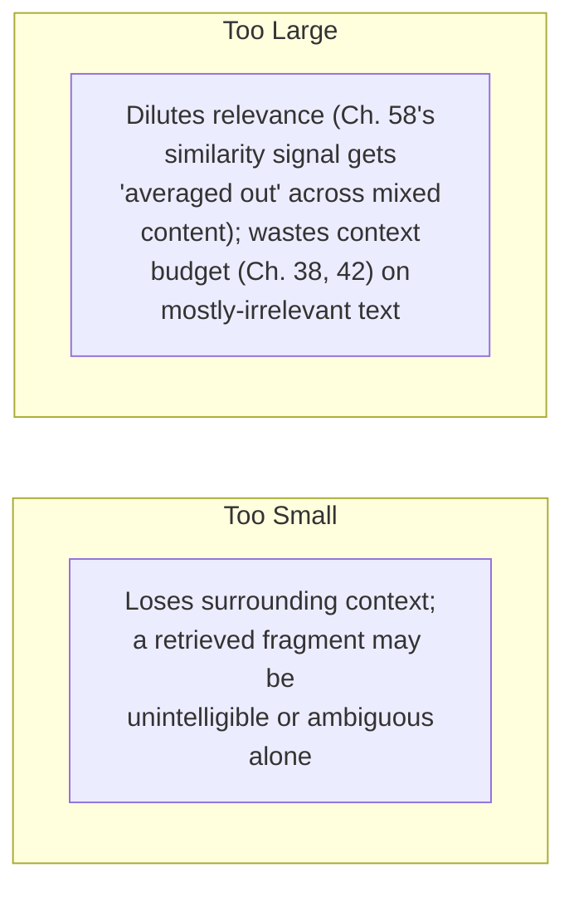
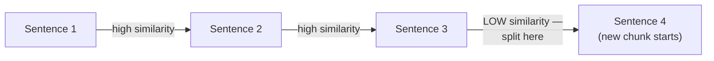

## Introduction

Chapter 60 closed by elevating chunking from a "minor implementation detail" to a consequential, high-leverage decision — since a poorly-chunked document can make the correct information *impossible* to retrieve well, regardless of how good the embedding model, vector database, or LLM are downstream. This chapter develops the specific chunking strategies used in practice and the trade-offs governing chunk size, directly resolving the tension Chapter 60 set up between chunks too small (losing context) and chunks too large (diluting relevance and wasting budget).

## The Chunk-Size Trade-off, Precisely



**Why "too small" hurts retrieval, specifically**: an embedding (Chapter 14) captures the *overall* semantic content of whatever text it's computed over — a chunk too small to contain a complete, coherent thought produces an embedding that's an ambiguous, underspecified representation of a fragment, making it both harder to match correctly against a relevant query and harder for the LLM to usefully interpret even if retrieved.

**Why "too large" hurts retrieval, specifically**: a large chunk's embedding represents an *average* of everything within it — if a chunk mixes one highly-relevant sentence with several paragraphs of unrelated content, the embedding is diluted toward the chunk's overall (mixed, less-specific) content, potentially causing the truly relevant portion's signal to be washed out and making the chunk less likely to be correctly matched to a query specifically about that one relevant portion — directly connecting to Chapter 60's cost argument, since even if retrieved, most of a large chunk's token cost is spent on content that isn't actually relevant to the query that triggered its retrieval.

## Strategy 1: Fixed-Size Chunking

The simplest approach: split text into chunks of a fixed token or character count, often with **overlap** between consecutive chunks.

```python
def fixed_size_chunk(text: str, chunk_size: int = 500, overlap: int = 50) -> list[str]:
    """
    Simple, fast, and a reasonable baseline — but ignores document
    structure entirely, risking splitting a sentence or paragraph
    mid-thought at an arbitrary boundary.
    """
    chunks = []
    start = 0
    while start < len(text):
        end = start + chunk_size
        chunks.append(text[start:end])
        start = end - overlap  # overlap ensures content near a cut
                                  # boundary appears in BOTH adjacent
                                  # chunks, mitigating boundary loss
    return chunks
```

**Why overlap matters**: without it, a sentence or idea that happens to fall exactly at a chunk boundary gets split awkwardly, with neither resulting chunk containing the complete thought — overlap ensures boundary-straddling content appears intact in at least one of the two adjacent chunks, directly mitigating the "too small / boundary loss" failure mode without meaningfully increasing overall corpus size (the overlap portion is typically a small fraction of the total chunk size).

## Strategy 2: Recursive Character/Token Splitting

A refinement that tries to respect natural document structure before falling back to arbitrary splitting: recursively split on a prioritized list of separators (paragraph breaks first, then sentence breaks, then word breaks, then character breaks as a last resort), only falling back to a cruder split when a natural boundary can't produce a chunk within the target size.

```python
def recursive_split(text: str, chunk_size: int,
                     separators: list[str] = ["\n\n", "\n", ". ", " ", ""]) -> list[str]:
    if len(text) <= chunk_size or not separators:
        return [text]

    separator = separators[0]
    splits = text.split(separator)
    chunks, current_chunk = [], ""

    for split in splits:
        if len(current_chunk) + len(split) <= chunk_size:
            current_chunk += split + separator
        else:
            if current_chunk:
                chunks.append(current_chunk)
            # This individual split is still too large — recurse
            # with the NEXT, finer-grained separator in the list.
            if len(split) > chunk_size:
                chunks.extend(recursive_split(split, chunk_size, separators[1:]))
                current_chunk = ""
            else:
                current_chunk = split + separator
    if current_chunk:
        chunks.append(current_chunk)
    return chunks
```

This is a meaningfully better default than pure fixed-size chunking for most prose documents, since it prioritizes keeping semantically coherent units (paragraphs, then sentences) intact wherever possible, only resorting to arbitrary character-level splitting when genuinely necessary.

## Strategy 3: Semantic Chunking

A more sophisticated approach: use the embedding model itself to detect natural semantic boundaries — computing embeddings for consecutive sentences and splitting where the semantic similarity between adjacent sentences drops significantly (indicating a topic shift), rather than relying on structural cues (paragraph breaks) or arbitrary size limits at all.



This directly uses Chapter 14's embedding-similarity concept as the *chunking mechanism itself*, rather than only using embeddings downstream for retrieval — a more computationally expensive approach (requiring embedding computation during ingestion specifically for boundary detection, beyond the embeddings computed for retrieval indexing itself) but one that can produce more genuinely semantically coherent chunks than structural heuristics alone, particularly for documents without clear, reliable paragraph structure.

## Strategy 4: Structure-Aware Chunking

For structured or semi-structured documents (Markdown, HTML, code, or documents with a clear hierarchical structure — headings, sections, subsections), the most effective chunking strategy often respects that **explicit structure** directly: chunking along section or heading boundaries, and preserving structural metadata (which section, which document, what hierarchy level) alongside each chunk.

```python
def structure_aware_chunk(markdown_doc: str) -> list[dict]:
    """
    Splits on Markdown headings, preserving the heading hierarchy
    as metadata — enabling metadata filtering (Ch. 58) and giving
    the LLM useful structural context about where a retrieved
    chunk came from within the larger document.
    """
    sections = split_on_markdown_headings(markdown_doc)
    return [
        {"content": section.text, "heading_path": section.heading_hierarchy}
        for section in sections
    ]
```

This is generally the best-performing approach *when the document format supports it*, since it aligns chunk boundaries with the document author's own, intentional organizational structure — directly avoiding the "too small / too large" trade-off's worst cases, since a well-structured document's sections are typically already reasonably-sized, semantically coherent units.

## Choosing a Strategy and Chunk Size

| Document Type | Recommended Strategy |
|---|---|
| Well-structured docs (Markdown, HTML, code with clear sections) | Structure-aware chunking |
| General prose without reliable structure | Recursive splitting |
| Highly variable, topically-shifting content within documents | Semantic chunking |
| Quick baseline, prototyping | Fixed-size with overlap |

As with every configuration choice this Part has covered, the appropriate **chunk size** itself should be validated empirically (per this series' consistent discipline) against the specific corpus and query patterns — following Chapter 60's evaluation framework, by measuring actual retrieval quality (and downstream final-answer quality) across a few candidate chunk sizes, rather than adopting a single "recommended" size from general folklore without this validation.

## Key Takeaways

- Chunks too small lose surrounding context and produce ambiguous, underspecified embeddings; chunks too large dilute the relevant signal within an embedding and waste context budget on retrieved but irrelevant content — both failure modes trace directly to how embeddings represent the overall content of whatever text they're computed over.
- Fixed-size chunking with overlap is a simple, fast baseline; overlap specifically mitigates boundary loss by ensuring content near a cut point appears intact in at least one adjacent chunk.
- Recursive splitting respects natural document structure (paragraphs, then sentences) before falling back to arbitrary splits, generally outperforming pure fixed-size chunking for prose.
- Semantic chunking uses the embedding model itself to detect topic-shift boundaries; structure-aware chunking respects a document's explicit structure (headings, sections) and is generally the best-performing approach when the document format supports it.

---

## Interview Questions

**1. Why does a chunk that's "too small" produce an ambiguous embedding, mechanistically, rather than simply being a smaller but still valid representation?**
An embedding model (Chapter 14, Chapter 37) is trained to capture the overall semantic content of the text it processes — a chunk too small to contain a complete, coherent thought (a sentence fragment, or an isolated pronoun reference without its antecedent) lacks the contextual information the embedding model would need to produce a specific, well-grounded semantic representation; the resulting embedding may end up representing something closer to a generic, underspecified approximation of what the fragment MIGHT mean in various possible contexts, rather than a precise representation of its actual, specific meaning — this ambiguity directly degrades the embedding's usefulness for similarity matching, since a query specifically about the fragment's actual, intended meaning may not match well against this vague, underspecified embedding, even though a human reading the fragment WITH its proper surrounding context would immediately recognize its relevance.
*Follow-up: Why might this ambiguity problem be particularly severe for chunks containing pronouns or other context-dependent references (e.g., "it," "this," "the aforementioned issue")?*
Pronouns and context-dependent references are specifically words whose actual MEANING depends entirely on earlier context that establishes their referent (per Chapter 37's discussion of how self-attention resolves exactly this kind of reference within a full context) — a chunk that includes a pronoun reference but excludes its antecedent (the specific noun the pronoun refers back to) presents the embedding model with genuinely incomplete, unresolvable information: the model cannot determine what "it" or "this" actually refers to without that missing context, producing an embedding that's not just vague but potentially actively MISLEADING if the model's best guess about the ambiguous reference happens to be wrong — this specific failure mode is exactly why respecting natural document boundaries (like complete sentences and paragraphs, per recursive and structure-aware chunking) rather than purely arbitrary, fixed-size cuts is so important for chunking quality.

**2. Explain why overlap between consecutive chunks specifically mitigates the "boundary loss" problem, and why a SMALL overlap (rather than a very large one) is typically preferred.**
Overlap ensures that content sitting near a chunk boundary — which would otherwise be split awkwardly between two chunks, with neither containing the complete surrounding context — instead appears intact, in full, within at least ONE of the two adjacent, overlapping chunks; this means that even if a specific piece of relevant content happens to fall right at what would otherwise be an arbitrary cut point, the overlap guarantees at least one chunk still contains it with its immediately surrounding context intact, directly solving the specific boundary-loss problem this chapter identified for fixed-size chunking; a SMALL overlap (a modest fraction of the total chunk size) is typically preferred because a LARGER overlap would mean more redundant content is duplicated across multiple chunks, directly increasing total storage cost (Chapter 58's discussion) and total indexed corpus size without providing proportionally more benefit beyond what's needed to solve this specific boundary-loss problem — the overlap only needs to be large enough to typically capture one boundary-straddling sentence or thought, not large enough to duplicate substantial additional content unnecessarily.
*Follow-up: Why might a larger overlap actually still fail to fully solve the boundary-loss problem for an occasional, unusually long sentence or paragraph that exceeds the overlap size?*
If a single sentence or coherent thought happens to be LONGER than the configured overlap size, that content could still be split awkwardly across the boundary even WITH overlap in place — the overlap guarantees content within its own specific size window is captured intact in at least one chunk, but doesn't provide an absolute guarantee for content longer than that specific overlap window; this illustrates that overlap is a probabilistic MITIGATION of the boundary-loss problem (reducing its likelihood and typical severity) rather than a complete, guaranteed ELIMINATION of it — for a corpus with unusually long, complex sentences or thoughts, a chunking strategy that respects NATURAL boundaries (recursive splitting, which specifically tries to split at sentence or paragraph breaks rather than arbitrary character counts, or structure-aware chunking) provides a more robust, structural solution to this same underlying problem than overlap alone can fully guarantee.

**3. Why does recursive splitting's approach of "trying paragraph breaks first, then sentence breaks, then word breaks" represent a more sophisticated strategy than simply always splitting at the target character count?**
This prioritized, fallback-based approach specifically tries to respect the document's OWN natural semantic and structural boundaries (paragraphs representing distinct ideas, sentences representing complete thoughts) wherever the resulting chunk would still fit within the target size — only falling back to progressively cruder splitting methods (word breaks, then arbitrary character breaks) when a natural boundary genuinely cannot produce a chunk of the desired size; this means recursive splitting will PREFER to keep a complete paragraph or sentence intact within a single chunk whenever reasonably possible, directly avoiding the "too small / ambiguous fragment" and "awkward mid-thought split" failure modes this chapter identified, specifically in cases where the natural structural units (paragraphs, sentences) happen to align reasonably well with the target chunk size — providing meaningfully better chunk coherence than a purely arbitrary, size-based splitting approach that ignores the document's actual content and structure entirely.
*Follow-up: Under what circumstance would recursive splitting's benefit over fixed-size chunking be MINIMAL, even though recursive splitting is generally the more sophisticated approach?*
For a document with unusually long paragraphs or sentences that consistently and significantly exceed the target chunk size (meaning recursive splitting would frequently need to fall back to its cruder, word-level or character-level splitting methods anyway, since even the FINEST natural boundary — a single sentence — is still too large to fit within the target chunk size), recursive splitting's benefit over simple fixed-size chunking would be minimal, since it would end up performing very similar arbitrary, non-structure-respecting splits most of the time regardless of its more sophisticated fallback logic — this illustrates that recursive splitting's benefit is directly proportional to how well the document's NATURAL structural units happen to align with the desired target chunk size, reinforcing why chunk size and chunking strategy should be considered and validated TOGETHER for a specific corpus, rather than as entirely independent decisions.

**4. Why does semantic chunking's use of embedding similarity between consecutive sentences represent a more sophisticated (but more computationally expensive) approach than structural heuristics like paragraph breaks?**
Semantic chunking directly measures actual, computed semantic relatedness between consecutive pieces of text (using the same underlying embedding technology, Chapter 14, that will later be used for retrieval), rather than relying on the document AUTHOR's own formatting choices (paragraph breaks) as a PROXY for where genuine topic shifts actually occur — an author might not always insert a paragraph break exactly where a genuine semantic shift happens (writing several distinct ideas within one long paragraph, or splitting a single continuous thought across several short paragraphs for stylistic or formatting reasons unrelated to actual topic boundaries), meaning structural heuristics can sometimes misalign with the TRUE underlying semantic structure the chunking process actually cares about; the added computational cost comes from needing to compute embeddings for many individual sentences specifically for this boundary-detection purpose (a separate, additional computational step beyond the embeddings eventually computed for the FINAL, resulting chunks used in retrieval indexing), representing a genuine, quantifiable trade-off (more accurate semantic boundary detection, at additional ingestion-time computational cost, per Chapter 8's data pipeline cost considerations) that should be weighed against the specific corpus's actual need for this more sophisticated approach.
*Follow-up: For what KIND of document would you expect semantic chunking's benefit over structural heuristics to be LARGEST, and for what kind would it be SMALLEST?*
Semantic chunking's benefit would likely be LARGEST for documents with poor or inconsistent formatting/structure — transcripts of spoken conversations or meetings (which often lack clear paragraph breaks corresponding to genuine topic shifts), poorly-formatted legacy documents, or free-flowing narrative text without clear section structure — where structural heuristics have little reliable signal to work with at all; the benefit would likely be SMALLEST for well-structured, professionally-formatted documents (technical documentation, well-edited articles with clear section headings and paragraph breaks that DO reliably correspond to genuine topic shifts), where structure-aware or recursive chunking (relying on the document's own reliable structural cues) would likely already produce chunks nearly as semantically coherent as the more computationally expensive semantic chunking approach would, making the additional cost of semantic chunking harder to justify for this kind of already-well-structured content.

**5. Why is structure-aware chunking described as "generally the best-performing approach when the document format supports it," rather than universally recommended regardless of format?**
Structure-aware chunking directly leverages the document AUTHOR's own, deliberate, intentional organizational choices (headings, sections) as the chunking boundary — when this explicit structure genuinely exists and is reliable (a well-formatted Markdown document, structured technical documentation with clear headings), this provides the most direct, reliable, and computationally CHEAP (no embedding computation needed specifically for boundary detection, unlike semantic chunking) signal for where genuinely coherent, meaningful chunks should begin and end, since it's directly using the document's own explicit, human-authored organization rather than inferring structure through heuristics or computed similarity; however, this approach specifically REQUIRES that such explicit, reliable structure actually exists in the document format — for unstructured plain text, transcripts, or poorly-formatted documents lacking this kind of explicit hierarchical organization, structure-aware chunking has no reliable structural signal to actually leverage at all, making it inapplicable or ineffective for these document types, which is exactly why this chapter qualifies its recommendation with "when the document format supports it" rather than presenting it as a universally, unconditionally superior approach.
*Follow-up: How would you handle a mixed document corpus containing BOTH well-structured documents (with clear headings) and unstructured documents (plain text without reliable structure)?*
I'd apply a HYBRID chunking pipeline that routes each document to the MOST APPROPRIATE strategy based on its own specific format and structure — using structure-aware chunking for documents that DO have reliable, explicit structural markup, and falling back to recursive splitting (or semantic chunking, if the added cost is justified for this specific subset) for documents that lack this structure — this directly reflects this series' consistent "right-size the approach to the specific situation's actual characteristics" principle (echoing, for example, Chapter 51's model cascade routing different requests to different-sized models based on their specific needs), now applied to selecting a chunking strategy on a PER-DOCUMENT basis within a mixed corpus, rather than forcing a single, uniform chunking strategy across all documents regardless of their individually differing structural characteristics.

**6. In an interview, if asked to design a chunking strategy for a RAG system indexing a company's software API documentation, how would you use this chapter's concepts to justify your recommendation?**
I'd recommend structure-aware chunking as the primary strategy, since API documentation typically has clear, explicit structure (individual endpoint definitions, parameter descriptions, code examples, each often demarcated by headings or consistent formatting conventions) that directly maps to genuinely coherent, individually-useful retrieval units — a chunk boundary aligned with "this is the complete documentation for one specific API endpoint" is likely to be both a semantically coherent unit (this chapter's core chunking goal) and a directly useful retrieval granularity (a user asking about a specific endpoint should retrieve exactly that endpoint's complete documentation, not a fragment of it mixed with unrelated endpoints' content); I'd specifically preserve structural metadata (Chapter 58's metadata filtering discussion) like the specific API version, endpoint name, and HTTP method alongside each chunk, enabling both more precise retrieval and potential metadata-based filtering (e.g., if a user's query specifies a particular API version) beyond pure semantic similarity search alone.
*Follow-up: Why might code examples within this API documentation present a SPECIFIC chunking challenge distinct from the surrounding prose documentation?*
Code examples often have their own internal syntactic structure (function definitions, indentation, brace matching) that doesn't align well with prose-oriented chunking heuristics (sentence or paragraph breaks) — splitting a code example awkwardly mid-function or mid-block (as a naive recursive or fixed-size splitter might do, since these are primarily designed around prose text patterns) could produce a chunk containing syntactically broken, incomplete code that's much less useful when retrieved and shown to an LLM or a user than the complete, syntactically valid code example would be — this suggests a well-designed chunking strategy for API documentation should specifically treat code blocks as their OWN atomic, non-splittable units wherever reasonably possible (keeping a complete code example together as a single chunk, or a bounded, small number of chunks respecting the code's own logical structure), rather than applying the same generic, prose-oriented chunking rules uniformly across both the prose documentation and the embedded code examples within it.

**7. How would you empirically validate whether a chosen chunk size is well-calibrated for a specific RAG application, following this chapter's closing recommendation?**
I'd construct a representative test set of queries paired with their known, correct source content (the specific portion of the corpus that genuinely and correctly answers each test query, established through manual review or existing labeled data) and measure, across a few candidate chunk sizes, whether the chunking and retrieval pipeline successfully surfaces the correct source content as a top-ranked retrieval result for each test query — following this series' consistent empirical-validation discipline (echoing Chapter 59's `n_probe` tuning discussion), I'd also measure the DOWNSTREAM impact on final RAG answer quality (per Chapter 21's evaluation discipline) across these same candidate chunk sizes, since retrieval success alone (finding the correct chunk) doesn't guarantee the final generated answer is actually correct and well-grounded — selecting the chunk size that jointly optimizes both retrieval success and downstream final-answer quality for this specific corpus and query pattern, rather than adopting a chunk size based purely on general community folklore or a default library setting without this kind of task-specific empirical validation.
*Follow-up: Why might the OPTIMAL chunk size for RETRIEVAL SUCCESS (finding the right chunk) potentially differ from the optimal chunk size for DOWNSTREAM FINAL-ANSWER QUALITY, requiring you to jointly consider both rather than optimizing for retrieval success alone?*
A very small chunk size might actually maximize precise retrieval matching for narrow, specific queries (since a small, focused chunk's embedding is less diluted, per this chapter's core trade-off discussion), but if the resulting retrieved chunk is TOO small and lacks sufficient surrounding context for the LLM to fully and correctly understand and use it (even if it was technically the "correct" chunk retrieved), the DOWNSTREAM final answer quality could still suffer despite the retrieval step technically "succeeding" at finding the nominally correct source — this potential divergence between retrieval-success metrics and downstream-answer-quality metrics is exactly why this chapter recommends validating chunk size against BOTH considerations jointly, rather than optimizing purely for an intermediate retrieval-success metric that might not fully capture what ultimately matters for the complete, end-to-end RAG system's actual quality.

**8. Why might a company need to RE-CHUNK their entire existing document corpus if they decide to change their chunking strategy (e.g., switching from fixed-size to structure-aware chunking), connecting to Chapter 58's re-embedding migration discussion?**
Since chunk boundaries directly determine what specific text gets embedded and indexed as each individual retrievable unit (this chapter's core mechanism), changing the chunking strategy fundamentally changes what the actual "documents" in the vector database ARE — the old, fixed-size chunks and the new, structure-aware chunks represent entirely different segmentations of the same underlying source content, meaning the entire corpus needs to be re-processed (re-chunked AND re-embedded, since the embeddings were computed specifically for the OLD chunk boundaries) to reflect the new chunking strategy, directly analogous to Chapter 58's discussion of needing to fully re-embed a corpus when switching embedding models — this is a full, all-or-nothing re-ingestion migration, not an incremental update, since there's no meaningful way to "partially" apply a new chunking strategy to an already-chunked-and-indexed corpus.
*Follow-up: How would you apply Chapter 58's staged-migration discipline to this specific chunking-strategy-change scenario, to avoid a risky, all-at-once production cutover?*
I'd build the newly re-chunked and re-embedded corpus as a SEPARATE, parallel vector database index (exactly the same staged approach Chapter 58 recommended for an embedding-model migration), validate this new index's retrieval quality and downstream final-answer quality (per this chapter's earlier empirical-validation discussion) against the existing, still-serving old index using a representative test set, and only perform a staged, gradual traffic cutover to the new, re-chunked index once this validation confirms the new chunking strategy genuinely provides the expected improvement — directly reusing the same staged-rollout discipline this series has consistently recommended for any significant underlying infrastructure or configuration change (Chapters 22-23, 34, 58), now specifically applied to this particular chunking-strategy-migration scenario.

**9. How would you use this chapter's material to explain why a RAG system's retrieval quality might degrade specifically for a NEWLY ADDED type of document, even though the system performs well on the document types it was originally designed and tuned for?**
If the chunking strategy (and its specific parameters — chunk size, chosen separators for recursive splitting, or the specific structural markup patterns a structure-aware chunker was designed to recognize) was originally selected and tuned (per this chapter's empirical-validation discipline) specifically based on the CHARACTERISTICS of the original document types the system was designed for, a newly added document type with meaningfully DIFFERENT characteristics (different typical paragraph/sentence length, different or absent structural markup conventions, different content density) might not be well-served by that same, unchanged chunking configuration — for example, a chunking strategy tuned for long-form prose documents might perform poorly on newly-added, much shorter reference/FAQ-style documents, or a structure-aware chunker designed for one specific document format's heading conventions might fail to recognize the different structural conventions of a newly-added document format, resulting in this new content being fragmented or chunked in a way that doesn't align well with either its own genuine structure or the retrieval patterns that would best serve queries about this new content.
*Follow-up: How would you diagnose this specific issue, distinguishing it from a general, corpus-wide retrieval quality problem?*
I'd specifically segment retrieval quality metrics (per this chapter's evaluation discipline, and Chapter 6's general "check for subgroup-specific failures rather than only aggregate metrics" principle) BY document type or source, checking whether retrieval quality specifically for the newly-added document type is meaningfully worse than for the original, established document types the system was originally tuned for — if this segmented analysis confirms the newly-added document type specifically underperforms, this points directly toward the chunking strategy (and possibly other pipeline components) needing SEPARATE, type-specific tuning or configuration for this new document category (echoing this chapter's earlier "hybrid, per-document-type chunking strategy" discussion), rather than either assuming the entire corpus needs re-tuning, or missing this specific, localized problem entirely by only examining aggregate, corpus-wide retrieval quality metrics that might mask this document-type-specific issue within an otherwise-still-acceptable overall average.

**10. How would you handle a stakeholder's request to "just use the largest possible chunk size to make sure we never lose important context," given this chapter's chunk-size trade-off discussion?**
I'd explain, using this chapter's core mechanism, that very large chunks don't actually GUARANTEE preserving important context in a genuinely useful way — instead, they risk DILUTING the embedding's ability to represent and match against any SPECIFIC piece of relevant content within that large chunk (this chapter's "too large" failure mode), potentially making the chunk LESS likely to be correctly retrieved for a query about that specific content buried within it, and even if retrieved, consuming substantially more context budget (Chapter 38) and cost (Chapter 42) for content that's mostly irrelevant to any given specific query — I'd reframe the stakeholder's underlying, legitimate concern (not losing important context) toward this chapter's actual, evidence-based solutions to that specific concern — using overlap (for boundary-straddling content), recursive or structure-aware chunking (for respecting genuinely coherent semantic units), or, if a specific piece of content genuinely needs broader context to be properly understood, considering a chunking strategy that preserves HIERARCHICAL context (like the structure-aware chunker's heading-path metadata) rather than simply making every chunk maximally large as an unfocused, blunt-instrument solution to this legitimate but more precisely addressable concern.
*Follow-up: What specific chunking technique would you propose as a more targeted solution to the stakeholder's legitimate underlying concern about losing important surrounding context, beyond simply overlap or structure-aware chunking?*
I'd propose a technique sometimes called "parent-child" or "hierarchical" chunking — indexing and searching against SMALL, precise chunks (optimized for accurate retrieval matching, avoiding this chapter's dilution problem) while, upon retrieval, actually including that small chunk's LARGER surrounding context (its "parent" section or a broader window of surrounding text) in what's ultimately provided to the LLM for generation — this specifically decouples the chunk size used for the RETRIEVAL/matching step (which benefits from being smaller and more precise, per this chapter's core trade-off) from the amount of context ultimately provided to the LLM for GENERATION (which can be larger, providing the broader context the stakeholder is legitimately concerned about preserving) — directly addressing the stakeholder's genuine underlying concern through a more sophisticated, two-tiered approach rather than the blunt, costly, and retrieval-quality-degrading "just make every chunk huge" solution they initially proposed.

**11. Why might chunking strategy interact meaningfully with the vector indexing algorithm choice from Chapter 59, rather than being an entirely independent decision?**
Chunk size directly determines the TOTAL NUMBER of vectors that need to be indexed for a given corpus (more, smaller chunks means more total vectors; fewer, larger chunks means fewer total vectors) — this total vector count is a key input to Chapter 59's algorithm-selection considerations (HNSW's memory usage scales with total vector count; IVF's optimal number of clusters and `n_probe` setting depend on total corpus size) — meaning a chunking strategy producing a very large number of very small chunks could push a corpus into a much larger total-vector-count regime than the same underlying content chunked into fewer, larger chunks would, potentially shifting which specific Chapter 59 indexing algorithm and configuration is actually most appropriate for that specific resulting index size, illustrating that chunking strategy and vector indexing algorithm choice aren't fully independent decisions but rather interact through this shared "total vector count" dependency.
*Follow-up: How would you sequence these two decisions (chunking strategy and vector indexing algorithm choice) in a real system design process, given this interaction?*
I'd generally determine the chunking strategy FIRST, based primarily on retrieval-quality considerations (this chapter's core focus — what chunk size and strategy best serves accurate, well-grounded retrieval for this specific corpus and query pattern), and then select and tune the vector indexing algorithm (Chapter 59) SECOND, informed by the resulting total vector count and update-frequency characteristics that the chosen chunking strategy produces — this sequencing reflects that chunking strategy is more fundamentally about content and retrieval QUALITY (this chapter's primary concern), while indexing algorithm choice is more about efficiently SERVING whatever resulting vector count and access pattern that quality-driven chunking decision produces (Chapter 59's primary concern) — though, in practice, if a chosen chunking strategy produces an impractically large total vector count that no available indexing configuration can efficiently serve within acceptable cost or latency bounds, this might necessitate revisiting and adjusting the chunking strategy as a secondary, cost-driven consideration, illustrating that while a sensible default sequencing exists, a fully iterative, back-and-forth validation between these two decisions may sometimes be necessary.

**12. How would you use this chapter's concepts to design an A/B test (connecting to Chapter 22) comparing two candidate chunking strategies for an already-live, production RAG system?**
I'd build the new candidate chunking strategy's re-chunked and re-embedded corpus as a separate, parallel index (per this chapter's earlier staged-migration discussion), and route a controlled, randomized percentage of live production traffic to use the NEW chunking strategy's index while the remainder continues using the EXISTING, current chunking strategy's index — following Chapter 22's full experimental rigor (proper randomization, avoiding confounding factors, adequate sample size for statistical confidence) — measuring both direct retrieval-quality metrics (are the correct source chunks being retrieved) and, more importantly, downstream business/user-experience metrics (Chapter 6) like user satisfaction ratings, task completion, or explicit feedback on the final generated answers, to determine whether the new chunking strategy provides a genuine, statistically significant, and PRACTICALLY meaningful improvement over the existing strategy before committing to a full migration.
*Follow-up: Why might it be particularly important to measure DOWNSTREAM business/user-experience metrics for this specific test, rather than relying solely on a more narrow, technical retrieval-quality metric?*
As this chapter's earlier discussion established, retrieval success (finding the theoretically "correct" chunk) doesn't automatically guarantee the downstream final answer is actually better from the user's perspective — a new chunking strategy might show improved technical retrieval metrics while providing no meaningful improvement (or even a slight degradation) in actual, perceived answer quality, if, for example, the new, differently-structured chunks are technically more precisely matched but somehow less naturally usable by the LLM in generating a well-formed final response — measuring genuine downstream business and user-experience outcomes (per Chapter 6's consistent emphasis throughout this series) ensures the A/B test validates what ACTUALLY MATTERS (a better real-world outcome for users) rather than only validating an intermediate, technical proxy metric (retrieval success) that might not perfectly correlate with the genuine, ultimate goal this chunking strategy change was intended to achieve.

**13. How would you use this chapter's material to critique a research paper or blog post claiming "chunk size of exactly 512 tokens is optimal for RAG systems," without further context?**
I'd apply this chapter's core, consistently-repeated principle directly — the OPTIMAL chunk size depends on the SPECIFIC corpus's document characteristics (typical paragraph/sentence length, structural conventions), the SPECIFIC query patterns the system needs to serve well, and the SPECIFIC downstream LLM and its context window (Chapter 38), meaning a single, universal "optimal" chunk size claimed without this crucial context is almost certainly an overgeneralization from whatever SPECIFIC corpus and evaluation setup that particular paper or post happened to test — a claim of this kind should be treated as, at best, a reasonable STARTING POINT or rough baseline for initial experimentation (following this series' consistent "start with a reasonable baseline, then validate empirically for your own specific situation" discipline), not as a universally correct, one-size-fits-all prescription to be adopted without this chapter's own recommended empirical validation against the reader's own specific corpus and use case.
*Follow-up: What specific characteristic of the READER's OWN corpus would most likely determine whether this specific "512 tokens" claim is even a reasonable STARTING POINT for their own experimentation, versus being wildly inapplicable to their situation?*
I'd specifically consider whether the reader's own corpus's typical document structure and content density (how much genuinely distinct, semantically coherent content typically fits within a 512-token span for THEIR specific kind of documents) is broadly similar to whatever corpus this original claim was based on — a corpus of short, discrete FAQ entries or brief reference snippets might already fit comfortably within a MUCH smaller chunk size than 512 tokens (making the "512 tokens" recommendation an unnecessarily large starting point that would need to be scaled down for this reader's specific content), while a corpus of dense, technical, or legal documents with very long, complex sentences and paragraphs might require a chunk size considerably LARGER than 512 tokens just to capture even a single complete, coherent thought (making the "512 tokens" recommendation potentially too SMALL a starting point for this reader's specific content) — this kind of basic, qualitative assessment of the reader's own corpus's characteristics relative to whatever corpus the original claim was based on is a reasonable first filter before deciding whether "512 tokens" is even a sensible starting point for the reader's OWN empirical validation process, rather than either blindly adopting it or dismissing it without this basic, comparative consideration.

**14. How would you use this chapter's chunking discussion to explain, at a system-design level, why RAG system quality can be meaningfully improved WITHOUT changing the underlying embedding model or LLM at all?**
This directly reinforces Chapter 60's multi-stage, independently-optimizable pipeline framing — chunking strategy is a genuinely SEPARATE lever from embedding model choice or LLM choice, and this chapter has established that chunking decisions directly and consequentially affect what content is even POSSIBLE to retrieve well in the first place (a poorly-chunked document might make genuinely relevant content practically unretrievable, regardless of how good the embedding model or LLM subsequently are) — meaning a team facing RAG quality problems has a genuine, often underappreciated opportunity to meaningfully improve overall system quality purely by improving their chunking strategy (moving from naive fixed-size chunking to structure-aware or semantic chunking, or properly tuning chunk size per this chapter's empirical-validation discipline) without needing to invest in the potentially more expensive and complex alternative of upgrading the underlying embedding model or LLM (Chapters 40-41's cost and complexity considerations) at all.
*Follow-up: Why might chunking strategy improvements represent particularly GOOD "return on engineering investment" compared to some other possible RAG quality improvements, for many real-world systems?*
Chunking strategy improvements are often comparatively CHEAP to implement (primarily a data-pipeline/preprocessing logic change, rather than requiring new, potentially expensive infrastructure like a different vector database technology, Chapter 58, or a larger, more expensive LLM, Chapter 40-41) and, per this chapter's core argument, address a FOUNDATIONAL bottleneck that can otherwise silently limit the effectiveness of every other, more expensive improvement made downstream (a better embedding model or a more capable LLM still can't compensate for content that's fundamentally unretrievable due to poor chunking, per Chapter 60's "hard ceiling" argument) — this combination of comparatively LOW implementation cost and potentially HIGH, foundational impact makes chunking strategy improvements a particularly good candidate for EARLY investment when diagnosing and addressing RAG quality problems, before committing to more expensive alternative improvements that might not even address the actual, underlying bottleneck if chunking is genuinely the weaker link in the specific system's pipeline.

**15. How would you summarize, for someone moving on to Chapter 62's hybrid search discussion, why this chapter's chunking material remains directly relevant to that next chapter's topic, rather than being a fully separate, already-concluded concern?**
Hybrid search (Chapter 62) will combine semantic (embedding-based) search with keyword-based (exact-match) search to address the specific "query phrasing doesn't match document phrasing" failure mode Chapter 60 identified — but the EFFECTIVENESS of keyword-based search, just like semantic search, depends directly on how the underlying content was CHUNKED: a keyword search matching against a poorly-chunked, ambiguous fragment is just as likely to produce a poor match as a semantic search would be against that same poorly-chunked fragment, meaning this chapter's chunking quality considerations remain equally relevant and foundational for BOTH halves of the hybrid search approach Chapter 62 will develop, not just for the semantic-search half this Part has focused on so far — reinforcing that chunking is a genuinely foundational, cross-cutting concern for the ENTIRE retrieval stage (regardless of which specific search technique or combination of techniques is layered on top of it), not a concern specific only to semantic/embedding-based search alone.
*Follow-up: What specific chunking consideration from this chapter would become EVEN MORE important once keyword-based search (Chapter 62) is added alongside semantic search, compared to when semantic search is used alone?*
Preserving the EXACT, original wording and specific terminology within chunks (rather than any kind of lossy summarization or paraphrasing that might occur in some more aggressive preprocessing approaches) becomes even more directly and specifically important once keyword-based search is added, since keyword search specifically depends on exact or near-exact lexical matches — a chunking approach that somehow altered, summarized, or paraphrased the original document's specific wording during the chunking process (an approach this chapter didn't specifically recommend but which some more aggressive preprocessing pipelines might attempt) would directly and specifically undermine keyword search effectiveness, even if it had little effect on semantic search's more meaning-based matching — this reinforces that chunking should generally preserve original document text verbatim (only affecting BOUNDARIES, not content), a consideration whose importance becomes even more evident and consequential once Chapter 62 introduces keyword-based search as a complementary technique operating on these same chunks.
