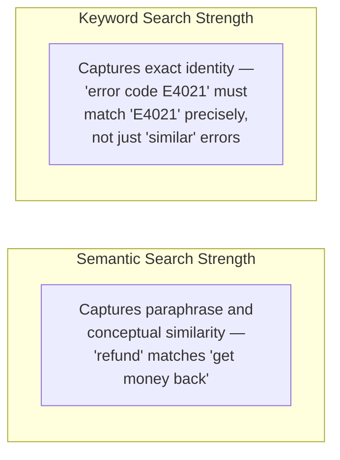
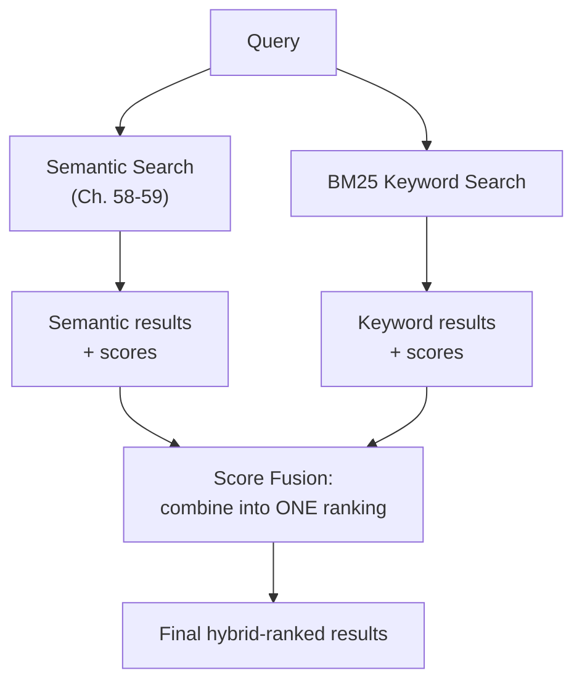

## Introduction

Chapters 60-61 repeatedly flagged a specific failure mode: pure semantic search sometimes misses exact terminology, product codes, or precise phrase matches that a user's query and the relevant document express differently — or, conversely, express in the exact same specific terms that a keyword search would catch immediately but that an averaged, diluted embedding (Chapter 61's core mechanism) might not weight heavily enough. This chapter delivers the solution: **hybrid search**, combining classical keyword-based search (BM25) with the semantic vector search this Part has built so far.

## Why Keyword Search Still Matters in the LLM Era

It might seem that embeddings (Chapter 14), being more "sophisticated" than simple keyword matching, should make classical keyword search obsolete. This isn't the case — keyword search excels at exactly the cases where semantic search's strength (capturing general meaning) becomes a weakness: **precise, exact-match-critical content** — product SKUs, error codes, specific legal citation numbers, exact proper nouns, or acronyms — where the "meaning" of the term isn't really the point; the *exact identity* of the term is.



## BM25: The Standard Keyword-Search Algorithm

**BM25** (Best Matching 25) is a well-established, statistically-grounded ranking algorithm for keyword search — a refinement of the classical TF-IDF (term frequency-inverse document frequency) approach, scoring how relevant a document is to a query based on how often the query's specific terms appear in that document (term frequency), weighted down for terms that are common across the entire corpus and therefore less discriminating (inverse document frequency), with adjustments for document length so a long document doesn't get an unfair advantage simply by containing more words overall.

```python
import math
from collections import Counter

def bm25_score(query_terms: list[str], document_terms: list[str],
                corpus_doc_frequencies: dict[str, int], total_docs: int,
                avg_doc_length: float, k1: float = 1.5, b: float = 0.75) -> float:
    """
    A simplified BM25 scoring implementation — illustrating the core
    formula's structure, which real search libraries (Elasticsearch,
    OpenSearch, and vector databases with hybrid support) implement
    with additional optimizations.
    """
    doc_length = len(document_terms)
    term_counts = Counter(document_terms)
    score = 0.0

    for term in query_terms:
        if term not in term_counts:
            continue
        tf = term_counts[term]  # term frequency in THIS document
        df = corpus_doc_frequencies.get(term, 0)  # how many docs contain this term
        idf = math.log((total_docs - df + 0.5) / (df + 0.5) + 1)  # rarer terms score higher

        numerator = tf * (k1 + 1)
        denominator = tf + k1 * (1 - b + b * (doc_length / avg_doc_length))
        score += idf * (numerator / denominator)

    return score
```

**Why BM25 rather than pure raw keyword counting**: the IDF term specifically down-weights common, low-information words (echoing Chapter 38's tokenization discussion of common versus rare tokens) so that a document matching on a rare, highly specific term (like an exact error code) scores much higher than one merely matching on common words that appear throughout the corpus — and the document-length normalization prevents longer documents from scoring artificially higher purely by virtue of containing more total words, a fairness consideration directly analogous to Chapter 61's "large chunks dilute the signal" concern, now addressed explicitly within the scoring formula itself.

## Combining Semantic and Keyword Scores: Score Fusion

The core challenge in hybrid search: semantic similarity scores (Chapter 58's cosine similarity, typically in a 0-to-1 range) and BM25 scores (an unbounded, corpus-dependent numeric range) are **not directly comparable** — you can't simply average them together meaningfully without first normalizing them onto a common scale.



The most common, robust fusion technique is **Reciprocal Rank Fusion (RRF)**, which sidesteps the score-comparability problem entirely by using each result's *rank* (its position: 1st, 2nd, 3rd...) in each individual ranking, rather than its raw score:

```python
def reciprocal_rank_fusion(semantic_results: list[str], bm25_results: list[str],
                             k: int = 60) -> list[tuple[str, float]]:
    """
    RRF combines rankings without needing to normalize incomparable
    raw scores — a document's fused score is the sum of 1/(k + rank)
    across every ranking it appears in.
    """
    fused_scores: dict[str, float] = {}

    for rank, doc_id in enumerate(semantic_results, start=1):
        fused_scores[doc_id] = fused_scores.get(doc_id, 0) + 1 / (k + rank)

    for rank, doc_id in enumerate(bm25_results, start=1):
        fused_scores[doc_id] = fused_scores.get(doc_id, 0) + 1 / (k + rank)

    return sorted(fused_scores.items(), key=lambda x: x[1], reverse=True)
```

**Why rank-based fusion, rather than normalizing and weighting raw scores directly**: a document ranked highly by BOTH methods gets a strong combined score regardless of the two methods' very different underlying score scales and distributions, and a document ranked highly by only ONE method still contributes meaningfully — this avoids the fragile, corpus-specific tuning that a raw-score-weighting approach (e.g., "combined score = 0.6 × semantic_score + 0.4 × bm25_score") would require, since that kind of weighting is sensitive to the specific score distributions of a particular corpus and query set in ways that don't reliably generalize.

## When Hybrid Search Matters Most

| Content Type | Hybrid Search Value |
|---|---|
| Highly conversational, paraphrase-heavy queries against general prose | Lower — semantic search alone often performs well |
| Technical documentation with specific terminology, codes, IDs | High — exact-match failures are common with semantic search alone |
| Domain-adapted applications (Chapter 47) with specialized vocabulary | High — directly connects to Chapter 51's earlier discussion of domain-specific terminology challenges |
| Multilingual corpora | Mixed — BM25's exact-match nature doesn't transfer well across languages; semantic search (with a multilingual embedding model) often carries more weight |

This directly extends Chapter 60's diagnostic framework: if retrieval failures specifically cluster around queries containing exact terms, codes, or names that semantic search seems to be "softening" or missing, hybrid search is the evidence-based remediation — not a default that every RAG system needs regardless of its specific failure pattern.

## Key Takeaways

- Semantic search excels at conceptual, paraphrase-tolerant matching; keyword search (BM25) excels at precise, exact-identity matching (codes, IDs, specific terminology) — these are complementary strengths, not competing alternatives.
- BM25 refines raw term-frequency counting with inverse-document-frequency weighting (favoring rare, discriminating terms) and document-length normalization, directly analogous to Chapter 61's concern about longer content diluting relevance signal.
- Semantic and keyword scores aren't directly comparable on the same numeric scale; Reciprocal Rank Fusion combines rankings by position rather than raw score, avoiding fragile, corpus-specific score-weighting tuning.
- Hybrid search's value is highest for technical, terminology-heavy, or domain-adapted applications where exact-match failures are common — its adoption should be driven by diagnosed, evidence-based need (Chapter 60's diagnostic discipline), not applied as an unconditional default.

---

## Interview Questions

**1. Why does this chapter argue that keyword search and semantic search have "complementary strengths" rather than one being strictly superior to the other?**
Semantic search (via embeddings, Chapter 14) is specifically designed to capture conceptual, meaning-based similarity, tolerating paraphrase and different wordings expressing the same underlying idea — this is a genuine strength for conversational queries where a user's phrasing differs from the document's phrasing (Chapter 60's original example); keyword search (BM25) is specifically designed to capture precise, exact lexical matches — a genuine strength for content where the SPECIFIC IDENTITY of a term matters more than its general meaning (an exact error code, product SKU, or proper noun), since embeddings can sometimes treat semantically "close" but actually DISTINCT specific terms (like two similar but different product model numbers) as more similar than they should be for this kind of precise-identity-matching purpose — these are two genuinely different, non-overlapping strengths addressing two genuinely different kinds of matching needs, meaning neither approach alone strictly dominates the other across all possible query and content types.
*Follow-up: Can you construct a concrete example query where semantic search would clearly outperform keyword search, and a DIFFERENT example where keyword search would clearly outperform semantic search?*
For "how do I cancel my subscription," semantic search would likely outperform pure keyword search if the relevant document uses different specific wording (e.g., "terminating your recurring plan"), since keyword search would fail to match on the specific words "cancel" or "subscription" if those exact words don't appear in the relevant document, while semantic search would correctly recognize the conceptual similarity despite this wording difference; for "error code XJ-4471," keyword search would likely outperform semantic search, since this is a precise, arbitrary identifier where the embedding model has no meaningful semantic concept to relate it to beyond superficial character similarity, while a keyword search would reliably and precisely match documents containing this EXACT code string, which is exactly the specific, narrow matching need this kind of query represents.

**2. Explain why BM25's inverse-document-frequency (IDF) component specifically down-weights common words, and why this matters for retrieval relevance.**
IDF is computed based on how many documents in the ENTIRE corpus contain a given term — a term appearing in nearly every document (a very common word like "the," "system," or, in a technical corpus, perhaps a word like "documentation" that appears throughout) provides very little DISCRIMINATING information about which specific documents are actually most relevant to a query containing that term, since matching on it doesn't meaningfully distinguish between documents; a term appearing in only a FEW documents (a rare, specific term) provides much more discriminating information, since matching on it strongly suggests genuine, specific relevance to that particular narrow topic — IDF mathematically formalizes this intuition by assigning LOWER weight to common terms and HIGHER weight to rare terms, ensuring the overall BM25 score is driven primarily by the query's more discriminating, specific terms rather than being dominated by matches on common, low-information words that would match almost any document in the corpus regardless of actual relevance.
*Follow-up: Why might IDF weighting need to be recalculated whenever the underlying document corpus changes significantly, connecting to Chapter 58's staleness discussion?*
IDF is computed based on term frequencies across the ENTIRE current corpus — if the corpus changes significantly (many new documents added, especially if they introduce new common terminology, or many documents removed), the ACTUAL discriminating power of specific terms could shift meaningfully from what was previously calculated (a term that was previously rare and highly discriminating might become common if many new documents using that term are added, reducing its IDF weight and discriminating value going forward) — this means, similar to Chapter 58's discussion of keeping the vector index synchronized with the current corpus, the BM25 index's IDF statistics also need to be periodically recalculated or incrementally updated to remain accurate and well-calibrated as the underlying corpus evolves, representing an additional, BM25-specific synchronization consideration alongside the vector-index synchronization Chapter 58 already established as necessary.

**3. Why is directly averaging or weighting raw semantic similarity scores and raw BM25 scores together described as problematic, motivating the use of Reciprocal Rank Fusion instead?**
Semantic similarity scores (typically cosine similarity, bounded between -1 and 1, or 0 and 1 depending on normalization, per Chapter 58) and BM25 scores (an unbounded, corpus- and query-dependent numeric value that can vary widely based on term rarity and document length) exist on fundamentally different, non-comparable numeric scales — directly combining them (e.g., "0.6 times the semantic score plus 0.4 times the BM25 score") would require some arbitrary or empirically-tuned normalization to make these two different scales meaningfully combinable, and any such normalization or weighting would likely be specific to the particular corpus's own score distributions, meaning a weighting that works well for one corpus or query set might not generalize well to a different one; RRF avoids this entire problem by using each result's ORDINAL RANK (its position within each individual ranking) rather than its raw score, since rank position is inherently comparable across different scoring methods regardless of their very different underlying numeric scales — a document ranked #1 by semantic search and a document ranked #1 by BM25 search are treated symmetrically and comparably by RRF, without requiring any corpus-specific score normalization or weighting calibration at all.
*Follow-up: What's a potential limitation of RRF's rank-based approach, compared to a hypothetical, PERFECTLY-calibrated raw-score weighting approach?*
RRF, by discarding the actual MAGNITUDE of the underlying scores and only considering RANK POSITION, loses some potentially useful information — for example, a document that's the #1 semantic match with an extremely high, decisive similarity score (clearly, confidently the best match) is treated identically (in terms of its RRF contribution) to a document that's the #1 semantic match with only a marginally, barely-highest similarity score among a set of otherwise very similar candidates — a perfectly-calibrated raw-score weighting approach, if such perfect calibration were actually achievable in practice, could in principle capture and use this additional magnitude information to make finer, more confidence-aware distinctions that RRF's purely rank-based approach necessarily discards; however, since achieving this kind of perfect, reliably-generalizing calibration in practice is genuinely difficult (per this chapter's earlier discussion), RRF's simpler, more robust rank-based approach is generally preferred as a more PRACTICAL, reliably-effective default, even though it does sacrifice this theoretical, hard-to-actually-achieve additional precision.

**4. Why might a company with a highly conversational, customer-facing chatbot (mostly answering paraphrased, informal questions) see LESS benefit from adopting hybrid search than a company with technical API documentation, per this chapter's comparison table?**
A highly conversational chatbot's typical queries are precisely the kind of paraphrase-heavy, conceptually-varied natural language that semantic search (Chapter 14's embeddings) is specifically designed to handle well — these queries generally don't hinge on matching a single, precise, exact-identity term (like a specific error code or product SKU) the way technical API documentation queries often do; for this conversational use case, semantic search ALONE is likely to already perform quite well for the majority of typical queries, meaning the ADDITIONAL complexity and engineering investment of implementing and maintaining a hybrid search pipeline (running both search methods, implementing fusion logic, per this chapter's code) might provide comparatively LESS marginal benefit relative to its added cost and complexity than it would for the technical documentation use case, where exact-match failures are a more common, evidence-based, and consequential retrieval failure pattern.
*Follow-up: What SPECIFIC evidence, following Chapter 60's diagnostic discipline, would this conversational chatbot's team need to see BEFORE concluding hybrid search genuinely isn't worth the investment for their specific application?*
They would need to conduct the same kind of systematic retrieval-failure analysis Chapter 60 recommended — reviewing a representative sample of queries where the chatbot's current, semantic-search-only retrieval failed to surface the correct or most helpful content, and specifically checking whether these failures cluster around exact-match-sensitive content (a specific promotion code, a specific product name that a semantic embedding might confuse with a similar but different product) — if this diagnostic review reveals that failures are predominantly and clearly of THIS specific, exact-match-related kind (rather than being explained by other issues like poor chunking, per Chapter 61, or insufficient retrieval volume), this would provide the concrete, evidence-based justification for investing in hybrid search DESPITE the chatbot's generally conversational nature; if this review reveals that failures are NOT predominantly of this specific kind, this would confirm hybrid search likely isn't currently a well-justified investment for this specific application, consistent with this chapter's evidence-based adoption principle.

**5. How would you decide, for a new RAG application, what fraction of retrieval results should come from semantic search versus BM25 keyword search, given that RRF combines rankings rather than explicitly weighting search methods?**
While RRF (this chapter's core fusion technique) doesn't require an EXPLICIT weighting parameter the way a raw-score-weighting approach would, a system can still implicitly influence the relative INFLUENCE of each method by controlling how many candidate results are retrieved from EACH method BEFORE fusion (e.g., retrieving the top 20 semantic results and the top 20 BM25 results, versus retrieving top 50 from one and top 10 from the other) — I'd determine an appropriate balance empirically (per this series' consistent evaluation discipline), following the same "test candidate configurations against representative queries with known correct answers" methodology established throughout this Part (Chapter 59's `n_probe` tuning, Chapter 61's chunk-size validation), measuring the resulting fused ranking's actual retrieval quality across a few different candidate result-count configurations for each underlying method, rather than assuming a fixed, universal balance (like always retrieving equal numbers from each method) is automatically appropriate for every application without this kind of specific, empirical validation.
*Follow-up: Why might it be reasonable to retrieve MORE candidates from semantic search than from BM25 (or vice versa) for a SPECIFIC application, rather than always retrieving an equal number from both?*
If a specific application's diagnostic analysis (per this chapter's and Chapter 60's evidence-based discipline) reveals that semantic search is generally the more reliable, higher-quality signal for the MAJORITY of that application's typical queries, with BM25 specifically and occasionally catching important exact-match cases that semantic search would otherwise miss, it might be reasonable to retrieve a LARGER number of candidates from semantic search (reflecting its generally higher reliability for most queries) and a SMALLER, more targeted number from BM25 (specifically to catch those occasional but important exact-match cases, without needing BM25 to contribute as heavily to the overall candidate pool) — this kind of asymmetric configuration, validated empirically for the SPECIFIC application's own diagnosed failure patterns, is a reasonable, well-justified refinement beyond a naive, symmetric "equal candidates from both methods" default configuration.

**6. In an interview, if asked to design retrieval for a legal document search application, how would you use this chapter's concepts to justify a hybrid search approach specifically?**
I'd explain that legal documents are a prime candidate for hybrid search precisely because they combine BOTH conceptual/semantic content (general legal principles and arguments, where paraphrase-tolerant semantic search genuinely helps, since a user's query might describe a legal concept differently than how a specific document phrases it) AND highly precise, exact-identity-critical content (specific case citation numbers, statute section numbers, exact legal terms of art where getting the PRECISE identifier exactly right is essential, and where a "semantically similar but different" citation would be actively unhelpful or even misleading) — this dual nature makes legal document search a textbook case where BOTH of this chapter's complementary search strengths are genuinely, simultaneously needed, rather than one clearly dominating the other, directly justifying the investment in a combined hybrid search approach (using RRF fusion, per this chapter's methodology) rather than relying on either search method alone.
*Follow-up: How would you validate, specifically for this legal document application, that your hybrid search implementation is actually correctly handling BOTH of these distinct query types well, rather than only excelling at one?*
I'd construct TWO separate test sets — one specifically composed of conceptual, paraphrase-style legal queries (testing semantic search's contribution to the hybrid system) and another specifically composed of precise, exact-citation or exact-terminology queries (testing BM25's contribution) — evaluating the FULL hybrid system's retrieval performance SEPARATELY against each of these two distinct test sets (rather than only looking at a single, blended, aggregate performance metric across a mixed test set, which could mask a genuine weakness in one specific query type if it happens to be outperformed on average by strong performance on the other type) — this segmented evaluation approach, directly echoing Chapter 6's "check for subgroup-specific performance, not just an aggregate average" principle, ensures the hybrid system is genuinely and specifically validated as effectively serving BOTH of the distinct query types this legal application actually needs to handle well, rather than only confirming good AVERAGE performance that could obscure a real weakness in one specific, important query category.

**7. Why might hybrid search's value be "mixed" specifically for multilingual corpora, as this chapter's table indicates, and what would you recommend instead for a genuinely multilingual RAG application?**
BM25's keyword-matching mechanism fundamentally depends on exact or near-exact term matching within a SINGLE language's vocabulary — it has no inherent mechanism for recognizing that a query in one language and a relevant document in a DIFFERENT language are actually semantically related, since the specific words themselves would be entirely different strings with no lexical overlap at all; a well-trained MULTILINGUAL embedding model, by contrast, can be specifically trained to place semantically equivalent content from DIFFERENT languages near each other in the shared embedding space (a genuine, valuable capability for cross-lingual retrieval), meaning semantic search generally carries proportionally MORE of the overall retrieval value for a genuinely multilingual corpus, while BM25's contribution becomes more narrowly useful only for same-language, exact-match scenarios within each individual language rather than providing the same broad, cross-lingual matching value that a well-designed multilingual embedding model can provide.
*Follow-up: What would you specifically validate before assuming a chosen embedding model actually provides good CROSS-LINGUAL semantic matching for a multilingual RAG application?*
I'd specifically validate (following this series' consistent empirical-validation discipline, and directly connecting to Chapter 38's multilingual tokenization-efficiency discussion, now applied to embedding-model cross-lingual QUALITY rather than tokenization efficiency) that the chosen embedding model was actually trained and evaluated for genuine cross-lingual retrieval capability — not every embedding model that happens to support multiple languages individually is necessarily well-calibrated for CROSS-lingual matching (placing a query in Language A near a semantically-equivalent document in Language B) — I'd test this directly with a representative set of cross-lingual query-document pairs specific to the languages my application actually needs to support, confirming the model genuinely places these cross-lingual equivalent pairs near each other in the embedding space, rather than assuming this capability exists simply because the model's documentation mentions "multilingual support" without this kind of specific, cross-lingual-matching validation.

**8. How would you handle a situation where hybrid search's BM25 component starts returning increasingly irrelevant results over time, even though the semantic search component's quality remains stable?**
I'd investigate whether the BM25 index's underlying statistics (term frequencies, document frequencies for IDF calculation, average document length) have become stale relative to the CURRENT state of the corpus (per this chapter's earlier IDF-recalculation discussion) — if the corpus has grown or changed substantially since the BM25 index's statistics were last computed or updated, the IDF weightings might no longer accurately reflect which terms are ACTUALLY rare and discriminating in the current corpus, potentially causing terms that were once rare (and appropriately heavily weighted) to now be common (and inappropriately still heavily weighted, since the stale statistics haven't been recalculated to reflect this), degrading BM25's ranking quality over time even while the semantically-independent vector search component (with its own separate synchronization considerations, per Chapter 58) remains unaffected by this specific BM25-statistics-staleness issue.
*Follow-up: How would you design a monitoring and maintenance process to prevent this BM25-specific staleness issue from silently degrading hybrid search quality over time?*
I'd implement periodic, scheduled recalculation (or more frequent, incremental updates where the specific BM25 implementation supports it) of the underlying corpus statistics (term/document frequencies, average document length) that IDF weighting depends on, directly analogous to and run alongside the vector-index-freshness monitoring Chapter 58 already recommended for the semantic search component, and I'd specifically monitor BM25's retrieval quality over time as a SEPARATE, distinct metric (per this chapter's earlier "validate each component's contribution separately" discussion) to catch any gradual degradation trend that would indicate this staleness issue is beginning to manifest, applying Chapter 32's general "sustained degradation trend, not a single anomalous point" alerting discipline to this specific BM25-statistics-staleness monitoring context.

**9. Why might a team need to reconsider their hybrid search fusion strategy (or its component weighting) after a MAJOR change to their document corpus, even if their chunking strategy and embedding model remain completely unchanged?**
A major corpus change (adding a large volume of new documents, particularly if they introduce substantially different content, terminology, or writing style than the existing corpus) could shift the RELATIVE effectiveness balance between semantic and keyword search for this specific corpus — for example, if a large volume of newly-added documents happens to contain much more precise, exact-identity-critical content (specific codes, IDs) than the original corpus did, BM25's relative contribution to overall retrieval quality might become MORE valuable and important than it previously was, potentially justifying a re-evaluation of how many candidates are retrieved from each method (this chapter's earlier discussion) before fusion, even though neither the underlying chunking strategy nor embedding model technology has itself changed at all — illustrating that a well-tuned hybrid search CONFIGURATION is calibrated to a SPECIFIC corpus's characteristics at a SPECIFIC point in time, and a significant enough shift in that corpus's actual composition can invalidate a previously well-calibrated configuration, warranting periodic re-validation (echoing this series' consistent "periodically revisit configuration decisions as underlying conditions change" principle, e.g., Chapter 41's build-vs-buy reconsideration).
*Follow-up: How would you determine whether a specific corpus change is significant enough to warrant this kind of hybrid search reconfiguration re-evaluation, versus being a routine, non-disruptive addition that doesn't require this?*
I'd monitor the actual, measured retrieval quality (per this chapter's and Chapter 21's evaluation discipline) on an ongoing basis, specifically watching for any measurable degradation trend following a corpus change, rather than assuming EVERY corpus addition automatically warrants a full re-evaluation of the hybrid search configuration — following this series' consistent "trigger based on measured, demonstrated need rather than an assumption or arbitrary threshold" principle (echoing, for example, Chapter 59's evidence-based index-rebuild-cadence discussion), a routine, incremental addition of documents broadly similar in characteristics to the existing corpus likely wouldn't require reconfiguration, while monitoring would specifically flag the kind of significant, characteristically-different corpus change (like this question's example of newly-added exact-identity-heavy content) that WOULD warrant this deeper reconsideration, based on the actual, measured retrieval-quality impact rather than a purely a priori judgment about the corpus change's significance.

**10. How would you use this chapter's material to explain to a stakeholder why "just use BM25 for everything, since it's simpler and cheaper than running two search systems" might not be a well-justified simplification for their specific RAG application?**
I'd explain that while BM25 alone is indeed simpler and cheaper to operate than a full hybrid search pipeline, this simplification comes at the direct cost of losing semantic search's specific strength — the ability to correctly match a user's query against relevant content even when the user's specific WORDING differs from the document's wording (Chapter 60's original conversational-query example) — for an application where users genuinely express their information needs in varied, natural, paraphrased language (rather than consistently using the exact same terminology as the underlying documents), pure BM25 would likely miss a substantial fraction of genuinely relevant matches purely due to this wording mismatch, a real and often significant retrieval-quality cost that should be weighed directly against the stakeholder's stated cost/simplicity preference, following this series' consistent principle of making trade-offs explicit and evidence-based rather than adopting a simplification purely for its lower cost without properly accounting for its genuine quality cost.
*Follow-up: What specific, concrete test would you propose to the stakeholder to directly demonstrate this trade-off, rather than relying purely on this conceptual explanation?*
I'd propose running a direct, side-by-side comparison (echoing this chapter's earlier evaluation methodology) using a representative sample of REAL, actual user queries for this specific application, showing the stakeholder concretely how many genuinely relevant documents a pure-BM25 approach fails to retrieve (due to wording mismatches) compared to a semantic-search-inclusive approach — presenting this as a concrete, quantified illustration of the actual retrieval-quality cost the stakeholder's proposed cost-saving simplification would introduce for THIS specific application's actual, real query patterns, rather than continuing to argue purely in the abstract about theoretical strengths and weaknesses — this kind of concrete, evidence-based demonstration, using the stakeholder's own actual application and query data, is typically far more persuasive and decision-relevant than a purely theoretical discussion, directly following this series' consistent preference for concrete, measured evidence over abstract argument when making significant architectural trade-off decisions.

**11. How would you extend this chapter's hybrid search architecture to support the multi-tenant scenario from Chapter 55, where different tenants' documents must remain isolated?**
I'd apply Chapter 58's metadata-filtering discussion to BOTH the semantic search AND the BM25 search components independently — ensuring each tenant's queries are filtered to search ONLY within that tenant's own documents for BOTH search methods before the results are combined via RRF fusion (this chapter's core technique) — this requires the BM25 index (not just the vector database) to support this same kind of metadata-based filtering/isolation Chapter 58 discussed for vector search specifically, and requires validating that this filtering is applied CONSISTENTLY and CORRECTLY across both search methods, since an isolation failure in EITHER method (a tenant's BM25 search accidentally matching against another tenant's documents, even if the semantic search component correctly filters) would represent a genuine data-isolation and privacy failure (echoing Chapter 11's and Chapter 55's tenant-isolation concerns) regardless of whether the OTHER search method's filtering was correctly implemented.
*Follow-up: Why might it be particularly important to test this multi-tenant isolation SPECIFICALLY for the fusion step, beyond testing each individual search method's filtering in isolation?*
Even if BOTH the semantic search and BM25 search components correctly filter to only return results from the CORRECT tenant's own documents individually, a bug specifically in the FUSION logic itself (this chapter's RRF implementation, or a custom implementation of it) could theoretically introduce an isolation failure if, for example, the fusion logic incorrectly merges or cross-references result sets from what should have been two separately-filtered, single-tenant query executions, or if a caching or batching optimization applied at the fusion layer inadvertently mixes results across different tenants' otherwise-correctly-filtered individual searches — this illustrates why comprehensive, end-to-end testing of the COMPLETE hybrid search pipeline (including the fusion step specifically) for multi-tenant isolation correctness is necessary, rather than assuming that correctly testing each individual search method's filtering in isolation automatically guarantees the correctness of their combination through the fusion layer as well.

**12. How would you use this chapter's material to design a monitoring dashboard specifically for understanding hybrid search's relative contribution from each underlying method, connecting to Chapter 33's observability discussion?**
I'd track, for each query, WHICH final results in the fused ranking originated primarily from semantic search, WHICH originated primarily from BM25, and WHICH were found by BOTH methods (a particularly strong signal, since both independent methods agreeing on a result's relevance is a meaningful confidence indicator) — aggregating this over time to understand the overall PROPORTION of final results attributable to each method, and specifically watching for any significant SHIFT in this proportion over time (which, per this chapter's earlier discussion, could indicate a changing corpus composition or a staleness issue specifically affecting one of the two underlying methods) — this kind of decomposed, per-method attribution monitoring directly extends Chapter 33's general observability discipline (tracking each component's individual contribution to a combined system's overall output, echoing Chapter 33's discussion of decomposed latency tracking) specifically to this hybrid search fusion context, providing the visibility needed to diagnose which specific underlying method might be responsible if overall hybrid search quality is observed to degrade.
*Follow-up: Why might a SUDDEN, sharp shift in this proportion (e.g., BM25's contribution suddenly dropping to near zero) be a particularly important, high-priority alerting signal, connecting to Chapter 32's alerting discipline?*
A sudden, sharp shift (rather than a gradual trend) is more likely to indicate a genuine technical failure or bug (e.g., the BM25 index becoming corrupted, unavailable, or misconfigured, causing it to stop returning meaningful results entirely) rather than a gradual, natural evolution of the corpus's characteristics over time (this chapter's earlier, more gradual staleness discussion) — following Chapter 32's alerting discipline (distinguishing sustained, gradual trends from sudden anomalies, and treating sudden, sharp anomalies as higher-priority, more urgent signals warranting immediate investigation), this kind of sudden shift in method-contribution proportion would warrant prompt, high-priority investigation into the BM25 component's basic health and functionality, since a sudden failure of one entire component of a hybrid system (even if the OTHER component continues functioning) represents a meaningful, likely urgent degradation in the overall system's designed retrieval capability that shouldn't be allowed to persist undetected.

**13. How would you use this chapter's concepts to reason about whether a NEWLY RELEASED, more advanced embedding model might reduce the NEED for hybrid search's BM25 component over time, connecting to Chapter 40's scaling and capability-improvement discussion?**
As embedding models continue to improve (per the general capability-improvement trends discussed throughout this series, e.g., Chapter 40's scaling laws applied to embedding models specifically), it's plausible that future models could become increasingly capable of ALSO capturing some of the precise, exact-identity-matching nuance that currently favors keyword search (BM25) over pure semantic search — meaning the SPECIFIC gap that currently motivates hybrid search's value (this chapter's core justification) could, in principle, narrow over time as embedding model quality continues to improve, similar to how Chapter 41 discussed that the relative value of certain build-vs-buy or technique-adoption decisions can shift as underlying technology capability evolves; however, this should be treated as a hypothesis to be periodically, empirically RE-VALIDATED (per this chapter's and this series' consistent discipline) as new embedding models become available, rather than assumed to have already occurred without this kind of specific, ongoing validation.
*Follow-up: What specific test would you run, upon a new embedding model's release, to determine whether it has genuinely narrowed this gap enough to justify simplifying away from hybrid search back to semantic-search-only for a specific application?*
I'd re-run the SAME exact-match-sensitive test set (per this chapter's earlier "segmented evaluation by query type" discussion) that originally justified adopting hybrid search for this application, now using ONLY the new embedding model's semantic search (without BM25), directly measuring whether this new model alone now achieves comparable retrieval quality on this specific, exact-match-sensitive test set to what the FULL hybrid search system previously achieved — if this test confirms the new model has genuinely closed this gap for this specific application's actual exact-match-sensitive query patterns, this would provide the concrete, evidence-based justification for simplifying back to semantic-search-only (reducing operational complexity, per this series' "remove complexity once its justifying need has genuinely disappeared" principle); if the gap persists even with the new, improved model, hybrid search would remain justified and necessary for this specific application, reinforcing that this determination should always be made through this kind of direct, empirical, application-specific re-testing rather than assumed based on general industry trends or claims about embedding model improvement alone.

**14. How would you use this chapter's hybrid search discussion to explain, at a system-design level, why "RAG retrieval" is better understood as a MULTI-STRATEGY search problem rather than a single, unified technique?**
This chapter has established that even within just the "retrieval" stage of Chapter 60's four-stage RAG architecture, there isn't a SINGLE, universally-best search technique — semantic search and keyword search each have genuine, complementary strengths and weaknesses, and a well-designed system often needs to combine MULTIPLE distinct search strategies (via fusion techniques like RRF) to achieve robust retrieval quality across the full diversity of query types and content characteristics a real application encounters — this reinforces a broader pattern this series has established repeatedly (Chapter 44's fine-tuning/RAG/prompting combination, Chapter 51's speculative decoding plus model cascades plus caching, Chapter 59's HNSW plus IVF plus PQ combinations): sophisticated, production-grade AI systems very often achieve their best results not through a single, "best" technique applied in isolation, but through the THOUGHTFUL COMBINATION of multiple complementary techniques, each addressing a different specific aspect of a genuinely multi-faceted underlying problem.
*Follow-up: Why might a candidate who proposes "just use vector search" as a complete answer to a RAG retrieval design question be missing an opportunity to demonstrate stronger, more comprehensive system design thinking?*
A candidate proposing "just use vector search" alone, without at least considering and discussing this chapter's complementary keyword-search strengths and the specific query/content characteristics that would determine whether hybrid search is warranted for the specific scenario being discussed, would be presenting an incomplete picture of the genuine retrieval design space — demonstrating awareness of this chapter's complementary-strengths framework, and explicitly reasoning about whether the SPECIFIC scenario's characteristics (technical terminology, exact-identity-critical content, per this chapter's decision table) warrant hybrid search's additional complexity, shows a more complete, nuanced, and evidence-based system design thinking process than defaulting to a single technique without this kind of explicit, scenario-specific consideration — directly the same kind of comprehensive, trade-off-aware thinking this series has consistently emphasized as distinguishing a strong system design answer from an incomplete one throughout every prior chapter.

**15. How would you summarize, for someone moving on to Chapter 63's re-ranking discussion, why this chapter's hybrid search material sets up that next chapter's topic naturally?**
This chapter established that combining multiple retrieval signals (semantic and keyword search) via a relatively lightweight fusion technique (RRF) produces a better INITIAL candidate ranking than either signal alone — but RRF's rank-based fusion, while robust and simple (this chapter's earlier discussion), is still a relatively COARSE combination method that doesn't deeply, jointly analyze the actual CONTENT of the query and each candidate result together; Chapter 63's re-ranking will introduce a further refinement stage that takes this chapter's fused, initial candidate list and applies a MORE sophisticated (and more computationally expensive) model specifically trained to jointly assess query-document relevance more precisely than either the initial semantic search, BM25 search, or their simple RRF combination can achieve alone — setting up a natural "cheap, broad initial retrieval (this chapter's hybrid search) followed by a more expensive, precise refinement step (Chapter 63's re-ranking)" pipeline pattern that Chapter 63 will develop, directly extending this chapter's multi-technique-combination theme one stage further in the overall retrieval pipeline.
*Follow-up: Why might this "cheap-broad-then-expensive-precise" pattern be a familiar structural pattern to a reader who has completed Part 10, even though it's being applied here to a different specific problem (retrieval ranking rather than LLM serving)?*
This pattern directly echoes Chapter 51's model cascade pattern from Part 10 — using a cheap, fast model (or, here, a cheap, fast initial retrieval and fusion step) to handle the bulk of the work efficiently, escalating to a more expensive, more precise method (a larger model in Chapter 51's cascade; a more sophisticated re-ranking model in Chapter 63) only for the specific, narrower subset of the problem (a smaller candidate set, in re-ranking's case) where this additional cost and precision is genuinely justified and can be efficiently applied — recognizing this as the SAME underlying "cheap-broad-then-expensive-precise" architectural pattern, just applied to a different specific problem (search relevance rather than LLM response generation), is exactly the kind of transferable, cross-domain pattern-recognition this series has aimed to build throughout, allowing a reader to approach Chapter 63's re-ranking discussion with an already-familiar structural intuition rather than encountering this pattern as an entirely new, unrelated concept.
