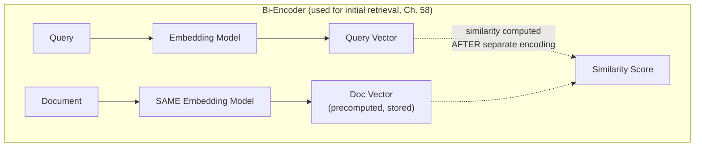
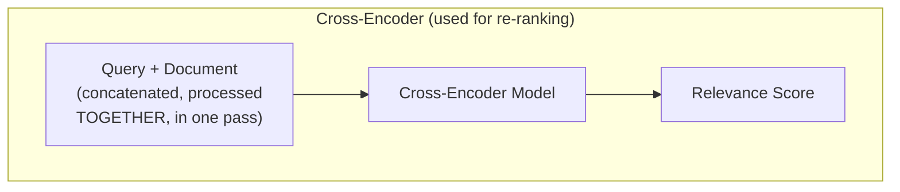
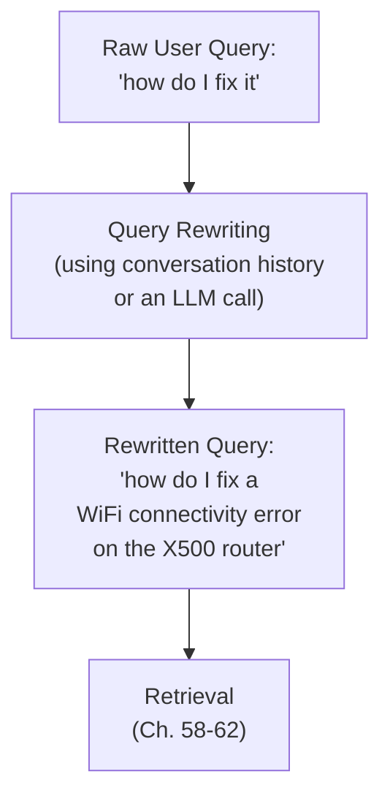
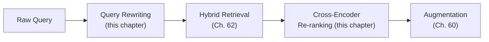

## Introduction

Chapter 62 closed by previewing this chapter's "cheap-broad-then-expensive-precise" pattern, directly echoing Chapter 51's model cascade. This chapter delivers both halves of that refinement: **re-ranking**, which applies a more precise (and more expensive) model to re-score an initial candidate set after retrieval, and **query rewriting**, which improves the *query side* of retrieval before it even reaches the search stage — two complementary techniques addressing different points in the pipeline Chapter 60 established.

## Why Initial Retrieval Alone Isn't Always Precise Enough

Chapters 58-62's retrieval methods (vector search, BM25, hybrid fusion) are all optimized to be **fast** — they need to search across potentially millions of documents (Chapter 59) within a tight latency budget (Chapter 60). This speed requirement means these methods use comparatively lightweight relevance signals: a single embedding's similarity, or BM25's term-statistics-based score. A **cross-encoder** re-ranking model can afford to be much more precise, at the cost of being far too slow to apply across the entire corpus — which is exactly why it's applied only to the *small, already-narrowed-down* candidate set the initial retrieval stage produces.

## Bi-Encoders vs. Cross-Encoders

This distinction is the technical heart of the chapter, and directly extends Chapter 37's encoder-architecture discussion:





**The key architectural difference**: a bi-encoder (what Chapter 58's vector search uses) encodes the query and each document *separately*, allowing document embeddings to be precomputed once and stored (Chapter 58's core efficiency enabler) — the similarity is only computed *after* both are independently encoded, meaning the model never actually sees the query and document *together*. A cross-encoder processes the query and a specific candidate document *jointly*, in a single forward pass, allowing the model's attention mechanism (Chapter 37) to directly relate specific words and phrases between the query and the document — producing a much more precise relevance judgment, but one that **cannot be precomputed**, since it depends on the specific query, which isn't known until request time.

```python
def cross_encoder_rerank(query: str, candidate_documents: list[str],
                           cross_encoder_model, top_k: int = 5) -> list[tuple[str, float]]:
    """
    Re-scores a SMALL candidate set (already narrowed down by cheap
    initial retrieval, Ch. 58-62) using a precise but expensive
    cross-encoder — the "expensive-precise" half of the cascade
    pattern Ch. 62 previewed.
    """
    scored = []
    for doc in candidate_documents:
        # The model sees query and document TOGETHER, in one pass —
        # this is what a bi-encoder's precomputed embeddings cannot do.
        relevance_score = cross_encoder_model.score(query_and_doc_pair=(query, doc))
        scored.append((doc, relevance_score))

    return sorted(scored, key=lambda x: x[1], reverse=True)[:top_k]
```

**Why cross-encoders can't be used for the initial, corpus-wide retrieval step**: since relevance can only be computed for a specific query-document *pair* (nothing can be precomputed and stored ahead of time, unlike bi-encoder embeddings), applying a cross-encoder across an entire corpus of millions of documents for every single query would require millions of expensive forward passes per query — directly reprising Chapter 58's original "brute-force linear scan is impractical at scale" argument, now in the context of why cross-encoders specifically need the initial retrieval stage to first narrow the field down to a small, tractable candidate set before they can be applied at all.

## Query Rewriting and Expansion

The complementary technique addresses the **query** side of retrieval, rather than refining results after the fact. A user's raw query is often suboptimal for retrieval as-is — too short, ambiguous, or missing context that would help retrieval succeed.



- **Coreference resolution**: a query like "how do I fix it" only makes sense with conversation history (Chapter 38's context window) — rewriting resolves "it" to its actual referent before retrieval, since a bi-encoder embedding "it" alone, without this resolution, would produce an unhelpfully vague, ambiguous query vector (directly echoing Chapter 61's discussion of why isolated fragments produce poor embeddings).
- **Query expansion**: generating several *alternative phrasings* of the same underlying query (often using an LLM call itself) and retrieving using all of them, then combining results — directly addressing the "query phrasing doesn't match document phrasing" failure mode Chapter 60 identified, by giving retrieval multiple chances to match against however the relevant document happens to be phrased.
- **Hypothetical Document Embeddings (HyDE)**: a specific, notable technique where an LLM first generates a *hypothetical, plausible-sounding answer* to the query (without needing it to be factually correct — the point is purely stylistic/structural similarity to real documents), and *that hypothetical answer* is embedded and used for retrieval instead of the raw query — exploiting the fact that a hypothetical answer's phrasing and structure often resembles the actual relevant document's phrasing far more closely than the original, differently-structured question does.

```python
def hyde_query(user_query: str, llm_client) -> str:
    """
    HyDE: generate a hypothetical answer, then embed THAT for
    retrieval — the hypothetical answer need not be factually
    correct; it only needs to be STYLISTICALLY similar to real
    documents, which a genuine question rarely is.
    """
    hypothetical_answer = llm_client.generate(
        f"Write a brief, plausible-sounding passage that would answer "
        f"this question, even if you're not certain of the exact facts: "
        f"{user_query}"
    )
    return hypothetical_answer  # this gets embedded and searched, not the raw query
```

## The Combined Pipeline



Query rewriting improves what goes *into* retrieval; re-ranking improves what comes *out* of it — together bookending the retrieval stage with two complementary refinement techniques, directly extending this Part's recurring theme that no single technique is sufficient alone, and a well-engineered RAG pipeline layers several complementary techniques at different points in the process.

## Key Takeaways

- Cross-encoder re-ranking processes a query and candidate document jointly in a single forward pass, producing more precise relevance scores than bi-encoder similarity — but cannot be precomputed, making it applicable only to a small, already-narrowed candidate set after initial retrieval.
- The "cheap-broad-then-expensive-precise" pattern (initial retrieval, then re-ranking) directly mirrors Chapter 51's model cascade pattern, applied to search relevance rather than LLM response generation.
- Query rewriting addresses the input side of retrieval — resolving coreferences, expanding into alternative phrasings, or using HyDE's hypothetical-answer technique — directly targeting the "query phrasing doesn't match document phrasing" failure mode from Chapter 60.
- A well-engineered RAG pipeline layers query rewriting (before retrieval) and re-ranking (after retrieval) around the core hybrid search stage, reflecting this Part's consistent finding that complementary techniques combined at different pipeline stages outperform any single technique applied alone.

---

## Interview Questions

**1. Why can't a cross-encoder's relevance scores be precomputed and stored the way a bi-encoder's document embeddings can, and why does this single architectural difference explain nearly everything else about how re-ranking is used?**
A bi-encoder computes an embedding for a document independently of any specific query — that embedding is a fixed, reusable representation of the document alone, meaning it can be computed once, ahead of time, and stored (Chapter 58's core efficiency mechanism); a cross-encoder's relevance score is a function of the query AND the document processed TOGETHER, jointly, in a single forward pass — this score has no meaning or existence independent of a SPECIFIC query, meaning there's no "cross-encoder representation of this document alone" that could be precomputed and reused across different queries the way a bi-encoder embedding can — this single difference explains why cross-encoders must always be run at QUERY TIME, against a SPECIFIC, already-narrowed candidate set (since running them against an entire, uncomputed corpus at query time would be far too slow, per this chapter's core argument), which is exactly why re-ranking is always positioned as a refinement stage AFTER initial, bi-encoder-based retrieval has already narrowed the field, never as a replacement for that initial retrieval stage.
*Follow-up: Could a cross-encoder theoretically be used for the ENTIRE retrieval process, if a corpus were small enough that speed wasn't a concern?*
Yes — for a genuinely small corpus (perhaps a few hundred documents) where running a cross-encoder against every single document for every query would still complete within an acceptable latency budget (Chapter 5), a team could theoretically skip the bi-encoder initial retrieval stage entirely and use a cross-encoder for the complete, exhaustive search process, since the fundamental limitation motivating the two-stage retrieve-then-rerank pattern (cross-encoders being too slow to apply corpus-wide) simply wouldn't apply at this small scale — this illustrates that the two-stage pattern is a scale-driven engineering necessity (echoing this series' consistent theme that the "right" architecture depends on actual scale and requirements, not a universal law), not an inherent, unconditional requirement of cross-encoders themselves.

**2. Why does this chapter describe the retrieve-then-rerank pattern as "directly mirroring Chapter 51's model cascade pattern," and what specific structural feature do these two patterns share?**
Chapter 51's model cascade uses a small, fast, cheap model to handle the majority of requests efficiently, escalating to a larger, slower, more expensive and more capable model only for the subset of cases where the cheaper model's result is judged insufficient; this chapter's retrieve-then-rerank pattern uses a fast, cheap bi-encoder (and/or BM25, per Chapter 62) to efficiently narrow an enormous corpus down to a small candidate set, then escalates to a slower, more expensive, more precise cross-encoder specifically for THIS SMALL, already-narrowed subset — both patterns share the identical underlying structural insight: apply the expensive, high-precision resource only to the smaller, already-filtered subset of the problem where its additional cost is actually tractable and where its additional precision provides genuine, meaningful value, rather than applying that expensive resource universally and wastefully across the FULL, much larger scope of the original problem.
*Follow-up: Why might recognizing this shared structural pattern be valuable beyond simply noting an interesting parallel, for a system designer encountering a genuinely NEW, unfamiliar problem in the future?*
Recognizing this as a GENERALIZABLE architectural pattern (rather than two unrelated, coincidentally-similar specific techniques) equips a system designer to proactively look for and apply this same "cheap-broad-filter-then-expensive-precise-refine" structure when encountering ANY new problem that shares the same underlying characteristics — a large search space, an expensive-but-precise evaluation method, and a cheaper-but-less-precise pre-filtering method — even in an entirely different domain this series hasn't specifically covered; this kind of transferable, pattern-level understanding (rather than only knowing two specific, memorized instances of the pattern) is exactly the deeper, more durable system design capability this series has consistently aimed to build, allowing a system designer to recognize and apply this same proven structural approach to novel problems they'll encounter in their actual work, well beyond the specific RAG and LLM-serving contexts this series has directly covered.

**3. Explain HyDE's core mechanism, and why generating a factually-incorrect hypothetical answer can still improve retrieval quality despite its content potentially being wrong.**
HyDE generates a plausible-sounding, hypothetical ANSWER to the user's query (using an LLM), then embeds and searches using THIS hypothetical answer instead of the raw query itself — this works because a genuine ANSWER (even a fabricated, hypothetical one) tends to share much more structural and stylistic similarity with how the ACTUAL, correct answer is likely phrased in the real source documents than the ORIGINAL QUESTION does (since questions and answers are often phrased quite differently, directly connecting to Chapter 60's "query phrasing doesn't match document phrasing" failure mode) — the hypothetical answer's specific FACTUAL CONTENT doesn't need to be correct for this technique to work, since the embedding-based similarity search is fundamentally about matching STYLISTIC and STRUCTURAL patterns of language (the kind of phrasing typically used to express a factual claim about this topic) rather than verifying the hypothetical answer's actual truth — the retrieval process is simply using this hypothetical answer as a better-shaped "probe" to find genuinely relevant real documents, which are then what actually get used to generate the FINAL, real answer (per Chapter 60's generation stage), not the intentionally-possibly-wrong hypothetical answer itself.
*Follow-up: Why is it important that the hypothetical answer generated by HyDE is NEVER shown to the user or used directly as the final answer, given that it's explicitly not guaranteed to be factually correct?*
Since the hypothetical answer is deliberately generated WITHOUT any grounding in actual retrieved source documents (it's generated purely from the LLM's own general, pre-trained knowledge, per Chapter 36's discussion of parametric knowledge, specifically BEFORE any retrieval has even occurred), it carries a HIGH risk of being factually incorrect or outdated, and directly showing it to a user (or using it as the actual final answer) would be a serious, direct instance of exactly the hallucination risk Chapter 36 and Chapter 60 have both warned about — HyDE's hypothetical answer is explicitly and exclusively an INTERMEDIATE, internal artifact used ONLY to improve the retrieval QUERY's effectiveness, with the ACTUAL final answer still generated properly, afterward, using the genuinely retrieved, real source documents (per Chapter 60's full augmentation and generation stages) — conflating this intermediate, potentially-incorrect hypothetical artifact with the final, properly-grounded answer would be a serious design error directly undermining the entire RAG architecture's grounding-based hallucination mitigation strategy.

**4. Why might query rewriting via coreference resolution be described as directly connecting to Chapter 61's discussion of why isolated fragments produce poor embeddings, even though these are nominally different topics (chunking versus query processing)?**
Chapter 61 established that a text fragment lacking necessary context (like a pronoun without its antecedent) produces an ambiguous, underspecified embedding, since the embedding model has genuinely incomplete information about the fragment's actual, specific meaning; a raw user query like "how do I fix it," taken in isolation without resolving what "it" refers to, suffers from EXACTLY this same underlying problem — the query's own embedding (computed via the same bi-encoder technology, Chapter 58) would be similarly ambiguous and underspecified, since the embedding model has no way to know what "it" actually refers to without the conversation history providing that context; coreference resolution (this chapter's query rewriting technique) solves this by explicitly resolving the ambiguous reference BEFORE embedding the query, directly and structurally addressing the SAME underlying "context-dependent language produces poor embeddings without sufficient surrounding context" problem that Chapter 61 identified for CHUNKS, now applied to QUERIES instead — illustrating that this is genuinely the same fundamental technical challenge (embeddings requiring sufficient context to be meaningful) manifesting on both the document/chunking side (Chapter 61) and the query side (this chapter) of the retrieval pipeline.
*Follow-up: Why might a RAG system need to handle THIS specific query-side ambiguity problem differently than the chunk-side problem, given that both stem from the same underlying embedding limitation?*
On the CHUNK side (Chapter 61), the solution is primarily architectural and happens ONCE, during the offline ingestion pipeline (choosing a chunking strategy that preserves sufficient context within each chunk boundary); on the QUERY side (this chapter), the ambiguity is inherently query-specific and arises fresh with EVERY new user query in real time, requiring an ONLINE, per-request resolution mechanism (using conversation history or an LLM call to resolve the reference, this chapter's coreference resolution technique) rather than a one-time, offline architectural decision — this difference in WHEN and HOW the ambiguity needs to be resolved (offline, structurally, for chunks; online, per-request, for queries) reflects the genuinely different operational contexts these two otherwise structurally similar problems occur in, even though the underlying embedding-ambiguity mechanism causing both problems is fundamentally the same.

**5. Why might a team choose to use query EXPANSION (generating multiple alternative phrasings) rather than relying solely on a single, well-crafted query rewrite, given both address the same "phrasing mismatch" problem?**
A single rewrite, however well-crafted, still commits to ONE specific phrasing, which might happen to align well with SOME relevant documents' phrasing but not others — since Chapter 60 established that different relevant documents might be phrased in genuinely different ways even for the same underlying topic, generating SEVERAL different alternative phrasings and retrieving using ALL of them (then combining the results, similar in spirit to Chapter 62's fusion technique) provides multiple independent "chances" to match against whatever SPECIFIC phrasing happens to appear in each potentially-relevant document, rather than betting entirely on a single rewrite's specific phrasing choice being the one that happens to align well with the actual, real documents in the corpus — this is directly analogous to Chapter 62's underlying rationale for combining multiple RETRIEVAL methods (semantic and keyword), now applied to combining multiple QUERY phrasings within the semantic retrieval method itself.
*Follow-up: What's the direct cost trade-off of using query expansion with multiple phrasings, compared to a single query rewrite, connecting to this Part's consistent cost-awareness theme?*
Query expansion requires running MULTIPLE separate retrieval searches (one per generated alternative phrasing) rather than a single search, directly increasing the computational cost and latency of the retrieval stage proportionally to how many alternative phrasings are generated and searched — and if an LLM is used to GENERATE these alternative phrasings in the first place (rather than using a simpler, rule-based expansion technique), this adds an additional LLM call's own cost and latency (Chapter 42) BEFORE retrieval even begins — this is a genuine, quantifiable cost that should be weighed against the demonstrated, measured retrieval-quality improvement query expansion provides for a SPECIFIC application (following this series' consistent empirical-validation discipline), rather than assumed to be a costless, unconditionally beneficial technique to apply by default regardless of whether the specific application's query patterns actually suffer significantly from the phrasing-mismatch problem this technique is designed to address.

**6. In an interview, if asked to design retrieval for a multi-turn conversational RAG assistant (where users ask follow-up questions referring back to earlier parts of the conversation), how would you use this chapter's query rewriting concepts to structure your answer?**
I'd explicitly identify coreference resolution as a NECESSARY component of this system's query-processing pipeline, since multi-turn conversations inherently and routinely produce exactly the kind of context-dependent, ambiguous follow-up queries this chapter's coreference resolution technique addresses (e.g., "what about the other one" or "can you explain that further," which are meaningless without the preceding conversation history) — I'd propose using either the conversation history directly combined with a simple heuristic, or, more robustly, a dedicated LLM call specifically tasked with rewriting the user's raw follow-up query into a complete, self-contained, context-resolved query BEFORE it's passed into the retrieval pipeline (Chapters 58-62), ensuring the retrieval stage always receives a well-formed, unambiguous query regardless of how elliptically or context-dependently the user actually phrased their specific follow-up question.
*Follow-up: Why might this coreference-resolution rewriting step need to be VALIDATED separately and specifically for multi-turn conversational accuracy, beyond the general retrieval-quality evaluation this Part has otherwise emphasized?*
The coreference resolution step's CORRECTNESS (does it actually correctly identify what "it" or "the other one" refers to, given the specific conversation history) is a genuinely distinct concern from the DOWNSTREAM retrieval quality that depends on it — a coreference resolution step that consistently and correctly resolves references would enable good downstream retrieval, while a coreference resolution step that FREQUENTLY misresolves references (confidently but incorrectly identifying the wrong prior topic as the referent) would systematically degrade downstream retrieval quality in a way that might be hard to diagnose as a coreference-specific problem without SPECIFICALLY and separately testing this step's own accuracy — following this series' consistent "isolate and separately validate each pipeline component" diagnostic discipline (Chapter 60's stage-by-stage failure diagnosis), a comprehensive evaluation strategy for this conversational RAG system should include a dedicated test set specifically evaluating the coreference resolution step's own accuracy in isolation, not just the FINAL, downstream retrieval and answer quality that depends on it.

**7. How would you decide, for a specific RAG application, whether to invest in cross-encoder re-ranking, query rewriting, both, or neither — connecting to Chapter 60's diagnostic discipline?**
I'd apply Chapter 60's core diagnostic principle directly — first identifying, through systematic failure analysis (examining a representative sample of queries where the current system's retrieval or final answers were judged inadequate), WHICH specific failure pattern is actually occurring: if failures predominantly show the CORRECT documents being retrieved among the initial candidates but not correctly PRIORITIZED at the very top of the ranking (meaning relevant content is present in the candidate set but gets diluted or displaced by less-relevant content before reaching the LLM, per Chapter 60's augmentation-stage token-budget discussion), this points toward RE-RANKING as the appropriate remediation; if failures predominantly show the retrieval stage failing to find genuinely relevant documents AT ALL (not even appearing in the initial candidate set), and this correlates with queries that are ambiguous, context-dependent, or poorly phrased relative to the source documents, this points toward QUERY REWRITING as the more appropriate remediation — using this specific, diagnosed failure pattern (rather than a general assumption that "more sophistication is always better") to determine which of these two chapter's techniques (or both, or neither) is actually justified for this specific application's own, measured failure characteristics.
*Follow-up: Why might a team need to invest in BOTH techniques together, rather than assuming one alone would fully resolve their diagnosed retrieval quality problems?*
If the diagnostic failure analysis reveals BOTH failure patterns occurring simultaneously (some queries suffering from poor initial candidate retrieval due to phrasing/ambiguity issues, AND some queries suffering from correct candidates being poorly prioritized within an otherwise adequate candidate set), a team would need BOTH query rewriting (to address the first pattern) AND re-ranking (to address the second pattern) to comprehensively resolve their diagnosed problems — since these two techniques address genuinely DIFFERENT, independent failure modes (as this chapter's positioning of them at DIFFERENT points in the pipeline — before and after core retrieval, respectively — reflects), a genuinely comprehensive remediation for a system suffering from both failure types simultaneously would reasonably require investing in both techniques together, rather than expecting either one alone to fully address a mixed, multi-cause failure pattern.

**8. Why might a team need to re-validate their re-ranking model's effectiveness after a significant change to their chunking strategy (Chapter 61), even if the re-ranking model itself remains completely unchanged?**
A cross-encoder re-ranking model's effectiveness depends on being given a REASONABLY GOOD initial candidate set to refine — if a chunking strategy change (Chapter 61) alters the typical SIZE, boundary quality, or content characteristics of the chunks being retrieved and passed to the re-ranker, the re-ranker's own performance characteristics (which were likely validated, per this series' consistent empirical discipline, against the PREVIOUS chunking strategy's typical chunk characteristics) might not transfer perfectly to this new chunking configuration — for example, a re-ranker trained or validated primarily on longer, paragraph-sized chunks might behave somewhat differently (potentially less optimally) when suddenly given much shorter, more granular chunks (or vice versa) as its candidate input, since the specific TEXT CHARACTERISTICS it's being asked to jointly evaluate against a query have meaningfully changed even though the re-ranking model's own weights haven't changed at all — motivating a re-validation of the FULL, combined pipeline (chunking plus retrieval plus re-ranking together) whenever any ONE upstream component changes significantly, directly echoing Chapter 60's and Chapter 48's "test the whole system after any component change" discipline.
*Follow-up: Why might this interaction between chunking strategy and re-ranking model performance be harder to anticipate in advance than the more direct interaction between chunking strategy and initial retrieval quality (Chapter 61's primary focus)?*
Chapter 61's chunking-and-retrieval interaction is relatively direct and intuitive (a chunk's SIZE and boundary quality directly affects its OWN embedding's quality and matchability, a fairly straightforward, single-hop relationship); the chunking-and-re-ranking interaction is more INDIRECT — it depends on how the re-ranking MODEL specifically was originally trained or validated (what TYPE and SIZE of text it was optimized to jointly evaluate against queries), which isn't necessarily something a team would have deep, specific visibility into if using an off-the-shelf, pre-trained cross-encoder model (per this series' general build-vs-buy discipline, now applied to re-ranking models specifically) — this makes the SPECIFIC nature and magnitude of this particular interaction genuinely harder to predict or reason about in advance purely from first principles, reinforcing why empirical, end-to-end re-validation (rather than purely theoretical reasoning about how these components SHOULD interact) is the more reliable way to actually confirm this specific interaction's real-world impact for a given system.

**9. How would you use this chapter's material to explain the specific COST trade-off of adding a re-ranking stage to an already-functioning RAG pipeline, connecting to Chapter 42's and Chapter 54's cost-modeling discipline?**
Adding re-ranking introduces an ADDITIONAL model inference step (the cross-encoder, this chapter's core technique) that must run for every retrieval request, on top of the existing embedding computation (Chapter 58) and BM25 scoring (Chapter 62) already occurring — this represents a genuine, additional per-request compute cost and latency (directly extending Chapter 60's end-to-end latency budget discussion, which explicitly flagged re-ranking as an "optional, ~50-200ms" additional stage) — I'd calculate this additional cost using the same cost-modeling framework Chapter 42 and Chapter 54 established (the re-ranking model's own inference cost per request, multiplied by expected request volume) and weigh it directly against the MEASURED improvement in final answer quality re-ranking provides for this specific application (per this chapter's earlier diagnostic-validation discussion), following this series' consistent "quantify both sides of a cost-benefit trade-off explicitly" principle rather than adopting re-ranking as an unconditional best practice without this kind of specific, quantified justification.
*Follow-up: How might this cost calculation change if the SAME re-ranking model needs to score a LARGER number of candidate documents (a bigger initial retrieval set) versus a SMALLER one?*
Since a cross-encoder must run a SEPARATE forward pass for EACH individual query-document pair being scored (this chapter's core mechanism, unlike a bi-encoder's precomputable, independent document embeddings), the re-ranking stage's total computational cost scales roughly LINEARLY with the number of candidate documents being re-ranked — meaning a team retrieving a larger initial candidate set (say, 50 candidates) before re-ranking would incur roughly 5x the re-ranking computational cost of a team retrieving a smaller initial candidate set (say, 10 candidates) before re-ranking, all else being equal — this directly connects the initial retrieval stage's candidate-count configuration (Chapter 58-62's `top_k` parameter) to the DOWNSTREAM re-ranking stage's cost, illustrating yet another example of this Part's recurring theme that pipeline stages are NOT fully independent, cost-isolated decisions, but rather interact and compound with each other in ways that a complete, accurate cost model must account for holistically.

**10. How would you handle a situation where a stakeholder wants to skip re-ranking and instead simply retrieve a LARGER number of initial candidates (hoping the LLM itself will "figure out" which are most relevant), citing a desire to avoid re-ranking's added engineering complexity?**
I'd explain, directly connecting to Chapter 60's precision-over-volume argument, that simply retrieving MORE candidates without improving their RANKING quality doesn't solve the same problem re-ranking addresses — it actually makes the underlying problem WORSE along the cost and context-budget dimensions (Chapters 38, 42), since more, less-precisely-ranked candidates consume MORE context budget and cost while still potentially burying the genuinely most relevant content among a larger volume of less-relevant material, rather than actually improving the PRECISION of what content the LLM ultimately receives and needs to reason over; I'd note that "hoping the LLM figures it out" places an unreliable, unvalidated burden on the generation stage to compensate for a retrieval-stage precision problem, rather than directly and more reliably addressing that precision problem at its actual source (the ranking quality itself, which re-ranking specifically targets) — presenting this as a genuine trade-off (avoiding re-ranking's engineering complexity, at the cost of a less reliable, more expensive, and less validated alternative approach) for the stakeholder to make an informed decision about, following this series' consistent discipline of making trade-offs explicit rather than allowing an unvalidated assumption ("the LLM will figure it out") to substitute for genuine, evidence-based engineering.
*Follow-up: What specific evidence would you gather to directly test whether "the LLM figures it out" actually works well enough for this specific application, before concluding re-ranking is genuinely necessary?*
I'd run a direct, controlled comparison (per this series' consistent empirical-validation discipline) measuring final RAG answer quality using the stakeholder's proposed "retrieve more candidates, no re-ranking" approach against the alternative "retrieve fewer candidates, WITH re-ranking" approach, using a representative sample of real or realistic queries, specifically checking whether the larger-candidate-set-without-reranking approach genuinely achieves comparable final answer quality (not just similar-looking retrieved content, but actual, validated DOWNSTREAM answer correctness and groundedness, per Chapter 60's evaluation discipline) — if this direct comparison shows the simpler, re-ranking-free approach genuinely achieves acceptable quality for this specific application (a possible, though less likely, outcome per this chapter's general argument), the stakeholder's simpler approach would be validated as sufficient; if the comparison reveals a meaningful quality gap, this concrete, measured evidence would directly and persuasively justify the additional engineering investment in re-ranking that the stakeholder was initially hoping to avoid.

**11. How would you use this chapter's bi-encoder-versus-cross-encoder distinction to explain why a company can't simply use their EXISTING cross-encoder-based search relevance model (perhaps originally built for a different search application) directly as their PRIMARY retrieval mechanism for a new, large-scale RAG system?**
I'd explain that regardless of how good or well-validated an existing cross-encoder relevance model might be for its ORIGINAL use case, its fundamental architectural property (requiring a joint forward pass for every query-document pair, with no ability to precompute reusable document representations, per this chapter's core distinction) makes it structurally UNSUITABLE for serving as the PRIMARY, corpus-wide retrieval mechanism for a large-scale RAG system — this isn't a matter of the specific model's quality or how well it was trained, but a fundamental ARCHITECTURAL constraint inherent to the cross-encoder approach itself; the existing cross-encoder model could still be VALUABLE for this new RAG system, but specifically in its appropriate role as a RE-RANKING stage (this chapter's core recommended usage pattern), applied to a smaller, already-narrowed candidate set produced by a separate, bi-encoder-based initial retrieval mechanism (Chapter 58) — redirecting the stakeholder's instinct to reuse existing, valuable ML assets toward the ARCHITECTURALLY APPROPRIATE role for that specific asset, rather than either dismissing its value entirely or attempting to force it into an architecturally unsuitable role.
*Follow-up: What would you need to separately build or acquire, beyond this existing cross-encoder model, to complete this RAG system's full retrieval pipeline?*
I'd need a SEPARATE bi-encoder embedding model (Chapter 14, 37) and a vector database with appropriate indexing (Chapters 58-59) specifically to handle the corpus-wide INITIAL retrieval stage — this bi-encoder could potentially be a different, purpose-built embedding model entirely distinct from the existing cross-encoder (since these are architecturally different model types serving different roles, per this chapter's core distinction), meaning the existing cross-encoder asset, while valuable, only fulfills ONE of the two necessary stages (re-ranking) in a complete, properly-architected retrieve-then-rerank RAG pipeline, requiring this additional, separate investment in the initial-retrieval infrastructure to complete the full system.

**12. How would you design an evaluation specifically isolating re-ranking's marginal contribution, separate from the initial retrieval stage's own quality, connecting to this Part's consistent component-isolation diagnostic discipline?**
I'd measure retrieval quality metrics (using a representative test set with known, correct relevant documents, per Chapter 59's earlier discussion) at TWO distinct points in the pipeline — immediately AFTER the initial retrieval/fusion stage (Chapters 58-62), BEFORE any re-ranking is applied, and again AFTER the re-ranking stage has been applied to that same initial candidate set — comparing these two measurements directly isolates re-ranking's SPECIFIC, MARGINAL contribution to overall ranking quality, independent of whatever quality the initial retrieval stage already provided on its own — this directly applies the same "measure before and after a specific intervention, holding everything else constant" methodology this series has recommended throughout (e.g., Chapter 48's before-and-after regression suite comparison for fine-tuning), now specifically applied to isolating re-ranking's own, independent value-add within this multi-stage retrieval pipeline.
*Follow-up: Why is it important to measure this marginal contribution using the SAME underlying test queries and candidate sets for both the before-and-after comparison, rather than using different, separately-sampled test data for each measurement?*
Using the SAME underlying test queries and the SAME initial candidate sets for both the before-and-after measurements ensures the comparison isolates ONLY the effect of the re-ranking step itself, holding every other variable (which specific queries are being tested, which specific candidates were initially retrieved) constant — if DIFFERENT test data were used for each measurement, any observed difference in quality could be confounded by differences in the underlying test queries or candidate sets themselves, rather than genuinely reflecting re-ranking's own specific, isolated contribution — this is a direct application of the same "control for confounding variables" experimental discipline this series established since Chapter 22's A/B testing discussion, now applied to this specific offline, component-level evaluation context rather than a live, randomized online experiment.

**13. How would you use this chapter's material to reason about whether query rewriting and re-ranking should be applied to EVERY single query, or selectively, only for certain query types?**
Following this series' consistent cost-benefit and right-sizing discipline (Chapter 51's model cascade being the most directly analogous prior example), I'd consider whether SOME queries are already well-served by the base hybrid retrieval pipeline alone (Chapter 62) without needing these additional refinement stages — for example, a short, unambiguous, single-topic query with clear, distinctive terminology might already retrieve highly relevant results reliably even without query rewriting or re-ranking, meaning applying these additional stages UNIVERSALLY, to every single query regardless of its characteristics, could impose unnecessary additional latency and cost (this chapter's earlier cost discussion) on the substantial fraction of queries that don't actually need this additional refinement to already achieve good results — I'd consider a CONDITIONAL application strategy, similar in spirit to Chapter 51's model cascade, applying query rewriting and/or re-ranking selectively based on some signal of query difficulty or ambiguity (e.g., query length, the presence of pronouns suggesting coreference needs, or the initial retrieval stage's own confidence/score distribution suggesting an ambiguous or poorly-matched result set) rather than universally for every single query regardless of its specific characteristics.
*Follow-up: What risk does this kind of conditional, selective application strategy introduce, that a universal "always apply these techniques" strategy would avoid?*
A conditional strategy requires an additional, reliable mechanism for correctly IDENTIFYING which queries actually need this additional refinement — if this identification mechanism itself is imperfect (incorrectly judging some queries that genuinely NEED refinement as not needing it, based on a flawed or insufficiently sophisticated difficulty-assessment heuristic), some queries that would have benefited from query rewriting or re-ranking might be incorrectly routed to skip these beneficial steps, resulting in a WORSE outcome for those specific, misclassified queries than a simpler, universal "always apply" strategy would have provided — this represents the same general trade-off this series has discussed for other similar conditional/adaptive strategies (e.g., Chapter 51's model cascade escalation-threshold calibration risk), where the COST savings and average-case latency improvement of a conditional approach must be weighed against the genuine risk of occasionally, incorrectly under-serving a specific subset of cases that the difficulty-assessment mechanism happens to misjudge.

**14. How would you use this chapter's complete retrieve-then-rerank-with-query-rewriting pipeline to explain, at a system-design level, why "RAG" as a term can be misleading if it implies a simple, three-step (retrieve, augment, generate) process?**
While "RAG" as a NAME captures the three fundamental, conceptual stages (retrieve, augment, generate, per Chapter 60), this chapter has now established that a genuinely well-engineered, production-grade RAG system's actual RETRIEVAL stage alone can itself be a multi-step, multi-technique pipeline (query rewriting, hybrid search combining semantic and keyword methods, and re-ranking) — meaning the simple three-letter acronym significantly understates the actual engineering sophistication and number of independently-tunable components a production RAG system genuinely requires to perform well, echoing this series' broader theme (established since Chapter 1) that seemingly simple, high-level architectural descriptions often understate the substantial underlying engineering complexity required to make a system actually work well in practice, rather than merely work at all in a basic, unoptimized form.
*Follow-up: Why might this understanding of RAG's actual internal complexity be valuable specifically when an interviewer asks a seemingly simple "design a RAG system" interview question?*
Understanding this internal complexity equips a candidate to give a MUCH more comprehensive, sophisticated, and genuinely informative answer than one who treats "RAG" as simply "retrieve some documents, then ask an LLM to answer using them" — a strong candidate, informed by this chapter's material, would proactively discuss the retrieval stage's own internal sophistication (query rewriting for ambiguous queries, hybrid search combining semantic and keyword matching, re-ranking for precision), directly demonstrating a depth of understanding that goes well beyond the surface-level, acronym-implied simplicity of "RAG," which is exactly the kind of comprehensive, technically-grounded depth that distinguishes a strong, senior-level system design answer from a more superficial one that only knows RAG's basic, three-letter conceptual outline without this deeper, practically-necessary internal architecture.

**15. How would you summarize, for someone moving on to Chapter 64's advanced RAG patterns discussion, why this chapter's re-ranking and query rewriting material is a necessary foundation for understanding those more advanced patterns?**
Chapter 64 will cover advanced RAG patterns like multi-hop retrieval (where a single query requires SEVERAL sequential rounds of retrieval, each informed by the results of the previous round) and GraphRAG (using structured knowledge graphs alongside or instead of pure vector retrieval) — these advanced patterns generally build upon and COMBINE this chapter's query rewriting and re-ranking techniques (a multi-hop retrieval process, for example, likely needs to REWRITE its query at each successive hop based on what was learned in the previous hop, and likely benefits from RE-RANKING at each individual hop's retrieval step) rather than replacing them — having this chapter's foundational understanding of these two complementary, single-hop refinement techniques equips a reader to understand Chapter 64's more advanced, MULTI-hop or MULTI-source patterns as extensions and compositions of these same, now-familiar building blocks, applied repeatedly or in more complex configurations, rather than encountering these advanced patterns as an entirely separate, disconnected body of new technique.
*Follow-up: What specific aspect of the "cheap-broad-then-expensive-precise" pattern from this chapter would you expect to become even MORE important to carefully manage in a multi-hop retrieval system, given that costs could compound across multiple sequential hops?*
I'd expect the COST discipline this chapter established (carefully weighing re-ranking's added cost against its measured benefit, per this chapter's earlier discussion) to become even MORE critical in a multi-hop system, since EACH individual hop's retrieval, query rewriting, and potential re-ranking costs would COMPOUND across the multiple sequential hops a complex query might require — a multi-hop system that applies expensive re-ranking at every single hop, without carefully validating that each specific hop actually benefits sufficiently from this additional cost (following this chapter's cost-benefit discipline), could accumulate a substantial total cost and latency across the full multi-hop process that might not be justified by the incremental quality improvement at each individual step — making this chapter's careful, evidence-based cost-benefit discipline for applying these refinement techniques even more essential to correctly apply at EACH stage of Chapter 64's more complex, multi-hop architectures, rather than less relevant simply because the overall system has become more sophisticated.
