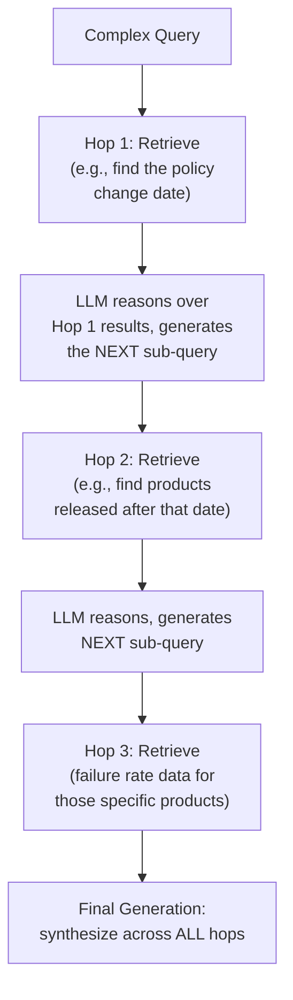
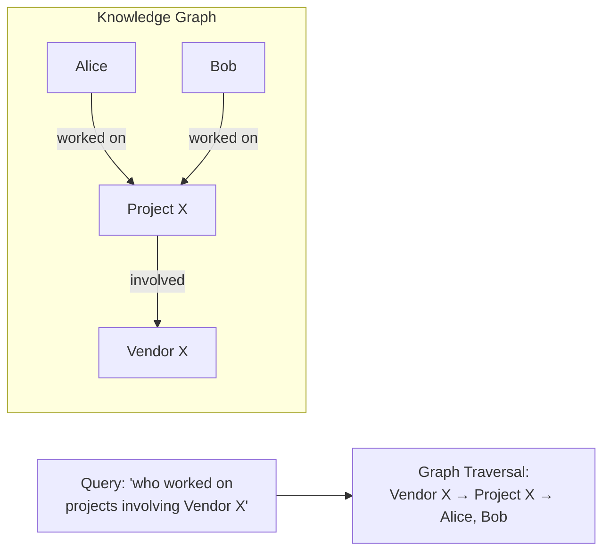
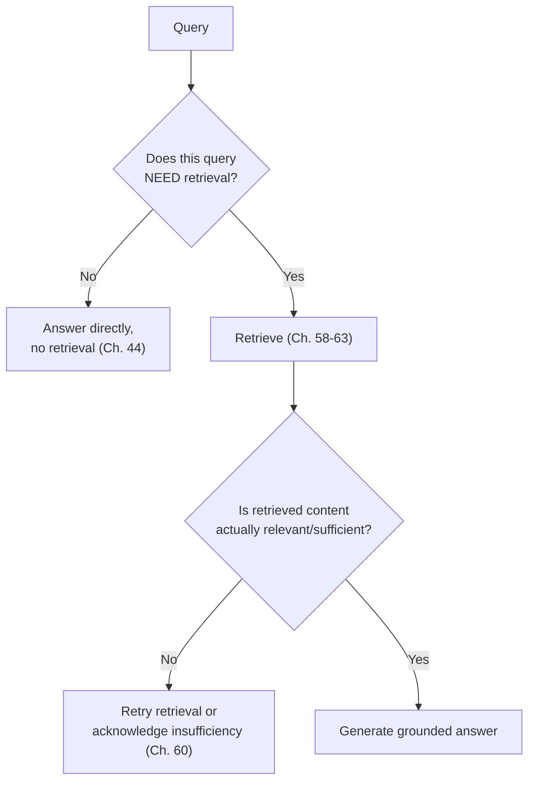

## Introduction

Chapter 63 closed by flagging that this chapter's advanced patterns compound and combine the query rewriting and re-ranking techniques already covered — and that their compounding costs demand the same cost-benefit discipline applied more carefully across multiple stages. This chapter covers three advanced RAG patterns, each addressing a specific limitation of the single-shot "retrieve once, generate once" architecture Chapter 60 established as the baseline: **multi-hop retrieval** for questions requiring sequential reasoning across multiple sources, **GraphRAG** for questions about relationships between entities, and **Self-RAG** for adaptively deciding *whether* retrieval is even needed at all.

## The Limitation of Single-Shot Retrieval

Chapter 60's baseline architecture retrieves once, based on the original query, then generates. This works well for questions directly answerable from a single relevant passage. It breaks down for questions requiring **synthesis across multiple, sequentially-discovered pieces of information** — for example, "which of our vendor's products has the highest failure rate among those released after our Q3 2024 policy change took effect?" This requires first finding the policy change's date, then finding which products were released after it, then finding failure rate data for those specific products — no single retrieval pass, however well-executed, can satisfy this in one shot.

## Multi-Hop Retrieval

**Multi-hop retrieval** breaks a complex query into a sequence of retrieval steps, where each step's results inform the *next* step's query — directly extending Chapter 63's query rewriting concept from a one-time preprocessing step into an iterative, multi-round process.



```python
async def multi_hop_retrieve(original_query: str, llm_client, retriever,
                                max_hops: int = 4) -> list[str]:
    """
    Each hop's retrieval is informed by what was learned in the
    PREVIOUS hop — directly extending Ch. 63's query rewriting into
    an iterative process, and Ch. 60's single-shot architecture into
    a multi-step one.
    """
    accumulated_context = []
    current_query = original_query

    for hop in range(max_hops):
        retrieved = await retriever.search(current_query)  # Ch. 58-63's full pipeline
        accumulated_context.extend(retrieved)

        # The LLM decides: do we have enough to answer, or do we need
        # another hop? This is itself an LLM call, per Ch. 42's cost model.
        decision = await llm_client.generate(
            f"Given the original question '{original_query}' and what "
            f"we've found so far: {accumulated_context}, do we have "
            f"enough information to answer? If not, what should we "
            f"search for next?"
        )
        if decision.has_sufficient_information:
            break
        current_query = decision.next_sub_query

    return accumulated_context
```

**The direct cost implication**: each hop is a full retrieval-plus-reasoning round trip — meaning multi-hop retrieval's latency and cost (Chapter 42, Chapter 54) scale with the *number of hops*, not a single retrieval pass. This is precisely why Chapter 63 flagged compounding costs as the concern to manage carefully: a query genuinely requiring 4 hops costs roughly 4x a single-hop query's retrieval-and-reasoning cost, on top of whatever query rewriting or re-ranking is applied *within* each individual hop.

## GraphRAG: Retrieval Over Structured Relationships

Vector search (Chapters 58-59) excels at finding content *similar* to a query. It's poorly suited to answering questions about explicit **relationships between entities** — "which team members have worked on projects that also involved Vendor X" is fundamentally a relationship-traversal question, not a similarity question, and no amount of embedding sophistication changes that fundamental mismatch.

**GraphRAG** addresses this by building and maintaining a **knowledge graph** — entities (people, products, projects) as nodes, and their relationships as edges — extracted from the source corpus (often using an LLM itself to perform this extraction), and answering relationship-heavy queries by traversing this graph rather than (or in addition to) performing vector similarity search.



```python
def graphrag_query(query_entities: list[str], relationship_type: str,
                     knowledge_graph) -> list[str]:
    """
    Directly traverses explicit, extracted relationships rather than
    relying on semantic similarity — appropriate specifically for
    queries whose actual information need IS a relationship, not
    a similarity match.
    """
    results = []
    for entity in query_entities:
        related = knowledge_graph.get_neighbors(entity, relationship_type)
        results.extend(related)
    return results
```

**Why this requires a fundamentally different ingestion pipeline than Chapter 61's chunking**: building a usable knowledge graph requires an entity-and-relationship EXTRACTION step during ingestion — typically another LLM call per document (or per chunk), directly adding to the ingestion pipeline's cost and complexity beyond Chapter 61's chunking-and-embedding baseline — making GraphRAG a genuinely more expensive architecture to build and maintain, justified specifically when a corpus and its typical queries are meaningfully relationship-centric, not as a default upgrade over vector-based RAG.

## Self-RAG: Deciding Whether to Retrieve at All

Chapter 44 established that not every query has a knowledge gap — some queries are answerable from the model's own general capability, or are pure instruction-following tasks with no retrieval need at all. **Self-RAG** trains (or prompts) a model to explicitly decide, per query, whether retrieval is needed, and, after retrieving, whether the retrieved content is actually relevant and sufficient — directly automating the diagnostic judgment Chapter 44's framework asked a *system designer* to apply, now applied *per-request*, dynamically, by the model itself.



This directly operationalizes two ideas this series has already established separately: Chapter 44's retrieval-necessity diagnostic (now made dynamic and per-query, rather than a one-time architectural decision) and Chapter 60's grounding instruction (now made an explicit, structured decision point rather than an implicit hope that the model follows a general instruction well).

## Choosing Among These Patterns

| Query Characteristic | Pattern |
|---|---|
| Answerable from a single relevant passage | Chapter 60's baseline single-shot RAG |
| Requires sequential reasoning across multiple, dependently-discovered facts | Multi-hop retrieval |
| Fundamentally about relationships between entities | GraphRAG |
| Traffic mix includes many queries with no retrieval need at all | Self-RAG (or, more cheaply, an upstream classifier applying Chapter 44's diagnostic before ever invoking retrieval) |

Each of these patterns adds genuine cost and complexity beyond Chapter 60's baseline — the same "escalate only when the baseline demonstrably falls short" discipline this series has applied since Chapter 2 applies here without exception: a team should validate, via Chapter 60's diagnostic failure analysis, that their *specific* query patterns actually require one of these advanced architectures before adopting them.

## Key Takeaways

- Multi-hop retrieval breaks a complex query into a sequence of retrieval-and-reasoning rounds, each informed by the previous round's findings — costs scale directly with the number of hops, compounding whatever cost each individual hop's retrieval pipeline already incurs.
- GraphRAG traverses an extracted knowledge graph rather than performing similarity search, appropriate specifically for relationship-centric queries that vector search structurally cannot answer well — at the cost of a genuinely more expensive, LLM-driven entity-extraction ingestion pipeline.
- Self-RAG dynamically decides, per query, whether retrieval is needed and whether retrieved content is sufficient, operationalizing Chapter 44's retrieval-necessity diagnostic and Chapter 60's grounding instruction as explicit, per-request model decisions rather than static architectural assumptions.
- Every advanced pattern in this chapter adds real, quantifiable cost beyond Chapter 60's baseline; adoption should be justified by diagnosed, query-pattern-specific evidence that the baseline genuinely falls short, not general appeal or sophistication for its own sake.

---

## Interview Questions

**1. Why does a question like "which vendor's products released after our Q3 policy change have the highest failure rate" fundamentally require multiple retrieval steps, rather than being solvable with a single, sufficiently well-crafted retrieval query?**
This question has an inherent, sequential DEPENDENCY structure — you cannot know WHICH products to search for failure-rate data on until you first know the Q3 policy change's specific date, and you cannot know the policy change's date until you've first retrieved that specific piece of information; a single retrieval query, however well-crafted (even with Chapter 63's query rewriting techniques), searches for content SIMILAR to a single, fixed query representation — it has no mechanism to first discover an intermediate fact and then use THAT discovered fact to inform a subsequent, DIFFERENT search, since the entire retrieval happens in one, single pass before any reasoning about the results has occurred; this genuinely sequential, dependency-based information need is structurally different from a single-fact lookup question, requiring the iterative, multi-round architecture this chapter's multi-hop retrieval pattern specifically provides.
*Follow-up: Why might a sufficiently large context window (Chapter 38) NOT be a viable alternative solution to this problem, even if it could theoretically fit ALL potentially-relevant documents into a single prompt?*
Even with an enormous context window capable of fitting every potentially relevant document, the LLM would still need to perform the SAME sequential reasoning INTERNALLY, within a single generation pass, to first identify the policy date, then identify the relevant products, then identify their failure rates, all from within one large, undifferentiated context — this places a very high burden on the model's own internal reasoning capability to correctly perform this multi-step reasoning chain reliably in one shot, without any external verification or correction between chains of reasoning, and doesn't address the QUADRATIC computational cost (Chapter 37, Chapter 50) of processing that much larger context, nor the increased hallucination risk from asking a model to perform a complex, multi-step reasoning chain unsupervised, all in one pass — multi-hop retrieval's explicit, externally-verified intermediate retrieval steps generally provide more reliable, verifiable results than hoping a single, very-large-context generation pass reasons through this same multi-step dependency correctly and reliably on its own.

**2. Explain why GraphRAG's underlying data structure (a knowledge graph of entities and relationships) is fundamentally better suited to relationship-centric queries than vector embeddings, connecting to Chapter 14's original embedding discussion.**
Chapter 14 established that embeddings capture semantic SIMILARITY — placing content with similar MEANING near each other in a vector space; a relationship-centric query ("who worked on projects involving Vendor X") isn't actually asking about semantic similarity at all — it's asking about an EXPLICIT, STRUCTURAL connection between two specific entities (a person and a vendor, connected through an intermediate project) that may have NO particular semantic similarity to each other as TEXT (a person's name and a vendor's name aren't semantically "similar" in the way two paraphrased sentences about the same topic would be) — a knowledge graph directly and explicitly represents these STRUCTURAL relationships as first-class data (nodes and edges), allowing a query to directly TRAVERSE this explicit relationship structure (as this chapter's code example shows) rather than relying on the fundamentally different, similarity-based matching mechanism that vector embeddings provide, which simply has no natural way to represent or query this kind of explicit, structural, non-similarity-based relationship information.
*Follow-up: Could a sufficiently sophisticated embedding model, given enough training data, learn to somehow encode SOME relationship information into its embeddings, partially closing this gap?*
To some degree, yes — embedding models can sometimes capture certain LOOSE, indirect relational signals (e.g., entities that frequently co-occur in similar contexts might end up with somewhat correlated embeddings), but this is a fundamentally different and much less RELIABLE mechanism than an EXPLICIT, extracted knowledge graph's direct, verifiable relationship representation — an embedding-based approach provides, at best, a fuzzy, probabilistic, and largely UNINTERPRETABLE signal about POSSIBLE relatedness, while a knowledge graph provides an EXPLICIT, verifiable, and directly queryable representation of a SPECIFIC, KNOWN relationship (e.g., "Alice worked on Project X" is either explicitly true or false in the graph, not a fuzzy similarity score) — for applications where relationship queries need RELIABLE, VERIFIABLE, and PRECISE answers (rather than a fuzzy, probabilistic approximation), the explicit knowledge graph structure remains meaningfully more appropriate and reliable than hoping an embedding model has incidentally, imperfectly learned to encode this kind of precise relational information as a side effect of its primary semantic-similarity training objective.

**3. Why does building a knowledge graph for GraphRAG require "a genuinely more expensive, LLM-driven entity-extraction ingestion pipeline," and how does this connect to the cost-discipline theme established throughout this Part?**
Extracting entities (people, products, organizations) and their specific relationships from unstructured text (the raw documents in the corpus) is itself a genuinely difficult natural language understanding task — requiring either a specifically-trained extraction model or, more commonly given current technology, an LLM call per document (or per chunk) specifically tasked with identifying and structuring this entity-and-relationship information — this is an ADDITIONAL ingestion-time cost beyond Chapter 61's chunking-and-embedding baseline, and, per Chapter 42's cost model, this LLM-driven extraction cost scales with the TOTAL SIZE of the corpus being processed (potentially a very substantial one-time or recurring cost for a large corpus) — directly connecting to this Part's consistent cost-discipline theme (Chapter 60's precision-over-volume principle, Chapter 62's evidence-based hybrid search adoption, Chapter 63's compounding-cost concern for advanced patterns), reinforcing that GraphRAG's genuine architectural benefit for relationship-centric queries must be weighed against this genuine, quantifiable additional ingestion cost, rather than adopted as a costless, unconditional upgrade to vector-based RAG.
*Follow-up: How would you estimate this additional cost for a specific, proposed GraphRAG implementation, before committing to building it?*
I'd apply Chapter 42's cost-modeling methodology directly to this specific ingestion task — estimating the total number of documents (or chunks) requiring entity-and-relationship extraction, the expected input and output token count for each individual extraction LLM call (informed by typical document length and the expected complexity/verbosity of the extracted relationship data), and the specific model's per-token pricing (Chapter 42) — multiplying these together to estimate the TOTAL one-time ingestion cost for building the initial knowledge graph, and separately estimating the ONGOING cost for processing new or updated documents over time (connecting to Chapter 58's discussion of keeping an index synchronized with an evolving corpus) — presenting this concrete, quantified cost estimate alongside the expected retrieval-quality benefit for the specific relationship-centric queries this GraphRAG implementation would address, following this series' consistent "quantify both sides of the trade-off explicitly" discipline before committing to this additional architectural investment.

**4. Why does Self-RAG's "decide whether retrieval is needed" capability directly operationalize Chapter 44's diagnostic framework, and why is making this decision DYNAMIC (per-query) rather than STATIC (a one-time architectural choice) genuinely valuable?**
Chapter 44 established a diagnostic framework for a SYSTEM DESIGNER to apply when deciding, at DESIGN TIME, whether a given APPLICATION or USE CASE genuinely has a knowledge gap warranting RAG's investment, versus being addressable through prompting or fine-tuning alone; Self-RAG applies this SAME underlying diagnostic question, but dynamically, PER INDIVIDUAL QUERY, at RUNTIME — recognizing that even within a single RAG-enabled application, different SPECIFIC queries genuinely vary in whether they actually need retrieval (a purely conversational or general-knowledge query submitted to an otherwise RAG-enabled customer support assistant might not need retrieval at all, while a specific product-detail question genuinely does) — making this decision dynamically, per query, rather than assuming EVERY query submitted to a RAG-enabled system automatically needs the full retrieval pipeline invoked, directly avoids the unnecessary cost and latency (Chapter 42, Chapter 60) of performing retrieval for queries that don't actually benefit from it, extending Chapter 44's original, application-level diagnostic insight down to the individual-query level for a more granular, cost-efficient system.
*Follow-up: Why might this per-query retrieval-necessity decision itself carry a real, quantifiable cost, similar to the model cascade's confidence-estimation cost discussed in Chapter 51?**
Making this "does this query need retrieval" determination — whether through a dedicated, specifically-trained classification step, or through prompting the main LLM itself to make this determination before proceeding — requires SOME computational step to actually make this decision, which itself has a real cost (a smaller classifier's inference cost, or an additional LLM call/reasoning step's token cost, per Chapter 42) that must be weighed against the AVERAGE savings this dynamic decision provides by correctly avoiding unnecessary retrieval for the queries that don't need it — this is directly analogous to Chapter 51's model cascade discussion, where the cascade's own confidence-estimation step itself has a real, non-zero cost that must be smaller than the AVERAGE savings the cascade provides by avoiding unnecessary escalation to the more expensive path, for the cascade (or, here, Self-RAG's dynamic retrieval decision) to provide a genuine NET cost benefit overall, rather than simply adding an additional cost layer without a sufficiently large compensating benefit.

**5. How would you use this chapter's decision table to structure a diagnostic conversation with a stakeholder who wants to adopt "all of these advanced RAG patterns simultaneously, to be safe"?**
I'd explain, directly extending Chapter 60's diagnostic discipline, that each of these three patterns (multi-hop, GraphRAG, Self-RAG) addresses a SPECIFIC, DIFFERENT limitation of the baseline architecture, and each carries genuine, quantifiable additional cost and complexity (this chapter's recurring theme) — adopting ALL of them simultaneously, "to be safe," without first diagnosing which SPECIFIC limitation (if any) actually affects THIS application's ACTUAL query patterns, risks incurring the FULL combined cost and complexity of all three patterns while potentially only genuinely NEEDING one, or even none, of them — I'd propose first conducting the same systematic failure analysis Chapter 60 recommended (examining actual or representative queries and identifying which SPECIFIC failure patterns, if any, the baseline single-shot RAG architecture actually exhibits) BEFORE committing to any of these advanced patterns, using this diagnostic evidence to selectively and specifically justify ONLY the patterns that address a genuinely DEMONSTRATED, evidence-based need for this particular application, rather than adopting all three reflexively out of an unvalidated, general desire for maximal sophistication or safety.
*Follow-up: What specific evidence would distinguish a genuine need for MULTI-HOP retrieval from a genuine need for GRAPHRAG, given that both address queries the baseline architecture struggles with?*
I'd look at the SPECIFIC NATURE of the baseline architecture's observed failures — if failures predominantly involve questions requiring SEQUENTIAL DISCOVERY of intermediate facts before the final answer can be determined (this chapter's Q3-policy-change example), this points toward multi-hop retrieval as the appropriate remediation; if failures predominantly involve questions asking about EXPLICIT RELATIONSHIPS between named entities (who worked with whom, what depends on what) that vector search structurally cannot represent well (per this chapter's earlier discussion), this points toward GraphRAG instead — these are genuinely DIFFERENT diagnostic signatures (sequential-dependency failures versus relationship-structure failures), and correctly distinguishing between them through this kind of specific, evidence-based failure analysis (rather than assuming both are needed simply because both are "advanced") ensures the stakeholder's engineering investment is directed toward the SPECIFIC advanced pattern that actually, demonstrably addresses their application's real, diagnosed limitation.

**6. In an interview, if asked to design a RAG system for "answering questions about our company's organizational structure and project history" (e.g., "who has worked with whom, on what projects"), how would you use this chapter's material to justify GraphRAG as the appropriate architecture?**
I'd explicitly identify this described use case as fundamentally RELATIONSHIP-CENTRIC (per this chapter's core distinction) — questions like "who has worked with whom" are asking about EXPLICIT, STRUCTURAL connections between specific entities (people, projects), not about semantic similarity to some query text, which is exactly the kind of query vector search (Chapters 58-59) is structurally poorly-suited to answer reliably, per this chapter's earlier discussion; I'd propose building a knowledge graph specifically representing employees, projects, and their explicit working relationships (extracted from company records, project documentation, and other relevant sources, using the LLM-driven extraction process this chapter described), and answering these relationship-centric queries through direct graph traversal rather than relying on vector similarity search, while potentially STILL using vector search as a complementary technique (echoing Chapter 62's hybrid-search combination theme) for any genuinely semantic, non-relationship-centric sub-questions this same application might also need to handle.
*Follow-up: What specific data quality or maintenance challenge would you flag as a genuine risk for this GraphRAG implementation, connecting to Chapter 58's staleness discussion?*
Since organizational structures and project assignments change over time (people join, leave, or move between projects and teams), the knowledge graph's ACCURACY depends entirely on keeping the extracted entity-and-relationship data SYNCHRONIZED with the actual, current organizational reality — directly analogous to Chapter 58's vector-database staleness concern, but arguably MORE consequential here, since an OUTDATED relationship in a knowledge graph (e.g., incorrectly indicating someone still works on a project they've since left) could produce a confidently-stated but factually WRONG answer to a direct relationship query, rather than merely a slightly-less-relevant retrieved document — I'd recommend implementing a robust, well-monitored pipeline (echoing Chapter 60's ingestion-pipeline monitoring recommendation) specifically for keeping this knowledge graph's relationship data current and accurate, treating this synchronization challenge as a genuinely high-priority operational concern given the direct, consequential nature of relationship-based factual claims this system would be making.

**7. Why might a multi-hop retrieval system need a maximum hop limit (as shown in this chapter's `max_hops` parameter), and what would happen without one?**
Without an explicit maximum hop limit, a multi-hop retrieval process could, in principle, continue indefinitely if the LLM's own "do we have sufficient information" determination (this chapter's code example) never confidently concludes that sufficient information has been gathered — perhaps due to a genuinely unanswerable or extremely complex query, or due to the LLM's own reasoning being unreliable or overly cautious about declaring sufficiency — an unbounded hop count would risk unbounded cost and latency (directly connecting to this chapter's cost-compounding concern, and Chapter 5's latency budget framework), potentially consuming enormous resources on a single query that may never actually terminate with a satisfactory answer; a maximum hop limit provides a necessary, bounded SAFETY MECHANISM (directly analogous to a maximum retry count or timeout in classical distributed systems design) ensuring the system eventually terminates and returns SOME answer (even if it must acknowledge insufficient information, per Chapter 60's grounding instruction) rather than continuing indefinitely.
*Follow-up: How would you determine an appropriate value for this maximum hop limit, balancing thoroughness against cost and latency, following this series' consistent empirical-validation discipline?*
I'd analyze a representative sample of the application's actual, expected multi-hop query types, measuring how many hops are TYPICALLY needed to reach a satisfactory answer for QUERIES THAT ARE GENUINELY ANSWERABLE within the system's knowledge base — setting the maximum hop limit somewhat ABOVE this typical, observed requirement (providing reasonable headroom for genuinely more complex queries that might legitimately need a few more hops) while still bounding the WORST-CASE cost and latency to an acceptable level (per Chapter 5's latency budget and Chapter 42's cost modeling) — this empirically-informed limit, rather than an arbitrary, unvalidated number, ensures the system can reliably handle its ACTUAL, typical range of legitimate multi-hop queries while still providing the necessary safety bound against unbounded, runaway cost for the rarer, genuinely difficult or unanswerable edge cases.

**8. How would you use this chapter's concepts to explain why a RAG system combining Self-RAG's adaptive retrieval decision with multi-hop retrieval's iterative process would need CAREFUL, JOINT design, rather than simply layering them independently?**
Self-RAG's core decision ("does this query need retrieval at all") and multi-hop retrieval's core decision ("do we have sufficient information yet, or do we need another hop") are STRUCTURALLY SIMILAR decisions (both are "is what we currently have sufficient" judgments) but apply at DIFFERENT POINTS in the overall process — Self-RAG's decision happens ONCE, upfront, before ANY retrieval occurs at all, while multi-hop's "sufficient information" decision happens REPEATEDLY, AFTER each individual hop, once retrieval has ALREADY begun; a naively combined system might, for example, redundantly re-ask "do we need retrieval at all" after EVERY hop (a question that's already been definitively answered "yes" by having entered the multi-hop process in the first place), or might fail to properly integrate Self-RAG's INITIAL "no retrieval needed" fast-path with multi-hop's more complex, iterative machinery, requiring careful, JOINT architectural design (rather than simply composing these two techniques as fully independent, separately-designed modules) to correctly and efficiently combine their genuinely related but distinctly-scoped decision points into one coherent, non-redundant overall pipeline.
*Follow-up: What specific architectural design would you propose to cleanly integrate these two techniques, avoiding this kind of redundant or poorly-coordinated decision-making?*
I'd design a single, unified decision framework where Self-RAG's initial "does this query need retrieval at all" check serves as the ENTRY GATE to the entire retrieval process (fast-pathing directly to generation for queries that don't need retrieval at all, avoiding the multi-hop machinery entirely for these cases), and, ONLY for queries that pass this initial gate and genuinely enter the retrieval process, the multi-hop logic's own "is this SPECIFIC hop's result sufficient, or do we need another hop" decision governs the SUBSEQUENT, iterative process — treating these as two DIFFERENT decisions answering two DIFFERENT questions at two DIFFERENT stages of a single, coherent pipeline (an initial gate decision, then a repeated, iterative sufficiency decision within the gated process), rather than either redundantly re-asking the same question at every stage or failing to properly sequence these two related but distinctly-scoped decision points into one clean, efficient overall architecture.

**9. Why might a company choose to build GraphRAG capability incrementally, starting with only a SMALL, high-value subset of entity types and relationships, rather than attempting to extract a comprehensive knowledge graph covering their entire corpus at once?**
This directly reflects this series' consistent "start with a validated, high-value subset before scaling to a comprehensive solution" principle (echoing, for example, Chapter 13's feature store adoption discussion and Chapter 31's incremental CI/CD/CT investment discussion) — attempting to extract a COMPREHENSIVE knowledge graph covering EVERY possible entity type and relationship across an entire, large corpus incurs the full, substantial ingestion cost this chapter identified (LLM-driven extraction across the ENTIRE corpus) before validating whether the resulting knowledge graph actually provides the expected retrieval-quality benefit for the application's ACTUAL, real query patterns; starting with a small, carefully-chosen, high-value subset (perhaps just the specific entity types and relationships most directly relevant to the MOST COMMON relationship-centric queries identified through Chapter 60's diagnostic failure analysis) allows the team to validate GraphRAG's genuine value with a much smaller upfront investment, before committing to the full cost of comprehensive coverage — directly applying this series' consistent evidence-based, incremental-investment discipline to this specific GraphRAG adoption decision.
*Follow-up: What risk does this incremental approach introduce, that a comprehensive, all-at-once approach would avoid?*
An incrementally-built, partial knowledge graph might not be able to answer relationship queries that fall OUTSIDE its currently-covered subset of entity types and relationships — a user asking about a relationship type not yet extracted and represented in the graph would receive an incomplete or incorrect answer (or the system would need to gracefully fall back to a different retrieval method, per Chapter 60's grounding-and-acknowledgment discipline, for these currently-uncovered relationship types) — this represents a genuine, real limitation during the incremental build-out period that a comprehensive, all-at-once approach (if its substantial upfront cost were accepted) would avoid — but this limitation is generally an ACCEPTABLE, well-justified trade-off specifically BECAUSE it allows the team to validate the GraphRAG approach's genuine value on the highest-value subset FIRST, before committing further investment to progressively expand coverage, following the exact same incremental-investment-with-acceptable-interim-limitations pattern this series has recommended for numerous other similar infrastructure investment decisions throughout.

**10. How would you use this chapter's material to design a monitoring strategy specifically for a multi-hop retrieval system, connecting to Chapter 33's observability discipline?**
I'd track, per query, the ACTUAL number of hops used (compared against the configured maximum, per this chapter's earlier discussion), the total accumulated latency and cost across all hops for that specific query (directly extending Chapter 60's end-to-end latency-budget tracking to this multi-hop-specific context), and the rate at which queries reach the MAXIMUM hop limit without the LLM ever confidently declaring "sufficient information" (a potentially concerning signal, similar to Chapter 50's admission-control rejection-rate monitoring, indicating either a genuinely difficult class of queries this system consistently struggles with, or a possible issue with the "sufficiency" determination logic itself being poorly calibrated or overly conservative) — this decomposed, hop-level monitoring directly extends Chapter 33's general observability discipline (tracking each component's individual contribution and behavior within a larger, multi-stage system) specifically to this multi-hop retrieval context, providing the granular visibility needed to identify whether the system's hop-based architecture is functioning efficiently and effectively for its actual, real production query mix.
*Follow-up: Why might a SUDDEN INCREASE in the average number of hops used per query be a particularly important signal to investigate promptly, connecting to Chapter 32's alerting discipline?*
Following Chapter 32's "sustained deviation warrants investigation" alerting principle, a sudden, sustained increase in average hops-per-query could indicate several possible underlying issues worth investigating — a shift in the TYPE or COMPLEXITY of queries users are submitting (perhaps reflecting a genuine change in user behavior or need that the system should be specifically adapted to handle better), a degradation in the underlying retrieval quality WITHIN each individual hop (Chapters 58-63's components) forcing MORE hops to compensate for less-effective individual retrieval steps, or a bug or miscalibration in the "sufficiency" determination logic itself, causing it to unnecessarily request additional hops even when sufficient information may have already been gathered — this sudden shift, whatever its specific root cause, directly and immediately affects both cost (Chapter 42) and latency (Chapter 5) for the affected queries, making it a genuinely important, promptly-investigatable signal rather than something to be noticed only much later through its eventual downstream cost or latency impact.

**11. How would you use this chapter's discussion of Self-RAG to push back on a design where EVERY query to a RAG-enabled customer support system is unconditionally routed through the full retrieval pipeline, regardless of the query's content?**
I'd point out that this unconditional routing design fails to apply the SAME diagnostic discipline Chapter 44 established at the APPLICATION level, now needed at the PER-QUERY level within this single application — some queries a customer support system receives (a general greeting, a purely conversational aside, a question genuinely answerable from the model's own general knowledge without any company-specific information) don't actually have a knowledge gap requiring retrieval at all, and forcing these queries through the FULL retrieval pipeline (Chapters 58-63's entire, multi-stage process) incurs unnecessary cost and latency (this chapter's core Self-RAG motivation) without providing any corresponding quality benefit for these specific, retrieval-unnecessary queries — I'd propose implementing Self-RAG's dynamic, per-query "does this actually need retrieval" decision (or a simpler, cheaper upstream classifier performing the same essential function) specifically to avoid this unnecessary cost for the likely-substantial fraction of queries that don't genuinely require the full retrieval pipeline's investment.
*Follow-up: How would you validate that this dynamic retrieval-necessity decision itself doesn't introduce a NEW quality risk — specifically, incorrectly skipping retrieval for a query that actually DID need it?*
I'd specifically evaluate (per Chapter 21's discipline) the retrieval-necessity classifier's or Self-RAG mechanism's ACCURACY on a representative test set including BOTH clear retrieval-needed and clear retrieval-unnecessary queries, paying particular attention to its FALSE NEGATIVE rate specifically (cases where it incorrectly judges retrieval as unnecessary for a query that genuinely DID need it) — since this specific error type directly risks the exact hallucination or ungrounded-answer problem Chapter 36 and Chapter 60 have both warned about, this false-negative rate deserves particularly careful scrutiny and a conservative, quality-favoring calibration (accepting SOME unnecessary retrieval invocations, a comparatively low-cost error, in exchange for minimizing this more consequential false-negative error type) — directly following this series' general "understand and calibrate for the ASYMMETRIC cost of different error types" principle (echoing, for example, Chapter 21's cost-asymmetric threshold-setting discussion) now applied specifically to this retrieval-necessity decision's own error-type trade-off.

**12. How would you use this chapter's material to reason about whether a NEW, more capable LLM release might reduce the future NEED for multi-hop retrieval's explicit, structured architecture, connecting to Chapter 40's capability-improvement discussion?**
As LLM reasoning capability continues to improve (per the general capability trends discussed throughout this series, e.g., Chapter 40), it's plausible that FUTURE models might become increasingly capable of performing SOME degree of implicit, internal multi-step reasoning within a SINGLE generation pass, given a sufficiently rich, single-shot retrieved context — potentially narrowing the specific gap that currently motivates EXPLICIT multi-hop retrieval's more complex, multi-round architecture; however, following this chapter's and this series' consistent discipline, this should be treated as a HYPOTHESIS to be periodically, empirically RE-VALIDATED (echoing Chapter 62's discussion of similarly re-validating hybrid search's continued necessity as embedding models improve) as new, more capable models become available, rather than assumed to have already occurred — a team should specifically test whether a NEWER model, given the SAME single-shot retrieved context that previously required explicit multi-hop reasoning, can now reliably and correctly perform the necessary internal reasoning chain on its own, before concluding the explicit multi-hop architecture's additional complexity is no longer justified for their specific application.
*Follow-up: Even if a newer model DOES demonstrate this improved internal reasoning capability, why might a team still choose to retain SOME form of explicit, structured multi-hop architecture rather than fully relying on this implicit capability?*
Explicit, structured multi-hop retrieval provides genuine VERIFIABILITY and DEBUGGABILITY benefits beyond pure task-completion capability — each individual hop's specific retrieval and reasoning step is EXPLICITLY OBSERVABLE and AUDITABLE (directly connecting to Chapter 33's observability discipline and Chapter 24's explainability discussion), allowing a team to verify EXACTLY what information was retrieved and how the model reasoned through each intermediate step, which is valuable for debugging failures, building user trust (potentially showing users the specific sources and reasoning chain that led to a final answer), and meeting any compliance or auditability requirements (Chapter 11) — a model's fully IMPLICIT, single-pass internal reasoning, even if it produces an equally CORRECT final answer, provides much less of this kind of external verifiability and traceability, meaning a team might reasonably retain the explicit, structured multi-hop architecture specifically for these verifiability and trust benefits, even if a newer model's raw task-completion capability alone might make the explicit structure less STRICTLY necessary for correctness.

**13. How would you use this chapter's advanced patterns to explain, at a system-design level, why "which RAG architecture should I use" doesn't have a single, universal answer — even more so than earlier chapters in this Part already established?**
This chapter has now established that even beyond the baseline retrieval pipeline's own internal configuration choices (Chapters 58-63's chunking, embedding, hybrid search, and re-ranking decisions), the OVERALL ARCHITECTURAL PATTERN itself (single-shot baseline, multi-hop, GraphRAG, Self-RAG, or some combination) is ALSO a genuine, application-specific design decision, driven by the SPECIFIC characteristics of the application's actual query patterns (sequential-dependency queries favoring multi-hop, relationship-centric queries favoring GraphRAG, a mixed traffic pattern with many retrieval-unnecessary queries favoring Self-RAG) — this reinforces, at an even higher, more architectural level, this Part's consistent and now thoroughly-demonstrated theme that RAG system design requires genuinely diagnosing the SPECIFIC application's actual needs and failure patterns at MULTIPLE levels (individual pipeline-stage configuration, AND overall architectural pattern selection) rather than adopting a single, universally "best" RAG architecture or configuration that would apply unconditionally across all possible applications and query types.
*Follow-up: How would you structure your OWN mental checklist, informed by this entire Part, for approaching a NEW RAG system design question in an interview, given this now fully-developed, multi-level diagnostic framework?*
I'd structure my approach hierarchically: first, applying Chapter 44's framework to confirm RAG is genuinely the right adaptation strategy at all (versus fine-tuning or pure prompting); second, if RAG is justified, establishing Chapter 60's baseline single-shot architecture as the default starting point; third, specifically probing (through clarifying questions, per Chapter 2's framework) whether the described application's query patterns suggest a need for one of THIS chapter's advanced patterns (sequential-dependency questions, relationship-centric questions, or a mixed traffic pattern with many retrieval-unnecessary queries), escalating to multi-hop, GraphRAG, or Self-RAG only if this diagnostic evidence specifically warrants it; and fourth, within whichever overall architecture is selected, applying Chapters 58-63's specific pipeline-stage configuration decisions (chunking strategy, hybrid search, re-ranking) based on the corpus and query characteristics — this layered, diagnostic-first structure, built up progressively across this entire Part, provides a comprehensive, well-justified, and non-arbitrary framework for approaching essentially any RAG system design question I might encounter.

**14. How would you use this chapter's material to critically evaluate a vendor's claim that their "GraphRAG platform" is a strict, unconditional upgrade over "traditional vector-based RAG"?**
I'd apply this chapter's core, evidence-based framing directly — GraphRAG is specifically and genuinely superior for RELATIONSHIP-CENTRIC queries (this chapter's core justification), but it is NOT a strict, unconditional upgrade for queries that are fundamentally about SEMANTIC SIMILARITY rather than explicit relationships, where vector-based RAG's simpler, cheaper architecture remains perfectly well-suited and appropriate; additionally, GraphRAG's genuine additional cost (the LLM-driven entity-extraction ingestion pipeline, this chapter's earlier cost discussion) is a real, ongoing expense that a vendor's marketing claim likely doesn't prominently feature — I'd request the vendor demonstrate GraphRAG's SPECIFIC advantage using MY OWN application's actual, representative query mix (following this series' consistent "validate vendor claims against your own specific conditions" discipline, echoing Chapter 52's and Chapter 59's similar vendor-claim skepticism), rather than accepting a general, unqualified "GraphRAG is better" marketing claim without this kind of query-pattern-specific, evidence-based validation.
*Follow-up: What specific question would you ask this vendor to directly test whether their claim is genuinely well-calibrated to my specific application, versus being a general marketing overstatement?*
I'd ask specifically: "for queries in my application that are PURELY semantic/similarity-based (not relationship-centric), does your GraphRAG platform's performance and cost compare favorably to a simpler, vector-only RAG approach, or does it primarily provide its advantage specifically for the relationship-centric SUBSET of queries?" — a vendor's honest, well-calibrated answer should acknowledge that GraphRAG's specific advantage is concentrated in the relationship-centric query subset (consistent with this chapter's own, more measured framing), while an evasive or overly-broad claim of universal superiority across ALL query types, without this kind of honest, query-type-specific qualification, would be a signal to apply even MORE skepticism and to insist on direct, empirical validation using my own specific, representative query mix before making any purchasing or architectural commitment based on this vendor's general marketing claims alone.

**15. How would you summarize, for someone moving on to Chapter 65's hands-on RAG pipeline chapter, why this chapter's advanced patterns material is important context for that upcoming implementation, even if the hands-on chapter primarily builds the simpler, baseline architecture?**
Chapter 65 will likely build the baseline, single-shot RAG pipeline (Chapter 60's architecture, incorporating Chapters 58-63's specific techniques) as its primary, hands-on implementation focus, since this baseline represents the appropriate STARTING POINT for the vast majority of real RAG applications (per this chapter's own "escalate only when justified" discipline) — but having THIS chapter's advanced-patterns material in mind equips a reader to recognize, when building or extending that baseline pipeline, the SPECIFIC EXTENSION POINTS where these advanced patterns could be layered in later, if and when a specific application's diagnosed needs genuinely warrant them (e.g., recognizing where a multi-hop loop could wrap around the baseline's single retrieval call, or where a knowledge-graph lookup could be added alongside the baseline's vector search) — rather than treating the baseline hands-on implementation as a complete, final, unextendable system, this chapter's material helps a reader see it correctly as a well-justified STARTING ARCHITECTURE with clear, well-understood paths toward these specific, evidence-based extensions when actually needed.
*Follow-up: What specific architectural design choice would you recommend Chapter 65's baseline pipeline implementation make, SPECIFICALLY to keep these future extension paths open, informed by this chapter's material?*
I'd recommend Chapter 65's baseline implementation cleanly separate and modularize its RETRIEVAL logic (as its own distinct, well-defined function or component, following the same clean-interface, separation-of-concerns principle Chapter 57's gateway architecture demonstrated for LLM providers) from its GENERATION logic — ensuring that a future multi-hop extension could cleanly WRAP and repeatedly INVOKE this same retrieval component within an iterative loop (this chapter's multi-hop pattern) without needing to significantly restructure the underlying retrieval logic itself, and ensuring the retrieval component's interface could reasonably accommodate a FUTURE alternative or additional graph-traversal-based retrieval method (this chapter's GraphRAG pattern) being added alongside or instead of the baseline's vector search, without requiring a complete architectural rewrite — this kind of forward-looking, clean modularity, directly informed by this chapter's advanced-patterns preview, is exactly the kind of good architectural practice that keeps a system's future evolution and justified extension genuinely tractable, rather than requiring painful, large-scale rework later if and when these advanced patterns eventually become genuinely warranted.
