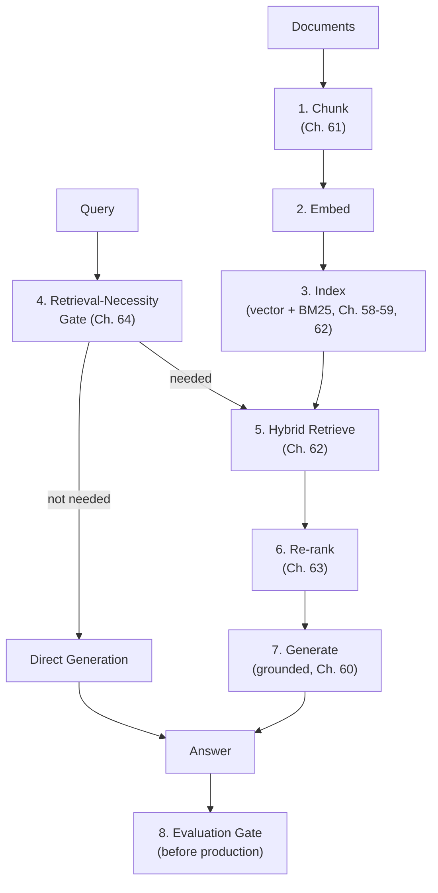

## Introduction

Chapters 58-64 built each piece of the RAG architecture independently: vector databases and indexing (58-59), the overall architecture (60), chunking (61), hybrid search (62), re-ranking (63), and advanced patterns (64). This hands-on chapter assembles a working, end-to-end pipeline from these pieces — following the same tie-it-together convention established by Chapter 30's serving pipeline, Chapter 49's fine-tuning pipeline, and Chapter 57's LLM gateway — including the diagnostic retrieval-necessity gate Chapter 64 introduced and an evaluation checkpoint before any pipeline change reaches production.

## Pipeline Architecture



## Step 1-3: Ingestion

```python
from dataclasses import dataclass
from typing import Optional
import hashlib

@dataclass
class Chunk:
    id: str
    text: str
    embedding: Optional[list[float]] = None
    metadata: dict = None

class IngestionPipeline:
    """
    Ties Ch. 61's chunking, embedding, and Ch. 58's/62's dual
    indexing (vector + BM25) into a single ingestion entry point.
    """
    def __init__(self, chunker, embedding_model, vector_store, bm25_index):
        self.chunker = chunker
        self.embedding_model = embedding_model
        self.vector_store = vector_store
        self.bm25_index = bm25_index

    def ingest_document(self, document_text: str, doc_metadata: dict) -> list[Chunk]:
        # Ch. 61: structure-aware or recursive chunking, chosen per
        # document type in a real system's config
        raw_chunks = self.chunker.split(document_text)

        chunks = []
        for i, text in enumerate(raw_chunks):
            chunk_id = hashlib.sha256(f"{doc_metadata['doc_id']}-{i}".encode()).hexdigest()[:16]
            embedding = self.embedding_model.embed(text)  # Ch. 14, 58
            chunk = Chunk(id=chunk_id, text=text, embedding=embedding,
                           metadata={**doc_metadata, "chunk_index": i})
            chunks.append(chunk)

        # Dual indexing — Ch. 62's hybrid search requires BOTH indexes
        # populated from the SAME chunk boundaries.
        for chunk in chunks:
            self.vector_store.upsert(chunk.id, chunk.embedding, chunk.metadata)
            self.bm25_index.add_document(chunk.id, chunk.text)

        return chunks

    def delete_document(self, doc_id: str) -> None:
        # Ch. 58's necessary delete capability — applied to BOTH
        # indexes, per Ch. 62's multi-tenant isolation discussion.
        chunk_ids = self.vector_store.find_by_metadata({"doc_id": doc_id})
        for chunk_id in chunk_ids:
            self.vector_store.delete(chunk_id)
            self.bm25_index.remove_document(chunk_id)
```

## Step 4: The Retrieval-Necessity Gate (Chapter 64's Self-RAG Concept)

```python
class RetrievalGate:
    """
    Ch. 64's Self-RAG-inspired gate — a cheap, fast check applied
    BEFORE the more expensive retrieval pipeline, following Ch. 51's
    and Ch. 63's "cheap check before expensive step" cascade pattern.
    """
    def __init__(self, classifier_model):
        self.classifier_model = classifier_model  # a small, fast
                                                      # model, NOT the
                                                      # main generation LLM

    def needs_retrieval(self, query: str, conversation_history: list[str]) -> bool:
        # A lightweight classification, not a full LLM reasoning call —
        # keeping this gate's own cost well below what it saves,
        # echoing Ch. 51's cascade cost-discipline.
        return self.classifier_model.predict(query, conversation_history)
```

## Step 5-6: Hybrid Retrieval and Re-ranking

```python
class RetrievalPipeline:
    """
    Ch. 62's hybrid search (semantic + BM25, fused via RRF) followed
    by Ch. 63's cross-encoder re-ranking — the "cheap-broad-then-
    expensive-precise" cascade applied to search relevance.
    """
    def __init__(self, embedding_model, vector_store, bm25_index,
                 cross_encoder, candidates_per_method: int = 20, final_k: int = 5):
        self.embedding_model = embedding_model
        self.vector_store = vector_store
        self.bm25_index = bm25_index
        self.cross_encoder = cross_encoder
        self.candidates_per_method = candidates_per_method
        self.final_k = final_k

    def retrieve(self, query: str) -> list[Chunk]:
        query_embedding = self.embedding_model.embed(query)  # Ch. 58's
                                                                 # consistency
                                                                 # requirement

        semantic_results = self.vector_store.query(
            query_embedding, top_k=self.candidates_per_method
        )
        bm25_results = self.bm25_index.search(query, top_k=self.candidates_per_method)

        fused = self._reciprocal_rank_fusion(semantic_results, bm25_results)  # Ch. 62
        candidates = [self._load_chunk(doc_id) for doc_id, _ in fused[:self.candidates_per_method]]

        reranked = self.cross_encoder.rerank(query, candidates, top_k=self.final_k)  # Ch. 63
        return reranked

    def _reciprocal_rank_fusion(self, semantic_results, bm25_results, k: int = 60):
        fused_scores = {}
        for rank, (doc_id, _) in enumerate(semantic_results, start=1):
            fused_scores[doc_id] = fused_scores.get(doc_id, 0) + 1 / (k + rank)
        for rank, (doc_id, _) in enumerate(bm25_results, start=1):
            fused_scores[doc_id] = fused_scores.get(doc_id, 0) + 1 / (k + rank)
        return sorted(fused_scores.items(), key=lambda x: x[1], reverse=True)

    def _load_chunk(self, doc_id: str) -> Chunk:
        return self.vector_store.get_by_id(doc_id)
```

## Step 7: Grounded Generation

```python
GROUNDING_SYSTEM_PROMPT = """
Answer the user's question using ONLY the information in the provided
context. If the context does not contain sufficient information to
answer the question, say so explicitly rather than guessing.
"""

class GenerationStage:
    """
    Ch. 60's augmentation-and-generation stage, with explicit context-
    budget management (Ch. 38) and the grounding instruction (Ch. 60).
    """
    def __init__(self, llm_client, max_context_tokens: int):
        self.llm_client = llm_client
        self.max_context_tokens = max_context_tokens

    def generate(self, query: str, retrieved_chunks: list[Chunk]) -> str:
        prompt = self._assemble_prompt(query, retrieved_chunks)
        return self.llm_client.generate(system=GROUNDING_SYSTEM_PROMPT, prompt=prompt)

    def _assemble_prompt(self, query: str, chunks: list[Chunk]) -> str:
        # Ch. 60's graceful-degradation truncation — drop least-relevant
        # (last-ranked) chunks first if the budget is exceeded.
        context = "\n\n".join(f"[Source {i+1}]: {c.text}" for i, c in enumerate(chunks))
        prompt = f"Context:\n{context}\n\nQuestion: {query}"

        while self._estimate_tokens(prompt) > self.max_context_tokens and chunks:
            chunks = chunks[:-1]
            context = "\n\n".join(f"[Source {i+1}]: {c.text}" for i, c in enumerate(chunks))
            prompt = f"Context:\n{context}\n\nQuestion: {query}"
        return prompt

    def _estimate_tokens(self, text: str) -> int:
        return len(text) // 4  # Ch. 38's rough heuristic
```

## Step 8: The Evaluation Gate Before Production

Directly extending Chapter 48's and Chapter 60's regression-testing discipline: **no pipeline change reaches production without passing this gate**, whether the change is to chunking, the embedding model, retrieval parameters, or the system prompt.

```python
class RAGEvaluationGate:
    """
    Ch. 21's evaluation discipline and Ch. 48's regression-testing
    discipline, applied specifically to this RAG pipeline — every
    component change (chunking, embedding model, retrieval config,
    prompts) is re-validated against this SAME standing test suite.
    """
    def __init__(self, test_queries: list[dict], quality_threshold: float = 0.85):
        # Each test query includes a known-correct source and an
        # expected-answer quality criterion, per Ch. 66's upcoming
        # RAG-specific evaluation metrics.
        self.test_queries = test_queries
        self.quality_threshold = quality_threshold

    def evaluate(self, pipeline) -> dict:
        results = {"retrieval_recall": [], "answer_quality": []}

        for test in self.test_queries:
            retrieved = pipeline.retrieval.retrieve(test["query"])
            recall_hit = any(test["expected_source_id"] == c.id for c in retrieved)
            results["retrieval_recall"].append(1.0 if recall_hit else 0.0)

            answer = pipeline.generation.generate(test["query"], retrieved)
            quality_score = self._score_answer(answer, test["expected_answer_criteria"])
            results["answer_quality"].append(quality_score)

        avg_recall = sum(results["retrieval_recall"]) / len(results["retrieval_recall"])
        avg_quality = sum(results["answer_quality"]) / len(results["answer_quality"])

        return {
            "avg_retrieval_recall": avg_recall,
            "avg_answer_quality": avg_quality,
            "passed": avg_quality >= self.quality_threshold,
        }

    def _score_answer(self, answer: str, criteria: dict) -> float:
        # In practice, this delegates to an LLM-as-judge or human review,
        # per Ch. 66's dedicated RAG evaluation discussion.
        raise NotImplementedError
```

## Assembling the Full Pipeline

```python
class RAGPipeline:
    def __init__(self, gate: RetrievalGate, retrieval: RetrievalPipeline,
                 generation: GenerationStage):
        self.gate = gate
        self.retrieval = retrieval
        self.generation = generation

    def answer(self, query: str, conversation_history: list[str]) -> str:
        if not self.gate.needs_retrieval(query, conversation_history):
            return self.generation.llm_client.generate(prompt=query)  # Ch. 64's fast path

        retrieved_chunks = self.retrieval.retrieve(query)
        return self.generation.generate(query, retrieved_chunks)
```

## Key Takeaways

- A production RAG pipeline is a composition of independently-testable stages (ingestion, retrieval gate, hybrid retrieval, re-ranking, generation, evaluation) — each corresponding to a specific chapter's concepts from this Part, cleanly separated per Chapter 64's closing recommendation about keeping extension points open.
- Dual indexing (vector store and BM25) must be populated from the same chunk boundaries and kept synchronized together, including for deletions, directly extending Chapter 58's staleness and Chapter 62's multi-tenant isolation discussions.
- The retrieval-necessity gate and the cross-encoder re-ranker are each additional, self-contained cascade stages (Chapter 51's and Chapter 63's pattern) — each should be individually cheap relative to what it saves or improves downstream.
- No pipeline change — chunking, embedding model, retrieval configuration, or prompts — reaches production without passing a standing evaluation gate, directly extending Chapter 48's regression-testing discipline to this multi-stage RAG pipeline.

---

## Interview Questions

**1. Why does this chapter's `IngestionPipeline` populate both the vector store and the BM25 index from the exact same chunk objects, rather than chunking independently for each?**
If the two indexes were chunked independently (even using conceptually similar chunking logic run twice, separately), there's no guarantee the resulting chunk boundaries would be IDENTICAL between the two indexes — any difference in chunk boundaries between the vector index and the BM25 index would mean Chapter 62's Reciprocal Rank Fusion is combining rankings over what are effectively DIFFERENT underlying units of content, breaking the fusion logic's implicit assumption that a given `doc_id` refers to the SAME piece of text in both ranking lists being combined — populating both indexes from the SAME chunk objects (as this chapter's code does) guarantees this consistency, ensuring that when RRF fuses a semantic-search ranking and a BM25 ranking, both rankings are genuinely referring to and scoring the exact same underlying chunks.
*Follow-up: What specific bug would you expect to observe if this consistency were violated — for example, if the BM25 index used a slightly different chunking configuration than the vector index?*
You'd likely observe the RRF fusion step (Chapter 62) either failing to properly credit a chunk that both methods actually found relevant (because the BM25 index's version of that content has a different `id`, or covers slightly different, non-identical text than the vector index's corresponding chunk, so the two systems never referenced the same underlying identifier consistently), or, more subtly, silently degraded retrieval quality where the fusion mathematically "combines" two rankings that don't actually correspond to the same underlying content units — this kind of subtle, hard-to-immediately-notice inconsistency bug is exactly the kind of issue this chapter's shared-chunk-object design pattern is specifically intended to prevent by construction, rather than requiring ongoing, careful runtime coordination between two independently-chunked systems.

**2. Why does the `RetrievalGate` class explicitly use a separate, smaller `classifier_model` rather than simply asking the main generation LLM whether retrieval is needed?**
This directly follows Chapter 51's and Chapter 63's cascade cost-discipline — the retrieval-necessity gate needs to run on EVERY incoming query, including the (likely substantial) fraction that don't actually need retrieval, meaning this gate's OWN cost must be small relative to what it saves by correctly avoiding unnecessary retrieval; using the main, likely larger and more expensive generation LLM (Part 10's serving infrastructure) to make this determination would incur a cost comparable to (or even exceeding) the cost of simply performing the retrieval anyway, defeating the entire purpose of having a cheap, fast gate in the first place — a dedicated, smaller, faster classifier model (potentially even a simple, traditional ML classifier rather than an LLM at all, echoing Chapter 26's classical-serving techniques) is specifically chosen to keep this gate's own overhead minimal, ensuring the NET cost savings this chapter's Chapter 64-inspired gate provides are genuinely positive rather than accidentally erased by an overly expensive gating mechanism.
*Follow-up: How would you validate that this smaller classifier model is actually reliable enough to be trusted with this gating decision, given it's necessarily less capable than the main generation LLM?**
I'd directly apply this chapter's `RAGEvaluationGate` methodology specifically to the classifier's OWN accuracy — constructing a labeled test set of queries with KNOWN correct retrieval-necessity labels (some genuinely needing retrieval, some genuinely not), measuring the classifier's accuracy against this test set, with PARTICULAR attention to its false-negative rate (incorrectly classifying a retrieval-needed query as not needing retrieval, per Chapter 64's earlier discussion of this being the more consequential error type) — if this smaller classifier's accuracy, and specifically its false-negative rate, meets an acceptable bar for this specific application's tolerance for this error type, it's validated as reliable enough for this gating role; if not, either a larger, more capable (but still meaningfully cheaper than the main LLM) classifier should be considered, or the gate should be calibrated more conservatively (biasing toward "needs retrieval" when uncertain) to reduce this specific, more consequential error type at the cost of somewhat reduced overall cost savings.

**3. Why does `RetrievalPipeline.retrieve` request `candidates_per_method` (e.g., 20) candidates from EACH underlying search method, but only return `final_k` (e.g., 5) after re-ranking — why not just retrieve 5 candidates from each method directly?**
This directly reflects Chapter 63's cross-encoder re-ranking rationale — the INITIAL retrieval methods (semantic search and BM25) are comparatively CHEAP but comparatively IMPRECISE relevance signals (Chapter 62's discussion), meaning the true best 5 results aren't guaranteed to be perfectly identified within only the top-5 results each initial method individually returns; by retrieving a LARGER initial candidate pool (20 from each method) and only THEN applying the more expensive, more precise cross-encoder re-ranking to narrow this larger pool down to the final 5, this pipeline ensures the more precise re-ranking step has a sufficiently WIDE net of candidates to select from, rather than being unable to recover a genuinely relevant document that the cheaper initial methods happened to rank just outside a narrower, top-5-only initial cutoff — directly implementing this Part's "cheap, broad reduction, then expensive, precise refinement" cascade pattern with an appropriately WIDE initial funnel before the narrow final refinement.
*Follow-up: How would you determine an appropriate value for `candidates_per_method`, balancing the re-ranking cost (which scales with this number, per Chapter 63's discussion) against the risk of the initial retrieval missing a genuinely relevant document entirely?*
I'd apply the same empirical-validation methodology this Part has consistently recommended (Chapter 59's `n_probe` tuning, Chapter 61's chunk-size validation) — measuring, across a few candidate values for `candidates_per_method`, both the RE-RANKING COST (which scales roughly linearly with this parameter, per Chapter 63's cost discussion) and the RECALL of the initial retrieval stage (does the known-correct source consistently appear SOMEWHERE within this candidate pool size, using a representative test set with known correct answers) — selecting the smallest `candidates_per_method` value that reliably achieves acceptable recall for this specific application's corpus and query patterns, rather than either an unnecessarily large value (incurring excess re-ranking cost) or a too-small value (risking the initial retrieval missing a genuinely relevant document before re-ranking even has a chance to consider it).

**4. Why does `GenerationStage._assemble_prompt` drop chunks from the END of the list (`chunks[:-1]`) when the context budget is exceeded, and what does this depend on that isn't explicitly checked within this specific method?**
This directly implements Chapter 60's graceful-degradation truncation strategy — dropping the LAST chunks in the list preserves the chunks appearing EARLIER, under the assumption that the list is already ordered from MOST to LEAST relevant; this method's correctness critically DEPENDS on the `chunks` parameter having ALREADY been properly ranked by relevance BEFORE being passed into this method — since this method itself performs no ranking or relevance assessment of its own, it implicitly relies on the UPSTREAM `RetrievalPipeline.retrieve` method (specifically, its cross-encoder re-ranking step, Chapter 63) having already correctly ordered the chunks by relevance, meaning any bug or misconfiguration in that upstream re-ranking step would silently and directly corrupt this downstream truncation logic's correctness as well, even though this specific method's own code would show no error or obvious symptom of that upstream problem.
*Follow-up: How would you add a safeguard to this pipeline to catch a scenario where chunks are accidentally passed to `GenerationStage` in the WRONG order (not actually relevance-ranked), given that this specific method has no way to independently verify this on its own?*
I'd add this as a specific, explicit test case within the `RAGEvaluationGate` (this chapter's evaluation gate) — constructing a test scenario that deliberately verifies the END-TO-END pipeline's context-truncation behavior actually preserves the MOST relevant, known-correct source chunk even when the overall candidate set is artificially large enough to trigger truncation, directly testing this cross-component assumption (that upstream ranking is correct and downstream truncation correctly relies on it) as part of the standing regression suite rather than assuming it will always hold silently — this is a concrete instance of this series' consistent "test the WHOLE system's behavior, including implicit cross-component assumptions, not just each component in isolation" discipline (Chapter 48's and Chapter 60's regression-testing themes), specifically because this particular assumption (correct upstream ordering) isn't and can't easily be verified by the downstream method itself.

**5. Why does the `RAGEvaluationGate` measure BOTH `retrieval_recall` and `answer_quality` as separate metrics, rather than relying solely on `answer_quality` as the single, ultimate metric that matters?**
While `answer_quality` (the final, downstream outcome) is indeed the metric that ULTIMATELY matters for user experience (echoing Chapter 6's "measure genuine business/user outcomes" principle), measuring `retrieval_recall` SEPARATELY provides essential DIAGNOSTIC information following Chapter 60's stage-by-stage diagnostic discipline — if a pipeline change causes `answer_quality` to regress, having the SEPARATE `retrieval_recall` metric immediately tells you WHETHER this regression originated in the RETRIEVAL stage (if recall also dropped) or the GENERATION stage (if recall remained stable, but answer quality still dropped, pointing toward a prompting or generation-model issue instead) — without this separate, stage-specific metric, a single aggregate `answer_quality` score alone wouldn't provide this same diagnostic clarity about WHICH specific pipeline stage is responsible for an observed change, directly requiring the kind of trial-and-error, undirected investigation this series has consistently recommended avoiding in favor of upfront, decomposed measurement.
*Follow-up: Why might a pipeline change theoretically IMPROVE `retrieval_recall` while simultaneously WORSENING `answer_quality`, and what would this specific combination of results tell you to investigate?*
This combination could occur if a chunking or retrieval configuration change successfully retrieves the CORRECT underlying source document MORE reliably (improved recall) but does so in a form that's somehow LESS USABLE by the generation stage — for example, if the change retrieves the correct source but as a much LARGER, less-focused chunk (diluting the LLM's ability to correctly identify and use the specific relevant portion within it, per Chapter 61's dilution discussion) — this specific combination of results (recall up, quality down) would point diagnostically AWAY from "did we find the right source" and TOWARD "is the source we found actually well-FORMED and usable for the generation stage," directing further investigation specifically toward chunk size, chunk boundary quality, or prompt-assembly logic (this chapter's `_assemble_prompt` method) rather than toward the retrieval matching logic itself, which this scenario's improved recall has already confirmed is functioning well.

**6. In an interview, if asked to extend this chapter's pipeline to support the multi-hop retrieval pattern from Chapter 64, which specific existing component would you modify or wrap, and why?**
I'd wrap the EXISTING `RetrievalPipeline.retrieve` method within an outer, iterative control loop (rather than rewriting the retrieval logic itself from scratch) — since `RetrievalPipeline.retrieve` already correctly implements a single, complete hybrid-search-and-rerank retrieval round (Chapters 62-63), Chapter 64's multi-hop pattern can be implemented by REPEATEDLY calling this SAME, already-correct method with a DIFFERENT (LLM-generated, based on previous hops' results) query at each successive hop, accumulating results across hops, and using an LLM call to determine when sufficient information has been gathered (per Chapter 64's code example) — this directly reflects Chapter 64's own closing recommendation about keeping a clean separation between the retrieval component and the overall orchestration logic, allowing the multi-hop extension to be added as a NEW, wrapping orchestration layer without needing to modify or duplicate the underlying, already-validated single-hop retrieval logic itself.
*Follow-up: What specific change would you need to make to the `RAGEvaluationGate` to properly evaluate this newly-added multi-hop capability, beyond what this chapter's existing gate already measures?*
I'd need to extend the evaluation gate's test query set to specifically include MULTI-HOP test queries (questions genuinely requiring the kind of sequential, dependent information-gathering Chapter 64 described), with EXPECTED intermediate facts or sources at each hop (not just a single, final expected source, as this chapter's existing single-hop-oriented test structure assumes) — and I'd add a new metric specifically tracking the NUMBER OF HOPS actually used per test query (per Chapter 64's monitoring discussion), comparing this against an expected or acceptable range, to catch cases where the multi-hop logic either terminates prematurely (before gathering sufficient information) or continues unnecessarily long (wasting cost, per Chapter 64's cost-compounding discussion) — this extension directly follows this chapter's and Chapter 64's shared principle that a new architectural capability needs its OWN, specifically-tailored evaluation criteria, not just reuse of the existing single-hop evaluation gate's criteria unchanged.

**7. Why might the `RAGPipeline.answer` method's fast path (when `gate.needs_retrieval` returns False) still be a meaningful engineering investment, even if it's only exercised for a minority of total queries?**
Even if only exercised for a MINORITY of queries, this fast path avoids the ENTIRE cost of the hybrid retrieval pipeline (embedding computation, vector search, BM25 search, and cross-encoder re-ranking, per Chapters 58, 62-63) for every query that takes it — given Chapter 42's per-token and per-request cost accounting, and Chapter 60's latency budget discussion, even a MODEST fraction of total traffic (say, 15-20% of queries) genuinely not needing retrieval represents a real, aggregate cost and latency savings at scale (Chapter 42's cost-modeling methodology, applied here to calculate the AGGREGATE savings across this fraction of total request volume) — this illustrates that a system-design investment's value should be assessed based on its AGGREGATE impact across the full expected request volume and mix, not dismissed simply because it doesn't apply to EVERY single request.
*Follow-up: How would you quantify whether this fast path's implementation complexity (the additional `RetrievalGate` component and its own validation overhead, per this chapter's earlier discussion) is actually justified for a SPECIFIC application, rather than assuming it's always worthwhile?*
I'd estimate the EXPECTED fraction of the application's actual query traffic that would genuinely qualify for this fast path (informed by analyzing a representative sample of real or anticipated queries), multiply this fraction by the PER-QUERY cost and latency savings the fast path provides (the full retrieval pipeline's cost, avoided for this fraction of traffic), and compare this AGGREGATE, ONGOING savings against the ONE-TIME implementation cost and ONGOING maintenance/validation overhead of building and maintaining the `RetrievalGate` component itself (including its own accuracy validation, per this chapter's earlier discussion) — following this series' consistent cost-benefit quantification discipline (Chapter 13's feature store ROI calculation is directly analogous), concluding this fast path is justified specifically when this quantified aggregate savings meaningfully exceeds its implementation and maintenance cost for THIS specific application's actual expected traffic mix, rather than adopting it as an unconditional best practice for every RAG application regardless of its traffic characteristics.

**8. How would you modify this chapter's `IngestionPipeline.delete_document` method to properly support the multi-tenant isolation requirement from Chapter 55 and Chapter 62's discussion?**
I'd ensure the `find_by_metadata` call used to locate a document's chunks for deletion EXPLICITLY includes the requesting tenant's identifier as part of its metadata filter (directly extending Chapter 58's metadata-filtering discussion), preventing a deletion request scoped to one tenant from inadvertently matching or affecting another tenant's documents that might coincidentally share the same `doc_id` value (a genuine risk if `doc_id`s aren't guaranteed globally unique across all tenants, rather than only unique WITHIN each tenant's own document set) — and I'd apply this SAME tenant-scoped filtering consistently to BOTH the vector store's and the BM25 index's deletion calls (echoing Chapter 62's earlier discussion of needing to apply isolation filtering CONSISTENTLY across both underlying search methods, not just one), ensuring a deletion request cannot accidentally leave stale, un-deleted content in ONE of the two indexes due to inconsistent isolation-filtering logic between them.
*Follow-up: What specific test would you add to this chapter's `RAGEvaluationGate` (or a separate, dedicated test suite) to verify this multi-tenant deletion isolation is correctly implemented?*
I'd construct a test scenario with at least two distinct simulated tenants, each having a document that happens to share a coincidentally-similar or identical `doc_id` value (deliberately testing the EDGE CASE this question's scenario describes), issue a deletion request scoped to ONE tenant's document, and then explicitly verify — through direct queries against BOTH the vector store and the BM25 index, filtered specifically for the OTHER, non-deleting tenant's data — that the other tenant's document remains fully intact and unaffected by the first tenant's deletion request; this kind of deliberately adversarial, edge-case-focused test (directly following Chapter 60's and Chapter 63's "test the harder, more realistic edge cases explicitly" discipline) is necessary specifically because a more superficial test (verifying only that "deletion works" for a single-tenant scenario) wouldn't actually exercise or validate this specific, more consequential multi-tenant isolation requirement at all.

**9. Why does this chapter's pipeline design keep the `RAGEvaluationGate` as a SEPARATE class from the `RAGPipeline` itself, rather than building evaluation logic directly into the pipeline's own request-handling code?**
Keeping evaluation logic SEPARATE from the pipeline's live, request-serving code reflects the same "training/evaluation infrastructure should be decoupled from serving infrastructure" principle this series established as early as Chapter 20's training infrastructure discussion, and reinforced in Chapter 22's separate offline/online evaluation environments — the evaluation gate needs to run against a KNOWN, controlled test set (not live, real user traffic) as a PRE-DEPLOYMENT check (this chapter's "before it reaches production" framing), meaning it has an entirely different operational context, trigger condition (run before each deployment, not on every live request), and performance requirement (can afford to be slower and more thorough, since it's not on the live user-facing request path) than the actual `RAGPipeline.answer` method that serves real, live traffic — conflating these two genuinely different operational contexts within a single class would violate the same separation-of-concerns principle this series has consistently applied to distinguish training-time and serving-time infrastructure throughout Parts 4-7.
*Follow-up: What risk would arise if a team decided to skip this separate evaluation gate and instead rely purely on LIVE, in-production monitoring (Chapter 33) to catch RAG pipeline quality regressions after a change is already deployed?*
Relying purely on live, in-production monitoring means any newly-introduced regression would first need to actually AFFECT REAL USERS before being detected (through degraded live monitoring metrics, per Chapter 33), rather than being caught and prevented BEFORE deployment through this chapter's standing evaluation gate — this directly reintroduces the exact risk Chapter 22's canary deployment discipline and Chapter 48's regression-testing discipline were both specifically designed to avoid: real user impact from a preventable, detectable-in-advance quality regression — a pre-deployment evaluation gate (this chapter's approach) catches many regressions BEFORE they ever reach live users at all, while live monitoring alone only catches them AFTER they've already begun affecting real, live traffic, making the pre-deployment gate a strictly earlier, more preventive layer of defense that live monitoring alone cannot fully substitute for, even though live monitoring remains an essential, complementary SECOND layer of defense for catching whatever the pre-deployment gate's necessarily limited test set might miss.

**10. How would you extend this chapter's pipeline to add the query rewriting techniques from Chapter 63 (coreference resolution, query expansion, or HyDE), and where specifically would this new logic be inserted?**
I'd insert a new, dedicated query-rewriting stage BETWEEN the `RetrievalGate` check and the `RetrievalPipeline.retrieve` call — specifically AFTER confirming retrieval is actually needed (avoiding the wasted cost of rewriting a query that will never be used for retrieval anyway, per Chapter 64's gate-ordering logic), but BEFORE the actual hybrid retrieval call, ensuring the retrieval pipeline always receives an already-well-formed, unambiguous, and potentially-expanded query rather than the user's raw, potentially ambiguous or single-phrasing original query — this insertion point directly reflects Chapter 63's own architectural positioning of query rewriting as improving the INPUT SIDE of retrieval, distinct from and positioned earlier in the pipeline than the re-ranking stage (Chapter 63) that improves the OUTPUT side of retrieval, maintaining this chapter's established pattern of cleanly separating each distinct pipeline stage into its own, independently-testable component.
*Follow-up: If you specifically added HyDE (generating a hypothetical answer for embedding, per Chapter 63), what ADDITIONAL cost would this introduce to the pipeline's overall latency and cost budget, and how would you validate this addition is worthwhile?*
HyDE requires an ADDITIONAL LLM call (to generate the hypothetical answer) BEFORE the retrieval pipeline even begins, directly adding this extra LLM call's own latency and token cost (Chapter 42) to the TOTAL end-to-end pipeline latency and cost for every query that passes through this stage, on top of the existing embedding, search, and re-ranking costs already present in the baseline pipeline — I'd validate this addition is worthwhile using this SAME chapter's `RAGEvaluationGate` methodology — specifically comparing `retrieval_recall` and `answer_quality` metrics WITH and WITHOUT the HyDE query-rewriting stage enabled, using a representative test set (potentially specifically including queries with known phrasing-mismatch characteristics, per Chapter 60's original motivating failure mode), confirming that the measured retrieval-quality improvement HyDE provides for THIS specific application genuinely justifies its additional, quantified cost, following this series' now thoroughly-established cost-benefit validation discipline applied consistently to yet another specific pipeline-extension decision.

**11. Why might this chapter's pipeline benefit from caching the embedding computation for FREQUENTLY-REPEATED queries, connecting to Chapter 51's caching discussion from Part 10?**
Chapter 51 established caching as a valuable technique for avoiding redundant, expensive computation when the SAME input is likely to recur — for a RAG application with a meaningful volume of frequently-repeated or highly similar queries (a common pattern for FAQ-style customer support applications, for example), caching the QUERY EMBEDDING computation (and potentially even the FULL retrieval result, if the underlying corpus hasn't changed since the cached result was computed, per Chapter 58's staleness-awareness) for these frequently-repeated queries could avoid redundant embedding-model inference calls and redundant vector/BM25 search operations entirely for these repeat queries, directly reducing both latency and cost for this specific, frequently-repeated subset of the application's overall query traffic — a direct, RAG-specific application of the same general caching principle Chapter 51 established for LLM generation more broadly.
*Follow-up: What specific invalidation strategy would this query-result cache need, connecting to Chapter 58's discussion of keeping an index synchronized with an evolving corpus?*
Since the underlying document corpus can change over time (new documents added, existing ones updated or deleted, per Chapter 58's discussion), a cached retrieval result for a given query could become STALE if the corpus changes in a way that would affect what that specific query SHOULD now retrieve — I'd implement a cache invalidation strategy tied directly to the ingestion pipeline's own update/delete operations (this chapter's `IngestionPipeline` methods) — for example, invalidating or expiring cached results after a bounded time window (a simple, though imprecise, time-based invalidation), or, more precisely, tracking which cached queries' retrieved chunks have since been updated or deleted and selectively invalidating only those SPECIFIC affected cache entries — directly extending Chapter 58's staleness-management discipline to this NEW, retrieval-result-caching context, ensuring the caching optimization's latency and cost benefits don't come at the expense of silently serving increasingly stale, outdated retrieval results over time.

**12. How would you use this chapter's pipeline structure to explain to a new engineer why "debugging a bad RAG answer" requires checking MULTIPLE, SPECIFIC places in the code, rather than looking at the final generated answer alone?**
I'd walk the new engineer through this chapter's explicit, staged pipeline structure — a bad final answer could originate from the `RetrievalGate` INCORRECTLY judging retrieval as unnecessary when it actually was needed (Chapter 64's false-negative concern), from `RetrievalPipeline.retrieve`'s hybrid search or re-ranking stage failing to surface the genuinely correct source chunk among its results, from `GenerationStage._assemble_prompt`'s truncation logic incorrectly dropping a genuinely relevant chunk due to context-budget constraints, or from the final LLM generation step itself failing to correctly ground its answer in an otherwise correctly-provided, sufficient context — each of these represents a DIFFERENT, SPECIFIC, INDEPENDENTLY-CHECKABLE point of potential failure within this chapter's cleanly-separated pipeline stages, and correctly diagnosing a specific bad-answer instance requires systematically checking EACH of these specific stages' actual behavior for that specific query, rather than assuming the failure is generically "the RAG system" without this kind of decomposed, stage-by-stage investigation — directly reinforcing Chapter 60's original diagnostic framework now made concrete and directly actionable against this chapter's SPECIFIC, named code components.
*Follow-up: What specific LOGGING or instrumentation would you recommend adding to this pipeline's code to make this stage-by-stage debugging process as efficient as possible when a specific bad answer needs investigation?*
I'd recommend logging, for EVERY request, the SPECIFIC output of each individual stage — the `RetrievalGate`'s decision (and, ideally, its confidence score, if available), the SPECIFIC chunk IDs and scores returned by BOTH the semantic and BM25 searches before fusion, the FUSED and RE-RANKED final candidate list actually passed to generation, and the FINAL assembled prompt (post-truncation) actually sent to the LLM — directly extending Chapter 33's observability discipline to capture this FULL, stage-by-stage trace for every request (or, for cost reasons, a representative sample of requests, with FULL tracing enabled specifically for requests flagged as producing a poor-quality answer) — this kind of comprehensive, stage-by-stage tracing transforms the "debug a bad answer" process from a slow, exploratory investigation into a much faster, more direct process of examining this already-captured trace to immediately identify which SPECIFIC stage's output first diverged from what would have been expected or correct for that specific query.

**13. Why might a team need to run this chapter's `RAGEvaluationGate` not just before EVERY deployment, but also PERIODICALLY even when no pipeline code has changed at all, connecting to Chapter 58's corpus-staleness discussion?**
Even without any CODE change to the pipeline itself (no chunking, embedding model, or retrieval configuration change), the underlying DOCUMENT CORPUS itself continues to evolve over time through the ongoing `IngestionPipeline.ingest_document` and `delete_document` operations (this chapter's ingestion methods) — this means the pipeline's ACTUAL retrieval and answer quality, for a GIVEN, FIXED test query set, could genuinely DRIFT over time purely due to this ongoing corpus evolution (new documents potentially introducing new content that competes for retrieval ranking, or documents being updated in ways that change what content is available to retrieve), even with the underlying pipeline CODE remaining completely static and unchanged — periodically re-running the evaluation gate (not just triggered by code deployments) provides a way to catch this kind of PURELY CORPUS-DRIVEN quality drift, directly extending Chapter 32's general "monitor for drift over time, not just at deployment" discipline to this specific RAG-pipeline-and-evolving-corpus context.
*Follow-up: How would you distinguish, when this periodic re-evaluation reveals a quality regression, whether the cause is this kind of corpus drift versus an actual, unnoticed bug that was introduced by some other recent change?*
I'd check whether any pipeline CODE deployments occurred within the time window since the LAST evaluation run that showed acceptable quality — if NO code deployments occurred during this window, the regression is very likely attributable to corpus drift (new or changed documents) rather than a code-level bug, pointing investigation toward examining WHAT SPECIFIC document changes occurred during this window and whether any of them plausibly explain the observed quality regression (perhaps a newly-added, poorly-formatted document is being retrieved inappropriately, or a document deletion inadvertently removed content that several test queries depended on); if a code deployment DID occur during this window, I'd first investigate whether that specific deployment's own pre-deployment evaluation gate results (this chapter's standard practice) showed any concerning signal that might have been under-weighted at the time, treating this periodic re-evaluation finding as a signal to also review that recent deployment's own evaluation results with renewed scrutiny, rather than assuming corpus drift is automatically the explanation just because SOME code deployment happened to occur in the same general time window.

**14. How would you use this chapter's complete, assembled pipeline to explain, at a system-design level, why RAG system engineering resembles data pipeline engineering (Chapter 8-10) more than it resembles pure model-training engineering (Parts 4-5)?**
This chapter's pipeline is fundamentally structured as a sequence of DATA TRANSFORMATION AND MOVEMENT stages (chunking, embedding, indexing, retrieval, fusion, re-ranking, prompt assembly) with EXPLICIT data-quality and synchronization concerns at each stage (chunk boundary correctness, dual-index consistency, staleness management, multi-tenant isolation) — this is structurally much closer to the DATA PIPELINE architecture and concerns Chapters 8-10 established (batch and streaming data movement, schema validation, data quality monitoring) than it is to the MODEL TRAINING concerns of Parts 4-5 (loss functions, optimization, hyperparameter tuning, distributed training) — while a specific MODEL (the embedding model, the cross-encoder, the generation LLM) is indeed a component USED WITHIN this pipeline, the pipeline's own engineering challenges (this chapter's demonstrated concerns: consistency between dual indexes, staleness, cost-aware caching, evaluation-gate discipline) are fundamentally DATA ENGINEERING and SYSTEM INTEGRATION challenges, reinforcing this series' broader observation (echoed since Chapter 36's introduction to LLM system design) that building a genuinely production-grade AI SYSTEM requires substantially MORE than just having access to a good underlying MODEL.
*Follow-up: Why might this observation be particularly important for a data scientist or ML engineer transitioning INTO RAG system design work, having previously focused primarily on model training?**
A data scientist accustomed to primarily model-training-focused work (Parts 4-5's concerns: model architecture, loss functions, hyperparameter tuning) might initially underestimate the ENGINEERING effort genuinely required to build a well-functioning RAG SYSTEM, potentially over-focusing their own effort on selecting or fine-tuning the "best" embedding model or LLM (a genuinely important but, per this chapter's demonstrated pipeline complexity, ultimately SECONDARY concern relative to the data-engineering-style challenges this chapter's pipeline has demonstrated) — recognizing, per this question's core observation, that RAG system quality depends AT LEAST as much on getting these data-pipeline-style engineering concerns right (consistent dual-indexing, staleness management, evaluation-gate discipline, cost-aware caching) as it does on model selection itself helps this transitioning engineer correctly calibrate and allocate their own learning and engineering effort toward the SPECIFIC skills (data pipeline design, system integration, operational monitoring) that this chapter's complete, assembled pipeline has demonstrated are genuinely central to building a well-functioning, production-grade RAG system, rather than assuming their existing model-training expertise alone is sufficient preparation for this genuinely different, additional engineering discipline.

**15. How would you summarize, for someone moving on to Chapter 66's RAG evaluation chapter, why this chapter's `RAGEvaluationGate` class (with its `_score_answer` method deliberately left as `NotImplementedError`) sets up that next chapter's specific content?**
This chapter deliberately left the `_score_answer` method UNIMPLEMENTED, explicitly noting it "delegates to an LLM-as-judge or human review, per Ch. 66's dedicated RAG evaluation discussion" — this is a direct, intentional signal that while this chapter has established the OVERALL evaluation-gate ARCHITECTURE (WHEN to run evaluation, WHAT metrics to track — retrieval recall and answer quality — and HOW these results should gate production deployment), it has deliberately deferred the SPECIFIC, harder technical question of HOW to actually and reliably COMPUTE the `answer_quality` score itself for a RAG system's specific failure modes (faithfulness to the retrieved context, groundedness, avoiding hallucination even when context IS provided) to Chapter 66, which will develop these RAG-specific evaluation metrics and methodologies in the depth this specific, genuinely nontrivial measurement challenge deserves — setting up Chapter 66 to be read as directly completing this chapter's intentionally-incomplete evaluation gate, rather than as an entirely separate, disconnected topic.
*Follow-up: Why might implementing `_score_answer` correctly be considered a genuinely HARDER technical problem than the other components this chapter has already fully implemented (retrieval, re-ranking, generation)?*
Unlike retrieval, re-ranking, and generation (each of which has a comparatively well-defined, objectively-measurable INPUT-OUTPUT specification — did this query retrieve this specific known chunk, did this specific reranking improve this specific known-correct chunk's position, did this specific prompt produce SOME generated text), correctly scoring "answer quality" for a RAG system requires evaluating SEMANTIC properties of the generated answer relative to BOTH the user's actual information need AND the retrieved context's actual content — including subtle failure modes like a technically-fluent, plausible-sounding answer that subtly misrepresents or extrapolates beyond what the retrieved context actually supports (a FAITHFULNESS failure, distinct from simple factual correctness) — this kind of nuanced, semantic, context-dependent quality assessment is a GENUINELY HARDER measurement problem than the more mechanically-checkable correctness criteria (correct chunk ID retrieved, correct ranking order achieved) this chapter's other components already have well-defined success criteria for, which is exactly why Chapter 66 is needed as a DEDICATED, focused treatment of this specific, harder RAG-evaluation challenge, rather than this chapter attempting to resolve it in passing as a minor implementation detail.
