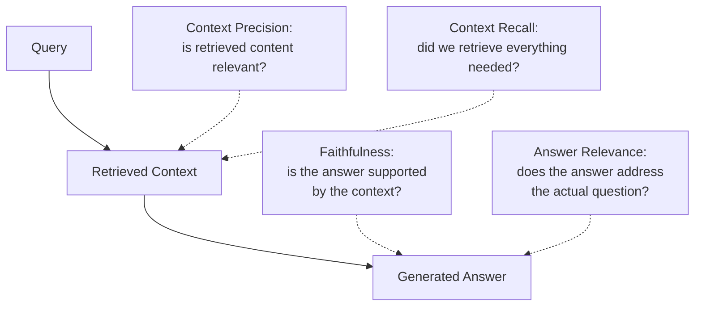

## Introduction

Chapter 65 closed with `RAGEvaluationGate._score_answer` deliberately left unimplemented, flagging that scoring a RAG answer's quality is a genuinely harder problem than the mechanically-checkable correctness criteria used elsewhere in that pipeline. This chapter completes that gate: the specific metrics RAG systems need beyond Chapter 21's general evaluation framework, and how to implement them reliably — closing out Part 11 by connecting this Part's entire architecture back to the evaluation discipline established since Chapter 21.

## Why General LLM Evaluation (Chapter 21, 75) Isn't Sufficient Alone

A RAG system has a property a standalone LLM doesn't: a **specific, retrievable ground truth** (the retrieved context) that the answer is supposed to be grounded in. This creates evaluation dimensions that don't exist for a standalone generation task — most centrally, **faithfulness**: is the generated answer actually supported by the retrieved context, or does it drift into unsupported claims (hallucination, Chapter 36) even when correct context was available? This is a meaningfully different question from "is the answer factually correct in general," and requires RAG-specific metrics to assess.

## The Four Core RAG Evaluation Metrics



**Context Precision** measures whether the retrieved chunks are actually relevant to the query — directly evaluating the retrieval stage in isolation, independent of what the LLM ultimately does with that context, echoing Chapter 65's `retrieval_recall` metric but assessing *relevance of what was retrieved* rather than *presence of the specific known-correct chunk*.

**Context Recall** measures whether the retrieval stage found *everything* needed to fully answer the query — a subtler failure mode than precision, since a system can retrieve highly relevant but *incomplete* context, producing a partially correct or overly narrow answer even though everything retrieved was individually on-topic.

**Faithfulness** measures whether the generated answer's claims are actually *supported* by the retrieved context — this is the metric that most directly targets the hallucination-despite-good-retrieval failure mode this chapter's introduction flagged, and is the metric Chapter 65's deferred `_score_answer` most centrally needs.

**Answer Relevance** measures whether the generated answer actually addresses the user's *actual question* — a subtly different concern from faithfulness: an answer can be perfectly faithful to the retrieved context (every claim supported) while still failing to actually address what the user asked, if the generation stage misinterprets the question or answers a related-but-different question instead.

## Implementing Faithfulness with an LLM-as-Judge

Directly extending Chapter 21's LLM-as-judge technique, now applied to RAG's specific faithfulness question:

```python
FAITHFULNESS_JUDGE_PROMPT = """
Given the following context and generated answer, identify each
distinct factual claim made in the answer. For each claim, determine
whether it is DIRECTLY SUPPORTED by the context, CONTRADICTED by the
context, or NOT ADDRESSED by the context at all (an unsupported claim).

Context:
{context}

Answer:
{answer}

Respond with a JSON list of claims, each labeled SUPPORTED,
CONTRADICTED, or UNSUPPORTED.
"""

def compute_faithfulness_score(context: str, answer: str, judge_llm) -> float:
    """
    A claim-level breakdown, rather than a single holistic
    judgment, following Ch. 21's discussion that decomposed,
    specific judgments are more reliable than a single, vague
    overall quality score.
    """
    judgment = judge_llm.generate(
        FAITHFULNESS_JUDGE_PROMPT.format(context=context, answer=answer)
    )
    claims = parse_json_claims(judgment)

    supported_count = sum(1 for c in claims if c["label"] == "SUPPORTED")
    return supported_count / len(claims) if claims else 1.0  # no claims = vacuously faithful
```

**Why decompose into individual claims rather than asking for a single, holistic "is this faithful" score**: this directly extends Chapter 21's finding that LLM-as-judge is more reliable when given a narrow, specific judgment to make rather than an open-ended holistic assessment — asking the judge to identify and label *each individual claim* forces a more careful, granular analysis than a single yes/no or 1-10 faithfulness rating would, and additionally provides diagnostic detail (exactly *which* claim was unsupported) rather than only a single aggregate number.

## Implementing Context Precision and Recall

```python
def compute_context_precision(query: str, retrieved_chunks: list[str], judge_llm) -> float:
    """
    Per-chunk relevance judgment — directly extends Ch. 65's binary
    "was the known-correct chunk retrieved" check into a more
    general relevance assessment applicable even without a
    pre-labeled ground-truth chunk.
    """
    relevant_count = 0
    for chunk in retrieved_chunks:
        judgment = judge_llm.generate(
            f"Query: {query}\nChunk: {chunk}\n"
            f"Is this chunk relevant to answering the query? Answer YES or NO."
        )
        if judgment.strip().upper() == "YES":
            relevant_count += 1
    return relevant_count / len(retrieved_chunks) if retrieved_chunks else 0.0


def compute_context_recall(query: str, ground_truth_answer: str,
                              retrieved_chunks: list[str], judge_llm) -> float:
    """
    Requires a ground-truth answer (or a set of known-necessary
    facts) to check against — decomposing the KNOWN CORRECT ANSWER
    into its constituent facts and checking whether each is covered
    somewhere in the retrieved context.
    """
    required_facts = extract_facts(ground_truth_answer, judge_llm)  # decompose, as with faithfulness

    combined_context = "\n".join(retrieved_chunks)
    covered_count = sum(
        1 for fact in required_facts
        if judge_llm.generate(
            f"Context: {combined_context}\nFact: {fact}\n"
            f"Is this fact supported by the context? Answer YES or NO."
        ).strip().upper() == "YES"
    )
    return covered_count / len(required_facts) if required_facts else 1.0
```

**Why context recall specifically requires a ground-truth answer, while context precision doesn't**: precision only asks "is what we retrieved relevant" — a question answerable by examining the retrieved chunks alone, relative to the query; recall asks "did we retrieve *everything needed*" — a question that fundamentally requires knowing what "everything needed" actually is, which requires an external reference (a ground-truth answer or fact set) that a live production system, without a pre-labeled test set, cannot supply for itself.

## Assembling the Complete Evaluation

```python
def evaluate_rag_response(query: str, retrieved_chunks: list[str],
                            generated_answer: str, ground_truth_answer: str,
                            judge_llm) -> dict:
    return {
        "context_precision": compute_context_precision(query, retrieved_chunks, judge_llm),
        "context_recall": compute_context_recall(query, ground_truth_answer, retrieved_chunks, judge_llm),
        "faithfulness": compute_faithfulness_score("\n".join(retrieved_chunks), generated_answer, judge_llm),
        "answer_relevance": compute_answer_relevance(query, generated_answer, judge_llm),
    }
```

This directly completes Chapter 65's `RAGEvaluationGate._score_answer` — rather than a single quality number, the gate now has four decomposed, diagnostically-specific metrics, each pointing toward a *different* pipeline stage's responsibility (precision and recall toward retrieval, Chapters 58-63; faithfulness and relevance toward generation, Chapter 60), directly enabling the stage-by-stage diagnostic discipline this Part has emphasized throughout.

## Key Takeaways

- RAG evaluation requires metrics beyond general LLM evaluation (Chapter 21) because a RAG system has a specific, retrievable ground truth (the retrieved context) the answer must be grounded in — enabling faithfulness assessment that a standalone generation task cannot support.
- Context precision (is retrieved content relevant) and context recall (was everything needed retrieved) evaluate the retrieval stage; faithfulness (is the answer supported by context) and answer relevance (does the answer address the actual question) evaluate the generation stage — each metric maps to a specific pipeline stage from Chapters 58-63.
- LLM-as-judge faithfulness scoring is more reliable when decomposed into per-claim judgments rather than a single holistic score, directly extending Chapter 21's finding that narrow, specific judgments outperform open-ended ones.
- These four metrics complete Chapter 65's deferred evaluation gate, giving each metric's result a direct diagnostic mapping back to a specific pipeline stage — closing Part 11's recurring "diagnose the specific responsible stage" discipline with a concrete, implementable measurement framework.

---

## Interview Questions

**1. Why does this chapter argue that "faithfulness" is a genuinely different question from "is the answer factually correct," and why does this distinction matter for diagnosing RAG failures?**
An answer can be FACTUALLY CORRECT (true in the real world) while still being UNFAITHFUL to the retrieved context (if the model happened to produce a correct claim using its own general, pre-trained knowledge, Chapter 36, rather than actually grounding that specific claim in the provided context) — conversely, an answer could be FAITHFUL to the retrieved context (every claim directly traceable to and supported by what was retrieved) while still being factually WRONG, if the retrieved context itself happened to contain incorrect or outdated information; this distinction matters diagnostically because a FAITHFULNESS failure specifically points toward a GENERATION-stage problem (the model isn't properly grounding its answer in the provided context, regardless of whether it happens to get lucky and produce a correct answer anyway), while a factual-correctness failure with GOOD faithfulness would instead point toward a RETRIEVAL or INGESTION-stage problem (the retrieved content itself was wrong or outdated, per Chapter 58's staleness discussion) — conflating these two genuinely different failure signatures into a single "was the answer good" judgment would obscure which specific pipeline stage (Chapter 60's diagnostic framework) is actually responsible for a given failure.
*Follow-up: Construct a specific example where an answer is FAITHFUL to its retrieved context but still FACTUALLY WRONG, and explain what this specific combination should tell an engineer to investigate.*
If the retrieved context contains an OUTDATED company policy document stating "our return window is 30 days" (when the CURRENT, correct policy has since changed to 60 days, but this update hasn't yet been reflected in the indexed corpus), and the generated answer states "our return window is 30 days" — this answer is PERFECTLY FAITHFUL (it accurately reflects what the retrieved context actually says) but FACTUALLY WRONG (relative to the current, real-world correct policy) — this specific combination (high faithfulness, but factually incorrect, as verified against an independent, current ground truth) should point an engineer's investigation directly toward Chapter 58's document-synchronization and staleness-detection discipline, rather than toward the generation stage's grounding behavior at all, since the generation stage in this example is functioning exactly as intended — the actual problem is that the retrieved source of truth itself is stale.

**2. Why does this chapter recommend decomposing faithfulness scoring into per-claim judgments rather than asking an LLM judge for a single, holistic faithfulness rating, directly extending Chapter 21's discussion?**
Chapter 21 established that LLM-as-judge evaluation is more reliable when given a NARROW, SPECIFIC judgment task rather than an open-ended, holistic one, since a broad "rate this answer's overall faithfulness from 1-10" question gives the judge model considerable, poorly-constrained latitude in how to weigh and aggregate multiple, potentially-conflicting signals (some claims well-supported, others not) into a single number, in a way that's hard to interpret consistently or reproduce reliably across different judge model runs; decomposing into PER-CLAIM judgments (this chapter's approach) instead asks the judge model to make MANY SMALL, well-defined, more objectively-checkable determinations (is THIS SPECIFIC claim supported, contradicted, or unaddressed by the context) — each individual judgment is a narrower, more tractable, and more consistently-answerable question than the aggregate holistic rating, and the resulting proportion-based score (supported claims / total claims) provides a more principled, transparent, and reproducible aggregation than asking the judge to perform this aggregation itself, implicitly and opaquely, within a single holistic rating.
*Follow-up: What ADDITIONAL diagnostic value does the per-claim decomposition provide beyond just producing a more RELIABLE aggregate score, connecting to this Part's stage-by-stage diagnostic theme?*
The per-claim decomposition provides EXPLICIT VISIBILITY into exactly WHICH specific claim(s) within a longer generated answer were unsupported, rather than only a single aggregate number that conflates a "mostly faithful, one small unsupported detail" answer with a "half faithful, several significant unsupported claims" answer into a similar-looking overall score — this claim-level detail (which specific claim was unsupported, and what the retrieved context actually said or didn't say about it) directly supports the kind of granular, stage-by-stage root-cause investigation this Part has consistently emphasized (Chapter 60's diagnostic discipline), allowing an engineer investigating a faithfulness failure to immediately see the SPECIFIC unsupported claim and reason about WHY the generation model might have produced it, rather than needing to manually re-examine the entire answer and context from scratch, armed only with a single, undifferentiated low faithfulness score.

**3. Why does this chapter argue that context recall "fundamentally requires knowing what 'everything needed' actually is," making it dependent on a ground-truth answer in a way context precision is not?**
Context precision is a RELATIVE, LOCAL judgment — for EACH individual retrieved chunk, you can assess "is this chunk topically relevant to the query" by examining just the chunk and the query together, without needing any EXTERNAL reference point beyond those two things; context recall, by contrast, is fundamentally a COMPLETENESS judgment — it asks "is there anything IMPORTANT that we FAILED to retrieve," which is logically impossible to assess by examining ONLY what WAS retrieved, since the very definition of a recall failure is the ABSENCE of something that should have been present — determining whether something is missing requires an independent, EXTERNAL specification of what SHOULD have been present (a ground-truth answer, or an explicitly labeled set of necessary facts) to compare the actual retrieved content against, which is exactly why this chapter's `compute_context_recall` function requires a `ground_truth_answer` parameter that `compute_context_precision` does not need.
*Follow-up: Why does this specific requirement (needing a ground-truth answer) make context recall systematically HARDER to measure in a live, production setting compared to context precision?*
In a LIVE production setting, real user queries generally don't come with a pre-existing, known-correct ground-truth answer already attached (unlike a controlled, offline test set specifically constructed with labeled ground truths, per Chapter 65's `RAGEvaluationGate` test query design) — this means context recall can typically only be reliably measured against a CURATED, OFFLINE test set with pre-established ground truths (exactly the kind of standing evaluation suite Chapter 65 built), rather than being computable on-the-fly for arbitrary, real, live production queries the way context precision (which needs no ground truth) potentially could be — this is a genuine, structural measurement limitation (not merely an implementation inconvenience) that means context recall's ongoing, ACTUAL production performance is generally only INFERRED from periodic, offline test-set evaluation (Chapter 65's evaluation-gate discipline) rather than directly, continuously measurable from live traffic the way some other metrics might be.

**4. How would you use this chapter's four-metric framework to diagnose a specific reported RAG failure where a user says "the answer was incomplete — it only covered part of what I asked"?**
This specific complaint — "incomplete," covering only PART of the question — points most directly toward a CONTEXT RECALL failure (this chapter's metric specifically measuring whether EVERYTHING needed to fully answer the query was actually retrieved) rather than toward faithfulness (the answer wasn't necessarily UNFAITHFUL to what was retrieved; it just may have been retrieved from an incomplete set of sources) or context precision (the retrieved content, as far as it went, may have been perfectly relevant, just insufficient in its overall coverage) — I'd specifically run this exact query (or a closely representative one) through the `compute_context_recall` evaluation (this chapter's methodology), checking whether the retrieval stage is indeed failing to surface ALL the relevant source material needed for a complete answer, which would point remediation efforts toward the RETRIEVAL configuration (perhaps needing to retrieve a LARGER number of candidates, per Chapter 63's discussion, or toward chunking strategy adjustments if relevant content is being fragmented across chunks in a way that prevents comprehensive retrieval, per Chapter 61).
*Follow-up: Why might this SAME user complaint ("the answer was incomplete") sometimes actually be better explained by an ANSWER RELEVANCE failure instead, and how would you distinguish between these two possible root causes?*
If the retrieval stage actually DID successfully retrieve ALL the necessary, complete information (a HIGH context recall score for this specific query), but the GENERATION stage failed to actually SYNTHESIZE and INCLUDE all of that available, retrieved information into its final answer (perhaps focusing narrowly on only one aspect of a multi-part question, or running into the context-budget truncation Chapter 60 and Chapter 65 discussed, dropping some retrieved content before generation even had a chance to use it) — this would actually be more accurately characterized as an ANSWER RELEVANCE failure (the answer failed to fully address the actual, complete question, per this chapter's definition), even though the user's own complaint ("incomplete") sounds superficially identical to the context-recall-failure scenario; I'd distinguish between these two possible root causes by SPECIFICALLY checking the context recall score FIRST (was everything needed actually retrieved) — a HIGH recall score combined with a low answer-relevance score would clearly point toward this second, generation-stage explanation instead, directly illustrating why this chapter's decomposed, stage-specific metrics are necessary to correctly distinguish between two superficially similar-sounding but actually root-cause-DIFFERENT user complaints.

**5. Why might a RAG system show consistently HIGH faithfulness scores but consistently LOW answer relevance scores, and what would this specific combination suggest about where the problem lies?**
A system could achieve HIGH faithfulness (every claim in its answers is genuinely well-supported by the retrieved context) while still achieving LOW answer relevance if the GENERATION stage is consistently answering a slightly DIFFERENT question than what the user actually asked — for example, if the system retrieves genuinely relevant, on-topic content but the generation prompt or model tends to summarize or restate the RETRIEVED CONTENT'S general content rather than specifically and directly addressing the user's PRECISE question — this specific combination (high faithfulness, low relevance) suggests the underlying RETRIEVAL is likely functioning reasonably well (since faithfulness is only measurable relative to whatever WAS retrieved, and high faithfulness confirms the model IS using that retrieved content honestly), but the GENERATION/PROMPTING logic (Chapter 43's prompt engineering, or the system prompt's specific instructions) needs adjustment to more directly and specifically address the user's actual question, rather than the retrieval pipeline (Chapters 58-63) needing further investigation.
*Follow-up: What specific prompt engineering change (connecting to Chapter 43) would you propose to address this specific "high faithfulness, low relevance" failure pattern?*
I'd revise the generation system prompt (Chapter 60's grounding prompt, extended per Chapter 43's prompt engineering discipline) to more explicitly instruct the model to directly and specifically address each distinct part of the user's actual question, rather than simply summarizing or synthesizing the general content of the retrieved context — potentially adding an explicit instruction like "ensure your answer directly and specifically addresses every part of the user's question, rather than providing a general summary of the provided context" — and I'd then re-run this chapter's answer-relevance evaluation specifically to confirm this prompt revision measurably improves relevance scores WITHOUT degrading the already-good faithfulness scores (following this series' consistent "verify a targeted fix improves the specific diagnosed metric without regressing others" discipline, directly extending Chapter 65's evaluation-gate methodology to this specific prompt-tuning iteration).

**6. In an interview, if asked "how would you know if your company's RAG-based customer support bot is hallucinating," how would you use this chapter's faithfulness metric to give a precise, technical answer rather than a vague one?**
I'd explain that "hallucinating" specifically corresponds to this chapter's FAITHFULNESS metric — I'd implement an LLM-as-judge faithfulness evaluation (this chapter's `compute_faithfulness_score` methodology) that decomposes each generated answer into its individual factual claims and checks whether each claim is actually SUPPORTED by the specific context that was retrieved and provided to the model for that specific query, running this evaluation both as a standing, pre-deployment gate (Chapter 65's `RAGEvaluationGate`) against a curated test set, AND, ideally, as an ongoing, sampled evaluation against a portion of LIVE production traffic (extending Chapter 33's observability discipline to this specific RAG-quality dimension) — this gives a PRECISE, QUANTIFIED, and ONGOING answer to "is our bot hallucinating" (a measured faithfulness score, tracked over time and by query segment) rather than only a vague, anecdotal impression based on occasional, unsystematic manual spot-checks of individual conversations.
*Follow-up: Why might faithfulness alone NOT be a sufficient metric to fully answer "is our bot hallucinating," even though it's the most directly relevant metric this chapter provides?*
Faithfulness specifically measures whether the answer is grounded in WHATEVER context was actually retrieved — but if the retrieval stage itself failed to retrieve the genuinely relevant context in the first place (a context precision or recall failure, this chapter's other two retrieval-focused metrics), the model might produce an answer that's technically "faithful" to an irrelevant or incomplete context while still being effectively unhelpful or misleading from the user's actual perspective, even though this specific failure mode isn't technically "hallucination" in the strict sense faithfulness measures — a genuinely complete answer to "is our bot hallucinating" (in the broader, colloquial sense of "producing bad, misleading, or unhelpful responses") requires considering faithfulness ALONGSIDE the other three metrics (context precision, context recall, answer relevance) this chapter established, since a poor user experience can stem from ANY of these four distinct failure modes, not exclusively from a strict faithfulness violation alone.

**7. Why might using the SAME LLM for both generation and as the judge (in this chapter's LLM-as-judge implementations) introduce a specific risk, connecting to Chapter 21's broader LLM-as-judge discussion?**
If the SAME underlying LLM model (or a very similar model from the same provider/family) is used both to GENERATE the RAG system's answers AND to JUDGE those same answers' faithfulness or relevance, there's a risk that the judge model shares the SAME systematic biases, blind spots, or characteristic error patterns as the generation model — meaning the judge might be SYSTEMATICALLY MORE LIKELY to rate an answer as faithful or relevant specifically BECAUSE it shares the same underlying reasoning patterns or knowledge gaps that led the generation model to produce that answer in the first place, potentially producing an artificially INFLATED, overly-generous quality assessment that wouldn't be caught by a genuinely independent, differently-biased evaluator — this directly echoes Chapter 21's general caution about LLM-as-judge reliability and the value of validating judge outputs against human judgment on a representative sample.
*Follow-up: What specific mitigation would you recommend to address this shared-bias risk, beyond simply using a completely different model as the judge?*
Beyond using a genuinely DIFFERENT model (ideally from a different provider or training lineage than the generation model, minimizing the likelihood of shared systematic biases) as the judge, I'd recommend periodically validating the JUDGE model's own assessments against a smaller sample of actual HUMAN evaluation (directly following Chapter 21's core validation discipline for any LLM-as-judge system) — specifically checking whether the judge's faithfulness and relevance scores CORRELATE well with human judgments on a representative sample, and specifically watching for any SYSTEMATIC pattern where the judge appears to be more lenient on FAILURE MODES that a shared-bias hypothesis would predict (e.g., checking whether the judge is unusually forgiving of subtle, sophisticated-sounding but actually unsupported claims — a failure mode a similarly-capable generation model might be especially prone to producing convincingly) — this kind of targeted, hypothesis-driven validation provides more confidence than a generic, un-targeted human-correlation check alone.

**8. How would you extend this chapter's evaluation framework to specifically validate the retrieval-necessity gate from Chapter 65, given that this chapter's four core metrics all assume retrieval has already occurred?**
I'd need an ADDITIONAL, FIFTH evaluation dimension specifically for the retrieval-necessity gate's own accuracy (distinct from this chapter's four metrics, which all specifically evaluate the QUALITY of retrieval and generation GIVEN that retrieval occurred) — constructing a labeled test set specifically containing BOTH queries that genuinely NEED retrieval and queries that genuinely DON'T, and measuring the gate's classification accuracy against these known labels (directly extending Chapter 65's earlier discussion of validating the `RetrievalGate` classifier's own accuracy, with particular attention to its false-negative rate) — this represents a GENUINELY separate evaluation concern from this chapter's four core metrics, since the gate's decision happens BEFORE and INDEPENDENTLY of the retrieval-and-generation process this chapter's metrics are designed to assess, requiring its own, distinctly-scoped test set and success criteria rather than being folded into or conflated with this chapter's retrieval-and-generation-quality-focused metrics.
*Follow-up: Why might it be important to track this gate-accuracy metric SEPARATELY, rather than simply observing that "overall answer quality is good" and inferring the gate must therefore be working correctly?*
A system where the gate FREQUENTLY, INCORRECTLY skips retrieval for queries that actually needed it could still show reasonably good AGGREGATE "overall answer quality" metrics if the generation model's own general, pre-trained knowledge (Chapter 36) happens to produce plausible-sounding, superficially reasonable answers for many of these incorrectly-skipped queries anyway — this kind of AGGREGATE, un-decomposed "overall quality looks fine" observation could mask a genuinely problematic gate-accuracy issue that's specifically affecting a smaller SUBSET of queries (those that actually needed but didn't receive retrieval), directly illustrating this Part's and this series' consistent theme (Chapter 6's subgroup-analysis discipline) that AGGREGATE metrics can obscure meaningful, consequential subgroup-specific failures, reinforcing why the gate's own, SEPARATE, specifically-scoped accuracy metric needs to be tracked and monitored independently, rather than assumed to be fine purely on the basis of generally acceptable aggregate answer-quality numbers.

**9. Why might a company need DIFFERENT quality thresholds (for faithfulness, context precision/recall, and answer relevance) for DIFFERENT specific use cases within the same overall RAG platform, rather than a single, universal quality bar across the entire platform?**
Directly echoing this series' consistent "the appropriate configuration/threshold depends on the specific application's actual requirements and risk tolerance" principle (Chapter 21's cost-asymmetric threshold-setting discussion, Chapter 59's `n_probe` tuning, and numerous other prior examples) — a RAG application in a HIGH-STAKES domain (medical, legal, financial guidance) would reasonably require a MUCH higher faithfulness threshold (near-zero tolerance for unsupported claims, given the potentially serious real-world consequences of a confidently-stated but ungrounded claim in these domains) than a LOWER-STAKES application (a general internal FAQ bot for casual, low-consequence employee questions, where an occasional minor faithfulness lapse has comparatively limited real-world consequence) — enforcing a single, universal quality threshold across BOTH of these genuinely different-risk use cases would either be UNNECESSARILY restrictive and costly for the lower-stakes application (potentially blocking otherwise-acceptable deployments over an overly strict bar not actually justified by that application's genuine risk profile) or DANGEROUSLY insufficient for the higher-stakes application (allowing deployments that don't meet the genuinely higher bar that domain's real consequences actually demand).
*Follow-up: How would you determine an appropriate, specific faithfulness threshold for a NEW, higher-stakes RAG application being launched for the first time, given no prior baseline to compare against?*
I'd start by explicitly articulating the SPECIFIC real-world consequence of a faithfulness failure for this particular application (following Chapter 21's cost-asymmetric threshold-setting methodology, now applied specifically to faithfulness) — for a medical-information RAG application, an unsupported, hallucinated claim could directly lead to real patient harm, which is a MUCH more severe consequence than a similar failure in a low-stakes internal tool — I'd use this severity assessment to set an appropriately CONSERVATIVE (high) faithfulness threshold reflecting this severity, and I'd specifically validate this initial threshold choice through careful HUMAN review (not solely automated LLM-as-judge scoring, given the high stakes involved) of a representative sample of the system's actual outputs BEFORE launch, adjusting the threshold based on this human-validated assessment of whether the automated faithfulness scoring at this threshold level genuinely captures an ACCEPTABLE, sufficiently low real-world risk level for this SPECIFIC, high-stakes application — treating this as a genuinely deliberate, evidence-and-consequence-informed threshold-setting exercise rather than defaulting to a generic, one-size-fits-all faithfulness bar.

**10. How would you handle a situation where this chapter's context-recall metric shows persistently LOW scores for a specific category of queries, even after trying several different chunking and retrieval configuration adjustments (Chapters 61-63)?**
I'd consider whether the underlying CORPUS itself might genuinely LACK the necessary information to fully answer these specific queries in the first place — a persistently low context-recall score, DESPITE multiple genuine attempts at chunking and retrieval configuration improvement, could indicate the problem isn't actually a RETRIEVAL configuration issue at all (which Chapters 61-63's adjustments specifically target), but rather a genuine CONTENT GAP in the underlying knowledge base — the source documents needed to fully and completely answer this specific category of queries may simply not exist in the indexed corpus at all, meaning no amount of retrieval or chunking optimization could possibly improve context recall for these specific queries, since there's nothing more complete to actually retrieve — this diagnostic conclusion would redirect remediation effort AWAY from further retrieval-pipeline tuning and TOWARD identifying and addressing this specific CONTENT gap (adding the missing source documentation to the corpus in the first place), a fundamentally different kind of remediation than any of Chapters 61-63's pipeline-configuration techniques could ever provide.
*Follow-up: How would you definitively confirm this "content gap" hypothesis, distinguishing it from a more subtle retrieval configuration issue that simply hasn't yet been correctly identified and fixed?*
I'd conduct a MANUAL, exhaustive review of the ENTIRE indexed corpus (or a targeted, representative subset most likely to be relevant) specifically searching for whether the information needed to answer this specific category of queries EXISTS ANYWHERE in the corpus at all, independent of any automated retrieval mechanism — if this manual, exhaustive review confirms the necessary information genuinely doesn't exist anywhere in the current corpus, this definitively confirms the content-gap hypothesis (since no retrieval mechanism, however well-tuned, can retrieve content that was never indexed in the first place); if this manual review DOES find the necessary information somewhere in the corpus, this would instead point back toward a genuine, still-unresolved retrieval configuration issue (perhaps an unusual chunking or embedding-matching edge case specific to this content), directing further investigation back toward Chapters 58-63's techniques rather than toward corpus content-gap remediation — this kind of definitive, manual verification is necessary specifically because context recall's automated measurement (this chapter's methodology) cannot, on its own, distinguish between "the content doesn't exist" and "the content exists but our retrieval consistently fails to find it" without this kind of independent, manual confirmation.

**11. How would you use this chapter's evaluation framework to design a regression test SPECIFICALLY for a chunking strategy change (Chapter 61), following this Part's consistent "test the whole system after any component change" discipline?**
I'd run this chapter's FULL four-metric evaluation suite (context precision, context recall, faithfulness, answer relevance) against the SAME standing test query set, comparing results WITH the OLD chunking strategy versus WITH the NEW, proposed chunking strategy — specifically watching for whether context precision or recall show any REGRESSION (since chunking most directly affects what content is available to be retrieved in the first place, per Chapter 61's core argument) as the PRIMARY signal to investigate, while also confirming faithfulness and answer relevance remain stable or improve (since a chunking change could indirectly affect these DOWNSTREAM metrics too, if, for example, the new chunking strategy produces differently-sized chunks that affect how well the generation stage can use the retrieved content, per Chapter 65's earlier discussion of this specific interaction) — this comprehensive, multi-metric before-and-after comparison directly extends Chapter 48's and Chapter 60's "test the WHOLE system, not just the directly-changed component" regression-testing discipline to this specific chunking-strategy-change scenario, using this chapter's now-complete four-metric framework as the concrete, implementable measurement tool for that broader testing discipline.
*Follow-up: If this comparison showed IMPROVED context recall but DEGRADED faithfulness after the chunking change, what specific hypothesis would you investigate first?*
I'd hypothesize that the new chunking strategy might be producing LARGER chunks (improving recall by capturing more complete information within each chunk, reducing the risk of splitting necessary information across multiple chunks, per Chapter 61's core trade-off) but that these larger chunks might be introducing MORE extraneous, less-precisely-relevant content alongside the genuinely necessary information — potentially making it HARDER for the generation stage to correctly identify and cite ONLY the specific, actually-relevant portions when constructing its answer, inadvertently increasing the risk of the model drawing on or blending in content from the less-relevant portions of these now-larger chunks in a way that produces less-faithful claims — I'd specifically investigate this hypothesis by examining the actual FAITHFULNESS JUDGE'S specific claim-level breakdowns (this chapter's per-claim decomposition) for the affected test queries, checking whether the newly-unsupported claims correlate with content drawn from the LARGER, less-precisely-scoped chunks the new chunking strategy introduced, directly connecting this chapter's diagnostic detail back to Chapter 61's original chunk-size trade-off discussion.

**12. How would you use this chapter's material to push back on a claim that "since our RAG system's answers all sound confident and well-written, it must be working well"?**
I'd directly point out that CONFIDENT, WELL-WRITTEN PROSE is a property of the underlying LLM's general language generation CAPABILITY (Part 8's foundational LLM capabilities), which is ENTIRELY INDEPENDENT of whether that confidently-written answer is actually FAITHFUL to the retrieved context, RELEVANT to the actual question asked, or built upon sufficiently PRECISE and COMPLETE retrieved context — a well-trained, capable LLM can produce fluent, confident-sounding, superficially convincing prose regardless of whether its underlying claims are actually well-grounded (this is, in fact, PRECISELY the mechanism behind hallucination, per Chapter 36's original discussion — hallucinated content is typically JUST AS fluent and confident-sounding as accurate content) — "sounds confident and well-written" provides ESSENTIALLY NO SIGNAL about this chapter's four actually-relevant quality dimensions, and I'd recommend implementing this chapter's specific, decomposed evaluation metrics as the only reliable way to actually assess whether the system is genuinely working well, rather than relying on this kind of superficial, appearance-based impression that could just as easily describe a subtly (or severely) flawed system as a genuinely well-functioning one.
*Follow-up: What specific, concrete demonstration would you use to make this point vivid and memorable for a stakeholder who's skeptical of this distinction?*
I'd construct a deliberately adversarial demonstration — deliberately feeding the system a query where the retrieved context is either irrelevant or insufficient, and showing the stakeholder that the system STILL produces a confident, fluent, well-written-SOUNDING answer (likely by drawing on the underlying LLM's own general pre-trained knowledge, unfaithful to the actually-provided context) — this direct, concrete, side-by-side demonstration (a confidently-stated but demonstrably ungrounded answer, produced under conditions I've deliberately engineered to isolate this specific failure mode) makes the "confident prose doesn't imply correctness or faithfulness" point far more vivid, memorable, and persuasive for a skeptical stakeholder than any amount of abstract, theoretical explanation alone, directly following this series' consistent preference for concrete, demonstrated evidence over purely theoretical argument when making an important, potentially counterintuitive point about system quality and reliability.

**13. How would you use this chapter's material to explain why "RAG evaluation" deserves its own dedicated chapter (this one) rather than being fully covered by Chapter 21's general LLM evaluation discussion alone?**
Chapter 21 established GENERAL LLM evaluation principles (LLM-as-judge methodology, the value of narrow versus holistic judgments, offline versus online evaluation) that apply broadly to ANY LLM-based system, but RAG systems have a SPECIFIC, ADDITIONAL structural property — the existence of a distinct, separately-inspectable RETRIEVED CONTEXT that the generation is supposed to be grounded in — that GENERAL LLM evaluation frameworks, designed for standalone generation tasks without this specific retrieval-context structure, have no natural mechanism to specifically assess (there's no general-purpose equivalent to "faithfulness to a specific, separately-identified context" for a standalone LLM task that has no such separate context to be faithful to in the first place) — this chapter's four metrics (context precision, context recall, faithfulness, answer relevance) are SPECIFICALLY DESIGNED to exploit and evaluate THIS particular structural property unique to RAG systems, representing a genuine, RAG-SPECIFIC extension of Chapter 21's general evaluation principles rather than being redundant with or fully subsumed by that earlier, more general chapter's content.
*Follow-up: Why might this same "the specific system architecture demands its own specific evaluation metrics" principle apply equally well to Chapter 64's advanced RAG patterns (multi-hop, GraphRAG), suggesting these patterns might need THEIR OWN further evaluation extensions beyond even this chapter's four metrics?*
Just as RAG's specific retrieval-context structure motivated THIS chapter's specific metrics beyond Chapter 21's general framework, Chapter 64's advanced patterns each introduce THEIR OWN additional specific structural properties that this chapter's four metrics don't fully capture — multi-hop retrieval's SEQUENTIAL, dependency-based structure would benefit from a metric specifically assessing whether EACH INDIVIDUAL HOP's intermediate retrieval was correct and necessary (not just the FINAL answer's overall faithfulness and relevance, this chapter's metrics), and GraphRAG's explicit RELATIONSHIP-TRAVERSAL structure would benefit from a metric specifically assessing whether the TRAVERSED RELATIONSHIPS were actually correct and relevant (a genuinely different kind of correctness than this chapter's content-relevance-focused context precision/recall metrics were designed to assess) — this reinforces a GENERALIZABLE evaluation-design principle this chapter's own existence demonstrates: each additional layer of architectural sophistication (Chapter 21's general LLM evaluation, extended by this chapter's RAG-specific metrics, potentially further extended by pattern-specific metrics for Chapter 64's advanced architectures) tends to introduce its own genuinely NEW structural properties that may warrant their OWN correspondingly specific, tailored evaluation extensions, rather than assuming a more general evaluation framework automatically and fully covers every more specific and sophisticated architecture built on top of it.

**14. How would you summarize, for someone reviewing this entire Part (58-66) as a whole, the single most important recurring principle that ties every chapter together?**
The single most consistently recurring principle across this entire Part is that RAG SYSTEM QUALITY IS DETERMINED BY THE WEAKEST STAGE IN A MULTI-STAGE PIPELINE, and correctly diagnosing and improving a RAG system REQUIRES the ability to isolate and separately assess EACH INDIVIDUAL STAGE'S contribution — Chapter 58 established retrieval quality as a hard ceiling on overall quality; Chapter 60 decomposed the pipeline into ingestion, retrieval, augmentation, and generation stages, each with distinct failure modes; Chapters 61-63 each addressed a SPECIFIC stage-level improvement (chunking, hybrid search, re-ranking); Chapter 64 introduced more advanced ARCHITECTURAL patterns still requiring this same stage-aware diagnostic discipline; Chapter 65 assembled these stages into a concrete, modular, independently-testable pipeline; and THIS chapter (66) completed the loop by providing the SPECIFIC, DECOMPOSED METRICS (mapped explicitly back to specific pipeline stages) needed to actually MEASURE and DIAGNOSE which stage is responsible for any given quality issue — this "decompose into stages, diagnose the SPECIFIC responsible stage, remediate that stage specifically" discipline is the throughline connecting every single chapter in this Part.
*Follow-up: How does this Part's throughline connect to and extend the broader diagnostic discipline this ENTIRE 96-chapter series has emphasized since its earliest chapters?*
This Part's stage-by-stage diagnostic discipline for RAG systems specifically is a direct, focused APPLICATION of the SAME general "correctly diagnose the SPECIFIC responsible cause before remediating" principle this series has applied consistently across every prior Part — Chapter 32's drift-versus-skew diagnosis, Chapter 48's forgetting-versus-data-quality diagnosis, Chapter 44's knowledge-gap-versus-behavior-gap diagnosis, and Chapter 58's own retrieval-versus-generation diagnosis (which this Part then progressively refined into the even MORE granular, stage-specific diagnostic framework this chapter's four metrics now fully operationalize) — recognizing this Part's RAG-specific diagnostic discipline as simply the LATEST, most fully-developed instance of this SAME underlying principle, rather than as an entirely new or unrelated idea specific to RAG alone, is exactly the kind of cross-Part pattern recognition this series has consistently aimed to build, and sets up a reader well for Part 12's Agentic AI Systems, where this same "decompose into stages/components, diagnose the specific responsible one" discipline will very likely need to be applied yet again to that Part's own, different but structurally analogous multi-component architectures.

**15. How would you summarize, for someone moving on to Part 12's Agentic AI Systems, why this entire Part's RAG and retrieval material is directly relevant to understanding agentic systems, even though Part 12 covers a nominally different topic?**
Many agentic AI systems (Part 12's upcoming topic) use RAG as ONE of their core tools or capabilities — an agent reasoning through a multi-step task will very often need to RETRIEVE information from a knowledge base as ONE of the actions available to it (directly analogous to Chapter 64's multi-hop retrieval pattern, but now orchestrated by a more general-purpose agentic reasoning loop rather than a RAG-specific hop-by-hop process) — meaning this ENTIRE Part's material (vector databases, chunking, hybrid search, re-ranking, and especially Chapter 64's multi-hop and Self-RAG patterns, and this chapter's evaluation framework) doesn't become obsolete or separate once Part 12 begins, but instead becomes a DIRECTLY REUSABLE COMPONENT that Part 12's agentic architectures will very likely incorporate and build upon, much the way Part 10's LLM serving infrastructure remained directly relevant and necessary throughout this entire Part's RAG-focused discussion (every RAG system's generation stage, after all, still depends entirely on Part 10's serving infrastructure).
*Follow-up: What specific ARCHITECTURAL similarity between Chapter 64's multi-hop retrieval pattern and a general agentic reasoning loop (Part 12's core topic) would you expect to be the most direct, immediately-recognizable connection?*
Chapter 64's multi-hop retrieval pattern — where the LLM reasons over the current state, decides whether it has sufficient information, and if not, decides what SPECIFIC ACTION (a follow-up retrieval query) to take next, repeating this loop until sufficient information is gathered — is STRUCTURALLY IDENTICAL to a general agentic reasoning loop's core pattern (often called "ReAct," reason-then-act, a term Part 12 will likely introduce formally), where an agent reasons over its current state, decides whether its goal is achieved, and if not, decides what SPECIFIC ACTION (which could be a retrieval query, but could equally be a different tool call, an API request, or another action type entirely) to take next, repeating until the goal is achieved — recognizing Chapter 64's multi-hop retrieval as ESSENTIALLY a SPECIAL CASE of this more general agentic reasoning pattern (where the only available "action" happens to be "retrieve information") provides an immediately-recognizable, concrete bridge from this Part's specific RAG-focused content directly into Part 12's more general agentic systems discussion, exactly the kind of pattern-level connection-making this series has consistently aimed to equip its readers to make on their own.
