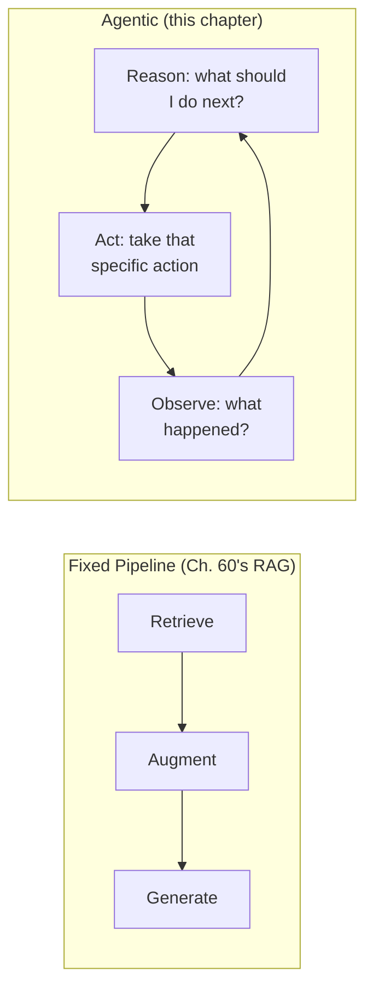
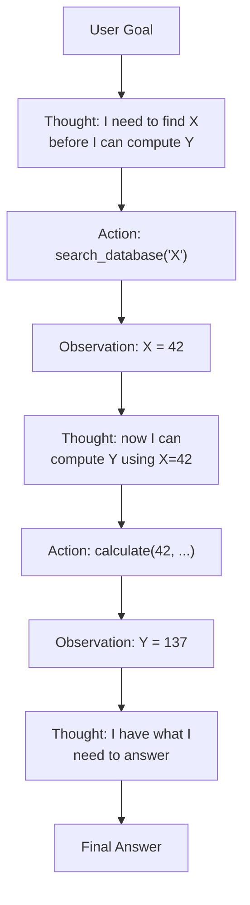

## Introduction

Chapter 66 closed by observing that Chapter 64's multi-hop retrieval loop is structurally identical to a general agentic reasoning loop — the same reason, decide, act, repeat pattern, just with retrieval as the only available action. This chapter makes that connection explicit and formal: what "agentic" actually means as a system design category, the **ReAct** (Reason + Act) pattern that underlies nearly every agent architecture in production today, and why this Part's material, while nominally new, is best understood as a generalization of patterns this series has already built.

## What Makes a System "Agentic"

A system is agentic when it can **decide its own sequence of actions** to accomplish a goal, rather than following a fixed, pre-determined pipeline. Contrast this directly with the RAG pipeline from Chapter 60: that pipeline follows a fixed sequence — retrieve, augment, generate — decided in advance by the system designer, regardless of the specific query. An agent, by contrast, decides *at runtime*, based on the specific task and what it's learned so far, *which actions to take and in what order* — it might retrieve, then decide it needs to run a calculation, then decide it needs to send an email, then decide it's done — with the *sequence itself* being an output of the model's own reasoning, not a fixed architecture.



This is a direct generalization of Chapter 64's multi-hop retrieval loop — that loop's only available "action" was "issue another retrieval query." An agent's action space is broader: any **tool** (Chapter 68 will formalize this) it has access to, with retrieval being just one specific tool among potentially many.

## The ReAct Pattern

**ReAct** (Reasoning + Acting) is the foundational pattern underlying most production agent architectures: the model alternates between generating a **reasoning trace** (explicit, visible thoughts about what to do next and why) and taking an **action** (invoking a tool), observing the **result**, and feeding that observation back into the next reasoning step.



```python
def react_loop(goal: str, available_tools: dict, llm_client, max_steps: int = 10) -> str:
    """
    The core ReAct loop — directly generalizing Ch. 64's multi-hop
    retrieval loop's structure (reason, act, observe, repeat) to an
    arbitrary set of tools rather than retrieval alone.
    """
    trajectory = [f"Goal: {goal}"]

    for step in range(max_steps):
        # THOUGHT: the model reasons about what to do next, given
        # everything observed so far — this reasoning is itself
        # generated text, made VISIBLE and inspectable (Ch. 24's
        # explainability theme, now built into the architecture
        # itself rather than added after the fact).
        response = llm_client.generate(
            prompt=build_react_prompt(trajectory, available_tools)
        )
        thought, action, action_input = parse_react_response(response)
        trajectory.append(f"Thought: {thought}")

        if action == "Final Answer":
            return action_input

        # ACT: invoke the chosen tool (Ch. 68 formalizes this interface)
        observation = available_tools[action].execute(action_input)
        trajectory.append(f"Action: {action}({action_input})")
        trajectory.append(f"Observation: {observation}")

    return "Unable to complete within step limit."  # Ch. 64's max_hops
                                                        # safety bound,
                                                        # generalized
```

**Why the reasoning trace is generated explicitly, as visible text, rather than left implicit**: this directly extends Chapter 24's explainability discussion — an explicit "Thought:" step, generated as part of the model's output rather than hidden inside its internal activations, makes the agent's decision process inspectable and debuggable (why did it choose this tool? what did it believe at this point?), which is essential for the same reasons Chapter 60's stage-by-stage diagnostic discipline was essential for RAG systems, now applied to a system whose "stages" aren't fixed in advance but are chosen dynamically at runtime.

## Why This Requires Careful Prompt Engineering (Chapter 43, Generalized)

The `build_react_prompt` function needs to communicate to the model: what tools are available, their exact input formats, the expected output format (so `parse_react_response` can reliably extract the thought, action, and action input), and the trajectory so far. This is Chapter 43's prompt engineering discipline, now applied to a much higher-stakes context — a malformed or ambiguous tool-use prompt doesn't just produce a slightly-off answer (Chapter 43's original concern); it can produce an **unparseable response**, breaking the entire loop, or a **malformed tool call**, potentially invoking a real-world action incorrectly.

```python
REACT_PROMPT_TEMPLATE = """
You have access to the following tools:
{tool_descriptions}

Use this exact format:
Thought: <your reasoning about what to do next>
Action: <tool name, or "Final Answer">
Action Input: <input to the tool, or your final answer>

Trajectory so far:
{trajectory}
"""
```

## Why Agentic Systems Amplify Every Prior Chapter's Risk

An agent that can only *retrieve and generate text* (Chapter 60's RAG) has a bounded failure mode: a bad answer. An agent with access to tools that **take real-world action** (sending emails, modifying records, executing code, making purchases) has an **unbounded** failure mode — a reasoning error doesn't just produce bad text, it produces a bad *action*, directly connecting to Chapter 36's hallucination discussion and Chapter 74's upcoming prompt injection and adversarial attack material. This single fact — that agentic systems convert LLM reasoning errors into real-world side effects — is the central reason this entire Part treats safety, tool-use validation, and human-in-the-loop patterns as first-class architectural concerns rather than afterthoughts, a theme every subsequent chapter in this Part will return to.

## Key Takeaways

- An agentic system decides its own sequence of actions at runtime based on reasoning about the specific task, in contrast to a fixed pipeline (like Chapter 60's RAG architecture) whose stage sequence is determined in advance by the system designer.
- ReAct alternates between an explicit, visible reasoning step (Thought), an action (invoking a tool), and an observation (the tool's result) fed back into the next reasoning step — directly generalizing Chapter 64's multi-hop retrieval loop from a single tool (retrieval) to an arbitrary tool set.
- Making the reasoning trace explicit and visible text (rather than implicit in the model's internal activations) directly extends Chapter 24's explainability discipline, enabling the same stage-by-stage diagnostic approach this series has applied throughout, now applied to a dynamically-determined action sequence.
- Because agentic systems can take real-world action through tools, a reasoning error converts into a real-world side effect rather than merely a bad piece of text — this unbounded failure mode is why safety and validation are first-class concerns throughout this entire Part, not an afterthought.

---

## Interview Questions

**1. Why does this chapter define "agentic" specifically in terms of the system deciding its OWN action sequence at runtime, rather than simply "a system that uses an LLM to accomplish a task"?**
The BROADER definition ("uses an LLM to accomplish a task") would classify even Chapter 60's fixed-sequence RAG pipeline as "agentic," since it does use an LLM to accomplish the task of answering a question — but this obscures the SPECIFIC, MEANINGFUL architectural distinction this chapter is drawing: RAG's retrieve-then-generate SEQUENCE is fixed by the system designer in advance, regardless of the specific query, while an agentic system's sequence of actions is DETERMINED BY THE MODEL'S OWN REASONING, at runtime, specifically FOR that particular task, and can DIFFER meaningfully from one task to the next (a simple query might resolve in one tool call; a complex one might require ten, in an order the designer never explicitly specified) — this narrower, more precise definition is what actually explains the DISTINCT engineering challenges this Part addresses (unbounded action sequences, tool selection reasoning, real-world side effects), which a broader "uses an LLM" definition would fail to usefully distinguish from the fixed-pipeline architectures this series has already covered extensively in Part 11.
*Follow-up: Under this chapter's definition, would Chapter 64's multi-hop retrieval pattern itself count as "agentic," or does it remain a fixed pipeline?*
Chapter 64's multi-hop retrieval pattern sits right at this definitional boundary — it DOES involve the model deciding, at runtime, WHETHER another retrieval hop is needed and WHAT to search for next (a genuine, runtime, model-driven decision, per this chapter's core criterion), but its ACTION SPACE is constrained to a SINGLE tool type (retrieval) rather than an open set of arbitrary tools — this makes it reasonable to describe multi-hop retrieval as a NARROW, SPECIAL CASE of agentic behavior (a "single-tool agent," in effect) rather than either a fully fixed pipeline or a fully general agentic system, directly illustrating why this chapter frames it as a natural BRIDGE or PRECURSOR to this Part's broader agentic material rather than as something categorically separate from it.

**2. Explain why the ReAct pattern's explicit "Thought" step is described as extending Chapter 24's explainability discipline, rather than merely being a stylistic or formatting choice.**
Chapter 24 established that explainability techniques generally work by producing some ADDITIONAL, INTERPRETABLE artifact that reveals something about a model's internal decision process, which is otherwise opaque (a black box) — ReAct's explicit "Thought:" step is exactly this kind of artifact, but built directly INTO the architecture itself (generated as part of the model's own output, on every single decision point) rather than added as a SEPARATE, post-hoc explainability technique (like Chapter 24's feature-attribution methods applied after a decision has already been made) — this means an agent's decision-making process is inspectable BY DESIGN and BY DEFAULT, for every single action it takes, providing a continuously-available diagnostic trace rather than requiring a separate, deliberately-invoked explainability technique to be applied after the fact — this architectural choice to make reasoning explicit is a genuinely different and more foundational approach to explainability than the techniques Chapter 24 covered, one that's only possible because the "model" here is a generative LLM capable of producing this kind of natural-language reasoning trace as a first-class part of its own output.
*Follow-up: What's a genuine risk of relying on this explicit "Thought" text as a fully faithful and complete representation of the model's ACTUAL underlying reasoning process, connecting to any caveats this series has raised about model interpretability?*
There's no guarantee that the model's GENERATED "Thought" text actually and completely reflects its TRUE underlying computational process that led to the subsequent action — the model could, in principle, generate a plausible-sounding, post-hoc-rationalizing "Thought" that doesn't accurately describe why it ACTUALLY chose that specific action (a concern directly analogous to broader interpretability caveats this series would apply to any generated explanation of a model's own behavior) — this means the "Thought" trace, while genuinely useful for DEBUGGING and building general confidence in the agent's behavior, should not be treated as a PERFECT, GUARANTEED-FAITHFUL window into the model's true internal reasoning, and a system designer should still validate agent behavior through OUTCOME-based testing (does the agent actually accomplish the task correctly and safely, per this Part's upcoming evaluation discussion) rather than relying SOLELY on the reasonableness of its generated Thought text as sufficient evidence of correct underlying reasoning.

**3. Why does this chapter argue that a malformed tool-use prompt in an agentic system is a "much higher-stakes" failure than a similarly malformed prompt in Chapter 43's original prompting context?**
In Chapter 43's original prompting context, a poorly-engineered prompt typically produces a suboptimal but still generally HARMLESS output — slightly worse phrasing, a less helpful answer, or a format that doesn't quite match what was requested, all of which are BOUNDED, TEXT-ONLY failures with limited real-world consequence; in this chapter's agentic context, a malformed prompt can cause the model to generate an UNPARSEABLE response (breaking the `parse_react_response` step and halting the entire loop, a functional failure) or, more seriously, a MALFORMED TOOL CALL that still successfully parses but specifies incorrect parameters — if that tool actually performs a REAL-WORLD ACTION (as this chapter's closing section discusses), this malformed call could execute an incorrect real-world action (sending a wrong email, deleting the wrong record) rather than merely producing bad text, directly illustrating why the SAME category of engineering mistake (imprecise prompt engineering) carries a qualitatively more severe potential consequence once it's connected to real-world tool execution rather than remaining purely within the bounded domain of generated text.
*Follow-up: What specific engineering practice would you recommend to mitigate this specific risk, beyond simply "writing a more careful prompt"?*
I'd recommend implementing STRICT, SCHEMA-VALIDATED parsing and parameter checking for every tool call BEFORE it's actually executed (directly connecting to Chapter 79's upcoming structured-output/function-calling-schema discussion) — validating that a proposed tool call's parameters match the tool's expected types, required fields, and any domain-specific constraints (e.g., an email tool's "recipient" field should be validated as an actual, well-formed email address before the tool executes) — rejecting and requesting a corrected tool call (rather than executing a malformed one) if this validation fails, providing a genuine SAFETY CHECKPOINT between the model's generated intention and its actual real-world execution, rather than relying purely on prompt engineering quality alone (which, per this chapter's own argument, cannot be perfectly guaranteed) to prevent this class of error.

**4. How would you use this chapter's ReAct loop code to explain why `max_steps` serves the exact same architectural purpose as Chapter 64's `max_hops` parameter, and why both are necessary for the same underlying reason?**
Both parameters serve as an explicit, bounded SAFETY LIMIT on an otherwise potentially UNBOUNDED iterative loop — Chapter 64's multi-hop retrieval loop could, without `max_hops`, continue indefinitely if the model's own "do we have sufficient information" determination never confidently concludes the process is complete; this chapter's ReAct loop faces the EXACT SAME underlying risk — without `max_steps`, an agent that never generates "Final Answer" as its chosen action (due to a reasoning failure, an unexpectedly difficult task, or a genuinely unanswerable goal) would continue looping indefinitely, consuming unbounded compute, cost (Chapter 42), and time; both parameters solve this identical problem (bounding an LLM-driven, potentially-non-terminating iterative process) using the identical mechanism (a hard, configured maximum iteration count), directly confirming this chapter's earlier claim that ReAct is a structural GENERALIZATION of Chapter 64's multi-hop pattern rather than an unrelated, independently-invented architecture.
*Follow-up: Beyond a hard step-count limit, what ADDITIONAL safety mechanism might be warranted for a general-purpose agent (with a broad, arbitrary tool set) that wasn't as critical for Chapter 64's narrower, retrieval-only multi-hop loop?*
Given that a general-purpose agent's action space includes tools that can take REAL-WORLD, POTENTIALLY IRREVERSIBLE actions (this chapter's closing discussion), beyond a step-count limit, I'd recommend a CUMULATIVE-COST or CUMULATIVE-RISK budget specifically for consequential actions — for example, limiting the total number of "state-changing" actions (as opposed to purely read-only, information-gathering actions like retrieval) an agent can take within a single task execution without explicit human confirmation (a human-in-the-loop pattern this Part will likely develop further) — this is a MORE CONSEQUENTIAL safety bound than a simple step-count limit alone provides, since Chapter 64's retrieval-only loop had NO real-world side effects to bound in the first place (only compute cost), while this chapter's general-purpose agent genuinely needs this additional, action-consequence-aware safety layer given its broader, potentially higher-stakes action space.

**5. Why might a team need to specifically design the tool DESCRIPTIONS provided to the agent (within `build_react_prompt`) with the same rigor as an API's documentation for human developers, rather than treating them as a minor implementation detail?**
The agent's ENTIRE understanding of what a tool does, what inputs it expects, and when it's appropriate to use is derived SOLELY from the tool's description as provided within the prompt (this chapter's `tool_descriptions` template variable) — the agent has no other source of information about the tool's actual behavior or intended use cases beyond this textual description, meaning an AMBIGUOUS, INCOMPLETE, or MISLEADING tool description would directly and predictably cause the agent to select the WRONG tool for a given situation, or to invoke the RIGHT tool with INCORRECT parameters, exactly analogous to how a poorly-documented API predictably leads human developers to misuse it — this makes tool description quality a genuinely HIGH-LEVERAGE engineering investment (much like well-written API documentation is for human-facing systems), deserving the same rigor and attention as the API design and documentation practices a mature software engineering team would already apply to any API intended for other engineers to correctly use.
*Follow-up: How would you empirically validate that a specific tool's description is well-calibrated for an LLM agent's actual understanding and correct usage, rather than assuming a description that "reads clearly to a human" is automatically sufficient?*
I'd construct a representative test set of scenarios specifically designed to exercise this tool's correct (and INCORRECT) usage, running the agent against these test scenarios and directly measuring whether it correctly selects this tool WHEN APPROPRIATE, correctly AVOIDS it when a different tool would be more appropriate, and correctly formats its parameters when it IS selected — following this series' now-consistent empirical-validation discipline (echoing Chapter 63's re-ranking validation, Chapter 65's evaluation-gate methodology), rather than relying purely on a SUBJECTIVE, human-reader-based judgment of whether a tool's description "seems clear enough," since an LLM's actual interpretation and usage patterns for a given textual description cannot always be reliably predicted purely by a human's own intuitive sense of the description's clarity.

**6. In an interview, if asked "what's the difference between a RAG system and an agent," how would you use this chapter's material to give a precise, technically-grounded answer rather than a vague one?**
I'd explain that the KEY, PRECISE distinction (per this chapter's core definition) is WHO/WHAT determines the sequence of operations performed to answer a query — in a RAG system (Chapter 60), the SYSTEM DESIGNER fixes this sequence in advance (always retrieve, then augment, then generate, for every query, regardless of its specific content), while in an agentic system, the MODEL ITSELF decides, at runtime, through explicit reasoning (this chapter's ReAct pattern), what sequence of actions to take — including potentially retrieving (making RAG a TOOL an agent MIGHT choose to use, rather than a fixed, mandatory step), but also potentially choosing entirely different actions, in an order and combination the system designer didn't pre-specify for this particular query — I'd note that this distinction is genuinely about ARCHITECTURAL FLEXIBILITY and RUNTIME DECISION-MAKING, not about the SOPHISTICATION or CAPABILITY of the underlying LLM itself, since the same underlying LLM could power either kind of system depending on how the system around it is architected.
*Follow-up: Could a RAG system, as originally defined in Chapter 60, ever be described as "agentic" under certain conditions, or are these two categories always mutually exclusive?*
Chapter 64's Self-RAG pattern (deciding, per query, WHETHER retrieval is even needed) already introduces a GENUINE runtime, model-driven decision INTO an otherwise fixed RAG pipeline, meaning a Self-RAG-enabled system exhibits a DEGREE of agentic behavior (a real, if narrow, runtime decision about its own action sequence) even though it still doesn't have the FULL, OPEN-ENDED action space and multi-step reasoning flexibility this chapter's general ReAct-based agent has — this illustrates that "agentic" and "fixed pipeline" aren't strictly binary, MUTUALLY EXCLUSIVE categories, but rather represent a SPECTRUM, with a fully fixed pipeline (Chapter 60's baseline RAG) at one end, a fully open-ended, multi-tool ReAct agent (this chapter) at the other end, and various intermediate architectures (like Self-RAG or Chapter 64's narrower multi-hop pattern) occupying meaningful positions along this spectrum depending on HOW MUCH runtime decision-making flexibility they actually grant to the model.

**7. Why might a company choose to constrain an agent's action space to a SMALL, carefully-curated set of tools, rather than giving it access to every tool the organization has available, even if all those tools are technically well-documented?**
This directly reflects this series' consistent "escalate scope and capability only as far as justified by demonstrated need" discipline (echoing, for example, Chapter 13's feature store scope decisions and Chapter 51's model cascade escalation) — a LARGER tool set genuinely increases the DIFFICULTY of the model's tool-SELECTION reasoning task at every single step (more options to consider and correctly discriminate between, increasing the chance of selecting an inappropriate tool for a given situation, especially among SIMILAR-SOUNDING or overlapping tools), and, per this chapter's closing safety discussion, EACH additional tool with real-world side effects represents an ADDITIONAL potential failure surface where a reasoning error could translate into an unwanted real-world action — constraining the agent's tool set specifically to those tools GENUINELY NECESSARY for its intended task scope directly reduces BOTH of these risks (tool-selection difficulty and total failure surface) without sacrificing the agent's ability to accomplish its actual, intended purpose, following this series' now-familiar "don't grant more scope or capability than the demonstrated need requires" principle, now applied specifically to an agent's tool-access configuration.
*Follow-up: How would you determine, for a NEW agentic application, an appropriate INITIAL tool set, before the system has any production usage history to inform this decision?*
I'd start with the SMALLEST tool set that could plausibly accomplish the CORE, PRIMARY use cases the agent is being built for (following this series' consistent "start narrow, expand based on demonstrated need" incremental-investment principle, echoing Chapter 13's and Chapter 64's similar incremental-scope discussions), specifically excluding tools with SIGNIFICANT, HARD-TO-REVERSE real-world consequences (deletion, financial transactions, external communications) from this INITIAL set unless the agent's core purpose genuinely and centrally requires them — validating the agent's reasoning and tool-selection reliability on this smaller, lower-risk initial tool set FIRST (through the kind of scenario-based testing discussed in the previous question), and only EXPANDING the tool set to include additional, potentially higher-consequence tools once this initial validation demonstrates the agent's underlying reasoning is sufficiently reliable to be trusted with that expanded scope — treating tool-set expansion as a deliberate, evidence-gated decision rather than a default, maximalist starting configuration.

**8. How would you handle a situation where an agent's generated "Thought" trace consistently shows CORRECT, sensible reasoning, but the agent still occasionally selects the WRONG tool or produces an incorrectly-formatted tool call?**
This specific combination (correct-SOUNDING reasoning, but incorrect ACTION) points toward a DISCONNECT between the model's reasoning capability and its ability to correctly TRANSLATE that reasoning into a properly-formatted, executable action — I'd first check whether this is a PARSING problem (the `parse_react_response` function failing to correctly extract the intended action from an otherwise-correct response, perhaps due to the model occasionally deviating from the expected output format, this chapter's earlier `REACT_PROMPT_TEMPLATE` concern) versus a genuine MODEL-LEVEL problem (the model's reasoning is sound, but it genuinely selects an incorrect tool despite seemingly sound intermediate reasoning, perhaps due to an AMBIGUOUS tool description, this chapter's earlier discussion, causing a mismatch between what the model INTENDS and what tool NAME or PARAMETERS it actually produces) — this diagnostic distinction (parsing failure versus genuine tool-selection/formatting failure) directly determines whether the fix belongs in the PARSING logic (making it more robust to format variations) or in the TOOL DESCRIPTIONS/PROMPT ENGINEERING (making the tool-selection guidance clearer and less ambiguous), directly extending this series' consistent "isolate the specific responsible component before remediating" diagnostic discipline to this specific agentic-system failure pattern.
*Follow-up: Why might this specific "correct reasoning but incorrect action" failure pattern be a genuinely HARDER debugging problem than a case where the reasoning trace itself is obviously flawed or nonsensical?*
When the reasoning trace ITSELF is obviously flawed, the root cause is immediately visible and diagnosable directly from reading the trace (the reasoning is simply wrong, pointing clearly toward a MODEL-CAPABILITY or PROMPT-CONTENT issue); when the reasoning trace LOOKS correct but the resulting action is still wrong, the actual root cause is HIDDEN somewhere in the TRANSLATION from reasoning to formatted output — a step that's much LESS directly observable, since the "Thought" text itself provides no direct evidence of WHY this translation step specifically failed — this requires additional, more targeted debugging (carefully comparing the EXACT model output against the expected format, checking for subtle formatting deviations, testing the tool description's clarity specifically for this scenario) that goes BEYOND simply reading the visible reasoning trace, illustrating a genuine limitation of this chapter's explainability mechanism (the visible Thought trace, per this chapter's earlier discussion) — it makes the REASONING process visible, but doesn't automatically make every OTHER potential failure point in the pipeline (like the reasoning-to-action translation step) equally visible or self-diagnosing.

**9. How would you use this chapter's material to explain why "give the agent a bigger, more capable underlying LLM" is not always the correct remediation for an agent that's frequently failing to complete tasks correctly?**
Directly echoing this series' now well-established "diagnose the SPECIFIC responsible component before remediating" discipline (Chapter 58, Chapter 60, and now this chapter's tool-selection-versus-reasoning distinction) — an agent's task failures could stem from MULTIPLE genuinely DIFFERENT root causes: poor or ambiguous TOOL DESCRIPTIONS (this chapter's earlier discussion) causing even a highly capable model to make reasonable-but-incorrect tool choices given the information it was actually provided; an insufficiently rigorous PROMPT TEMPLATE (this chapter's `REACT_PROMPT_TEMPLATE`) causing inconsistent or unparseable output formatting; an overly RESTRICTIVE `max_steps` limit cutting off tasks that genuinely need more iterations to complete; or a genuine underlying REASONING-CAPABILITY limitation of the model itself (the one specific failure mode a bigger, more capable model WOULD actually address) — simply upgrading to a bigger, more expensive model (Chapter 40's cost implications) WITHOUT first diagnosing WHICH of these specific causes is actually responsible risks paying Chapter 40's increased cost while failing to resolve a problem that was never actually a model-capability limitation in the first place, exactly the same "escalate cost only when a diagnosed need genuinely justifies it" discipline this series has applied consistently to every other similar scaling decision throughout.
*Follow-up: What specific diagnostic test would definitively confirm that a genuine MODEL-CAPABILITY limitation (rather than one of these other causes) is the actual bottleneck?*
I'd take a representative sample of the agent's FAILED tasks and manually, carefully review the FULL reasoning trace and tool-selection sequence for each — if the tool descriptions are genuinely clear and unambiguous, the prompt template is well-formed and consistently followed, and the step limit is generously sufficient, YET the model STILL consistently makes reasoning errors that a more careful analysis of the SAME available information would NOT have made (e.g., failing to correctly combine multiple pieces of retrieved information, or missing an obvious logical implication that a stronger reasoning capability should catch), this pattern of "given adequate information and format, the reasoning ITSELF is still flawed" provides the specific, concrete evidence that a genuine model-capability limitation is the responsible bottleneck — only at this point, having systematically ruled out the other, cheaper-to-fix causes, would upgrading to a more capable underlying model be the evidence-justified remediation, rather than a first-resort assumption.

**10. Why might an agentic system need a fundamentally different approach to LATENCY budgeting (connecting to Chapter 5 and Chapter 60) than a fixed-pipeline RAG system, given the ReAct loop's variable step count?**
Chapter 60's RAG pipeline has a RELATIVELY PREDICTABLE latency profile — a FIXED number of stages (retrieve, augment, generate) each with a roughly BOUNDED, predictable individual latency, making TOTAL end-to-end latency reasonably estimable in advance (Chapter 60's latency-budget diagram); this chapter's ReAct-based agent has a FUNDAMENTALLY VARIABLE latency profile, since the NUMBER of reasoning-action-observation cycles needed to complete a task varies significantly depending on the SPECIFIC task's complexity (a simple task might resolve in one or two steps; a complex one might require the full `max_steps` limit) — this means a SINGLE, FIXED latency budget or SLA (Chapter 5's framework) is much HARDER to meaningfully establish and guarantee for an agentic system compared to a fixed-sequence pipeline, requiring EITHER a probabilistic, DISTRIBUTION-based latency expectation (e.g., "95% of tasks complete within N seconds," acknowledging genuine variability) rather than a single fixed number, OR architectural techniques (like returning intermediate progress updates to the user during a long-running agent task, rather than only a single final response) to manage user expectations given this INHERENT, task-dependent latency variability.
*Follow-up: How would you communicate this inherent latency variability to a product stakeholder who's accustomed to the more predictable latency characteristics of the fixed-pipeline systems this series covered in earlier Parts?*
I'd explain, using this chapter's SPECIFIC architectural distinction (fixed sequence versus runtime-determined sequence), that an agent's total latency is FUNDAMENTALLY a function of TASK COMPLEXITY (how many reasoning-action cycles a SPECIFIC task actually requires) rather than a FIXED PROPERTY of the system's architecture alone (as it more nearly is for Chapter 60's fixed-sequence RAG pipeline) — I'd propose establishing latency expectations as a DISTRIBUTION (e.g., "most simple queries resolve in under 5 seconds; complex, multi-step tasks may take 30-60 seconds") rather than a single, fixed number, and I'd recommend the PRODUCT EXPERIENCE itself be designed to accommodate this variability (showing the user the agent's PROGRESS, per this chapter's visible reasoning trace, DURING a longer-running task, rather than presenting the interaction as a single, opaque request-response cycle) — directly leveraging this chapter's explicit, visible reasoning trace as a genuine PRODUCT-DESIGN asset for managing this inherent latency variability, not merely as a backend debugging tool.

**11. How would you use this chapter's material to explain why building a genuinely reliable agentic system is a HARDER engineering problem than building a reliable RAG system, even though both nominally use "the same" underlying LLM technology?**
A RAG system's reliability challenge is BOUNDED to a FIXED, KNOWN sequence of stages (Chapter 60's four stages), meaning the total SPACE of things that could go wrong, while still substantial (per Part 11's extensive discussion), is at least STRUCTURALLY FIXED and fully enumerable in advance; an agentic system's reliability challenge is FUNDAMENTALLY OPEN-ENDED — since the model itself decides the action sequence at runtime (this chapter's core definition), the SPACE of possible action sequences, tool combinations, and reasoning paths a real agent might take is COMBINATORIALLY LARGER and NOT fully enumerable or testable in advance the way a fixed pipeline's stages are — this means an agentic system inherently faces a GREATER long-tail of possible failure modes and edge cases (unusual tool combinations, unexpected reasoning paths for unusual tasks) that simply CANNOT be exhaustively tested and validated the way a fixed, four-stage RAG pipeline's more bounded space of behaviors can, making genuinely comprehensive reliability validation for agentic systems a qualitatively harder, more open-ended engineering challenge.
*Follow-up: Given this inherent challenge, what GENERAL testing philosophy would you recommend for agentic systems, given that EXHAUSTIVE testing of every possible action sequence is genuinely infeasible?*
I'd recommend a combination of SCENARIO-BASED testing (constructing a representative, deliberately-diverse set of realistic task scenarios covering the agent's PRIMARY intended use cases, directly extending Chapter 65's evaluation-gate methodology to this broader agentic context) alongside ADVERSARIAL/EDGE-CASE testing SPECIFICALLY targeting known agentic-system failure patterns (ambiguous instructions, tool descriptions that could be misinterpreted, tasks deliberately designed to tempt the agent toward an inappropriate or unsafe tool combination) — combined with ONGOING, LIVE PRODUCTION MONITORING (Chapter 33's discipline, extended to this context) specifically watching for anomalous action sequences or unexpectedly high step counts that might indicate the agent is encountering a scenario its offline test suite didn't anticipate — accepting, as an explicit and INFORMED engineering trade-off (rather than an oversight), that COMPREHENSIVE, exhaustive pre-deployment validation is genuinely infeasible for this class of system, and that ROBUST, ONGOING production monitoring must serve as a genuinely NECESSARY, complementary layer of defense (rather than merely a secondary check) given this inherent, structural limitation of pre-deployment testing for open-ended agentic systems.

**12. How would you use this chapter's material to design an experiment testing whether adding MORE tools to an agent's available set genuinely improves its task-completion rate, or whether it degrades performance due to increased tool-selection difficulty (per this chapter's earlier discussion)?**
I'd run a CONTROLLED comparison (directly extending Chapter 22's experimental discipline) — measuring the agent's task-completion rate and correctness on a FIXED, representative set of test tasks, using TWO different configurations: the agent's CURRENT, smaller tool set, versus an EXPANDED tool set that includes several ADDITIONAL tools not strictly necessary for these specific test tasks but plausibly useful for OTHER, different tasks — if the expanded tool set configuration shows a MEASURABLE DEGRADATION in task-completion rate or correctness on these SAME test tasks (even though the additional tools aren't directly relevant to them), this would provide direct, empirical evidence supporting this chapter's "tool-selection difficulty increases with tool-set size" concern; if performance remains STABLE despite the expanded tool set, this would suggest the specific model being used is sufficiently capable of handling this particular degree of INCREASED tool-set complexity without meaningful degradation, for this specific task distribution — directly quantifying, for THIS specific model and task distribution, the actual, measured trade-off between tool-set breadth and tool-selection reliability, rather than relying purely on this chapter's general, theoretical concern without task-specific, empirical validation.
*Follow-up: Why might this specific trade-off (tool-set size versus selection reliability) depend heavily on the SPECIFIC underlying LLM's capability level, connecting to Chapter 40's scaling discussion?*
A more capable, larger underlying LLM (Chapter 40) likely has a GREATER capacity to correctly discriminate between MANY, potentially SIMILAR-SOUNDING tool options without meaningful degradation in selection accuracy, while a smaller, less capable model might show MEANINGFUL degradation in tool-selection accuracy even with a MODEST increase in tool-set size — this means the "appropriate" tool-set size for a given agent isn't a UNIVERSAL, FIXED number, but rather depends directly on the SPECIFIC underlying model's OWN demonstrated tool-selection reliability at various tool-set sizes (validated through exactly the kind of controlled experiment this question describes) — reinforcing, once again, this series' now-thoroughly-established theme that the RIGHT configuration for a given system-design parameter depends on the SPECIFIC components and context involved, requiring EMPIRICAL, model-and-task-specific validation rather than a universal, context-independent rule of thumb.

**13. How would you use this chapter's material to push back on a stakeholder's request to "just let the agent figure out the right sequence of actions on its own, without us specifying anything about how it should approach the task"?**
I'd explain that while this chapter's CORE architectural principle IS that the agent determines its OWN action SEQUENCE at runtime (this chapter's central definition), this does NOT mean the agent operates with NO guidance or structure whatsoever — the `build_react_prompt` function (this chapter's code) still needs to provide CAREFULLY-ENGINEERED tool descriptions, output-format instructions, and potentially task-specific guidance or constraints (directly extending Chapter 43's prompt engineering discipline to this agentic context) — "letting the agent figure it out entirely on its own," with NO such structural guidance, risks exactly the kind of UNRELIABLE, POORLY-FORMATTED, or INAPPROPRIATE tool-selection behavior this chapter has discussed throughout (ambiguous tool descriptions leading to poor tool selection, insufficiently structured prompts leading to unparseable responses) — I'd reframe the stakeholder's legitimate underlying goal (avoiding an overly rigid, hand-scripted sequence of steps) as being about GRANTING THE AGENT FLEXIBILITY IN ITS SEQUENCE OF ACTIONS specifically, while STILL providing the CAREFULLY-ENGINEERED STRUCTURAL SCAFFOLDING (clear tool descriptions, output formats, safety bounds like `max_steps`) that this chapter has established as genuinely necessary for that flexibility to be reliably and safely exercised.
*Follow-up: What specific example would you use to make this distinction (flexible action sequence versus necessary structural scaffolding) concrete and persuasive for this stakeholder?*
I'd use an analogy directly drawn from this chapter's own material — comparing this distinction to the difference between GIVING A HUMAN EMPLOYEE FREEDOM IN HOW THEY APPROACH A TASK (a genuine, desirable form of autonomy) versus GIVING THEM NO TRAINING, NO DOCUMENTATION OF AVAILABLE TOOLS, AND NO GUIDANCE ON HOW TO REPORT THEIR PROGRESS (which wouldn't be experienced as "helpful autonomy" but as being set up to fail) — just as a skilled human employee benefits from clear tool documentation and reporting conventions WHILE STILL exercising genuine judgment about HOW to sequence their work, this chapter's carefully-engineered tool descriptions, prompt structure, and safety bounds provide the AGENT with the analogous "training and documentation" it needs to exercise ITS OWN genuine sequencing flexibility reliably and safely — making the point that structural scaffolding and autonomous sequencing flexibility are COMPLEMENTARY, not opposing, design considerations, directly countering the stakeholder's implicit assumption that MORE structure necessarily means LESS genuine agentic flexibility.

**14. How would you use this chapter's material to explain, at a system-design level, why agentic AI is better understood as an ARCHITECTURAL PATTERN applied on top of existing LLM capabilities, rather than a fundamentally NEW kind of model or technology?**
Every component underlying this chapter's ReAct loop — the LLM's text generation capability (Part 8), its ability to follow structured output instructions (Chapter 43, Chapter 79), and even the underlying reasoning capability itself (a capability the SAME foundation models covered throughout this series already possess to varying degrees) — is technology this series has ALREADY covered extensively in prior Parts; what THIS chapter introduces is specifically an ARCHITECTURAL PATTERN (the ReAct loop's specific structure: reason, act, observe, repeat, with an explicit, visible reasoning trace and a bounded step limit) for ORCHESTRATING these EXISTING capabilities into a system that exhibits agentic, runtime-determined behavior — directly reinforcing this series' consistent theme (echoed since Chapter 36's introduction to LLM system design) that many of the most impactful advances in applied AI system design come from CLEVER ARCHITECTURAL COMPOSITION of existing model capabilities (this chapter's ReAct pattern, Part 11's RAG architecture, Chapter 51's model cascades) rather than from fundamentally NEW underlying model technology, meaning a system designer's genuine, distinctive value-add often lies MORE in this kind of thoughtful architectural composition than in the underlying model technology itself, which is increasingly a widely-available, commoditized building block.
*Follow-up: Why might this observation be particularly reassuring (or, alternatively, particularly challenging) for a system designer who doesn't have deep, specialized expertise in fundamental LLM model architecture or training?*
This observation is genuinely REASSURING for a system designer without deep model-architecture expertise, since it confirms that the SPECIFIC, DISTINCTIVE skill this entire series has been building — thoughtful, evidence-based ARCHITECTURAL composition and system design, applied to already-available LLM capabilities — is EXACTLY the skill needed to build sophisticated, valuable agentic systems, WITHOUT requiring the person to also be a deep expert in the underlying model TRAINING or ARCHITECTURE itself (Parts 4-5's more specialized concerns); however, this same observation is also genuinely CHALLENGING, since it means the "moat" or DISTINCTIVE VALUE a system designer provides increasingly lies in this SAME architectural-composition skill that OTHER system designers, given access to the SAME widely-available underlying models, could ALSO potentially develop and apply — meaning sustained, distinctive value in this field increasingly comes from DEPTH of architectural understanding, rigorous evaluation discipline, and genuine domain-specific system design judgment (exactly the kind of skills this entire 96-chapter series has been built to develop), rather than from privileged access to unique underlying model technology that fewer people can access or understand.

**15. How would you summarize, for someone moving on to Chapter 68's function calling and tool use discussion, why this chapter's ReAct foundation is a necessary prerequisite for that next chapter's more detailed treatment?**
This chapter established the OVERALL LOOP STRUCTURE (reason, act, observe, repeat) and the CONCEPTUAL DEFINITION of a "tool" as an arbitrary, model-invokable capability, but deliberately treated tool INVOCATION somewhat ABSTRACTLY (this chapter's `available_tools[action].execute(action_input)` line glosses over exactly HOW a tool's interface is defined, how its inputs are validated, and how the model is RELIABLY guided to produce correctly-formatted tool calls) — Chapter 68 will develop this SPECIFIC, crucial technical detail: the actual MECHANICS of function calling (how tools are formally defined and exposed to the model, often through structured schemas rather than free-text descriptions, directly connecting to Chapter 79's upcoming structured-output discussion) and how modern LLM APIs provide NATIVE support for this pattern rather than relying purely on the free-text prompt-engineering approach this chapter's illustrative code used — having THIS chapter's conceptual foundation (WHY an agent needs tools, and the overall reason-act-observe loop structure) in mind equips a reader to understand Chapter 68's more technical, implementation-focused treatment of HOW to actually and reliably implement tool invocation, rather than encountering that technical detail without this necessary conceptual grounding for WHY it matters.
*Follow-up: What specific limitation of this chapter's illustrative, free-text-based approach to tool invocation (`parse_react_response`) would you expect Chapter 68 to directly address and improve upon?*
This chapter's illustrative approach relies on PARSING the model's FREE-TEXT output to extract the intended action and its parameters (the `parse_react_response` function) — a fundamentally FRAGILE approach, since it depends on the model consistently and exactly following a specific text FORMAT (this chapter's `REACT_PROMPT_TEMPLATE`), with any deviation (a slightly different phrasing, a formatting inconsistency) potentially breaking the parsing step entirely, exactly the kind of unparseable-response risk this chapter flagged earlier — I'd expect Chapter 68 to address this SPECIFIC limitation by covering NATIVE function-calling APIs (a capability many modern LLM providers now offer directly), where the MODEL PROVIDER'S OWN INFERENCE INFRASTRUCTURE guarantees a STRUCTURED, RELIABLY-PARSEABLE output format for tool calls (rather than requiring the system designer to build and maintain their OWN, potentially fragile free-text parsing logic), directly and specifically resolving this chapter's identified "unparseable response" risk through a more ROBUST, PROVIDER-SUPPORTED mechanism rather than relying purely on prompt-engineering discipline alone.
