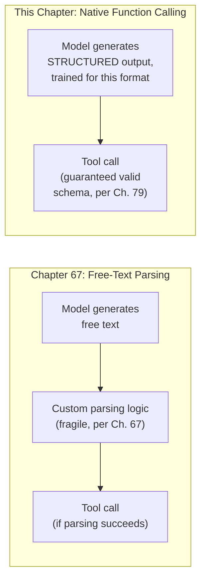
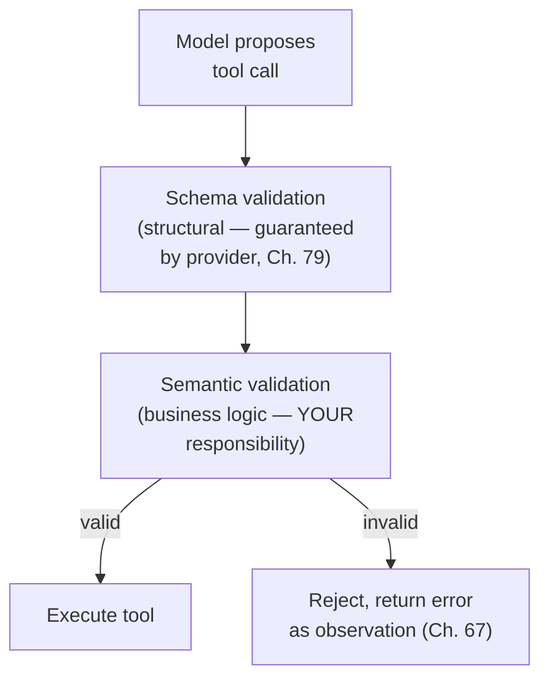

## Introduction

Chapter 67 closed by flagging the fragility of free-text parsing for tool calls — a deviation from the expected format breaks the entire loop. This chapter resolves that limitation: **native function calling**, the provider-supported mechanism most modern LLM APIs now offer for structured, reliably-parseable tool invocation, along with the schema design, parameter validation, and execution-safety architecture that make tool use production-grade rather than a fragile prompt-engineering exercise.

## Native Function Calling vs. Free-Text Parsing

Chapter 67's illustrative `parse_react_response` relied on the model producing text in an exact, expected format, then parsing that text with custom logic. **Native function calling** moves this responsibility into the model provider's own training and inference infrastructure: the model is trained specifically to output tool invocations in a structured, guaranteed-valid format (typically JSON matching a provided schema), and the API layer returns this structured data directly, rather than requiring the caller to parse free text.



```python
# Illustrative native function-calling API usage — the exact interface
# varies by provider, but the core pattern (define tools as schemas,
# let the model choose and populate them) is now near-universal.

tool_schema = {
    "name": "get_order_status",
    "description": "Retrieve the current status of a customer order by order ID.",
    "parameters": {
        "type": "object",
        "properties": {
            "order_id": {"type": "string", "description": "The order ID, e.g. 'ORD-4471'"},
        },
        "required": ["order_id"],
    },
}

response = llm_client.generate(
    prompt=user_query,
    tools=[tool_schema],  # the model is trained to emit a VALID call
                            # against this schema, or plain text if no
                            # tool is needed — no custom parsing required
)

if response.tool_call:
    # response.tool_call.name and .arguments are already structured,
    # type-checked data — not text requiring custom extraction.
    result = execute_tool(response.tool_call.name, response.tool_call.arguments)
```

**Why this is a meaningfully more reliable foundation than Chapter 67's free-text approach**: the model has been specifically trained (via supervised fine-tuning and RLHF, Chapter 46) to produce outputs conforming to a provided schema, directly analogous to Chapter 79's upcoming structured-output discussion — this shifts format reliability from *prompt engineering discipline* (Chapter 67's approach, inherently fragile) to *model training* (the provider's responsibility, validated at a scale no individual application team could replicate), the same "push a hard reliability problem down to a layer better equipped to solve it" pattern this series has applied before (Chapter 52's serving framework abstraction, Chapter 57's gateway abstraction).

## Tool Schema Design

A tool's schema is the *entire* interface the model has to understand what the tool does — directly extending Chapter 67's "tool descriptions deserve API-documentation-level rigor" argument, now formalized into a structured schema rather than free text.

```python
well_designed_schema = {
    "name": "search_knowledge_base",
    "description": (
        "Search the internal company knowledge base for documentation. "
        "Use this for questions about internal policies, procedures, or "
        "product specifications. Do NOT use this for questions about a "
        "specific customer's order — use get_order_status instead."
    ),
    "parameters": {
        "type": "object",
        "properties": {
            "query": {"type": "string", "description": "The search query"},
            "max_results": {"type": "integer", "description": "Number of results to return", "default": 5},
        },
        "required": ["query"],
    },
}
```

**Why the description explicitly states what the tool should *not* be used for**: directly extending Chapter 67's tool-selection-reliability discussion — when an agent has multiple, similar-sounding tools available (a knowledge-base search and an order-status lookup, both nominally "search" operations), explicit *negative* guidance (disambiguating this tool from a similar one) measurably reduces tool-selection errors, since the model's decision isn't just "does this tool sound relevant" but "is this the *more* appropriate tool among several plausible candidates" — a genuinely harder discrimination task that benefits from explicit disambiguating language, not just an accurate positive description.

## Parameter Validation: The Critical Safety Layer

Chapter 67 flagged that a malformed tool call, if executed, could produce an incorrect real-world action. Native function calling's schema conformance guarantees *structural* validity (correct types, required fields present) — it does **not** guarantee *semantic* validity (a syntactically valid order ID that doesn't actually exist, or a well-typed email address that's nonetheless the wrong recipient). This gap is where an explicit **validation layer** between tool proposal and tool execution becomes non-negotiable.



```python
def validate_and_execute(tool_call, tool_registry) -> str:
    """
    The semantic validation layer this chapter argues is
    non-negotiable — schema conformance alone (guaranteed by the
    provider) is necessary but not sufficient.
    """
    tool = tool_registry[tool_call.name]

    # Business-logic checks the schema itself cannot express:
    # does this order ID actually exist? Is this user authorized
    # to query it? Directly connects to Ch. 11's access-control
    # and Ch. 55's multi-tenant isolation discussions.
    validation_error = tool.validate_semantics(tool_call.arguments)
    if validation_error:
        # Returned as an OBSERVATION (Ch. 67's loop), not a crash —
        # letting the agent reason about and potentially recover
        # from the error, rather than halting the entire process.
        return f"Error: {validation_error}"

    return tool.execute(tool_call.arguments)
```

**Why validation failures are returned as observations rather than raised as exceptions that halt the loop**: this directly extends Chapter 67's ReAct architecture — a validation failure is genuinely useful information the agent can reason about and potentially recover from (retry with a corrected parameter, or explain the limitation to the user), exactly the same graceful-degradation principle Chapter 56 established for streaming resource constraints, now applied to tool-execution failures within an agentic loop.

## Read-Only vs. State-Changing Tools: A Critical Risk Distinction

Not all tools carry equal risk. A **read-only** tool (search, lookup, calculation) has no side effect if invoked incorrectly beyond wasted compute — an incorrect call simply returns unhelpful information, which the agent can recognize and recover from. A **state-changing** tool (sending an email, modifying a record, processing a payment) has a real-world side effect the moment it executes, directly connecting to Chapter 67's closing safety discussion.

```python
class Tool:
    def __init__(self, name: str, is_state_changing: bool, requires_confirmation: bool = False):
        self.name = name
        self.is_state_changing = is_state_changing
        # State-changing tools with significant consequence require
        # explicit human confirmation before execution — a direct,
        # concrete implementation of the human-in-the-loop pattern
        # this Part's safety discussion has been building toward.
        self.requires_confirmation = requires_confirmation or is_state_changing
```

This distinction should govern architectural decisions throughout an agentic system: read-only tools can generally be invoked freely within the ReAct loop (Chapter 67) without additional friction, while state-changing tools — especially high-consequence ones — should route through an explicit confirmation step, directly connecting this chapter's tool-execution architecture to the human-in-the-loop patterns this Part will continue to develop.

## Key Takeaways

- Native function calling moves format-reliability responsibility from application-level prompt engineering (Chapter 67's fragile free-text parsing) into the model provider's own training infrastructure, producing guaranteed schema-conformant tool calls rather than text requiring custom extraction.
- Tool schemas deserve the same rigor as human-facing API documentation, including explicit negative guidance (what a tool should *not* be used for) to reduce tool-selection errors when multiple similar tools are available.
- Schema conformance guarantees structural validity but not semantic validity — an explicit validation layer checking business-logic correctness (does this ID exist, is this user authorized) is a non-negotiable safety layer between tool proposal and execution.
- Distinguishing read-only from state-changing tools should drive concrete architectural decisions — state-changing, high-consequence tools warrant explicit human confirmation before execution, directly connecting tool architecture to this Part's human-in-the-loop safety theme.

---

## Interview Questions

**1. Why does this chapter describe native function calling as shifting reliability responsibility "from prompt engineering discipline to model training," and why is this shift genuinely significant rather than merely a convenience?**
Chapter 67's free-text parsing approach places the ENTIRE burden of format reliability on the APPLICATION DEVELOPER'S OWN prompt engineering and custom parsing logic — a burden that's inherently fragile because it depends on a SPECIFIC MODEL correctly and consistently following instructions the developer wrote, with no GUARANTEE mechanism beyond hoping the prompt is well-crafted enough; native function calling instead relies on the MODEL PROVIDER having SPECIFICALLY TRAINED the model (via supervised fine-tuning specifically on structured tool-call generation, per Chapter 46's training techniques) to reliably produce schema-conformant output — this is a GENUINELY DIFFERENT and more ROBUST reliability mechanism, since it's validated by the provider across an ENORMOUS volume of training examples and use cases (a scale of validation no individual application team could replicate through prompt engineering alone), directly parallel to why Chapter 52's serving framework abstractions and Chapter 57's gateway abstractions are valuable — they push a hard, cross-cutting reliability problem to a layer with more resources and expertise to solve it robustly, rather than every individual application needing to solve the same hard problem independently and less reliably.
*Follow-up: Does this mean an application team using native function calling never needs to worry about tool-call format reliability at all?*
No — while native function calling provides STRUCTURAL guarantees (correct JSON syntax, correct field types, required fields present, per this chapter's schema-conformance discussion), it does NOT guarantee SEMANTIC correctness (whether the specific values chosen are actually appropriate for the situation) — an application team still needs to invest in well-designed tool schemas and descriptions (this chapter's tool-schema-design discussion) to help the model choose the RIGHT tool and RIGHT parameter values, and still needs the semantic validation layer (this chapter's core safety argument) to catch cases where a structurally-valid call is nonetheless semantically wrong — native function calling solves the STRUCTURAL reliability problem Chapter 67 identified, but doesn't eliminate the need for careful tool design and validation this chapter's remaining sections address.

**2. Why might including explicit NEGATIVE guidance in a tool's description ("do NOT use this for X — use Y instead") measurably reduce tool-selection errors, beyond what a purely positive, accurate description alone would achieve?**
When an agent has access to MULTIPLE tools that are each individually well-described and each PLAUSIBLY relevant to a given query (this chapter's knowledge-base-search versus order-status-lookup example), the model's actual decision task isn't simply "does this ONE tool's description sound relevant" (a comparatively easy judgment) but rather "which of SEVERAL plausible, overlapping-sounding tools is the MOST appropriate for this specific situation" (a genuinely harder, COMPARATIVE discrimination task) — a purely POSITIVE description of each tool in isolation doesn't directly help the model make this comparative distinction, since multiple tools' positive descriptions might all sound individually reasonable for a given ambiguous query; explicit NEGATIVE guidance directly addresses this comparative discrimination problem by EXPLICITLY telling the model when NOT to choose this tool in favor of a specific alternative, providing DIRECT, TARGETED guidance for exactly the kind of ambiguous, multi-tool-candidate situations where tool-selection errors are most likely to occur in the first place.
*Follow-up: How would you determine WHICH pairs of tools in a larger tool set are most likely to benefit from this kind of explicit, negative disambiguating guidance, rather than adding it exhaustively to every tool's description?*
I'd specifically analyze observed or anticipated tool-selection ERRORS (following this series' consistent empirical, evidence-based diagnostic discipline) — reviewing cases where the agent selected an INCORRECT tool, and specifically identifying which OTHER tool would have been more appropriate in each such case — pairs of tools that RECUR frequently in this kind of confusion (this chapter's knowledge-base-versus-order-status example being one concrete instance) are the specific, evidence-justified candidates for this targeted, negative disambiguating guidance, rather than adding exhaustive negative guidance to EVERY tool's description regardless of whether confusion with any OTHER specific tool has actually been observed or is plausible — this follows the same "add complexity where diagnosed evidence justifies it, not exhaustively and preemptively" discipline this series has applied consistently throughout (e.g., Chapter 62's evidence-based hybrid search adoption).

**3. Explain why schema conformance (guaranteed by native function calling) is described as "necessary but not sufficient" for tool-call safety, using a concrete example distinct from this chapter's own.**
Schema conformance guarantees the STRUCTURE of a tool call is correct — the right fields are present, with the right data TYPES (a string where a string is expected, an integer where an integer is expected) — but says NOTHING about whether the SPECIFIC VALUES chosen are actually CORRECT or APPROPRIATE for the situation; consider a `transfer_funds` tool requiring an `amount` (a number) and a `recipient_account` (a string) — a tool call specifying `amount: 50000` and a syntactically well-formed but WRONG `recipient_account` (perhaps a typo, or an account belonging to someone other than the intended recipient) would PASS schema validation perfectly (both fields present, correctly typed) while still representing a potentially serious, real-world ERROR — this illustrates precisely why "necessary but not sufficient" is the correct characterization: schema conformance eliminates an entire CATEGORY of error (malformed, unparseable, or type-mismatched calls) but leaves an entirely DIFFERENT category of error (semantically incorrect but structurally valid calls) completely unaddressed, requiring this chapter's separate semantic validation layer.
*Follow-up: What specific semantic validation check would you implement for this `transfer_funds` example, beyond simply checking that the recipient account "exists" in some general sense?*
Beyond confirming the recipient account EXISTS (a basic existence check), I'd implement checks specifically calibrated to this tool's HIGH-CONSEQUENCE nature (echoing this chapter's read-only-versus-state-changing distinction) — verifying the recipient account belongs to an EXPECTED, previously-established relationship with the requesting user (e.g., a saved payee, or an account explicitly mentioned earlier in the conversation, rather than an arbitrary account number the model might have hallucinated or transcribed incorrectly), verifying the amount falls within an EXPECTED, reasonable range for this type of transaction (flagging unusually large amounts for additional scrutiny, similar in spirit to Chapter 51's anomaly-detection-style safety checks), and, given this chapter's confirmation-requirement discussion, ROUTING this specific tool call through an explicit human confirmation step regardless of how confident the semantic validation checks are, given the fund-transfer tool's clearly high-consequence, hard-to-reverse nature.

**4. Why does this chapter argue that validation failures should be returned as OBSERVATIONS fed back into the ReAct loop (Chapter 67) rather than raised as exceptions that halt the entire agent's execution?**
Directly extending Chapter 67's core ReAct architecture, an OBSERVATION (including an error observation) is information the model can REASON about and potentially RECOVER FROM within the SAME ongoing loop — if a validation failure is instead raised as an exception that HALTS the entire process, the agent loses the opportunity to use this information productively (for example, recognizing that an order ID it proposed doesn't exist, and either correcting a likely typo, or informing the user that the requested order couldn't be found, rather than the ENTIRE task failing outright with no graceful resolution) — this directly extends Chapter 56's graceful-degradation principle (originally applied to streaming resource constraints) to this NEW context of tool-execution failures within an agentic loop, treating a validation failure as EXPECTED, RECOVERABLE information the agent's own reasoning can productively incorporate, rather than as a catastrophic, process-ending error condition.
*Follow-up: Under what circumstance might it actually be MORE appropriate to halt the agent's execution entirely, rather than feeding a validation failure back as a recoverable observation?*
For a validation failure indicating a GENUINE, POTENTIALLY MALICIOUS or SEVERELY ANOMALOUS situation — for example, a proposed tool call attempting to access data or perform an action clearly OUTSIDE the agent's intended, authorized scope (a possible sign of a prompt injection attack, a topic Chapter 74 will develop) rather than a simple, benign error like a mistyped ID — halting execution entirely and ESCALATING to human review would be the more appropriate response, rather than feeding this back as a routine, recoverable observation that might inadvertently give a compromised or malfunctioning agent another opportunity to attempt a similarly inappropriate action — this distinction (routine, benign validation failures warranting graceful recovery, versus anomalous, potentially adversarial failures warranting a hard stop and escalation) is itself a genuine, evidence-based DESIGN DECISION that a mature agentic system's validation layer should explicitly implement, rather than treating ALL validation failures uniformly as either always-recoverable or always-halting.

**5. How would you use this chapter's read-only versus state-changing tool distinction to design the confirmation-requirement policy for a customer support agent with access to BOTH a knowledge-base search tool and a refund-processing tool?**
I'd configure the knowledge-base search tool (this chapter's `search_knowledge_base` example) as NOT requiring confirmation — since it's READ-ONLY (per this chapter's core distinction), an incorrect or unnecessary invocation has no real-world side effect beyond wasted compute, meaning requiring human confirmation for EVERY search would add unnecessary friction and latency (Chapter 60's latency-budget concerns) without a correspondingly meaningful safety benefit; I'd configure the refund-processing tool as REQUIRING explicit human confirmation before execution (per this chapter's `Tool` class design, where `is_state_changing` tools default to `requires_confirmation=True`), since an incorrectly-processed refund has a genuine, real-world financial consequence and is likely difficult or impossible to fully reverse — this asymmetric confirmation policy, differentiating tools by their ACTUAL consequence profile rather than applying a UNIFORM confirmation requirement to every tool call, directly reflects this chapter's core argument that read-only and state-changing tools warrant genuinely different architectural treatment.
*Follow-up: How would you handle a THIRD tool — one that updates a customer's contact information (a state change, but with comparatively LOW consequence and easy reversibility) — within this same confirmation-policy framework?*
I'd recognize that "state-changing" alone isn't the FULL picture — this chapter's distinction is a useful FIRST-PASS heuristic, but the confirmation requirement should ultimately be calibrated to the SPECIFIC CONSEQUENCE AND REVERSIBILITY of the action, not simply a binary state-changing/read-only classification — a contact-information update, while technically state-changing, is LOW-CONSEQUENCE (limited real-world harm from an incorrect update) and EASILY REVERSIBLE (the customer or a support agent could simply correct it again if wrong), unlike the refund tool's comparatively HIGH-CONSEQUENCE and HARDER-TO-REVERSE profile — I'd likely configure this contact-update tool WITHOUT a mandatory confirmation requirement (perhaps with a lighter-weight safeguard like a confirmation MESSAGE shown to the user after the fact, rather than a blocking approval REQUIRED before execution), reflecting a more nuanced, THREE-TIER (or graduated) risk classification rather than this chapter's simpler binary framework alone — directly extending this chapter's core principle (calibrate safety measures to actual consequence) with additional nuance for real-world tool sets that don't always cleanly fit a strict binary classification.

**6. In an interview, if asked to design the tool interface for an agent that can execute arbitrary SQL queries against a company's production database, how would you use this chapter's material to identify the SPECIFIC risks this design must address?**
I'd immediately flag this as an extremely HIGH-RISK, STATE-CHANGING-CAPABLE tool (since arbitrary SQL can include not just read (`SELECT`) operations but also `UPDATE`, `DELETE`, and `DROP` operations, per this chapter's read-only-versus-state-changing distinction) — I'd propose, at minimum, RESTRICTING the tool's actual capability at the SCHEMA level (this chapter's schema-design discussion) to ONLY permit read-only `SELECT` queries by design, rather than exposing a genuinely unrestricted, arbitrary-SQL-execution capability, directly applying this series' consistent "constrain scope to genuinely demonstrated need" principle (Chapter 67's tool-set-scoping discussion) to eliminate an entire, extremely dangerous category of possible action rather than relying purely on the model's own reasoning to avoid destructive queries; for the RESULTING, restricted read-only query tool, I'd still implement semantic validation (this chapter's validation-layer discussion) checking for things like query complexity limits (preventing an accidentally or maliciously expensive, resource-exhausting query) and table/column-level access restrictions (ensuring the agent can only query tables it's actually authorized to access, connecting to Chapter 11's access-control discussion).
*Follow-up: Why might restricting this tool's SCHEMA-LEVEL capability (only allowing SELECT) be a more robust safety mechanism than relying on careful PROMPT ENGINEERING instructing the model to "only use SELECT queries, never modify data"?*
A schema-level restriction (the tool ITSELF is technically incapable of executing anything other than a `SELECT` statement, enforced at the TOOL IMPLEMENTATION level, independent of what the model requests) provides a GUARANTEED, STRUCTURAL safety boundary that holds REGARDLESS of the model's own reasoning or behavior — even if the model, due to a reasoning error, an adversarial prompt injection (Chapter 74), or simple unpredictability, attempts to request a destructive query, the tool's own implementation simply CANNOT execute it; relying purely on PROMPT ENGINEERING (instructing the model, in its system prompt, to "only use SELECT queries") provides NO SUCH GUARANTEE — it's a REQUEST the model is expected to follow, but, per this chapter's and Chapter 67's consistent theme, prompt-based instructions cannot be perfectly guaranteed to be followed reliably in 100% of cases — this directly illustrates the general, important safety principle that a STRUCTURAL, ARCHITECTURAL constraint (enforced in code, at the tool-implementation level) is a fundamentally more ROBUST safety mechanism than a purely INSTRUCTIONAL constraint (a prompt asking the model to behave a certain way), and this principle should be applied wherever a genuinely hard safety boundary is needed.

**7. Why might a team need to version their tool schemas carefully, connecting to Chapter 43's prompt regression-testing discipline, when updating a tool's description or parameters?**
A CHANGE to a tool's schema (renaming a parameter, changing its expected format, or revising the tool's description for clarity) directly and immediately affects HOW THE MODEL INTERPRETS AND USES that tool — exactly analogous to how Chapter 43 established that a system prompt change requires regression testing (since a change intended to fix one specific behavior could inadvertently affect other, previously-correct behaviors) — a tool schema change could similarly, unexpectedly affect the model's tool-selection behavior or parameter-formatting behavior in ways that weren't the INTENDED target of the change, potentially degrading previously-reliable tool-use patterns even while successfully fixing whatever specific issue motivated the schema change in the first place — this directly extends this series' now well-established "test the WHOLE system's behavior after ANY component change, not just the specific behavior the change was intended to address" discipline (Chapter 48's regression-testing theme) to this new, tool-schema-specific context.
*Follow-up: What specific regression test would you design to catch an UNINTENDED consequence of a tool schema change, following Chapter 65's evaluation-gate methodology?*
I'd maintain a STANDING test suite of representative agent tasks (directly analogous to Chapter 65's `RAGEvaluationGate` test query set, now applied to agentic tool-use scenarios) covering the FULL range of the agent's intended tool-use patterns — including tasks that exercise the SPECIFIC tool being changed, tasks that exercise OTHER, similar or potentially-confusable tools (per this chapter's tool-disambiguation discussion, to catch a schema change that might inadvertently increase confusion with a DIFFERENT tool), and tasks that don't involve this specific tool at all (a sanity check confirming the change hasn't had some entirely unexpected, broader effect) — running this FULL suite against BOTH the OLD and NEW tool schema versions, and comparing tool-selection accuracy and task-completion success across this comparison, directly extending Chapter 65's before-and-after regression-testing methodology to this specific tool-schema-versioning context, ensuring any tool schema change is validated against the SAME comprehensive, standing evaluation discipline this series has applied consistently to every other significant component change throughout.

**8. How would you use this chapter's material to explain why a tool's description length and level of detail involves a genuine trade-off, rather than "more detail is always better"?**
Directly connecting to Chapter 38's context-window and token-cost discussion (Chapter 42) — EVERY tool's schema and description, for EVERY tool available to the agent, must be included in EVERY prompt sent to the model (since the model needs this information to decide which tool, if any, to use for the CURRENT task) — this means a LARGER number of tools, or MORE VERBOSE descriptions for each tool, directly and proportionally consumes MORE of the available context budget and increases per-request token COST, exactly the same "every token has a real, quantifiable cost" principle Chapter 60 established for RAG's retrieved context, now applied to an agent's TOOL DEFINITIONS themselves — a tool description that's needlessly verbose or includes excessive, non-essential detail wastes this budget without providing a correspondingly meaningful improvement in tool-selection accuracy, meaning tool description length and detail should be calibrated to genuinely NEEDED disambiguating and functional information (this chapter's earlier discussion of NECESSARY negative guidance for genuinely confusable tools), not maximized indiscriminately under an unexamined "more detail is always better" assumption.
*Follow-up: How would this cost trade-off change as the NUMBER of available tools grows very large (e.g., an agent with access to 50+ distinct tools)?*
As the number of available tools grows very large, the AGGREGATE token cost of including EVERY tool's full schema and description in EVERY prompt becomes increasingly significant (potentially consuming a substantial fraction of the available context budget purely on tool definitions, before any actual task-specific content, per Chapter 38's budget concerns) — at this scale, a team might need to consider a DYNAMIC tool-selection or tool-FILTERING mechanism (analogous in spirit to Chapter 51's cascade pattern) that first identifies a SMALLER, likely-relevant SUBSET of tools for a given task (perhaps using a cheaper, upstream classification or retrieval step, echoing Chapter 62's and Chapter 63's cheap-then-expensive cascade pattern) and includes ONLY that relevant subset's full schemas in the actual prompt sent to the main reasoning model, rather than including ALL 50+ tools' definitions in every single request regardless of relevance — directly extending this Part's now-recurring cascade-pattern theme (Chapter 63's re-ranking, Chapter 64's Self-RAG gate) to this new, large-tool-set context.

**9. How would you design a monitoring strategy specifically for a production agentic system's tool-use patterns, connecting to Chapter 33's observability discipline and this chapter's semantic-validation layer?**
I'd track, for every tool call attempted, WHICH tool was selected, whether it PASSED or FAILED semantic validation (this chapter's validation layer), and, for validation failures, the SPECIFIC reason for failure — aggregating this over time to identify PATTERNS (a specific tool consistently failing validation for a specific reason might indicate either a genuine, recurring model reasoning error, or a tool schema/description that's insufficiently clear, per this chapter's earlier discussion, causing the model to consistently misunderstand how to correctly use it) — I'd also specifically track the RATE at which state-changing, confirmation-requiring tools (this chapter's distinction) are PROPOSED but ultimately REJECTED by the human confirmation step, since a consistently HIGH rejection rate for a specific tool might indicate the agent's reasoning around WHEN to propose that specific consequential action is unreliable, warranting further investigation into either the agent's underlying reasoning or that specific tool's description and guidance — directly extending Chapter 33's general observability discipline (tracking each component's individual behavior within a larger system) to this specific, tool-use-focused monitoring context.
*Follow-up: Why might a SUDDEN increase in the rate of a specific tool being selected (even without any corresponding increase in validation failures) still warrant investigation, connecting to Chapter 32's alerting discipline?*
Following Chapter 32's "sustained deviation from an established baseline warrants investigation" alerting principle, a sudden, sustained increase in a specific tool's selection RATE — even one that continues to PASS validation successfully — could indicate a MEANINGFUL SHIFT in the actual USER QUERY PATTERNS the agent is receiving (a legitimate, business-relevant signal worth understanding and potentially responding to, e.g., a sudden surge in queries about a specific topic that this tool addresses), OR could indicate a SUBTLE DRIFT in the model's own tool-selection BEHAVIOR (perhaps due to an unnoticed upstream change, like a model version update from the provider, per Chapter 65's earlier discussion of periodic re-evaluation even without an intentional code change) that's causing this tool to be selected MORE OFTEN than is actually appropriate, even in cases where it happens to still pass the (comparatively coarse) semantic validation checks currently in place — this specific combination (increased selection rate, but no corresponding validation-failure increase) illustrates why a comprehensive monitoring strategy needs to track BOTH failure-rate signals AND overall behavioral-pattern signals, since a genuine problem could manifest as a shift in the LATTER without necessarily and immediately triggering the FORMER.

**10. How would you handle a stakeholder's request to give an agent access to a tool that can send emails on the user's behalf, WITHOUT requiring any confirmation step, citing a desire for a "frictionless user experience"?**
I'd directly apply this chapter's read-only-versus-state-changing framework — an email-sending tool is UNAMBIGUOUSLY state-changing (it takes an irreversible, real-world action the moment it executes, sending content to a real recipient that cannot be "un-sent"), placing it squarely in the category this chapter argues warrants EXPLICIT confirmation before execution, regardless of the stakeholder's understandable desire for reduced friction; I'd explain the SPECIFIC, concrete risk this friction-reduction trade-off introduces — a single reasoning error (Chapter 67's inherent, unavoidable possibility for ANY LLM-based reasoning system) could result in an INCORRECT, POTENTIALLY EMBARRASSING OR HARMFUL email being sent WITHOUT ANY opportunity for the user to catch and prevent this mistake before it takes effect — I'd propose alternatives that BALANCE the stakeholder's legitimate frictionless-experience goal against this genuine risk: for example, a LIGHTWEIGHT, LOW-FRICTION confirmation UI (a single tap to approve a DRAFTED email before it sends, rather than a fully separate, heavyweight approval workflow) that still provides the ESSENTIAL safety checkpoint this chapter argues is necessary, while minimizing the ADDITIONAL friction this checkpoint introduces relative to a fully unconfirmed, automatic-send design.
*Follow-up: Under what SPECIFIC, narrow circumstance might it actually be reasonable to allow an email-sending tool to operate WITHOUT a confirmation step, consistent with this chapter's overall safety framework rather than as an exception to it?*
If the email tool's SCOPE is DELIBERATELY and STRUCTURALLY restricted (per the SQL-tool discussion from an earlier question in this chapter) to ONLY a very NARROW, LOW-CONSEQUENCE set of pre-approved, TEMPLATE-BASED messages (e.g., an automated "your order has shipped" notification using a FIXED, pre-reviewed template with only a few clearly-bounded, low-risk variable fields like an order number or tracking link, rather than a GENERAL-PURPOSE, free-form email-composition capability) — this kind of STRUCTURALLY CONSTRAINED tool has a MEANINGFULLY LOWER actual risk profile than a general-purpose email tool (since the SPACE of possible incorrect actions is itself tightly bounded by the tool's own restricted design, similar to the SQL-tool's SELECT-only restriction), potentially justifying a reduced or eliminated confirmation requirement for THIS SPECIFIC, narrowly-scoped tool — while a general-purpose, free-form email-sending tool would still warrant this chapter's full confirmation-requirement treatment, directly illustrating that the confirmation requirement should be calibrated to the TOOL'S ACTUAL, STRUCTURALLY-BOUNDED risk profile, not simply and uniformly applied based on a coarse "sends email = state-changing = needs confirmation" categorization without this kind of more nuanced, scope-aware consideration.

**11. How would you use this chapter's material to explain why a tool's PARAMETER descriptions (not just its top-level description) deserve careful engineering attention, using this chapter's `order_id` example?**
This chapter's `get_order_status` schema includes a parameter-level description ("The order ID, e.g. 'ORD-4471'") that provides a CONCRETE EXAMPLE of the expected FORMAT, not just an abstract type declaration (`"type": "string"`) — this matters because a bare type declaration alone doesn't communicate the SPECIFIC, EXPECTED FORMAT CONVENTIONS a real order ID follows in this particular system (is it purely numeric? does it include a prefix? what's the typical length?) — without this concrete example, the model might reasonably but INCORRECTLY guess at a plausible-but-wrong format (e.g., providing just a numeric ID without the expected "ORD-" prefix) when constructing a tool call, particularly if the specific order ID isn't directly and explicitly stated in the user's own query and needs to be INFERRED or RECONSTRUCTED from some other context — this parameter-level example-based guidance directly reduces this specific, plausible source of tool-call errors, extending this chapter's overall "tool schemas deserve API-documentation-level rigor" principle down to the INDIVIDUAL PARAMETER level, not just the tool's overall top-level description.
*Follow-up: Why might this parameter-level guidance be even MORE important for a numeric or date-formatted parameter than for a simple string parameter like an order ID?*
Numeric and date parameters carry SIGNIFICANT AMBIGUITY in their EXPECTED representation that a bare type declaration doesn't resolve at all — a "date" parameter could be expected in numerous different formats (ISO 8601 "YYYY-MM-DD", US-style "MM/DD/YYYY", a Unix timestamp, or a human-readable string), and a "number" parameter might be expected as an integer versus a float, or might need to be expressed in specific UNITS (dollars versus cents, for example) that a bare `"type": "number"` declaration gives NO indication of whatsoever — without an EXPLICIT, example-based parameter description resolving this specific ambiguity, the model would need to GUESS at the correct convention, and different plausible guesses could each be individually "reasonable" while still being WRONG for this SPECIFIC tool's actual expected format — making this kind of concrete, format-disambiguating parameter description an even HIGHER-LEVERAGE investment for numeric and date-type parameters specifically, compared to a string parameter like an order ID where the range of plausible format ambiguity, while still present, is often somewhat narrower.

**12. How would you use this chapter's concepts to design an experiment testing whether GIVING THE MODEL a validation error message in a SPECIFIC, structured format (versus a generic, unstructured error string) improves the agent's ability to RECOVER from that error?**
I'd run a CONTROLLED comparison (directly extending Chapter 22's experimental discipline and this chapter's own validation-as-observation design) — constructing a set of test scenarios that DELIBERATELY trigger a range of different validation failures (an invalid order ID, a malformed date, an out-of-range parameter), and comparing the agent's SUBSEQUENT recovery behavior (does it correctly identify and CORRECT the specific issue on its next attempt, or does it repeat the SAME mistake, or give up entirely) under TWO different error-message formats: a GENERIC, unstructured error string ("Error: invalid input") versus a STRUCTURED, SPECIFIC error message that explicitly identifies WHICH parameter was invalid and WHY (e.g., "Error: order_id 'XYZ123' does not match the expected format 'ORD-####'") — measuring the agent's recovery SUCCESS RATE under each condition provides direct, empirical evidence of whether this additional error-message specificity investment genuinely improves the agent's practical ability to self-correct, following this series' consistent empirical-validation discipline rather than assuming more detailed error messages are self-evidently beneficial without this kind of specific, measured confirmation.
*Follow-up: Why might this specific experiment's results plausibly DIFFER depending on the underlying model's OWN reasoning capability, connecting to Chapter 40's scaling discussion?*
A MORE CAPABLE underlying model (Chapter 40) might already be reasonably GOOD at inferring the LIKELY cause of even a somewhat GENERIC error message, given the broader context of the task and the specific tool call it just attempted (effectively "filling in the gap" the generic error message leaves through its own stronger reasoning capability) — while a LESS CAPABLE model might genuinely NEED the more explicit, structured error detail to reliably recover, since it has LESS capacity to correctly infer the specific issue from a vaguer signal alone — this means the MEASURED benefit of investing in more structured, specific error messages could reasonably be LARGER for a less capable underlying model and SMALLER (though still likely nonzero) for a more capable one, again reinforcing this series' consistent theme that the "right" level of engineering investment in a specific system-design detail depends on the SPECIFIC underlying components involved, validated empirically for THAT specific combination rather than assumed to be uniform across all possible model choices.

**13. How would you use this chapter's material to explain why an agentic system's tool set should be thought of as a distinct, INDEPENDENTLY-VERSIONED artifact, similar to how Chapter 43 treated a system prompt as a versioned artifact requiring regression testing?**
This chapter has established that a tool's SCHEMA, DESCRIPTION, and VALIDATION LOGIC each directly and materially affect the AGENT'S OBSERVED BEHAVIOR (tool selection accuracy, parameter correctness, recoverability from errors) in ways that are STRUCTURALLY analogous to how Chapter 43 established a system prompt directly affects an LLM's observed behavior — just as Chapter 43 argued a system prompt should be VERSION-CONTROLLED and REGRESSION-TESTED before any change reaches production, this chapter's material (tool schema versioning, this chapter's earlier discussion) argues the SAME discipline should apply to an agent's ENTIRE TOOL SET DEFINITION — treating the tool set as a first-class, versioned artifact (alongside the system prompt, the underlying model version, and any other configuration) that collectively determines the agent's overall behavior, and that therefore deserves the SAME "any change requires a full regression pass before deployment" discipline this series has now applied consistently to EVERY other configuration surface throughout its coverage of production LLM systems.
*Follow-up: Why might a CHANGE to the tool SET (adding or removing an entire tool, rather than modifying an existing tool's schema) require an even MORE comprehensive regression test than a change to a single tool's description?*
Adding or REMOVING an entire tool changes the COMPLETE SET of options available to the model at every SINGLE decision point in the ReAct loop (Chapter 67) — this is a more STRUCTURALLY significant change than modifying one existing tool's description, since it can affect the RELATIVE likelihood of EVERY OTHER tool being selected as well (a newly-added tool might "compete" for selection against previously-unambiguous choices, or a removed tool's absence might force the model toward a less-ideal alternative for tasks that previously relied on it) — this broader, SET-LEVEL impact means a comprehensive regression test following a tool-set change should specifically verify behavior across the ENTIRE range of the agent's intended use cases (not just tasks specifically involving the added or removed tool), directly extending this chapter's and Chapter 65's "test the WHOLE system, not just the directly-changed component" discipline with even GREATER thoroughness for this specific, more structurally impactful kind of tool-related change.

**14. How would you use this chapter's material to explain, at a system-design level, why "tool use" is best understood as extending an LLM's CAPABILITIES beyond its training-time knowledge, directly connecting to Chapter 36's original knowledge-gap discussion?**
Chapter 36 and Chapter 44 established that an LLM's PARAMETRIC KNOWLEDGE (what it learned during training) is inherently BOUNDED and STATIC (fixed at training time, per Chapter 36's original discussion) — this chapter's tool-use architecture provides a DIRECT, GENERAL-PURPOSE mechanism for the model to access INFORMATION AND CAPABILITIES entirely OUTSIDE this bounded, static parametric knowledge — a search tool provides access to CURRENT, EXTERNAL information (directly generalizing the SAME underlying knowledge-gap-filling purpose RAG, Chapter 44, and Part 11 served, but now as ONE OF POTENTIALLY MANY tools an agent can choose to invoke, rather than a fixed, mandatory architectural stage); a calculation tool provides access to PRECISE, RELIABLE arithmetic the model's own generative process cannot always guarantee (directly connecting to known LLM limitations around precise numerical computation); an action-taking tool (sending an email, updating a record) provides the ability to actually AFFECT THE REAL WORLD, a capability NO amount of additional PARAMETRIC training could ever provide a pure text-generation model on its own — this reframes "tool use" not as a narrow, specific technique, but as the GENERAL, UNIFYING mechanism by which an LLM-based system transcends the fundamental limitations of being a purely TEXT-IN, TEXT-OUT parametric knowledge store.
*Follow-up: Why might this reframing be valuable for a system designer deciding WHETHER a specific application's limitation should be addressed through fine-tuning (Chapter 45), RAG (Part 11), or tool use (this Part), rather than treating these as three entirely unrelated techniques?*
Recognizing tool use, RAG, and fine-tuning as THREE DIFFERENT MECHANISMS for addressing the SAME underlying category of problem (an LLM's inherent limitations as a bounded, static, purely-text-based system) — rather than as three unrelated, independently-invented techniques — equips a system designer to apply a SINGLE, UNIFIED DIAGNOSTIC FRAMEWORK (directly extending Chapter 44's original fine-tuning-versus-RAG-versus-prompting framework) when choosing among them: fine-tuning (Chapter 45) is appropriate for teaching the model a NEW SKILL or BEHAVIOR PATTERN (not knowledge); RAG (Part 11) is appropriate for providing access to a LARGE, RELATIVELY STATIC knowledge base; and TOOL USE (this Part) is appropriate for providing access to DYNAMIC, REAL-TIME information or the ability to take ACTUAL ACTIONS in the world — recognizing these as points along a SHARED, UNIFIED framework (rather than three separate, disconnected topics each requiring independent first-principles reasoning) allows a system designer to make a MORE PRINCIPLED, CONSISTENT choice among them (or, commonly, a COMBINATION of them, since a genuinely sophisticated production agent often uses ALL THREE together) for any given, newly-encountered application limitation.

**15. How would you summarize, for someone moving on to Chapter 69's multi-agent architectures discussion, why this chapter's function-calling and tool-use foundation is a necessary prerequisite for that next chapter's more complex topic?**
Chapter 69 will cover MULTI-AGENT architectures, where MULTIPLE distinct agents (each potentially specialized for a different sub-task) collaborate or coordinate to accomplish a larger, more complex goal — this fundamentally REQUIRES each individual agent to be able to reliably invoke well-defined CAPABILITIES (exactly this chapter's tool-use and function-calling material), since, in a very real sense, ONE agent within a multi-agent system can be modeled as ANOTHER agent's "TOOL" (agent A might invoke agent B to handle a specialized sub-task, using the SAME structured, schema-based invocation pattern this chapter established for invoking a simpler, non-agentic tool) — having THIS chapter's solid foundation in RELIABLE, SCHEMA-VALIDATED tool invocation, with its explicit safety layer distinguishing read-only from state-changing actions, equips a reader to understand Chapter 69's multi-agent coordination patterns as a NATURAL EXTENSION of this chapter's single-agent tool-use architecture — where the "tools" available to a coordinating agent happen to be OTHER, FULLY-CAPABLE AGENTS, rather than simpler, single-purpose functions — rather than encountering multi-agent coordination as an entirely separate, unrelated architectural paradigm.
*Follow-up: What specific NEW challenge would you expect Chapter 69 to introduce, beyond this chapter's material, given that "an agent as a tool" is a MORE COMPLEX invocation than "a simple function as a tool"?*
I'd expect Chapter 69 to address the specific challenge that an INVOKED AGENT, unlike this chapter's SIMPLE, DETERMINISTIC tools (a database lookup, a calculation), is ITSELF running its OWN, POTENTIALLY MULTI-STEP ReAct loop (Chapter 67) with its OWN reasoning, its OWN tool selections, and its OWN POTENTIALLY VARIABLE completion time and OUTPUT — meaning the "tool call" to invoke this sub-agent doesn't simply return a SIMPLE, IMMEDIATE, PREDICTABLE result the way this chapter's `get_order_status` example does, but instead returns the RESULT OF AN ENTIRE, POTENTIALLY COMPLEX, SEPARATE AGENTIC PROCESS — this introduces genuinely NEW considerations around cost and latency AGGREGATION across MULTIPLE NESTED agentic loops (directly extending Chapter 64's already-discussed cost-compounding concern for MULTI-HOP retrieval to this even MORE COMPLEX, MULTI-AGENT context), and around how ERRORS OR FAILURES within a SUB-AGENT should be communicated back to and handled by the COORDINATING agent — exactly the kind of genuinely new, compounding-complexity challenges Chapter 69 should be expected to address in depth, building directly on this chapter's more foundational, single-tool-invocation material.
