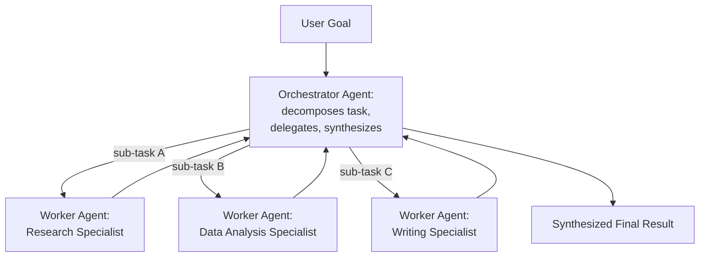
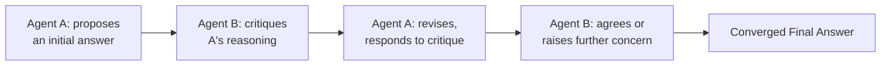
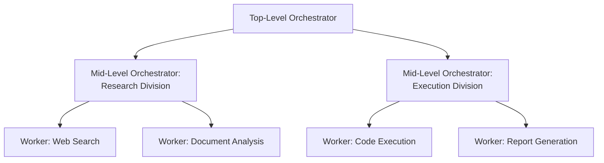
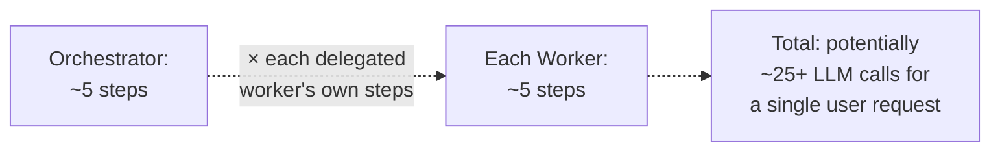

## Introduction

Chapter 68 closed by framing multi-agent systems as a natural extension of single-agent tool use: an agent can be modeled as another agent's tool. This chapter develops that extension into a complete architectural treatment — the three dominant multi-agent patterns, the specific new challenges that arise from nesting one agentic loop (Chapter 67) inside another, and how the cost-compounding concern Chapter 64 first raised for multi-hop retrieval becomes substantially more consequential at this scale.

## Why Split a Single Agent Into Multiple Agents at All

Before covering the patterns, the motivating question: why not simply give one agent (Chapter 67-68's architecture) a very large tool set and let it handle everything? Chapter 68 already answered this in part — tool-set size directly increases tool-selection difficulty and context cost. Multi-agent architectures address this by applying Chapter 51's cascade and specialization principles at the *agent* level rather than the *model* level: a **specialized** agent, with a narrow, well-defined tool set and a focused system prompt, is more reliable at its specific sub-task than a single generalist agent juggling dozens of unrelated tools — directly the same "specialization improves reliability within a narrower scope" principle Chapter 47's domain adaptation discussion established, now applied to agent design rather than model fine-tuning.

## Pattern 1: Orchestrator-Worker

A central **orchestrator** agent decomposes a complex task into sub-tasks and delegates each to a specialized **worker** agent, collecting and synthesizing their results.



```python
class OrchestratorAgent:
    """
    Directly extends Ch. 67's ReAct loop — the orchestrator's
    "tools" (per Ch. 68's closing framing) ARE the worker agents
    themselves, each invoked exactly like any other tool call.
    """
    def __init__(self, llm_client, worker_agents: dict):
        self.llm_client = llm_client
        self.worker_agents = worker_agents  # each a full ReAct agent (Ch. 67)

    def run(self, goal: str, max_steps: int = 10) -> str:
        trajectory = [f"Goal: {goal}"]
        for step in range(max_steps):
            decision = self.llm_client.generate(
                build_orchestrator_prompt(trajectory, self.worker_agents)
            )
            if decision.action == "Final Answer":
                return decision.content

            # Delegating to a worker means invoking ITS OWN, COMPLETE
            # ReAct loop (Ch. 67) — not a single, fast function call.
            worker = self.worker_agents[decision.action]
            result = worker.run(decision.sub_task)  # Ch. 68's closing point
            trajectory.append(f"Delegated '{decision.sub_task}' to {decision.action}: {result}")

        return "Unable to complete within step limit."
```

**Why this is the most common pattern for genuinely decomposable tasks**: it directly mirrors Chapter 51's cascade and Chapter 69's own specialization argument — the orchestrator handles high-level planning and synthesis (a task requiring broad awareness of the overall goal), while each worker handles a narrow, well-defined sub-task with its own focused tool set, avoiding the tool-selection difficulty Chapter 68 identified as scaling poorly with a single agent's tool-set size.

## Pattern 2: Peer-to-Peer (Debate/Collaboration)

Multiple agents with *equal* standing (no central orchestrator) interact directly, often specifically to **critique or challenge** each other's reasoning before converging on an answer.



**Why this pattern specifically targets a different failure mode than orchestrator-worker**: orchestrator-worker addresses *task decomposition* (breaking a big task into manageable pieces); peer-to-peer debate addresses *reasoning reliability* — directly extending Chapter 21's LLM-as-judge validation concern into the generation process itself, using a second agent's independent perspective as a real-time check against the first agent's potential reasoning errors or hallucinations (Chapter 36), rather than only catching such errors after the fact through a separate evaluation step.

## Pattern 3: Hierarchical (Manager-of-Managers)

For genuinely large, complex tasks, orchestrator-worker composes recursively: a top-level orchestrator delegates to *mid-level orchestrators*, each of which manages its own set of workers — directly the same recursive decomposition principle a well-designed organization chart applies to human team structure, now applied to agent architecture.



## The Compounding Cost and Latency Problem

Chapter 64 flagged that multi-hop retrieval's cost scales with the number of hops. Multi-agent systems compound this concern multiplicatively rather than additively: **every** nested agent invocation is itself a full ReAct loop (Chapter 67) with its own potentially multi-step reasoning process, meaning total cost and latency scale with the *product* of each level's step count, not merely their sum.



```python
def estimate_multi_agent_cost(orchestrator_avg_steps: int, num_workers_invoked: int,
                                 worker_avg_steps: int, cost_per_llm_call: float) -> float:
    """
    Directly extends Ch. 42's cost modeling and Ch. 64's cost-
    compounding warning — multi-agent cost is NOT simply
    orchestrator_steps + worker_steps; delegated worker calls
    happen WITHIN orchestrator steps, compounding the total.
    """
    orchestrator_reasoning_calls = orchestrator_avg_steps
    worker_calls = num_workers_invoked * worker_avg_steps
    total_calls = orchestrator_reasoning_calls + worker_calls
    return total_calls * cost_per_llm_call
```

**Why this demands even more rigorous cost-benefit justification than Chapter 64's multi-hop pattern**: a task genuinely requiring 3 worker delegations, each averaging 5 steps, incurs roughly 15-20 total LLM calls for a single user request — directly extending Chapter 64's closing warning that "a query genuinely requiring 4 hops costs roughly 4x a single-hop query" into a substantially larger multiplier, making the evidence-based adoption discipline this Part has applied throughout (Chapter 64's decision table, Chapter 67's tool-set scoping) even more essential before committing to a multi-agent architecture over a simpler single-agent or fixed-pipeline alternative.

## Failure Propagation Across Agent Boundaries

When a worker agent fails or produces a low-quality result, the orchestrator must decide how to respond — directly extending Chapter 68's "validation failures return as observations" principle to a genuinely harder case, since a worker's failure isn't a simple, structured validation error but the output of an entire independent reasoning process that may have gone wrong in an open-ended way.

```python
def delegate_with_failure_handling(orchestrator, worker, sub_task: str, max_retries: int = 2) -> str:
    for attempt in range(max_retries):
        result = worker.run(sub_task)
        if worker_result_is_acceptable(result):  # a quality check, per Ch. 66's
                                                     # evaluation discipline, applied
                                                     # per-worker-invocation
            return result
        sub_task = orchestrator.refine_sub_task(sub_task, result)  # the orchestrator
                                                                       # reasons about
                                                                       # WHY the worker's
                                                                       # result fell short
    return "Worker unable to complete sub-task after retries."
```

## Key Takeaways

- Multi-agent architectures apply Chapter 51's specialization and cascade principles at the agent level — a narrowly-scoped, specialized worker agent is more reliable at its specific sub-task than a single generalist agent with a large, unwieldy tool set (Chapter 68's tool-selection-difficulty concern).
- Orchestrator-worker addresses task decomposition; peer-to-peer debate addresses reasoning reliability by using a second agent as a real-time check on the first's potential errors, directly extending Chapter 21's LLM-as-judge concept into the generation process itself.
- Nested agent invocations compound cost and latency multiplicatively rather than additively — total LLM calls scale with the product of each level's step count, making rigorous, evidence-based justification even more essential than for Chapter 64's single-level multi-hop pattern.
- A worker agent's failure is an open-ended reasoning failure, not a simple structured error — handling it requires the orchestrator to reason about why the result fell short and refine the delegated sub-task, extending Chapter 68's validation-as-observation principle to a genuinely harder case.

---

## Interview Questions

**1. Why does this chapter argue that a specialized worker agent is "more reliable" at its sub-task than a single generalist agent handling the same sub-task among many others, directly connecting to Chapter 68's tool-selection-difficulty discussion?**
Chapter 68 established that a LARGER tool set increases the DIFFICULTY of an agent's tool-SELECTION reasoning at every decision point, since more options must be correctly discriminated between; a SPECIALIZED worker agent, by design, has access to ONLY the narrow, focused set of tools RELEVANT to its specific sub-task domain, meaning its tool-selection reasoning task is INHERENTLY simpler and less error-prone than a generalist agent's would be when handling the SAME sub-task while ALSO having to correctly discriminate among many OTHER, UNRELATED tools it doesn't need for this specific piece of work — this is directly the SAME underlying mechanism Chapter 47's domain adaptation discussion identified for FINE-TUNED models (a narrower, more focused training distribution produces more reliable behavior WITHIN that narrower scope), now applied to AGENT DESIGN rather than model training — specialization reduces the DECISION SPACE the agent must correctly navigate, directly reducing the opportunity for tool-selection errors.
*Follow-up: What's the specific trade-off this specialization introduces, connecting to this series' general "specialization versus generalization" theme established since Chapter 47?*
Just as Chapter 47 established that a highly domain-specialized fine-tuned model can suffer from CATASTROPHIC FORGETTING or reduced general-purpose capability outside its narrow training domain, a highly specialized WORKER agent, by design, CANNOT handle tasks outside its narrow, intended sub-task scope — if the orchestrator MISCLASSIFIES a task and delegates it to an ill-suited specialized worker, that worker will likely fail or produce a poor result, since it simply lacks the TOOLS or CONTEXT needed for that mismatched task — this places a correspondingly HIGHER burden of correctness on the ORCHESTRATOR'S OWN task-decomposition and worker-selection reasoning (a genuinely difficult reasoning task in its own right), meaning the overall multi-agent system's reliability now depends on BOTH the specialized workers' reliability WITHIN their scope AND the orchestrator's reliability at correctly ROUTING tasks to the appropriate worker in the first place — a new, additional point of potential failure that a single, generalist agent (despite its own tool-selection-difficulty problem) wouldn't have, since it has no separate routing decision to get wrong.

**2. Explain why peer-to-peer debate is described as targeting "reasoning reliability" specifically, as distinct from orchestrator-worker's "task decomposition" focus.**
Orchestrator-worker's core mechanism is BREAKING A LARGE TASK INTO SMALLER, MORE MANAGEABLE PIECES, each handled by a specialist — this addresses the PROBLEM of task COMPLEXITY and SCOPE (a task too large or heterogeneous for one agent to handle well), but doesn't specifically address whether ANY GIVEN agent's (orchestrator's or worker's) individual REASONING, within its own scope, is actually CORRECT; peer-to-peer debate's core mechanism is having a SECOND, INDEPENDENT agent SPECIFICALLY SCRUTINIZE the FIRST agent's reasoning and conclusions — this directly targets the RISK that ANY SINGLE agent (regardless of how well-scoped its task is) might reach an INCORRECT conclusion due to a reasoning error, a hallucination (Chapter 36), or an unwarranted assumption — providing a genuine, INDEPENDENT check on REASONING QUALITY itself, a concern that exists EVEN FOR a task simple enough not to require any decomposition at all, illustrating that these two patterns address genuinely DIFFERENT dimensions of multi-agent system reliability (task complexity/scope, versus per-agent reasoning correctness) rather than being two flavors of the same underlying solution.
*Follow-up: Could orchestrator-worker and peer-to-peer debate be meaningfully COMBINED within a single system, and if so, what would that combination look like?*
Yes — a natural combination would have the ORCHESTRATOR delegate a sub-task to TWO INDEPENDENT WORKER AGENTS (rather than just one), then apply a PEER-TO-PEER DEBATE process BETWEEN these two workers' respective results BEFORE the orchestrator incorporates a FINAL, DEBATE-REFINED result into its overall synthesis — this combination directly addresses BOTH dimensions simultaneously: the orchestrator-worker structure handles the overall TASK DECOMPOSITION (this specific sub-task is still one piece of a larger overall goal), while the peer-to-peer debate WITHIN that specific sub-task's handling provides the REASONING-RELIABILITY check that a SINGLE worker's unchallenged output wouldn't provide — directly illustrating that these patterns are COMPLEMENTARY, ADDRESSING DIFFERENT CONCERNS, rather than mutually exclusive alternatives a system designer must choose between, much like this Part and Part 11 have repeatedly shown that complementary techniques addressing different specific concerns (Chapter 62's hybrid search, Chapter 63's re-ranking) are often best used TOGETHER rather than as competing, single-choice alternatives.

**3. Why does this chapter argue that multi-agent cost "compounds multiplicatively rather than additively," and why is this distinction practically significant rather than a minor mathematical nuance?**
Chapter 64's multi-hop retrieval loop's cost scales ADDITIVELY with hop count because each hop is a DISCRETE, SEQUENTIAL step within a SINGLE, FLAT reasoning process — hop 1's cost plus hop 2's cost plus hop 3's cost, and so on; a multi-agent system's cost instead compounds MULTIPLICATIVELY because EACH orchestrator REASONING STEP that results in a worker DELEGATION triggers an ENTIRE, SEPARATE, POTENTIALLY MULTI-STEP ReAct loop (Chapter 67) for THAT WORKER — meaning if the orchestrator itself takes 5 reasoning steps, and EACH of those steps that involves a delegation triggers a worker that ITSELF takes 5 steps, the total cost is NOT simply 5 (orchestrator) plus 5 (worker), but potentially 5 orchestrator steps EACH triggering a 5-step worker process, for a total closer to 25+ LLM calls (this chapter's own numerical example) — this distinction is PRACTICALLY significant because a system designer estimating cost using an ADDITIVE mental model (as might be reasonably, but INCORRECTLY, extrapolated from Chapter 64's SINGLE-LEVEL multi-hop pattern) would DRAMATICALLY UNDERESTIMATE the actual cost of a genuinely NESTED, multi-agent architecture, potentially leading to a significant, unanticipated budget overrun (Chapter 42's cost-modeling concerns) once the system is actually deployed at real usage volume.
*Follow-up: How would you design a pre-deployment cost estimation process specifically to avoid this "additive assumption" underestimation trap for a NEW multi-agent system being planned?*
I'd explicitly and separately estimate the AVERAGE step count for EACH LEVEL of the agent hierarchy INDEPENDENTLY (the orchestrator's typical step count for a representative task, and EACH worker TYPE's typical step count for ITS typical sub-tasks), then EXPLICITLY MULTIPLY these estimates together (following this chapter's `estimate_multi_agent_cost` methodology) RATHER than simply summing them, and I'd VALIDATE this multiplicative estimate against ACTUAL, MEASURED costs from a SMALL-SCALE PILOT deployment (following this series' consistent "validate cost estimates against real usage before committing to a full-scale rollout" discipline, echoing Chapter 42's original cost-forecasting methodology) BEFORE committing to a full, production-scale deployment budget based purely on this UPFRONT, THEORETICAL multiplicative estimate alone, since even a correctly-structured multiplicative estimate could still be off if the underlying PER-LEVEL step-count assumptions themselves turn out to be inaccurate once real, representative usage data becomes available.

**4. Why might the `delegate_with_failure_handling` function's retry mechanism (refining the sub-task and re-invoking the SAME worker) be preferable to simply re-invoking the SAME worker with the IDENTICAL sub-task description on failure?**
Directly extending Chapter 67's core insight that LLM-based reasoning benefits from being given ADDITIONAL, RELEVANT INFORMATION to reason over — simply RE-INVOKING the same worker with the IDENTICAL sub-task description gives the worker NO NEW INFORMATION about WHY its PREVIOUS attempt fell short, meaning it has a genuinely HIGH chance of making the SAME mistake again (especially if the underlying issue was a genuine AMBIGUITY or MISSING CONTEXT in the original sub-task description, rather than pure model randomness); this chapter's approach instead has the ORCHESTRATOR itself REASON about WHY the worker's result was inadequate (`orchestrator.refine_sub_task`) and produce a REVISED, more SPECIFIC or CLARIFIED sub-task description before re-invoking the worker — this directly gives the worker GENUINELY NEW, POTENTIALLY DISAMBIGUATING information for its retry attempt, following the same "provide the model with additional, specific information to improve its next attempt" principle Chapter 68's structured-error-message discussion established for tool-call validation failures, now applied to this genuinely harder, open-ended worker-failure context.
*Follow-up: Why might this refinement step itself sometimes FAIL to improve the worker's result, and what would this specific failure pattern suggest about the underlying problem?*
If the orchestrator's REFINEMENT of the sub-task ALSO fails to improve the worker's result across MULTIPLE retry attempts, this pattern suggests the underlying problem likely ISN'T a simple AMBIGUITY in the sub-task description (which refinement should be able to resolve) but rather a GENUINE CAPABILITY LIMITATION of the WORKER AGENT ITSELF — perhaps the worker's TOOL SET (Chapter 68) genuinely lacks what's needed to accomplish this specific sub-task, or the worker's UNDERLYING MODEL lacks the reasoning capability needed for this specific sub-task's difficulty level — this diagnostic pattern (repeated refinement attempts failing to improve results) should prompt the orchestrator (or a human reviewing the system's behavior) to escalate BEYOND simple retry-with-refinement toward a DIFFERENT remediation entirely — perhaps routing this sub-task to a DIFFERENT, more capable worker type, or recognizing this as a genuine LIMITATION of the current multi-agent architecture's overall capability for this class of task, rather than continuing to retry a fundamentally under-equipped worker indefinitely.

**5. How would you decide, for a new, complex application, whether a SINGLE, generalist agent (Chapters 67-68) or a MULTI-AGENT architecture (this chapter) is the more appropriate starting point, following this series' consistent evidence-based escalation discipline?**
Directly extending this series' now well-established "start with the simplest architecture that could plausibly work, escalate only when demonstrated need justifies it" principle (Chapter 2's original framing, and echoed throughout Chapters 13, 51, 64, and 67's tool-set-scoping discussion) — I'd START with a SINGLE, generalist agent with a MODEST, well-scoped tool set, and only ESCALATE to a multi-agent architecture if SPECIFIC, DIAGNOSED EVIDENCE demonstrates the single-agent approach genuinely falls short — specifically, evidence that the task's NATURAL DECOMPOSITION into genuinely DISTINCT sub-domains (each requiring its OWN specialized tool set) is causing MEASURABLE tool-selection difficulty or unreliability in the single-agent approach (directly the tool-set-size concern Chapter 68 identified), OR evidence that the task's REASONING RELIABILITY specifically benefits from an independent, peer-to-peer check (this chapter's second pattern) — given this chapter's OWN explicit warning about multi-agent architectures' MULTIPLICATIVELY compounding cost, this escalation should be a DELIBERATE, EVIDENCE-JUSTIFIED decision, not a default starting point purely because the application is "complex" in some general, unquantified sense.
*Follow-up: What SPECIFIC, measurable signal from a single-agent pilot deployment would most directly justify escalating to an orchestrator-worker architecture specifically (rather than, say, simply expanding the single agent's tool set further)?*
The MOST DIRECT, SPECIFIC signal would be observing that the single agent's TOOL-SELECTION ERROR RATE (Chapter 68's monitoring discussion) increases MEASURABLY and SPECIFICALLY when its tool set spans MULTIPLE, GENUINELY DISTINCT DOMAINS (e.g., confusing a "financial calculation" tool with a "document search" tool because both are present in the SAME large, undifferentiated tool set) — RATHER than simply observing a HIGH OVERALL step count or a general sense that "this agent seems to be struggling" — this SPECIFIC signal (cross-domain tool confusion, rather than within-domain difficulty) is exactly what orchestrator-worker's SPECIALIZATION directly addresses (per this chapter's opening argument), while a DIFFERENT signal — for example, the agent frequently NEEDING MORE STEPS than `max_steps` allows even WITHIN a single, well-defined domain — would instead suggest simply expanding `max_steps` or improving that SPECIFIC domain's tool descriptions (Chapter 68) is the more appropriate, evidence-justified remediation, rather than the more expensive, structurally different multi-agent escalation this chapter has established as its own, separate, and more costly response to a genuinely DIFFERENT diagnosed problem.

**6. In an interview, if asked to design a multi-agent system for "automating the process of researching a company before a sales call, and drafting a personalized outreach email," how would you use this chapter's patterns to structure your answer?**
I'd propose an ORCHESTRATOR-WORKER architecture (this chapter's first pattern), since this task DECOMPOSES naturally into genuinely DISTINCT sub-domains — a RESEARCH WORKER (with tools for web search and company database lookups, Chapter 68's tool-use architecture), a DATA SYNTHESIS WORKER (aggregating and summarizing the research findings into key talking points), and a WRITING WORKER (drafting the actual outreach email using the synthesized findings, with its OWN specialized tone/style guidance, per Chapter 43's prompt engineering) — with a TOP-LEVEL ORCHESTRATOR delegating to each worker in SEQUENCE (research, then synthesis, then writing, since each stage's output feeds the NEXT stage's input, directly mirroring Chapter 64's multi-hop dependency structure but now across AGENTS rather than RETRIEVAL calls) and performing a FINAL review/synthesis step before presenting the completed email draft to the user for their OWN final review (given this task's real-world consequence — an actual email potentially being sent — directly connecting to Chapter 68's human-in-the-loop confirmation discussion for state-changing actions).
*Follow-up: Would you recommend adding a PEER-TO-PEER debate step anywhere in this specific pipeline, and if so, where and why?*
I'd recommend a PEER-TO-PEER debate step specifically AFTER the writing worker drafts the initial email — having a SECOND, INDEPENDENT "reviewer" agent SPECIFICALLY critique the draft for TONE APPROPRIATENESS, FACTUAL ACCURACY (checking the email's claims against the ORIGINAL research findings, directly extending Chapter 66's FAITHFULNESS metric concept to this agentic context — is the drafted email actually GROUNDED in the research that was gathered, or does it contain unsupported, hallucinated claims), and OVERALL PERSUASIVENESS — this specific debate step directly targets the REASONING-RELIABILITY concern this chapter identified peer-to-peer patterns as addressing, and is PARTICULARLY well-justified HERE given the REAL-WORLD CONSEQUENCE of sending an inaccurate or poorly-toned email to an actual prospective customer, a genuinely HIGH-STAKES output where this ADDITIONAL reasoning-reliability check (even at its additional cost, per this chapter's cost-compounding discussion) is well worth the investment, compared to a LOWER-STAKES task where this additional debate step's cost might not be similarly justified.

**7. Why might a company need a DIFFERENT model (potentially smaller and cheaper) for worker agents than for the orchestrator agent, connecting to Chapter 40's scaling and Chapter 51's cascade discussions?**
Directly extending Chapter 51's model cascade principle (using a smaller, cheaper model for tasks that don't require maximum capability, reserving the more expensive, capable model for genuinely difficult tasks) — the ORCHESTRATOR'S reasoning task (high-level planning, task decomposition, synthesizing MULTIPLE workers' results into a coherent whole) is GENERALLY a MORE COGNITIVELY DEMANDING task requiring BROADER reasoning capability than a WELL-SCOPED, SPECIALIZED WORKER'S narrower sub-task (which, per this chapter's opening specialization argument, has been DELIBERATELY simplified and narrowed in scope specifically to reduce its reasoning difficulty) — this suggests a NATURAL cost-optimization opportunity: using a LARGER, more capable (and more expensive, per Chapter 42) model for the ORCHESTRATOR'S comparatively demanding planning and synthesis role, while using a SMALLER, cheaper model for EACH WORKER'S comparatively narrower, more constrained sub-task — directly extending Chapter 51's cascade cost-optimization principle from a SINGLE agent's INTERNAL model selection to this chapter's MULTI-AGENT architecture's PER-AGENT-ROLE model selection.
*Follow-up: What risk would this differentiated model-selection strategy introduce, and how would you validate it doesn't compromise overall system quality?*
The risk is that a SPECIFIC worker's sub-task, despite being NARROWER in SCOPE than the orchestrator's overall task, might still occasionally require GENUINE REASONING SOPHISTICATION that a smaller, cheaper model genuinely LACKS (narrow scope doesn't automatically mean LOW difficulty — a narrowly-scoped but genuinely hard sub-task, like a complex data analysis calculation, could still exceed a smaller model's capability) — I'd validate this differentiated strategy using this chapter's and Chapter 65's now-established evaluation-gate discipline, specifically measuring EACH WORKER TYPE'S task-completion accuracy and quality using its PROPOSED, cheaper model, comparing this against the SAME worker's performance using a LARGER, more expensive model, on a REPRESENTATIVE test set of that WORKER'S actual, typical sub-tasks — only adopting the cheaper model for a SPECIFIC worker type where this EMPIRICAL comparison confirms the smaller model achieves ACCEPTABLE quality for THAT worker's ACTUAL task distribution, rather than assuming ALL workers can UNIFORMLY use a smaller model purely because they're "specialized," without this kind of worker-type-specific, empirical validation.

**8. How would you use this chapter's material to explain why debugging a multi-agent system failure is a genuinely HARDER problem than debugging a single-agent (Chapters 67-68) failure?**
A single-agent failure has a BOUNDED, SINGLE reasoning trace (Chapter 67's visible "Thought" sequence) to investigate — a system designer can review this ONE trace, sequentially, to identify WHERE the reasoning went wrong; a multi-agent system's failure could originate at ANY of MULTIPLE, NESTED levels — the ORCHESTRATOR'S OWN reasoning about HOW to decompose the task or WHICH worker to delegate to could be flawed, OR a SPECIFIC WORKER'S OWN, INTERNAL reasoning (its own separate, nested Chapter 67 ReAct trace) could be flawed, OR the FAILURE-HANDLING/RETRY logic (this chapter's `delegate_with_failure_handling`) between these levels could itself be miscalibrated — meaning a comprehensive investigation requires examining MULTIPLE, POTENTIALLY LENGTHY reasoning traces ACROSS MULTIPLE AGENT LEVELS, and correctly determining WHICH level's reasoning was ACTUALLY responsible for the overall, observed failure, directly extending this Part's now-familiar "isolate the SPECIFIC responsible component" diagnostic discipline (Chapter 60's RAG stage-by-stage diagnosis, Chapter 68's tool-call debugging) to this GENUINELY MORE COMPLEX, MULTI-LEVEL, NESTED context.
*Follow-up: What specific logging or tracing infrastructure would you recommend to make this multi-level debugging process as tractable as possible, connecting to Chapter 33's observability discipline?*
I'd recommend implementing a HIERARCHICAL, STRUCTURED TRACE that explicitly captures the FULL NESTED STRUCTURE of a multi-agent execution — logging the ORCHESTRATOR'S own reasoning trace, and, for EACH worker delegation, explicitly logging WHICH worker was invoked, WHAT sub-task it was given, and a LINK to (or inline capture of) THAT WORKER'S OWN COMPLETE, INDEPENDENT reasoning trace — organized in a way that preserves the NESTED, HIERARCHICAL RELATIONSHIP between these traces (directly analogous to how a DISTRIBUTED TRACING system in classical microservices architecture — a topic likely covered in this series' HLD system-design series — captures a REQUEST'S full path across MULTIPLE, NESTED SERVICE CALLS) — this kind of HIERARCHICAL, STRUCTURED tracing directly extends Chapter 33's observability discipline to this genuinely NEW, MULTI-LEVEL agentic context, transforming what would otherwise be a scattered, hard-to-correlate SET of independent logs into a SINGLE, NAVIGABLE trace structure that a system designer can efficiently drill down through to identify the SPECIFIC level and SPECIFIC reasoning step responsible for an observed failure.

**9. Why might a peer-to-peer debate architecture (this chapter's second pattern) risk NOT converging to a correct answer, even after multiple rounds of critique and revision — and how would you design a safeguard against this risk?**
If BOTH agents in a peer-to-peer debate SHARE a similar underlying MISCONCEPTION or BIAS (perhaps because they're both instances of the SAME underlying model, sharing the SAME training-derived blind spots, directly echoing Chapter 68's earlier discussion of shared-bias risk between a generation model and an LLM-as-judge evaluator) — the debate process could, in principle, CONVERGE CONFIDENTLY on a SHARED, but STILL INCORRECT conclusion, since NEITHER agent's INDEPENDENT perspective genuinely differs enough to catch the OTHER'S underlying error — additionally, a debate process could, in some cases, fail to CONVERGE at all (the two agents continuing to disagree indefinitely), requiring the SAME kind of `max_steps`-style bounded safety limit (Chapter 67, Chapter 64) to prevent an UNBOUNDED, never-terminating debate loop — I'd design a safeguard using BOTH a hard STEP LIMIT on the debate process (directly analogous to this Part's now-consistent max-iteration safety pattern) AND, where the cost genuinely justifies it, using AGENTS BASED ON GENUINELY DIFFERENT UNDERLYING MODELS (from different providers or training lineages, directly echoing Chapter 68's shared-bias mitigation recommendation) to REDUCE the likelihood of this shared-misconception convergence failure mode.
*Follow-up: How would you empirically validate whether using genuinely DIFFERENT underlying models for the two debating agents actually REDUCES this shared-misconception risk in practice, rather than assuming it does purely on theoretical grounds?*
I'd construct a test set SPECIFICALLY containing questions or tasks where a KNOWN, DOCUMENTED misconception or bias is LIKELY to affect a SPECIFIC model family (informed by known model evaluation research or the organization's OWN prior evaluation findings, per Chapter 21's evaluation discipline) — running the peer-to-peer debate process using SAME-MODEL agents versus DIFFERENT-MODEL agents on THIS specific test set, and measuring whether the DIFFERENT-MODEL configuration demonstrates a MEASURABLY HIGHER rate of correctly IDENTIFYING and CORRECTING this KNOWN, specific misconception compared to the SAME-MODEL configuration — this kind of TARGETED, hypothesis-driven empirical test (directly analogous to Chapter 68's shared-bias-validation methodology for LLM-as-judge) provides genuine, measured evidence for whether this specific mitigation strategy is actually effective for the SPECIFIC misconception risks THIS particular organization's application is most likely to encounter, rather than relying purely on the general, theoretical plausibility of the "different models reduce shared bias" argument alone.

**10. How would you handle a stakeholder's request to build a hierarchical, manager-of-managers architecture (this chapter's third pattern) for a task that a simpler orchestrator-worker architecture could plausibly handle, citing a desire for "maximum scalability and organization"?**
I'd apply this chapter's and this series' consistent evidence-based escalation discipline directly — hierarchical architectures ADD an ADDITIONAL LEVEL of NESTED agentic reasoning (mid-level orchestrators, themselves ReAct loops, per this chapter's structure), which, per this chapter's MULTIPLICATIVE cost-compounding discussion, would INCREASE the total cost and latency of this system EVEN FURTHER beyond a simpler orchestrator-worker architecture, WITHOUT a corresponding benefit UNLESS the task's ACTUAL complexity and scale genuinely WARRANT this additional level of decomposition (a task with GENUINELY MANY, DIVERSE sub-domains, each requiring ITS OWN internal coordination among MULTIPLE workers, rather than a task a SINGLE orchestrator managing a MODEST number of workers directly could already handle well) — I'd recommend the stakeholder START with the simpler orchestrator-worker architecture, and specifically MEASURE whether the SINGLE, TOP-LEVEL orchestrator genuinely STRUGGLES to effectively coordinate its DIRECT worker set (perhaps due to the SAME kind of tool-selection-style difficulty Chapter 68 identified, now applied to WORKER-selection rather than TOOL-selection, if the number of direct workers becomes very large) BEFORE escalating to the ADDITIONAL cost and complexity of a FULL hierarchical architecture, directly following this series' now well-established "escalate architectural complexity only when DIAGNOSED, MEASURED evidence justifies it" principle, applied consistently one level further up this chapter's own architectural hierarchy.
*Follow-up: What specific, measurable signal from an orchestrator-worker pilot would most directly justify escalating to a full hierarchical architecture?*
The MOST DIRECT signal would be observing that the TOP-LEVEL orchestrator's OWN task-decomposition and worker-SELECTION reasoning (directly analogous to Chapter 68's tool-selection-difficulty concern, now applied to CHOOSING AMONG a LARGE NUMBER of DIRECT workers) shows MEASURABLE DEGRADATION specifically as the NUMBER of DIRECT workers grows large — for example, the orchestrator increasingly mis-delegating sub-tasks to an ill-suited worker, or increasingly struggling to correctly SYNTHESIZE results from a LARGE number of DISPARATE workers into a COHERENT final output — this SPECIFIC signal (degraded coordination reliability, SPECIFICALLY correlated with a LARGE and GROWING number of direct workers) would provide the CONCRETE, EVIDENCE-BASED justification for introducing an ADDITIONAL, INTERMEDIATE hierarchical LEVEL (grouping workers into LOGICAL SUB-DIVISIONS, each managed by its own MID-LEVEL orchestrator) SPECIFICALLY to REDUCE the TOP-LEVEL orchestrator's OWN direct coordination burden back down to a MORE MANAGEABLE number of DIRECT reports (now MID-LEVEL orchestrators, rather than a large number of INDIVIDUAL workers) — directly mirroring how a HUMAN ORGANIZATION introduces MIDDLE MANAGEMENT specifically when a SINGLE manager's DIRECT REPORT COUNT becomes too large to effectively coordinate, a genuinely APT and ILLUSTRATIVE analogy for this specific architectural escalation decision.

**11. Why might a multi-agent system need explicit, SHARED STATE or MEMORY (a topic Chapter 70 will formalize) beyond what any SINGLE agent's own ReAct trajectory (Chapter 67) provides, connecting to a genuine limitation this chapter's code examples don't yet fully address?**
This chapter's `OrchestratorAgent.run` code maintains the orchestrator's OWN trajectory, and EACH worker's `run` method maintains ITS OWN, SEPARATE trajectory — but there's NO explicit mechanism shown for a WORKER to access relevant CONTEXT the ORCHESTRATOR (or a DIFFERENT, previously-invoked worker) has ALREADY gathered, beyond whatever SPECIFIC information the orchestrator explicitly includes in the `sub_task` description it passes to that worker — for a GENUINELY COMPLEX multi-agent task where MULTIPLE workers might benefit from SHARED AWARENESS of information gathered by OTHER workers (e.g., a "writing worker" needing to reference SPECIFIC FACTS a "research worker" discovered, beyond what the orchestrator's OWN, possibly LOSSY summary of that research captures when constructing the writing worker's sub-task), this chapter's SIMPLE, STRICTLY HIERARCHICAL information flow (orchestrator to worker, worker back to orchestrator, with NO direct worker-to-worker information sharing) could become a GENUINE LIMITATION, motivating Chapter 70's dedicated treatment of MEMORY SYSTEMS that allow information to be SHARED and PERSISTED across MULTIPLE agents and MULTIPLE invocations more directly and richly than this chapter's basic architecture provides.
*Follow-up: What's a SPECIFIC, concrete failure this LIMITED information-flow architecture might produce, that a proper SHARED MEMORY system (Chapter 70) would resolve?*
Consider this chapter's earlier sales-outreach example — if the ORCHESTRATOR'S summary of the research worker's findings (passed to the writing worker as its sub-task context) OMITS a SPECIFIC, NUANCED DETAIL the research worker discovered (perhaps because the orchestrator's OWN summarization step, itself an LLM generation, imperfectly compressed the research worker's FULL findings, echoing Chapter 61's "summarization can lose important detail" concern, now applied to INTER-AGENT communication rather than DOCUMENT chunking) — the WRITING worker would have NO WAY to access this OMITTED detail directly, even though it might have been GENUINELY useful for drafting a more PERSONALIZED, ACCURATE email — a proper SHARED MEMORY system (Chapter 70) would instead allow the writing worker to QUERY the FULL, ORIGINAL research findings DIRECTLY (rather than relying SOLELY on the orchestrator's POTENTIALLY LOSSY intermediate summary), directly resolving this SPECIFIC, CONCRETE information-loss failure mode that this chapter's SIMPLER, purely-hierarchical information-flow architecture is genuinely susceptible to.

**12. How would you use this chapter's material to design an evaluation strategy specifically for a multi-agent system, extending Chapter 65's and Chapter 66's evaluation-gate methodology to this NEW, multi-level architecture?**
I'd apply Chapter 65's and Chapter 66's evaluation discipline at MULTIPLE, SEPARATE LEVELS — first, evaluating EACH WORKER TYPE INDEPENDENTLY (using a representative test set of THAT worker's typical sub-tasks, measuring task-completion accuracy and quality in ISOLATION, directly analogous to Chapter 65's component-level evaluation approach), then SEPARATELY evaluating the ORCHESTRATOR'S task-decomposition and worker-SELECTION accuracy (using test scenarios with KNOWN, correct decomposition and delegation patterns, checking whether the orchestrator correctly identifies WHICH workers to invoke and WHAT sub-tasks to give them), and FINALLY evaluating the COMPLETE, END-TO-END multi-agent system's overall task-completion quality (directly analogous to Chapter 66's END-TO-END RAG evaluation, now applied to this MULTI-AGENT context) — this THREE-LEVEL evaluation strategy (per-worker, orchestrator-decomposition, END-TO-END) directly extends this Part's now-consistent "isolate and separately validate EACH component, in addition to the WHOLE system" diagnostic discipline to this chapter's genuinely MORE COMPLEX, MULTI-LEVEL architecture.
*Follow-up: Why might END-TO-END evaluation ALONE (without the per-level, decomposed evaluation this answer also recommends) be INSUFFICIENT for a multi-agent system, even though it directly measures the metric that ultimately matters most (overall task success)?*
END-TO-END evaluation ALONE tells you WHETHER the overall system succeeded or failed for a given task, but provides NO DIRECT INSIGHT into WHICH SPECIFIC LEVEL (a specific worker's OWN reasoning, or the orchestrator's DECOMPOSITION/delegation reasoning) was RESPONSIBLE for an observed FAILURE — exactly the SAME diagnostic limitation this series has consistently flagged for AGGREGATE, undifferentiated metrics throughout (Chapter 60's RAG stage-by-stage diagnosis being the MOST DIRECTLY analogous prior example) — WITHOUT the PER-LEVEL, decomposed evaluation this answer ALSO recommends, a team observing an END-TO-END failure would need to MANUALLY, LABORIOUSLY trace through the ENTIRE nested execution trace (this chapter's earlier debugging discussion) for EVERY individual failure, rather than being able to QUICKLY narrow down the LIKELY responsible level using ALREADY-AVAILABLE, PER-LEVEL evaluation metrics that were established and tracked PROACTIVELY, BEFORE any specific failure needed to be investigated — reinforcing, once again, this series' now deeply-established principle that DECOMPOSED, COMPONENT-LEVEL measurement is a NECESSARY COMPLEMENT to (not a replacement for, but ALSO not replaceable BY) aggregate, end-to-end measurement, for ANY sufficiently complex, multi-stage or multi-component system.

**13. How would you use this chapter's material to explain why "just add more agents" is not a generally sound strategy for improving a struggling agentic system's performance, echoing this series' now-consistent skepticism of unmeasured, default escalation?**
Directly extending this chapter's and this series' consistent evidence-based escalation discipline — SIMPLY ADDING MORE AGENTS (more specialized workers, an additional hierarchical level, per this chapter's third pattern) WITHOUT FIRST DIAGNOSING the SPECIFIC, ROOT CAUSE of the system's CURRENT struggles risks INCURRING this chapter's DOCUMENTED multiplicative COST INCREASE WITHOUT actually addressing whatever the ACTUAL underlying problem is — if the system's ACTUAL problem is, for example, a POORLY-DESIGNED tool schema (Chapter 68) causing a SPECIFIC worker to consistently fail regardless of how the OVERALL agent architecture is structured, ADDING MORE AGENTS or additional hierarchical LEVELS would do NOTHING to fix this SPECIFIC, ROOT-CAUSE problem, while STILL incurring the SUBSTANTIAL additional cost and complexity this chapter has established multi-agent escalation carries — this directly mirrors this series' CONSISTENT skepticism (established since EARLY Parts of this series, e.g., Chapter 40's "bigger model isn't always the answer" discussion, and THIS Part's OWN Chapter 67 discussion of the SAME principle applied to agent capability) toward ANY DEFAULT, UNMEASURED escalation strategy, regardless of the SPECIFIC dimension being escalated (model size, agent count, hierarchical depth).
*Follow-up: What diagnostic process would you recommend BEFORE concluding that "adding more agents" is genuinely the correct remediation for a specific, observed multi-agent system problem?*
I'd apply the SAME systematic, stage-by-stage (or, here, LEVEL-by-level) diagnostic process this Part has consistently recommended — using the THREE-LEVEL evaluation strategy from the PREVIOUS question (per-worker, orchestrator-decomposition, end-to-end) to specifically IDENTIFY whether the observed problem stems from an INDIVIDUAL WORKER'S OWN capability limitation WITHIN its EXISTING, well-scoped domain (which adding MORE agents wouldn't fix — this would instead point toward improving that WORKER'S tool set or underlying model, per Chapter 68), from the ORCHESTRATOR struggling to effectively COORDINATE an ALREADY-LARGE number of DIRECT workers (which COULD genuinely be addressed by adding an INTERMEDIATE hierarchical level, per the EARLIER question in this chapter), or from a GENUINE, ADDITIONAL SUB-DOMAIN of the OVERALL task that's CURRENTLY not being handled by ANY EXISTING worker at all (which WOULD genuinely justify adding a NEW, additional SPECIALIZED worker) — only this kind of SPECIFIC, EVIDENCE-BASED diagnosis (rather than a GENERAL, UNDIFFERENTIATED sense that "the system needs more help") should determine WHETHER "adding more agents" is the CORRECT remediation, and, if so, WHICH SPECIFIC kind of agent-architecture change (a new worker, an additional hierarchical level, or something else entirely) is ACTUALLY justified by the DIAGNOSED, SPECIFIC problem.

**14. How would you use this chapter's material to explain, at a system-design level, why multi-agent architectures represent the SAME underlying "decompose and specialize" principle this series has applied REPEATEDLY across VERY DIFFERENT contexts throughout its 69 chapters so far?**
This chapter's orchestrator-worker pattern is STRUCTURALLY the SAME underlying principle as: Chapter 51's model cascade (route DIFFERENT REQUESTS to DIFFERENTLY-SPECIALIZED, appropriately-SIZED models); Chapter 47's domain adaptation (a NARROWER, more SPECIALIZED model performs BETTER within its narrow domain than a GENERALIST model); Chapter 62's hybrid search (COMBINE MULTIPLE, DIFFERENTLY-SPECIALIZED retrieval mechanisms, each addressing a DIFFERENT aspect of the OVERALL retrieval problem); and even, at a MUCH broader, ORGANIZATIONAL level, the classical software-engineering principle of MICROSERVICES architecture (decompose a LARGE, MONOLITHIC system into SMALLER, INDEPENDENTLY-DEVELOPABLE, SPECIALIZED services) — recognizing THIS chapter's multi-agent patterns as YET ANOTHER INSTANCE of this SAME, RECURRING "decompose a complex problem into SPECIALIZED, more MANAGEABLE sub-problems, each handled by a COMPONENT specifically OPTIMIZED for that narrower sub-problem" principle — rather than as an ENTIRELY NEW, agent-specific idea — is EXACTLY the kind of DEEP, TRANSFERABLE, CROSS-DOMAIN pattern recognition this ENTIRE series has consistently aimed to build in its readers, now culminating in THIS chapter's application of that SAME, FAMILIAR underlying principle to the NEWEST, MOST SOPHISTICATED architectural context this series has covered.
*Follow-up: Given this recognition, what GENERAL, TRANSFERABLE question would you expect a SKILLED system designer to ALWAYS ask themselves, REGARDLESS of the SPECIFIC domain or technology, whenever CONSIDERING this kind of "decompose and specialize" architectural pattern?*
A SKILLED system designer, RECOGNIZING this as a RECURRING, GENERAL pattern rather than a domain-specific one, should CONSISTENTLY ask: "does the SPECIFIC PROBLEM I'm facing GENUINELY DECOMPOSE into DISTINCT sub-problems that EACH BENEFIT MEANINGFULLY from SPECIALIZED handling, AND does this DECOMPOSITION'S benefit (improved RELIABILITY, reduced COMPLEXITY WITHIN each specialized component) GENUINELY OUTWEIGH the ADDITIONAL COORDINATION OVERHEAD and COMPOUNDING COST this decomposition INEVITABLY introduces (this chapter's MULTIPLICATIVE cost-compounding discussion being JUST ONE SPECIFIC INSTANCE of this GENERAL coordination-overhead cost)?" — this SAME QUESTION applies EQUALLY WELL whether the SPECIFIC decision at hand is "should I use a MODEL CASCADE" (Chapter 51), "should I FINE-TUNE a DOMAIN-SPECIFIC model" (Chapter 47), "should I use HYBRID SEARCH" (Chapter 62), or "should I build a MULTI-AGENT SYSTEM" (this chapter) — recognizing this SHARED, UNDERLYING QUESTION as the TRUE, TRANSFERABLE system-design SKILL (rather than memorizing EACH of these as an UNRELATED, DOMAIN-SPECIFIC technique) is PRECISELY the KIND of DEEP, LASTING COMPETENCE this entire 96-chapter series has been DELIBERATELY designed to build.

**15. How would you summarize, for someone moving on to Chapter 70's memory systems discussion, why this chapter's multi-agent architecture material creates a DIRECT, NECESSARY MOTIVATION for that next chapter's topic?**
This chapter's CLOSING discussion EXPLICITLY identified a GENUINE LIMITATION in its OWN, SIMPLE, PURELY HIERARCHICAL information-flow architecture (orchestrator-to-worker, worker-back-to-orchestrator, with NO direct WORKER-to-WORKER information sharing, and NO PERSISTENT memory ACROSS multiple, SEPARATE invocations of the SAME agent OVER TIME) — Chapter 70 will DIRECTLY address BOTH of these SPECIFIC LIMITATIONS by developing FORMAL MEMORY SYSTEMS that allow information to be SHARED more RICHLY ACROSS MULTIPLE AGENTS (addressing this chapter's WORKER-information-loss concern) and PERSISTED ACROSS MULTIPLE, SEPARATE agent INVOCATIONS over TIME (a capability THIS chapter's examples, which each treat a SINGLE task's execution as a SELF-CONTAINED, ONE-TIME process, don't yet address AT ALL) — having THIS chapter's CONCRETE, SPECIFIC EXAMPLE of WHERE a SIMPLE, memory-less multi-agent architecture GENUINELY FALLS SHORT (the sales-outreach research-detail-loss example from an EARLIER question in this chapter) provides a READER with a DIRECT, CONCRETE MOTIVATION for WHY Chapter 70's MORE SOPHISTICATED memory architecture is GENUINELY NECESSARY, rather than encountering Chapter 70 as an ABSTRACT, UNMOTIVATED addition of ADDITIONAL COMPLEXITY.
*Follow-up: What SPECIFIC kind of memory (connecting to possible categories Chapter 70 might introduce, like SHORT-TERM versus LONG-TERM memory) would MOST DIRECTLY resolve THIS chapter's SPECIFIC "research worker's full findings get lossily summarized before reaching the writing worker" example?*
This SPECIFIC example is MOST DIRECTLY resolved by what Chapter 70 would LIKELY term a form of SHARED, TASK-SCOPED "WORKING MEMORY" — a PERSISTENT STORE, SCOPED to THIS SPECIFIC, ONGOING multi-agent TASK EXECUTION (rather than a LONGER-TERM, ACROSS-MULTIPLE-SEPARATE-TASKS memory, which would address a DIFFERENT, ADDITIONAL kind of limitation — an agent's INABILITY to LEARN from OR RECALL PRIOR, SEPARATE task executions) — that ALLOWS the RESEARCH WORKER to WRITE its FULL, COMPLETE findings DIRECTLY into this SHARED store, and ALLOWS the WRITING WORKER to QUERY this SAME shared store DIRECTLY for ANY SPECIFIC DETAIL it NEEDS, RATHER than being ENTIRELY DEPENDENT on WHATEVER LOSSY SUMMARY the ORCHESTRATOR happens to INCLUDE when CONSTRUCTING the writing worker's DELEGATED sub-task description — directly, CONCRETELY resolving THIS chapter's SPECIFIC identified limitation, and SETTING UP Chapter 70 to be UNDERSTOOD as DIRECTLY, PRACTICALLY MOTIVATED by EXACTLY this KIND of CONCRETE, ALREADY-IDENTIFIED architectural GAP, rather than as an ABSTRACT, UNMOTIVATED NEW TOPIC.
