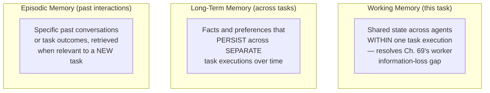

## Introduction

Chapter 69 closed by identifying a concrete gap in its multi-agent architecture: information gathered by one worker could be lost, or lossily summarized, before reaching another worker that needed it — and every prior chapter's agents treated each task as a fully self-contained, one-time execution with no memory of anything before or after. This chapter formalizes **agent memory** across three distinct categories, each addressing a genuinely different limitation: **working memory** (shared context within a single task), **long-term memory** (persistence across separate task executions), and **episodic memory** (recall of specific past interactions to inform future behavior).

## Why "Memory" Isn't One Thing

It's tempting to treat "give the agent memory" as a single, undifferentiated feature to add. This series' consistent diagnostic discipline says otherwise: each memory category addresses a *different* limitation, has a *different* appropriate storage mechanism, and a *different* cost profile.



## Working Memory: Shared State Within a Single Task

Directly resolving Chapter 69's closing gap: a task-scoped, shared store that any agent participating in the current task's execution can read from and write to — distinct from each individual agent's own private ReAct trajectory (Chapter 67).

```python
class WorkingMemory:
    """
    Task-scoped, shared across every agent participating in ONE
    task execution — directly resolves Ch. 69's "research worker's
    full findings get lost before reaching the writing worker" gap.
    """
    def __init__(self, task_id: str):
        self.task_id = task_id
        self._store: dict[str, str] = {}

    def write(self, key: str, value: str, written_by: str) -> None:
        self._store[key] = value  # in production, this persists to a
                                     # shared, external store (Ch. 58's
                                     # infrastructure, repurposed), not
                                     # an in-process dict, so multiple
                                     # agent processes can share it

    def read(self, key: str) -> str | None:
        return self._store.get(key)

    def read_all(self) -> dict[str, str]:
        return dict(self._store)
```

```python
class ResearchWorker:
    def run(self, sub_task: str, working_memory: WorkingMemory) -> str:
        findings = self._conduct_research(sub_task)
        # Write the FULL findings to shared memory, not just what the
        # orchestrator's summary will eventually capture — directly
        # avoiding Ch. 69's identified information-loss failure mode.
        working_memory.write("research_findings", findings, written_by="research_worker")
        return summarize(findings)  # the orchestrator still gets a summary
                                       # for its own reasoning, but the FULL
                                       # detail remains accessible to any
                                       # OTHER agent that needs it


class WritingWorker:
    def run(self, sub_task: str, working_memory: WorkingMemory) -> str:
        # Directly reads the FULL findings, not the orchestrator's
        # potentially lossy intermediate summary.
        full_findings = working_memory.read("research_findings")
        return draft_email(sub_task, full_findings)
```

**Why this must be scoped to a single task execution, not shared globally**: unrestricted, global shared memory across *all* concurrent tasks would directly violate Chapter 55's multi-tenant isolation principle (one user's task could read another's data) and would accumulate stale, irrelevant information across unrelated tasks — working memory's task-scoping is a direct application of Chapter 62's and Chapter 65's isolation discipline, now applied to agent memory rather than retrieval indexes.

## Long-Term Memory: Persistence Across Separate Tasks

Working memory disappears once a task completes. **Long-term memory** persists facts, preferences, or learned context *across* separate, independent task executions — directly analogous to Chapter 58's vector database, and in fact typically implemented using the exact same infrastructure.

```python
class LongTermMemory:
    """
    Persists across SEPARATE task executions — implemented using
    Ch. 58's vector database infrastructure, since "retrieve
    relevant past information given a new context" is EXACTLY
    the similarity-search problem Ch. 58 solved.
    """
    def __init__(self, vector_store, embedding_model):
        self.vector_store = vector_store
        self.embedding_model = embedding_model

    def store(self, fact: str, user_id: str) -> None:
        embedding = self.embedding_model.embed(fact)
        self.vector_store.upsert(
            id=generate_id(), vector=embedding,
            metadata={"fact": fact, "user_id": user_id}  # Ch. 58's
                                                             # metadata
                                                             # filtering
                                                             # for isolation
        )

    def retrieve_relevant(self, current_context: str, user_id: str, top_k: int = 5) -> list[str]:
        query_embedding = self.embedding_model.embed(current_context)
        results = self.vector_store.query(
            query_embedding, top_k=top_k, metadata_filter={"user_id": user_id}
        )
        return [r["fact"] for r in results]
```

**Why this is architecturally identical to a RAG retrieval pipeline (Part 11), just applied to a different corpus**: the corpus here is "things this agent has previously learned about this user or task domain" rather than "company documentation" — every consideration from Chapters 58-63 applies directly: chunking (what constitutes one storable "fact"), embedding consistency, staleness management (a fact learned six months ago may no longer be true), and the same multi-tenant isolation discipline Chapter 62 established, now enforced via the `user_id` metadata filter.

## Episodic Memory: Learning From Specific Past Interactions

A more targeted case of long-term memory: rather than storing generic facts, episodic memory stores **specific past task executions** (including what worked and what didn't) and retrieves the most relevant *prior episode* to inform a new, similar task — directly extending the multi-hop retrieval and RAG concepts of Part 11 to the agent's own operational history rather than an external document corpus.

```python
class EpisodicMemory:
    """
    Stores complete past task trajectories, not just isolated facts
    — retrieval surfaces analogous PAST EXECUTIONS, letting an agent
    learn from precedent without any weight updates (no fine-tuning
    required, Ch. 45's alternative already covered by this series).
    """
    def store_episode(self, task_description: str, trajectory: list[str],
                        outcome: str, success: bool) -> None:
        embedding = self.embedding_model.embed(task_description)
        self.vector_store.upsert(
            id=generate_id(), vector=embedding,
            metadata={"trajectory": trajectory, "outcome": outcome, "success": success}
        )

    def retrieve_similar_episode(self, new_task_description: str) -> dict | None:
        query_embedding = self.embedding_model.embed(new_task_description)
        results = self.vector_store.query(
            query_embedding, top_k=1,
            metadata_filter={"success": True}  # prioritize learning from
                                                   # PAST SUCCESSES, not
                                                   # failures, by default
        )
        return results[0] if results else None
```

**Why this is a genuinely different mechanism from fine-tuning (Chapter 45) for "learning from experience"**: fine-tuning bakes learned patterns into model *weights*, requiring retraining to update (Chapter 48's continual learning cost); episodic memory retrieves relevant precedent *at inference time*, directly analogous to why RAG (Chapter 44) was preferred over fine-tuning for frequently-changing knowledge — an agent's operational experience changes constantly (new episodes accumulate with every task), making retrieval-based episodic memory the architecturally consistent choice for exactly the reasons Chapter 44 established.

## The Cost and Staleness Considerations, Inherited From Part 11

Every memory category built on vector-database infrastructure inherits Part 11's full set of engineering considerations, directly rather than by loose analogy: chunking decisions for what constitutes a storable memory unit (Chapter 61), retrieval quality evaluation (Chapter 66's metrics, applied to "did the agent retrieve the actually-relevant past fact or episode"), and staleness management (Chapter 58) — a stored preference or fact that's since become outdated is exactly the same failure mode as a stale document in a RAG knowledge base, requiring the same synchronization discipline.

## Key Takeaways

- Agent memory is not one feature but three distinct categories, each resolving a different limitation: working memory (shared state within one task, resolving Chapter 69's worker information-loss gap), long-term memory (facts persisting across separate tasks), and episodic memory (retrieving relevant past task executions as precedent).
- Working memory must be scoped to a single task execution, not shared globally, directly applying Chapter 55's and Chapter 62's multi-tenant isolation discipline to prevent cross-task data leakage and stale-context accumulation.
- Long-term and episodic memory are architecturally identical to Part 11's RAG retrieval pipeline applied to a different corpus (the agent's own accumulated knowledge or experience), inheriting every consideration from chunking to staleness management directly rather than by analogy.
- Episodic memory retrieves relevant precedent at inference time rather than baking learned patterns into model weights, making it the architecturally consistent choice for continuously-accumulating operational experience, for exactly the reasons Chapter 44 established RAG over fine-tuning for frequently-changing knowledge.

---

## Interview Questions

**1. Why does this chapter insist on treating working memory, long-term memory, and episodic memory as three distinct systems rather than a single, general-purpose "agent memory" component?**
Each category has a GENUINELY DIFFERENT SCOPE, LIFESPAN, and PURPOSE — working memory exists ONLY for the DURATION of a SINGLE task execution and is SHARED among the agents PARTICIPATING in THAT SPECIFIC task (resolving Chapter 69's information-loss gap); long-term memory PERSISTS INDEFINITELY ACROSS SEPARATE, UNRELATED task executions and is typically SCOPED to a SPECIFIC USER or DOMAIN rather than a specific task; episodic memory is a SPECIALIZED FORM of long-term persistence, but stores COMPLETE PAST TRAJECTORIES (for LEARNING FROM PRECEDENT) rather than SIMPLE, ISOLATED FACTS — collapsing these into a SINGLE, UNDIFFERENTIATED "memory" component would OBSCURE these GENUINELY DIFFERENT ARCHITECTURAL REQUIREMENTS (a working-memory store needs NO PERSISTENCE beyond a single task, while a long-term memory store REQUIRES it; an episodic memory store needs to preserve FULL TRAJECTORIES, while a simple fact store does not) — directly the SAME "different problems require different, correctly-scoped solutions" discipline this series has applied CONSISTENTLY throughout (e.g., Chapter 13's distinction between a feature store and a general database), now applied to this chapter's THREE distinct memory categories.
*Follow-up: What SPECIFIC engineering mistake would likely result from implementing ALL THREE of these memory needs using a SINGLE, undifferentiated storage mechanism, such as simply dumping everything into ONE large vector database with no further structure?*
Without EXPLICIT SCOPING and SEPARATION, a system risks WORKING-MEMORY-SCOPED information (task-specific, TEMPORARY details relevant ONLY to the CURRENT task) being RETRIEVED and SURFACED inappropriately for an ENTIRELY DIFFERENT, LATER task (a genuine DATA LEAKAGE and RELEVANCE problem, since this chapter's working-memory content was NEVER intended to PERSIST or be RELEVANT beyond its ORIGINATING task) — or, CONVERSELY, genuinely persistent, LONG-TERM facts being TREATED as merely TEMPORARY and DISCARDED once a task completes, LOSING valuable, ACCUMULATED knowledge the system should have RETAINED — this kind of SCOPE-CONFUSION failure directly illustrates WHY this chapter insists on EXPLICIT, SEPARATE architectural treatment for EACH memory category, RATHER than allowing them to BLEED INTO a SINGLE, UNDIFFERENTIATED storage mechanism where their GENUINELY DIFFERENT LIFESPANS and SCOPES aren't EXPLICITLY, STRUCTURALLY enforced.

**2. Why must working memory be SCOPED to a single task execution rather than shared globally, connecting this chapter's argument DIRECTLY to Chapter 55's multi-tenant isolation discussion?**
Chapter 55 established that MULTI-TENANT systems require STRICT DATA ISOLATION — one tenant's (or user's) data must NEVER be accessible to a DIFFERENT tenant's requests, REGARDLESS of how CONVENIENT sharing might otherwise seem; UNRESTRICTED, GLOBALLY-SHARED working memory would DIRECTLY VIOLATE this PRINCIPLE — if WORKING MEMORY were shared ACROSS ALL CONCURRENT tasks REGARDLESS of WHICH USER or TENANT initiated them, ONE USER'S sensitive TASK-SPECIFIC information (e.g., research findings about THEIR SPECIFIC business, per Chapter 69's sales-outreach example) could BECOME VISIBLE to a COMPLETELY DIFFERENT USER'S CONCURRENTLY-RUNNING task, a SERIOUS PRIVACY and SECURITY failure directly ANALOGOUS to the MULTI-TENANT isolation failures Chapter 55 and Chapter 62 both WARNED against; additionally, EVEN WITHOUT this CROSS-USER privacy concern, GLOBALLY-SHARED memory would ACCUMULATE INCREASINGLY IRRELEVANT information from UNRELATED, PAST tasks OVER TIME, DEGRADING retrieval RELEVANCE (Chapter 66's CONTEXT PRECISION metric, DIRECTLY APPLICABLE HERE) as the SHARED store GROWS to include VAST AMOUNTS of CONTENT ENTIRELY IRRELEVANT to ANY GIVEN, SPECIFIC current task.
*Follow-up: How would you technically enforce this task-scoping in a PRODUCTION system, beyond simply INSTRUCTING agents to "only use memory relevant to the current task"?*
DIRECTLY analogous to Chapter 62's and Chapter 58's METADATA-FILTERING discipline for MULTI-TENANT vector-database isolation — I'd implement working memory with an EXPLICIT, MANDATORY `task_id` (this chapter's OWN `WorkingMemory.__init__` PARAMETER) SCOPING EVERY READ and WRITE operation, ENFORCED at the STORAGE LAYER ITSELF (a STRUCTURAL, ARCHITECTURAL constraint, DIRECTLY echoing Chapter 68's "a STRUCTURAL constraint is MORE ROBUST than a PURELY INSTRUCTIONAL one" principle) RATHER than RELYING SOLELY on PROMPT-LEVEL instructions asking agents to "ONLY use CURRENT-task-relevant memory" — this GUARANTEES ISOLATION REGARDLESS of ANY individual agent's OWN reasoning or POTENTIAL ERROR, EXACTLY the SAME kind of HARD, STRUCTURAL SAFETY BOUNDARY Chapter 68 established for its RESTRICTED, SELECT-ONLY SQL tool EXAMPLE, now APPLIED to THIS chapter's WORKING-MEMORY isolation REQUIREMENT.

**3. Explain why the chapter describes long-term memory and episodic memory as "architecturally identical to Part 11's RAG retrieval pipeline, applied to a different corpus," rather than as fundamentally new technology.**
BOTH long-term memory and episodic memory SOLVE the EXACT SAME UNDERLYING PROBLEM Part 11's RAG architecture solved — GIVEN a CURRENT QUERY (or, HERE, a CURRENT TASK CONTEXT), FIND the MOST RELEVANT stored CONTENT from a LARGER CORPUS, using EMBEDDING-BASED SIMILARITY SEARCH (Chapter 58) — the ONLY DIFFERENCE is WHAT the CORPUS CONSISTS OF (COMPANY DOCUMENTATION, for RAG's ORIGINAL use case in Part 11; PREVIOUSLY-LEARNED FACTS or PAST TASK TRAJECTORIES, for THIS chapter's memory systems) — EVERY OTHER ARCHITECTURAL COMPONENT (the VECTOR DATABASE, Chapter 58; the EMBEDDING MODEL, Chapter 14; the SIMILARITY SEARCH ALGORITHM, Chapter 59; EVEN the METADATA-FILTERING MECHANISM for ISOLATION, Chapter 62) TRANSFERS DIRECTLY, UNCHANGED — this is DIRECTLY the SAME "RECOGNIZE a SHARED, UNDERLYING PATTERN ACROSS DIFFERENT SURFACE-LEVEL APPLICATIONS" SKILL this SERIES has CONSISTENTLY aimed to BUILD (MOST RECENTLY, Chapter 69's CLOSING DISCUSSION of the SHARED "decompose and SPECIALIZE" PRINCIPLE ACROSS MULTIPLE, SEEMINGLY UNRELATED CONTEXTS), now APPLIED to RECOGNIZING that "AGENT MEMORY" is NOT a GENUINELY NEW TECHNOLOGY, but RATHER a DIRECT, RELABELED APPLICATION of TECHNOLOGY this SERIES has ALREADY covered EXTENSIVELY in Part 11.
*Follow-up: Given this recognition, what SPECIFIC Part 11 CHAPTER's material would you EXPECT to be MOST DIRECTLY and IMMEDIATELY APPLICABLE when DESIGNING the CHUNKING STRATEGY (WHAT CONSTITUTES ONE STORABLE "FACT" or "EPISODE") for a LONG-TERM AGENT MEMORY SYSTEM?**
I'd EXPECT Chapter 61's CHUNKING STRATEGIES material to be MOST DIRECTLY APPLICABLE — the SAME CORE TRADE-OFF Chapter 61 ESTABLISHED (CHUNKS TOO SMALL LOSE NECESSARY CONTEXT; CHUNKS TOO LARGE DILUTE RELEVANCE and WASTE RETRIEVAL BUDGET) APPLIES DIRECTLY and UNCHANGED to DECIDING WHAT CONSTITUTES ONE STORABLE "FACT" in LONG-TERM MEMORY (a FACT TOO NARROWLY SCOPED — e.g., STORING EACH INDIVIDUAL WORD of a LARGER STATEMENT SEPARATELY — WOULD LOSE NECESSARY CONTEXT, EXACTLY LIKE an OVER-CHUNKED DOCUMENT; a FACT TOO BROADLY SCOPED — e.g., STORING an ENTIRE, LENGTHY CONVERSATION as a SINGLE, UNDIFFERENTIATED "FACT" — WOULD DILUTE the SPECIFIC, RELEVANT DETAIL a LATER QUERY MIGHT NEED, EXACTLY LIKE an UNDER-CHUNKED DOCUMENT) — DIRECTLY CONFIRMING this CHAPTER's OWN CLAIM that Part 11's MATERIAL TRANSFERS DIRECTLY, RATHER than REQUIRING an ENTIRELY NEW, MEMORY-SPECIFIC CHUNKING THEORY to be DEVELOPED FROM SCRATCH.

**4. Why does this chapter argue that episodic memory is "architecturally consistent" with Chapter 44's original RAG-versus-fine-tuning framework, rather than being an ARBITRARY design choice?**
Chapter 44 ESTABLISHED that RAG (RETRIEVAL) is PREFERRED over FINE-TUNING SPECIFICALLY when the UNDERLYING KNOWLEDGE CHANGES FREQUENTLY, SINCE FINE-TUNING REQUIRES an EXPENSIVE RETRAINING CYCLE (Chapter 48's CONTINUAL-LEARNING COST) to INCORPORATE NEW INFORMATION, WHILE RETRIEVAL SIMPLY REQUIRES UPDATING an INDEX (Chapter 58's CHEAPER UPSERT OPERATION) — an AGENT's OPERATIONAL EXPERIENCE (the SPECIFIC TASKS it HAS COMPLETED, and WHAT WORKED or DIDN'T) is an EXTREMELY, CONTINUOUSLY, RAPIDLY CHANGING BODY of INFORMATION — NEW EPISODES ACCUMULATE with EVERY SINGLE TASK the AGENT COMPLETES — MAKING IT a TEXTBOOK CASE of EXACTLY the "FREQUENTLY-CHANGING KNOWLEDGE" SCENARIO Chapter 44 IDENTIFIED as FAVORING RETRIEVAL over FINE-TUNING; ATTEMPTING to "TEACH" an AGENT FROM ITS PAST EXPERIENCE via FINE-TUNING (BAKING LEARNED PATTERNS INTO MODEL WEIGHTS) WOULD REQUIRE an IMPRACTICALLY FREQUENT RETRAINING CYCLE (POTENTIALLY AFTER EVERY SINGLE COMPLETED TASK) to STAY CURRENT, EXACTLY the KIND of COST and OPERATIONAL BURDEN Chapter 44's FRAMEWORK WARNS AGAINST for THIS SPECIFIC KIND of RAPIDLY-EVOLVING KNOWLEDGE — MAKING RETRIEVAL-BASED EPISODIC MEMORY the DIRECTLY, PRINCIPLED, EVIDENCE-BASED CHOICE, RATHER than an ARBITRARY DESIGN PREFERENCE.
*Follow-up: Under WHAT SPECIFIC CIRCUMSTANCE might FINE-TUNING STILL be a REASONABLE COMPLEMENT to episodic MEMORY for an AGENT LEARNING FROM EXPERIENCE, RATHER than a STRICTLY INFERIOR ALTERNATIVE?**
IF a SPECIFIC, RECURRING PATTERN or BEHAVIOR EMERGES CONSISTENTLY ACROSS a LARGE NUMBER of PAST EPISODES (e.g., the AGENT CONSISTENTLY LEARNS, ACROSS HUNDREDS of PAST TASKS, that a SPECIFIC PHRASING or APPROACH WORKS BETTER for a CERTAIN CLASS of REQUEST), FINE-TUNING the UNDERLYING MODEL on THIS STABLE, WELL-ESTABLISHED PATTERN (RATHER than CONTINUING to RELY on RETRIEVING and RE-REASONING over INDIVIDUAL PAST EPISODES EVERY SINGLE TIME) COULD BE a REASONABLE, EVIDENCE-JUSTIFIED OPTIMIZATION — DIRECTLY MIRRORING Chapter 44's OWN FRAMEWORK, WHICH RECOGNIZED that a SUFFICIENTLY STABLE, WELL-ESTABLISHED PATTERN (RATHER than RAPIDLY-CHANGING, ONE-OFF KNOWLEDGE) IS PRECISELY WHEN FINE-TUNING BECOMES the MORE APPROPRIATE, COST-EFFECTIVE CHOICE (SINCE the ONE-TIME TRAINING COST IS AMORTIZED OVER MANY FUTURE INFERENCES, RATHER THAN PAYING a RETRIEVAL COST on EVERY SINGLE REQUEST) — ILLUSTRATING that EPISODIC MEMORY and FINE-TUNING AREN'T MUTUALLY EXCLUSIVE, but RATHER APPROPRIATE for DIFFERENT MATURITY STAGES of a GIVEN LEARNED PATTERN (NEWLY-EMERGING, INDIVIDUAL EPISODES FAVOR RETRIEVAL; STABLE, WELL-ESTABLISHED, FREQUENTLY-RECURRING PATTERNS MAY EVENTUALLY JUSTIFY FINE-TUNING).

**5. How would you use this chapter's material to decide WHETHER a specific piece of information an agent encounters during a task should be stored in WORKING memory, LONG-TERM memory, BOTH, or NEITHER?**
I'd apply this CHAPTER's CORE SCOPING DISTINCTION DIRECTLY — if the INFORMATION is ONLY RELEVANT to COMPLETING the CURRENT, SPECIFIC TASK (e.g., an INTERMEDIATE CALCULATION RESULT, or a SPECIFIC DETAIL DISCOVERED DURING research that's ONLY USEFUL for THIS PARTICULAR OUTREACH EMAIL, Chapter 69's EXAMPLE), it BELONGS in WORKING MEMORY ONLY, SINCE PERSISTING IT LONG-TERM WOULD PROVIDE NO FUTURE BENEFIT (it's TASK-SPECIFIC, NOT GENERALIZABLE) WHILE STILL INCURRING LONG-TERM MEMORY's STORAGE and RETRIEVAL-RELEVANCE COSTS (Chapter 61's DILUTION CONCERN, NOW APPLIED to MEMORY RATHER than DOCUMENT CHUNKS); if the INFORMATION represents a GENUINE, DURABLE FACT LIKELY to be RELEVANT ACROSS MULTIPLE, FUTURE, SEPARATE TASKS (e.g., a USER's STATED PREFERENCE, or a STABLE FACT about a COMPANY the AGENT WILL LIKELY INTERACT WITH AGAIN), it BELONGS in LONG-TERM MEMORY (POTENTIALLY IN ADDITION to WORKING MEMORY for the CURRENT TASK'S IMMEDIATE USE) — and INFORMATION that's PURELY TRANSIENT and of NO LASTING VALUE EVEN WITHIN the CURRENT TASK (e.g., a MOMENTARY, ALREADY-SUPERSEDED INTERMEDIATE STATE) BELONGS in NEITHER, AVOIDING UNNECESSARY STORAGE and RETRIEVAL OVERHEAD FOR INFORMATION THAT PROVIDES NO GENUINE FUTURE VALUE.
*Follow-up: WHO or WHAT should be RESPONSIBLE for MAKING this "WHICH MEMORY CATEGORY" DECISION IN a PRODUCTION SYSTEM — a HARD-CODED, RULE-BASED POLICY, or the AGENT'S OWN LLM-DRIVEN REASONING?**
I'd RECOMMEND a HYBRID APPROACH — for INFORMATION TYPES that are CONSISTENTLY, PREDICTABLY of a SPECIFIC CATEGORY (e.g., an EXPLICITLY-STATED USER PREFERENCE SHOULD ALWAYS BE ROUTED to LONG-TERM MEMORY, as a HARD-CODED, RELIABLE RULE, DIRECTLY ANALOGOUS to Chapter 68's PREFERENCE for STRUCTURAL, ARCHITECTURAL CONSTRAINTS over PURELY INSTRUCTIONAL ONES WHEREVER a RELIABLE, PREDICTABLE PATTERN EXISTS), while for MORE AMBIGUOUS, CONTEXT-DEPENDENT CASES (WHERE WHETHER a SPECIFIC PIECE of INFORMATION IS GENUINELY TASK-SPECIFIC or GENUINELY DURABLE DEPENDS on NUANCED, CASE-BY-CASE JUDGMENT), I'D LET the AGENT's OWN REASONING (Chapter 67's ReAct PATTERN) MAKE THIS DETERMINATION DYNAMICALLY, TREATING "STORE THIS TO LONG-TERM MEMORY" AS ITS OWN, EXPLICIT TOOL (Chapter 68's TOOL-USE ARCHITECTURE) the AGENT CAN CHOOSE TO INVOKE WHEN ITS OWN REASONING JUDGES a PIECE of INFORMATION GENUINELY WORTH PERSISTING — COMBINING the RELIABILITY of a HARD-CODED RULE FOR PREDICTABLE CASES WITH the FLEXIBILITY of AGENT REASONING FOR GENUINELY AMBIGUOUS ONES, RATHER THAN FORCING a SINGLE, UNIFORM DECISION MECHANISM ACROSS BOTH KINDS of CASES.

**6. In an interview, if asked to design the memory architecture for a personal AI assistant that should "remember my preferences across conversations," how would you use this chapter's THREE-CATEGORY framework to structure your answer?**
I'd EXPLICITLY IDENTIFY this REQUIREMENT as PRIMARILY a LONG-TERM MEMORY NEED (this chapter's SECOND CATEGORY) — SINCE "REMEMBER MY PREFERENCES ACROSS CONVERSATIONS" IS EXACTLY the "PERSIST FACTS ACROSS SEPARATE, INDEPENDENT INTERACTIONS" USE CASE THIS CHAPTER's LONG-TERM MEMORY ARCHITECTURE ADDRESSES DIRECTLY — I'D PROPOSE STORING EACH DISTINCT, EXPLICITLY-STATED or CONFIDENTLY-INFERRED PREFERENCE as a SEPARATE, EMBEDDABLE "FACT" (Chapter 61's CHUNKING DISCIPLINE, APPLIED HERE) in a VECTOR-DATABASE-BACKED LONG-TERM MEMORY STORE (this CHAPTER's `LongTermMemory` CLASS), SCOPED PER-USER (this CHAPTER's `user_id` METADATA FILTER, DIRECTLY EXTENDING Chapter 62's MULTI-TENANT ISOLATION DISCIPLINE) — and I'D ADDITIONALLY USE WORKING MEMORY (this CHAPTER's FIRST CATEGORY) WITHIN a SINGLE, ONGOING CONVERSATION SESSION to MAINTAIN CONTEXT ACROSS MULTIPLE TURNS WITHIN that SAME SESSION, DISTINCT FROM the LONGER-TERM PREFERENCE STORE that PERSISTS ACROSS ENTIRELY SEPARATE SESSIONS.
*Follow-up: How would you HANDLE a situation WHERE the USER EXPLICITLY STATES a NEW PREFERENCE that DIRECTLY CONTRADICTS a PREVIOUSLY-STORED PREFERENCE in LONG-TERM MEMORY?*
I'D IMPLEMENT an EXPLICIT UPDATE MECHANISM (DIRECTLY ANALOGOUS to Chapter 58's NECESSARY DELETE/UPDATE CAPABILITY FOR a RAG KNOWLEDGE BASE) that, UPON DETECTING a NEW, EXPLICITLY-STATED PREFERENCE, SPECIFICALLY CHECKS WHETHER an EXISTING, RELATED PREFERENCE ALREADY EXISTS IN LONG-TERM MEMORY (via a SIMILARITY SEARCH AGAINST the SAME PREFERENCE CATEGORY, Chapter 58's RETRIEVAL MECHANISM) and, IF SO, UPDATES or REPLACES the OUTDATED PREFERENCE RATHER THAN SIMPLY APPENDING a NEW, POTENTIALLY CONTRADICTORY ENTRY — DIRECTLY APPLYING Chapter 58's STALENESS-MANAGEMENT DISCIPLINE (KEEPING a KNOWLEDGE BASE SYNCHRONIZED WITH the CURRENT, ACTUAL TRUTH, RATHER THAN ALLOWING OUTDATED, SUPERSEDED INFORMATION TO PERSIST INDEFINITELY) TO THIS SPECIFIC, USER-PREFERENCE CONTEXT, ENSURING the AGENT's LONG-TERM MEMORY REFLECTS the USER's CURRENT, ACTUAL PREFERENCES RATHER THAN AN INCONSISTENT, POTENTIALLY CONTRADICTORY ACCUMULATION OF EVERY PREFERENCE EVER STATED, REGARDLESS OF WHETHER LATER STATEMENTS SUPERSEDED EARLIER ONES.

**7. Why might STORING an AGENT's OWN PAST FAILURES (not just successes) in EPISODIC MEMORY be VALUABLE, even though this CHAPTER's `retrieve_similar_episode` CODE example FILTERS SPECIFICALLY for `success: True` BY DEFAULT?**
WHILE RETRIEVING PAST SUCCESSES AS PRECEDENT (this CHAPTER's DEFAULT BEHAVIOR) HELPS an AGENT REPLICATE APPROACHES that HAVE PREVIOUSLY WORKED WELL, RETRIEVING PAST FAILURES CAN BE EQUALLY OR EVEN MORE VALUABLE FOR a DIFFERENT, COMPLEMENTARY PURPOSE — SPECIFICALLY, HELPING the AGENT AVOID REPEATING a PREVIOUSLY-UNSUCCESSFUL APPROACH FOR a SIMILAR TASK — IF an AGENT PREVIOUSLY ATTEMPTED a SPECIFIC STRATEGY FOR a SIMILAR TASK and IT FAILED, SURFACING THIS PAST FAILURE (ALONGSIDE, OR INSTEAD OF, a PAST SUCCESS) COULD DIRECTLY HELP the AGENT's CURRENT REASONING AVOID a KNOWN, DOCUMENTED DEAD END, RATHER THAN POTENTIALLY REDISCOVERING the SAME FAILURE INDEPENDENTLY — this IS DIRECTLY ANALOGOUS to HOW a SKILLED HUMAN PROFESSIONAL LEARNS AS MUCH (OR MORE) FROM THEIR OWN PAST MISTAKES AS FROM THEIR PAST SUCCESSES, and SUGGESTS this CHAPTER's DEFAULT `success: True` FILTER, WHILE a REASONABLE STARTING POINT, REPRESENTS an INCOMPLETE USE of EPISODIC MEMORY's FULL POTENTIAL VALUE.
*Follow-up: HOW would you MODIFY this CHAPTER's `retrieve_similar_episode` METHOD to LEVERAGE BOTH PAST SUCCESSES and PAST FAILURES, WITHOUT SIMPLY REMOVING the `success` FILTER ENTIRELY (WHICH COULD RE-INTRODUCE CONFUSION BETWEEN THESE TWO GENUINELY DIFFERENT KINDS of PRECEDENT)?**
I'D MODIFY the METHOD to RETRIEVE BOTH the MOST RELEVANT PAST SUCCESS AND the MOST RELEVANT PAST FAILURE SEPARATELY (TWO DISTINCT RETRIEVAL CALLS, EACH WITH ITS OWN `success` FILTER VALUE), THEN EXPLICITLY LABEL EACH RESULT WHEN PRESENTING IT to the AGENT's REASONING PROCESS (e.g., "A SIMILAR PAST TASK SUCCEEDED USING THIS APPROACH: [...]" ALONGSIDE "A SIMILAR PAST TASK FAILED WHEN IT ATTEMPTED THIS APPROACH: [...]") — this EXPLICIT LABELING DIRECTLY EXTENDS Chapter 67's "MAKE REASONING INPUTS EXPLICIT and DISTINGUISHABLE" PRINCIPLE, ENSURING the AGENT's SUBSEQUENT REASONING CAN CORRECTLY DISTINGUISH BETWEEN "REPLICATE THIS" and "AVOID THIS" PRECEDENT, RATHER THAN RISKING CONFUSION IF BOTH KINDS OF EPISODES WERE SIMPLY MIXED TOGETHER, UNDIFFERENTIATED, IN a SINGLE, COMBINED RETRIEVAL RESULT.

**8. How would you use this chapter's material to explain WHY a MEMORY SYSTEM STORING an AGENT's PAST INTERACTIONS could ITSELF become a SIGNIFICANT PRIVACY and DATA-GOVERNANCE CONCERN, connecting DIRECTLY to Chapter 11's DATA GOVERNANCE DISCUSSION?**
LONG-TERM and EPISODIC MEMORY, BY DESIGN, PERSIST INFORMATION ABOUT a USER's SPECIFIC INTERACTIONS, PREFERENCES, and TASK HISTORY OVER TIME — this IS EXACTLY the KIND of PERSONAL, POTENTIALLY SENSITIVE DATA Chapter 11's DATA GOVERNANCE DISCUSSION ADDRESSED — a USER's RIGHT to HAVE THEIR DATA DELETED (a "RIGHT TO BE FORGOTTEN" REQUIREMENT, DIRECTLY ANALOGOUS to Chapter 58's ORIGINAL DISCUSSION of WHY a RAG VECTOR DATABASE NEEDS a RELIABLE DELETE CAPABILITY FOR COMPLIANCE REASONS) APPLIES DIRECTLY and EQUALLY to an AGENT's LONG-TERM and EPISODIC MEMORY STORES — a MEMORY SYSTEM THAT ONLY SUPPORTS ADDING NEW MEMORIES, WITHOUT a RELIABLE, COMPLETE DELETION CAPABILITY, WOULD CREATE the EXACT SAME KIND of SERIOUS COMPLIANCE GAP Chapter 58 IDENTIFIED FOR a RAG KNOWLEDGE BASE, NOW APPLIED to a USER's OWN PERSONAL, ACCUMULATED INTERACTION HISTORY — MAKING THIS a GENUINELY IMPORTANT, NON-OPTIONAL ARCHITECTURAL REQUIREMENT FOR ANY PRODUCTION AGENT MEMORY SYSTEM, RATHER THAN a MINOR IMPLEMENTATION DETAIL.
*Follow-up: WHY might DELETING a USER's DATA from EPISODIC MEMORY SPECIFICALLY be MORE TECHNICALLY COMPLEX than DELETING it FROM a SIMPLE LONG-TERM FACT STORE, GIVEN this CHAPTER's DESCRIPTION of WHAT EPISODIC MEMORY STORES?**
EPISODIC MEMORY STORES COMPLETE TASK TRAJECTORIES (this CHAPTER's `store_episode` METHOD, INCLUDING the FULL REASONING TRAJECTORY and OUTCOME), WHICH MAY REFERENCE or INCLUDE INFORMATION about MULTIPLE DIFFERENT ENTITIES (NOT JUST the REQUESTING USER THEMSELVES, but POTENTIALLY OTHER PEOPLE, COMPANIES, or DETAILS MENTIONED DURING that SPECIFIC TASK's EXECUTION) — THIS MEANS a SINGLE DELETION REQUEST (e.g., "DELETE ALL MY DATA") MIGHT NEED to CAREFULLY DISTINGUISH BETWEEN INFORMATION THAT'S GENUINELY and EXCLUSIVELY ABOUT the REQUESTING USER (WHICH SHOULD BE FULLY DELETED) VERSUS INFORMATION WITHIN THE SAME STORED EPISODE THAT MIGHT BE RELEVANT to OR ABOUT SOMEONE ELSE ENTIRELY (WHICH MIGHT NEED TO BE RETAINED, OR HANDLED DIFFERENTLY, DEPENDING ON THE SPECIFIC DATA-GOVERNANCE REQUIREMENTS INVOLVED) — THIS IS a GENUINELY MORE NUANCED, HARDER DELETION PROBLEM THAN a SIMPLE FACT STORE (WHERE EACH STORED "FACT" IS TYPICALLY MORE NARROWLY, UNAMBIGUOUSLY SCOPED TO A SINGLE USER OR ENTITY), REQUIRING MORE CAREFUL, EPISODE-SPECIFIC DATA-GOVERNANCE DESIGN THAN a SIMPLER LONG-TERM FACT STORE'S DELETION MECHANISM MIGHT NEED.

**9. How would you use this chapter's material to design an EVALUATION strategy SPECIFICALLY for an agent's LONG-TERM MEMORY RETRIEVAL, EXTENDING Chapter 66's RAG EVALUATION METRICS to this NEW CONTEXT?**
I'D DIRECTLY APPLY Chapter 66's FOUR CORE METRICS (CONTEXT PRECISION, CONTEXT RECALL, FAITHFULNESS, ANSWER RELEVANCE), REINTERPRETED for THIS SPECIFIC MEMORY-RETRIEVAL CONTEXT — CONTEXT PRECISION WOULD MEASURE WHETHER the RETRIEVED PAST FACTS or PREFERENCES ARE ACTUALLY RELEVANT to the CURRENT TASK (NOT JUST GENERICALLY, VAGUELY RELATED); CONTEXT RECALL WOULD MEASURE WHETHER ALL GENUINELY RELEVANT, PREVIOUSLY-STORED FACTS WERE SUCCESSFULLY RETRIEVED (NOT JUST SOME SUBSET); FAITHFULNESS WOULD MEASURE WHETHER the AGENT's SUBSEQUENT BEHAVIOR ACTUALLY, CORRECTLY REFLECTS the RETRIEVED MEMORY (RATHER THAN IGNORING IT or CONTRADICTING IT); and ANSWER RELEVANCE WOULD MEASURE WHETHER the AGENT's RESULTING BEHAVIOR ACTUALLY, MEANINGFULLY BENEFITS FROM HAVING ACCESS TO THIS MEMORY (RATHER THAN THE MEMORY BEING TECHNICALLY RETRIEVED BUT NOT GENUINELY UTILIZED IN a WAY THAT IMPROVES the FINAL OUTCOME) — DIRECTLY CONFIRMING THIS CHAPTER's OWN CLAIM THAT MEMORY RETRIEVAL "INHERITS PART 11's FULL SET of ENGINEERING CONSIDERATIONS DIRECTLY RATHER THAN BY LOOSE ANALOGY," NOW EXTENDED SPECIFICALLY to ITS EVALUATION METHODOLOGY AS WELL.
*Follow-up: WHY might CONSTRUCTING a GROUND-TRUTH TEST SET for THIS SPECIFIC EVALUATION (ANALOGOUS to Chapter 65's `RAGEvaluationGate` TEST QUERIES) be GENUINELY HARDER for AGENT MEMORY THAN for a STANDARD RAG KNOWLEDGE BASE?**
a STANDARD RAG KNOWLEDGE BASE's GROUND TRUTH (Chapter 65) IS TYPICALLY ESTABLISHED FROM a FIXED, ALREADY-EXISTING DOCUMENT CORPUS WHERE HUMAN REVIEWERS CAN DIRECTLY, INDEPENDENTLY VERIFY WHAT the "CORRECT" SOURCE FOR a GIVEN TEST QUERY SHOULD BE; AGENT MEMORY'S GROUND TRUTH, BY CONTRAST, DEPENDS ON THE AGENT's OWN, PRIOR, ACCUMULATED INTERACTION HISTORY — WHICH IS UNIQUE TO EACH SPECIFIC USER and CONTINUOUSLY EVOLVING OVER TIME, MEANING a STATIC, PRE-CONSTRUCTED TEST SET (THE WAY CHAPTER 65's RAG EVALUATION GATE USES) IS GENUINELY HARDER TO ESTABLISH and MAINTAIN FOR THIS CONTEXT — REQUIRING EITHER a CAREFULLY-CONSTRUCTED, SYNTHETIC TEST SCENARIO (SIMULATING a SPECIFIC, KNOWN SEQUENCE OF PAST INTERACTIONS and THEN TESTING WHETHER SUBSEQUENT MEMORY RETRIEVAL CORRECTLY SURFACES THE RELEVANT PRIOR CONTEXT) OR a MORE ONGOING, LIVE EVALUATION APPROACH (DIRECTLY OBSERVING REAL USER INTERACTIONS OVER TIME AND ASSESSING WHETHER MEMORY RETRIEVAL GENUINELY IMPROVES SUBSEQUENT TASK OUTCOMES, RATHER THAN RELYING SOLELY ON a FIXED, PRE-CONSTRUCTED OFFLINE TEST SET), ILLUSTRATING a GENUINE, NEW EVALUATION-METHODOLOGY CHALLENGE THIS PERSONALIZED, EVOLVING MEMORY CONTEXT INTRODUCES BEYOND WHAT CHAPTER 65's STATIC RAG TEST SET DESIGN DIRECTLY PROVIDES.

**10. How would you handle a stakeholder's request to give an agent UNLIMITED, PERMANENT LONG-TERM MEMORY of EVERYTHING it EVER encounters, CITING a desire for "MAXIMUM PERSONALIZATION"?**
I'D DIRECTLY APPLY THIS CHAPTER's and Chapter 61's DILUTION-and-COST CONCERNS — an EVER-GROWING, UNBOUNDED LONG-TERM MEMORY STORE WOULD INCUR CONTINUOUSLY INCREASING STORAGE COST (Chapter 58's DISCUSSION) and, MORE IMPORTANTLY, WOULD LIKELY DEGRADE RETRIEVAL PRECISION OVER TIME (Chapter 66's METRIC, DIRECTLY APPLICABLE HERE) as the STORE ACCUMULATES an INCREASING VOLUME of INCREASINGLY OLD, POTENTIALLY OUTDATED, or GENUINELY IRRELEVANT INFORMATION THAT COULD "COMPETE" WITH and DILUTE the RELEVANCE of GENUINELY USEFUL, CURRENT MEMORIES DURING RETRIEVAL (DIRECTLY ANALOGOUS TO Chapter 61's "LARGE CHUNKS DILUTE RELEVANCE" CONCERN, NOW APPLIED to an EVER-GROWING MEMORY STORE'S OVERALL CONTENT RATHER THAN a SINGLE DOCUMENT's SIZE) — I'D PROPOSE, INSTEAD, an EXPLICIT MEMORY RETENTION and RELEVANCE-DECAY POLICY (DIRECTLY ANALOGOUS TO CHAPTER 58's STALENESS-MANAGEMENT DISCIPLINE) — PERIODICALLY ARCHIVING or DEPRIORITIZING OLDER, LESS-FREQUENTLY-RELEVANT MEMORIES, RATHER THAN PURSUING an UNBOUNDED, "STORE EVERYTHING FOREVER" APPROACH THAT THIS CHAPTER's OWN PRINCIPLES SUGGEST WOULD LIKELY UNDERMINE, RATHER THAN GENUINELY MAXIMIZE, the STAKEHOLDER's ACTUAL, UNDERLYING GOAL of EFFECTIVE PERSONALIZATION.
*Follow-up: HOW would you specifically DETERMINE WHICH OLDER MEMORIES to ARCHIVE or DEPRIORITIZE, RATHER THAN APPLYING a SIMPLE, ARBITRARY TIME-BASED CUTOFF (e.g., "DELETE ANYTHING OLDER THAN 6 MONTHS")?**
RATHER THAN a PURELY ARBITRARY, TIME-BASED CUTOFF (WHICH COULD INAPPROPRIATELY DISCARD a GENUINELY STABLE, STILL-RELEVANT PREFERENCE SIMPLY BECAUSE IT WAS STATED LONG AGO), I'D RECOMMEND a USAGE-BASED, EVIDENCE-DRIVEN RETENTION POLICY — TRACKING HOW FREQUENTLY EACH STORED MEMORY IS ACTUALLY RETRIEVED and UTILIZED IN SUBSEQUENT TASKS (DIRECTLY ANALOGOUS to Chapter 33's OBSERVABILITY DISCIPLINE, NOW APPLIED to MEMORY UTILIZATION RATHER THAN SYSTEM PERFORMANCE), and SPECIFICALLY DEPRIORITIZING or ARCHIVING MEMORIES THAT ARE BOTH OLD AND CONSISTENTLY UNRETRIEVED (SUGGESTING GENUINE, DEMONSTRATED IRRELEVANCE) RATHER THAN MEMORIES THAT ARE OLD BUT STILL FREQUENTLY and USEFULLY RETRIEVED (SUGGESTING GENUINE, ONGOING RELEVANCE DESPITE THEIR AGE) — THIS EVIDENCE-BASED APPROACH DIRECTLY FOLLOWS THIS SERIES' CONSISTENT "USE MEASURED, ACTUAL USAGE DATA TO INFORM RETENTION and LIFECYCLE DECISIONS, RATHER THAN an ARBITRARY, UNVALIDATED HEURISTIC" PRINCIPLE (ECHOING, FOR EXAMPLE, CHAPTER 59's EVIDENCE-BASED INDEX-REBUILD-CADENCE DISCUSSION), NOW APPLIED TO THIS SPECIFIC MEMORY-RETENTION-POLICY DECISION.

**11. How would you use this chapter's material to explain WHY a WORKING MEMORY implementation using a SIMPLE, IN-PROCESS DICTIONARY (as this CHAPTER's ILLUSTRATIVE `WorkingMemory` CLASS uses) would be INSUFFICIENT for a REAL, PRODUCTION MULTI-AGENT SYSTEM?**
THIS CHAPTER's OWN CODE COMMENT EXPLICITLY FLAGS THIS LIMITATION — a SIMPLE, IN-PROCESS DICTIONARY IS ONLY ACCESSIBLE WITHIN a SINGLE, RUNNING PROCESS; a REAL PRODUCTION MULTI-AGENT SYSTEM (CHAPTER 69) LIKELY RUNS DIFFERENT AGENTS as SEPARATE, INDEPENDENT PROCESSES or SERVICES (POSSIBLY EVEN ON DIFFERENT MACHINES ENTIRELY, ESPECIALLY FOR a SYSTEM SCALED TO HANDLE SIGNIFICANT PRODUCTION TRAFFIC, DIRECTLY CONNECTING to THIS SERIES' EARLIER DISTRIBUTED-SYSTEMS DISCUSSIONS IN ITS HLD-FOCUSED MATERIAL) — a SIMPLE IN-PROCESS DICTIONARY WOULD BE ENTIRELY INVISIBLE and INACCESSIBLE to a DIFFERENT AGENT RUNNING IN a SEPARATE PROCESS, COMPLETELY DEFEATING THE PURPOSE of "SHARED" WORKING MEMORY (Chapter 69's ORIGINAL MOTIVATION) — REQUIRING an EXTERNAL, SHARED STORAGE MECHANISM (a DISTRIBUTED CACHE LIKE REDIS, OR a LIGHTWEIGHT DATABASE) THAT MULTIPLE, SEPARATE AGENT PROCESSES CAN ALL RELIABLY READ FROM and WRITE TO, RATHER THAN THIS CHAPTER's SIMPLIFIED, ILLUSTRATIVE, SINGLE-PROCESS-ONLY IMPLEMENTATION.
*Follow-up: WHAT SPECIFIC, ADDITIONAL ENGINEERING CONCERN (BEYOND SIMPLE CROSS-PROCESS ACCESSIBILITY) WOULD THIS EXTERNAL, SHARED STORAGE MECHANISM NEED TO ADDRESS, GIVEN THAT MULTIPLE AGENTS MIGHT ATTEMPT TO READ FROM or WRITE TO WORKING MEMORY CONCURRENTLY?**
I'D NEED to ADDRESS CONCURRENT ACCESS and POTENTIAL RACE CONDITIONS — if TWO AGENTS ATTEMPT to WRITE to the SAME WORKING-MEMORY KEY SIMULTANEOUSLY (a GENUINELY PLAUSIBLE SCENARIO in a MULTI-AGENT SYSTEM WHERE MULTIPLE WORKERS MIGHT BE OPERATING CONCURRENTLY, PER CHAPTER 69's ARCHITECTURE), WITHOUT PROPER CONCURRENCY CONTROL, ONE WRITE COULD SILENTLY OVERWRITE the OTHER, POTENTIALLY LOSING GENUINELY IMPORTANT INFORMATION — THIS IS a CLASSIC, WELL-UNDERSTOOD DISTRIBUTED-SYSTEMS CHALLENGE (LIKELY COVERED IN GREATER DEPTH IN THIS SERIES' HLD-FOCUSED SYSTEM DESIGN MATERIAL) REQUIRING APPROPRIATE CONCURRENCY-CONTROL MECHANISMS (ATOMIC WRITES, OPTIMISTIC OR PESSIMISTIC LOCKING, OR AN APPEND-ONLY, VERSIONED WRITE PATTERN RATHER THAN a SIMPLE "OVERWRITE" SEMANTIC) TO ENSURE MULTIPLE, CONCURRENTLY-OPERATING AGENTS CAN SAFELY and RELIABLY SHARE THIS WORKING MEMORY WITHOUT SILENTLY CORRUPTING or LOSING EACH OTHER's CONTRIBUTIONS — a GENUINELY IMPORTANT, PRODUCTION-GRADE ENGINEERING CONCERN THIS CHAPTER's SIMPLIFIED, ILLUSTRATIVE CODE DOESN'T ADDRESS BUT a REAL IMPLEMENTATION MUST.

**12. How would you use this chapter's material to push back on an assumption that "GIVING an AGENT MEMORY AUTOMATICALLY MAKES IT SMARTER or MORE CAPABLE"?**
DIRECTLY ECHOING THIS SERIES' RECURRING "INFRASTRUCTURE DOESN'T AUTOMATICALLY GUARANTEE QUALITY" THEME (E.G., CHAPTER 58's "HAVING a VECTOR DATABASE DOESN'T AUTOMATICALLY GUARANTEE GOOD RETRIEVAL" ARGUMENT) — MEMORY, LIKE RETRIEVAL, IS INFRASTRUCTURE THAT EFFICIENTLY STORES and SURFACES INFORMATION, but WHETHER THIS SURFACED INFORMATION ACTUALLY, GENUINELY IMPROVES the AGENT'S SUBSEQUENT REASONING and BEHAVIOR DEPENDS ENTIRELY ON WHETHER the AGENT's UNDERLYING REASONING PROCESS (CHAPTER 67's ReAct LOOP) CORRECTLY and APPROPRIATELY INCORPORATES this RETRIEVED MEMORY — an AGENT COULD HAVE a PERFECTLY FUNCTIONING, TECHNICALLY-CORRECT MEMORY SYSTEM THAT SUCCESSFULLY RETRIEVES GENUINELY RELEVANT PAST INFORMATION, WHILE STILL FAILING to PRODUCE BETTER OUTCOMES IF ITS REASONING PROCESS DOESN'T EFFECTIVELY USE THAT RETRIEVED INFORMATION (DIRECTLY ANALOGOUS to CHAPTER 66's "HIGH CONTEXT PRECISION/RECALL BUT LOW ANSWER RELEVANCE" FAILURE PATTERN, WHERE the RETRIEVAL COMPONENT WORKS WELL but the GENERATION/REASONING COMPONENT FAILS to PROPERLY USE WHAT WAS RETRIEVED) — "HAVING MEMORY" and "EFFECTIVELY USING MEMORY" ARE GENUINELY SEPARATE CONCERNS, EXACTLY the SAME "INFRASTRUCTURE VERSUS EFFECTIVE UTILIZATION" DISTINCTION THIS SERIES HAS CONSISTENTLY EMPHASIZED THROUGHOUT ITS COVERAGE of RAG, RETRIEVAL, and NOW AGENT MEMORY.
*Follow-up: WHAT SPECIFIC TEST WOULD DIRECTLY VALIDATE WHETHER an AGENT's MEMORY SYSTEM IS GENUINELY IMPROVING TASK OUTCOMES, RATHER THAN MERELY BEING TECHNICALLY FUNCTIONAL?**
I'D RUN a CONTROLLED, A/B-STYLE COMPARISON (DIRECTLY EXTENDING CHAPTER 22's EXPERIMENTAL DISCIPLINE and CHAPTER 65's EVALUATION-GATE METHODOLOGY) — MEASURING the AGENT's TASK-COMPLETION SUCCESS RATE and QUALITY ON a REPRESENTATIVE SET of TEST TASKS, WITH MEMORY RETRIEVAL ENABLED VERSUS DISABLED (OR WITH a DELIBERATELY DEGRADED, LESS-RELEVANT MEMORY RETRIEVAL) — IF ENABLING MEMORY RETRIEVAL PRODUCES a MEASURABLE, STATISTICALLY MEANINGFUL IMPROVEMENT IN ACTUAL TASK OUTCOMES (NOT JUST a TECHNICAL CONFIRMATION THAT "RELEVANT MEMORIES WERE SUCCESSFULLY RETRIEVED"), THIS PROVIDES GENUINE, DIRECT EVIDENCE THAT the MEMORY SYSTEM IS ACTUALLY DELIVERING ITS INTENDED VALUE, RATHER THAN MERELY BEING a TECHNICALLY-FUNCTIONING BUT PRACTICALLY-INERT PIECE of INFRASTRUCTURE — DIRECTLY FOLLOWING THIS SERIES' CONSISTENT PRINCIPLE that GENUINE VALUE SHOULD BE VALIDATED THROUGH MEASURED, DOWNSTREAM OUTCOMES, NOT MERELY THROUGH CONFIRMING THAT an INDIVIDUAL COMPONENT IS TECHNICALLY OPERATING AS DESIGNED IN ISOLATION.

**13. How would you use this chapter's material to explain, at a system-design level, why AGENT MEMORY represents the point where THIS SERIES' RAG MATERIAL (PART 11) and AGENTIC MATERIAL (THIS PART) GENUINELY CONVERGE, rather than remaining TWO SEPARATE TOPICS?**
THIS CHAPTER HAS EXPLICITLY DEMONSTRATED that LONG-TERM and EPISODIC MEMORY ARE, ARCHITECTURALLY, RAG SYSTEMS (Part 11's ENTIRE APPARATUS — VECTOR DATABASES, EMBEDDING MODELS, CHUNKING, RETRIEVAL EVALUATION) APPLIED to a DIFFERENT CORPUS (the AGENT's OWN ACCUMULATED KNOWLEDGE and EXPERIENCE, RATHER THAN EXTERNAL DOCUMENTATION) — THIS MEANS a SOPHISTICATED, PRODUCTION-GRADE AGENTIC SYSTEM (THIS PART's TOPIC) GENUINELY, DIRECTLY DEPENDS ON and INCORPORATES RAG INFRASTRUCTURE (PART 11's TOPIC) as ONE of ITS CORE, CONSTITUENT COMPONENTS, RATHER THAN THESE BEING TWO INDEPENDENT, UNRELATED AREAS of THIS SERIES' CURRICULUM — DIRECTLY CONFIRMING CHAPTER 66's OWN CLOSING PREDICTION (THAT "THIS ENTIRE PART's MATERIAL... BECOMES a DIRECTLY REUSABLE COMPONENT THAT PART 12's AGENTIC ARCHITECTURES WILL VERY LIKELY INCORPORATE") — THIS CHAPTER SERVES AS THE CONCRETE, DIRECT REALIZATION of THAT EARLIER PREDICTION, ILLUSTRATING THAT THIS SERIES' CURRICULUM ISN'T a SEQUENCE of INDEPENDENT, UNRELATED TOPICS but a PROGRESSIVELY-BUILDING, INTERCONNECTED BODY of KNOWLEDGE WHERE LATER TOPICS GENUINELY, DIRECTLY BUILD UPON and REUSE EARLIER MATERIAL.
*Follow-up: GIVEN THIS CONVERGENCE, WHAT SPECIFIC ADVICE WOULD YOU GIVE a READER WHO FEELS THEY "DIDN'T FULLY MASTER" Part 11's RAG MATERIAL BEFORE PROCEEDING TO THIS AGENTIC MATERIAL?**
I'D DIRECTLY RECOMMEND REVISITING Part 11's SPECIFIC CHAPTERS (ESPECIALLY CHAPTER 58's VECTOR DATABASE FOUNDATIONS, CHAPTER 61's CHUNKING DISCIPLINE, and CHAPTER 66's EVALUATION METRICS) BEFORE PROCEEDING FURTHER INTO THIS PART's REMAINING CHAPTERS, SINCE THIS CHAPTER HAS NOW EXPLICITLY DEMONSTRATED THAT a GENUINE, WORKING UNDERSTANDING of THOSE FOUNDATIONAL RAG CONCEPTS IS A DIRECT PREREQUISITE FOR PROPERLY UNDERSTANDING and IMPLEMENTING AGENT MEMORY CORRECTLY — RATHER THAN TREATING PART 11 AS a "COMPLETED, PAST TOPIC" NOW THAT THIS SERIES HAS MOVED ON TO PART 12, a READER SHOULD RECOGNIZE (PER THIS CHAPTER's EXPLICIT DEMONSTRATION) THAT PART 11's MATERIAL REMAINS ACTIVELY, DIRECTLY RELEVANT and NECESSARY GOING FORWARD, MAKING A RETURN TO SOLIDIFY THAT FOUNDATIONAL UNDERSTANDING a GENUINELY WORTHWHILE INVESTMENT BEFORE CONTINUING DEEPER INTO THIS PART's REMAINING, MORE ADVANCED AGENTIC MATERIAL.

**14. How would you use this chapter's THREE-CATEGORY MEMORY FRAMEWORK to DESIGN a MEMORY ARCHITECTURE for an AI CODING ASSISTANT that WORKS ACROSS MULTIPLE SESSIONS on the SAME LARGE SOFTWARE PROJECT?**
I'D MAP EACH of THIS CHAPTER's THREE CATEGORIES to a SPECIFIC, CONCRETE NEED FOR THIS USE CASE — WORKING MEMORY WOULD HOLD CONTEXT SPECIFIC to the CURRENT CODING SESSION (WHICH FILES ARE CURRENTLY BEING EDITED, WHAT SPECIFIC BUG IS BEING INVESTIGATED RIGHT NOW), SHARED ACROSS ANY SUB-AGENTS INVOLVED in THIS SPECIFIC SESSION (E.G., a "CODE SEARCH" WORKER and a "CODE GENERATION" WORKER, Chapter 69's MULTI-AGENT PATTERN); LONG-TERM MEMORY WOULD STORE STABLE, PROJECT-LEVEL FACTS THAT PERSIST ACROSS SEPARATE SESSIONS (THE PROJECT's ARCHITECTURE CONVENTIONS, CODING STYLE PREFERENCES, KNOWN "GOTCHAS" or NON-OBVIOUS DEPENDENCIES SPECIFIC to THIS CODEBASE); and EPISODIC MEMORY WOULD STORE SPECIFIC PAST DEBUGGING or IMPLEMENTATION EPISODES (E.G., "LAST TIME a SIMILAR BUG WAS ENCOUNTERED, THIS SPECIFIC ROOT CAUSE and FIX WAS FOUND"), RETRIEVED as PRECEDENT WHEN a NEW, SIMILAR ISSUE ARISES — DIRECTLY DEMONSTRATING HOW THIS CHAPTER's GENERAL, THREE-CATEGORY FRAMEWORK MAPS CLEANLY ONTO a CONCRETE, REALISTIC APPLICATION DOMAIN DISTINCT FROM THIS CHAPTER's OWN ILLUSTRATIVE EXAMPLES.
*Follow-up: WHY MIGHT THIS SPECIFIC APPLICATION (a CODING ASSISTANT) benefit PARTICULARLY STRONGLY FROM EPISODIC MEMORY SPECIFICALLY, COMPARED to SOME OTHER AGENTIC APPLICATIONS THIS PART HAS DISCUSSED?**
SOFTWARE DEBUGGING and DEVELOPMENT GENUINELY, FREQUENTLY INVOLVE RECURRING, ANALOGOUS PROBLEM PATTERNS WITHIN a SPECIFIC, LARGE CODEBASE — a BUG's ROOT CAUSE or a SPECIFIC IMPLEMENTATION APPROACH THAT WORKED WELL FOR ONE FEATURE OFTEN GENUINELY GENERALIZES to a SIMILAR, LATER SITUATION WITHIN THE SAME CODEBASE (DUE to SHARED ARCHITECTURAL PATTERNS, SHARED DEPENDENCIES, or SHARED TEAM CONVENTIONS SPECIFIC to THIS PROJECT) — THIS MAKES THE "RETRIEVE a SIMILAR PAST EPISODE AS PRECEDENT" VALUE PROPOSITION (THIS CHAPTER's CORE EPISODIC-MEMORY ARGUMENT) PARTICULARLY STRONG and DIRECTLY APPLICABLE FOR THIS SPECIFIC DOMAIN, COMPARED TO, SAY, a CUSTOMER-SUPPORT AGENT (Chapter 68's EXAMPLE) WHERE EACH CUSTOMER's SPECIFIC SITUATION MIGHT BE MORE GENUINELY UNIQUE and LESS LIKELY to HAVE a DIRECTLY, CLOSELY ANALOGOUS PAST PRECEDENT WORTH RETRIEVING — ILLUSTRATING THAT WHILE THIS CHAPTER's THREE-CATEGORY FRAMEWORK IS GENERALLY APPLICABLE, THE RELATIVE VALUE and PRIORITY of EACH SPECIFIC MEMORY CATEGORY CAN GENUINELY VARY BASED ON THE SPECIFIC APPLICATION DOMAIN's OWN CHARACTERISTICS (HOW OFTEN GENUINELY ANALOGOUS PAST SITUATIONS RECUR), REQUIRING THE SAME KIND of APPLICATION-SPECIFIC, EVIDENCE-BASED CALIBRATION THIS SERIES HAS CONSISTENTLY RECOMMENDED FOR EVERY OTHER ARCHITECTURAL DECISION.

**15. How would you summarize, for someone moving on to Chapter 71's orchestration FRAMEWORKS discussion, why this chapter's MEMORY SYSTEMS material is a NECESSARY PREREQUISITE for THAT NEXT CHAPTER's PRACTICAL, FRAMEWORK-LEVEL TREATMENT?**
CHAPTER 71 WILL COVER SPECIFIC, EXISTING SOFTWARE FRAMEWORKS (LangChain, LlamaIndex, LangGraph) that PROVIDE PRE-BUILT IMPLEMENTATIONS of MANY of THE CONCEPTS THIS PART HAS COVERED SO FAR — the ReAct LOOP (Chapter 67), TOOL/FUNCTION-CALLING INTERFACES (Chapter 68), MULTI-AGENT ORCHESTRATION PATTERNS (Chapter 69), and, DIRECTLY RELEVANT HERE, MEMORY ABSTRACTIONS (THIS CHAPTER) — WITHOUT THIS CHAPTER's CONCEPTUAL FOUNDATION (UNDERSTANDING the GENUINE DIFFERENCE BETWEEN WORKING, LONG-TERM, and EPISODIC MEMORY, and WHY EACH REQUIRES DIFFERENT SCOPING and STORAGE CHARACTERISTICS), a READER ENCOUNTERING a SPECIFIC FRAMEWORK's "MEMORY" ABSTRACTION (WHICH MIGHT BE LABELED GENERICALLY, WITHOUT THIS CHAPTER's CAREFUL, EXPLICIT CATEGORY DISTINCTIONS) WOULD RISK MISUNDERSTANDING WHICH SPECIFIC KIND of MEMORY NEED a GIVEN FRAMEWORK FEATURE ACTUALLY ADDRESSES, OR INCORRECTLY ASSUMING a FRAMEWORK's DEFAULT MEMORY IMPLEMENTATION AUTOMATICALLY HANDLES ALL THREE of THIS CHAPTER's DISTINCT CATEGORIES WELL, WITHOUT THIS CHAPTER's EXPLICIT UNDERSTANDING of WHY THESE ARE GENUINELY SEPARATE, DIFFERENTLY-SCOPED CONCERNS THAT A GIVEN FRAMEWORK MIGHT ADDRESS WITH VARYING DEGREES of SOPHISTICATION and CORRECTNESS.
*Follow-up: WHAT SPECIFIC, CONCRETE QUESTION WOULD YOU RECOMMEND a READER ASK WHEN EVALUATING a NEW ORCHESTRATION FRAMEWORK's "MEMORY" FEATURE, DIRECTLY INFORMED BY THIS CHAPTER's THREE-CATEGORY DISTINCTION?**
I'D RECOMMEND ASKING, SPECIFICALLY and EXPLICITLY: "WHICH of THIS CHAPTER's THREE MEMORY CATEGORIES (WORKING, LONG-TERM, or EPISODIC) DOES THIS FRAMEWORK's 'MEMORY' FEATURE ACTUALLY IMPLEMENT, and DOES IT PROVIDE the SCOPING, ISOLATION, and PERSISTENCE GUARANTEES THIS CHAPTER ESTABLISHED as NECESSARY FOR THAT SPECIFIC CATEGORY (E.G., PROPER TASK-SCOPING and MULTI-TENANT ISOLATION FOR WORKING MEMORY, PER THIS CHAPTER's EARLIER DISCUSSION)?" — RATHER THAN ACCEPTING a FRAMEWORK's GENERIC "WE SUPPORT MEMORY" MARKETING CLAIM AT FACE VALUE (DIRECTLY ECHOING THIS SERIES' CONSISTENT VENDOR-CLAIM SKEPTICISM, E.G., CHAPTER 59's and CHAPTER 64's SIMILAR "VALIDATE VENDOR CLAIMS AGAINST YOUR OWN SPECIFIC REQUIREMENTS" DISCIPLINE) — THIS SPECIFIC, CATEGORY-AWARE QUESTION, DIRECTLY ENABLED BY THIS CHAPTER's CAREFUL CONCEPTUAL GROUNDWORK, EQUIPS a READER TO EVALUATE Chapter 71's FRAMEWORKS WITH GENUINE, INFORMED PRECISION, RATHER THAN TREATING "MEMORY SUPPORT" AS a SINGLE, UNDIFFERENTIATED FEATURE CHECKBOX.
