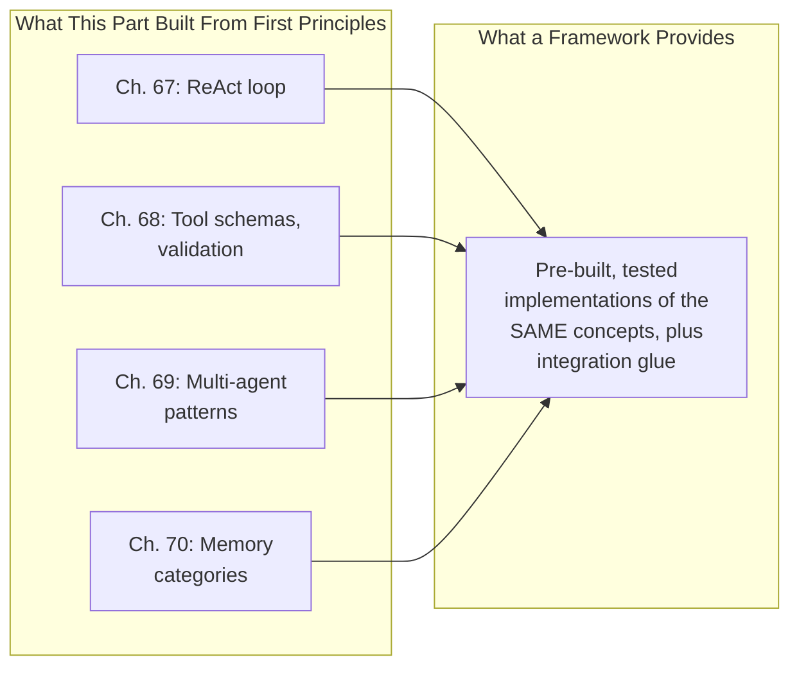

## Introduction

Chapter 70 closed with a concrete question to ask of any framework's "memory" feature: which of the three categories does it actually implement, and does it provide the scoping and isolation guarantees that category requires. This chapter generalizes that question to the entire framework landscape: what LangChain, LlamaIndex, and LangGraph actually provide beyond the concepts Chapters 67-70 already established, and the build-vs-buy discipline (Chapter 41) for deciding whether to adopt one, and which.

## Frameworks Provide Implementation, Not New Concepts

Every framework covered in this chapter implements the *same* underlying concepts this Part has already built from first principles: ReAct loops (Chapter 67), tool/function-calling interfaces (Chapter 68), multi-agent orchestration patterns (Chapter 69), and memory abstractions (Chapter 70). This is deliberate and important: understanding a framework's value requires first understanding what it's actually automating, exactly the same "understand the underlying mechanism before adopting the abstraction" discipline Chapter 52 applied to LLM serving frameworks.



## LangChain: General-Purpose Agent and Chain Orchestration

LangChain provides pre-built abstractions for chaining LLM calls together (directly generalizing Chapter 43's prompt-composition patterns), a standardized tool interface (Chapter 68's schema-based function calling, abstracted across multiple LLM providers so a tool definition doesn't need to be rewritten per provider), and pre-built agent executors implementing the ReAct loop (Chapter 67) without requiring the custom `react_loop` implementation this Part wrote from scratch.

```python
# Illustrative LangChain-style usage — the framework provides the
# loop, parsing, and provider-abstraction machinery Ch. 67-68 built
# manually; the CONCEPTS (tool schema, ReAct loop) are unchanged.
from langchain.agents import initialize_agent
from langchain.tools import Tool

tools = [
    Tool(name="search_knowledge_base", func=search_kb,
         description="Search internal docs. Do NOT use for order status."),  # Ch. 68's
                                                                                 # negative-guidance
                                                                                 # principle, unchanged
]
agent = initialize_agent(tools, llm, agent_type="react")  # Ch. 67's loop, pre-built
response = agent.run("What's our refund policy?")
```

**What this genuinely saves versus a from-scratch implementation**: the provider-abstraction layer (switching underlying LLMs without rewriting tool-calling logic, directly analogous to Chapter 57's gateway abstraction), pre-tested parsing and error-handling for the ReAct loop's edge cases, and a large ecosystem of pre-built tool integrations (search, databases, APIs) that would otherwise need to be built and validated individually.

## LlamaIndex: Retrieval-Centric Orchestration

Where LangChain is general-purpose, LlamaIndex specializes specifically in the RAG and retrieval concerns of Part 11 — providing pre-built implementations of chunking strategies (Chapter 61), hybrid search (Chapter 62), and re-ranking (Chapter 63) as configurable pipeline components, alongside agent orchestration capabilities layered on top.

```python
# Illustrative LlamaIndex-style usage — directly implementing Part
# 11's RAG pipeline (Ch. 60's architecture) as configured components
# rather than the from-scratch pipeline Ch. 65 built manually.
from llama_index import VectorStoreIndex, ServiceContext

index = VectorStoreIndex.from_documents(
    documents, chunk_size=512,  # Ch. 61's chunking, as a parameter
)
query_engine = index.as_query_engine(
    similarity_top_k=10, rerank=True,  # Ch. 62-63's hybrid search
                                          # and re-ranking, as flags
)
```

**When LlamaIndex is the more appropriate choice over LangChain**: when an application's core need is genuinely retrieval-centric (Chapter 65's evaluation gate would confirm this — high context precision/recall requirements dominate the failure analysis) rather than broad, multi-tool agentic orchestration — directly the same "choose the tool built for your actual, diagnosed need" discipline this series applied to vector database selection (Chapter 58) and serving framework choice (Chapter 52).

## LangGraph: Explicit State Machines for Complex Agent Flows

Chapter 67's ReAct loop and Chapter 69's multi-agent patterns are both, structurally, graphs of possible transitions between states (reasoning, acting, observing, delegating). LangGraph makes this graph structure **explicit and inspectable** rather than implicit in a loop's control flow — directly addressing the debugging difficulty Chapter 69 flagged for nested, multi-agent systems.

```python
# Illustrative LangGraph-style usage — the SAME orchestrator-worker
# pattern from Ch. 69, but with EXPLICIT state transitions rather
# than implicit control flow, directly addressing Ch. 69's
# debugging-complexity concern.
from langgraph.graph import StateGraph

graph = StateGraph(AgentState)
graph.add_node("orchestrator", orchestrator_step)
graph.add_node("research_worker", research_worker_step)
graph.add_node("writing_worker", writing_worker_step)
graph.add_conditional_edges("orchestrator", route_to_worker)  # explicit,
                                                                  # inspectable
                                                                  # routing logic
```

**Why explicit state graphs directly address Chapter 69's debugging concern**: Chapter 69 argued that multi-agent debugging requires tracing through multiple nested reasoning traces to isolate a responsible level — an explicit graph structure makes the *possible* transitions and *actual* execution path a first-class, visualizable artifact (directly extending Chapter 67's "explicit reasoning trace as explainability" principle from the level of a single agent's thoughts to the level of an entire multi-agent system's control flow), rather than requiring a system designer to reconstruct this structure by reading through nested log traces after the fact.

## The Build-vs-Buy Decision, Applied to Orchestration Frameworks

Directly extending Chapter 41's build-vs-buy framework:

| Consideration | Favors a Framework | Favors Building In-House |
|---|---|---|
| Team's familiarity with the underlying concepts (Chapters 67-70) | Either way — but a team that doesn't understand the concepts will misuse *any* abstraction, framework or not | N/A |
| Need for rapid prototyping across many tool integrations | Framework (pre-built integrations) | — |
| Highly specific, unusual control-flow requirements | — | In-house (frameworks impose their own opinions about structure) |
| Long-term maintenance and debugging transparency | — | In-house, or LangGraph's explicit-graph approach specifically |
| Team's capacity to track and adapt to fast-moving framework API changes | — | In-house (this ecosystem changes rapidly; a framework dependency is an ongoing maintenance cost, Chapter 41's discussion) |

**Why this table's first row matters most**: exactly as Chapter 52 warned for serving frameworks, a team that adopts LangChain or LlamaIndex *without* first understanding Chapters 67-70's underlying concepts is likely to misconfigure the framework, misinterpret its abstractions, or fail to recognize when the framework's default behavior doesn't match their specific needs — the framework accelerates implementation of a well-understood design; it does not substitute for the design understanding itself.

## Key Takeaways

- Orchestration frameworks implement the same concepts this Part built from first principles (ReAct, tool schemas, multi-agent patterns, memory) — their value is pre-built, tested implementation and provider-abstraction, not new underlying concepts.
- LangChain provides general-purpose chaining and agent orchestration; LlamaIndex specializes in retrieval-centric orchestration directly implementing Part 11's RAG pipeline as configurable components; LangGraph makes agent control flow an explicit, inspectable state graph.
- LangGraph's explicit state-graph structure directly addresses Chapter 69's multi-agent debugging concern by making the system's control flow a first-class, visualizable artifact rather than implicit in nested control-flow code.
- Framework adoption follows the same build-vs-buy discipline as Chapter 41 and Chapter 52's serving-framework discussion — a team must understand the underlying concepts first, since a framework accelerates implementation of a well-understood design rather than substituting for that understanding.

---

## Interview Questions

**1. Why does this chapter insist that "understanding a framework's value requires first understanding what it's actually automating," directly connecting this to Chapter 52's serving-framework discussion?**
Chapter 52 established that a serving framework like vLLM automates specific, well-understood serving techniques (continuous batching, KV cache management) — a team that adopts vLLM without understanding these underlying techniques cannot correctly diagnose a performance problem, since they'd have no framework (in the conceptual sense) for reasoning about whether an observed behavior is expected or a genuine misconfiguration; this chapter's orchestration frameworks present the identical risk at the agentic-system level — a team that adopts LangChain's agent executor without understanding Chapter 67's ReAct loop, Chapter 68's tool-validation discipline, or Chapter 69's failure-propagation concerns has no basis for diagnosing why their agent selects the wrong tool, fails to recover from an error, or produces an unexpectedly expensive multi-agent execution — the framework provides implementation, but diagnosis and correct configuration still require the underlying conceptual understanding this Part built chapter by chapter.
*Follow-up: What's a concrete symptom you'd expect to observe from a team that adopted a framework without this underlying understanding, distinguishing it from a team that understands the concepts but chose the framework for legitimate efficiency reasons?*
A team lacking the underlying understanding would likely treat framework defaults as fixed, unquestionable behavior rather than configurable choices they can reason about and tune — for example, accepting a default tool-selection prompt template without recognizing (per Chapter 68's tool-description discipline) that ambiguous tool descriptions are causing selection errors, or accepting a default `max_steps` value without connecting it to Chapter 67's cost and safety-bound reasoning — a team with genuine conceptual understanding, by contrast, would treat the SAME framework defaults as a reasonable starting point they actively validate and adjust based on Chapter 65's evaluation-gate methodology, using the framework's implementation as a foundation for informed tuning rather than accepting its defaults uncritically.

**2. Why might LlamaIndex be described as the more appropriate choice for a "genuinely retrieval-centric" application, while LangChain might be more appropriate for a "broad, multi-tool agentic" application, rather than either framework being universally superior?**
This directly reflects this series' consistent "match the tool to the diagnosed need" discipline (Chapter 58's vector database selection, Chapter 52's serving framework choice) — LlamaIndex's core design investment is in the RAG pipeline's specific stages (Chapter 61's chunking, Chapter 62's hybrid search, Chapter 63's re-ranking, all exposed as first-class, well-tuned configuration options), making it the framework with the deepest, most mature support for exactly the concerns that dominate a retrieval-centric application's engineering effort; LangChain's core design investment is in general-purpose chaining and broad tool/agent orchestration across MANY different tool types and use cases, making it better suited to an application whose core challenge is COORDINATING diverse capabilities (Chapter 69's multi-agent patterns) rather than optimizing one specific retrieval pipeline — an application genuinely dominated by ONE of these two concerns is better served by the framework that has invested MOST DEEPLY in solving that SPECIFIC concern well, rather than a framework that treats it as one capability among many, less-deeply-optimized ones.
*Follow-up: How would you determine, for a NEW application with BOTH significant retrieval needs AND significant multi-tool orchestration needs, whether to use LlamaIndex, LangChain, or both together?**
I'd apply Chapter 65's diagnostic evaluation methodology to determine which concern is genuinely the CURRENT BOTTLENECK for this specific application — if retrieval quality (Chapter 66's metrics) is the primary, measured limiting factor on overall system quality, I'd lean toward LlamaIndex's deeper retrieval capabilities, potentially using it specifically for the retrieval STAGE while still incorporating broader tool orchestration around it (many real systems DO combine these frameworks, using LlamaIndex's retrieval engine as ONE TOOL, per Chapter 68's tool-use architecture, within a LangChain-orchestrated broader agent) — rather than treating this as an EITHER/OR choice, recognizing that these frameworks address genuinely different, and often COMPLEMENTARY, layers of a complete system, directly the same "complementary techniques, not mutually exclusive alternatives" pattern this series has established repeatedly (Chapter 62's hybrid search, Chapter 63's re-ranking).

**3. Explain why LangGraph's explicit state-graph structure is described as extending "Chapter 67's explicit reasoning trace as explainability principle" from a single agent to an entire multi-agent system.**
Chapter 67 established that making a SINGLE agent's reasoning explicit (the visible "Thought" step) transforms an otherwise opaque decision process into an inspectable, debuggable artifact; Chapter 69 then identified that a MULTI-AGENT system's debugging difficulty stems from needing to trace through MULTIPLE, NESTED reasoning traces across DIFFERENT agent levels to isolate a responsible failure point — LangGraph's explicit state graph applies the SAME underlying "make the structure explicit rather than implicit" principle at this HIGHER, system-wide level: rather than the overall control flow (which agent gets invoked when, under what conditions) being IMPLICIT in nested function calls and conditional logic scattered across the codebase, LangGraph represents this control flow as a FIRST-CLASS, INSPECTABLE GRAPH OBJECT that can be directly visualized and traced — this is the identical explainability principle Chapter 67 established for a single agent's THOUGHTS, now applied to an entire multi-agent system's STRUCTURE.
*Follow-up: What specific NEW debugging capability does this explicit graph structure provide that Chapter 69's own recommended "hierarchical, structured trace" logging approach (from Chapter 69's own interview answer) does NOT provide?*
Chapter 69's structured-trace logging approach captures WHAT ACTUALLY HAPPENED during a specific execution (a record of the actual path taken) but doesn't necessarily capture WHAT COULD HAVE HAPPENED — the full space of possible transitions and branches the system was designed to support; LangGraph's explicit graph definition captures the COMPLETE, INTENDED STRUCTURE of the system (every possible node and edge, defined before any execution occurs) as a static, inspectable artifact, allowing a system designer to reason about and validate the system's OVERALL DESIGN (are all the intended transitions actually reachable? Is there a dead-end state? Does the graph correctly reflect the intended orchestrator-worker relationships from Chapter 69?) independently of any SPECIFIC execution trace — this provides a design-time validation capability that a purely execution-time trace log, however well-structured, cannot provide on its own.

**4. Why does this chapter's build-vs-buy table identify "team's capacity to track and adapt to fast-moving framework API changes" as a specific consideration favoring in-house development, connecting this to Chapter 41's original build-vs-buy discussion?**
Chapter 41's original build-vs-buy framework established that adopting an external dependency isn't a one-time cost but an ONGOING commitment — the dependency's own evolution (API changes, deprecations, new required upgrade paths) becomes a maintenance burden the adopting team must continuously track and adapt to; the agentic-orchestration-framework ecosystem specifically (LangChain, LlamaIndex, LangGraph) has historically evolved and changed its APIs quite rapidly, reflecting the genuinely fast-moving, still-maturing nature of this specific technology area — a team adopting one of these frameworks takes on a GENUINELY HIGHER ongoing-maintenance burden than adopting a more mature, slowly-evolving dependency would represent, directly extending Chapter 41's general "the total cost of a dependency includes its ongoing evolution, not just its initial integration" principle to this specific, notably fast-changing category of framework.
*Follow-up: How would you weigh this ongoing-maintenance cost against the framework's upfront implementation-acceleration benefit, for a team deciding whether to adopt one of these frameworks TODAY, given this specific characteristic?*
I'd apply Chapter 41's general cost-benefit framework directly — estimating the team's expected TIME HORIZON for this specific application (a short-term prototype or proof-of-concept has a much smaller exposure to ongoing API-change costs than a multi-year production system), and weighing the framework's genuine UPFRONT acceleration benefit (faster initial implementation, pre-built tool integrations) against the ESTIMATED ongoing cost of tracking and adapting to the framework's expected rate of change over that SPECIFIC time horizon — for a short-term prototype, the upfront acceleration likely dominates, favoring framework adoption; for a long-term, mission-critical production system, the ongoing-maintenance cost becomes proportionally more significant, potentially favoring a more conservative choice (a more mature, slower-changing dependency, or in-house development of only the SPECIFIC subset of framework functionality genuinely needed, avoiding the OVERHEAD of tracking framework changes for functionality the application doesn't even use) — directly the same time-horizon-sensitive cost-benefit calculus Chapter 41 established for build-vs-buy decisions generally.

**5. How would you use this chapter's material to explain why a team should NOT expect a framework to resolve Chapter 68's semantic validation requirement or Chapter 69's failure-propagation handling automatically, simply by adopting the framework?**
Both semantic validation (Chapter 68 — does this specific order ID actually exist, is this user authorized) and failure-propagation handling (Chapter 69 — how should an orchestrator respond to a worker's open-ended reasoning failure) are fundamentally BUSINESS-LOGIC-SPECIFIC concerns that depend on the SPECIFIC application's own domain, data, and authorization rules — no general-purpose framework can possibly know, out of the box, what constitutes a valid order ID for a SPECIFIC company's SPECIFIC order system, or what an ACCEPTABLE quality bar looks like for a SPECIFIC worker's SPECIFIC sub-task type — a framework can provide the STRUCTURAL SCAFFOLDING for WHERE this validation or failure-handling logic should be plugged in (an explicit hook or callback point in the framework's tool-execution or agent-delegation flow), but the actual, SPECIFIC validation and failure-handling LOGIC itself remains the application team's own responsibility to implement, directly reinforcing this chapter's core message that a framework accelerates implementation of a well-understood design rather than substituting for the underlying design work itself.
*Follow-up: What specific, concrete mistake would you expect a team to make if they incorrectly assumed a framework's default tool-execution flow already includes adequate semantic validation?*
A team making this incorrect assumption would likely deploy a system where a syntactically well-formed but semantically incorrect tool call (Chapter 68's `transfer_funds` example — a correctly-typed but wrong recipient account) executes WITHOUT the kind of business-logic check this chapter and Chapter 68 established as necessary, since the framework's default flow only guarantees SCHEMA conformance (which most frameworks DO provide out of the box, since it's a general, provider-supported capability) — this could result in exactly the kind of real-world, consequential error Chapter 68's safety discussion warned against, DESPITE the team having "used a framework" that they might have assumed provided comprehensive safety by default — this illustrates precisely why understanding the STRUCTURAL versus SEMANTIC validation distinction (Chapter 68's core argument) remains essential even when working within a framework, since the framework's OUT-OF-THE-BOX behavior addresses only the structural half of this distinction.

**6. In an interview, if asked "should we build our multi-agent orchestration system in-house or use LangGraph," how would you use this chapter's material to give a well-reasoned answer rather than a simple yes/no?**
I'd apply this chapter's build-vs-buy table directly, asking clarifying questions (per Chapter 2's framework) about the SPECIFIC factors that table identifies — does the team already have a solid, demonstrated understanding of Chapters 67-70's underlying concepts (if not, I'd flag that ANY choice here risks misuse until that understanding is built first, regardless of framework); how UNUSUAL or HIGHLY SPECIFIC are this system's control-flow requirements (a highly novel, non-standard orchestration pattern might not fit LangGraph's opinions well, favoring in-house); how IMPORTANT is long-term debugging transparency for this SPECIFIC system (a system with significant safety or compliance requirements, per Chapter 68's high-consequence-tool discussion, might particularly benefit from LangGraph's explicit-graph debugging advantage this chapter identified); and what's the team's EXPECTED TIME HORIZON and CAPACITY to track LangGraph's own API evolution (per the PREVIOUS question's discussion) — I'd synthesize these SPECIFIC, application-relevant answers into a recommendation, rather than defaulting to either "always build in-house for maximum control" or "always use the popular framework" without this kind of specific, evidence-based reasoning.
*Follow-up: What SPECIFIC combination of these factors would MOST STRONGLY point toward LangGraph specifically, RATHER than LangChain's simpler agent executor or a from-scratch implementation?*
A system with GENUINELY COMPLEX, multi-agent control flow (Chapter 69's hierarchical or peer-to-peer patterns, RATHER than a SIMPLE, single-agent ReAct loop that LangChain's basic executor already handles well) COMBINED with a GENUINE, HIGH-PRIORITY need for debugging transparency and design-time validation (per THIS chapter's earlier discussion of LangGraph's specific advantage over trace-log-only debugging) would MOST STRONGLY favor LangGraph specifically — a SIMPLER, single-agent system wouldn't benefit MEANINGFULLY from LangGraph's explicit-graph machinery (since there's little COMPLEX CONTROL FLOW to make explicit in the first place, echoing this series' consistent "don't add architectural complexity beyond what's genuinely needed" principle), while a system with GENUINELY COMPLEX orchestration but LOW debugging-transparency priority might reasonably still use LangChain's SIMPLER agent abstractions DESPITE the complexity, if the team is confident in their ability to debug it through OTHER means (Chapter 69's structured-logging approach) — illustrating that LangGraph's SPECIFIC value proposition (explicit, inspectable control flow) is most CLEARLY justified when BOTH genuine complexity AND genuine debugging-transparency need are SIMULTANEOUSLY present.

**7. Why might a team need to re-validate their agent's behavior (using Chapter 65's evaluation-gate methodology) after upgrading a framework's version, even without changing any of their OWN application code?**
Directly extending Chapter 65's and Chapter 68's "any component change requires full regression testing" discipline — a framework VERSION UPGRADE can change the framework's INTERNAL implementation of the ReAct loop (Chapter 67), its default prompt templates for tool descriptions (Chapter 68), or its default parsing/error-handling behavior, EVEN IF the application team's own code (their tool definitions, their business logic) remains UNCHANGED — since the framework's INTERNAL behavior directly and materially affects the agent's OBSERVED behavior (exactly the SAME "any change to a component that shapes model behavior requires regression testing" principle Chapter 43 established for system prompts, and Chapter 68 established for tool schemas), a framework version upgrade is FUNCTIONALLY EQUIVALENT to a significant configuration change from the perspective of this series' regression-testing discipline, warranting the SAME "test the whole system before deploying" treatment as any other configuration change this series has covered.
*Follow-up: Why might this specific risk (framework upgrades silently changing agent behavior) be GREATER for these fast-moving agentic frameworks than for a more mature, stable dependency like a standard database driver?*
A mature, STABLE dependency like a standard database driver typically has a WELL-ESTABLISHED, SLOWLY-EVOLVING API contract with STRONG BACKWARD-COMPATIBILITY GUARANTEES, meaning a version upgrade is UNLIKELY to silently change observable BEHAVIOR in a way that would require FULL regression testing; these AGENTIC orchestration frameworks, BY CONTRAST, are STILL RAPIDLY EVOLVING (per this chapter's earlier build-vs-buy discussion), and their INTERNAL implementation details (default PROMPT TEMPLATES, default TOOL-DESCRIPTION FORMATTING, default ERROR-HANDLING logic) are PRECISELY the KIND of DETAIL that's LIKELY to change BETWEEN VERSIONS as the framework MATURES and its MAINTAINERS DISCOVER better APPROACHES — making THIS SPECIFIC RISK (silent behavior CHANGES from a version UPGRADE) GENUINELY MORE PRONOUNCED for THIS CATEGORY of framework than for a MORE MATURE, STABLE dependency, directly reinforcing WHY this chapter's REGRESSION-TESTING recommendation is PARTICULARLY IMPORTANT HERE, RATHER than a GENERIC, UNIVERSALLY-APPLICABLE caution that would apply EQUALLY to EVERY SINGLE dependency UPGRADE regardless of its MATURITY and STABILITY PROFILE.

**8. How would you use this chapter's material to explain why a framework's pre-built tool INTEGRATIONS (e.g., a pre-built "web search" tool) still require the SAME semantic validation discipline (Chapter 68) as a custom, in-house-built tool?**
A framework's pre-built tool integration provides the STRUCTURAL, MECHANICAL implementation of INVOKING an external service (making the actual API call, HANDLING the RESPONSE FORMAT) — but the SEMANTIC VALIDATION requirement (Chapter 68's core argument — is the SPECIFIC RESULT actually CORRECT and APPROPRIATE for THIS APPLICATION's SPECIFIC context) is a CONCERN that's ENTIRELY INDEPENDENT of WHETHER the tool's IMPLEMENTATION was WRITTEN by the application team or PROVIDED by a framework — a PRE-BUILT "web search" tool, for EXAMPLE, might RETURN results that are TECHNICALLY VALID (a REAL, WELL-FORMED search result) but STILL INAPPROPRIATE for a SPECIFIC APPLICATION's NEEDS (e.g., RETURNING a RESULT from an UNTRUSTWORTHY SOURCE, or a RESULT that's OUTSIDE THE APPLICATION's INTENDED SCOPE) — the FRAMEWORK CANNOT KNOW, out of the BOX, what CONSTITUTES an ACCEPTABLE or APPROPRIATE result for THIS SPECIFIC APPLICATION, MEANING the APPLICATION TEAM STILL NEEDS to IMPLEMENT this SEMANTIC validation LAYER (Chapter 68's ARGUMENT) REGARDLESS of WHETHER the UNDERLYING tool ITSELF was BUILT IN-HOUSE or PROVIDED by a FRAMEWORK's PRE-BUILT INTEGRATION.
*Follow-up: Why might teams be MORE LIKELY to SKIP this semantic validation step SPECIFICALLY for FRAMEWORK-PROVIDED tools, compared to their OWN, custom-built tools — and why would this be a GENUINE MISTAKE?*
Teams MIGHT be MORE LIKELY to SKIP this STEP for FRAMEWORK-PROVIDED tools DUE to an UNWARRANTED ASSUMPTION that a WIDELY-USED, PROFESSIONALLY-MAINTAINED framework INTEGRATION has "ALREADY BEEN VALIDATED" or IS SOMEHOW INHERENTLY SAFER SIMPLY BECAUSE IT'S WIDELY ADOPTED — this is a GENUINE MISTAKE BECAUSE, as this ANSWER's FIRST PARAGRAPH ESTABLISHED, SEMANTIC VALIDITY IS INHERENTLY APPLICATION-SPECIFIC and CANNOT BE PRE-VALIDATED by ANY GENERIC framework REGARDLESS of ITS POPULARITY or MATURITY — this ILLUSTRATES a GENERAL, IMPORTANT PRINCIPLE this CHAPTER has now ESTABLISHED: FRAMEWORK ADOPTION REDUCES the STRUCTURAL/MECHANICAL implementation BURDEN, but NEVER REDUCES the APPLICATION-SPECIFIC VALIDATION and SAFETY-DESIGN RESPONSIBILITY THIS PART has CONSISTENTLY EMPHASIZED THROUGHOUT (Chapter 68's SEMANTIC VALIDATION LAYER, Chapter 69's FAILURE-HANDLING LOGIC) — a MISTAKEN "the FRAMEWORK HANDLES THIS" ASSUMPTION is EXACTLY the KIND of GAP that COULD ALLOW a GENUINELY UNSAFE or INCORRECT AGENT BEHAVIOR to REACH PRODUCTION UNDETECTED.

**9. How would you design a monitoring strategy for a production agentic system BUILT ON one of these frameworks, connecting Chapter 33's observability discipline to this chapter's framework-specific context?**
I'd ensure the framework's INTERNAL execution details (WHICH tool was SELECTED, WHAT reasoning trace was GENERATED, Chapter 67's THOUGHT steps, and Chapter 69's DELEGATION decisions if using MULTI-AGENT orchestration) are EXPLICITLY SURFACED and LOGGED, RATHER THAN treating the FRAMEWORK as an OPAQUE BLACK BOX that ONLY reports its FINAL OUTPUT — MOST frameworks PROVIDE HOOKS or CALLBACKS SPECIFICALLY for this PURPOSE (directly EXTENDING Chapter 33's OBSERVABILITY DISCIPLINE to REQUIRE that ANY ADOPTED framework SUPPORT this KIND of DETAILED, STAGE-BY-STAGE VISIBILITY, RATHER than a FRAMEWORK CHOICE THAT ONLY EXPOSES a SIMPLE, UNDIFFERENTIATED "HERE'S the FINAL ANSWER" INTERFACE) — I'D SPECIFICALLY VALIDATE, BEFORE COMMITTING to a SPECIFIC framework CHOICE, that IT PROVIDES SUFFICIENT INSTRUMENTATION HOOKS to SUPPORT the KIND of STAGE-BY-STAGE, DECOMPOSED MONITORING this ENTIRE PART has ESTABLISHED as NECESSARY (Chapter 67's REASONING TRACE, Chapter 68's TOOL-SELECTION and VALIDATION TRACKING, Chapter 69's MULTI-AGENT HIERARCHICAL TRACING) — MAKING "does THIS framework PROVIDE ADEQUATE OBSERVABILITY HOOKS" an EXPLICIT, IMPORTANT CRITERION in the FRAMEWORK-SELECTION DECISION ITSELF, RATHER THAN an AFTERTHOUGHT DISCOVERED ONLY AFTER a FRAMEWORK has ALREADY BEEN ADOPTED and a PRODUCTION issue ARISES THAT the framework's DEFAULT LOGGING doesn't ADEQUATELY SUPPORT DIAGNOSING.
*Follow-up: WHY might THIS SPECIFIC CRITERION (OBSERVABILITY HOOK AVAILABILITY) be an UNDER-WEIGHTED CONSIDERATION when TEAMS FIRST EVALUATE a NEW framework, COMPARED to MORE OBVIOUS CRITERIA LIKE EASE OF INITIAL SETUP or BREADTH of TOOL INTEGRATIONS?**
TEAMS EVALUATING a NEW framework TYPICALLY DO SO DURING an INITIAL PROTOTYPING or PROOF-OF-CONCEPT PHASE, WHERE the MOST VISIBLE, IMMEDIATELY-APPARENT CRITERIA (HOW QUICKLY CAN I GET a WORKING DEMO RUNNING, HOW MANY PRE-BUILT INTEGRATIONS ARE AVAILABLE) NATURALLY DOMINATE the EVALUATION, SINCE THESE ARE THE CONCERNS MOST SALIENT DURING THIS EARLY-STAGE, LOW-STAKES EXPLORATION; OBSERVABILITY and DEBUGGING TRANSPARENCY, BY CONTRAST, ONLY BECOME GENUINELY IMPORTANT ONCE a SYSTEM REACHES PRODUCTION SCALE and BEGINS ENCOUNTERING the KIND of SUBTLE, HARD-TO-DIAGNOSE FAILURES this ENTIRE PART has DISCUSSED (Chapter 69's MULTI-AGENT DEBUGGING DIFFICULTY BEING the MOST DIRECT EXAMPLE) — a TEAM EVALUATING a FRAMEWORK PURELY DURING an EARLY PROTOTYPING PHASE MAY GENUINELY NOT YET HAVE ENCOUNTERED the KIND of PRODUCTION DEBUGGING SCENARIO that WOULD REVEAL a GIVEN framework's OBSERVABILITY LIMITATIONS, MAKING this an EASY, THOUGH GENUINELY CONSEQUENTIAL, CRITERION to UNDER-WEIGHT DURING an INITIAL, ENTHUSIASM-DRIVEN FRAMEWORK EVALUATION — directly ILLUSTRATING WHY this CHAPTER EXPLICITLY FLAGS it AS a DELIBERATE, NECESSARY ADDITION to a FRAMEWORK EVALUATION CHECKLIST, RATHER THAN ASSUMING TEAMS WOULD NATURALLY DISCOVER and PRIORITIZE it ON THEIR OWN.

**10. How would you handle a stakeholder's insistence on adopting the "MOST POPULAR" orchestration framework (BY GITHUB STARS or COMMUNITY SIZE), CITING this AS EVIDENCE OF IT BEING the "BEST" CHOICE, without further analysis?**
I'D DIRECTLY APPLY THIS CHAPTER's BUILD-VS-BUY TABLE and this SERIES' CONSISTENT "VALIDATE AGAINST YOUR OWN SPECIFIC REQUIREMENTS, RATHER THAN a GENERIC POPULARITY SIGNAL" DISCIPLINE (ECHOING CHAPTER 52's and CHAPTER 59's SIMILAR VENDOR-CLAIM SKEPTICISM) — POPULARITY IS a REASONABLE, BUT GENUINELY LIMITED SIGNAL: IT SUGGESTS a LARGER COMMUNITY (POTENTIALLY MORE THIRD-PARTY INTEGRATIONS, MORE AVAILABLE DOCUMENTATION and TROUBLESHOOTING RESOURCES) but SAYS NOTHING DIRECTLY about WHETHER this SPECIFIC framework's DESIGN PHILOSOPHY and OPINIONS (GENERAL-PURPOSE CHAINING vs. RETRIEVAL-CENTRIC vs. EXPLICIT STATE-GRAPH, this CHAPTER's THREE EXAMPLES) actually MATCH THIS SPECIFIC APPLICATION's ACTUAL, DIAGNOSED NEEDS (this chapter's build-vs-buy TABLE's SPECIFIC CRITERIA) — I'D PROPOSE a SHORT, TARGETED EVALUATION PROCESS SPECIFICALLY TESTING EACH CANDIDATE FRAMEWORK (INCLUDING the POPULAR ONE, but NOT LIMITED TO IT) AGAINST a SMALL, REPRESENTATIVE SUBSET of THIS APPLICATION's ACTUAL REQUIREMENTS (DIRECTLY ANALOGOUS to Chapter 65's EVALUATION-GATE METHODOLOGY, NOW APPLIED to FRAMEWORK SELECTION ITSELF RATHER than AGENT BEHAVIOR), USING this CONCRETE, EMPIRICAL COMPARISON to INFORM the FINAL DECISION RATHER THAN DEFERRING ENTIRELY to a GENERIC POPULARITY METRIC that DOESN'T DIRECTLY MEASURE FIT FOR THIS SPECIFIC APPLICATION'S ACTUAL NEEDS.
*Follow-up: WHAT GENUINE, LEGITIMATE VALUE MIGHT a FRAMEWORK's POPULARITY STILL PROVIDE, EVEN AFTER THIS MORE RIGOROUS, REQUIREMENTS-BASED EVALUATION PROCESS?*
A MORE POPULAR FRAMEWORK GENUINELY DOES PROVIDE a LARGER POOL of AVAILABLE TALENT ALREADY FAMILIAR WITH ITS APIs and CONVENTIONS (REDUCING ONBOARDING TIME for NEW TEAM MEMBERS), a LARGER BODY of COMMUNITY-CONTRIBUTED TROUBLESHOOTING RESOURCES and THIRD-PARTY TOOL INTEGRATIONS (DIRECTLY REDUCING the "BUILD" SIDE of the BUILD-VS-BUY CALCULUS for ANY SPECIFIC INTEGRATION NEED), and, IN SOME CASES, a SIGNAL of GREATER LONG-TERM VIABILITY (a WIDELY-ADOPTED, ACTIVELY-MAINTAINED PROJECT is SOMEWHAT LESS LIKELY to be ABANDONED by ITS MAINTAINERS THAN a NICHE, LESS-ADOPTED ALTERNATIVE) — THESE ARE GENUINE, LEGITIMATE FACTORS WORTH INCLUDING in the OVERALL DECISION, but, PER THIS CHAPTER's CORE ARGUMENT, they SHOULD BE WEIGHED ALONGSIDE (RATHER THAN INSTEAD OF) the MORE DIRECT, REQUIREMENTS-SPECIFIC EVALUATION this ANSWER's FIRST PARAGRAPH RECOMMENDS, RATHER THAN BEING TREATED AS a SUFFICIENT, STANDALONE JUSTIFICATION ON THEIR OWN.

**11. How would you use this chapter's material to explain why a framework's DEFAULT `max_steps` or SIMILAR SAFETY-BOUND CONFIGURATION (Chapter 67's SAFETY-LIMIT DISCUSSION) should NEVER be ACCEPTED WITHOUT EXPLICIT REVIEW, EVEN THOUGH the FRAMEWORK PROVIDES a REASONABLE-SOUNDING DEFAULT VALUE?**
CHAPTER 67 ESTABLISHED that AN APPROPRIATE `max_steps` VALUE SHOULD BE DETERMINED EMPIRICALLY, based on the SPECIFIC APPLICATION's ACTUAL TYPICAL TASK COMPLEXITY and its SPECIFIC COST/LATENCY TOLERANCE (Chapter 42's cost MODELING) — a FRAMEWORK's DEFAULT VALUE for THIS PARAMETER is NECESSARILY a GENERIC, ONE-SIZE-FITS-ALL CHOICE made by the FRAMEWORK's MAINTAINERS WITHOUT ANY KNOWLEDGE of THIS SPECIFIC APPLICATION's ACTUAL TASK COMPLEXITY or COST TOLERANCE — ACCEPTING this DEFAULT WITHOUT REVIEW RISKS EITHER an INAPPROPRIATELY LOW LIMIT (PREMATURELY TRUNCATING GENUINELY COMPLEX TASKS THIS SPECIFIC APPLICATION NEEDS to HANDLE) or an INAPPROPRIATELY HIGH LIMIT (ALLOWING an UNNECESSARILY EXPENSIVE, RUNAWAY EXECUTION for a SIMPLER APPLICATION where a MUCH LOWER LIMIT WOULD BE SUFFICIENT and MORE COST-EFFICIENT) — DIRECTLY ILLUSTRATING this CHAPTER's CORE, RECURRING ARGUMENT that a FRAMEWORK's DEFAULTS ARE a REASONABLE STARTING POINT for FURTHER, APPLICATION-SPECIFIC VALIDATION, NOT a SUBSTITUTE for the EMPIRICAL TUNING DISCIPLINE THIS ENTIRE SERIES has CONSISTENTLY RECOMMENDED for EVERY OTHER SIMILAR CONFIGURATION PARAMETER.
*Follow-up: HOW WOULD YOU SPECIFICALLY VALIDATE an APPROPRIATE `max_steps` VALUE for a NEW APPLICATION BUILT ON a FRAMEWORK, RATHER THAN SIMPLY ACCEPTING or ARBITRARILY CHANGING the FRAMEWORK's DEFAULT?**
I'D APPLY the SAME EMPIRICAL METHODOLOGY Chapter 67 ORIGINALLY ESTABLISHED — RUNNING a REPRESENTATIVE SET of THIS APPLICATION's ACTUAL, TYPICAL TASKS THROUGH the SYSTEM, MEASURING the ACTUAL STEP COUNT GENUINELY NEEDED to SUCCESSFULLY COMPLETE THESE REPRESENTATIVE TASKS, and SETTING `max_steps` to a VALUE that PROVIDES REASONABLE HEADROOM ABOVE this OBSERVED, TYPICAL REQUIREMENT (Chapter 67's OWN EARLIER METHODOLOGY) — RATHER THAN EITHER BLINDLY ACCEPTING the FRAMEWORK's GENERIC DEFAULT or ARBITRARILY CHOOSING a DIFFERENT NUMBER WITHOUT this KIND of EMPIRICAL, APPLICATION-SPECIFIC GROUNDING — this DIRECTLY DEMONSTRATES HOW this CHAPTER's "FRAMEWORKS PROVIDE IMPLEMENTATION, NOT a SUBSTITUTE for DESIGN UNDERSTANDING" CORE ARGUMENT APPLIES CONCRETELY, PRACTICALLY, and DIRECTLY to a SPECIFIC, NAMEABLE CONFIGURATION PARAMETER, RATHER THAN REMAINING an ABSTRACT, GENERAL PRINCIPLE.

**12. How would you use this chapter's material to explain WHY a framework MIGRATION (SWITCHING from ONE ORCHESTRATION FRAMEWORK to ANOTHER) is a GENUINELY RISKIER UNDERTAKING than a SIMILARLY-SIZED CHANGE WITHIN a SINGLE FRAMEWORK, CONNECTING to this SERIES' STAGED-MIGRATION DISCIPLINE (Chapter 58, Chapter 61)?**
DIFFERENT FRAMEWORKS (LangChain, LlamaIndex, LangGraph) EMBODY GENUINELY DIFFERENT DESIGN PHILOSOPHIES and DEFAULT BEHAVIORS (this CHAPTER's OWN THREE-WAY COMPARISON) — a MIGRATION from ONE to ANOTHER ISN'T SIMPLY a MATTER of REWRITING SYNTAX; IT LIKELY INVOLVES GENUINE, MATERIAL DIFFERENCES in DEFAULT PROMPT TEMPLATES (Chapter 43's REGRESSION-TESTING CONCERN), DEFAULT TOOL-CALLING BEHAVIOR (Chapter 68's SCHEMA and VALIDATION CONCERNS), and DEFAULT CONTROL-FLOW STRUCTURE (Chapter 69's ORCHESTRATION PATTERNS) — MEANING a FRAMEWORK MIGRATION IS FUNCTIONALLY EQUIVALENT to SIMULTANEOUSLY CHANGING MULTIPLE, INDEPENDENT CONFIGURATION SURFACES this SERIES has ESTABLISHED EACH INDIVIDUALLY REQUIRE their OWN REGRESSION TESTING (SYSTEM PROMPTS, TOOL SCHEMAS, ORCHESTRATION LOGIC) ALL AT ONCE, RATHER THAN a SINGLE, ISOLATED CHANGE — DIRECTLY WARRANTING the SAME KIND of CAREFUL, STAGED MIGRATION APPROACH (BUILDING and VALIDATING the NEW FRAMEWORK's IMPLEMENTATION IN PARALLEL WITH the EXISTING ONE, BEFORE a FULL CUTOVER, DIRECTLY ANALOGOUS to Chapter 58's EMBEDDING-MODEL MIGRATION or Chapter 61's CHUNKING-STRATEGY MIGRATION DISCUSSION) RATHER THAN an ABRUPT, ALL-AT-ONCE SWITCH.
*Follow-up: WHAT SPECIFIC, CONCRETE EVALUATION would you RUN BEFORE COMMITTING to a FULL CUTOVER FROM the OLD FRAMEWORK to the NEW ONE, DIRECTLY EXTENDING Chapter 65's EVALUATION-GATE METHODOLOGY to THIS SPECIFIC MIGRATION CONTEXT?**
I'D RUN the SAME STANDING, REPRESENTATIVE TEST-TASK SUITE (Chapter 65's `RAGEvaluationGate`-STYLE METHODOLOGY, NOW EXTENDED to AGENTIC TASK COMPLETION RATHER THAN PURE RAG-ANSWER QUALITY) AGAINST BOTH the OLD and NEW FRAMEWORK IMPLEMENTATIONS IN PARALLEL, COMPARING TASK-COMPLETION SUCCESS RATE, TOOL-SELECTION ACCURACY (Chapter 68), and OVERALL COST/LATENCY (Chapter 42) BETWEEN the TWO — ONLY COMMITTING to the FULL CUTOVER ONCE this DIRECT, EMPIRICAL COMPARISON CONFIRMS the NEW FRAMEWORK ACHIEVES AT LEAST COMPARABLE (IDEALLY IMPROVED) PERFORMANCE ACROSS ALL of THESE DIMENSIONS, RATHER THAN ASSUMING the NEW FRAMEWORK IS AUTOMATICALLY EQUIVALENT or SUPERIOR SIMPLY BECAUSE IT IMPLEMENTS the "SAME UNDERLYING CONCEPTS" (this CHAPTER's OWN OPENING ARGUMENT) — DIRECTLY REINFORCING that EVEN WHEN the UNDERLYING CONCEPTUAL FOUNDATION IS SHARED ACROSS FRAMEWORKS, THEIR SPECIFIC IMPLEMENTATION DETAILS CAN STILL MEANINGFULLY DIFFER IN WAYS THAT REQUIRE THIS KIND of DIRECT, EMPIRICAL VALIDATION BEFORE a PRODUCTION MIGRATION IS SAFELY COMPLETED.

**13. How would you use this chapter's material to explain, at a system-design level, why understanding Chapters 67-70 BEFORE this chapter was a DELIBERATE PEDAGOGICAL CHOICE, RATHER THAN AN ARBITRARY ORDERING?**
IF this SERIES had INTRODUCED a FRAMEWORK LIKE LangChain FIRST, BEFORE ESTABLISHING the UNDERLYING CONCEPTS (ReAct, Chapter 67; TOOL SCHEMAS, Chapter 68; MULTI-AGENT PATTERNS, Chapter 69; MEMORY CATEGORIES, Chapter 70), a READER WOULD HAVE ENCOUNTERED the FRAMEWORK's ABSTRACTIONS (an "AGENT EXECUTOR," a "TOOL," a "MEMORY" OBJECT) WITHOUT the CONCEPTUAL FOUNDATION NEEDED to UNDERSTAND WHAT THESE ABSTRACTIONS ARE ACTUALLY AUTOMATING or WHY THEY'RE DESIGNED the WAY THEY ARE — EXACTLY the SAME PEDAGOGICAL PRINCIPLE this SERIES APPLIED CONSISTENTLY THROUGHOUT (E.G., COVERING VECTOR DATABASES and INDEXING ALGORITHMS FROM FIRST PRINCIPLES, Chapters 58-59, BEFORE INTRODUCING PRE-BUILT VECTOR DATABASE PRODUCTS; COVERING SERVING TECHNIQUES FROM FIRST PRINCIPLES, Chapter 50-51, BEFORE INTRODUCING SERVING FRAMEWORKS LIKE vLLM in Chapter 52) — this ORDERING DIRECTLY REFLECTS this SERIES' CONSISTENT PEDAGOGICAL PHILOSOPHY: UNDERSTAND the UNDERLYING MECHANISM and its TRADE-OFFS FIRST, THEN LEARN HOW EXISTING TOOLS AUTOMATE and PACKAGE that MECHANISM, RATHER THAN the REVERSE ORDER, WHICH WOULD RISK PRODUCING a READER WHO CAN OPERATE a FRAMEWORK's API WITHOUT GENUINELY UNDERSTANDING WHAT IT'S DOING or WHY — EXACTLY the "FRAMEWORK-COMPETENT but CONCEPTUALLY-SHALLOW" FAILURE MODE this CHAPTER's OWN OPENING ARGUMENT WARNS AGAINST.
*Follow-up: How would you RESPOND to a JUNIOR ENGINEER who ARGUES that "SINCE MOST REAL-WORLD PROJECTS JUST USE a FRAMEWORK ANYWAY, LEARNING the UNDERLYING CONCEPTS FROM SCRATCH (Chapters 67-70) WAS a WASTE of TIME COMPARED to JUST LEARNING the FRAMEWORK DIRECTLY"?**
I'D DIRECTLY CHALLENGE this PREMISE USING this CHAPTER's OWN CORE ARGUMENT and MULTIPLE CONCRETE EXAMPLES from THIS CHAPTER ITSELF — a JUNIOR ENGINEER WHO ONLY KNOWS the FRAMEWORK's API, WITHOUT the UNDERLYING CONCEPTUAL FOUNDATION, WOULD BE UNABLE to DIAGNOSE WHY an AGENT IS SELECTING the WRONG TOOL (WITHOUT UNDERSTANDING Chapter 68's TOOL-DESCRIPTION-QUALITY PRINCIPLE), UNABLE to REASON ABOUT an APPROPRIATE `max_steps` VALUE (WITHOUT UNDERSTANDING Chapter 67's SAFETY-BOUND METHODOLOGY, per the EARLIER QUESTION in THIS CHAPTER), UNABLE to RECOGNIZE WHEN a FRAMEWORK's DEFAULT MEMORY IMPLEMENTATION DOESN'T ADEQUATELY ADDRESS a SPECIFIC MEMORY CATEGORY's REQUIREMENTS (WITHOUT Chapter 70's THREE-CATEGORY DISTINCTION), and UNABLE to MAKE an INFORMED BUILD-VS-BUY OR FRAMEWORK-SELECTION DECISION AT ALL (WITHOUT THIS CHAPTER's OWN COMPARATIVE FRAMEWORK) — the CONCEPTUAL FOUNDATION ISN'T a "NICE-TO-HAVE, THEORETICAL SUPPLEMENT" to FRAMEWORK KNOWLEDGE; IT'S the GENUINE PREREQUISITE for USING ANY FRAMEWORK CORRECTLY, EFFECTIVELY, and SAFELY IN PRODUCTION, EXACTLY the KIND of DURABLE, TRANSFERABLE UNDERSTANDING that REMAINS VALUABLE EVEN AS SPECIFIC FRAMEWORKS THEMSELVES RISE, FALL, or ARE REPLACED by NEWER TOOLS OVER TIME (a GENUINE RISK, GIVEN this CHAPTER's OWN EARLIER OBSERVATION ABOUT this ECOSYSTEM's RAPID RATE of CHANGE).

**14. Why might a SOPHISTICATED, PRODUCTION-GRADE AGENTIC SYSTEM REASONABLY COMBINE MULTIPLE FRAMEWORKS (E.G., LlamaIndex for RETRIEVAL, LangGraph for ORCHESTRATION) RATHER THAN COMMITTING EXCLUSIVELY to a SINGLE FRAMEWORK's ECOSYSTEM?**
DIRECTLY EXTENDING this CHAPTER's OWN "CHOOSE the FRAMEWORK BUILT FOR YOUR ACTUAL, DIAGNOSED NEED" PRINCIPLE (APPLIED PER-CONCERN, RATHER THAN AS a SINGLE, MONOLITHIC, ALL-OR-NOTHING CHOICE) — a SOPHISTICATED SYSTEM OFTEN HAS MULTIPLE, GENUINELY DISTINCT CONCERNS (RETRIEVAL QUALITY, Part 11's DOMAIN; MULTI-AGENT ORCHESTRATION COMPLEXITY and DEBUGGABILITY, Chapter 69's and THIS CHAPTER's LangGraph DISCUSSION) — EACH BEST SERVED by the FRAMEWORK THAT HAS INVESTED MOST DEEPLY in SOLVING that SPECIFIC CONCERN WELL (THIS CHAPTER's EARLIER LlamaIndex-vs-LangChain COMPARISON) — RATHER THAN FORCING a SINGLE FRAMEWORK to HANDLE EVERY CONCERN (POTENTIALLY LESS WELL for SOME of THEM THAN a MORE SPECIALIZED ALTERNATIVE WOULD), a TEAM CAN USE LlamaIndex's DEEPLY-OPTIMIZED RETRIEVAL PIPELINE AS ONE COMPONENT (POTENTIALLY EXPOSED AS a TOOL, PER Chapter 68's TOOL-USE ARCHITECTURE) WITHIN a BROADER SYSTEM ORCHESTRATED by LangGraph's EXPLICIT STATE-GRAPH MACHINERY — DIRECTLY the SAME "COMPLEMENTARY, SPECIALIZED COMPONENTS COMBINED TOGETHER, RATHER THAN a SINGLE, ALL-PURPOSE SOLUTION" PRINCIPLE THIS SERIES has APPLIED REPEATEDLY THROUGHOUT (Chapter 62's HYBRID SEARCH, Chapter 69's ORCHESTRATOR-WORKER SPECIALIZATION), NOW APPLIED to FRAMEWORK SELECTION ITSELF.
*Follow-up: WHAT ADDITIONAL ENGINEERING COMPLEXITY does this MULTI-FRAMEWORK COMBINATION APPROACH INTRODUCE, that a SINGLE-FRAMEWORK COMMITMENT WOULD AVOID?**
COMBINING MULTIPLE FRAMEWORKS INTRODUCES GENUINE INTEGRATION COMPLEXITY — EACH FRAMEWORK HAS ITS OWN DATA STRUCTURES, CONVENTIONS, and API PATTERNS, REQUIRING EXPLICIT "GLUE CODE" to TRANSLATE BETWEEN THEM (E.G., WRAPPING LlamaIndex's QUERY ENGINE AS a PROPERLY-SCHEMA'D TOOL, Chapter 68's DISCIPLINE, for CONSUMPTION WITHIN a LangGraph-ORCHESTRATED AGENT) — and this APPROACH ALSO MEANS the TEAM NOW BEARS the ONGOING-MAINTENANCE BURDEN (this CHAPTER's EARLIER BUILD-VS-BUY DISCUSSION) of TRACKING API CHANGES ACROSS MULTIPLE, INDEPENDENTLY-EVOLVING FRAMEWORKS SIMULTANEOUSLY, RATHER THAN JUST ONE — this REPRESENTS a GENUINE, ADDITIONAL COST that MUST BE WEIGHED AGAINST the BENEFIT of USING EACH FRAMEWORK'S SPECIFIC STRENGTH FOR ITS SPECIFIC CONCERN, DIRECTLY THE SAME KIND of COST-BENEFIT TRADE-OFF this ENTIRE SERIES has CONSISTENTLY APPLIED to EVERY OTHER "COMBINE MULTIPLE SPECIALIZED COMPONENTS" DECISION (E.G., Chapter 62's HYBRID SEARCH ADOPTING BOTH SEMANTIC and KEYWORD SEARCH ONLY WHEN THE COMBINED BENEFIT GENUINELY JUSTIFIES the ADDED COMPLEXITY OF MAINTAINING BOTH).

**15. How would you summarize, for someone moving on to Chapter 72's HANDS-ON CODE CHAPTER, WHY this CHAPTER's FRAMEWORK MATERIAL INFORMS the DECISION of WHETHER Chapter 72 SHOULD BUILD ITS TOOL-USING AGENT FROM SCRATCH OR USING a FRAMEWORK?**
GIVEN this CHAPTER's OWN CORE ARGUMENT — that FRAMEWORKS ACCELERATE IMPLEMENTATION of a WELL-UNDERSTOOD DESIGN, RATHER THAN SUBSTITUTING for UNDERSTANDING the DESIGN ITSELF — and GIVEN that CHAPTER 72's EXPLICIT PURPOSE (PER THIS SERIES' ESTABLISHED PATTERN for HANDS-ON CODE CHAPTERS, E.G., Chapter 49, Chapter 57, Chapter 65) IS to TIE TOGETHER this PART's CONCEPTS (Chapters 67-70) INTO a WORKING, CONCRETE IMPLEMENTATION that DEMONSTRATES GENUINE UNDERSTANDING of THOSE UNDERLYING MECHANISMS, I'D EXPECT Chapter 72 to BUILD its TOOL-USING AGENT FROM SCRATCH (DIRECTLY IMPLEMENTING Chapter 67's ReAct LOOP, Chapter 68's TOOL VALIDATION LAYER, and, WHERE RELEVANT, Chapter 69's or Chapter 70's PATTERNS) RATHER THAN SIMPLY DEMONSTRATING a FRAMEWORK's HIGH-LEVEL API — DIRECTLY MIRRORING HOW Chapter 65's HANDS-ON RAG PIPELINE CHAPTER BUILT ITS PIPELINE FROM the UNDERLYING COMPONENTS (Chapters 58-63) RATHER THAN SIMPLY DEMONSTRATING LlamaIndex's HIGH-LEVEL API, EVEN THOUGH LlamaIndex COULD HAVE IMPLEMENTED THAT SAME PIPELINE MORE QUICKLY — CONSISTENT WITH this SERIES' CONSISTENT PEDAGOGICAL PRIORITY of BUILDING GENUINE, FROM-FIRST-PRINCIPLES UNDERSTANDING OVER FRAMEWORK-API FAMILIARITY.
*Follow-up: GIVEN this EXPECTATION, WHAT SPECIFIC VALUE WOULD THIS CHAPTER's FRAMEWORK MATERIAL STILL PROVIDE to a READER WORKING THROUGH Chapter 72's FROM-SCRATCH IMPLEMENTATION?**
EVEN THOUGH Chapter 72 WILL LIKELY BUILD FROM SCRATCH, THIS CHAPTER's MATERIAL EQUIPS the READER to RECOGNIZE, AS THEY WORK THROUGH THAT FROM-SCRATCH CODE, EXACTLY WHICH PARTS of THAT IMPLEMENTATION a REAL, PRODUCTION FRAMEWORK WOULD TYPICALLY AUTOMATE and PROVIDE OUT OF THE BOX (this CHAPTER's LangChain and LangGraph EXAMPLES) — ALLOWING the READER to APPRECIATE Chapter 72's FROM-SCRATCH CODE NOT AS "the WAY a REAL, PRODUCTION AGENT SHOULD ALWAYS BE BUILT" but AS a DELIBERATE, PEDAGOGICALLY-MOTIVATED EXERCISE in UNDERSTANDING the UNDERLYING MECHANISM (THIS CHAPTER's OWN, EXPLICIT FRAMING) — and EQUIPPING the READER, ONCE THEY'VE COMPLETED Chapter 72's EXERCISE, to CONFIDENTLY and CORRECTLY EVALUATE (USING THIS CHAPTER's BUILD-VS-BUY TABLE) WHETHER ADOPTING a FRAMEWORK WOULD BE the MORE APPROPRIATE CHOICE for THEIR OWN, REAL-WORLD, PRODUCTION PROJECT — DIRECTLY COMPLETING the "UNDERSTAND FROM FIRST PRINCIPLES, THEN KNOW HOW to EVALUATE and ADOPT EXISTING TOOLS" PEDAGOGICAL ARC this CHAPTER and Chapter 72 TOGETHER ARE DESIGNED to PROVIDE.
