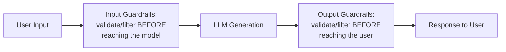
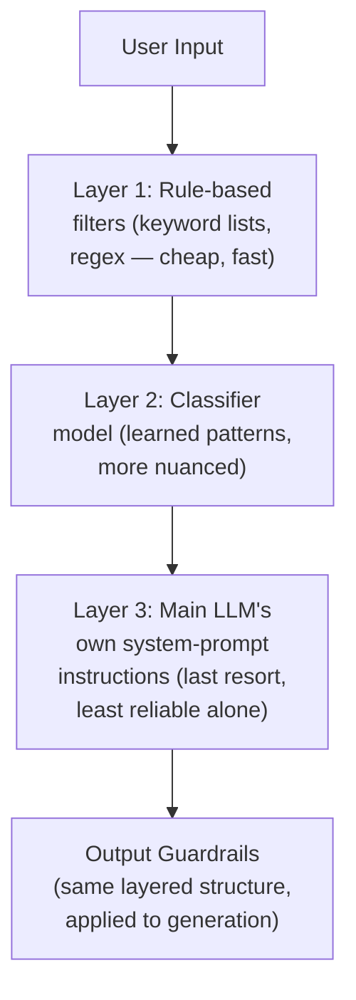

## Introduction

Part 12 closed with a unifying lesson: agentic systems convert reasoning errors into real-world side effects, and every architectural choice in that Part was a specific response to that risk. This Part broadens the lens from a single agent's own architecture to system-wide and organization-wide safety concerns. This chapter starts with the most foundational layer: **guardrails** — mechanisms that constrain what an LLM system can input, generate, or act on — and **content moderation**, the specific application of guardrails to harmful or policy-violating content.

## Input Guardrails vs. Output Guardrails

Guardrails apply at two distinct points in an LLM system's pipeline, each catching a different category of problem.



**Input guardrails** catch problems *before* they reach the model — malicious prompts, requests clearly outside the system's intended scope (Chapter 67's tool-set-scoping discipline, applied here to the entire system's scope), or personally identifiable information that shouldn't be processed at all. **Output guardrails** catch problems the model itself produces — a hallucinated claim (Chapter 36), an inappropriate tone, or content violating a content policy — before it ever reaches the user or triggers a downstream action.

```python
def guarded_generate(user_input: str, llm_client, input_guardrails: list,
                       output_guardrails: list) -> str:
    for guardrail in input_guardrails:
        violation = guardrail.check(user_input)
        if violation:
            return guardrail.rejection_message(violation)

    raw_output = llm_client.generate(user_input)

    for guardrail in output_guardrails:
        violation = guardrail.check(raw_output)
        if violation:
            return guardrail.fallback_response(violation)  # not simply
                                                                # blocking —
                                                                # often a
                                                                # regenerated
                                                                # or filtered
                                                                # response
    return raw_output
```

**Why both layers are necessary, not redundant**: an input guardrail cannot catch a problem introduced by the model's *own* generation process (a hallucination has no problematic input to detect), and an output guardrail alone means the model has already spent compute generating a response to a request that should have been rejected outright — directly the same "cheap check first, expensive check second" cascade principle Chapter 51 and Chapter 63 established, now applied to safety filtering rather than model routing or re-ranking.

## Classifier-Based Content Moderation

The most common guardrail implementation is a **classifier** — often a smaller, purpose-built model (Chapter 51's cascade pattern) trained specifically to detect policy-violating categories (hate speech, violence, self-harm content, sexual content) — run either before the main model (input) or after it (output).

```python
class ContentModerationGuardrail:
    """
    A classifier-based guardrail — directly analogous to Ch. 51's
    cascade pattern: a SMALLER, CHEAPER, SPECIALIZED classifier runs
    on every request, reserving the main, expensive LLM call for
    content that passes this initial screen.
    """
    def __init__(self, classifier_model, threshold: float = 0.8):
        self.classifier_model = classifier_model
        self.threshold = threshold

    def check(self, text: str) -> str | None:
        scores = self.classifier_model.classify(text)  # e.g. {"violence": 0.02,
                                                            #      "self_harm": 0.91, ...}
        for category, score in scores.items():
            if score >= self.threshold:
                return category
        return None
```

**Why a dedicated, smaller classifier is preferred over asking the main LLM to self-moderate via prompting alone**: directly extending Chapter 68's "a structural constraint is more robust than a purely instructional one" principle — a classifier trained specifically and exclusively for this detection task provides a measurable, independently-validated reliability guarantee (Chapter 21's evaluation discipline, applied to the classifier itself), whereas relying solely on the main model's own prompted self-restraint inherits all of Chapter 74's upcoming adversarial-robustness concerns, since a sufficiently crafted prompt can often circumvent purely instructional guardrails embedded in a system prompt.

## The Layered Defense Architecture

No single guardrail is fully reliable in isolation — directly extending Chapter 51's cascade philosophy, a mature content moderation system layers multiple, independent checks, each catching what the others miss.



**Why layering multiple, independently-failing checks is more robust than investing in a single, maximally sophisticated check**: this directly parallels a defense-in-depth principle familiar from Chapter 55's security discussion — each layer has different failure modes (a rule-based filter fails on novel phrasing a classifier would catch; a classifier fails on genuinely novel attack patterns a well-crafted system prompt's explicit prohibitions might still catch), and a request must evade *every* layer simultaneously to fully bypass the system, meaningfully reducing overall failure probability compared to relying on any single layer alone, however sophisticated.

## False Positives: The Cost of Over-Blocking

Every guardrail's threshold represents a genuine precision-recall trade-off (Chapter 21's evaluation framework, applied here) — a threshold set too aggressively catches genuinely harmful content but also blocks legitimate requests that superficially resemble it (a medical question about self-harm risk factors, phrased similarly to a self-harm-related query the classifier is trained to catch).

```python
def evaluate_guardrail_tradeoff(guardrail, test_cases: list) -> dict:
    """
    Directly extends Ch. 21's precision/recall framework to guardrail
    evaluation — an unmeasured threshold risks either genuine harm
    passing through (false negatives) or legitimate use being
    blocked (false positives), and the RIGHT threshold depends on
    the SPECIFIC cost of each type of error for this application.
    """
    true_positives = false_positives = false_negatives = 0
    for case in test_cases:
        flagged = guardrail.check(case.text) is not None
        if flagged and case.is_actually_violating:
            true_positives += 1
        elif flagged and not case.is_actually_violating:
            false_positives += 1
        elif not flagged and case.is_actually_violating:
            false_negatives += 1
    return {"precision": true_positives / max(true_positives + false_positives, 1),
            "recall": true_positives / max(true_positives + false_negatives, 1)}
```

**Why the appropriate threshold is application-specific, not universal**: directly extending this series' consistent "validate the specific trade-off for your specific application" discipline — a mental-health support application should weight recall heavily for self-harm-adjacent content (a missed detection has severe consequences) while accepting more false positives, while a general-purpose coding assistant might reasonably tolerate a lower recall threshold for the same category, since the base rate of genuinely relevant queries is far lower and unnecessary blocking directly degrades a much larger volume of legitimate use.

## Key Takeaways

- Input guardrails catch problems before they reach the model; output guardrails catch problems the model itself introduces — both are necessary since neither can substitute for the other, directly extending Chapter 51's and Chapter 63's cheap-then-expensive cascade principle to safety filtering.
- Classifier-based moderation is preferred over relying solely on the main model's prompted self-restraint, since a dedicated, independently-validated classifier provides a structural reliability guarantee that purely instructional guardrails lack, directly extending Chapter 68's structural-versus-instructional safety principle.
- A layered defense architecture — combining rule-based filters, classifiers, and prompt-level instructions — is more robust than any single check alone, since a request must evade every independent layer simultaneously to fully bypass the system.
- Every guardrail threshold represents an application-specific precision-recall trade-off; the appropriate balance between false positives (over-blocking legitimate use) and false negatives (missing genuine violations) depends on the specific consequences of each error type for the specific application, not a universal default.

---

## Interview Questions

**1. Why does this chapter argue that input and output guardrails are "necessary, not redundant," rather than treating output guardrails as sufficient on their own since they see the final, complete response?**
An output guardrail can only catch problems that manifest in the model's actual generated text — it cannot catch or prevent problems introduced entirely by the nature of the input itself before any generation occurs (a request clearly outside the system's intended scope, or content that shouldn't be processed by the model at all for policy or privacy reasons) — additionally, relying solely on output guardrails means the system has already incurred the full compute cost of generation (Chapter 42's cost concerns) for every request, including ones that should have been rejected immediately, directly wasting resources on generation that will simply be discarded — this is exactly the same "catch what you can cheaply before paying for something expensive" cascade logic Chapter 51 established for model routing, now applied to the cost and safety economics of guardrail placement.
*Follow-up: What's a concrete example of a problem an OUTPUT guardrail can catch that an INPUT guardrail fundamentally cannot, regardless of how sophisticated the input guardrail is?*
A hallucinated factual claim (Chapter 36) is the clearest example — the user's input might be entirely benign and policy-compliant (a simple, reasonable question), but the model's OWN generation process introduces a fabricated, incorrect claim in its response; no input guardrail, however sophisticated, can detect this, since the problem doesn't exist until AFTER generation has already occurred — this illustrates why output guardrails address a genuinely distinct category of risk (errors originating in the model's own generative process) that input guardrails are structurally incapable of addressing, confirming why both layers serve independent, non-overlapping purposes.

**2. Why does this chapter recommend a dedicated, smaller classifier model for content moderation rather than relying on the main LLM's own system-prompt instructions to self-moderate?**
Directly extending Chapter 68's "a structural constraint is more robust than a purely instructional one" principle — a dedicated classifier is trained SPECIFICALLY and EXCLUSIVELY for the detection task, with its own independently measurable precision and recall (Chapter 21's evaluation discipline) on this narrow, focused objective; the main LLM's system-prompt instructions, by contrast, are merely a REQUEST for the model to behave a certain way, layered on top of a general-purpose generation objective it wasn't exclusively trained for — Chapter 74's upcoming adversarial-attack material will further establish that purely instructional guardrails embedded in a system prompt can often be circumvented by a sufficiently crafted adversarial input, whereas a dedicated classifier, being a structurally separate check outside the main generation path, isn't subject to the same "can this specific prompt talk the model out of following its instructions" vulnerability.
*Follow-up: Does this mean the main LLM's own system-prompt-level safety instructions provide NO value, given a dedicated classifier is already in place?*
No — this chapter's layered-defense-architecture section explicitly treats the LLM's own instructions as a genuine, additional layer (the LAST layer in its diagram, specifically), valuable precisely because it catches DIFFERENT failure modes than the classifier does (a classifier trained on KNOWN, historical violation patterns may miss a genuinely NOVEL phrasing or context the model's own broader reasoning can still recognize as inappropriate) — the point isn't that prompt-level instructions are WORTHLESS, but that they're INSUFFICIENT AS THE SOLE layer of defense, given their DEMONSTRATED vulnerability to circumvention — treating them as ONE layer among several, rather than the SOLE line of defense, is exactly this chapter's layered-defense recommendation.

**3. Explain why this chapter frames guardrail layering as "defense in depth," directly connecting this framing to Chapter 55's security discussion.**
Chapter 55's security discussion established that a mature security architecture doesn't rely on a single, maximally strong barrier, but layers MULTIPLE, INDEPENDENT defenses, each with different failure modes, such that an attacker must successfully defeat EVERY layer simultaneously to achieve a full compromise — this chapter's guardrail-layering argument applies the IDENTICAL principle to content safety: a rule-based filter, a classifier model, and the main LLM's own instructions each have DIFFERENT strengths and blind spots (a rule-based filter is fast but brittle against novel phrasing; a classifier generalizes better but may miss entirely novel attack patterns; prompt-level instructions can sometimes catch what neither automated layer anticipated) — requiring a piece of harmful content to evade ALL THREE simultaneously provides a MEANINGFULLY lower overall failure probability than relying on any SINGLE layer, however sophisticated that single layer might be, EXACTLY the security-architecture principle Chapter 55 established, now applied to content-safety rather than access-control or network-security contexts.
*Follow-up: What's the specific engineering cost of this layered approach that a team should weigh against its safety benefit?*
Each additional layer introduces additional latency (Chapter 5's SLA concerns — every guardrail check adds processing time before a response reaches the user), additional infrastructure to maintain and monitor (Chapter 33's observability discipline now applies to each individual layer, not just the main model), and additional engineering effort to keep each layer's own thresholds and rules current as new attack patterns or policy requirements emerge — directly the same cost-benefit calculus this series has applied to every other "more layers/more complexity" decision (Chapter 62's hybrid search, Chapter 69's multi-agent escalation), meaning the number and sophistication of guardrail layers should be calibrated to the application's actual risk profile and demonstrated need, rather than maximized indiscriminately regardless of cost.

**4. Why does this chapter insist that the "right" guardrail threshold is application-specific rather than universal, using the mental-health-support versus coding-assistant comparison?**
This directly extends Chapter 21's precision-recall trade-off framework — the RELATIVE COST of a false negative (a genuinely harmful request slipping through) versus a false positive (a legitimate request being incorrectly blocked) differs dramatically depending on the application's actual context and consequences: for a mental-health support application, a false negative on self-harm-adjacent content carries a severe, potentially life-threatening consequence, justifying a LOWER threshold (higher sensitivity, accepting more false positives) even at the cost of occasionally blocking legitimate, benign questions; for a general-purpose coding assistant, the base rate of genuinely self-harm-related queries is far lower, and the cost of a false positive (blocking a legitimate coding question that happens to superficially resemble a flagged pattern) is proportionally more disruptive relative to the rare, marginal benefit of catching an extremely unlikely true violation in this specific context — this is a direct, concrete instance of this series' recurring "calibrate empirically to the SPECIFIC application's actual cost structure, not a universal default" discipline.
*Follow-up: How would you determine the SPECIFIC threshold for a NEW application, given this context-dependence, rather than guessing or copying another application's threshold?*
I'd construct a representative test set specific to THIS application's actual expected traffic patterns and genuinely evaluate the classifier's precision and recall at SEVERAL candidate thresholds (directly following this chapter's own `evaluate_guardrail_tradeoff` methodology), then explicitly weigh the MEASURED false-positive and false-negative rates at each threshold against a DELIBERATE, STAKEHOLDER-INFORMED judgment about the RELATIVE cost of each error type for THIS SPECIFIC application's context and user base — rather than adopting a threshold from an UNRELATED application (whose cost structure may be entirely different) or an arbitrary, unvalidated default, following this series' consistent "empirically validate for your specific context" discipline established throughout every prior chapter's similar threshold and configuration decisions.

**5. How would you use this chapter's material to design the guardrail architecture for a customer-facing agent (Chapter 68's example) that has access to a refund-processing tool?**
I'd apply BOTH input and output guardrails at multiple points: an INPUT guardrail checking the user's initial request for obviously malicious intent (an attempt to manipulate the system into issuing unauthorized refunds, directly anticipating Chapter 74's upcoming prompt-injection material); a classifier-based content-moderation check on the CONVERSATION content generally (Chapter 73's core architecture); and, CRITICALLY, treating the refund-tool CALL ITSELF as a distinct guardrail checkpoint — directly extending Chapter 68's semantic-validation and confirmation-gating architecture as an ADDITIONAL, tool-specific guardrail layer beyond the more general content-moderation guardrails this chapter has focused on — recognizing that Chapter 68's tool-execution safety architecture and THIS chapter's content-moderation guardrails are BOTH instances of the SAME underlying "layered defense, structural over instructional" principle, applied to DIFFERENT parts of the same overall system (content generation, versus tool execution).
*Follow-up: Why might it be a mistake to treat Chapter 68's tool-validation layer and this chapter's content-moderation guardrails as entirely separate, unrelated systems, rather than as instances of a shared architectural pattern?*
Treating them as entirely separate systems risks inconsistent safety investment — a team might invest heavily in sophisticated content-moderation classifiers (this chapter's focus) while treating tool-call validation (Chapter 68) as a lighter-weight, less rigorously engineered concern, or vice versa, DESPITE both representing genuinely comparable RISK SURFACES (a policy-violating response and an incorrectly-executed refund are both real-world harms stemming from the SAME underlying category of problem — an LLM's reasoning producing an inappropriate output) — recognizing these as instances of the SAME shared pattern (layered, structural checks over purely instructional trust) encourages a system designer to apply the SAME rigor, evaluation discipline (Chapter 21's precision-recall framework), and layered-defense thinking CONSISTENTLY across BOTH concerns, rather than under-investing in one because it wasn't recognized as belonging to the same general safety-architecture category as the other.

**6. In an interview, if asked "how would you prevent an LLM-powered chatbot from generating harmful content," how would you use this chapter's material to give a comprehensive, layered answer rather than a single-technique answer?**
I'd explicitly walk through this chapter's layered architecture rather than naming a single technique: starting with INPUT guardrails (rule-based filters and a classifier screening user input BEFORE it reaches the model, catching obviously malicious requests cheaply, per this chapter's cascade-cost argument), then the model's OWN system-prompt-level instructions (a genuine but insufficient-alone layer, per this chapter's discussion), then OUTPUT guardrails (a classifier re-checking the model's GENERATED response before it reaches the user, catching what earlier layers missed or what the model's own generation process introduced) — explicitly noting that NO SINGLE layer is fully reliable alone (this chapter's core "defense in depth" argument), and that the SPECIFIC thresholds at each layer should be calibrated empirically to this SPECIFIC chatbot's actual use case and risk profile (this chapter's threshold-calibration discussion), rather than presenting content moderation as a SINGLE, solved problem addressable by ANY ONE technique in isolation.
*Follow-up: How would you handle a follow-up question asking you to quantify the EXPECTED remaining risk after implementing this full, layered defense — is the system now "guaranteed safe"?*
I'd explicitly reject the framing that ANY layered defense architecture provides a GUARANTEE of complete safety — directly following this chapter's own EVALUATION-BASED framing (measuring PRECISION and RECALL, not claiming ZERO false negatives) — I'd instead describe the EXPECTED residual risk in TERMS of the MEASURED recall rate of the COMBINED, layered system on a REPRESENTATIVE test set (Chapter 21's evaluation methodology, now applied to the ENTIRE guardrail pipeline as a WHOLE, not just each individual layer in isolation), explicitly acknowledging that a NON-ZERO residual risk REMAINS (since PERFECT recall is virtually NEVER achievable for THIS kind of open-ended, adversarial-facing detection problem) and that ONGOING MONITORING (Chapter 33's discipline) and Chapter 74's upcoming ADVERSARIAL-ROBUSTNESS material are BOTH NECESSARY COMPLEMENTS to THIS chapter's PREVENTIVE guardrail architecture, RATHER than treating GUARDRAILS ALONE as a COMPLETE, ONE-TIME SOLUTION to an ONGOING, EVOLVING RISK.

**7. Why might a team need to periodically re-evaluate their content-moderation classifier's performance, even without any change to their own system, connecting to Chapter 65's periodic re-evaluation discussion?**
Directly extending Chapter 65's established principle that periodic re-evaluation is necessary even absent an intentional system change — the LANDSCAPE of what constitutes a harmful or policy-violating request evolves over time (new slang, new attack patterns, new categories of concern that weren't anticipated when the classifier was originally trained or its thresholds were originally set), meaning a classifier's MEASURED precision and recall on TODAY's actual traffic could genuinely differ from its performance on the test set it was ORIGINALLY validated against, even though NEITHER the classifier NOR the system's own configuration has changed — this is the SAME "the world outside your system can drift even when your system doesn't" concern Chapter 33's monitoring discipline and Chapter 65's periodic-revalidation recommendation both established, now applied SPECIFICALLY to content-moderation classifiers' ongoing reliability.
*Follow-up: What SPECIFIC monitoring signal would most directly indicate that a content-moderation classifier's performance has genuinely degraded, prompting this kind of re-evaluation?*
I'd specifically monitor for a sustained increase in HUMAN-REPORTED false negatives (users or downstream review flagging harmful content that PASSED the classifier undetected) or a sustained increase in USER COMPLAINTS about incorrectly-blocked, legitimate requests (a rising false-positive signal) — directly extending Chapter 32's "sustained deviation from an established baseline warrants investigation" alerting principle to THIS specific classifier's ongoing, real-world performance, rather than assuming the classifier's ORIGINAL, offline validation results remain PERMANENTLY representative of its CURRENT, live performance against an EVOLVING landscape of actual user requests.

**8. How would you design an experiment to determine whether adding a THIRD guardrail layer (beyond an EXISTING rule-based filter and classifier) is genuinely justified, rather than assuming "more layers is always better"?**
Directly extending this series' consistent evidence-based escalation discipline (Chapter 62's hybrid search adoption, Chapter 64's multi-hop retrieval justification) — I'd run the EXISTING two-layer system against a REPRESENTATIVE test set and specifically identify the RESIDUAL false negatives (harmful content that evaded BOTH existing layers) — if this residual failure rate is GENUINELY significant and the failures show a CONSISTENT, identifiable PATTERN that a THIRD, SPECIFICALLY-DESIGNED layer could plausibly address (e.g., a category of adversarial phrasing NEITHER existing layer catches), THIS provides the EVIDENCE-BASED justification for adding the additional layer — following this chapter's OWN "the RIGHT number of layers is calibrated to DEMONSTRATED, MEASURED need" principle, rather than adding layers INDISCRIMINATELY based on a GENERAL, UNMEASURED sense that "more safety is always better," which THIS chapter's OWN cost discussion (LATENCY, INFRASTRUCTURE, MAINTENANCE) has ALREADY established carries a GENUINE, NON-TRIVIAL COST.
*Follow-up: What would the ABSENCE of a clear, identifiable pattern in the residual failures suggest about the appropriate next step, INSTEAD of simply adding a third layer?*
If the RESIDUAL failures show NO CLEAR, CONSISTENT PATTERN (each failure is IDIOSYNCRATIC and UNRELATED to the OTHERS), THIS suggests the PROBLEM ISN'T that a SPECIFIC, MISSING TYPE of check is NEEDED (which a THIRD, TARGETED layer WOULD address), but RATHER that the EXISTING layers' OWN thresholds or TRAINING DATA MIGHT NEED IMPROVEMENT (Chapter 65's "fix the SPECIFIC responsible component" diagnostic discipline) — in THIS case, the APPROPRIATE remediation is LIKELY to be IMPROVING an EXISTING layer (RETRAINING the classifier on MORE REPRESENTATIVE data INCLUDING these RESIDUAL failure examples, or ADJUSTING an EXISTING threshold) RATHER THAN adding an ENTIRELY NEW, THIRD layer — DIRECTLY illustrating WHY a DIAGNOSTIC, PATTERN-BASED analysis of RESIDUAL failures SHOULD PRECEDE the DECISION of WHETHER to ADD a NEW LAYER VERSUS IMPROVE an EXISTING one, RATHER than DEFAULTING to "add MORE" as the AUTOMATIC RESPONSE to ANY OBSERVED SHORTFALL.

**9. Why might a rule-based filter (Layer 1 of this chapter's architecture) still provide genuine value even in a system that ALSO has a sophisticated, well-trained classifier (Layer 2)?**
A rule-based filter is EXTREMELY CHEAP and FAST to evaluate (a simple keyword or regex match, requiring NO model inference at all) COMPARED to a classifier model (which STILL requires SOME computational cost, even if SMALLER than the main LLM, per Chapter 51's cascade cost-structure) — for OBVIOUSLY, UNAMBIGUOUSLY violating content (an EXPLICIT, KNOWN-BAD term or phrase), a rule-based filter can REJECT the request IMMEDIATELY, WITHOUT INCURRING the classifier's OWN (SMALLER, but STILL NON-ZERO) computational cost — directly extending THIS chapter's OWN "cheap check FIRST, expensive check SECOND" cascade PRINCIPLE ONE LEVEL FURTHER: EVEN WITHIN the "input guardrail" STAGE ITSELF, a CHEAPER rule-based check SHOULD PRECEDE a MORE EXPENSIVE classifier check, CATCHING the MOST OBVIOUS violations AT THE LOWEST POSSIBLE COST BEFORE ESCALATING to the MORE EXPENSIVE, MORE NUANCED classifier FOR CASES the RULE-BASED filter DOESN'T CONFIDENTLY RESOLVE.
*Follow-up: WHY might a rule-based filter's SIMPLICITY be BOTH ITS GREATEST STRENGTH AND ITS MOST SIGNIFICANT LIMITATION, connecting to a GENERAL trade-off THIS SERIES has ESTABLISHED for SIMPLE VERSUS SOPHISTICATED techniques THROUGHOUT its COVERAGE?**
A rule-based filter's SIMPLICITY (EXACT keyword or PATTERN matching) makes it EXTREMELY FAST, CHEAP, and PREDICTABLE (Chapter 51's CASCADE-COST argument), but this SAME simplicity makes it TRIVIALLY EASY to CIRCUMVENT through MINOR REPHRASING, MISSPELLING, or SEMANTICALLY EQUIVALENT but LEXICALLY DIFFERENT phrasing that a MORE SOPHISTICATED, LEARNED classifier (Layer 2) WOULD STILL CORRECTLY CATCH — this is EXACTLY the SAME "SIMPLE techniques are FAST and CHEAP but BRITTLE; SOPHISTICATED techniques are ROBUST but EXPENSIVE" TRADE-OFF THIS SERIES has ESTABLISHED REPEATEDLY (Chapter 62's KEYWORD-VERSUS-SEMANTIC SEARCH COMPARISON BEING the MOST DIRECTLY ANALOGOUS PRIOR EXAMPLE) — CONFIRMING WHY THIS chapter's LAYERED ARCHITECTURE SPECIFICALLY COMBINES BOTH KINDS of CHECK, RATHER THAN RELYING ON EITHER ALONE, SINCE EACH ADDRESSES a DIFFERENT PART of the OVERALL DETECTION PROBLEM (OBVIOUS, LEXICAL VIOLATIONS VERSUS SUBTLE, SEMANTIC ONES).

**10. How would you handle a stakeholder's request to REMOVE the classifier-based guardrail LAYER ENTIRELY, RELYING SOLELY on the main LLM's SYSTEM-PROMPT INSTRUCTIONS, citing a desire to "SIMPLIFY the ARCHITECTURE and REDUCE LATENCY"?**
I'D DIRECTLY apply THIS chapter's CORE ARGUMENT — RELYING SOLELY on PROMPT-LEVEL INSTRUCTIONS REINTRODUCES EXACTLY the VULNERABILITY THIS chapter's STRUCTURAL-VERSUS-INSTRUCTIONAL PRINCIPLE (Chapter 68's ORIGINAL FRAMING) WARNS AGAINST — a SUFFICIENTLY CRAFTED ADVERSARIAL INPUT (Chapter 74's UPCOMING MATERIAL) COULD PLAUSIBLY CIRCUMVENT PURELY INSTRUCTIONAL SAFEGUARDS in a WAY that a STRUCTURALLY SEPARATE CLASSIFIER, OPERATING OUTSIDE the MAIN MODEL's OWN REASONING PROCESS, WOULD NOT BE SUSCEPTIBLE TO — I'D ACKNOWLEDGE the STAKEHOLDER's LEGITIMATE LATENCY CONCERN (THIS chapter's OWN COST DISCUSSION) but PROPOSE a MORE TARGETED OPTIMIZATION INSTEAD of FULL REMOVAL — for EXAMPLE, USING a SMALLER, FASTER CLASSIFIER MODEL (Chapter 51's CASCADE-SIZING DISCIPLINE) or RUNNING the CLASSIFIER CHECK IN PARALLEL WITH the MAIN LLM CALL RATHER THAN SEQUENTIALLY (a GENUINE LATENCY OPTIMIZATION that PRESERVES the SAFETY BENEFIT WHILE ADDRESSING the STAKEHOLDER's ACTUAL, UNDERLYING CONCERN) — RATHER THAN ACCEPTING the PROPOSED REMOVAL, WHICH THIS chapter's MATERIAL DIRECTLY ESTABLISHES AS a GENUINELY RISKY, EVIDENCE-CONTRADICTED SIMPLIFICATION.
*Follow-up: HOW would you VALIDATE that RUNNING the CLASSIFIER CHECK IN PARALLEL (RATHER than SEQUENTIALLY BEFORE the MAIN LLM CALL) DOESN'T INTRODUCE a NEW SAFETY GAP, GIVEN that the MAIN LLM MIGHT NOW BEGIN GENERATING BEFORE the CLASSIFIER's VERDICT is KNOWN?*
RUNNING an INPUT-STAGE CLASSIFIER IN PARALLEL WITH the MAIN GENERATION CALL MEANS the MAIN MODEL MIGHT ALREADY BE GENERATING (or EVEN COMPLETE ITS GENERATION) BEFORE the CLASSIFIER's VERDICT ARRIVES — I'D SPECIFICALLY ENSURE the SYSTEM STILL WITHHOLDS the FINAL RESPONSE from the USER UNTIL BOTH the CLASSIFIER's VERDICT AND the MAIN GENERATION are COMPLETE (SO a FLAGGED INPUT STILL RESULTS in the RESPONSE BEING BLOCKED, EVEN THOUGH the MODEL "WASTED" the GENERATION COMPUTE ON a REQUEST that WAS ULTIMATELY REJECTED) — this PRESERVES the SAFETY GUARANTEE (NO FLAGGED CONTENT EVER REACHES the USER) WHILE GENUINELY IMPROVING PERCEIVED LATENCY (the TWO CHECKS RUN CONCURRENTLY RATHER THAN SEQUENTIALLY) AT the COST of SOME WASTED COMPUTE ON REJECTED REQUESTS — a DELIBERATE, EXPLICIT TRADE-OFF (COMPUTE COST FOR LATENCY) RATHER THAN a SAFETY COMPROMISE, DIRECTLY DISTINGUISHING THIS PROPOSAL FROM the STAKEHOLDER's ORIGINAL, GENUINELY UNSAFE "REMOVE the CLASSIFIER ENTIRELY" REQUEST.

**11. How would you use this chapter's material to explain why a content-moderation classifier trained PRIMARILY on ENGLISH-language examples might create a GENUINE SAFETY GAP for a MULTILINGUAL application, connecting to a general PRINCIPLE this series has established about MODEL TRAINING DATA REPRESENTATIVENESS?**
DIRECTLY EXTENDING this SERIES' CONSISTENT "a MODEL's RELIABILITY is BOUNDED by the REPRESENTATIVENESS of its TRAINING DATA" PRINCIPLE (ESTABLISHED THROUGHOUT PARTS 4-5's TRAINING and EVALUATION DISCUSSIONS) — a CLASSIFIER TRAINED PRIMARILY on ENGLISH-LANGUAGE VIOLATION EXAMPLES LIKELY HAS SIGNIFICANTLY LOWER RECALL for SEMANTICALLY EQUIVALENT VIOLATIONS EXPRESSED in OTHER LANGUAGES (SINCE THE CLASSIFIER HAS SEEN FAR FEWER, or POSSIBLY NO, TRAINING EXAMPLES in THOSE LANGUAGES) — for a MULTILINGUAL APPLICATION, THIS CREATES a GENUINE, SIGNIFICANT SAFETY GAP: a USER COULD PLAUSIBLY BYPASS the CONTENT-MODERATION LAYER SIMPLY BY PHRASING a VIOLATING REQUEST IN a LANGUAGE the CLASSIFIER WASN'T ADEQUATELY TRAINED ON, EVEN THOUGH the UNDERLYING, SEMANTIC CONTENT IS EQUALLY VIOLATING REGARDLESS of the LANGUAGE IT'S EXPRESSED IN — DIRECTLY ILLUSTRATING WHY THIS chapter's EVALUATION METHODOLOGY (THIS chapter's `evaluate_guardrail_tradeoff` FUNCTION) MUST BE RUN SEPARATELY, PER-LANGUAGE, for ANY MULTILINGUAL APPLICATION, RATHER THAN ASSUMING a SINGLE, AGGREGATE EVALUATION RESULT (LIKELY DOMINATED by ENGLISH-LANGUAGE TEST CASES) GENERALIZES EQUALLY WELL ACROSS EVERY LANGUAGE the APPLICATION ACTUALLY SERVES.
*Follow-up: WHAT SPECIFIC REMEDIATION would you RECOMMEND for a TEAM that DISCOVERS THIS SPECIFIC GAP THROUGH PER-LANGUAGE EVALUATION?*
I'D RECOMMEND EITHER FINE-TUNING or RE-TRAINING the CLASSIFIER on a GENUINELY REPRESENTATIVE, MULTILINGUAL TRAINING SET (DIRECTLY APPLYING PART 9's FINE-TUNING DISCIPLINE to THIS SPECIFIC classifier, RATHER than the MAIN GENERATION MODEL), or, AS a FASTER INTERIM MEASURE, ADDING an EXPLICIT LANGUAGE-DETECTION and TRANSLATION STEP BEFORE the CLASSIFIER CHECK (TRANSLATING the INPUT to ENGLISH FIRST, THEN RUNNING it THROUGH the EXISTING, WELL-VALIDATED ENGLISH-LANGUAGE CLASSIFIER) — EACH OPTION CARRIES ITS OWN TRADE-OFFS (RE-TRAINING is MORE ROBUST but SLOWER TO IMPLEMENT; TRANSLATION-THEN-CLASSIFY is FASTER TO DEPLOY but INTRODUCES ITS OWN TRANSLATION-ACCURACY RISK, POTENTIALLY LOSING NUANCE THAT MATTERS FOR ACCURATE CLASSIFICATION) — REQUIRING the SAME KIND of EMPIRICAL, MEASURED VALIDATION (THIS chapter's OWN EVALUATION METHODOLOGY, RE-APPLIED to WHICHEVER REMEDIATION is CHOSEN) BEFORE CONFIRMING the GAP has BEEN GENUINELY CLOSED, RATHER THAN ASSUMING EITHER FIX WORKS WITHOUT THIS KIND OF DIRECT, POST-REMEDIATION RE-VALIDATION.

**12. How would you design a MONITORING dashboard SPECIFICALLY for a PRODUCTION content-moderation SYSTEM, connecting Chapter 33's OBSERVABILITY DISCIPLINE to THIS chapter's LAYERED ARCHITECTURE?**
I'D TRACK, SEPARATELY for EACH LAYER (RULE-BASED FILTER, CLASSIFIER, and the MAIN MODEL's OWN INSTRUCTION-FOLLOWING BEHAVIOR), the RATE at WHICH EACH LAYER FLAGS CONTENT, DIRECTLY ANALOGOUS to Chapter 68's PER-TOOL MONITORING DISCUSSION — a SUDDEN, SUSTAINED INCREASE in ONE SPECIFIC LAYER's FLAGGING RATE (WHILE OTHERS REMAIN STABLE) COULD INDICATE a NEW, EMERGING PATTERN of REQUESTS THIS SPECIFIC layer IS PARTICULARLY WELL (or POORLY) SUITED to DETECT, WORTH FURTHER INVESTIGATION (Chapter 32's ALERTING DISCIPLINE) — I'D ALSO TRACK the RATE at WHICH CONTENT is FLAGGED by a LATER LAYER (E.G., the OUTPUT CLASSIFIER) DESPITE HAVING ALREADY PASSED an EARLIER LAYER (E.G., the INPUT CLASSIFIER) — THIS SPECIFIC METRIC DIRECTLY MEASURES HOW OFTEN the SYSTEM's OWN GENERATION PROCESS ITSELF INTRODUCES a VIOLATION that WASN'T PRESENT in the ORIGINAL INPUT (Chapter 36's HALLUCINATION-STYLE CONCERN, NOW APPLIED to POLICY VIOLATIONS RATHER THAN FACTUAL ERRORS), a GENUINELY DIFFERENT and IMPORTANT SIGNAL from the INPUT-STAGE FLAGGING RATE ALONE.
*Follow-up: WHY might THIS SPECIFIC METRIC (CONTENT FLAGGED at OUTPUT DESPITE PASSING INPUT) be PARTICULARLY VALUABLE for DIAGNOSING WHETHER the MAIN MODEL ITSELF, RATHER THAN USER BEHAVIOR, is the SOURCE of an OBSERVED INCREASE in VIOLATIONS?*
IF the INPUT-STAGE FLAGGING RATE REMAINS STABLE (USERS AREN'T SENDING MORE OBVIOUSLY PROBLEMATIC REQUESTS) BUT the OUTPUT-STAGE FLAGGING RATE INCREASES, THIS PROVIDES DIRECT, SPECIFIC EVIDENCE that the MAIN MODEL's OWN GENERATION BEHAVIOR HAS CHANGED (PERHAPS DUE to an UPSTREAM MODEL-VERSION UPDATE from the PROVIDER, DIRECTLY ECHOING Chapter 65's EARLIER DISCUSSION of PERIODIC RE-EVALUATION EVEN WITHOUT an INTENTIONAL CODE CHANGE) RATHER THAN a SHIFT in USER BEHAVIOR ITSELF — THIS DISTINCTION (INPUT-SIDE VERSUS OUTPUT-SIDE FLAGGING RATE CHANGES) DIRECTLY ISOLATES WHETHER an OBSERVED PROBLEM ORIGINATES FROM WHAT USERS ARE ASKING OR FROM HOW the MODEL ITSELF is RESPONDING, EXACTLY the SAME "ISOLATE the SPECIFIC RESPONSIBLE COMPONENT" DIAGNOSTIC DISCIPLINE THIS SERIES HAS APPLIED CONSISTENTLY THROUGHOUT (Chapter 60's RAG STAGE-BY-STAGE DIAGNOSIS BEING the MOST DIRECTLY ANALOGOUS PRIOR EXAMPLE), NOW APPLIED SPECIFICALLY to THIS chapter's LAYERED CONTENT-MODERATION ARCHITECTURE.

**13. How would you use this chapter's material to explain WHY "content moderation" and "SAFETY" are NOT SYNONYMOUS, EVEN THOUGH THIS chapter FOCUSES PRIMARILY on CONTENT-MODERATION GUARDRAILS?**
THIS chapter's OWN OPENING EXPLICITLY FRAMES CONTENT MODERATION AS "THE SPECIFIC APPLICATION of GUARDRAILS to HARMFUL or POLICY-VIOLATING CONTENT" — a SPECIFIC, NARROWER SUBSET of the BROADER "SAFETY" CONCERN THIS ENTIRE PART ADDRESSES; SAFETY, MORE BROADLY, ALSO ENCOMPASSES CONCERNS THIS chapter HASN'T DIRECTLY ADDRESSED — ADVERSARIAL MANIPULATION SPECIFICALLY TARGETING an AGENT's REASONING (Chapter 74's UPCOMING PROMPT-INJECTION MATERIAL, a GENUINELY DIFFERENT THREAT MODEL from a USER SIMPLY REQUESTING HARMFUL CONTENT DIRECTLY), FACTUAL RELIABILITY and HALLUCINATION (Chapter 36, Chapter 75's UPCOMING EVALUATION MATERIAL), and ORGANIZATION-WIDE GOVERNANCE and COMPLIANCE CONCERNS (Chapter 76) — RECOGNIZING CONTENT MODERATION AS ONE SPECIFIC, IMPORTANT PIECE of a MUCH BROADER SAFETY LANDSCAPE, RATHER than TREATING "WE HAVE CONTENT-MODERATION GUARDRAILS" AS EQUIVALENT to "OUR SYSTEM IS SAFE," IS EXACTLY the KIND of PRECISE, DECOMPOSED THINKING THIS SERIES HAS CONSISTENTLY MODELED THROUGHOUT (CHAPTER 70's "MEMORY ISN'T ONE THING" ARGUMENT BEING a DIRECTLY ANALOGOUS PRIOR EXAMPLE of THIS SAME "DON'T COLLAPSE a BROAD CONCEPT INTO a SINGLE, NARROWER INSTANCE of IT" DISCIPLINE).
*Follow-up: GIVEN THIS DISTINCTION, WHAT SPECIFIC RISK would a TEAM RUN IF THEY BELIEVED THEIR SYSTEM WAS "FULLY SAFE" SIMPLY BECAUSE IT HAD a WELL-IMPLEMENTED CONTENT-MODERATION LAYER (THIS chapter's TOPIC) BUT HAD NOT YET ADDRESSED Chapter 74's ADVERSARIAL-ROBUSTNESS CONCERNS?*
SUCH a TEAM WOULD REMAIN GENUINELY VULNERABLE to a SPECIFIC, DIFFERENT CLASS of ATTACK — an ADVERSARIAL PROMPT SPECIFICALLY DESIGNED to MANIPULATE the MODEL's REASONING PROCESS ITSELF (Chapter 74's UPCOMING TOPIC) COULD POTENTIALLY CAUSE the MODEL to PRODUCE HARMFUL OUTPUT WITHOUT EVER TRIGGERING THIS chapter's CONTENT-MODERATION CLASSIFIERS, SINCE THE ATTACK ISN'T NECESSARILY ABOUT REQUESTING OBVIOUSLY HARMFUL CONTENT DIRECTLY (WHICH THIS chapter's CLASSIFIERS ARE SPECIFICALLY TRAINED to DETECT) BUT ABOUT MANIPULATING the MODEL INTO BYPASSING ITS OWN INTENDED BEHAVIOR THROUGH INDIRECT, CRAFTED TECHNIQUES — a TEAM CONFLATING "WE HAVE CONTENT MODERATION" WITH "WE ARE FULLY SAFE" WOULD LIKELY UNDER-INVEST in THIS GENUINELY DIFFERENT, EQUALLY IMPORTANT SAFETY CONCERN, ILLUSTRATING PRECISELY WHY THIS PART's CHAPTER-BY-CHAPTER STRUCTURE (CONTENT MODERATION FIRST, THEN ADVERSARIAL ROBUSTNESS, THEN EVALUATION, THEN GOVERNANCE) TREATS EACH of THESE as a DISTINCT, NECESSARY COMPONENT of a COMPREHENSIVE SAFETY POSTURE, RATHER THAN COLLAPSING THEM INTO a SINGLE, UNDIFFERENTIATED "SAFETY" CHECKBOX.

**14. How would you use this chapter's material to explain, at a system-design level, why guardrail architecture represents the SAME "STRUCTURAL over INSTRUCTIONAL" PRINCIPLE THIS SERIES has APPLIED REPEATEDLY, NOW SCALED UP to an ENTIRE SYSTEM'S SAFETY POSTURE RATHER than a SINGLE TOOL's EXECUTION SAFETY?**
CHAPTER 68 ESTABLISHED THIS PRINCIPLE at the LEVEL of a SINGLE TOOL (a SCHEMA-LEVEL RESTRICTION on a SQL TOOL is MORE ROBUST than a PROMPT ASKING the MODEL to "ONLY use SELECT QUERIES") — THIS chapter APPLIES the IDENTICAL UNDERLYING PRINCIPLE at the LEVEL of an ENTIRE SYSTEM'S CONTENT SAFETY: a STRUCTURALLY SEPARATE CLASSIFIER OPERATING OUTSIDE the MAIN MODEL's OWN REASONING PROCESS is MORE ROBUST than RELYING SOLELY on the MODEL's OWN PROMPTED SELF-RESTRAINT — RECOGNIZING THIS AS the SAME, RECURRING PRINCIPLE APPLIED at DIFFERENT SCALES (a SINGLE TOOL's EXECUTION BOUNDARY, VERSUS an ENTIRE SYSTEM's CONTENT-SAFETY BOUNDARY) IS EXACTLY the KIND of DEEP, TRANSFERABLE PATTERN RECOGNITION THIS SERIES has CONSISTENTLY AIMED to BUILD (Chapter 69's CLOSING "DECOMPOSE and SPECIALIZE" DISCUSSION BEING a DIRECTLY ANALOGOUS PRIOR EXAMPLE of RECOGNIZING a SHARED PRINCIPLE ACROSS DIFFERENT SURFACE-LEVEL CONTEXTS).
*Follow-up: GIVEN this RECOGNITION, WHAT GENERAL QUESTION SHOULD a SYSTEM DESIGNER ALWAYS ASK WHEN EVALUATING WHETHER a GIVEN SAFETY MEASURE IS GENUINELY ROBUST, REGARDLESS of WHETHER IT'S APPLIED at the TOOL LEVEL (Chapter 68) or the SYSTEM LEVEL (THIS chapter)?**
a SYSTEM DESIGNER SHOULD CONSISTENTLY ASK: "DOES THIS SAFETY MEASURE DEPEND ENTIRELY on the MODEL's OWN COOPERATION and CORRECT INSTRUCTION-FOLLOWING (an INSTRUCTIONAL CONSTRAINT), OR does IT REMAIN EFFECTIVE EVEN if the MODEL's OWN REASONING FAILS, MISBEHAVES, or is ADVERSARIALLY MANIPULATED (a STRUCTURAL CONSTRAINT)?" — THIS SAME QUESTION APPLIES EQUALLY WELL WHETHER EVALUATING a TOOL's EXECUTION BOUNDARY (Chapter 68's SQL-TOOL EXAMPLE), a SYSTEM's CONTENT-SAFETY BOUNDARY (THIS chapter's CLASSIFIER-BASED MODERATION), OR, AS Chapter 74 WILL LIKELY DEVELOP FURTHER, a SYSTEM's ROBUSTNESS AGAINST DELIBERATE, ADVERSARIAL MANIPULATION — RECOGNIZING THIS SHARED, UNDERLYING QUESTION AS the TRUE, TRANSFERABLE SAFETY-ENGINEERING SKILL (RATHER THAN MEMORIZING EACH INSTANCE AS an UNRELATED, CONTEXT-SPECIFIC TECHNIQUE) is PRECISELY the KIND of DURABLE COMPETENCE THIS SERIES has BEEN DESIGNED to BUILD.

**15. How would you summarize, for someone moving on to Chapter 74's PROMPT INJECTION and ADVERSARIAL ATTACKS DISCUSSION, WHY this chapter's GUARDRAIL MATERIAL creates a DIRECT, NECESSARY FOUNDATION for THAT NEXT chapter's TOPIC?**
THIS chapter has ESTABLISHED the GENERAL GUARDRAIL ARCHITECTURE (INPUT/OUTPUT LAYERS, CLASSIFIER-BASED DETECTION, LAYERED DEFENSE) ASSUMING a RELATIVELY STRAIGHTFORWARD THREAT MODEL — a USER DIRECTLY REQUESTING OBVIOUSLY HARMFUL CONTENT, WHICH a WELL-CALIBRATED CLASSIFIER CAN REASONABLY BE EXPECTED to DETECT; CHAPTER 74 WILL INTRODUCE a GENUINELY MORE SOPHISTICATED and ADVERSARIAL THREAT MODEL — an ATTACKER SPECIFICALLY, DELIBERATELY CRAFTING INPUT DESIGNED to CIRCUMVENT EXACTLY the KIND of GUARDRAILS THIS chapter has DESCRIBED, THROUGH TECHNIQUES SPECIFICALLY DESIGNED to EXPLOIT the GAPS BETWEEN WHAT a CLASSIFIER WAS TRAINED to RECOGNIZE and WHAT a SUFFICIENTLY CREATIVE, ADVERSARIAL REPHRASING CAN ACHIEVE — HAVING THIS chapter's SOLID FOUNDATION in the BASELINE GUARDRAIL ARCHITECTURE (WHAT a WELL-DESIGNED, LAYERED SYSTEM LOOKS LIKE UNDER NORMAL, NON-ADVERSARIAL CONDITIONS) EQUIPS a READER to UNDERSTAND Chapter 74's ADVERSARIAL MATERIAL as a DIRECT, SPECIFIC EXPLORATION of HOW and WHY THIS chapter's DEFENSES CAN BE, and OFTEN ARE, CIRCUMVENTED by a SUFFICIENTLY DETERMINED and SOPHISTICATED ATTACKER, RATHER THAN ENCOUNTERING ADVERSARIAL ROBUSTNESS as an ENTIRELY SEPARATE, DISCONNECTED TOPIC.
*Follow-up: WHAT SPECIFIC ASSUMPTION THIS chapter MADE (EVEN IMPLICITLY) WOULD YOU EXPECT Chapter 74 to DIRECTLY CHALLENGE or COMPLICATE?**
I'D EXPECT Chapter 74 to DIRECTLY CHALLENGE THIS chapter's IMPLICIT ASSUMPTION that a CLASSIFIER's MEASURED PRECISION and RECALL on a REPRESENTATIVE, NATURALLY-OCCURRING TEST SET (THIS chapter's `evaluate_guardrail_tradeoff` METHODOLOGY) GENERALIZES WELL to an ADVERSARIAL SETTING WHERE an ATTACKER IS ACTIVELY, DELIBERATELY SEARCHING for INPUTS THAT SPECIFICALLY EVADE the CLASSIFIER — a CLASSIFIER's PERFORMANCE on ORGANICALLY-OCCURRING TEST CASES (WHICH THIS chapter's EVALUATION METHODOLOGY ASSUMES) CAN BE SIGNIFICANTLY, MISLEADINGLY HIGHER than ITS PERFORMANCE AGAINST a MOTIVATED, ADVERSARIAL SEARCH SPECIFICALLY OPTIMIZED to FIND ITS BLIND SPOTS — DIRECTLY MOTIVATING Chapter 74's LIKELY INTRODUCTION of a GENUINELY DIFFERENT EVALUATION METHODOLOGY (ADVERSARIAL, RED-TEAM-STYLE TESTING, RATHER THAN THIS chapter's MORE STRAIGHTFORWARD, ORGANIC-TEST-SET EVALUATION) SPECIFICALLY DESIGNED to MEASURE ROBUSTNESS UNDER THIS MORE DEMANDING, ADVERSARIAL THREAT MODEL THIS chapter's OWN EVALUATION APPROACH DOESN'T DIRECTLY ADDRESS.
