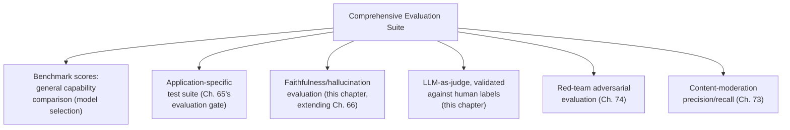

## Introduction

Chapter 74 closed by predicting this chapter would generalize its central insight — that different quality questions require genuinely different evaluation methodologies — beyond adversarial robustness to the full space of LLM system quality. This chapter delivers that generalization: standardized benchmarks, hallucination and faithfulness evaluation generalized beyond Chapter 66's RAG-specific context, LLM-as-judge methodology and its known biases, and how to combine these into a comprehensive evaluation suite alongside Chapter 74's red-teaming and Chapter 73's guardrail evaluation.

## Standardized Benchmarks: What They Measure and Their Limits

Public benchmarks (MMLU, HumanEval, and similar) measure a model's general capability on a fixed, standardized task distribution — useful for comparing raw model capability across providers before committing to one (Chapter 41's build-vs-buy model-selection decision), but they measure capability on the *benchmark's* task distribution, not on *your specific application's* task distribution.

```python
def why_benchmarks_dont_substitute_for_application_evaluation(
    model_a_benchmark_score: float, model_b_benchmark_score: float,
    your_application_test_suite
) -> str:
    """
    A model scoring higher on a general benchmark can still perform
    WORSE on your specific application's actual task distribution —
    directly extending Ch. 65's "validate on YOUR representative
    test set, not a generic proxy" discipline to model selection.
    """
    # Benchmark scores answer "which model is more generally capable,"
    # not "which model is better FOR THIS application" — these are
    # different questions requiring different evidence.
    return "Run BOTH candidates against your_application_test_suite before deciding."
```

**Why this directly extends Chapter 65's evaluation-gate discipline**: a benchmark score is exactly the kind of generic, aggregate proxy Chapter 65 warned against relying on in place of application-specific validation — a model's benchmark ranking tells you about its performance on the benchmark's specific task distribution, which may or may not resemble your application's actual query patterns, tool-use requirements (Chapter 68), or domain-specific knowledge needs.

## Hallucination and Faithfulness, Generalized Beyond RAG

Chapter 66 defined faithfulness specifically for RAG: does the generated answer stay grounded in the retrieved context. This chapter generalizes the concept: **faithfulness**, more broadly, measures whether a claim is grounded in *any* available, verifiable source — retrieved documents (Chapter 66's original scope), a tool's returned result (Chapter 68), or an explicitly stated fact in the conversation itself.

```python
class GeneralizedFaithfulnessEvaluator:
    """
    Extends Ch. 66's RAG-specific faithfulness metric to any
    grounding source an LLM system might have access to — tool
    results (Ch. 68), retrieved documents (Ch. 66), or explicit
    prior conversation turns.
    """
    def evaluate(self, generated_claim: str, available_sources: list[str]) -> bool:
        # Directly extends Ch. 66's methodology: is this SPECIFIC
        # claim entailed by ANY of the available grounding sources,
        # rather than being introduced from the model's own
        # unverified parametric knowledge?
        return any(self._is_entailed(generated_claim, source) for source in available_sources)
```

**Why this generalization matters for agentic systems specifically**: Chapter 68's tool results are exactly as legitimate a grounding source as Chapter 66's retrieved documents — an agent that calls `get_order_status` and then asserts a claim *inconsistent* with the tool's actual returned result is exhibiting the identical faithfulness failure Chapter 66 identified for RAG, just with a different grounding source; a comprehensive evaluation suite for an agentic system must check faithfulness against *every* available grounding source, not just retrieved documents.

## LLM-as-Judge: Scaling Evaluation Without Scaling Human Review

Chapter 21 introduced LLM-as-judge for classical ML evaluation; this chapter applies it specifically to evaluating LLM system outputs — using a separate LLM call to assess whether a generated response meets a specific quality criterion, scaling evaluation to volumes human review alone couldn't sustain.

```python
def llm_as_judge_evaluate(response: str, criterion: str, judge_llm) -> dict:
    """
    Ch. 21's LLM-as-judge pattern, applied to LLM system output
    quality — NOTE the shared-bias risk this chapter's next
    section addresses.
    """
    judge_prompt = f"""Evaluate this response against the criterion.
Criterion: {criterion}
Response: {response}
Score 1-5 and provide a brief justification."""
    return judge_llm.generate(judge_prompt)
```

**Why LLM-as-judge results require the SAME shared-bias skepticism Chapter 68's earlier discussion established**: if the judge model shares a training lineage, architecture family, or systematic blind spot with the model being evaluated, the judge may be *unable to detect* exactly the failure modes that model is most prone to — directly the same shared-misconception risk Chapter 69's peer-to-peer debate discussion raised for two agents built on the same underlying model — mitigated by using a genuinely different model family as judge, and validating the judge's own reliability against a smaller set of human-labeled ground truth before trusting it at scale.

```python
def validate_judge_reliability(judge_llm, human_labeled_set: list) -> float:
    """
    Never trust an LLM-as-judge without this validation step —
    directly extending Ch. 21's original methodology.
    """
    agreement = sum(
        1 for case in human_labeled_set
        if llm_as_judge_evaluate(case.response, case.criterion, judge_llm)["score"] == case.human_score
    )
    return agreement / len(human_labeled_set)  # only trust the judge
                                                   # at scale once THIS
                                                   # agreement rate is
                                                   # demonstrated to be
                                                   # sufficiently high
```

## Assembling a Comprehensive Evaluation Suite

Directly synthesizing this Part's material so far: a mature LLM system's evaluation suite is not one metric or methodology, but a deliberately layered combination, each addressing a distinct question this Part has established requires distinct evidence.



**Why no single row in this diagram can substitute for another**: each answers a genuinely different question — benchmarks answer "how generally capable is this model," the application-specific suite answers "does it work for MY task," faithfulness evaluation answers "is it telling the truth given what it actually knows," LLM-as-judge answers "does this meet a qualitative bar at scale," red-teaming answers "can a motivated adversary break it," and content-moderation metrics answer "does it correctly filter policy-violating content" — collapsing these into a single "is the system good" score would obscure exactly which dimension a specific deployment decision should actually depend on, the same decomposed-metrics discipline Chapter 66 and Chapter 69 both established.

## Key Takeaways

- Standardized benchmarks measure general model capability on the benchmark's own task distribution, not performance on your specific application — they inform model selection but never substitute for Chapter 65's application-specific evaluation gate.
- Faithfulness, generalized beyond Chapter 66's RAG-specific scope, means grounding a claim in ANY available, verifiable source — tool results (Chapter 68) are exactly as legitimate a grounding source as retrieved documents, and a comprehensive evaluation must check both.
- LLM-as-judge scales evaluation beyond what human review can sustain, but inherits the shared-bias risk this Part has raised repeatedly (Chapter 69's peer-to-peer debate) — its reliability must be validated against human-labeled ground truth before being trusted at scale.
- A comprehensive evaluation suite layers multiple, genuinely distinct methodologies (benchmarks, application-specific tests, faithfulness checks, LLM-as-judge, red-teaming, content-moderation metrics) since each answers a different question no single metric can substitute for.

---

## Interview Questions

**1. Why can a model with a HIGHER benchmark score still perform WORSE on a specific application, and why doesn't this represent a contradiction?**
A benchmark measures performance on the benchmark's OWN, fixed task distribution; a specific application's actual query patterns, domain knowledge needs, and tool-use requirements can differ substantially from that distribution — a model optimized for (or simply better suited to) the benchmark's specific task mix isn't guaranteed to transfer that advantage to a genuinely different distribution, exactly the same "average-case metric doesn't guarantee performance on YOUR specific case" gap Chapter 74 established for adversarial robustness, now applied to general capability evaluation.
*Follow-up: What specific evidence would you gather to make a genuinely informed model-selection decision instead of relying on benchmark rankings alone?*
Run Chapter 65's application-specific evaluation gate directly against both candidate models on YOUR actual, representative task distribution, using this measured, task-specific performance as the deciding evidence rather than the generic benchmark ranking.

**2. Why does this chapter argue that a tool's returned result is "exactly as legitimate a grounding source" as a retrieved document for faithfulness evaluation?**
Both represent externally-verified, ground-truth information the model should base its claims on rather than its own unverified parametric knowledge — the underlying faithfulness concern (is this claim actually grounded, or fabricated) is identical regardless of whether the grounding source is a retrieved document (Chapter 66) or a tool's returned value (Chapter 68); treating only documents as legitimate grounding sources would miss an entire category of hallucination specific to agentic systems.
*Follow-up: What's a concrete example of an agent hallucinating despite having called a tool and received an accurate result?*
An agent calls `get_order_status`, receives "shipped," but then asserts to the user that the order "has been delivered" — a claim inconsistent with what the tool actually returned, exhibiting the identical faithfulness failure Chapter 66 identified for RAG, just with a tool result as the violated grounding source instead of a document.

**3. Why must LLM-as-judge reliability be validated against human-labeled ground truth before being trusted at scale, rather than assumed reliable by default?**
If the judge model shares a training lineage or systematic blind spot with the model being evaluated, it may be structurally unable to detect exactly the failure modes that model is prone to, producing a judge that appears to validate quality while missing real problems.
*Follow-up: What specific agreement threshold would justify trusting the judge at scale, and what would you do if the measured agreement fell short?*
There's no universal threshold — it depends on the application's risk tolerance, validated by comparing the judge's measured agreement rate against human labels on a representative sample; if agreement falls short, either use a genuinely different judge model family, or continue relying on human review for this specific evaluation until a more reliable judge configuration is found.

**4. Why does this chapter insist a comprehensive evaluation suite needs SIX distinct components rather than a single overall quality score?**
Each component answers a genuinely different question (general capability, application fit, truthfulness, qualitative bar at scale, adversarial robustness, content-moderation accuracy) that a single aggregate score would obscure, exactly the decomposed-metrics discipline Chapter 66 and Chapter 69 established for RAG and multi-agent evaluation respectively.
*Follow-up: If a system passes five of six components but fails red-teaming specifically, what does this combination tell a system designer?*
The system is generally capable, works for its intended task, is truthful under normal conditions, and correctly moderates typical content — but remains vulnerable to a motivated adversary, pointing specifically toward Chapter 74's adversarial defenses (privilege separation, confirmation gating) as the needed remediation, not toward improving general capability or application fit.

**5. How would you decide which of this chapter's six evaluation components to prioritize first when building an evaluation suite for a NEW, resource-constrained project?**
Prioritize based on the application's specific risk profile — an application with no state-changing tools might reasonably deprioritize red-teaming's depth relative to a project with consequential tool access; an application in a highly regulated or safety-sensitive domain should prioritize faithfulness and content-moderation precision/recall first, following this series' consistent risk-calibrated investment discipline rather than a fixed, universal ordering.
*Follow-up: Why might application-specific testing (Chapter 65's evaluation gate) reasonably be the FIRST component built regardless of application type?*
Because every other component depends on having a representative test set of actual application tasks in the first place — the same test infrastructure underlies faithfulness checks, LLM-as-judge validation, and even red-team scenario construction, making it the foundational investment the other five components build upon.

**6. In an interview, if asked to design an evaluation strategy for a new LLM-powered feature, how would you structure your answer using this chapter's framework?**
Walk through each of the six components explicitly rather than naming one technique, explaining what each catches that the others don't, and note that the relative depth of investment in each should be calibrated to this specific feature's risk profile (tool access, regulatory context, consequence of failure) rather than uniformly applied.
*Follow-up: How would you respond if asked to justify the cost of building all six, given time constraints?*
Explain that this isn't six independent, redundant investments but six complementary checks each closing a gap the others leave open — citing this chapter's "no single row can substitute for another" argument — and propose a staged rollout prioritizing the highest-risk components first rather than skipping any entirely.

**7. Why might a team's LLM-as-judge results silently degrade after an underlying judge-model version upgrade, connecting to Chapter 65's and Chapter 74's regression-testing discipline?**
A judge model upgrade can change its own evaluation behavior (stricter or looser scoring, different blind spots) exactly as a generation-model upgrade changes generation behavior — the judge's previously-validated agreement rate with human labels provides no guarantee after this upgrade, requiring re-validation.
*Follow-up: What specific signal would indicate a judge's reliability has degraded without re-running the full human-agreement validation?*
A sudden, unexplained shift in the distribution of scores the judge assigns across a stable population of test responses — a sustained change in average score or score variance with no corresponding change in the actual responses being evaluated — would flag the judge's own behavior has shifted, warranting fresh validation.

**8. Why is generalized faithfulness evaluation described as an extension of Chapter 66's methodology rather than a completely new metric?**
The underlying question is identical — is a claim entailed by an available grounding source — Chapter 66 simply scoped this to one specific source type (retrieved documents); this chapter widens the scope of "available grounding source" to include tool results and conversation history without changing the fundamental entailment-checking mechanism.
*Follow-up: What would change in the `GeneralizedFaithfulnessEvaluator`'s implementation if a new grounding source type were added later, like a database query result?*
Nothing structural — the database result would simply be added to the `available_sources` list passed into `evaluate`, since the method's core logic already checks entailment against an arbitrary list of sources rather than being hard-coded to a specific source type.

**9. How would you design a monitoring strategy to catch faithfulness violations in production, connecting Chapter 33's observability discipline to this chapter's generalized faithfulness metric?**
Log every generated claim alongside the full set of grounding sources available at generation time (retrieved documents, tool results, conversation history), running periodic or sampled faithfulness checks against this logged data to catch a rising violation rate before it becomes a widespread pattern.
*Follow-up: Why might sampling rather than checking every single response be an appropriate cost-benefit trade-off here?*
Faithfulness checking via LLM-as-judge or entailment models carries real compute cost per check; sampling a representative subset provides a statistically meaningful signal of the overall violation rate at a fraction of the cost of checking every response, following this series' consistent cost-calibrated monitoring discipline.

**10. How would you push back on a stakeholder who wants to rely solely on benchmark scores to select a model for a specialized, domain-specific application?**
Directly cite this chapter's core argument — benchmark scores measure general capability on the benchmark's task distribution, not fit for this specific domain — and propose running Chapter 65's application-specific evaluation gate against the top benchmark-ranked candidates before making a final decision, since the benchmark ranking may not predict actual performance on this specific domain's task distribution.
*Follow-up: What would you say if the stakeholder pointed out that building an application-specific test suite takes real time and effort the benchmark comparison avoids?*
Acknowledge the genuine cost, but note that the cost of a poor model choice discovered only after deployment (Chapter 65's evaluation-gate rationale) is typically far higher than the upfront cost of proper validation — proposing a smaller, faster initial test suite covering the application's highest-priority use cases as a reasonable middle ground, rather than skipping application-specific validation entirely.

**11. Why might a content-moderation classifier's precision/recall metrics (Chapter 73) and an LLM-as-judge quality score (this chapter) sometimes DISAGREE about the same response, and what would this disagreement suggest?**
These measure different things — content moderation asks whether a response violates a specific policy category, while LLM-as-judge asks whether a response meets a broader quality bar; a response could be policy-compliant but low-quality (unhelpful, poorly reasoned) or, in rare cases, borderline-flagged by an over-sensitive classifier while still being judged high-quality — this divergence itself is diagnostic information about which specific dimension needs attention.
*Follow-up: How would you use this specific divergence pattern to decide whether to adjust the classifier's threshold or the judge's prompt?*
If the classifier is flagging content the judge and human reviewers consistently agree is benign, this points toward the classifier's threshold being miscalibrated (Chapter 73's precision-recall trade-off) rather than a judge problem; if the judge's quality assessments seem inconsistent with clear human intuition on the same content, this points toward refining the judge's prompt or validating it against more human-labeled examples instead.

**12. How would you use this chapter's material to explain why "evaluation" is best understood as a portfolio of complementary investments, extending a theme from Chapter 62's hybrid search discussion?**
Chapter 62 established that combining semantic and keyword search addresses different weaknesses neither alone resolves; this chapter's six-component evaluation suite applies the identical logic at the level of evaluation methodology itself — each component catches specific failure modes the others structurally cannot, making a genuinely complementary portfolio (not a redundant collection) the correct architecture.
*Follow-up: What general lesson does this shared pattern (Chapter 62's retrieval and this chapter's evaluation) teach about how this series approaches "which technique should I use" questions generally?*
The recurring lesson is that the right question is rarely "which single technique is best" but "which combination of complementary techniques, each addressing a distinct failure mode, is justified by this specific application's demonstrated needs" — a pattern this series has applied to retrieval, model routing, multi-agent architecture, and now evaluation methodology.

**13. Why might a system pass every automated evaluation component this chapter describes while still failing to satisfy actual users in production?**
None of this chapter's six components directly measures subjective user satisfaction or experience quality — they measure capability, faithfulness, adversarial robustness, and policy compliance, which are necessary but not sufficient conditions for genuine user satisfaction, which also depends on factors like tone, personalization, and perceived helpfulness that these specific metrics don't directly capture.
*Follow-up: What additional evaluation component would you add to close this specific gap?*
Direct user feedback collection (explicit ratings, or implicit signals like task completion and re-engagement rates) as a genuinely distinct, seventh evaluation input, measured continuously in production rather than only pre-deployment, since user satisfaction can only be directly observed from actual user behavior rather than inferred from any of this chapter's other five components.

**14. How would you summarize, for someone moving to Chapter 76's responsible AI and governance material, why this chapter's evaluation methodology is a necessary prerequisite?**
Chapter 76 will likely address organizational policies and compliance requirements for responsible AI deployment — but any governance policy ("we require X% faithfulness before deployment," "we require red-team clearance before launch") is only enforceable if the organization has the measurement infrastructure this chapter built to actually verify compliance; without this chapter's evaluation methodology, governance policies would be unenforceable aspirations rather than verifiable requirements.
*Follow-up: What specific evaluation component from this chapter would you expect a governance policy to most directly depend on?*
Likely the red-team evaluation (Chapter 74) and faithfulness evaluation (this chapter) together, since these most directly correspond to the kinds of measurable safety and reliability guarantees a responsible-AI governance policy would need to specify and verify before approving a system for production deployment.

**15. What is the single most important, unifying lesson this chapter's evaluation material adds to this Part's cumulative safety architecture?**
That safety and quality are not binary, pass/fail properties verified once, but continuously measured, multi-dimensional properties requiring an ongoing portfolio of distinct evaluation methodologies — directly extending Chapter 74's "organic evaluation systematically underestimates adversarial risk" insight into a general principle that no single evaluation lens is sufficient for any complex LLM system's safety and quality assurance.
*Follow-up: How does this lesson connect back to Chapter 65's original evaluation-gate concept from Part 11?*
Chapter 65 introduced the evaluation gate as a single, standing test suite for one specific system (RAG); this chapter shows that a mature production system needs not one gate but several, each measuring a genuinely distinct dimension, representing the natural maturation of Chapter 65's original, narrower concept into this chapter's full, multi-component evaluation portfolio.
