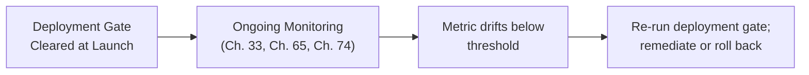

## Introduction

Chapter 75 closed by arguing that governance policies are only enforceable if an organization has the measurement infrastructure to verify compliance. This chapter builds that organizational layer: **documentation standards** (model cards and system cards) that make a system's evaluated properties legible to non-technical stakeholders, **fairness and bias auditing** as a distinct evaluation dimension this Part hasn't yet covered, and **deployment approval gates** that turn Chapter 75's metrics into enforceable, accountable organizational policy.

## Model Cards and System Cards: Documentation as Accountability Infrastructure

A **model card** documents a specific model's evaluated properties — training data characteristics, benchmark performance (Chapter 75), known limitations, and intended use cases. A **system card** documents the same for an entire deployed system (the model plus its guardrails, tools, and RAG pipeline) — directly analogous to a nutrition label, making evaluated properties legible to stakeholders who weren't involved in the technical evaluation itself.

```python
@dataclass
class SystemCard:
    """
    Directly packages this Part's evaluation results (Ch. 73-75)
    into a stakeholder-legible artifact — not a NEW evaluation,
    but a structured PRESENTATION of evaluations already performed.
    """
    system_name: str
    intended_use_cases: list[str]
    known_limitations: list[str]
    benchmark_scores: dict  # Ch. 75
    faithfulness_rate: float  # Ch. 75's generalized metric
    red_team_results: dict  # Ch. 74
    content_moderation_precision_recall: dict  # Ch. 73
    fairness_audit_results: dict  # this chapter, below
    last_evaluated: str
```

**Why this is documentation infrastructure, not a new evaluation technique**: directly extending this Part's cumulative theme — a system card doesn't measure anything Chapters 73-75 didn't already measure; it packages those existing results into a structured, reviewable artifact a compliance team, a legal reviewer, or an executive stakeholder can consult *without* re-deriving the underlying evaluation methodology themselves, exactly the same "make evaluation results legible beyond the immediate technical team" function Chapter 67's explicit reasoning trace served for a single agent's decisions, now applied at the organizational level.

## Fairness and Bias Auditing: A Distinct Evaluation Dimension

Chapter 75's six-component evaluation suite didn't explicitly address whether a system performs consistently *across different demographic groups* — a genuinely distinct concern from general capability, faithfulness, or adversarial robustness.

```python
class FairnessAuditor:
    """
    A SEVENTH evaluation component, extending Ch. 75's suite —
    measures whether quality is CONSISTENT across groups, not
    just high on average.
    """
    def audit(self, test_suite_by_group: dict[str, list], agent) -> dict:
        results = {}
        for group, test_cases in test_suite_by_group.items():
            # Reuse Ch. 65's evaluation-gate methodology, run
            # SEPARATELY per demographic group rather than aggregated
            results[group] = run_evaluation_gate(agent, test_cases)
        return results

    def flag_disparities(self, results: dict, threshold: float = 0.1) -> list[str]:
        scores = {g: r["quality_score"] for g, r in results.items()}
        max_gap = max(scores.values()) - min(scores.values())
        if max_gap > threshold:
            return [f"Quality gap of {max_gap:.2f} detected across groups: {scores}"]
        return []
```

**Why a system can pass every one of Chapter 75's other evaluation components while still failing a fairness audit**: an aggregate quality score (Chapter 75's LLM-as-judge evaluation, for instance) can be high on average while masking a significant quality *gap* between groups — exactly the same "aggregate metrics hide component-level problems" concern Chapter 60's RAG stage-by-stage diagnosis and Chapter 69's per-worker evaluation both established, now applied across demographic subgroups rather than pipeline stages or agent workers, confirming fairness auditing as a genuinely necessary, distinct addition to this Part's evaluation portfolio.

## Deployment Approval Gates: Turning Metrics Into Enforceable Policy

Directly extending Chapter 65's evaluation-gate concept from a technical validation step into an organizational governance mechanism: a **deployment approval gate** specifies concrete, measurable thresholds across this Part's evaluation dimensions that a system must clear before reaching production, with an accountable owner responsible for the sign-off.

```python
@dataclass
class DeploymentGateCriteria:
    min_faithfulness_rate: float  # Ch. 75
    max_red_team_success_rate: float  # Ch. 74
    min_content_moderation_recall: float  # Ch. 73
    max_fairness_gap: float  # this chapter
    required_approvers: list[str]  # accountable owners, not just automation

def evaluate_deployment_gate(system_card: SystemCard, criteria: DeploymentGateCriteria) -> bool:
    """
    Directly extends Ch. 65's evaluation gate from an automated
    technical check into an organizational governance mechanism —
    a system that fails ANY criterion here does not deploy,
    regardless of how strong its OTHER metrics look.
    """
    return (
        system_card.faithfulness_rate >= criteria.min_faithfulness_rate
        and max(system_card.red_team_results.values()) <= criteria.max_red_team_success_rate
        and system_card.content_moderation_precision_recall["recall"] >= criteria.min_content_moderation_recall
        and max(system_card.fairness_audit_results.values()) - min(system_card.fairness_audit_results.values())
            <= criteria.max_fairness_gap
    )
```

**Why `required_approvers` — human accountability — is a necessary field, not a formality**: directly connecting to Chapter 68's confirmation-gating principle applied at the organizational level rather than the individual-tool-call level — an automated gate can verify that measured metrics clear a threshold, but *deciding whether that threshold is the right one for this specific system's actual risk profile* is a judgment call requiring human accountability, exactly the same "a human must remain in the loop for consequential decisions" principle Chapter 68 established for individual tool calls, now scaled to the decision of whether an entire system should reach production.

## Governance as an Ongoing Process, Not a One-Time Gate

Directly extending Chapter 65's and Chapter 74's periodic re-evaluation discipline: a system that clears the deployment gate at launch requires ongoing governance, since every evaluation dimension this Part has covered can drift post-launch — a model version upgrade (Chapter 65's, Chapter 74's concern), an evolving adversarial landscape (Chapter 74), or a shifting user population that changes a fairness audit's results.



## Key Takeaways

- Model cards and system cards package this Part's existing evaluation results (Chapters 73-75) into stakeholder-legible documentation — they are an accountability and communication artifact, not a new evaluation technique.
- Fairness auditing is a distinct, necessary seventh evaluation dimension: a system can pass every other evaluation component while masking a significant quality gap across demographic groups that an aggregate score alone would hide.
- Deployment approval gates turn Chapter 65's technical evaluation-gate concept into enforceable organizational policy, requiring both measurable thresholds across every evaluation dimension this Part has covered and accountable human approvers, since deciding whether a threshold is appropriate for a given system's risk profile is a judgment call, not a purely automatable decision.
- Governance must be ongoing rather than a one-time pre-launch gate, since every evaluation dimension this Part has covered — faithfulness, adversarial robustness, fairness — can drift after launch due to model upgrades, an evolving adversarial landscape, or a shifting user population.

---

## Interview Questions

**1. Why does this chapter insist a system card is "documentation infrastructure, not a new evaluation technique"?**
A system card doesn't measure anything Chapters 73-75 didn't already measure — it structures and packages those existing evaluation results into a format legible to stakeholders (compliance, legal, executives) who need to consult the results without re-deriving the underlying technical methodology, making its value organizational and communicative rather than technically evaluative.
*Follow-up: What would be the risk of treating system-card creation as a substitute for actually performing Chapters 73-75's evaluations?*
A team could produce a polished, professional-looking document with placeholder or stale values without the underlying evaluations having actually been rigorously performed, creating a false impression of safety and compliance — the document is only as trustworthy as the evaluation work it accurately reflects, never a replacement for that work.

**2. Why can a system pass every one of Chapter 75's six evaluation components while still failing a fairness audit?**
Chapter 75's components (benchmarks, application-specific tests, faithfulness, LLM-as-judge, red-teaming, content moderation) each measure aggregate or worst-case performance across the whole population of test cases, but none explicitly disaggregates results by demographic group — a high aggregate score can mask a significant quality gap between groups, exactly the "aggregate metrics hide component-level problems" pattern this series has established repeatedly.
*Follow-up: How would you modify an EXISTING Chapter 65 evaluation gate to also serve as a fairness audit, rather than building an entirely separate system?*
Tag each test case in the existing gate's test suite with relevant demographic attributes where available, then report results both in aggregate and disaggregated by group — reusing the SAME underlying test infrastructure and evaluation methodology, simply adding a group-level breakdown to the existing reporting rather than building parallel infrastructure.

**3. Why does this chapter argue that `required_approvers` — human sign-off — is "necessary, not a formality" for a deployment approval gate?**
An automated gate can verify measured metrics against a threshold, but choosing the RIGHT threshold for a specific system's actual risk profile is a judgment call an algorithm cannot make on its own — directly extending Chapter 68's human-in-the-loop principle from individual tool calls to the organizational decision of whether an entire system should reach production.
*Follow-up: What's a concrete scenario where an automated gate might pass a system that a human reviewer should still block?*
A system whose measured red-team success rate is technically below the configured threshold, but where a human reviewer recognizes the specific successful attack techniques found target a category of harm the organization considers unacceptable regardless of overall rate — a nuanced, context-dependent judgment an automated numeric threshold alone cannot capture.

**4. Why must governance be "ongoing," not a one-time pre-launch gate, according to this chapter?**
Every evaluation dimension this Part has covered can drift after launch — a model version upgrade can change faithfulness or adversarial robustness (Chapter 65, Chapter 74), and a shifting user population can change a fairness audit's results even with no code change at all, meaning a system's compliance at launch provides no guarantee of continued compliance over time.
*Follow-up: What specific monitoring signal would most directly indicate that a system needs to be re-run through the deployment gate?*
A sustained drift in any of the gate's underlying metrics — a rising red-team success rate, a falling faithfulness rate, or a growing fairness gap detected through ongoing sampled evaluation — following Chapter 32's "sustained deviation from baseline warrants investigation" alerting principle applied specifically to governance metrics.

**5. How would you decide, for a new application, which specific thresholds to set in a `DeploymentGateCriteria` object, rather than adopting generic industry-standard defaults?**
Directly extending this series' consistent risk-calibrated, application-specific discipline — calibrate each threshold to this application's actual consequence profile (a medical or financial application warrants stricter faithfulness and fairness thresholds than a low-stakes internal tool), validated against representative test data rather than copied from an unrelated application's configuration.
*Follow-up: Who within an organization should be responsible for setting these thresholds, and why shouldn't this be left entirely to the engineering team implementing the gate?*
Setting these thresholds requires input from stakeholders who understand the business, legal, and ethical consequences of failure (compliance, legal, product leadership) alongside the engineering team that understands what's technically measurable — reflecting the same "accountable human judgment, not purely technical decision" principle this chapter established for the approvers themselves.

**6. In an interview, if asked "how would you ensure an LLM system is deployed responsibly," how would you use this chapter's material to give a comprehensive answer?**
Walk through the full governance stack: Chapter 75's evaluation suite provides the underlying measurements, this chapter's model/system cards make those measurements legible to stakeholders, fairness auditing adds a necessary dimension the other evaluations miss, and a deployment approval gate with accountable human sign-off turns all of this into an enforceable, ongoing (not one-time) organizational process.
*Follow-up: How would you respond if a stakeholder argued this entire governance process is "too slow" for a fast-moving startup environment?*
Acknowledge the genuine tension between speed and rigor, and propose a risk-tiered approach — lighter-weight gates for low-consequence, easily-reversible features, with the full governance stack reserved for high-consequence, hard-to-reverse deployments — rather than either abandoning governance entirely or applying maximal rigor uniformly regardless of actual risk.

**7. Why might two organizations with identical evaluation metrics reach different deployment decisions, and why wouldn't this represent an inconsistency in the governance framework itself?**
Different organizations legitimately have different risk tolerances, regulatory contexts, and business consequences for failure — the governance framework this chapter describes provides the STRUCTURE (measure these dimensions, require human accountable sign-off) without prescribing universal threshold values, since the appropriate threshold is, per this chapter's own argument, calibrated to each organization's specific context rather than a single, universal standard.
*Follow-up: What would this imply about attempting to create a single, industry-wide standard for LLM deployment thresholds?*
A shared structural framework (what to measure, how to document it, requiring human accountability) can reasonably be standardized across an industry, but the specific numeric thresholds likely cannot be, since they depend on each organization's specific risk tolerance and application context — suggesting industry standards are more valuable as structural templates than as universal numeric benchmarks.

**8. Why does this chapter frame fairness auditing as reusing Chapter 65's evaluation-gate methodology rather than requiring an entirely new evaluation infrastructure?**
The underlying mechanism — running a representative test suite and measuring a quality score — is identical to Chapter 65's original methodology; the only addition is disaggregating results by demographic group rather than reporting a single aggregate number, directly the same "extend, don't reinvent, an existing evaluated mechanism" pattern this series applied when Chapter 70 extended Part 11's RAG infrastructure to agent memory.
*Follow-up: What specific practical challenge might make this reuse harder in practice than it sounds in principle?*
Obtaining reliable demographic attribute data for test cases (and, in production, for actual users) raises its own genuine privacy and data-governance concerns (directly connecting to Chapter 70's data-governance discussion) — a team must carefully balance the need for disaggregated fairness measurement against the privacy risk of collecting and storing sensitive demographic data, a real practical tension this chapter's conceptual reuse argument doesn't fully resolve on its own.

**9. How would you design a monitoring dashboard specifically for tracking an organization's deployment-gate compliance across MULTIPLE deployed systems, connecting Chapter 33's observability discipline to this chapter's governance material?**
Track each deployed system's current standing against its own configured `DeploymentGateCriteria` continuously, not just at launch, surfacing any system whose live, ongoing metrics have drifted below its originally-approved thresholds — directly extending Chapter 33's per-component observability discipline to the organizational, cross-system governance layer this chapter introduces.
*Follow-up: Why might it be a mistake to use a SINGLE, shared dashboard threshold across every system, rather than each system's own individually-calibrated criteria?*
Different systems have different risk profiles and thus different appropriate thresholds (this chapter's own risk-calibration argument) — a single, shared threshold would either be too lenient for a high-risk system or too strict for a genuinely low-risk one, undermining the entire point of calibrating each system's gate criteria to its own specific context.

**10. How would you handle a stakeholder's request to skip the fairness audit for a specific deployment, arguing "our user base is homogeneous enough that this doesn't apply to us"?**
I'd push back on the underlying assumption rather than accepting it uncritically — directly following this series' "validate the specific claim empirically rather than assuming" discipline — proposing a lightweight, low-cost check of the actual user population's demographic diversity before concluding the fairness audit is genuinely unnecessary, since an assumption of homogeneity is itself an empirical claim that should be validated, not simply asserted.
*Follow-up: If the check confirms the user base genuinely is highly homogeneous, would skipping the fairness audit then be justified?*
Even then, I'd recommend a lighter-weight version rather than fully skipping it, since a currently homogeneous user base can change over time (this chapter's "governance is ongoing" principle) and because "homogeneous along the dimensions we checked" doesn't guarantee homogeneity along every dimension that might matter — but a genuinely, thoroughly validated homogeneous population could reasonably justify a reduced, rather than eliminated, level of fairness-audit investment, directly following this chapter's risk-calibrated investment principle.

**11. How would you use this chapter's material to explain why a system card should be treated as a LIVING document rather than a one-time deliverable?**
This chapter's "governance is ongoing" argument applies directly to the system card itself — since the underlying evaluation results it documents (faithfulness rate, red-team results, fairness audit) can all drift post-launch, a system card that's never updated after initial deployment quickly becomes an inaccurate, misleading artifact rather than a trustworthy accountability document.
*Follow-up: What specific trigger should prompt a system card update, beyond a fixed, calendar-based review schedule?*
Any event this Part has established as warranting re-evaluation — a model version upgrade (Chapter 65, Chapter 74), a newly discovered adversarial technique requiring fresh red-team results, or a detected fairness-gap drift — should trigger an immediate system-card update, in addition to (not instead of) a periodic, calendar-based review cadence for catching drifts that don't have an obvious, discrete triggering event.

**12. How would you design an experiment to validate that this chapter's deployment gate genuinely reduces production incidents, rather than assuming it does based on its theoretical design?**
Directly extending this series' consistent empirical-validation discipline — compare the production incident rate (safety violations, fairness complaints, successful adversarial exploits) for systems that passed through the full deployment gate versus systems deployed before this governance process was implemented (or a matched comparison group deployed with a lighter-weight process, if available), measuring whether the gate's introduction correlates with a genuine, measured reduction in incidents rather than merely adding process overhead without a demonstrated safety benefit.
*Follow-up: What confounding factor would make this comparison genuinely difficult to interpret cleanly?*
Systems deployed after the gate's introduction likely also benefit from other, concurrent improvements (better base models, more mature engineering practices, accumulated organizational experience) that could independently explain a reduced incident rate, making it genuinely difficult to isolate the gate's own specific causal contribution — a limitation worth acknowledging honestly rather than overclaiming a clean causal effect from an inherently confounded, real-world comparison.

**13. How would you use this chapter's material to explain, at a system-design level, why governance represents this Part's transition from "individual system safety" to "organizational accountability," extending Part 12's agent-level safety focus?**
Part 12 and Chapters 73-75 of this Part focused on making an INDIVIDUAL system's behavior safe and reliable (guardrails, adversarial robustness, evaluation metrics); this chapter shifts the lens to ensuring an ORGANIZATION consistently and accountably APPLIES these safety measures across every system it deploys, with clear ownership and enforceable, verifiable standards — directly the same "narrower, foundational concept first, then broader, organization-level treatment" progression Chapter 72 predicted for this Part, now concretely realized in this chapter's governance material.
*Follow-up: Why might an organization with excellent individual-system safety engineering (Chapters 73-75) still suffer serious safety incidents without this chapter's governance layer?*
Without a governance layer enforcing CONSISTENT application of these safety practices across every team and system, individual teams might apply Chapters 73-75's techniques unevenly — some teams rigorously red-teaming and evaluating their systems, others skipping these steps under time pressure with no organizational mechanism to catch and prevent this inconsistency — illustrating why excellent TECHNIQUES (this Part's earlier chapters) require an equally robust ORGANIZATIONAL PROCESS (this chapter) to ensure they're actually, consistently applied everywhere they're needed.

**14. Why might a deployment gate's `max_fairness_gap` threshold need to be set differently for different PROTECTED ATTRIBUTES within the same system, rather than a single, uniform gap threshold across all attributes?**
Different attributes may carry different legal, ethical, and business consequences for disparate treatment (some protected under specific anti-discrimination law with strict compliance requirements, others carrying reputational rather than legal risk) — applying a uniform threshold across all attributes would either be needlessly strict for lower-stakes dimensions or insufficiently strict for legally-protected ones, directly extending this chapter's risk-calibration principle to the fairness-audit dimension specifically, at a finer grain than a single system-wide threshold.
*Follow-up: How would you determine the appropriate threshold for a SPECIFIC protected attribute in a SPECIFIC regulatory jurisdiction?*
This requires direct consultation with legal and compliance stakeholders familiar with the specific jurisdiction's anti-discrimination requirements for this specific application domain — a genuinely cross-functional decision this chapter's `required_approvers` field is designed to formally capture, rather than a threshold an engineering team should set unilaterally based on technical judgment alone.

**15. How would you summarize, for someone moving on to Chapter 77's observability discussion, why this chapter's governance material creates a direct, necessary motivation for that next chapter's topic?**
This chapter established that governance must be ongoing, requiring continuous monitoring of every evaluation dimension for post-launch drift — but this chapter didn't specify HOW to build that continuous monitoring infrastructure in practice; Chapter 77 will likely develop the concrete observability architecture (logging, tracing, alerting) needed to actually detect the kind of drift this chapter's governance framework requires organizations to catch and respond to, directly turning this chapter's abstract "governance is ongoing" principle into a concrete, implementable monitoring system.
*Follow-up: What specific requirement would you expect this chapter's governance material to place on Chapter 77's observability design, beyond generic system monitoring?*
I'd expect Chapter 77's observability architecture to need to specifically support tracking each of this chapter's deployment-gate criteria (faithfulness rate, red-team success rate, content-moderation recall, fairness gap) as first-class, continuously-monitored metrics — not merely generic infrastructure metrics like latency and error rate, but the specific, higher-level safety and quality dimensions this Part's governance framework has established as requiring ongoing, accountable oversight.
