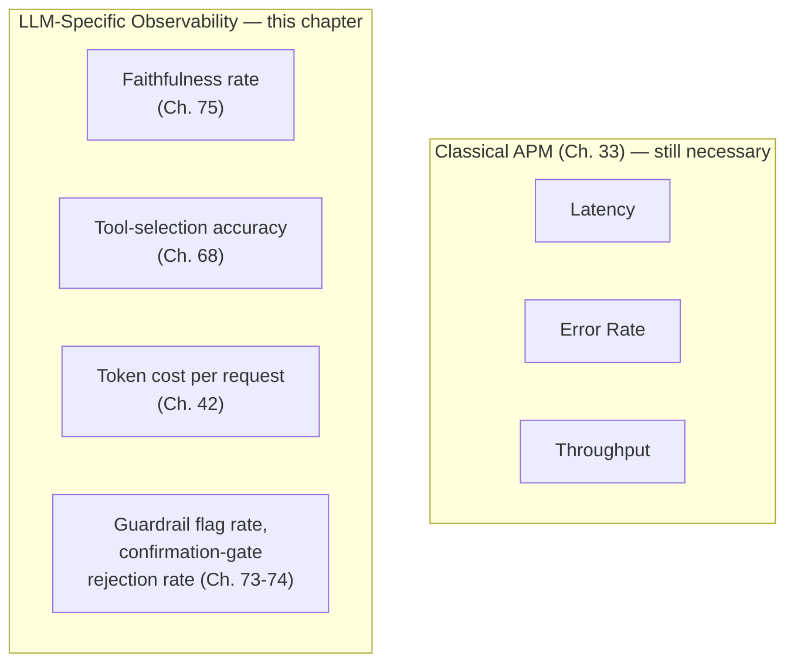

## Introduction

Chapter 76 closed by identifying a concrete gap: governance requires ongoing monitoring of faithfulness, red-team success rate, content-moderation recall, and fairness gap as first-class, continuously-tracked signals, but didn't specify the concrete architecture for building that monitoring. This chapter closes that gap: LLM-specific observability, extending classical APM (application performance monitoring) with the tracing, metrics, and alerting this Part's safety and quality dimensions specifically require.

## Why Classical APM Is Necessary but Insufficient

Standard application observability (Chapter 33) — latency, error rate, throughput — remains necessary for an LLM system exactly as it is for any other service, but is structurally insufficient: it has no concept of "faithfulness," "tool-selection accuracy," or "red-team success rate," since these are LLM-specific quality dimensions with no analog in classical service monitoring.



**Why this distinction matters practically**: a system could show perfectly healthy classical APM metrics (low latency, zero errors, high throughput) while silently degrading on every LLM-specific dimension this Part has established as safety-critical — a rising hallucination rate, a degrading tool-selection accuracy, or an increasing red-team success rate would produce no classical APM alert whatsoever, since none of these failure modes manifest as a request error or latency spike.

## Structured Tracing for Agentic Systems

Directly extending Chapter 69's earlier recommendation for hierarchical, structured tracing: a production agentic system needs distributed-tracing-style visibility into every reasoning step, tool call, and delegation across potentially nested agent invocations (Chapter 69's multi-agent architecture).

```python
@dataclass
class LLMTraceSpan:
    """
    Directly extends classical distributed tracing (a span per
    service call) to LLM-specific units: a span per reasoning step
    (Ch. 67), tool call (Ch. 68), or delegated sub-agent invocation
    (Ch. 69) — nested, exactly as Ch. 69's debugging discussion
    required.
    """
    span_type: str  # "reasoning_step" | "tool_call" | "sub_agent_delegation"
    input_tokens: int
    output_tokens: int
    latency_ms: float
    tool_name: str | None = None
    validation_result: str | None = None  # Ch. 68's semantic validation
    child_spans: list["LLMTraceSpan"] = field(default_factory=list)

def trace_agent_execution(agent, goal: str) -> LLMTraceSpan:
    """
    Wraps Ch. 72's ToolUsingAgent.run with full trace capture —
    directly resolving Ch. 71's "framework must provide adequate
    observability hooks" requirement for a from-scratch implementation.
    """
    root_span = LLMTraceSpan(span_type="task_execution", input_tokens=0,
                                output_tokens=0, latency_ms=0)
    # each reasoning step, tool call, and delegation appends a
    # child span here, preserving Ch. 69's nested structure
    return root_span
```

**Why this directly resolves Chapter 69's debugging-complexity concern**: Chapter 69 established that multi-agent failures require tracing through multiple nested reasoning traces to isolate a responsible level; a structured, hierarchical trace captured at generation time (rather than reconstructed after the fact from scattered logs) makes this isolation tractable — a system designer can navigate directly to the specific span (a specific reasoning step, tool call, or sub-agent delegation) responsible for an observed failure, exactly the capability Chapter 71 identified LangGraph's explicit state graph as providing, now shown as implementable directly rather than requiring that specific framework.

## Token and Cost Observability

Directly extending Chapter 42's cost modeling into a live, per-request observability signal — Chapter 69's multiplicative cost-compounding concern for multi-agent systems is only actionable if cost is actually measured and tracked at the granularity that reveals it.

```python
class CostTracker:
    """
    Directly extends Ch. 69's earlier "centralized cost tracker"
    interview answer into concrete observability infrastructure —
    wraps every LLM call, regardless of nesting depth, so
    multiplicative multi-agent cost (Ch. 69) is visible rather
    than only estimated theoretically.
    """
    def __init__(self):
        self.total_cost = 0.0
        self.cost_by_span_type: dict[str, float] = {}

    def record(self, span: LLMTraceSpan, cost_per_1k_tokens: float) -> None:
        cost = (span.input_tokens + span.output_tokens) / 1000 * cost_per_1k_tokens
        self.total_cost += cost
        self.cost_by_span_type[span.span_type] = (
            self.cost_by_span_type.get(span.span_type, 0) + cost
        )
```

**Why per-span-type cost breakdown matters more than a single aggregate cost figure**: directly extending this Part's and this series' decomposed-metrics discipline (Chapter 66, Chapter 69, Chapter 75) — an aggregate cost figure tells a team *that* cost is high, but a breakdown by span type (how much cost comes from sub-agent delegations versus the top-level orchestrator's own reasoning, per Chapter 69's architecture) tells a team *where* to focus a cost-optimization effort, directly enabling the kind of evidence-based remediation this series has consistently favored over an undifferentiated "make it cheaper somehow" directive.

## Alerting Calibrated to LLM-Specific Failure Patterns

Directly extending Chapter 32's alerting discipline — a sustained deviation from an established baseline warrants investigation — to the LLM-specific metrics this chapter has introduced.

```python
def check_llm_specific_alerts(current_metrics: dict, baseline_metrics: dict,
                                 thresholds: dict) -> list[str]:
    """
    Directly extends Ch. 32's alerting principle to Ch. 73-76's
    safety and quality metrics, not just classical latency/error-rate.
    """
    alerts = []
    if current_metrics["faithfulness_rate"] < baseline_metrics["faithfulness_rate"] - thresholds["faithfulness_drop"]:
        alerts.append("Faithfulness rate has dropped below baseline — possible model drift (Ch. 65, Ch. 75)")
    if current_metrics["confirmation_gate_rejection_rate"] > baseline_metrics["confirmation_gate_rejection_rate"] + thresholds["rejection_spike"]:
        alerts.append("Confirmation-gate rejections spiking — possible active injection attempt (Ch. 74)")
    if current_metrics["tool_selection_accuracy"] < baseline_metrics["tool_selection_accuracy"] - thresholds["tool_accuracy_drop"]:
        alerts.append("Tool-selection accuracy degrading — check for tool schema regression (Ch. 68, Ch. 71)")
    return alerts
```

**Why these specific alert conditions directly trace back to earlier chapters' diagnostic reasoning**: each alert condition is a direct, concrete implementation of a diagnostic pattern this Part already established in the abstract — the confirmation-gate rejection-rate alert directly implements Chapter 74's interview discussion of this exact signal as an active-attack early-warning indicator, and the tool-selection-accuracy alert directly implements Chapter 68's and Chapter 71's discussion of what a framework or schema regression looks like in practice — this chapter's contribution isn't new diagnostic reasoning, but rather turning this Part's cumulative diagnostic knowledge into concrete, automatically-checked alert conditions.

## Key Takeaways

- Classical APM (latency, error rate, throughput) remains necessary but is structurally insufficient for LLM systems, since it has no concept of faithfulness, tool-selection accuracy, or adversarial-robustness metrics — a system can show healthy classical APM while silently degrading on every LLM-specific safety dimension.
- Structured, hierarchical tracing captured at generation time directly resolves Chapter 69's multi-agent debugging-complexity concern, making it possible to navigate directly to the specific reasoning step, tool call, or delegation responsible for an observed failure.
- Cost observability must be broken down by span type (reasoning step, tool call, sub-agent delegation), not reported as a single aggregate figure, to make Chapter 69's multiplicative cost-compounding concern actionable rather than merely theoretically understood.
- LLM-specific alerting extends Chapter 32's baseline-deviation principle to this Part's safety and quality metrics — each alert condition should trace back to a specific diagnostic pattern this Part already established, turning cumulative diagnostic knowledge into automatically-checked, production-ready alert conditions.

---

## Interview Questions

**1. Why does this chapter argue classical APM is "structurally insufficient" for LLM systems, rather than simply "less complete"?**
"Structurally insufficient" is precise because the gap isn't a matter of degree (classical APM covering LLM concerns partially) but of kind — latency, error rate, and throughput have literally no mechanism for representing concepts like faithfulness or tool-selection accuracy, since these require domain-specific evaluation logic (Chapter 75's methodology) that a generic APM system has no way to compute or represent, making the gap categorical rather than a matter of needing more detailed classical metrics.
*Follow-up: Could a sufficiently detailed classical APM system (finer-grained latency breakdowns, more error categories) eventually close this gap?*
No — this misunderstands the nature of the gap in the same way Chapter 74's "larger organic test set" misconception did: finer-grained classical metrics still only measure classical dimensions (timing, success/failure of a request) and provide no mechanism for assessing whether a SUCCESSFUL, FAST response is actually faithful, correctly tool-selected, or adversarially robust — closing this gap requires genuinely new metric TYPES (this chapter's LLM-specific observability), not finer granularity within the existing classical metric types.

**2. Why does this chapter describe structured tracing as directly resolving Chapter 69's debugging-complexity concern, rather than merely making debugging "somewhat easier"?**
Chapter 69 identified the SPECIFIC difficulty as needing to trace through MULTIPLE nested reasoning traces to isolate a responsible failure level; this chapter's `LLMTraceSpan` structure, with its explicit `child_spans` nesting, directly captures exactly this hierarchical structure at generation time, meaning a system designer can navigate directly to the responsible span rather than reconstructing this structure after the fact from scattered, unstructured logs — this is a direct, structural resolution of the SPECIFIC problem Chapter 69 named, not merely a general improvement in debugging convenience.
*Follow-up: What would be lost if a team captured this same information but WITHOUT the explicit parent-child nesting structure — just a flat list of all spans with timestamps?*
Without explicit nesting, a system designer would need to manually reconstruct WHICH spans belong to which parent invocation by inferring relationships from timestamps and context — exactly the kind of manual, error-prone reconstruction work Chapter 69's original concern was about, meaning a flat structure would only partially address the problem, reintroducing much of the original debugging burden even though the raw information exists somewhere in the logs.

**3. Why does this chapter argue that a per-span-type cost breakdown is more valuable than a single aggregate cost figure?**
Directly extending this series' decomposed-metrics discipline — an aggregate figure answers "how much are we spending" but not "where should we focus a cost-optimization effort," while a breakdown by span type (top-level orchestrator reasoning versus sub-agent delegation cost, per Chapter 69's architecture) directly points toward the specific component responsible for a disproportionate share of cost, enabling targeted remediation rather than an undirected, guess-based cost-reduction effort.
*Follow-up: How would you use this specific breakdown to decide between Chapter 51's model-cascade cost optimization and Chapter 69's worker-specialization approach for a specific system showing high cost?*
If the breakdown reveals cost concentrated in a SPECIFIC worker type's own reasoning (rather than spread evenly across delegation overhead), this points toward Chapter 51's cascade approach — using a smaller, cheaper model for THAT SPECIFIC worker's task, per Chapter 69's earlier discussion of differentiated model selection by agent role; if cost is instead concentrated in the SHEER NUMBER of delegations occurring (many small, cheap calls rather than a few expensive ones), this points toward re-examining the orchestrator's decomposition strategy itself (Chapter 69's specialization trade-offs) rather than any single component's model choice.

**4. Why does this chapter's alerting example specifically reuse Chapter 74's "confirmation-gate rejection rate spike as active-attack indicator" reasoning, rather than inventing a new alert condition?**
This directly demonstrates this chapter's own stated contribution — not new diagnostic reasoning, but turning this Part's ALREADY-ESTABLISHED diagnostic knowledge into concrete, automatically-checked alert conditions; Chapter 74 already established the DIAGNOSTIC LOGIC (why this specific signal is meaningful), and this chapter's job is purely the OBSERVABILITY ENGINEERING task of making that logic operationally actionable as a monitored, alerting metric, rather than leaving it as a piece of theoretical understanding a team would need to remember to manually check.
*Follow-up: What risk would a team run if they implemented this chapter's alerting infrastructure WITHOUT first having internalized Chapter 74's underlying diagnostic reasoning for why this specific alert matters?*
A team might receive the alert firing but not understand what response it warrants — treating it as a generic anomaly to investigate through trial and error, rather than immediately recognizing (per Chapter 74's specific reasoning) that this signal suggests an active injection attempt requiring immediate security-focused investigation — illustrating why this chapter's observability infrastructure is only genuinely useful when paired with the underlying diagnostic understanding this Part's earlier chapters built, exactly the "framework-competent but conceptually shallow" risk Chapter 71 warned against, now applied to observability tooling specifically.

**5. How would you decide, for a resource-constrained team, which of this chapter's LLM-specific metrics to instrument FIRST, rather than building comprehensive observability for every dimension simultaneously?**
Directly extending this series' risk-calibrated investment discipline — prioritize instrumenting the metrics most directly tied to this Part's highest-consequence failure modes for THIS specific application: an application with state-changing tools should prioritize confirmation-gate rejection-rate tracking (Chapter 74's attack-detection signal) and tool-selection accuracy (Chapter 68) first, while a pure-generation application without tool access might reasonably prioritize faithfulness-rate tracking (Chapter 75) first instead, calibrating instrumentation priority to the application's specific risk profile rather than instrumenting uniformly across every possible metric from day one.
*Follow-up: Why might cost observability (this chapter's CostTracker) reasonably be a HIGH priority for almost any application, regardless of its specific risk profile?*
Unlike safety-specific metrics whose priority depends on the application's specific risk profile, cost has a UNIVERSAL, near-immediate business impact for virtually any deployed system — an uncontrolled cost spike (Chapter 69's multiplicative compounding concern) can create urgent, direct financial consequences regardless of whether the application involves state-changing tools or high-stakes content generation, making cost observability a nearly universal, high-priority instrumentation target even before an application-specific risk assessment is fully completed.

**6. In an interview, if asked to design the observability architecture for a new multi-agent production system, how would you use this chapter's material to give a comprehensive answer?**
I'd describe a layered architecture combining classical APM (Chapter 33, still necessary for basic service health) with this chapter's LLM-specific additions: structured, hierarchical tracing (this chapter's `LLMTraceSpan`) capturing every reasoning step and delegation per Chapter 69's nested-agent structure, per-span-type cost tracking (this chapter's `CostTracker`) to make Chapter 69's cost-compounding concern actionable, and alerting calibrated to this Part's specific safety metrics (faithfulness, confirmation-gate rejections, tool-selection accuracy) rather than only classical latency and error-rate thresholds — explicitly noting that none of this replaces classical APM, but rather extends it with the LLM-specific dimensions classical tooling structurally cannot represent.
*Follow-up: How would you handle a follow-up question about the storage and query-performance implications of capturing this much detailed, per-span tracing data at scale?*
I'd propose a sampling strategy analogous to this series' consistent cost-calibrated monitoring discipline (Chapter 75's sampled faithfulness checks) — capturing full, detailed traces for a representative sample of requests (and always for requests that trigger any alert condition or confirmation-gate rejection, ensuring high-value diagnostic data is never sampled away) rather than exhaustively storing every span for every single request, balancing genuine diagnostic value against the real storage and query-performance costs of comprehensive tracing at production scale.

**7. Why might a team need to re-establish their alerting baselines after a model version upgrade, connecting this chapter's alerting material to Chapter 65's and Chapter 74's regression-testing discipline?**
This chapter's alerting logic explicitly compares CURRENT metrics against BASELINE metrics — if the underlying model version changes (Chapter 65's, Chapter 74's recurring concern), the EXPECTED baseline values for faithfulness rate, tool-selection accuracy, and other metrics may legitimately shift even in the ABSENCE of any actual problem, meaning stale, pre-upgrade baselines could either trigger false alerts (flagging a legitimate, expected shift as an anomaly) or fail to catch a genuine regression (if the new baseline the team should be comparing against was never properly re-established).
*Follow-up: How would you distinguish a "legitimate baseline shift due to a model upgrade" from a "genuine regression requiring remediation" when both manifest as a metric moving away from the old baseline?*
I'd directly apply Chapter 65's evaluation-gate methodology as the deciding mechanism rather than relying on the live alerting signal alone — running the new model version through the full, standing evaluation-gate test suite BEFORE deploying it to production, establishing whether the shift represents an IMPROVEMENT, an acceptable trade-off, or a genuine regression, and only THEN updating the live alerting baseline to reflect the new, validated expected performance — using the offline evaluation gate to interpret and validate what the live observability signal alone cannot distinguish.

**8. How would you use this chapter's material to explain why "tokens" rather than "requests" is the more meaningful unit for cost observability in an LLM system, connecting to Chapter 42's original cost-modeling material?**
Chapter 42 established that LLM cost scales with token count, not request count — two requests with identical latency and success status can have dramatically different costs if one involves a much larger context window (per Chapter 67's discussion of trajectory accumulation increasing token count as an agentic task progresses) — tracking cost per REQUEST would obscure this variation, while tracking cost per TOKEN (this chapter's `CostTracker` design) directly reflects the actual, underlying cost driver, making it the meaningful unit for genuine cost observability rather than a proxy metric that could mislead a team about where their actual costs originate.
*Follow-up: Why might INPUT tokens and OUTPUT tokens need to be tracked SEPARATELY, rather than as a single combined token count, for a genuinely useful cost breakdown?*
Many LLM providers price input and output tokens differently (often output tokens cost meaningfully more per token than input tokens), meaning a combined count would obscure the actual cost driver — a system generating long responses to short prompts has a very different cost profile than one processing long prompts into short responses, even at an identical COMBINED token count, making the input/output distinction this chapter's `LLMTraceSpan` explicitly preserves a genuinely necessary level of granularity for accurate cost analysis and optimization.

**9. How would you design a dashboard that helps a team quickly distinguish between a genuine SYSTEM problem and a genuine USER-BEHAVIOR shift, using this chapter's observability material, extending a diagnostic pattern from Chapter 73's earlier discussion?**
Directly extending Chapter 73's own "input-stage versus output-stage flagging rate" diagnostic distinction — I'd track this chapter's metrics separately at the input stage (what users are asking, tracked via Chapter 73's input guardrail flagging rate) versus the model's own generation-stage behavior (faithfulness rate, tool-selection accuracy) — a shift concentrated at the INPUT stage, with generation-stage metrics remaining stable, points toward a genuine user-behavior change, while a shift concentrated at the GENERATION stage with stable input patterns points toward a genuine system problem (a model upgrade, a tool schema regression), directly reusing Chapter 73's diagnostic logic as this chapter's dashboard design principle.
*Follow-up: What would BOTH input-stage AND generation-stage metrics shifting SIMULTANEOUSLY suggest, and how would this change your diagnostic approach?*
Simultaneous shifts at both stages suggest either a genuinely large, systemic event (a major user-behavior shift that's ALSO exposing a system's genuine handling weaknesses under the new pattern) or, more concerningly, an active adversarial campaign (Chapter 74) deliberately probing the system with a coordinated pattern of both unusual inputs AND resulting unusual outputs — in this specific case, I'd prioritize immediately cross-referencing this chapter's confirmation-gate rejection-rate signal (Chapter 74's specific attack indicator) to help distinguish between these two genuinely different explanations before committing to either a user-research-focused or a security-focused remediation path.

**10. How would you handle a stakeholder's request to REDUCE tracing detail to save on storage costs, given this chapter's tracing infrastructure is comprehensive and potentially expensive at scale?**
I'd apply the sampling strategy discussed in an earlier question in this chapter — rather than uniformly reducing detail across ALL traces, I'd propose a tiered approach: full, detailed tracing for a representative SAMPLE of routine requests (sufficient for ongoing statistical monitoring) plus GUARANTEED full-detail tracing for any request that triggers an alert condition, a confirmation-gate rejection, or a red-team-flagged pattern (Chapter 74) — since these HIGH-VALUE diagnostic cases are exactly where comprehensive tracing detail provides the most benefit, and losing detail on them specifically would undermine this chapter's core debugging and security-investigation value proposition even while achieving genuine, meaningful cost savings on routine, unremarkable traffic.
*Follow-up: How would you validate that this tiered sampling approach genuinely preserves diagnostic capability, rather than simply assuming it does?*
I'd retrospectively test this sampling strategy against a set of KNOWN, PAST incidents this Part's material has established as important to catch (a documented past injection attempt, a documented past tool-selection regression) — confirming that the tiered approach's "guaranteed full detail for flagged events" rule would have ACTUALLY captured sufficient detail to diagnose these PAST incidents correctly, providing direct, empirical validation that the proposed cost-saving sampling strategy doesn't silently compromise the observability system's core diagnostic purpose.

**11. Why might a team's observability infrastructure itself become a target worth specifically protecting, connecting this chapter's material to Chapter 74's adversarial threat model?**
If an attacker gains awareness of or access to a system's observability infrastructure, they could potentially use this visibility to more precisely craft an attack that evades detection (understanding exactly what triggers an alert allows an adversary to specifically avoid triggering it) — or, more directly, could attempt to manipulate the observability data itself (falsifying metrics to hide an ongoing attack) — meaning this chapter's observability infrastructure isn't merely a passive monitoring tool but is itself part of the system's overall attack surface, requiring the same access-control and integrity considerations this series has applied to every other consequential system component.
*Follow-up: What specific access-control principle from earlier in this series would you apply to protect this observability infrastructure itself?*
I'd apply the same "constrain access to genuinely demonstrated need" principle Chapter 67 established for tool-set scoping and Chapter 55 established for multi-tenant isolation — restricting write access to observability data (metrics, traces) to only the systems and processes that legitimately generate it, and restricting read/query access based on genuine need-to-know, treating the observability system's own integrity as a security-relevant concern rather than an implicitly-trusted, unprotected component of the overall architecture.

**12. How would you use this chapter's material to explain why "we have comprehensive dashboards" doesn't automatically mean "we would actually catch a real production problem quickly," extending a theme from Chapter 70's "infrastructure doesn't guarantee quality" discussion?**
Chapter 70 established that having memory infrastructure doesn't automatically mean an agent effectively USES that memory to improve outcomes; the identical principle applies here — having comprehensive dashboards and tracing infrastructure (this chapter's technical capability) doesn't automatically mean a team has correctly configured MEANINGFUL alert thresholds (this chapter's alerting section), has established the RIGHT baselines (an earlier question in this chapter), or has the organizational PROCESS to actually respond promptly when an alert fires — infrastructure and effective utilization remain genuinely separate concerns, exactly the same distinction Chapter 70 established for memory and this chapter now establishes for observability.
*Follow-up: What specific test would directly validate whether a team's observability infrastructure translates into genuine incident-response capability, rather than merely existing as unused dashboards?*
I'd recommend running periodic, deliberate "fire drill" exercises — intentionally injecting a known, simulated failure (a simulated faithfulness drop, a simulated confirmation-gate rejection spike) into a staging environment and measuring how quickly and correctly the team actually detects and responds to it using their existing observability tooling — directly testing the FULL pipeline (detection, alerting, human response) rather than merely confirming the underlying metrics are technically being collected and displayed somewhere.

**13. How would you use this chapter's material to explain why observability and Chapter 76's governance material are tightly coupled, rather than independent concerns?**
Chapter 76 established that governance requires ONGOING monitoring of specific metrics (faithfulness rate, red-team success rate, fairness gap) to detect post-launch drift; this chapter provides the CONCRETE technical infrastructure (structured tracing, cost tracking, calibrated alerting) that makes this ONGOING monitoring actually possible — governance without this chapter's observability infrastructure would be an unenforceable aspiration (exactly Chapter 76's own opening argument), while this chapter's observability infrastructure without Chapter 76's governance framework would be technically sophisticated monitoring with no organizational process or accountability structure directing WHAT to monitor and WHO responds when a threshold is breached — each chapter is the other's necessary complement.
*Follow-up: Which chapter's material would you recommend a team build FIRST if resource-constrained, and why?*
I'd recommend this chapter's observability infrastructure first, since it provides genuine value even in the ABSENCE of Chapter 76's formal governance process (a team benefits from visibility into faithfulness rate and cost even without a formal deployment gate) — while Chapter 76's governance framework, without this chapter's underlying observability infrastructure to actually measure compliance, would have no concrete mechanism to enforce its own policies, making observability infrastructure the more foundational, prerequisite investment of the two.

**14. How would you use this chapter's material to design a POST-INCIDENT review process specifically for an LLM system, extending classical incident-review practices with this chapter's LLM-specific tracing?**
I'd directly leverage this chapter's structured, hierarchical trace capture (this chapter's `LLMTraceSpan`) as the PRIMARY evidence source for the review — walking through the SPECIFIC reasoning steps, tool calls, and delegations that led to the incident, exactly the way a classical distributed-tracing-based incident review would walk through service-call spans — but SPECIFICALLY asking this Part's diagnostic questions at each span (was this reasoning step's output faithful to its grounding sources, per Chapter 75; did this tool call pass semantic validation, per Chapter 68; did this confirmation gate fire correctly, per Chapter 68 and Chapter 74) rather than only classical questions (was this call slow, did this call error) — directly extending a classical incident-review METHODOLOGY with this Part's LLM-specific diagnostic CONTENT.
*Follow-up: What specific artifact from this chapter would you expect to be MOST valuable during this review — the aggregate metrics dashboard, or the detailed per-request trace?*
The detailed per-request trace for the SPECIFIC incident would be far more valuable than the aggregate dashboard for a POST-INCIDENT review specifically — the aggregate dashboard is valuable for DETECTING that something went wrong (this chapter's alerting section) and for tracking overall trends, but understanding EXACTLY why THIS specific incident occurred requires the granular, span-by-span detail only a full, detailed trace of the SPECIFIC failing request provides — directly reinforcing why this chapter recommended guaranteed full-detail tracing for flagged or anomalous events specifically, since this is precisely the kind of review where that guaranteed detail becomes essential.

**15. How would you summarize, for someone moving on to Chapter 78's multimodal LLMs discussion, why this chapter's observability material remains directly relevant even as this Part's focus shifts to a different technical topic?**
This chapter established a GENERAL observability architecture (structured tracing, cost tracking, calibrated alerting) built around this Part's established safety and quality dimensions — Chapter 78's multimodal material will introduce NEW modalities (images, audio) with their OWN, likely DISTINCT quality and safety concerns (a multimodal system's "faithfulness" might mean something different when grounding a claim in an IMAGE rather than a text document, for instance), but the UNDERLYING observability ARCHITECTURE this chapter established — structured tracing, cost tracking broken down by meaningful units, alerting calibrated to domain-specific baseline metrics — remains the correct FRAMEWORK to apply, simply extended with whatever NEW, modality-specific metrics Chapter 78's material identifies as necessary, rather than requiring an entirely new observability paradigm.
*Follow-up: What SPECIFIC new metric would you expect Chapter 78 to require this chapter's observability architecture to accommodate, given multimodal systems' likely distinct characteristics?*
I'd expect Chapter 78 to require tracking image or audio TOKEN/PROCESSING COST separately from text token cost (since multimodal inputs likely have a genuinely different, often substantially higher, cost structure per unit of content than text), directly extending this chapter's `CostTracker`'s per-span-type breakdown principle to accommodate a new dimension: cost broken down by MODALITY, not just by span type — a natural, incremental extension of this chapter's existing architecture rather than a fundamentally new observability concept.
