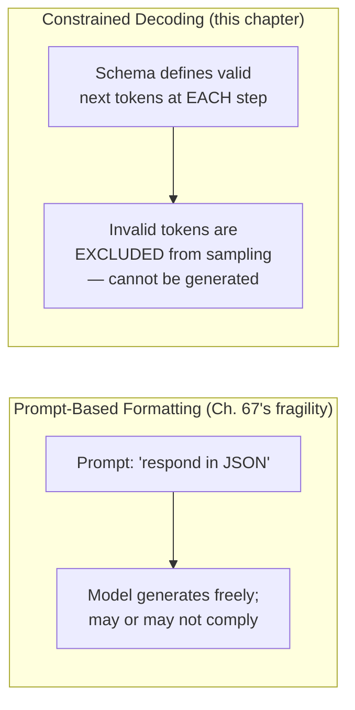
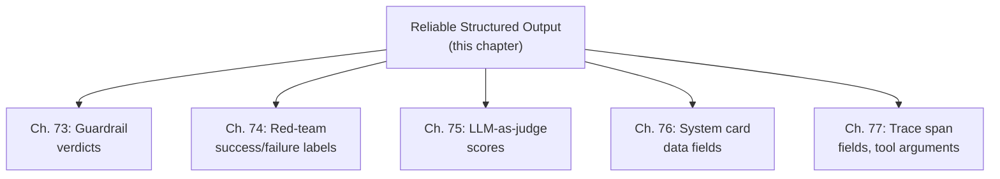

## Introduction

Chapter 78 closed by identifying a genuinely new challenge: representing multimodal content within a text-based structured-output format like JSON. This chapter completes Part 13's arc by formalizing structured output itself — the mechanism Chapter 68 relied on for reliable tool calling, and the same mechanism Chapter 78 identified as needing multimodal-aware extension. This is deliberately the closing chapter of this Part: every prior chapter's safety and evaluation architecture (guardrails, faithfulness checks, red-team results) is only actionable if the LLM's output can be reliably parsed into a structured form a downstream system can consume.

## Constrained Decoding vs. Prompt-Based Formatting

Chapter 68 distinguished native function calling (provider-guaranteed schema conformance) from Chapter 67's fragile, prompt-based free-text parsing. This chapter makes the underlying mechanism explicit: **constrained decoding** restricts the model's token-generation process itself, at each decoding step, to only tokens that keep the output consistent with a target schema — a structural guarantee, not an instructional request.



```python
def constrained_decode_step(logits: list[float], valid_next_tokens: set[int]) -> int:
    """
    Illustrates the CORE mechanism underlying reliable structured
    output: at each decoding step, tokens NOT in valid_next_tokens
    (determined by the schema's current parse state) are masked out
    BEFORE sampling — the model literally cannot produce an
    invalid token, unlike prompt-based formatting's mere request.
    """
    masked_logits = [
        logit if i in valid_next_tokens else float("-inf")
        for i, logit in enumerate(logits)
    ]
    return sample(masked_logits)  # invalid tokens have zero probability
```

**Why this is Chapter 68's structural-versus-instructional principle applied at the token-generation level itself**: this is the most granular possible instance of the principle this Part has invoked repeatedly (Chapter 68's SQL-tool restriction, Chapter 73's classifier-over-prompt argument, Chapter 74's confirmation gate) — rather than asking the model to comply with a format and hoping it does, constrained decoding makes non-compliant output *mechanically impossible* at the level of individual token sampling, which is why Chapter 68 described provider-native function calling as fundamentally more reliable than free-text parsing: it's typically implemented via exactly this mechanism.

## Schema Design for Reliability, Extending Chapter 68

Chapter 68 established that tool schemas deserve API-documentation-level rigor. This chapter extends that principle to structured-output schemas generally, adding a consideration specific to constrained decoding: an overly complex or deeply nested schema can force the model into token sequences it finds unnatural, degrading output *quality* even while guaranteeing structural *validity*.

```python
# A schema that guarantees VALID JSON but risks poor CONTENT quality —
# constrained decoding guarantees the STRUCTURE, never the substance
poorly_designed_schema = {
    "type": "object",
    "properties": {
        "a": {"type": "object", "properties": {
            "b": {"type": "object", "properties": {
                "c": {"type": "array", "items": {"type": "object", "properties": {
                    "value": {"type": "string"}
                }}}
            }}
        }}
    }
}

# A flatter, more natural schema for the SAME underlying data —
# still fully valid, but easier for the model to populate well
better_schema = {
    "type": "object",
    "properties": {
        "items": {"type": "array", "items": {"type": "string"}}
    }
}
```

**Why "the output will always be valid JSON" is a necessary but insufficient guarantee, directly echoing Chapter 68's structural-versus-semantic distinction**: constrained decoding guarantees the *schema conformance* Chapter 68 identified as necessary but not sufficient — it says nothing about whether the *values* the model populates within that valid structure are correct, relevant, or well-reasoned; Chapter 68's semantic validation layer remains just as necessary here as it was for tool calls, since a perfectly schema-valid JSON object can still contain a hallucinated or nonsensical value in any given field.

## Handling Multimodal Content Within Structured Output

Directly resolving Chapter 78's closing question: representing image content within a fundamentally text-based schema format.

```python
multimodal_output_schema = {
    "type": "object",
    "properties": {
        "description": {"type": "string"},
        "referenced_region": {
            "type": "object",
            "description": "A bounding box in the source image, NOT the image data itself",
            "properties": {
                "x": {"type": "number"}, "y": {"type": "number"},
                "width": {"type": "number"}, "height": {"type": "number"},
            },
        },
    },
}
```

**Why this schema references a region rather than embedding image data**: directly resolving Chapter 78's specific concern — embedding raw image data (even base64-encoded) within a JSON field the model must *generate* token-by-token is both prohibitively expensive (Chapter 78's resolution-dependent token cost, now paid again for output rather than only input) and architecturally awkward for constrained decoding (a vision-language model doesn't "generate" pixel data through the same decoding process it uses for text); the correct pattern is a structured *reference* into content the system already has access to (a bounding box, a source-document identifier), keeping the LLM's output focused on what it can reliably produce — text and numbers — while treating the actual image data as an artifact managed outside the schema itself.

## Closing the Loop: Structured Output as the Foundation This Entire Part Depended On

Every prior chapter in this Part quietly assumed reliable structured output was available: Chapter 73's guardrails need a classifier's verdict in a parseable format; Chapter 74's red-team evaluation needs to programmatically determine whether an attack succeeded; Chapter 75's evaluation suite needs LLM-as-judge scores in a consistently parseable format; Chapter 76's system cards are themselves structured data; Chapter 77's tracing infrastructure needs tool-call arguments in structured form to log and analyze them.



**Why this makes structured output this Part's genuinely foundational, if implicit, dependency**: none of this Part's safety and evaluation machinery would be *automatable* without the reliability this chapter has now made explicit — a guardrail that can't reliably parse a classifier's verdict, or an evaluation suite that can't reliably parse a judge's score, degrades back into exactly the free-text parsing fragility Chapter 67 originally flagged, confirming why this chapter, despite appearing last in this Part's ordering, addresses a concern every other chapter's machinery silently assumed was already solved.

## Key Takeaways

- Constrained decoding restricts token generation itself to schema-valid tokens at each decoding step, making non-compliant output mechanically impossible — the most granular possible instance of this Part's recurring structural-over-instructional safety principle.
- Schema conformance (guaranteed by constrained decoding) is necessary but not sufficient, directly echoing Chapter 68's structural-versus-semantic validation distinction — a schema-valid output can still contain incorrect or hallucinated field values requiring the same semantic validation layer.
- An overly complex or deeply nested schema can guarantee structural validity while degrading the model's output quality — schema design deserves the same API-documentation-level rigor Chapter 68 established for tool schemas, now extended with attention to how schema shape affects generation quality.
- Multimodal content within structured output should be represented as a reference (a bounding box, an identifier) into externally-managed content rather than embedded directly, resolving Chapter 78's cost and architectural concerns.
- Reliable structured output is the foundational, if often implicit, dependency underlying every other safety and evaluation mechanism this Part introduced — guardrails, red-teaming, evaluation, governance, and observability all silently assumed the reliability this chapter makes explicit.

---

## Interview Questions

**1. Why does this chapter describe constrained decoding as "the most granular possible instance" of this Part's structural-over-instructional principle?**
Every other structural safeguard this Part has discussed (Chapter 68's SQL-tool restriction, Chapter 74's confirmation gate) operates at the level of an entire action or tool call — permitting or blocking a discrete, whole operation; constrained decoding operates at the level of individual TOKEN sampling, the smallest unit of generation an LLM produces — making invalid output impossible not by blocking a completed, invalid action after the fact, but by never allowing the invalid tokens to be sampled in the first place, the finest possible granularity at which a structural constraint could be applied.
*Follow-up: Why might this extreme granularity make constrained decoding LESS flexible than a coarser structural constraint, even though it provides a stronger guarantee?*
Because the constraint operates before the model has "seen" the full context of what it's trying to express, an overly rigid schema can force the model into a token sequence that's valid but represents a worse expression of its actual intended content than an unconstrained generation would have produced — a coarser constraint (like Chapter 68's SQL-tool restriction, which only limits the CATEGORY of query, not every individual token) leaves the model more room to express itself naturally within the allowed category, illustrating a genuine granularity-versus-flexibility trade-off this chapter's schema-design section addresses directly.

**2. Why is schema conformance described as "necessary but not sufficient," directly paralleling Chapter 68's exact language for tool-call validation?**
The parallel is deliberate and precise — in both cases, a technical guarantee ensures the OUTPUT'S STRUCTURE is correct (valid JSON matching a schema, or a well-formed tool call matching its parameter types) while providing zero guarantee about whether the VALUES populating that structure are factually correct, relevant, or non-hallucinated — the identical gap Chapter 68 identified between structural and semantic validity for tool calls applies without modification to structured output generally, since a tool call is simply one specific application of structured output.
*Follow-up: Does this mean semantic validation (Chapter 68's layer) should be applied to EVERY field in every structured output, or are some fields lower-priority for this kind of checking?*
Following this series' consistent risk-calibrated investment discipline, semantic validation effort should be prioritized toward fields whose incorrect values carry the greatest consequence — a field feeding directly into a state-changing action (Chapter 68's original concern) warrants rigorous validation, while a purely descriptive, informational field with no downstream consequence might reasonably receive lighter validation, calibrated to the actual risk each specific field's potential error represents rather than uniform validation effort applied indiscriminately.

**3. Why does this chapter argue that an overly complex, deeply nested schema can degrade output quality even while guaranteeing structural validity?**
Constrained decoding forces the model to produce tokens matching the schema's structure at each step regardless of whether that structure is a natural fit for how the model would otherwise organize its response — a deeply nested schema may force premature commitment to a specific structural path before the model has "reasoned through" content that would naturally flow differently, similar to how forcing a person to fill out an overly rigid, deeply nested form can produce worse answers than letting them explain something in their own natural structure, even though the form guarantees a parseable result.
*Follow-up: How would you empirically test whether a specific schema's complexity is genuinely degrading output quality, rather than assuming it based on the schema's apparent complexity alone?*
Directly extending this series' consistent empirical-validation discipline — run the same underlying task through both the complex schema and a flattened, simplified alternative (this chapter's own before/after example), using Chapter 75's LLM-as-judge or human evaluation to compare the actual CONTENT quality of populated fields across both versions, rather than assuming a schema's structural complexity necessarily correlates with worse output without this kind of direct, measured comparison.

**4. Explain why this chapter recommends representing multimodal content within structured output as a REFERENCE rather than embedding the data directly.**
Embedding raw image data (even base64-encoded) within a JSON field the model must generate token-by-token compounds two problems this Part has already established: Chapter 78's resolution-dependent token cost would apply again to the OUTPUT (doubling the cost burden beyond the input encoding cost), and constrained decoding's token-level mechanism isn't architected for generating raw pixel-derived data through the same process used for text tokens — a reference (a bounding box, an identifier pointing to externally-stored content) keeps the LLM's output focused on what it reliably produces (text, numbers) while the actual media content remains managed by infrastructure outside the schema.
*Follow-up: What would go wrong, specifically, if a team ignored this recommendation and asked the model to generate a base64-encoded image directly within a structured output field?*
Beyond the severe cost implications, the model would need to correctly reproduce potentially thousands of precise, order-dependent base64 characters representing pixel data it has no natural, learned capacity to generate character-by-character (unlike natural language text, which the model was extensively trained to produce), making this approach both prohibitively expensive and technically unreliable — the model simply wasn't trained for this kind of output, unlike its extensive training on natural language token generation.

**5. How would you decide, for a new feature requiring structured output, whether native constrained decoding or the Chapter 67-style prompt-based JSON formatting approach is appropriate, given both are covered across this Part's material?**
I'd apply Chapter 71's build-vs-buy discipline directly — if the underlying model provider supports native constrained decoding or function calling for this use case, this chapter's stronger structural guarantee should be strongly preferred over prompt-based formatting's inherent fragility (Chapter 67's original concern); prompt-based formatting would only be a reasonable fallback if working with a model or provider that genuinely lacks constrained-decoding support, in which case Chapter 68's parsing robustness and error-handling discipline becomes correspondingly more important to compensate for this weaker underlying guarantee.
*Follow-up: Why might a team choose prompt-based formatting even when constrained decoding IS available, and would this ever be a reasonable choice?*
A team might choose prompt-based formatting if their required schema is genuinely too complex or unusual for their specific provider's constrained-decoding implementation to support efficiently, or if they need output flexibility constrained decoding's rigid schema-matching would prevent — this could be a reasonable, evidence-based choice specifically when the schema-complexity trade-off this chapter's earlier section identified (constrained rigidity degrading content quality) outweighs the reliability benefit for this SPECIFIC use case, following this series' consistent "the right choice depends on the specific trade-off for your specific application" discipline rather than treating constrained decoding as universally superior in every circumstance.

**6. In an interview, if asked "how would you ensure an LLM's output can be reliably parsed by a downstream system," how would you use this chapter's material to give a comprehensive answer?**
I'd distinguish the two fundamentally different mechanisms this chapter covered — prompt-based formatting (asking nicely, inherently fragile, per Chapter 67) versus constrained decoding (a structural guarantee at the token-sampling level, this chapter's core mechanism) — recommending constrained decoding wherever the provider supports it, and separately noting that structural validity alone (guaranteed by either approach when properly implemented) never substitutes for Chapter 68's semantic validation layer, since a schema-valid output can still contain incorrect field values requiring independent, business-logic-specific verification.
*Follow-up: How would you respond if asked whether this eliminates the need for defensive parsing code (try/except blocks) in the downstream system entirely?*
No — even with constrained decoding's strong structural guarantee, defensive parsing remains good practice as a safety net against edge cases (a provider-side bug, an unexpected API response format, a network issue truncating a response mid-generation), following this series' general "never treat any single safeguard as an absolute guarantee eliminating the need for defense in depth" principle, directly echoing Chapter 73's layered-defense discipline applied here to output-parsing robustness specifically.

**7. Why might a team need to re-validate their structured-output reliability after a model provider upgrades their constrained-decoding implementation, connecting to this Part's recurring regression-testing discipline?**
Directly extending Chapter 65's, Chapter 71's, and Chapter 74's "any component change requires regression testing" principle — a provider's constrained-decoding implementation is itself a piece of software that can change between versions, potentially altering how it handles edge cases (very large schemas, unusual nested structures) even while the basic schema-conformance guarantee remains intact, meaning a team's existing schema designs and downstream parsing code should be re-validated against the new implementation rather than assumed to behave identically.
*Follow-up: What specific symptom would most directly indicate this kind of provider-side implementation change has occurred, without the provider necessarily announcing it explicitly?*
A sudden, unexplained shift in output GENERATION QUALITY specifically for schema-constrained requests (while unconstrained, free-text generation quality remains stable) would point toward a provider-side change in the constrained-decoding implementation specifically, rather than a general model-quality regression — directly the same "isolate which specific component changed based on which specific metric shifted" diagnostic discipline this series has applied consistently throughout its coverage of monitoring and regression detection.

**8. Why does this chapter frame itself as addressing a "foundational, if often implicit, dependency" for this entire Part, rather than treating structured output as a narrow, self-contained technical topic?**
Every prior chapter's safety and evaluation machinery (guardrail verdicts, red-team success labels, LLM-as-judge scores, system-card data, trace span fields) requires parsing an LLM's output into a structured form a downstream system can programmatically consume and act on — none of these mechanisms explicitly addressed HOW this structured output was reliably produced, silently assuming this problem was already solved; this chapter makes that implicit assumption explicit and shows it was never trivial, retroactively revealing a dependency every other chapter's material quietly relied on without directly addressing.
*Follow-up: Does this mean this chapter should have logically been placed FIRST in this Part, rather than last, given how foundational it turns out to be?*
There's a genuine pedagogical trade-off here — placing it first would have required introducing constrained decoding and schema design before readers had any concrete motivation for why reliable structured output mattered (guardrail verdicts, evaluation scores, and so on hadn't been introduced yet); placing it last, as this Part does, lets each prior chapter's machinery first motivate the concrete NEED for structured output before this chapter formalizes the underlying mechanism — this ordering choice mirrors this series' general "motivate the need before introducing the mechanism" pedagogical pattern (Chapter 74's material similarly building on Chapter 73's established guardrail architecture before critiquing it) rather than reflecting a genuine logical dependency ordering.

**9. How would you design a monitoring strategy specifically for structured-output reliability in production, connecting Chapter 77's observability discipline to this chapter's material?**
I'd track the rate at which structured output fails to parse or validate downstream (even with constrained decoding's strong guarantee, this chapter's earlier discussion established defensive parsing remains warranted), broken down by which specific schema is involved — directly extending Chapter 77's per-span-type breakdown principle to schema-specific parsing failure rates, allowing a team to isolate which SPECIFIC schema (perhaps an overly complex, deeply-nested one, per this chapter's earlier discussion) is disproportionately responsible for any observed failures, rather than tracking a single, undifferentiated overall parsing failure rate.
*Follow-up: Why might a rising parse-failure rate for ONE SPECIFIC schema, while others remain stable, point toward that schema's own design rather than a provider-side or model-side issue?*
If only one specific schema shows a rising failure rate while every other schema (processed by the same underlying model and provider) remains stable, this rules out a provider-side or model-side explanation (which would be expected to affect ALL schemas roughly proportionally) and instead points specifically toward that ONE schema's own design — directly confirming this chapter's earlier concern about schema complexity, and providing the SPECIFIC, evidence-based justification needed to prioritize redesigning that particular schema rather than investigating the model or provider more broadly.

**10. How would you handle a stakeholder's request to embed full image data directly within a structured JSON output field, arguing it "simplifies the downstream integration" by keeping everything in one response?**
I'd directly apply this chapter's core argument against this approach — the cost implications (Chapter 78's resolution-dependent token cost, now doubled by applying to output) and the architectural mismatch (constrained decoding isn't suited to generating precise, character-by-character pixel-derived data) make this a genuinely poor choice regardless of its apparent integration simplicity — I'd propose the reference-based alternative this chapter recommends (a bounding box or identifier pointing to externally-managed image data), explaining that the actual downstream integration complexity of following a reference is typically minimal compared to the substantial cost and reliability costs of the embedding approach.
*Follow-up: How would you validate that the reference-based approach genuinely doesn't introduce its own, different integration complexity that could undermine your recommendation?*
I'd prototype both approaches on a representative sample of the actual use case, measuring not just cost (which strongly favors the reference approach per this chapter's argument) but also actual downstream integration effort and reliability, ensuring the recommendation is grounded in a direct, empirical comparison for this SPECIFIC application's actual integration requirements rather than relying solely on this chapter's general, theoretical argument without this kind of concrete, task-specific validation.

**11. Why might a schema requiring the model to generate a LARGE array of similarly-structured objects (e.g., 50 items, each with several fields) be a specific case worth testing separately from a schema with only 1-2 items, even if both use the identical per-item structure?**
Directly extending Chapter 38's context-window and generation-length considerations to this chapter's schema-design discussion — generating a very long, repetitive structured output sequence introduces its own distinct risks beyond simple schema-shape complexity: the model may exhibit degrading quality or increasing repetitiveness across a long sequence of similarly-structured items (a well-documented long-generation quality concern), or may be more likely to truncate before completing the full array if it approaches a maximum output-length limit — these are genuinely different failure modes than the "nested structure forces unnatural reasoning" concern this chapter's earlier schema-complexity discussion addressed, warranting separate, explicit testing at realistic array lengths rather than assuming a schema validated at small scale generalizes safely to production-scale array sizes.
*Follow-up: How would you specifically test for this failure mode, distinct from the schema-complexity test this chapter's earlier interview question described?*
I'd specifically test the SAME schema at varying array lengths (5 items, 20 items, 50 items) rather than only at a single, small test size, measuring both structural completion (does the array actually complete without truncation) and content quality degradation across the sequence (do later items show declining quality or increasing repetitiveness compared to earlier ones) — a length-specific test dimension entirely distinct from the structural-nesting-complexity dimension this chapter's earlier schema-design discussion addressed, confirming these are genuinely separate schema-design considerations requiring separate, explicit validation.

**12. How would you use this chapter's material to explain why a JSON schema's `description` fields (for each property) are as important for STRUCTURED OUTPUT reliability as Chapter 68 established they were for TOOL schemas specifically?**
The underlying mechanism is identical — Chapter 68 established that a tool's description is the model's ENTIRE understanding of what that tool does and how to use it correctly; a structured-output schema's property descriptions serve the identical function for EACH FIELD the model must populate — an ambiguous or missing description for a specific field (e.g., a numeric field with no indication of expected units or range) creates the same kind of interpretation ambiguity Chapter 68 warned against for tool parameters, since constrained decoding guarantees the field will contain a syntactically valid value of the correct TYPE, but provides no guidance whatsoever on what SPECIFIC value is semantically appropriate without a clear description.
*Follow-up: Why might this specific concern (description quality) matter MORE for structured output used in a HIGH-STAKES downstream context (e.g., automated financial reporting) than for a low-stakes, purely informational output?*
Directly following this series' consistent risk-calibrated investment discipline (Chapter 68's tool-description investment, Chapter 76's fairness-threshold calibration) — a high-stakes context where an ambiguously-interpreted field value could lead to a materially incorrect downstream action or report warrants substantially more rigorous, example-laden, and explicitly-disambiguated field descriptions than a low-stakes context where an occasional minor misinterpretation carries negligible consequence, calibrating the engineering investment in description quality to the actual downstream consequence of a field-level misinterpretation, exactly the same risk-calibration principle this Part has applied consistently to every other safety and quality investment decision.

**13. How would you use this chapter's material to explain, at a system-design level, why this chapter fittingly closes Part 13's arc from "individual guardrails" (Chapter 73) to "the foundational mechanism everything else depended on" (this chapter)?**
This Part's arc moved from increasingly broad and organizational concerns (Chapter 73's individual guardrails, Chapter 74's adversarial robustness, Chapter 75's comprehensive evaluation, Chapter 76's organizational governance, Chapter 77's observability infrastructure, Chapter 78's modality expansion) and then, in this final chapter, circled back to reveal that ALL of this machinery silently depended on a single, foundational capability — reliably parseable, structured LLM output — that was never explicitly addressed until now; this structure directly mirrors how a mature engineering team might actually discover this dependency in practice: building increasingly sophisticated safety and evaluation systems before recognizing that all of them share a common, foundational technical requirement worth addressing directly and explicitly rather than leaving as an unexamined assumption.
*Follow-up: What lesson does this specific chapter-ordering choice teach about how to approach system design generally, beyond the specific technical content of this Part?*
It illustrates that foundational dependencies are not always obvious at the START of a system's design — they often only become clearly visible once enough of the SYSTEM's higher-level components have been built and a system designer can retrospectively recognize the common thread running through all of them — suggesting that periodically stepping back to ask "what foundational capability is EVERY one of these components silently assuming?" is a valuable, general system-design practice, not just a specific lesson about LLM structured output.

**14. Given this chapter closes Part 13, how would you summarize the SINGLE most important, unifying lesson across ALL seven chapters of this Part (73-79), directly extending Chapter 72's closing "unifying lesson" for Part 12?**
Part 12's unifying lesson was that agentic systems convert reasoning errors into real-world side effects, and every architectural choice was a response to that risk; Part 13's unifying lesson builds directly on this: making an LLM system SAFE and RELIABLE at scale requires treating safety and quality not as properties a single technique or one-time check can guarantee, but as CONTINUOUSLY MEASURED, MULTI-DIMENSIONAL properties (Chapter 75's six-plus-one evaluation components) requiring STRUCTURAL, not purely instructional, enforcement mechanisms (this chapter's constrained decoding, Chapter 68's confirmation gate) at EVERY level from individual token generation (this chapter) to organizational governance (Chapter 76) — and that this entire safety and evaluation architecture only functions in practice because of the foundational, reliable structured-output mechanism this chapter made explicit.
*Follow-up: How would you use this unified, two-Part lesson (Part 12's architectural safety plus Part 13's measurement and governance) to advise a team just beginning to build their FIRST production agentic LLM system, prioritizing what to build first?*
I'd advise starting with Chapter 68's structural safeguards (tool validation, confirmation gating) and this chapter's reliable structured-output mechanism as the non-negotiable, foundational layer, since these provide genuine safety guarantees independent of the model's own behavior; layering Chapter 73's guardrails and Chapter 75's evaluation suite next, calibrated to the specific application's risk profile per this series' consistent risk-calibration discipline; and treating Chapter 74's ongoing red-teaming, Chapter 76's formal governance process, and Chapter 77's comprehensive observability as maturing investments that scale up as the system's usage, consequence, and organizational stakes grow — rather than attempting to build every element of this Part's comprehensive architecture simultaneously from day one, following this series' consistent "escalate investment as demonstrated need justifies it" principle applied now to this entire safety and governance architecture as a whole.

**15. How would you summarize, for someone moving on to Part 14's applied case studies, why Parts 12 and 13's material — agentic architecture and safety/evaluation — should inform how they approach EVERY one of Part 14's upcoming, domain-specific case studies?**
Part 14 will present concrete case studies across many different applied domains (recommendation systems, fraud detection, content moderation systems, coding copilots, and others) — each of these case studies, whenever it involves an LLM-based or agentic component, should be understood through the lens Parts 12 and 13 together established: does this system's architecture properly separate structural safety mechanisms from purely instructional ones (Part 12's core lesson), and does this system's evaluation and governance approach the multi-dimensional, continuously-measured discipline Part 13 established, rather than treating either agentic architecture or safety/evaluation as a domain-specific concern unique to any single one of Part 14's case studies — these are GENERAL, TRANSFERABLE frameworks this series has now built, applicable to evaluating and improving ANY of Part 14's upcoming, domain-specific systems.
*Follow-up: What specific question, drawing directly from these two Parts, would you recommend a reader ask themselves when studying EACH of Part 14's case studies?*
For each case study, I'd recommend asking: "where in this system's architecture would a reasoning error convert into a real-world consequence (Part 12's core question), and what specific combination of this Part 13's evaluation and governance mechanisms would this system need to catch and prevent that consequence before it reaches a real user or a real, irreversible action?" — applying this SAME, now-thoroughly-internalized diagnostic question consistently across every one of Part 14's otherwise very different, domain-specific case studies, rather than treating each new case study as requiring an entirely fresh, first-principles safety analysis unconnected to the general frameworks Parts 12 and 13 have now established.
