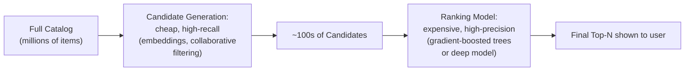

## Introduction

Part 14 shifts from topic-by-topic coverage to complete, end-to-end case studies, each synthesizing material from across this series into one coherent system design. This chapter starts with recommendation systems — a domain that exercises nearly every classical ML system-design concept from Parts 1-7: feature engineering (Part 3), training at scale (Part 4), evaluation (Part 5), and serving (Part 6), all under the specific constraints a recommender's scale and latency requirements impose.

## The Two-Stage Architecture: Candidate Generation and Ranking

A production recommender almost never scores every item in the catalog for every user — directly extending Chapter 51's cascade principle to recommendation specifically, a **candidate generation** stage cheaply narrows millions of items to hundreds, and a **ranking** stage expensively, precisely scores that narrowed set.



**Why this mirrors Chapter 63's re-ranking cascade exactly**: candidate generation optimizes for *recall* (don't miss a genuinely relevant item) at low cost per item, while ranking optimizes for *precision* (correctly order the narrowed set) at higher cost per item — the identical cheap-then-expensive economic logic Chapter 51 established for model cascades and Chapter 63 established for search re-ranking, here applied to the specific candidate-then-rank structure nearly every large-scale recommender uses.

```python
def two_stage_recommend(user_id: str, candidate_generator, ranker, top_n: int = 20) -> list:
    candidates = candidate_generator.generate(user_id, n=500)  # cheap, high-recall
    scored = ranker.score(user_id, candidates)  # expensive, high-precision,
                                                    # only on the narrowed set
    return sorted(scored, key=lambda x: x.score, reverse=True)[:top_n]
```

## Feature Engineering: The Feature Store as Shared Infrastructure

Directly reusing Chapter 13's feature store architecture — a recommender needs user features (historical engagement, demographics), item features (category, popularity, freshness), and *interaction* features (has this user engaged with this item's category before) computed consistently between training and serving, exactly the training-serving skew concern Chapter 15 established.

```python
def build_recommendation_features(user_id: str, item_id: str, feature_store) -> dict:
    return {
        **feature_store.get_online_features("user", user_id),  # Ch. 13
        **feature_store.get_online_features("item", item_id),
        "user_item_affinity": feature_store.get_online_features(
            "user_item", f"{user_id}:{item_id}"
        ).get("affinity_score", 0.0),
    }
```

## Cold Start: The Recommender-Specific Challenge

A genuinely new user or item has no interaction history for collaborative-filtering-based candidate generation to leverage — directly extending Chapter 44's "no relevant knowledge available" framing to recommendation specifically, requiring content-based fallback (Chapter 12's feature engineering, using item *attributes* rather than interaction history) until sufficient interaction data accumulates.

```python
def generate_candidates_with_cold_start_fallback(user_id: str, collaborative_model,
                                                     content_based_model, interaction_count: int,
                                                     threshold: int = 5) -> list:
    if interaction_count < threshold:
        # Ch. 44's "insufficient data for the primary approach" pattern —
        # fall back to content-based similarity using item attributes
        # rather than an interaction history that doesn't exist yet
        return content_based_model.generate(user_id)
    return collaborative_model.generate(user_id)
```

## Evaluation: Beyond Accuracy to Business-Relevant Metrics

Directly extending Chapter 21's evaluation discipline — a recommender's offline accuracy metrics (precision@k, recall@k) are necessary but insufficient, since they don't capture diversity (recommending only variations of what a user already engages with) or the cold-start fallback's actual effectiveness, requiring Chapter 22's online A/B testing to validate real engagement impact before trusting offline metrics alone.

## Key Takeaways

- The two-stage candidate-generation-then-ranking architecture directly extends Chapter 51's cascade principle: cheap, high-recall narrowing followed by expensive, high-precision scoring on a much smaller candidate set.
- A shared feature store (Chapter 13) computing user, item, and interaction features consistently between training and serving is essential to avoid Chapter 15's training-serving skew.
- Cold start for new users and items requires a content-based fallback until sufficient interaction data accumulates, directly extending Chapter 44's "insufficient data" pattern to recommendation.
- Offline accuracy metrics are necessary but insufficient — online A/B testing (Chapter 22) is required to validate actual engagement impact, especially for diversity and cold-start effectiveness that offline metrics don't directly capture.

---

## Interview Questions

**1. Why does a production recommender almost never score the entire catalog directly, and how does this connect to Chapter 51's cascade principle?**
Scoring millions of items with an expensive ranking model for every single user request would be computationally infeasible at production latency and cost budgets (Chapter 42); the two-stage architecture applies Chapter 51's cascade economics directly — a cheap candidate generator achieves high recall over the full catalog inexpensively, and the expensive ranker only runs on the small, pre-filtered candidate set, making the overall cost proportional to the narrowed candidate count rather than the full catalog size.
*Follow-up: What would happen to recommendation quality if the candidate generation stage had poor recall, even with an excellent ranking model?*
The ranking model could never recover items the candidate generator failed to surface in the first place — a classic "garbage in, garbage out" ceiling effect directly analogous to Chapter 60's RAG architecture, where a poor retrieval stage caps the quality of even the best generation stage; recall at the candidate-generation stage is a hard upper bound on final recommendation quality.

**2. Why is training-serving skew (Chapter 15) a particularly acute risk for recommendation systems specifically?**
Recommendation features often involve real-time signals (recent clicks, current session behavior) computed through different pipelines at training time (batch, historical) versus serving time (online, live) — any inconsistency between these two computation paths directly reproduces Chapter 15's core concern, and because recommenders retrain frequently to capture evolving user preferences, this skew risk recurs with every retraining cycle rather than being a one-time concern.
*Follow-up: How does the feature store architecture specifically mitigate this risk?*
By computing features through a single, shared definition used by both the offline training pipeline and the online serving path (Chapter 13's core architecture), the feature store eliminates the dual-implementation risk that causes skew in the first place, rather than relying on two independently-maintained pipelines staying accidentally consistent.

**3. Why does content-based fallback address cold start, while collaborative filtering fundamentally cannot?**
Collaborative filtering derives recommendations from patterns in interaction history across users — a new user or item, by definition, has no such history to draw on, making collaborative signals structurally unavailable; content-based approaches use item attributes (category, description, metadata) that exist independent of interaction history, providing a genuine alternative signal source available even at zero interactions.
*Follow-up: How would you determine the appropriate interaction-count threshold for switching from content-based to collaborative filtering, rather than picking an arbitrary number?*
Run an offline evaluation comparing both approaches' accuracy at varying interaction-count levels for a held-out set of users, empirically identifying the point where collaborative filtering's accuracy surpasses content-based fallback's accuracy — directly following this series' consistent "validate empirically, don't guess" discipline rather than arbitrarily choosing a threshold.

**4. Why are offline metrics like precision@k insufficient for validating a recommender before full deployment?**
Offline metrics are computed against historical interaction logs, which only reflect items the PREVIOUS recommendation system already chose to show — they cannot measure how users would respond to genuinely NEW recommendations the new model surfaces that the old system never showed, a form of selection bias directly analogous to Chapter 22's experimental-design concerns.
*Follow-up: How does A/B testing specifically resolve this limitation?*
A/B testing exposes real users to the new model's actual recommendations in a live setting, directly measuring genuine engagement with items the offline historical logs never had exposure data for, closing the gap offline evaluation structurally cannot close on its own.

**5. How would you diagnose whether a recommender's poor performance stems from the candidate generation stage or the ranking stage, extending Chapter 60's stage-by-stage diagnostic discipline?**
Directly analogous to Chapter 60's RAG diagnosis — measure candidate-generation recall independently (does the truly relevant item appear anywhere in the candidate set) and ranking precision independently (given a candidate set including the relevant item, does the ranker correctly place it near the top) — isolating which stage is responsible before investing in improving either.
*Follow-up: What remediation would a low candidate-generation recall point toward, versus a low ranking precision?*
Low candidate-generation recall points toward improving the embedding model or collaborative-filtering signal quality, or increasing the candidate set size; low ranking precision points toward improving the ranking model's features or architecture — two genuinely different remediation paths this diagnostic distinction correctly separates.
