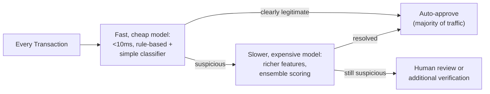

## Introduction

This chapter turns to a domain defined by extreme class imbalance and hard real-time latency constraints: fraud detection. It synthesizes Chapter 21's precision-recall framework, Chapter 51's model cascades, and Chapter 27's low-latency serving material into a system that must make a consequential decision — block or allow a transaction — in milliseconds, on data that's overwhelmingly non-fraudulent.

## Extreme Class Imbalance: Why Standard Training Fails

Fraud is rare — often well under 1% of transactions — meaning a model trained naively on raw data can achieve 99%+ accuracy by simply predicting "not fraud" for everything, directly the same "accuracy is the wrong metric when the base rate is skewed" concern Chapter 21 established.

```python
def evaluate_fraud_model_correctly(model, test_set) -> dict:
    """
    Directly extends Ch. 21's precision-recall framework — accuracy
    is meaningless here; precision and recall at the SPECIFIC
    operating threshold the business actually uses is what matters.
    """
    predictions = model.predict(test_set.features)
    return {
        "precision": precision_score(test_set.labels, predictions),  # of
                                                                          # flagged
                                                                          # transactions,
                                                                          # what
                                                                          # fraction
                                                                          # are
                                                                          # genuinely
                                                                          # fraud
        "recall": recall_score(test_set.labels, predictions),  # of ACTUAL
                                                                    # fraud, what
                                                                    # fraction
                                                                    # was caught
    }
```

**Why the precision-recall trade-off is especially consequential here**: directly extending Chapter 73's guardrail-threshold discussion — a low threshold (high recall) catches more fraud but blocks more legitimate transactions (a direct, measurable revenue and customer-trust cost), while a high threshold (high precision) minimizes false blocks but lets more fraud through (a direct financial loss) — the specific threshold must be calibrated to the actual dollar cost of each error type, not a generic default.

## Cascade Architecture: Cheap Screening Before Expensive Review

Directly extending Chapter 51's cascade principle: a cheap, fast model screens every transaction in real time; only transactions it flags as suspicious route to a more expensive, higher-latency model (or human review), keeping the median transaction's latency low while reserving expensive scrutiny for the minority that need it.



## Feature Computation Under Hard Real-Time Constraints

Directly extending Chapter 13's feature store and Chapter 27's low-latency serving material — fraud features (transaction velocity, deviation from a user's typical spending pattern) require real-time aggregation over recent history, computed with a latency budget far tighter than most classical ML applications.

```python
def compute_velocity_feature(user_id: str, feature_store, window_minutes: int = 10) -> int:
    # Directly extends Ch. 13's online feature serving — this MUST
    # complete within the fraud system's overall latency budget
    # (Ch. 5's SLA framework), often single-digit milliseconds
    return feature_store.get_online_features(
        "user_recent_transactions", user_id
    ).get(f"count_last_{window_minutes}m", 0)
```

## Adversarial Adaptation: Fraud as an Evolving Adversary

Directly connecting to Chapter 74's adversarial-robustness material — fraudsters actively adapt to a deployed model's known patterns, exactly the same "actively adapting adversary" concern Chapter 74 raised for jailbreaks, requiring the same ongoing, ever-refreshed evaluation discipline rather than a one-time trained model assumed to remain effective indefinitely.

## Key Takeaways

- Accuracy is the wrong metric under fraud's extreme class imbalance; precision and recall at a business-calibrated operating threshold, directly extending Chapter 21's framework, are what matters.
- The precision-recall trade-off should be calibrated to the actual dollar cost of false positives (blocked legitimate transactions) versus false negatives (missed fraud), not a generic default threshold.
- A cascade architecture (Chapter 51) keeps median-case latency low by screening most transactions cheaply and reserving expensive scrutiny for the flagged minority.
- Fraud is an actively adapting adversary (directly paralleling Chapter 74's adversarial-robustness concerns), requiring ongoing model retraining and evaluation rather than a one-time trained system.

---

## Interview Questions

**1. Why is accuracy a fundamentally misleading metric for a fraud detection model, and what does this connect to from Chapter 21?**
With fraud representing well under 1% of transactions, a model that predicts "not fraud" unconditionally achieves 99%+ accuracy while catching zero actual fraud — directly the base-rate problem Chapter 21 established, where a metric that looks impressive in aggregate can mask complete failure at the actual task the system exists to perform.
*Follow-up: What single number, if you could only report one, would better summarize model quality here, and why?*
Recall at a fixed, acceptable precision level (or equivalently, the area under the precision-recall curve) better summarizes quality, since it directly answers "of the fraud that exists, how much do we catch, given how much false-positive cost we're willing to tolerate" — the actual business question, unlike accuracy.

**2. Why must the precision-recall operating threshold be calibrated to actual dollar costs rather than a standard default like 0.5?**
The consequence of a false positive (a blocked legitimate transaction, with associated customer-trust and revenue cost) and a false negative (a missed fraudulent transaction, with associated direct financial loss) are quantifiable in dollar terms and are rarely symmetric — a default 0.5 threshold has no relationship to these actual costs, while an economically-calibrated threshold directly minimizes expected total cost given the measured cost of each error type.
*Follow-up: How would this threshold need to change for a high-value transaction versus a low-value one?*
A high-value transaction likely warrants a lower threshold (higher recall, more scrutiny) since the potential fraud loss is larger, while a low-value transaction might reasonably tolerate a higher threshold (more false positives allowed) since both the fraud loss and the customer-friction cost of a false block are smaller in absolute terms — suggesting threshold calibration should vary by transaction value rather than applying one fixed threshold universally.

**3. Why does the cascade architecture's "fast, cheap model screens everything" stage need to prioritize LOW LATENCY over maximum accuracy?**
This stage processes every single transaction in real time, meaning its latency directly determines the user-facing transaction latency for the vast majority of traffic — a slow but highly accurate first-stage model would degrade the checkout experience for every legitimate customer, while Chapter 51's cascade logic specifically reserves the expensive, more accurate model for only the smaller, flagged subset where the added latency cost is justified by the added scrutiny need.
*Follow-up: What would happen to overall system latency if the fast stage's threshold for flagging "suspicious" was set too aggressively (flagging too many transactions)?*
A high flagging rate would route a larger fraction of total traffic to the slower, expensive second stage, degrading the AVERAGE transaction latency across the whole system even though the fast stage itself remains quick — illustrating that the fast stage's threshold calibration affects overall system cost and latency, not just its own individual accuracy.

**4. Why is fraud detection described as facing "an actively adapting adversary," directly connecting to Chapter 74's adversarial-robustness material?**
Fraudsters observe which transaction patterns get flagged and deliberately adjust their behavior to evade detection, exactly the same dynamic Chapter 74 described for jailbreak techniques being continuously discovered and adapted against deployed defenses — a fraud model's measured performance at launch will predictably degrade over time as adversaries specifically probe and adapt to its decision boundary, unlike a typical classical ML application facing a more passively drifting, non-adversarial distribution.
*Follow-up: What does this imply about how frequently a fraud model should be retrained compared to a typical recommendation model?*
Given the actively adapting adversary (versus a recommendation system's more passively evolving user preferences), fraud models generally warrant significantly more frequent retraining and ongoing evaluation, directly following Chapter 74's "red-teaming must be an ongoing process, not a one-time gate" principle applied to model retraining cadence rather than adversarial testing specifically.

**5. How would you diagnose whether a fraud model's declining performance stems from genuine adversarial adaptation versus a data pipeline issue, extending this series' diagnostic discipline?**
Check whether the decline correlates with a shift in the SPECIFIC patterns of transactions being missed (new, previously-unseen fraud patterns emerging, suggesting genuine adversarial adaptation) versus a broader, undifferentiated decline across all transaction types (suggesting a feature-computation or data-pipeline problem, per Chapter 15's training-serving skew concern) — directly the same "isolate the specific responsible cause before remediating" discipline this series has applied consistently throughout.
*Follow-up: What remediation would each of these two diagnoses point toward?*
Genuine adversarial adaptation points toward retraining on newly-labeled fraud examples reflecting the new pattern (and potentially adding new features specifically capturing this new pattern); a data-pipeline issue points toward auditing the feature-computation path for a bug or schema drift, an entirely different and unrelated remediation this correct diagnosis is necessary to distinguish.
