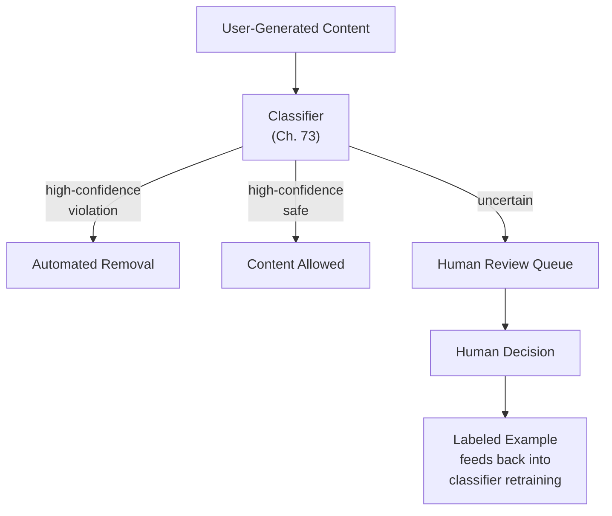

## Introduction

Chapter 73 introduced content-moderation guardrails as one component of an LLM system's safety architecture. This chapter builds the complete, standalone content moderation SYSTEM a platform needs — extending Chapter 73's classifier-based detection with human review workflows, appeal handling, and the multi-modal considerations Chapter 78 introduced, now as the primary system rather than one layer within a larger LLM pipeline.

## The Review Pipeline: Classifier, Queue, and Human Review

Directly extending Chapter 73's layered defense architecture into a full operational pipeline: a classifier makes an initial automated decision, routing only uncertain or high-severity cases to human review, exactly the same cascade economics Chapter 51 established.



**Why routing only uncertain cases to human review directly extends Chapter 51's cascade cost logic**: human review is orders of magnitude more expensive per item than automated classification — reserving it for the classifier's genuinely uncertain cases (rather than reviewing everything, or trusting the classifier's confident cases blindly) applies the identical "cheap check handles the easy majority, expensive check handles the hard minority" principle this series has established repeatedly.

```python
def route_content(content, classifier, uncertainty_threshold: float = 0.3) -> str:
    confidence = classifier.predict_confidence(content)
    if confidence > 1 - uncertainty_threshold:
        return "auto_remove" if classifier.predict(content) == "violation" else "allow"
    return "human_review"  # Ch. 51's cascade escalation for
                              # genuinely uncertain cases only
```

## The Human Feedback Loop as Continual Model Improvement

Directly extending Chapter 19's training-at-scale material with a domain-specific feedback source: every human review decision becomes a labeled training example, directly closing the loop Chapter 73's classifier needs to keep pace with evolving violation patterns — the same "actively adapting adversary" concern Chapter 74 raised for jailbreaks and Chapter 82 raised for fraud applies equally here, since bad actors continuously adapt their content to evade detection.

## Appeals: A Second-Chance Review Requiring Different Guarantees

An appeal process introduces a genuinely distinct requirement Chapter 73's original guardrail material didn't address: a user disputing a moderation decision needs review by a mechanism *independent* of the original decision, directly extending Chapter 69's peer-to-peer debate principle — an appeal reviewed by the identical classifier or reviewer that made the original decision provides no genuine, independent check, exactly the same shared-bias concern Chapter 69 and Chapter 75 raised for LLM-as-judge evaluation.

```python
def handle_appeal(original_decision, content, independent_reviewer) -> str:
    # Directly extends Ch. 69's shared-bias mitigation — the appeal
    # reviewer must be genuinely independent of whatever made the
    # original decision, not the same classifier re-run
    return independent_reviewer.review(content, context=original_decision)
```

## Multi-Modal Moderation: Directly Applying Chapter 78

A platform handling images, video, and audio alongside text requires Chapter 78's additive, modality-specific classifier architecture — a text classifier provides zero coverage for a violating image, requiring genuinely separate detection layers per modality rather than a single, universal classifier.

## Key Takeaways

- A production moderation pipeline routes only the classifier's genuinely uncertain cases to expensive human review, directly extending Chapter 51's cascade cost economics to human-in-the-loop workflows.
- Human review decisions should feed back as labeled training data, closing the loop needed to keep pace with the actively-adapting-adversary dynamic Chapter 74 and Chapter 82 both established for evolving evasion patterns.
- Appeals require a genuinely independent reviewer, not a re-run of the original decision-making mechanism, directly extending Chapter 69's and Chapter 75's shared-bias concerns to moderation-decision review.
- Multi-modal content requires Chapter 78's additive, modality-specific classifier architecture, since a text classifier provides zero coverage for image, video, or audio violations.

---

## Interview Questions

**1. Why should human review be reserved for the classifier's uncertain cases rather than reviewing every piece of content or trusting the classifier's confident decisions blindly?**
Reviewing everything is prohibitively expensive at platform scale, while trusting all confident classifier decisions blindly risks systematically missing the classifier's specific blind spots without any check — routing only uncertain cases to human review applies Chapter 51's cascade economics directly, using the expensive resource (human judgment) only where the cheap resource (the classifier) has genuinely insufficient confidence to decide reliably on its own.
*Follow-up: How would you determine the appropriate uncertainty threshold for routing to human review, rather than picking an arbitrary confidence cutoff?*
Directly extending Chapter 73's threshold-calibration methodology — measure the classifier's actual precision and recall at varying confidence thresholds against a human-labeled validation set, and calibrate the threshold to the platform's specific tolerance for false positives (wrongly removed content) versus false negatives (missed violations), balanced against the human-review team's actual review capacity.

**2. Why does the human feedback loop need to directly feed back into classifier retraining, rather than treating human review as a one-time, standalone decision?**
Bad actors continuously adapt their content to evade the current classifier, directly the same actively-adapting-adversary dynamic Chapter 74 established for jailbreaks and Chapter 82 established for fraud — without feeding human review decisions back as fresh training data, the classifier's blind spots would persist and even widen over time as evasion techniques specifically targeting those blind spots proliferate, exactly the "red-teaming must be ongoing, not one-time" principle Chapter 74 established, now applied to moderation-classifier retraining cadence.
*Follow-up: What risk does this feedback loop introduce if human reviewers themselves have systematic biases or inconsistencies?*
Any systematic bias in human review decisions would be directly encoded into the retrained classifier through this feedback loop, potentially amplifying rather than correcting a problem — directly motivating the need for inter-reviewer consistency checks and calibration (analogous to Chapter 75's human-labeled ground-truth validation requirement) before trusting human review data as a reliable retraining signal.

**3. Why must an appeal be reviewed by a genuinely independent mechanism rather than the original classifier or reviewer re-examining the same content?**
Re-running the identical classifier or having the identical reviewer re-examine the same content provides no genuinely independent check — if the original decision stemmed from a systematic blind spot or bias, the same mechanism would very likely reach the identical conclusion again, providing an appeal process with the appearance of review but none of its substantive value, directly the same shared-bias risk Chapter 69's peer-to-peer debate discussion and Chapter 75's LLM-as-judge validation both raised.
*Follow-up: Would a SECOND, differently-trained classifier satisfy this independence requirement, or does a human reviewer become necessary at the appeal stage?*
A second, differently-trained classifier could partially satisfy this requirement if it's demonstrably independent (a genuinely different architecture or training data, directly following Chapter 69's "different model family reduces shared bias" mitigation) — but given an appeal specifically represents a user's claim that automated review erred, and the stakes of a wrong appeal decision are typically higher (this is the user's SECOND chance), a human reviewer independent of the original decision is generally the more appropriate and trustworthy choice for this specific, higher-stakes review step.

**4. Why does a platform need genuinely separate classifiers per modality (text, image, video, audio) rather than one universal, cross-modal classifier?**
Directly extending Chapter 78's additive content-moderation architecture — a classifier trained and validated on one modality's specific characteristics has no inherent mechanism for examining a fundamentally different modality's content (a text classifier cannot examine pixel data), meaning each new modality introduces a genuinely separate detection surface requiring its own dedicated classifier layer, following the same "additive, not substitutive" extension pattern Chapter 78 established.
*Follow-up: What genuinely new challenge does VIDEO content introduce beyond what Chapter 78's image-classifier discussion addressed?*
Video adds a temporal dimension — a violation might only become apparent across a SEQUENCE of frames rather than any single static frame, requiring either sampling multiple frames for classification (introducing a sampling-rate-versus-coverage trade-off) or a genuinely video-specific model architecture capable of reasoning across time, a consideration with no direct analog in Chapter 78's static-image classifier discussion.

**5. How would you diagnose whether a rising violation rate reaching human reviewers stems from a genuine increase in bad-actor activity versus a classifier regression, extending this Part's diagnostic discipline?**
Directly extending Chapter 73's "input-stage versus generation-stage" and Chapter 77's diagnostic distinctions — check whether the classifier's OWN measured precision and recall against a stable, held-out validation set has changed (pointing toward a classifier regression, perhaps from an upstream model or pipeline change) versus whether the actual VOLUME and PATTERN of content being submitted has shifted (pointing toward a genuine increase in bad-actor activity), isolating which of these two genuinely different causes is responsible before choosing a remediation.
*Follow-up: What remediation would each of these two diagnoses point toward?*
A classifier regression points toward auditing recent pipeline or model changes and potentially rolling back to a previously-validated classifier version; a genuine increase in bad-actor activity (with the classifier itself performing as expected against its existing validation set) points toward retraining on newly-emerging violation patterns and potentially increasing human-review capacity temporarily to handle the increased genuine volume — two entirely different responses this diagnostic distinction is necessary to correctly choose between.
