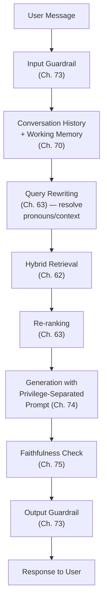

## Introduction

Part 14's first LLM-centric case study directly assembles the components Parts 8-13 built individually: a conversational Q&A assistant grounded in retrieved documents. This chapter is deliberately a synthesis exercise — every architectural decision below cites the specific prior chapter it comes from, demonstrating how this series' cumulative material combines into one coherent, production system.

## The Complete Pipeline: End to End



```python
def chat_assistant_turn(user_message: str, conversation_state, pipeline) -> str:
    """
    A single conversational turn — every step directly cites the
    chapter that established it, demonstrating this series'
    cumulative architecture as one working system.
    """
    if pipeline.input_guardrail.check(user_message):  # Ch. 73
        return pipeline.input_guardrail.rejection_message()

    rewritten_query = pipeline.query_rewriter.resolve(  # Ch. 63
        user_message, conversation_state.history
    )
    candidates = pipeline.hybrid_retriever.retrieve(rewritten_query)  # Ch. 62
    reranked = pipeline.reranker.rerank(candidates, rewritten_query)  # Ch. 63

    prompt = build_privilege_separated_prompt(  # Ch. 74
        pipeline.system_instructions, retrieved_content=reranked, user_query=user_message
    )
    response = pipeline.llm_client.generate(prompt)

    if not pipeline.faithfulness_evaluator.evaluate(response, reranked):  # Ch. 75
        response = pipeline.regenerate_with_grounding_emphasis(prompt)

    if pipeline.output_guardrail.check(response):  # Ch. 73
        return pipeline.output_guardrail.fallback_response()

    conversation_state.working_memory.write("last_exchange", (user_message, response))  # Ch. 70
    return response
```

## Why Query Rewriting Is Non-Negotiable for Multi-Turn Chat

Directly extending Chapter 63's rewriting motivation to conversational context specifically: a follow-up question ("what about the enterprise tier?") is meaningless to a retrieval system without resolving it against the conversation's prior turns first — retrieval quality here is bounded not just by the query's phrasing (Chapter 63's original concern) but by whether it's even a self-contained, retrievable query at all.

## Why the Faithfulness Check Belongs Inside the Turn, Not Only in Offline Evaluation

Directly extending Chapter 75's generalized faithfulness metric from an offline evaluation tool into a live, per-request guardrail: catching an ungrounded response before it reaches the user (and triggering regeneration) is a stronger guarantee than only measuring faithfulness rate in aggregate after the fact — the same "prevent, don't only detect after the fact" principle Chapter 73 established for content moderation, now applied to grounding quality specifically.

## Observability: Tracing a Single Turn End to End

Directly extending Chapter 77's structured tracing to this specific pipeline: each stage in the diagram above should emit its own trace span (retrieval latency and recall, re-ranking's effect on ordering, the faithfulness check's verdict), enabling the exact stage-by-stage diagnosis Chapter 60 and Chapter 68 established whenever a specific conversation produces a poor response.

## Key Takeaways

- A production chat assistant is not a single model call but a full pipeline combining input guardrails, conversational query rewriting, hybrid retrieval, re-ranking, privilege-separated generation, live faithfulness checking, and output guardrails — each stage directly citable to a specific prior chapter.
- Query rewriting for conversational context is non-negotiable, since a follow-up question is often not independently retrievable without resolving it against prior conversation turns first.
- Faithfulness checking belongs as a live, per-turn guardrail catching ungrounded responses before they reach the user, not only as an offline, aggregate evaluation metric.
- Structured, per-stage tracing (Chapter 77) is essential for diagnosing which specific pipeline stage is responsible for a poor response in any given conversation.

---

## Interview Questions

**1. Why is query rewriting described as "non-negotiable" for multi-turn chat specifically, more strongly than Chapter 63's original, single-turn framing?**
In a single-turn search context, a poorly-phrased query still contains some retrievable signal about intent; in multi-turn chat, a follow-up question can be genuinely, completely unretrievable in isolation (a pronoun or implicit reference with no independent meaning), meaning without resolving it against conversation history first, the retrieval stage receives essentially no useful signal at all rather than merely a suboptimal one — a qualitatively more severe version of the problem Chapter 63 originally addressed.
*Follow-up: What specific conversation-history information does the query rewriter need access to, connecting to Chapter 70's memory architecture?*
The rewriter needs access to recent conversation turns (working memory, Chapter 70's task-scoped category) to resolve references — this is a direct, concrete application of Chapter 70's working-memory concept, confirming why Chapter 70's memory architecture is a genuine prerequisite for this chapter's conversational query-rewriting step, not merely a generically useful but optional addition.

**2. Why does the faithfulness check need to trigger regeneration rather than simply flagging the response for later, offline analysis?**
An offline-only faithfulness check (Chapter 75's original framing) provides valuable AGGREGATE monitoring but does nothing to prevent a SPECIFIC ungrounded response from reaching the SPECIFIC user in THIS conversation — directly extending Chapter 73's "prevent, don't only detect after the fact" guardrail philosophy to grounding quality, catching and correcting the failure within the same turn rather than only learning about it in a later, aggregated report.
*Follow-up: What's the cost trade-off of adding this live faithfulness check versus relying on aggregate, offline monitoring alone?*
The live check adds latency (an additional evaluation call before the response is returned) and cost (potentially triggering a full regeneration) to every single turn, directly the same "additional guardrail layer adds genuine cost" trade-off Chapter 73 established generally — justified for applications where an individual ungrounded response carries meaningful consequence, but potentially excessive for a low-stakes application where offline monitoring alone might suffice.

**3. Why must each pipeline stage emit its own trace span rather than only logging the final response, connecting to Chapter 69's and Chapter 77's tracing discipline?**
Without per-stage tracing, a poor final response provides no direct evidence of WHICH stage (retrieval, re-ranking, generation, faithfulness checking) was actually responsible — exactly the same debugging-complexity concern Chapter 69 raised for multi-agent systems, now applied to this multi-stage RAG pipeline; per-stage spans allow a system designer to directly isolate the responsible stage rather than needing to reconstruct the pipeline's internal behavior from the final output alone.
*Follow-up: What specific metric would you expect to see logged in the retrieval stage's own trace span, distinct from what the generation stage's span would log?*
The retrieval stage's span should log the retrieved document set and each document's relevance score (enabling later analysis of whether the truly relevant document was retrieved at all, Chapter 60's recall diagnostic), while the generation stage's span should log token counts, latency, and the faithfulness verdict against the SPECIFIC retrieved set that stage received — genuinely different diagnostic information appropriate to each stage's distinct responsibility.

**4. How would you decide whether a specific conversation's poor response stems from the retrieval stage or the generation stage, applying this chapter's full pipeline architecture?**
Directly extending Chapter 60's stage-by-stage diagnostic discipline — examine the retrieval stage's trace span first: if the truly relevant document never appears among the retrieved candidates, this is a retrieval-recall problem (Chapter 62's hybrid search or Chapter 63's re-ranking may need improvement); if the relevant document IS present but the generation stage's response still fails to use it correctly (a faithfulness violation despite adequate grounding material being available), this points toward the generation or prompt-construction stage instead.
*Follow-up: What would a LOW re-ranking-stage relevance score for the top-ranked document, despite the correct document being present somewhere in the initial candidate set, specifically suggest?*
This specifically suggests a re-ranking problem (Chapter 63) rather than a retrieval-recall problem — the correct document was successfully retrieved but not correctly prioritized, pointing toward improving the re-ranking model or its training data rather than the initial hybrid retrieval mechanism.

**5. Why does this chapter frame itself as a "synthesis exercise" rather than introducing new architectural concepts, and why is this pedagogically significant given its placement in the curriculum?**
Every single component in this chapter's pipeline diagram was individually established in a specific, cited earlier chapter (guardrails from Chapter 73, hybrid retrieval from Chapter 62, and so on) — this chapter's genuine contribution is demonstrating how these previously-separate pieces combine into ONE coherent, working system, directly testing and reinforcing whether a reader has genuinely internalized this series' cumulative material well enough to assemble it correctly, rather than teaching any single new technique in isolation.
*Follow-up: What would be the risk of a reader treating this chapter's pipeline diagram as the ONLY correct way to assemble these components, rather than as one illustrative example of a broader architectural pattern?*
A reader might mistakenly conclude every RAG-based chat assistant must include EVERY one of these specific stages regardless of the application's actual risk profile and needs, contradicting this series' consistent "escalate complexity only as demonstrated need justifies" discipline (Chapter 67's tool-set-scoping, Chapter 73's layered-defense calibration) — the correct lesson is that each stage is available and combinable as needed, not that every chat assistant requires this exact, maximal configuration regardless of its actual requirements.
