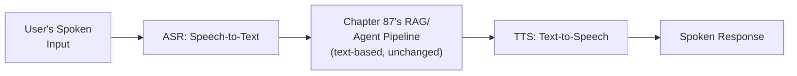

## Introduction

Every prior LLM case study in this Part assumed text input and output. This chapter adds speech at both ends of the pipeline — automatic speech recognition (ASR) converting voice to text, and text-to-speech (TTS) converting the response back to voice — introducing a genuinely stricter latency budget than any text-based system this series has covered, since a voice conversation's natural turn-taking rhythm has far less tolerance for delay than a text chat interface.

## The Extended Pipeline: ASR, LLM, TTS as Sequential Stages



**Why the core LLM pipeline (Chapter 87's or Chapter 89's architecture) remains entirely unchanged**: ASR and TTS are additive stages bookending an otherwise-identical text-based pipeline — directly confirming this series' recurring "different surface-level modality, same underlying mechanism" pattern (Chapter 70's memory-as-RAG argument, Chapter 78's multimodal extension) — the LLM's reasoning, retrieval, and tool-use logic requires zero modification; only the input and output conversion stages are genuinely new.

## Latency Budgeting: The Strictest Constraint This Series Has Covered

Directly extending Chapter 5's SLA framework and Chapter 83's real-time-bidding latency discussion with an even tighter human-perception constraint: natural conversational turn-taking tolerates roughly 200-300ms of silence before feeling awkward, meaning the ENTIRE pipeline (ASR, retrieval, generation, TTS) must complete within this budget — dramatically tighter than Chapter 83's already-strict single-digit-millisecond model-inference budget, since it must accommodate the FULL chain, not one model call.

```python
def compute_voice_pipeline_latency_budget(target_ms: int = 300) -> dict:
    """
    Directly extends Ch. 5's SLA framework — this budget must be
    ALLOCATED across every stage, since each stage's latency adds
    to the total the user actually perceives as conversational delay.
    """
    return {
        "asr_ms": target_ms * 0.15,
        "retrieval_and_generation_ms": target_ms * 0.60,  # the largest share,
                                                              # since this is
                                                              # where Ch. 87's
                                                              # RAG pipeline
                                                              # runs
        "tts_ms": target_ms * 0.25,
    }
```

## Streaming as the Primary Latency-Management Technique

Directly extending Chapter 56's streaming discussion from a UX-perceived-latency technique into a hard architectural requirement here: rather than waiting for the full LLM response before starting TTS, a voice pipeline streams generated tokens into TTS incrementally, beginning audio playback before generation completes — directly the same technique Chapter 56 introduced for text streaming, now essential rather than optional given this chapter's much stricter latency tolerance.

```python
def streaming_voice_response(user_audio, asr_model, llm_pipeline, tts_model):
    text = asr_model.transcribe(user_audio)
    for token_chunk in llm_pipeline.generate_streaming(text):  # Ch. 56's
                                                                   # streaming
                                                                   # pattern
        yield tts_model.synthesize_streaming(token_chunk)  # TTS begins on
                                                                # EACH chunk,
                                                                # not only
                                                                # after full
                                                                # generation
```

## Voice-Specific Safety: ASR Errors as a New Failure Source

Directly extending Chapter 68's semantic-validation discipline with a voice-specific concern: an ASR transcription error (mishearing a word) can silently corrupt the input the LLM reasons over, a failure mode with no text-input analog — requiring confidence-based fallback (asking the user to repeat unclear input) rather than blindly trusting every ASR transcription as ground truth.

## Key Takeaways

- ASR and TTS are additive pipeline stages bookending an otherwise-unchanged text-based LLM pipeline — the underlying reasoning, retrieval, and tool-use architecture from earlier chapters requires no modification.
- Voice's natural conversational turn-taking imposes the strictest end-to-end latency budget this series has covered, requiring the entire pipeline's latency to be explicitly allocated and managed across every stage.
- Streaming (Chapter 56) transitions from a UX-enhancing optimization to a near-mandatory architectural requirement given voice's tight latency tolerance.
- ASR transcription errors introduce a voice-specific input-corruption risk with no text analog, requiring confidence-based fallback rather than blind trust in every transcription.

---

## Interview Questions

**1. Why does the core LLM pipeline require no modification when adding voice input and output, despite the significant architectural addition ASR and TTS represent?**
ASR and TTS are input/output CONVERSION stages operating purely at the modality boundary — once ASR converts speech to text, the LLM pipeline processes that text exactly as it would text typed directly by a user, with no awareness of or dependency on the original input modality, directly confirming this series' recurring "different surface-level input, same underlying mechanism" pattern established for memory (Chapter 70) and multimodal content (Chapter 78).
*Follow-up: What SPECIFIC piece of this series' earlier material would need modification if the voice assistant needed to reference something the user said several turns ago?*
Chapter 70's working-memory architecture would apply unchanged — the ASR-transcribed text from earlier turns is stored and retrieved exactly as any other conversational history would be, confirming that voice's addition doesn't require a NEW memory architecture, only feeding transcribed text into the EXISTING memory mechanism Chapter 70 already established.

**2. Why is a 300ms latency budget dramatically stricter than what most of this series' earlier case studies required, even compared to Chapter 83's real-time bidding constraint?**
Chapter 83's constraint applied to a SINGLE model inference call within a larger system where the OVERALL user-facing latency had more tolerance; this chapter's 300ms budget must accommodate the ENTIRE pipeline chain (ASR, retrieval, generation, TTS) end to end, since a voice conversation's natural turn-taking rhythm is a HUMAN PERCEPTUAL constraint, not a system-imposed SLA — making it a fundamentally tighter aggregate requirement across MULTIPLE sequential stages rather than a single stage's own inference budget.
*Follow-up: How would you specifically validate that a proposed pipeline architecture actually meets this aggregate budget before deployment?*
Directly extending Chapter 27's load-testing discipline — measure the ACTUAL, end-to-end latency of the full pipeline (ASR through TTS) under realistic production conditions, rather than summing each stage's theoretical, best-case latency independently, since real-world network overhead and concurrent load can introduce additional latency a purely theoretical, stage-by-stage estimate would miss.

**3. Why does streaming shift from "optional UX enhancement" (Chapter 56's original framing) to "near-mandatory" in this specific application?**
Chapter 56 introduced streaming primarily to improve PERCEIVED responsiveness for a text-based interface where the user could still read a response as it arrived even with some initial delay; a voice interface has NO equivalent perceived-responsiveness option — the user simply hears silence until the FIRST audio arrives, meaning without streaming, the full sequential latency (ASR + full generation + full TTS) would need to complete before ANY audio plays, almost certainly exceeding this chapter's 300ms budget entirely.
*Follow-up: What genuinely NEW engineering challenge does streaming TTS specifically introduce, beyond the text-streaming challenge Chapter 56 originally addressed?*
TTS must synthesize natural-sounding, prosodically coherent audio from INCOMPLETE, still-arriving text chunks — a genuinely harder synthesis problem than generating audio from a complete, known sentence, since natural speech prosody (intonation, pacing) often depends on knowing how a sentence will conclude, requiring TTS models specifically designed to handle this incremental, partial-input synthesis challenge.

**4. Why can't an ASR transcription simply be trusted as ground-truth text input, and how does this connect to a broader theme this series has established?**
ASR is itself a probabilistic model subject to transcription errors, especially for accented speech, background noise, or ambiguous homophones — feeding a silently-incorrect transcription into the LLM pipeline corrupts its input in a way indistinguishable, from the LLM's perspective, from a genuinely confusing or ambiguous user request, directly the same "garbage in, garbage out" concern this series has raised for RAG's retrieval stage (Chapter 60) and now applied to voice's own additional input-conversion stage.
*Follow-up: How would you design a fallback mechanism for low-confidence ASR transcriptions, connecting to Chapter 73's guardrail-threshold calibration?*
Directly extending Chapter 73's threshold-calibration methodology — trigger a clarifying re-prompt ("I didn't quite catch that, could you repeat it?") whenever the ASR model's own confidence score falls below a calibrated threshold, rather than passing a low-confidence transcription silently into the LLM pipeline as if it were reliable, high-confidence ground truth.

**5. How would you diagnose whether a voice assistant's poor response quality stems from an ASR transcription error versus a genuine LLM reasoning failure, extending this Part's diagnostic discipline?**
Directly extending this series' consistent stage-by-stage diagnostic approach — log and inspect the ASR's actual transcribed text output as a separate trace span (Chapter 77's structured tracing, extended to this new pipeline stage) — if the transcribed text itself doesn't accurately reflect what the user actually said, this isolates the ASR stage as responsible; if the transcription is accurate but the LLM's response is still poor, this points toward the downstream reasoning pipeline instead, exactly the same component-isolation discipline this series has applied to every other multi-stage pipeline.
*Follow-up: Why is logging the ASR's intermediate transcription specifically important here, beyond simply logging the final spoken response?*
Without this specific, intermediate trace span, a team investigating a poor response would have no way to distinguish "the LLM reasoned poorly given accurate input" from "the LLM reasoned perfectly well given corrupted input" — exactly the kind of diagnostic blindness Chapter 77's per-stage tracing discipline was designed to prevent, now shown to be equally necessary for this new, voice-specific pipeline stage.
