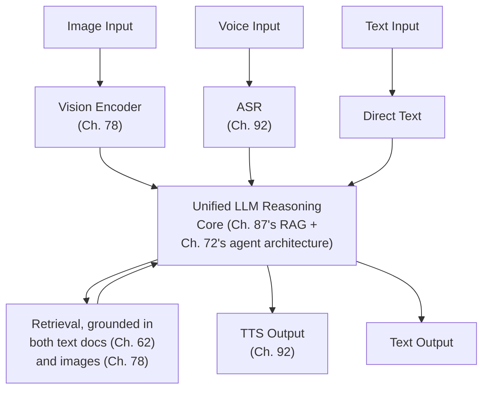

## Introduction

This chapter closes Part 14 as a deliberate capstone: a single system combining text, image, and voice — a visual assistant that can see an image the user shares, discuss it via voice, and ground its claims in retrieved documentation, directly assembling Chapter 78's multimodal material, Chapter 92's voice pipeline, and Chapter 87's RAG architecture into one coherent whole, exactly the synthesis exercise Chapter 87 modeled for text-only RAG now extended across every modality this series has covered.

## The Unified Architecture: Every Modality Converging on One Reasoning Core



**Why this diagram confirms rather than contradicts every prior chapter's individual architecture**: each input path (image, voice, text) converges on the identical reasoning core Chapters 67-72 established — directly the same "different surface-level modality, same underlying mechanism" pattern this series has now confirmed repeatedly (Chapter 70's memory, Chapter 78's vision, Chapter 92's voice) — this chapter's only genuine engineering work is the *convergence* itself, not reinventing any individual modality's handling.

```python
def multimodal_assistant_turn(input_data, input_modality: str, pipeline) -> dict:
    """
    A single entry point routing to the RIGHT prior chapter's
    conversion mechanism, then handing off to the SAME unified
    reasoning core regardless of original modality.
    """
    if input_modality == "voice":
        text = pipeline.asr_model.transcribe(input_data)  # Ch. 92
    elif input_modality == "image":
        text = None  # image passed directly into the vision-language
                       # model's own input, per Ch. 78 — not converted
                       # to text first
    else:
        text = input_data

    response = pipeline.agent.run(  # Ch. 72's architecture, unmodified
        goal=text, image=input_data if input_modality == "image" else None
    )

    if pipeline.output_modality == "voice":
        return {"audio": pipeline.tts_model.synthesize(response)}  # Ch. 92
    return {"text": response}
```

## Cross-Modal Grounding: Chapter 78's Faithfulness Metric, Fully Exercised

Directly reusing Chapter 78's `MultimodalFaithfulnessEvaluator`, now genuinely necessary rather than a specialized addition: a response combining an image observation with retrieved text documentation must be faithful to *both* grounding sources simultaneously, requiring the evaluator to check entailment against whichever source (or both) a given claim actually depends on.

## Evaluation: The Full Portfolio From Chapter 75, Applied Across Every Modality

Directly extending Chapter 75's six-plus-one evaluation components with modality-specific instances of each: benchmark comparison for the underlying vision-language and voice models, application-specific test suites covering all three input modalities, faithfulness checks for both text and image grounding sources, and red-team evaluation (Chapter 74) covering both text-based and image-embedded indirect injection (Chapter 78's specific extension).

## Closing Synthesis: What This Capstone Demonstrates About the Entire Curriculum

Every architectural decision in this chapter traces back to a specific earlier chapter, and every one of those chapters' principles generalized cleanly to a new modality without requiring new theory — directly confirming this series' central, recurring claim: system design competence is fundamentally about recognizing *shared underlying patterns* across superficially different surfaces (Chapter 69's "decompose and specialize," Chapter 70's memory-as-RAG, Chapter 78's modality-as-extension), not about memorizing a separate technique for every new technology that appears.

## Key Takeaways

- A multi-modal system's genuine engineering work is convergence — routing every input modality (text, voice, image) to the identical, unmodified reasoning core this series established in Chapters 67-72, not reinventing reasoning separately per modality.
- Cross-modal faithfulness evaluation (Chapter 78) must check entailment against whichever grounding source — text, image, or both — a given generated claim actually depends on.
- A comprehensive evaluation suite for a multi-modal system applies Chapter 75's full portfolio with modality-specific instances of each component, not a separate, parallel evaluation framework per modality.
- This capstone confirms the series' central claim: recognizing shared underlying patterns across new surfaces is the durable, transferable skill — every principle from this series' 92 prior chapters generalized cleanly here without requiring new, modality-specific theory.

---

## Interview Questions

**1. Why does this chapter describe convergence — not per-modality reasoning — as the "genuine engineering work" of a multi-modal system?**
Every modality's input conversion (ASR for voice, a vision encoder for images) was already fully solved in earlier chapters (Chapter 92, Chapter 78) — the only remaining, genuinely new work is ensuring all three converted representations feed into the same unified reasoning core correctly and consistently, rather than building three separate, modality-specific reasoning pipelines that would need to be independently maintained and would risk inconsistent behavior across modalities for logically equivalent inputs.
*Follow-up: What would go wrong if a team built three separate reasoning pipelines, one per modality, instead of this chapter's unified-core approach?*
This would triple this series' entire safety, evaluation, and governance stack (Part 12 and Part 13's full architecture) unnecessarily — three separate guardrail configurations, three separate evaluation suites, three separate confirmation-gating implementations — introducing significant redundant engineering effort and a genuine risk of inconsistent safety behavior across modalities, directly the opposite of this chapter's unified, DRY architecture that maintains one safety and reasoning implementation regardless of input modality.

**2. Why must the cross-modal faithfulness evaluator check entailment against "whichever source a given claim actually depends on," rather than always checking against both sources for every claim?**
A specific generated claim might be grounded purely in the retrieved text document, purely in the observed image, or in both combined — checking a text-only claim against the image source (or vice versa) would produce a meaningless, uninformative entailment check, since that source has no bearing on that specific claim; correctly attributing each claim to its actual grounding source(s) before checking entailment is necessary for the evaluation to produce a meaningful, accurate faithfulness verdict rather than a spurious pass or fail based on an irrelevant source comparison.
*Follow-up: How would you technically determine which source a specific generated claim actually depends on, before running this attribution-aware faithfulness check?*
This could be implemented by having the generation step itself explicitly tag each claim with its intended grounding source (a structured-output requirement, directly extending Chapter 79's schema-design discipline) at generation time, rather than attempting to infer this attribution after the fact — making faithful, source-attributed generation itself a structured-output design requirement for this specific multi-modal application.

**3. Why does this chapter claim its evaluation suite requires "modality-specific instances" of Chapter 75's six-plus-one components rather than an entirely separate, parallel evaluation framework?**
The underlying evaluation methodology (benchmark comparison, application-specific testing, faithfulness checking, LLM-as-judge, red-teaming, content moderation, fairness auditing) remains structurally identical regardless of modality — only the specific test data, judge model capability (text-only versus vision-capable, per Chapter 78), and classifier type (text versus image, per Chapter 84's additive architecture) need to be modality-appropriate, directly confirming Chapter 78's own earlier argument that multimodal support extends existing frameworks incrementally rather than requiring an entirely new evaluation paradigm.
*Follow-up: What risk would a team run if they built a genuinely separate, parallel evaluation framework for each modality instead of this chapter's extend-in-place approach?*
Beyond the redundant engineering effort, a team risks these separate frameworks drifting inconsistently over time (one modality's evaluation suite receiving more investment and rigor than another, purely due to which framework happened to get more attention) — directly the same maintenance-burden and consistency risk Chapter 91's earlier discussion raised for maintaining genuinely separate systems that should instead share a common, extensible architecture.

**4. How would you diagnose whether a multi-modal system's poor response stems from a specific modality's input-conversion stage versus the unified reasoning core, extending this Part's diagnostic discipline?**
Directly extending Chapter 92's ASR-versus-reasoning diagnostic distinction and Chapter 87's stage-by-stage tracing — log each modality's converted, intermediate representation (the ASR transcription, the vision encoder's extracted description) as its own trace span (Chapter 77), then check whether this intermediate representation accurately reflects the original input; if the conversion is accurate but the reasoning core's response is still poor, this isolates the shared reasoning core as responsible, applying identically regardless of which modality originated the request, since the core itself is unmodified across modalities (this chapter's central architectural claim).
*Follow-up: Why is this diagnostic approach specifically strengthened, not merely repeated, by this chapter's unified-core architecture?*
Because the reasoning core is genuinely shared and unmodified across modalities, a reasoning-core problem discovered through one modality's diagnostic trace (say, voice) is known to affect every modality identically, meaning a single diagnosis and fix addresses the problem system-wide — a direct, positive consequence of this chapter's convergence architecture that three separate, modality-specific reasoning pipelines would not provide, since a bug isolated to one pipeline wouldn't necessarily reveal anything about the other two's independent implementations.

**5. As the closing chapter of Part 14, how would you summarize the single most important lesson this entire Part's 14 case studies collectively teach about applying this series' material in practice?**
Every case study in this Part — from Chapter 80's recommendation system through this chapter's multi-modal capstone — was constructed by combining, not reinventing, principles established in Parts 1-13, with each chapter's own "why this connects to Chapter X" citations demonstrating that genuine system-design competence lies in recognizing which of this series' established patterns applies to a new, specific context, correctly identifying the actual bottleneck or risk through the same diagnostic discipline applied consistently throughout, and composing the appropriate combination of techniques calibrated to that specific application's actual, demonstrated needs — never defaulting to maximal complexity, and never assuming a new surface-level technology requires abandoning the underlying principles this series spent 93 chapters building.
*Follow-up: Given this lesson, what would you say to a reader who feels overwhelmed by the sheer number of distinct techniques and case studies this series has covered, unsure how to retain and apply all of it?*
I'd point back to this Part's own repeated demonstration: the number of genuinely distinct, foundational principles this series relies on is far smaller than the number of surface-level techniques and case studies might suggest — cascade economics (cheap-then-expensive), structural-over-instructional safety, decompose-and-specialize, evaluate-before-trusting, and calibrate-to-actual-risk recur constantly across all 93 chapters; a reader who internalizes these handful of recurring, transferable principles — rather than attempting to separately memorize every individual technique in isolation — already has the tools to correctly reason through a genuinely novel system-design problem this series never explicitly covered, which is the entire point of building this kind of principled, transferable understanding rather than a purely technique-by-technique reference.
