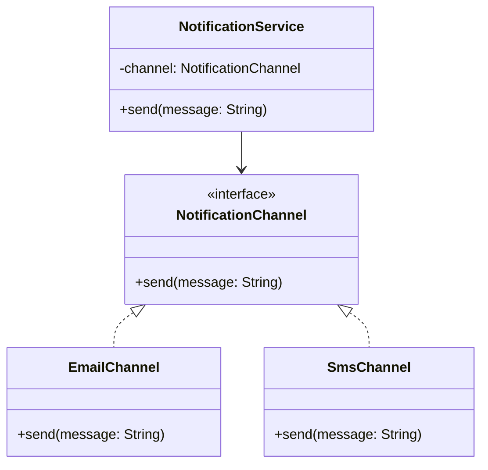

## Why LLD Exists as a Separate Interview Round

If you've been through the [System Design (HLD) series](/blog/system-design), you've already
practiced questions like "design a URL shortener that handles 10,000 requests per second." That's
**High-Level Design** — it's about boxes and arrows: services, databases, caches, load balancers,
and how data flows between machines.

**Low-Level Design (LLD)** asks a different question entirely: *"Given that we need to build this
one piece — a parking lot, an elevator, a chess game — how do you structure the actual code?"*

There's no network, no database sharding, no consistent hashing here. It's just you, a whiteboard,
and the question: **what classes do I need, what do they know about each other, and how do they
talk?**

Interviewers use LLD rounds to test something HLD rounds can't:

- Can you translate a fuzzy problem statement into concrete, well-named classes?
- Do you reach for inheritance when composition would be cleaner (or vice versa)?
- Will your design survive a "now add feature X" curveball without a rewrite?
- Can you actually *write* the Java that implements the diagram you just drew?

That last point is the big one. HLD interviews rarely require code. LLD interviews almost always
do — even if it's just method signatures and class skeletons.

## LLD vs HLD, Side by Side

| | High-Level Design (HLD) | Low-Level Design (LLD) |
|---|---|---|
| **Question shape** | "Design Twitter's news feed at scale" | "Design a parking lot's class structure" |
| **Output** | Architecture diagram, service boundaries, data flow | Class diagram, interfaces, method signatures |
| **Concerns** | Scalability, availability, latency, data partitioning | Extensibility, maintainability, correct OOP |
| **Tools of the trade** | Load balancers, caches, message queues, databases | Design patterns, SOLID principles, UML |
| **Language matters?** | Rarely — mostly language-agnostic | Yes — you're expected to write real code |
| **Typical duration** | 45–60 min, mostly discussion | 45–60 min, discussion + actual code |

Neither round is "harder" — they test different muscles. A candidate can ace HLD and completely
fall apart in LLD because they've never had to actually *write* the `ParkingSpot` class they just
described verbally.

## Where This Series Fits

This series assumes you already know Java syntax (if not, start with the
[Java: Zero to Advanced series](/blog/java)) and picks up from there. The order is deliberate:

1. **Part 1 (this part)** — OOP fundamentals, but through a *design* lens, not a syntax lens
2. **Part 2** — SOLID principles, the rulebook every design pattern is built on
3. **Parts 3–6** — the 23 Gang-of-Four design patterns plus a couple of concurrency patterns
4. **Part 7** — how to actually run an LLD interview: clarifying questions, entity extraction
5. **Part 8** — 14 full case studies (parking lot, elevator, Splitwise, BookMyShow, and more)
6. **Interview chapters** — rapid-fire Q&A grab bags for last-minute review

By the end, when someone says "design a vending machine," you won't freeze — you'll have a
repeatable process and a mental library of patterns to reach for.

## A Quick Preview: What "Good" LLD Looks Like

Here's a two-line problem statement and two very different responses to it:

> *"Design a system where a `NotificationService` can send notifications via Email, SMS, or Push."*

**Weak response:**
```java
class NotificationService {
    void send(String type, String message) {
        if (type.equals("EMAIL")) {
            // send email
        } else if (type.equals("SMS")) {
            // send sms
        } else if (type.equals("PUSH")) {
            // send push
        }
    }
}
```

This works today. But adding WhatsApp notifications means editing this class again, and every
`if/else` chain like this is a bug waiting to happen. It violates the **Open/Closed Principle**
(more on that in Chapter 8) — the class should be open for extension, closed for modification.

**Stronger response:**
```java
interface NotificationChannel {
    void send(String message);
}

class EmailChannel implements NotificationChannel {
    public void send(String message) { /* send email */ }
}

class SmsChannel implements NotificationChannel {
    public void send(String message) { /* send sms */ }
}

class NotificationService {
    private final NotificationChannel channel;

    NotificationService(NotificationChannel channel) {
        this.channel = channel;
    }

    void send(String message) {
        channel.send(message);
    }
}
```

Adding WhatsApp now means writing one new `WhatsAppChannel` class — zero existing code touched.
This is the **Strategy pattern** (Chapter 28), and recognizing it here in thirty seconds is exactly
the kind of instinct this series is built to train.



## Summary

- LLD is about class-level design: responsibilities, relationships, and extensibility — not
  servers and scale.
- LLD interviews expect you to write real, compilable-looking Java, not just talk in the abstract.
- Every "weak" design in this series will map to a principle or pattern that fixes it — that
  mapping *is* the skill being tested.
- The series moves from OOP fundamentals → SOLID → patterns → full case studies, in that order,
  because each layer depends on the one before it.

---

## Interview Questions

**1. What is the difference between High-Level Design and Low-Level Design?**
HLD defines the architecture of a system — its major components (services, databases, caches,
queues) and how they communicate, typically to satisfy scale, availability, and latency
requirements. LLD defines the internal structure of one component — its classes, interfaces, and
their relationships — to satisfy correctness, extensibility, and maintainability. HLD answers "what
pieces do we need and how do they talk over the network?"; LLD answers "how is this one piece
actually coded?"
*Follow-up: Can a system have good HLD but bad LLD?* Yes — a well-partitioned microservices
architecture can still have a single service full of tangled, unmaintainable classes. The two are
largely independent skills, which is why interviews test them separately.

**2. Why do companies test LLD separately from HLD?**
Because they're testing different failure modes. A candidate can describe a beautiful
microservices architecture yet write a `God class` that does everything when asked to implement
one piece of it. LLD rounds catch candidates who can talk architecture but can't translate a
requirement into working, extensible object-oriented code.
*Follow-up: Is LLD more important for backend roles than frontend roles?* It's relevant to both —
frontend component hierarchies and state management follow the same OOP/SOLID principles — but
LLD interviews are more commonly emphasized for backend and full-stack roles.

**3. What does "extensibility" mean in the context of LLD, and why does it matter so much?**
Extensibility is the ability to add new behavior to a system with minimal changes to existing,
already-tested code. It matters because requirements always change — "add WhatsApp support," "add
a new payment method," "support a new vehicle type in the parking lot." A design that requires
touching five existing classes for every new feature accumulates risk and slows teams down. A
design built around interfaces and composition contains that change to one new class.
*Follow-up: Is there such a thing as "too extensible"?* Yes — over-engineering a design with
interfaces and abstractions for requirements that don't exist yet (violating YAGNI, Chapter 12)
adds unnecessary complexity. Extensibility should be aimed at axes of change the problem statement
actually hints at.

**4. In an LLD interview, is it acceptable to just draw a class diagram without writing code?**
It depends on the interviewer, but most expect at least some real code — method signatures at
minimum, and often full implementations of the trickiest 2–3 classes. A class diagram shows you
can plan; code shows you can execute the plan without hand-waving over details (e.g., how exactly
does the `ParkingLot` find a free spot?).
*Follow-up: How much code is "enough" in a 45-minute LLD interview?* Enough to prove the design
compiles conceptually — core classes, key methods with real logic (not just comments), and the
interfaces that make the design extensible. Boilerplate like getters/setters can be waved away
verbally.

**5. What's the single biggest mistake candidates make in LLD interviews?**
Jumping straight into code before clarifying requirements or identifying entities. A candidate who
starts typing `class ParkingLot` thirty seconds into "design a parking lot" almost always ends up
re-designing halfway through once they realize they forgot multiple entry gates, or different
vehicle sizes, or payment. Chapter 41 covers the structured approach to avoid this.
*Follow-up: How long should requirement clarification take in a 45-minute round?* Roughly 5–7
minutes — enough to nail down the core actors, use cases, and any explicit constraints, without
eating into design and coding time.

**6. Are design patterns mandatory to know for LLD interviews?**
Not every pattern, but a working knowledge of the most common ones (Strategy, Observer, Factory,
Singleton, Decorator, State) is close to mandatory at mid-to-senior levels. Interviewers aren't
grading whether you say "this is the Strategy pattern" out loud — they're grading whether your
design *behaves* like one when a new requirement shows up. Knowing the pattern by name just makes
it faster to arrive at.
*Follow-up: What if I invent a solution that isn't a "named" pattern?* That's completely fine and
often correct — patterns are descriptions of recurring good solutions, not a checklist to force
your design into. A clean, working design that happens not to map to a GoF pattern is still a good
answer.

**7. How does LLD relate to SOLID principles?**
SOLID principles are the underlying rules that make a design "good" at the class level, and design
patterns are common, named solutions that satisfy one or more SOLID principles. Understanding SOLID
first means you can *justify* why a design is good, and you can invent pattern-like solutions to
problems that don't map to a textbook pattern.
*Follow-up: Which SOLID principle comes up most often in interviews?* The Open/Closed Principle,
because most "add a new feature" follow-up questions are really testing whether your original
design needs modification or just extension.

**8. Is LLD language-specific? Why does this series use Java specifically?**
The *concepts* — OOP, SOLID, design patterns — are language-agnostic and apply equally to C++,
Python, or Go. But actually writing the code in an interview is language-specific: Java's explicit
interfaces, access modifiers, and strong typing make certain patterns (like Strategy or Factory)
very natural to express, which is part of why LLD interviews are so common at Java-heavy
companies. This series uses Java because the target audience is Java backend engineers, and
because idioms like `enum`-based Singletons or `sealed` interfaces are Java-specific.
*Follow-up: Would a Python candidate need to know all 23 GoF patterns the same way?* The concepts
transfer, but some patterns solve problems Python's dynamic typing sidesteps naturally (e.g.,
Python doesn't need a heavyweight Factory pattern as often, since duck typing reduces the need for
explicit interfaces).

**9. What are "entities" in the context of an LLD problem, and why identify them first?**
Entities are the real-world nouns in the problem statement that deserve to become classes —
`ParkingSpot`, `Vehicle`, `Ticket`, `Gate` in a parking lot problem. Identifying them first (before
writing any method) gives you the skeleton of your class diagram and prevents the common trap of
designing one class in isolation and realizing later it needs to know about three others it
doesn't have a reference to.
*Follow-up: How do you tell the difference between an entity and an attribute?* A good heuristic:
if the noun has its own behavior or its own identity that other objects need to reference (like a
`Ticket` that gets looked up later), it's an entity. If it's just a descriptive value with no
independent behavior (like a `String licensePlate`), it's an attribute.

**10. How do you handle an LLD interviewer who keeps adding new requirements mid-design?**
Treat it as the actual test — LLD interviews almost always include at least one "now also
support X" curveball to check whether your design was genuinely extensible or just happened to
work for the original scope. Pause, identify which existing class or interface the new
requirement plugs into, and if it doesn't plug in cleanly, say so honestly and explain the minimal
refactor needed rather than pretending it fits perfectly.
*Follow-up: What's a good verbal response when a new requirement doesn't fit your design?*
Something like: "This wasn't accounted for in my original interfaces — here's the smallest change
I'd make: I'd introduce a `DiscountStrategy` interface here instead of hardcoding this
calculation," and then show the change rather than starting over.

**11. What role does UML play in a real (non-interview) engineering job versus in an interview?**
In real jobs, full UML diagrams are rarely drawn formally day-to-day — most teams sketch informal
class relationships on a whiteboard or in a design doc. In interviews, UML (specifically class and
sequence diagrams) is a fast, unambiguous way to communicate your design to the interviewer before
writing code, and it signals you can reason about a system independent of syntax.
*Follow-up: Do I need to know full, formal UML notation (multiplicities, all arrow types)?* Not
exhaustively — knowing class boxes, the three relationship arrows (association, aggregation,
composition), and inheritance/realization arrows covers the vast majority of what's needed
(Chapter 6 covers exactly this subset).

**12. Can a strong LLD design still fail an interview?**
Yes, if it's not communicated well. Interviewers can't read your mind — a candidate who
silently designs a perfect class hierarchy but never explains their reasoning out loud often
scores lower than one with a slightly less elegant design who clearly narrates trade-offs
("I chose composition here over inheritance because a `Car` isn't a kind of `Engine`, it *has*
one"). LLD interviews evaluate communication and reasoning, not just the final diagram.
*Follow-up: How do you practice narrating design decisions out loud?* Explicitly practice mock
interviews where you speak your reasoning as you draw — many candidates who design well silently
freeze up when forced to verbalize the "why" behind each choice.

**13. What's the relationship between this LLD series and the Design Patterns parts (3–6)?**
Design patterns are the vocabulary and toolkit built on top of the OOP and SOLID foundations from
Parts 1–2. You can't productively learn "when to use Strategy vs State" without first
understanding polymorphism and the Open/Closed Principle — the patterns are applied instances of
those fundamentals, not a separate topic.
*Follow-up: If I already know the 23 GoF patterns, can I skip Parts 1–2?* You can skim them, but
it's worth reviewing at least the SOLID chapters (7–14), since most interviewers probe *why* you
chose a pattern in SOLID terms, not just whether you can name it.

**14. Why does this series include full case studies (Part 8) instead of stopping at patterns?**
Knowing patterns in isolation doesn't guarantee you can compose several of them into a working
system under interview pressure. A single case study like "design a parking lot" might use
Strategy (fee calculation), Factory (creating different spot types), and Singleton
(the parking lot manager) together — the case studies are where isolated pattern knowledge turns
into the practical skill interviews actually test.
*Follow-up: Should case studies be practiced by memorizing the final design?* No — memorized
designs fall apart the moment the interviewer changes one requirement. The value is in practicing
the *process* (Chapters 41–44) repeatedly across different problems, not memorizing any one
answer.
