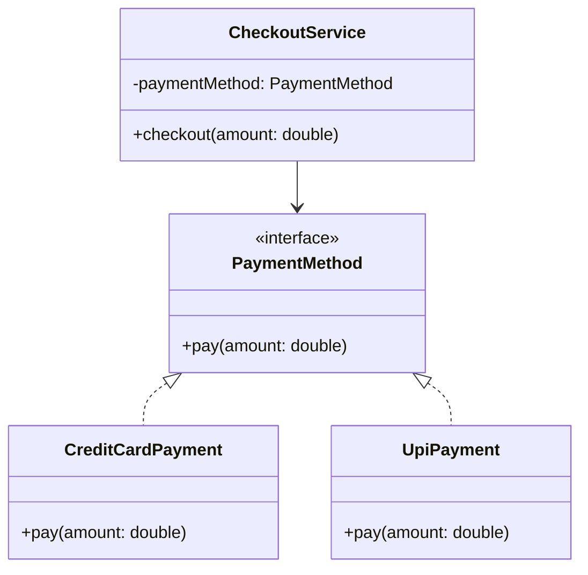

## Why Revisit Something You Already Know?

Every Java developer can define encapsulation, inheritance, polymorphism, and abstraction in an
interview — that's textbook recall. What separates a strong LLD candidate is using these four
tools **deliberately**, knowing exactly which problem each one solves and, just as importantly,
when *not* to reach for one.

This chapter treats each pillar as a design decision, not a vocabulary quiz.

## Encapsulation: Protecting Invariants, Not Just Hiding Fields

The textbook definition — "bundling data and methods, hiding internal state" — misses the real
point. Encapsulation exists to protect **invariants**: rules that must always hold true about an
object's state.

```java
class BankAccount {
    private double balance;

    void withdraw(double amount) {
        if (amount > balance) {
            throw new IllegalArgumentException("Insufficient funds");
        }
        balance -= amount;
    }
}
```

If `balance` were public, any code anywhere could set it to a negative number, silently breaking
the invariant "balance never goes negative." Encapsulation isn't about secrecy for its own sake —
it's about making illegal states unrepresentable from outside the class.

**LLD interview signal:** if you expose a mutable field with a public setter and no validation,
expect a follow-up like "what stops me from setting this to an invalid value?"

## Abstraction: Designing to an Interface, Not an Implementation

Abstraction means callers depend on *what* an object does, not *how* it does it.

```java
interface PaymentMethod {
    void pay(double amount);
}

class CreditCardPayment implements PaymentMethod {
    public void pay(double amount) { /* charge card */ }
}

class UpiPayment implements PaymentMethod {
    public void pay(double amount) { /* charge UPI */ }
}
```

A `CheckoutService` that depends on `PaymentMethod` doesn't care whether it's a credit card or UPI
— and can accept a brand-new payment type tomorrow without changing a single line. This is the
foundation the **Strategy pattern** (Chapter 28) formalizes.



## Inheritance: A Powerful Tool That Is Overused

Inheritance models an **"is-a"** relationship, and it's the pillar most often misused in LLD
interviews. The classic trap:

```java
class Bird {
    void fly() { /* flap wings */ }
}

class Penguin extends Bird {
    // Penguins can't fly!
    void fly() { throw new UnsupportedOperationException(); }
}
```

`Penguin extends Bird` compiles fine, but it's a lie: a penguin is not substitutable for a bird
wherever flight is expected. This directly violates the **Liskov Substitution Principle**
(Chapter 9). The fix is usually to separate the capability from the type:

```java
interface Bird { void eat(); }
interface FlyingBird extends Bird { void fly(); }

class Sparrow implements FlyingBird {
    public void eat() { }
    public void fly() { }
}

class Penguin implements Bird {
    public void eat() { }
    // no fly() — and no lie
}
```

**Rule of thumb for LLD interviews:** reach for inheritance only when every subclass can honestly
say "I am fully substitutable for my parent, in every context." If you find yourself overriding a
method to throw an exception or do nothing, that's a signal the hierarchy is wrong.

## Polymorphism: The Payoff for Getting Abstraction Right

Polymorphism lets code call the same method on different types and get different, correct
behavior — it's the *reward* you get for defining a good interface.

```java
List<PaymentMethod> methods = List.of(new CreditCardPayment(), new UpiPayment());
for (PaymentMethod method : methods) {
    method.pay(100.0); // correct behavior, no if/else needed
}
```

Compare this to the anti-pattern from Chapter 1's `NotificationService` example: an `if/else` or
`switch` chain checking types is a strong signal that polymorphism should have been used instead.
**If you ever see yourself writing `if (obj instanceof TypeA) ... else if (obj instanceof TypeB)`,
that's almost always a missed opportunity for polymorphism.**

## Composition Over Inheritance — A Preview

This chapter's biggest takeaway, expanded fully in Chapter 13: **favor composition ("has-a") over
inheritance ("is-a") by default.** A `Car` should *have* an `Engine`, not *be* an `Engine`. This
keeps designs flexible — you can swap a `PetrolEngine` for an `ElectricEngine` at runtime without
touching `Car`'s class hierarchy at all.

```java
class Engine { void start() { } }

class Car {
    private final Engine engine; // composition
    Car(Engine engine) { this.engine = engine; }
    void drive() { engine.start(); }
}
```

## Summary

- **Encapsulation** protects invariants — it's not just "making fields private."
- **Abstraction** lets callers depend on behavior, not implementation, enabling swap-in
  replacements without ripple effects.
- **Inheritance** models "is-a" and should pass the substitutability test every single time, or it
  will violate LSP.
- **Polymorphism** is the practical payoff of good abstraction — it replaces `if/else` type-checks
  with clean dispatch.
- Default to **composition over inheritance** unless the "is-a" relationship is unquestionably
  true and permanent.

---

## Interview Questions

**1. What is encapsulation, and what problem does it actually solve?**
Encapsulation bundles an object's state with the methods that operate on it and restricts direct
access to that state from outside the class. Its real purpose is protecting invariants — rules
that must always be true (e.g., a bank balance can't go negative, a `Stack` can't pop when empty).
Without encapsulation, any external code could push the object into an invalid state.
*Follow-up: Does using private fields with public getters/setters count as proper encapsulation?*
Not automatically — a setter with no validation logic (`setBalance(double b) { this.balance = b; }`)
exposes the same risk as a public field. True encapsulation means the setter enforces the
invariant, not just hides the field syntactically.

**2. Give an example where poor encapsulation caused a real design bug.**
A `LinkedList` implementation that exposes its internal `Node` objects publicly lets external code
rearrange `next` pointers directly, corrupting the list's structure without going through any of
the class's own methods (`add`, `remove`), which maintain size counts and null-safety. Keeping
`Node` private and only exposing safe operations prevents this entirely.
*Follow-up: How does this relate to immutability?* Immutable objects take encapsulation further —
if state can never change after construction, there's no invariant to protect at all after
creation, which is why immutable value objects (like Java's `String` or `LocalDate`) are inherently
thread-safe and simpler to reason about.

**3. What is abstraction, and how is it different from encapsulation?**
Abstraction is about exposing *what* an object does while hiding *how* it does it — typically via
interfaces or abstract classes. Encapsulation is about protecting an object's internal *state*.
They're related but distinct: you can have an interface (abstraction) whose implementing classes
still leak internal state through poor encapsulation, and you can have perfect encapsulation on a
concrete class with no abstraction at all (no interface, so callers are tightly coupled to it).
*Follow-up: Can you have abstraction without an interface in Java?* Yes, an abstract class provides
abstraction too — callers can depend on the abstract class type without knowing the concrete
subclass, though interfaces are preferred when there's no shared implementation to provide.

**4. When would you choose an abstract class over an interface in Java?**
Choose an abstract class when subclasses share common state or common method implementations you
don't want repeated (e.g., a `Shape` abstract class with a shared `describe()` method that calls an
abstract `area()`). Choose an interface when you're defining a pure contract with no shared
implementation, or when a class needs to fulfill multiple unrelated contracts — Java only allows
single class inheritance but multiple interface implementation.
*Follow-up: Since Java 8 added default methods to interfaces, has this distinction weakened?*
Partially — interfaces can now provide shared default behavior — but abstract classes can still
hold instance state (fields) and constructors, which interfaces cannot, so the distinction remains
meaningful for stateful shared logic.

**5. Explain the Liskov Substitution Principle using the Bird/Penguin example.**
LSP states that objects of a subclass should be substitutable for objects of the superclass without
altering the correctness of the program. If `Bird` declares `fly()` and `Penguin extends Bird`
throws an exception from `fly()`, any code written against `Bird` (e.g., "make every bird fly")
breaks when given a `Penguin`. The fix is restructuring the hierarchy so `fly()` only exists on
types that can honestly support it (e.g., a separate `FlyingBird` interface).
*Follow-up: Is throwing `UnsupportedOperationException` from an override ever acceptable?* It's a
code smell in most cases and usually signals an LSP violation, though the Java collections
framework itself does this (e.g., `List.of(...).add()` throws), which is a pragmatic trade-off the
JDK team accepted for immutable collection views rather than a universal endorsement of the
pattern.

**6. What is the difference between "is-a" and "has-a" relationships, and how do you decide which
one applies?**
"Is-a" means a subtype relationship where the subtype is always substitutable for the supertype —
modeled with inheritance. "Has-a" means one object contains or uses another as a component —
modeled with composition. The test: ask "is every instance of the child truly, always, a valid
instance of the parent, usable everywhere the parent is expected?" If there's any exception, it's
"has-a," not "is-a." A `Car` "has an" `Engine` — a car is not a kind of engine.
*Follow-up: What real damage can come from picking inheritance when it should have been
composition?* It creates rigid hierarchies where a small requirement change (like Penguins needing
to exist) forces restructuring the entire class tree, and can force implementing methods that don't
make sense for a given subtype, breaking LSP.

**7. What is polymorphism, and how does it eliminate `if/else` type-checking chains?**
Polymorphism allows a single method call (e.g., `shape.area()`) to invoke different, correct
behavior depending on the actual runtime type of the object, without the caller needing to know
which subtype it is. This directly replaces code like
`if (shape instanceof Circle) ... else if (shape instanceof Square) ...` with clean dispatch,
because each subtype implements its own version of the method.
*Follow-up: What's the performance cost of polymorphic dispatch (virtual method calls) in Java, and
should it influence LLD design decisions?* The JVM's virtual method dispatch has a small, usually
negligible overhead versus a static call, and modern JIT compilers often inline monomorphic call
sites. In practically all LLD interview contexts, correctness and maintainability should drive the
decision, not this micro-optimization.

**8. What is method overloading vs method overriding, and which one is "true" polymorphism?**
Overloading (compile-time / static polymorphism) is having multiple methods with the same name but
different parameter lists in the same class, resolved at compile time based on argument types.
Overriding (runtime / dynamic polymorphism) is a subclass providing its own implementation of a
method declared in its superclass, resolved at runtime based on the actual object type. Runtime
polymorphism (overriding) is what LLD design relies on for extensibility — overloading is a
convenience feature, not a design tool.
*Follow-up: Can overloading cause ambiguity bugs, and how?* Yes — if a method is overloaded with
`process(int, long)` and `process(long, int)`, calling `process(1, 2)` with two `int` literals can
be ambiguous or resolve unexpectedly depending on autoboxing/widening rules, which is why
overloading should be used sparingly and predictably.

**9. Why is "favor composition over inheritance" considered one of the most important LLD
guidelines?**
Composition keeps behavior swappable at runtime and avoids the fragile, deeply nested class
hierarchies that inheritance encourages. A composed object can change its behavior by swapping out
a component (e.g., giving a `Car` an `ElectricEngine` instead of a `PetrolEngine`) without touching
the `Car` class or creating a new subclass for every combination of behaviors. Inheritance, in
contrast, locks behavior in at compile time and leads to combinatorial subclass explosion when
multiple independent variations exist (e.g., `PetrolAutomaticCar`, `PetrolManualCar`,
`ElectricAutomaticCar`...).
*Follow-up: Name a GoF pattern built entirely around this principle.* The **Strategy pattern**
(Chapter 28) and the **Decorator pattern** (Chapter 24) are both direct applications of favoring
composition over inheritance.

**10. How does encapsulation support thread safety?**
By controlling all access to mutable state through a class's own synchronized methods, encapsulation
creates a single, controllable choke point for concurrent access. If fields were public, any thread
could mutate them without synchronization, making race conditions far more likely and far harder to
find, since the bug isn't localized to one class.
*Follow-up: Does encapsulation alone guarantee thread safety?* No — you still need proper
synchronization (locks, `synchronized` blocks, atomic types) inside the class. Encapsulation just
makes it *possible* to add that synchronization in one place rather than needing every caller to
coordinate correctly.

**11. What is the "God class" anti-pattern, and how does it relate to these four pillars?**
A God class is one that has taken on too many responsibilities — often because encapsulation and
abstraction were skipped, so logic that should live in separate collaborating classes got dumped
into one. It typically has dozens of fields, hundreds of lines, and does everything from validation
to persistence to business logic. It's usually a sign that abstraction (interfaces splitting
responsibilities) and the Single Responsibility Principle were never applied.
*Follow-up: How would you refactor a God class in an interview setting?* Identify the distinct
responsibilities it holds (e.g., "this `OrderManager` validates orders, calculates pricing, AND
sends notifications"), then extract each into its own class with a clear interface, wiring them
together via composition in the original class, which now becomes a thin coordinator.

**12. Can you have polymorphism without inheritance in Java?**
Yes — interface-based polymorphism doesn't require a class hierarchy beyond implementing a shared
interface; unrelated classes (`CreditCardPayment`, `UpiPayment`) can be fully polymorphic with each
other through a common `PaymentMethod` interface with zero shared class ancestry beyond `Object`.
This is often preferred in LLD because it avoids the rigidity of inheritance while still getting
full polymorphic dispatch.
*Follow-up: What about ad hoc polymorphism via generics?* Java generics provide a different kind of
polymorphism (parametric polymorphism) — a `List<T>` works uniformly over any type `T` without
needing `T` to implement any particular interface, which is a separate mechanism from interface- or
inheritance-based polymorphism.

**13. What's an example of over-applying encapsulation to the point of hurting a design?**
Wrapping every single field with a getter and setter by default, even for simple, stable data
carriers (like a `Point` with `x` and `y`), adds boilerplate without protecting any real invariant,
since `x` and `y` have no validity constraints beyond being numbers. In such cases, a simple
immutable `record` (Java 16+) with public accessors is cleaner and just as safe.
*Follow-up: How do Java records change this calculus?* Records give you immutability, equals/
hashCode/toString, and concise syntax for free, making them the natural choice for simple data
carriers where encapsulation concerns (protecting mutable state) don't apply because there's no
mutable state at all.

**14. In an LLD interview, how would you defend a design decision to use composition instead of
inheritance if the interviewer pushes back?**
Point to the specific future-flexibility the composition buys: "If I used inheritance here,
adding a new combination of behaviors would require a new subclass for every combination; with
composition, I can mix and match components at runtime without touching this class hierarchy at
all." Concretely walking through a hypothetical new requirement and showing how few classes need to
change is more convincing than reciting the principle by name.
*Follow-up: Is there a scenario where inheritance is genuinely simpler and composition would be
overkill?* Yes — for a strict, stable, never-changing "is-a" hierarchy with no behavioral variation
(e.g., `Square extends Rectangle` in a purely geometric, immutable context with no risk of an
LSP violation), inheritance is simpler and composition would add unnecessary indirection.
