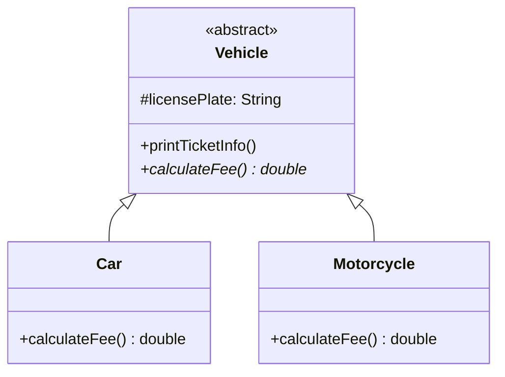

## Three Tools, Three Jobs

Java gives you three building blocks for structuring types, and LLD interviews frequently probe
whether you know which one to reach for:

- **Concrete class** — a fully implemented type you can instantiate directly.
- **Interface** — a pure contract: "anything that implements me can do X," with no shared state.
- **Abstract class** — a partial implementation: some shared state/behavior, some methods left for
  subclasses to fill in.

Picking the wrong one is one of the most common small mistakes that quietly signals weak design
instincts in an interview.

## Concrete Classes: The Default, Not the Exception

Most classes in a good design are plain concrete classes — `Order`, `Ticket`, `ParkingSpot`. Don't
over-engineer by adding an interface for every single class "just in case." An interface should
exist because you genuinely expect multiple implementations, or because you want to decouple a
consumer from a specific implementation for testing or extensibility — not by default.

```java
class ParkingSpot {
    private final String id;
    private boolean occupied;
    // straightforward, no need for an interface unless multiple spot behaviors are expected
}
```

## Interfaces: Contracts With No Shared State

Use an interface when you have (or expect) multiple implementations of the same behavior with
nothing in common except that behavior.

```java
interface FeeStrategy {
    double calculateFee(long durationInMinutes);
}

class HourlyFeeStrategy implements FeeStrategy {
    public double calculateFee(long durationInMinutes) {
        return Math.ceil(durationInMinutes / 60.0) * 20;
    }
}

class FlatFeeStrategy implements FeeStrategy {
    public double calculateFee(long durationInMinutes) {
        return 50;
    }
}
```

`HourlyFeeStrategy` and `FlatFeeStrategy` share zero implementation — only the contract. This is
exactly the shape an interface is for, and it's the backbone of the **Strategy pattern**
(Chapter 28).

## Abstract Classes: Shared Implementation, Some Gaps Left Open

Use an abstract class when subtypes share real state or behavior, but one or two methods must
still vary per subtype.

```java
abstract class Vehicle {
    protected String licensePlate;

    Vehicle(String licensePlate) {
        this.licensePlate = licensePlate;
    }

    // shared behavior — every vehicle is displayed the same way
    void printTicketInfo() {
        System.out.println("Plate: " + licensePlate + ", Fee: " + calculateFee());
    }

    // left abstract — each vehicle type calculates differently
    abstract double calculateFee();
}

class Car extends Vehicle {
    Car(String licensePlate) { super(licensePlate); }
    double calculateFee() { return 20.0; }
}

class Motorcycle extends Vehicle {
    Motorcycle(String licensePlate) { super(licensePlate); }
    double calculateFee() { return 10.0; }
}
```

`printTicketInfo()` would be duplicated across `Car` and `Motorcycle` if this were an interface —
the abstract class avoids that duplication while still forcing each subtype to define its own fee
calculation. This is the seed of the **Template Method pattern** (Chapter 32).



## A Decision Framework

Ask these questions in order:

1. **Do I have (or expect) more than one implementation of this behavior?**
   No → just use a concrete class.
2. **Do the implementations share meaningful state or method bodies?**
   No shared state/behavior → use an **interface**.
   Yes, some shared behavior → use an **abstract class**.
3. **Does this type need to implement multiple unrelated contracts?**
   Java allows only single inheritance of classes but multiple interface implementation — if a
   type needs to be both `Comparable` and `Serializable`-like behavior, interfaces are the only
   option.

## Summary

- Default to concrete classes; don't add interfaces speculatively.
- Interfaces model pure contracts with no shared implementation — ideal for interchangeable
  strategies.
- Abstract classes model partial implementations where subtypes share real code but differ in a
  few specific behaviors.
- A class can implement many interfaces but extend only one class — this constraint alone often
  decides the choice.

---

## Interview Questions

**1. What is the core difference between an interface and an abstract class in Java?**
An interface defines a contract with no instance state and, prior to Java 8, no method bodies
(now it can have `default` and `static` methods, but still no instance fields). An abstract class
can hold instance fields, constructors, and fully implemented methods alongside abstract ones. The
practical distinction in LLD: interfaces model "can do X," abstract classes model "is a partially
defined X that shares real state/behavior with siblings."
*Follow-up: Since Java 8's default methods let interfaces have behavior, is the distinction
dying?* Not fully — interfaces still can't hold instance fields or constructors, so any design
needing shared *state* across implementations still requires an abstract class or composition, not
just default methods.

**2. When would you choose an abstract class over an interface, concretely?**
When multiple subtypes share both state and behavior that would otherwise be duplicated. E.g., in
the `Vehicle` example, `licensePlate` and `printTicketInfo()` are identical across `Car` and
`Motorcycle` — an abstract class avoids copy-pasting that logic into every subtype, while still
leaving `calculateFee()` abstract for each to define.
*Follow-up: What happens if two unrelated hierarchies both need this shared behavior — say, a
`Vehicle` and a `Building` both need `printTicketInfo`-like logic?* Since Java only allows single
class inheritance, you can't have both extend the same abstract class if they're otherwise
unrelated. You'd extract the shared logic into a separate helper class or interface with default
methods, favoring composition over trying to force an inheritance relationship.

**3. Can an interface have a constructor? Why or why not?**
No — interfaces cannot have constructors because they cannot hold instance state to initialize.
Interfaces only define behavior contracts (plus static/default methods since Java 8), and
construction is inherently about initializing an object's state, which belongs to concrete or
abstract classes.
*Follow-up: Can an interface have static fields?* Yes, but they are implicitly `public static
final` (constants) — interfaces cannot have mutable instance or static state that behaves like a
regular class field.

**4. What is a `default` method in a Java interface, and what problem was it introduced to
solve?**
A `default` method provides a method body directly in an interface, allowing implementing classes
to inherit that behavior without being forced to override it. It was introduced in Java 8
primarily to let the JDK evolve existing interfaces (like adding `forEach` to `Collection`)
without breaking every existing implementation of that interface across the ecosystem.
*Follow-up: Does using default methods turn an interface into a substitute for an abstract
class?* Not fully — default methods still can't access or hold instance fields, so they can only
provide behavior expressed purely in terms of the interface's other abstract methods, unlike an
abstract class's methods, which can freely use protected instance state.

**5. Why shouldn't you add an interface for every class "just in case" you need multiple
implementations later?**
This is a violation of YAGNI (Chapter 12) — every unnecessary interface adds an extra layer of
indirection a reader has to navigate, without providing any real value until a second
implementation actually exists. It also makes refactoring tools and IDE navigation less direct
("go to definition" jumps to the interface, not the one real implementation). Interfaces should be
introduced when a second implementation is genuinely expected or when you need to decouple a
consumer for testing (e.g., mocking).
*Follow-up: Is there an exception where you'd add an interface even with only one implementation
today?* Yes — if you're designing a public library API, or you know a component will be unit
tested by mocking its dependency, introducing an interface upfront for that dependency is
reasonable even with a single real implementation, since testability is a concrete, present need.

**6. A class needs to be both `Comparable` and support a custom `Payable` behavior you've
defined. How does Java's single-inheritance-of-classes rule affect your design?**
Since a class can extend only one class but implement any number of interfaces, `Comparable` and
your custom `Payable` contract must both be interfaces (which they can be — `Comparable` already
is), and your class implements both:
`class Invoice implements Comparable<Invoice>, Payable { ... }`. If `Payable` needed shared instance
state across many payable types, you'd combine an abstract class for the shared state with an
additional interface for `Comparable`, since you can extend one abstract class and still implement
`Comparable` alongside it.
*Follow-up: What's the actual reason Java restricts multiple class inheritance but allows multiple
interface implementation?* Multiple class inheritance introduces the "diamond problem" — ambiguity
when two parent classes define conflicting implementations of the same method with state. Interfaces
avoid this because (pre-Java 8) they had no implementation to conflict, and even now, Java forces
explicit resolution if two default methods from different interfaces conflict.

**7. What is a marker interface, and is it still a good practice in modern Java?**
A marker interface has no methods at all — its sole purpose is to "tag" a class with metadata that
other code can check via `instanceof` (e.g., `Serializable`, `Cloneable`). It was common pre-Java
5. Since annotations were introduced, most new use cases for tagging classes use annotations
instead (e.g., `@Deprecated`), since annotations carry more structured metadata and don't force
implementing every marked class to also implement an (empty) interface.
*Follow-up: Why does `Serializable` remain a marker interface instead of being converted to an
annotation?* Backward compatibility — changing it now would break virtually all existing Java code
that relies on `instanceof Serializable` checks and the interface-based contract the serialization
mechanism is built on.

**8. How do sealed interfaces/classes (Java 17+) change the interface-vs-abstract-class
decision?**
Sealed types let you declare exactly which classes are permitted to implement an interface or
extend a class (`sealed interface Shape permits Circle, Square {}`), which enables the compiler to
verify exhaustive `switch` pattern matching over all subtypes. This is useful in LLD when you want
polymorphism (interface) but also want the compiler to guarantee every case is handled — closing
the open-ended extensibility interfaces normally provide, in exchange for compile-time
exhaustiveness safety.
*Follow-up: When would you deliberately want a sealed interface instead of a normal, open one in
an LLD design?* When the set of variants is a fixed, known-in-advance domain concept unlikely to
grow — e.g., `sealed interface PaymentStatus permits Pending, Completed, Failed {}` — versus an
open interface like `NotificationChannel`, where you explicitly want third parties or future code
to add new implementations freely.

**9. Can an abstract class implement an interface without implementing all its methods?**
Yes — an abstract class is allowed to leave interface methods unimplemented, deferring the
obligation to its own concrete subclasses. This is a common pattern: an abstract class implements
some of an interface's methods with shared logic while leaving others abstract for subclasses to
fill in.
*Follow-up: Why would you do this instead of putting all the shared logic directly in the
interface via default methods?* Because the shared logic often needs instance state (fields),
which interfaces cannot hold — the abstract class provides a place for that state plus the shared
logic that operates on it, something default methods structurally cannot do.

**10. What's the difference between "programming to an interface" as a design principle versus
literally using the Java `interface` keyword?**
"Programming to an interface" (a phrase from the GoF book) means depending on the *abstract type*
(behavior contract) rather than a specific concrete implementation — this can be satisfied by a
Java `interface`, an `abstract class`, or even a concrete class if callers only ever reference it
through its supertype. The keyword is one mechanism; the principle is broader and is really about
minimizing coupling between a consumer and a specific implementation.
*Follow-up: Give an example of "programming to an interface" using a concrete class instead of the
`interface` keyword.* If `ArrayList` had no `List` interface at all, code that only calls
`add()`/`get()` on a variable declared as `ArrayList` but never relies on `ArrayList`-specific
methods is still loosely coupled in spirit, even though it's technically bound to a concrete type
— though in practice Java strongly encourages using the actual `List` interface for this exact
reason.

**11. What happens if two interfaces a class implements both declare a `default` method with the
same signature?**
The class fails to compile unless it explicitly overrides the conflicting method itself, resolving
the ambiguity manually (optionally calling one of the two via
`InterfaceName.super.methodName()`). Java forces this explicit resolution rather than picking one
default arbitrarily, precisely to avoid the silent ambiguity that plagues multiple inheritance in
other languages.
*Follow-up: Is this considered a design smell if it happens in your own interfaces?* Generally
yes — it suggests two of your interfaces have overlapping responsibilities that should probably be
consolidated or restructured, rather than relying on manual conflict resolution as a long-term
pattern.

**12. In the `FeeStrategy` example, why is an interface preferred over an abstract class even
though both `HourlyFeeStrategy` and `FlatFeeStrategy` could technically share a common abstract
base?**
Because they share no actual state or method bodies — only the single-method contract. Forcing an
abstract class here would add an unnecessary class-inheritance relationship with zero shared code,
needlessly consuming Java's single-inheritance slot and adding no value over a plain interface.
*Follow-up: If `HourlyFeeStrategy` and a new `WeekendFeeStrategy` started sharing a helper method
like `roundUpToNearestHour()`, would you switch to an abstract class?* Not necessarily — you could
add a `default` method to the interface for that shared helper if it doesn't need instance state,
or extract a separate utility class/composition if it does, before jumping to an abstract class.

**13. How would you explain to an interviewer why you chose an interface for `FeeStrategy` but a
concrete class for `ParkingTicket`?**
`ParkingTicket` represents a single, concrete concept in the domain with one well-defined shape and
no interchangeable variants — there's no reason to expect multiple "kinds" of tickets with
different behavior contracts. `FeeStrategy`, by contrast, explicitly represents a *family* of
interchangeable algorithms (hourly, flat, weekend) that the rest of the system should be able to
swap without caring which one is active — the textbook use case for an interface.
*Follow-up: What would make you reconsider and turn `ParkingTicket` into an interface later?* If a
new requirement introduced genuinely different ticket types with different behavior — e.g., a
`ReservedTicket` that skips fee calculation entirely versus a `WalkInTicket` that doesn't — that
would justify introducing a `Ticket` interface or abstract class at that point, not before.

**14. Is it possible to instantiate an abstract class in Java? What about an interface?**
Neither can be instantiated directly (`new Vehicle()` and `new FeeStrategy()` both fail to
compile) — both require a concrete subclass or implementing class to be instantiated. This is
enforced by the compiler specifically because both types are, by definition, incomplete: an
abstract class has unimplemented abstract methods, and an interface has no implementation at all
(aside from static/default methods, which don't require instantiation to call).
*Follow-up: Can an abstract class with zero abstract methods still be instantiated?* No — even if
an abstract class happens to implement every method, the `abstract` keyword itself blocks direct
instantiation; you'd need to remove the keyword or provide a (possibly trivial) concrete
subclass to instantiate it.
