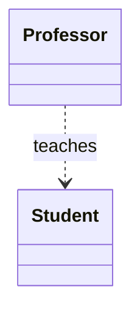
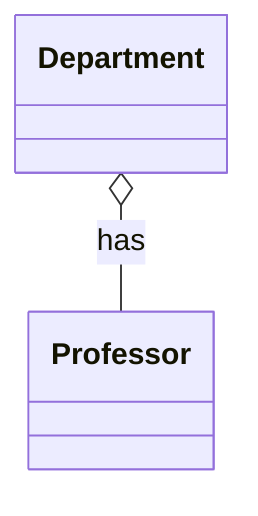
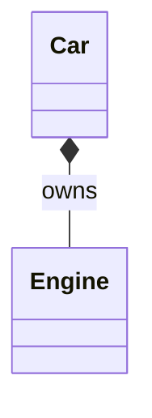
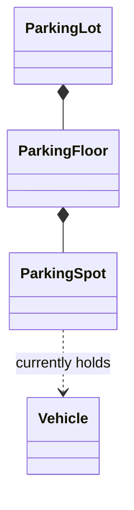

## Three Flavors of "Knows About"

When two classes reference each other, they're related — but not all relationships are equal.
LLD interviews expect you to distinguish three specific flavors, because each implies a different
answer to the question: **"if object A is destroyed, what happens to object B?"**

| Relationship | Meaning | Lifecycle | UML Arrow |
|---|---|---|---|
| **Association** | "Uses" — a general connection | Independent lifecycles | Plain line |
| **Aggregation** | "Has-a" (weak ownership) | B can outlive A | Hollow diamond |
| **Composition** | "Owns-a" (strong ownership) | B dies when A dies | Filled diamond |

## Association: The Loosest Connection

Association just means one class knows about, and uses, another — with no ownership implied
either way.

```java
class Professor {
    void teach(Student student) {
        System.out.println("Teaching " + student.getName());
    }
}
```

A `Professor` uses a `Student` here, but neither owns the other — students exist independently of
any specific professor, and professors exist independently of any specific student.



## Aggregation: "Has-a," But Independent Lifecycles

Aggregation is a whole-part relationship where the "part" can exist and be reused independently of
the "whole."

```java
class Department {
    private List<Professor> professors; // aggregation

    Department(List<Professor> professors) {
        this.professors = professors;
    }
}
```

If a `Department` is dissolved, its `Professor` objects don't cease to exist — they can move to
another department. The `Department` merely *references* professors; it doesn't own their
lifecycle.



## Composition: "Owns-a," Same Lifecycle

Composition is a stronger whole-part relationship where the "part" cannot meaningfully exist
without the "whole" — its lifecycle is bound to the parent.

```java
class Car {
    private final Engine engine; // composition

    Car() {
        this.engine = new Engine(); // Car creates and owns its Engine
    }
}
```

The `Engine` here is created inside the `Car` and has no independent existence or reuse outside of
it — when the `Car` object is garbage collected, so is its `Engine`. Contrast this with the earlier
`Car`/`Engine` example in Chapter 2, where the engine was injected — that was still composition
conceptually (a car owns its one engine at a time), but the *construction* pattern differs: owning
a component doesn't always mean *creating* it yourself.



## Why This Distinction Actually Matters in Interviews

The distinction isn't academic pedantry — it drives real code decisions:

- **Aggregation** implies the "part" objects are often passed in via constructor/setter
  (dependency injection) since they're created and managed elsewhere.
- **Composition** implies the "whole" is usually responsible for creating (and sometimes
  destroying/cleaning up) the "part" — e.g., closing resources.
- Getting this wrong leads to bugs like a `Library` deleting `Book` records from a shared catalog
  just because one `Branch` object referencing them was removed — a composition assumption applied
  to what should have been aggregation.

**A quick self-test:** "If I deleted the containing object right now, should the contained object
disappear too?" Yes → composition. No → aggregation. No ownership implied at all → plain
association.

## Applying This to a Familiar Case Study

Consider a `ParkingLot` (previewed here, fully designed in Chapter 45):

- `ParkingLot` **has** many `ParkingFloor`s — composition. Floors don't exist independently of the
  lot they belong to.
- `ParkingFloor` **has** many `ParkingSpot`s — composition, same reasoning.
- `ParkingSpot` **is associated with** a `Vehicle` when occupied — plain association. Vehicles
  exist entirely independently of any parking spot; a `Vehicle` object isn't "owned" by the spot it
  happens to be parked in.



## Summary

- **Association** = "uses," no ownership either way, both lifecycles fully independent.
- **Aggregation** = "has-a" with weak ownership — the part can outlive the whole.
- **Composition** = "owns-a" with strong ownership — the part's lifecycle is bound to the whole.
- The self-test: "does deleting the container delete the contents?" answers which relationship
  applies.
- Getting the relationship right predicts real code decisions: who constructs what, who's
  responsible for cleanup, and where reuse is safe.

---

## Interview Questions

**1. What is the difference between aggregation and composition?**
Both describe "has-a" whole-part relationships, but they differ in lifecycle dependency.
Aggregation is weak ownership — the contained object can exist independently and outlive the
container (a `Professor` can exist without any `Department`). Composition is strong ownership —
the contained object's lifecycle is tied to the container and typically cannot exist meaningfully
outside it (an `Engine` created and owned entirely by one `Car`).
*Follow-up: Is this distinction enforced by the Java language itself?* No — Java has no syntax
that distinguishes aggregation from composition; it's purely a design-level (UML) concept
expressed through how you structure construction and object ownership in code, not a compiler
rule.

**2. Give a real-world example of aggregation and explain why it isn't composition.**
A `University` has many `Department`s, but more classically: a `Team` has many `Player`s.
Players can be transfered to a different team, and a team can be disbanded while its players
continue existing and join other teams — so the `Player` objects' lifecycle is independent of any
one `Team`. This is aggregation, not composition, because deleting the `Team` object should not
imply deleting the `Player` objects.
*Follow-up: How would this look different in code if it were composition instead?* Composition
would typically mean the `Team` class constructs its `Player` objects internally (`new Player(...)`
inside `Team`'s constructor) and provides no way for a `Player` to be shared with or transferred to
another `Team` instance — which clearly doesn't match how sports teams actually work, which is why
aggregation is the correct model here.

**3. In the `Car`/`Engine` example, is it composition regardless of whether the `Engine` is
created inside `Car`'s constructor or passed in via dependency injection?**
Conceptually, yes — composition is about the *semantic* ownership relationship (a car has exactly
one engine that belongs to it and isn't shared with or reused by other cars), not strictly about
who calls `new`. However, if the `Engine` were injected and could be reused across multiple `Car`
instances simultaneously (e.g., a shared `Engine` object referenced by two `Car`s), that would
actually indicate aggregation, since true composition implies exclusive, non-shared ownership.
*Follow-up: Does using dependency injection ever change a composition relationship into
aggregation in practice?* If the injected object is intended to be exclusively owned by one
container instance and not reused elsewhere, it's still composition despite being injected;
injection is a construction-time choice (often for testability) that doesn't have to change the
underlying ownership semantics.

**4. How do you represent association, aggregation, and composition in a UML class diagram?**
Association is a plain line between two classes, optionally with an arrowhead showing direction.
Aggregation is a line with a hollow (unfilled) diamond at the "whole" end. Composition is a line
with a filled (solid) diamond at the "whole" end. All three can optionally carry multiplicity
labels (like `1` or `0..*`) near each end to describe how many instances participate.
*Follow-up: Why does UML bother distinguishing hollow vs filled diamonds instead of using text
labels?* Visual notation lets an entire class diagram communicate lifecycle and ownership
information at a glance without cluttering it with text, which matters when diagrams have dozens of
classes — a skill that's directly useful when sketching designs quickly on a whiteboard.

**5. Why does getting aggregation vs composition wrong in a design lead to real bugs?**
If a design mistakenly treats an aggregation relationship as composition, deleting or clearing the
"whole" object might cascade-delete the "parts" that should have survived independently — for
instance, mistakenly deleting all `Book` entities from a shared catalog because one `Library`
`Branch` object referencing them was removed, when other branches still needed those same book
records. The reverse mistake (treating true composition as aggregation) can cause resource leaks —
e.g., failing to release a `Connection` object owned exclusively by a `ConnectionManager` because
the code assumed something else was responsible for its lifecycle.
*Follow-up: How does this concept map to a database schema design, if at all?* It maps closely to
foreign key cascade rules — composition often maps to `ON DELETE CASCADE` (deleting the parent
deletes its children), while aggregation typically maps to a nullable or independently-managed
foreign key with no cascade, since the referenced row should survive the parent's deletion.

**6. Is a `List<Employee>` field inside a `Company` class always composition, since the company
"contains" the list?**
Not necessarily — it depends on whether `Employee` objects can exist and be referenced
independently of this specific `Company` (e.g., can an `Employee` transfer to another `Company` and
still be the "same" employee record, perhaps for HR history purposes?). If employees are shared,
reused, or can outlive the specific company instance, it's aggregation. If the `Company` class
exclusively creates and owns those `Employee` objects with no other code holding a reference, it's
composition. The container type (a `List`) tells you nothing about ownership semantics by itself.
*Follow-up: Does it matter whether the field is `final`?* Not directly for aggregation vs
composition — `final` only prevents reassigning the reference itself, not whether the referenced
objects' lifecycle is independent. Ownership semantics are a design-level property, not something
Java's `final` keyword expresses.

**7. How does association differ when there's a directional arrow versus a plain undirected
line in UML?**
An undirected association line implies both classes know about each other (bidirectional
navigability) — each could hold a reference to the other. A directed association (with an
arrowhead) means only the source class knows about and can navigate to the target — the target has
no reference back. In the `Professor`/`Student` example, if `Professor.teach(Student)` is the only
interaction, it's a directed association: `Professor` knows about `Student`, but `Student` doesn't
necessarily hold a reference back to any `Professor`.
*Follow-up: When would you deliberately choose a bidirectional association over a directed one in
your Java code?* When both sides genuinely need to navigate to each other frequently — e.g., an
`Order` needing to look up its `Customer` and a `Customer` needing to look up their `Order`
history — though bidirectional references require careful handling to avoid infinite loops in
`toString()`/`equals()` and to keep both sides in sync when one is updated.

**8. Can composition exist between an object and a primitive or a simple value type, like a
`String` field?**
Strictly, composition as a UML concept is typically discussed between meaningful domain objects,
but the underlying idea — the field's value is entirely owned by and scoped to its containing
object's lifecycle, with no independent existence as a domain entity — does technically apply to
any field, including simple values. In practice, LLD discussions reserve the term for
domain-meaningful "part" objects (like `Engine`, `Address`, `LineItem`) rather than primitive
fields, since the ownership question is uninteresting for values with no independent identity.
*Follow-up: What about a `List<String> tags` field inside a `Product` class — association,
aggregation, or composition?* This is composition in the loose sense that the list and its string
contents are fully owned and scoped by the `Product` — but because plain strings have no
independent identity or lifecycle concerns of their own, this classification is rarely worth
debating in an interview; the interesting cases are always between domain objects with their own
identity.

**9. In the `ParkingLot` example, why is `ParkingSpot` to `Vehicle` modeled as association rather
than aggregation or composition?**
Because a `Vehicle` object's existence and lifecycle are entirely independent of any parking spot —
vehicles exist whether or not they're currently parked, are created and destroyed by entirely
different logic (vehicle registration, not spot allocation), and a `ParkingSpot` simply holds a
temporary reference to whichever `Vehicle` currently occupies it. There's no ownership in either
direction, just a "currently uses/references" relationship, and that reference is set and cleared
as vehicles come and go.
*Follow-up: If the parking system also modeled a `VehicleOwner` who owns and creates `Vehicle`
records, what relationship would that be?* That would more plausibly be aggregation — an owner has
vehicles, but vehicles could conceivably be transferred to a new owner (sold) without ceasing to
exist, so the vehicle's lifecycle isn't strictly bound to one specific owner object.

**10. How would you explain, in a class diagram, that a `Library` composes multiple `Book`
copies but only aggregates `Member`s?**
Draw a filled-diamond composition line from `Library` to `BookCopy` (physical copies are created
and destroyed by the library's own inventory management and have no meaningful existence outside
it), and a hollow-diamond aggregation line from `Library` to `Member` (members exist as people
independently of the library and can leave without their `Member` record being destroyed, or
transfer their membership data elsewhere). This single diagram communicates two very different
lifecycle assumptions the code needs to honor.
*Follow-up: Why distinguish `BookCopy` from `Book` (the title/work) in this design?* Because a
`Book` (the title, author, ISBN — the abstract work) can exist and be referenced across many
`BookCopy` instances (physical copies the library owns), and those two concepts have very different
lifecycles: the abstract `Book` metadata might be shared across libraries via an external catalog
(association), while each physical `BookCopy` is composed within one specific library's inventory.

**11. Is it fair to say composition always implies a "part-of" relationship, but not every
"part-of" relationship is composition?**
Yes — this is a precise way to state it. "Part-of" is the broader semantic idea (both aggregation
and composition are "part-of" relationships), and composition is the *stronger* subset of
"part-of" where the part's lifecycle is strictly bound to the whole. A `Professor` being "part of"
a `Department`'s staff doesn't imply the professor dies when the department is dissolved — so it's
a "part-of" relationship that is aggregation, not composition.
*Follow-up: Can you have a "part-of" relationship that's neither aggregation nor composition — just
plain association?* This is a genuinely debated edge case in UML theory; most practitioners would
say if there's a meaningful whole-part semantic at all, it's at least aggregation, and reserve plain
association for relationships with no whole-part semantic whatsoever, just mutual usage.

**12. How does understanding aggregation vs composition help you decide constructor design in
Java?**
For composition, the containing class typically constructs its owned parts internally within its
own constructor (or at least fully controls their creation, even if delegated to a factory), since
no external code should be independently creating or sharing those parts. For aggregation, the
contained objects are usually passed into the constructor or added via setters/methods from
outside, since they're created and managed by other code and merely referenced by the container.
*Follow-up: Does this mean composition should never use dependency injection?* Not strictly — you
can inject a composed part for testability (e.g., injecting a mock `Engine` in tests) while still
treating it as exclusively owned in production wiring; the key distinguishing factor remains
whether the object is *shared* with other containers, not merely whether `new` is called inside the
constructor.

**13. What's a good self-test question to quickly classify a relationship as association,
aggregation, or composition during a live interview?**
Ask: "If I delete/destroy the containing object right now, does the referenced object cease to
exist or become meaningless?" If yes, it's composition. If the referenced object should clearly
survive and remain meaningful independently, it's aggregation (if there's a whole-part semantic) or
plain association (if there's no ownership implied at all, just mutual usage).
*Follow-up: What if you're genuinely unsure and the interviewer is waiting on an answer?* State
your reasoning out loud and pick the interpretation that matches the problem's real-world
semantics as you understand them, explicitly noting the ambiguity — interviewers generally care
more about seeing the reasoning process than about getting UML terminology perfectly "correct" on
a genuinely ambiguous case.

**14. Why do interviewers bother asking about aggregation vs composition when Java code looks
identical either way (`private List<X> items`)?**
Because the terminology is a proxy for testing whether you actually think about object lifecycles
and ownership at all, not just data structures. A candidate who can't articulate whether deleting a
`Department` should delete its `Professor`s hasn't fully thought through the data model — and that
same gap tends to surface later as real bugs (cascading deletes, memory leaks, or unexpectedly
shared mutable state) once the system is built.
*Follow-up: Does this distinction map cleanly onto ORMs like JPA/Hibernate?* Yes, directly —
JPA's `cascade = CascadeType.ALL` combined with `orphanRemoval = true` on a `@OneToMany` models
composition (deleting the parent deletes the children), while a plain `@OneToMany` without cascade,
or a `@ManyToMany`, models aggregation (children persist independently of any one parent).
