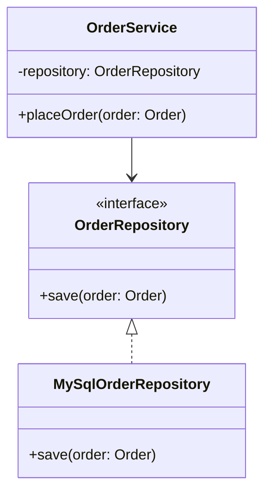

## The Two Numbers Behind Every "Good Design" Claim

When someone says a design is "clean" or "well-structured," what they usually mean, whether they
use the words or not, is: **low coupling, high cohesion.** Every principle in this series — SOLID,
every design pattern — is ultimately in service of these two properties.

- **Coupling** measures how much one class depends on the internal details of another.
  **Lower is better.**
- **Cohesion** measures how tightly related the responsibilities within a single class are.
  **Higher is better.**

## Coupling: How Entangled Are Your Classes?

**Tight coupling** means changing one class forces changes in another. Here's a tightly coupled
example:

```java
class OrderService {
    private MySqlOrderRepository repository = new MySqlOrderRepository();

    void placeOrder(Order order) {
        repository.save(order);
    }
}
```

`OrderService` is welded to `MySqlOrderRepository`. Switching to PostgreSQL, or writing a unit test
without a real database, requires editing `OrderService` itself. **Loose coupling** fixes this by
depending on an abstraction instead:

```java
interface OrderRepository {
    void save(Order order);
}

class OrderService {
    private final OrderRepository repository;

    OrderService(OrderRepository repository) { // injected, not constructed internally
        this.repository = repository;
    }

    void placeOrder(Order order) {
        repository.save(order);
    }
}
```

Now `OrderService` doesn't know or care whether it's talking to MySQL, Postgres, or an in-memory
fake used in tests. This is the **Dependency Inversion Principle** (Chapter 11) in action, and it's
the single most direct tool for reducing coupling.



## Cohesion: Does Everything in This Class Belong Together?

**Low cohesion** means a class does several unrelated things that happen to be grouped together for
no good reason:

```java
class UserManager {
    void createUser(String name) { }
    void sendWelcomeEmail(String email) { }
    void generateMonthlyRevenueReport() { }
    void backupDatabase() { }
}
```

`generateMonthlyRevenueReport()` and `backupDatabase()` have nothing to do with managing users —
this class has been used as a dumping ground. **High cohesion** means splitting responsibilities so
each class has one clear, focused job:

```java
class UserService {
    void createUser(String name) { }
}

class EmailNotifier {
    void sendWelcomeEmail(String email) { }
}

class RevenueReportGenerator {
    void generateMonthlyRevenueReport() { }
}

class DatabaseBackupService {
    void backupDatabase() { }
}
```

This is exactly what the **Single Responsibility Principle** (Chapter 7) formalizes — cohesion is
the property SRP is designed to maximize.

## Why Coupling and Cohesion Pull in the Same Direction

It's not a coincidence that high cohesion tends to produce low coupling. When each class has one
focused job, it needs to know less about other classes to do that job — and other classes need to
know less about it in return. Conversely, a low-cohesion "God class" (Chapter 2) tends to become
tightly coupled to everything, because it's doing everything.

| | High Cohesion | Low Cohesion |
|---|---|---|
| **Low Coupling** | The goal — focused classes, minimal dependencies | Rare — classes so simple there's little to depend on |
| **High Coupling** | Uncommon — focused class, but poorly abstracted dependencies | The worst case — a tangled, unfocused mess |

## A Quick Interview Heuristic

When reviewing your own design mid-interview, ask two questions per class:

1. **Cohesion check:** "Can I describe this class's job in one sentence, without using the word
   'and'?" If you need "and," it's probably doing too much.
2. **Coupling check:** "If I swapped out this class's dependency for a different implementation,
   how many other classes would I need to touch?" If the answer is more than the dependency's
   direct consumer, coupling is too tight.

## Summary

- **Coupling** = how entangled classes are with each other's internals. Aim low, via interfaces and
  dependency injection.
- **Cohesion** = how focused a single class's responsibilities are. Aim high, via the Single
  Responsibility Principle.
- High cohesion and low coupling reinforce each other — focused classes naturally depend on less.
- Use the "one sentence, no 'and'" test for cohesion and the "how many classes would I touch?" test
  for coupling, live in an interview, to self-correct your own design.

---

## Interview Questions

**1. Define coupling and cohesion, and explain why one should be minimized and the other
maximized.**
Coupling measures the degree of interdependency between classes — how much one class's internals
or existence a change in another class would affect. Cohesion measures how closely related the
responsibilities within a single class are. Low coupling is desirable because it means classes can
change, be tested, or be replaced independently, reducing ripple effects. High cohesion is
desirable because a class with one clear responsibility is easier to understand, test, and modify
correctly than one that mixes unrelated concerns.
*Follow-up: Can a system have low coupling but still be poorly designed overall?* Yes — if
individual classes are so trivially simple that there's little to couple to, but the overall
system lacks cohesion (responsibilities are scattered illogically across many tiny classes with no
clear organizing structure), the system can still be hard to navigate and maintain despite
technically low coupling numbers.

**2. Give a concrete example of tight coupling in Java code and show how to loosen it.**
`class OrderService { private MySqlOrderRepository repo = new MySqlOrderRepository(); }` tightly
couples `OrderService` to a specific database implementation — it can't be unit tested without a
real MySQL instance, and switching databases means editing `OrderService`. Loosening it means
depending on an `OrderRepository` interface and injecting the concrete implementation via the
constructor, so `OrderService` only knows about the contract, not the implementation.
*Follow-up: Does this pattern have a name?* Yes — this is **Dependency Injection**, typically
implementing the **Dependency Inversion Principle** (Chapter 11); frameworks like Spring automate
the "injection" part, but the underlying design principle is what actually reduces coupling.

**3. What is a "God class," and how does it violate both coupling and cohesion principles
simultaneously?**
A God class takes on many unrelated responsibilities (low cohesion) and, as a side effect, ends up
depending on — and being depended upon by — a huge number of other classes across the system (high
coupling), since everything routes through it. It violates cohesion because its responsibilities
don't share a single clear purpose, and it violates coupling because so many other parts of the
system have to know about its (bloated) API surface just to get anything done.
*Follow-up: How would you detect a God class without reading every line of it?* Practical signals
include: an unusually large number of fields or public methods, a class name ending in vague
suffixes like `Manager` or `Helper` with no more specific description, and a high number of
incoming and outgoing dependencies (import statements) relative to other classes in the codebase.

**4. Explain "afferent" and "efferent" coupling.**
Afferent coupling (incoming) is the number of other classes that depend on a given class — a high
number means many things would break if this class's public API changed. Efferent coupling
(outgoing) is the number of other classes a given class depends on — a high number means this
class is fragile to changes in many other places. A well-designed core abstraction (like a widely
used interface) often has high afferent coupling by design, but low efferent coupling is almost
always desirable for any class.
*Follow-up: Why is high afferent coupling sometimes acceptable, or even a sign of good design?* A
stable, well-designed interface (like `List` in Java) is *meant* to have very high afferent
coupling — many classes depend on it — precisely because it's abstract and stable, meaning changes
to it are rare and carefully managed; the risk of high coupling is proportional to how volatile the
depended-upon thing is, not the raw count of dependents.

**5. How does the Single Responsibility Principle relate to cohesion?**
SRP states a class should have only one reason to change — which is, in effect, a formal definition
of high cohesion. A class with high cohesion naturally has one reason to change, because all its
responsibilities are tightly related and driven by the same underlying concern. A class with low
cohesion (like the `UserManager` example mixing user creation, email, and reporting) has multiple,
unrelated reasons to change, directly violating SRP.
*Follow-up: Can you have a class that satisfies SRP but still has low cohesion by some other
measure?* This is unlikely by definition — SRP and cohesion are essentially the same underlying
idea expressed at different levels of formality, so a genuine SRP violation is, almost by
definition, also a cohesion problem.

**6. What is "temporal coupling," and how does it differ from the structural coupling discussed
so far?**
Temporal coupling occurs when methods must be called in a specific order for the code to work
correctly, even though nothing in the API signature enforces that order — e.g., calling
`connection.open()` before `connection.query()`, where calling `query()` first silently fails or
throws at runtime rather than being prevented at compile time. It's a coupling problem about
*sequence*, not about class dependencies, and it's dangerous because it's invisible until runtime.
*Follow-up: How can you design an API to prevent temporal coupling?* Use patterns that make the
correct sequence unrepresentable — for example, the **Builder pattern** (Chapter 19) that only
exposes a `build()` method once all required fields are set, or returning a different type from
`open()` that is the only type `query()` accepts, so the compiler enforces the ordering.

**7. Is zero coupling between any two classes in a system achievable or even desirable?**
No — zero coupling would mean classes never interact at all, which would make it impossible to
build any working system, since some collaboration between objects is inherent to solving real
problems. The goal isn't eliminating coupling but minimizing *unnecessary* or *tight* coupling —
depending on stable abstractions (interfaces) rather than volatile concrete implementations, so
that the coupling that does exist is as loose and change-resistant as possible.
*Follow-up: How would you describe the difference between "necessary" coupling and "accidental"
coupling in an interview?* Necessary coupling reflects a genuine collaboration the domain requires
(an `OrderService` must interact with some form of `OrderRepository` to persist orders — that
dependency is unavoidable). Accidental coupling is coupling to unnecessary implementation details of
that dependency (knowing it's specifically a MySQL repository, or reaching into its internal SQL
query logic) that could have been hidden behind an abstraction.

**8. Can a single class have too much cohesion — is "cohesion" always purely good with no
downside?**
In practice, the risk isn't "too much cohesion" per se, but conflating cohesion with taking SRP to
an extreme, producing an excessive number of tiny classes each with a trivial single method, which
can actually hurt readability by scattering closely-related logic across too many files and forcing
readers to jump between many classes to understand one flow. The goal is a *meaningful* single
responsibility at an appropriate level of granularity, not the smallest possible class size.
*Follow-up: How do you judge the "right" granularity for a class's responsibility in an
interview?* A reasonable heuristic: a responsibility is appropriately scoped if it corresponds to a
single, stable business or technical concern that changes for one reason (e.g., "how fees are
calculated" or "how notifications are sent") — if splitting further would only separate steps of
what's fundamentally one cohesive process, it's likely over-split.

**9. How does depending on concrete classes instead of interfaces increase testing difficulty,
concretely?**
If `OrderService` directly instantiates `MySqlOrderRepository` internally, a unit test for
`OrderService`'s business logic (e.g., validating an order before saving) has no way to substitute
a fake or in-memory repository — it's forced to either run against a real database (slow, flaky,
requires setup) or use complex bytecode-manipulation mocking tools to intercept the `new` call. If
`OrderService` instead depends on an `OrderRepository` interface injected via constructor, the test
simply passes in a lightweight fake implementation with zero database dependency, making the test
fast, isolated, and reliable.
*Follow-up: Does this justify introducing interfaces purely for testability, even with only one
real implementation in production?* Yes, this is one of the most common legitimate exceptions to
"don't add interfaces you don't need yet" (Chapter 3, Question 5) — testability is a present,
concrete need, not a speculative future one.

**10. What's the relationship between coupling/cohesion and microservice boundaries in a larger
system (briefly, connecting back to HLD)?**
The same principles apply at a larger scale: a well-designed microservice boundary should have high
internal cohesion (everything inside the service is tightly related to one business capability) and
low external coupling (services communicate through small, stable APIs/contracts rather than
sharing internal database schemas or implementation details). A poorly-drawn service boundary that
splits one cohesive business process across two services, forcing constant synchronous
cross-service calls, is the distributed-systems version of a low-cohesion, high-coupling class.
*Follow-up: Does this mean LLD skills transfer directly to HLD service-boundary decisions?* To a
meaningful degree, yes — the underlying judgment of "what belongs together" and "what should be
decoupled" is the same skill applied at different scales, which is part of why strong LLD
instincts tend to correlate with better microservice boundary decisions in HLD interviews too.

**11. How would you refactor a class you suspect has low cohesion, step by step, during an
interview?**
First, list out every public method and field, and group them by which underlying concern or piece
of state they touch. If two or more groups share no fields and serve unrelated purposes (as with
`UserManager`'s user creation vs. revenue reporting), extract each group into its own class with a
name describing its single purpose, then wire the original class to delegate to the new ones via
composition rather than trying to preserve a single monolithic class.
*Follow-up: What if two groups of methods share one field, making a clean split awkward?* That
shared field is often the real signal for where the split boundary should actually be — investigate
whether the field itself represents two different concerns bundled together (e.g., a single
`status` field that's overloaded to mean both "order status" and "payment status"), and split the
field along with the methods if so.

**12. Why does dependency injection reduce coupling, and does using a DI framework (like Spring)
change the underlying principle at all?**
Dependency injection reduces coupling by moving the responsibility of *creating* a dependency
outside the class that *uses* it — the consuming class only needs to know the dependency's
interface, not how to construct a concrete instance of it. A DI framework like Spring automates the
wiring (deciding which concrete implementation to inject and constructing the object graph) but
doesn't change the underlying principle at all — you get the same coupling reduction with plain
manual constructor injection and no framework whatsoever; frameworks are a convenience for large
applications with many dependencies, not a requirement for the principle to apply.
*Follow-up: Is constructor injection preferred over field injection (e.g., Spring's
`@Autowired` on a field) for coupling reasons?* Yes — constructor injection makes dependencies
explicit and required at object-creation time (and enables using `final` fields, preventing
reassignment), and it makes classes trivially testable without a DI framework at all, since you can
just call the constructor directly with fakes in a plain unit test; field injection hides
dependencies and often requires a framework or reflection just to set up a test.

**13. In an LLD interview, how do you demonstrate awareness of coupling/cohesion without
explicitly using those exact words the whole time?**
Narrate design decisions in terms of their concrete consequences: "I'm putting fee calculation
behind this `FeeStrategy` interface so `ParkingLot` doesn't need to change when we add a new
pricing model" (demonstrates low coupling) and "I'm keeping `Ticket` focused purely on
representing ticket data and moving fee logic elsewhere, since fee rules and ticket representation
change for different reasons" (demonstrates high cohesion). Interviewers are listening for this
reasoning pattern more than for the vocabulary itself.
*Follow-up: Is it ever appropriate to explicitly name-drop "SOLID" or "coupling and cohesion" in an
interview?* It's fine and often useful shorthand once you've already demonstrated the reasoning
concretely — naming the principle after showing the reasoning reinforces that you know the
established theory behind your intuition, rather than replacing the reasoning with a buzzword.

**14. Can two classes be tightly coupled to each other even if neither one directly extends or
implements the other?**
Yes — coupling isn't limited to inheritance relationships. Two classes that call each other's
public methods extensively, share detailed knowledge of each other's internal state (even through
public getters), or depend on a specific sequence of interactions between them (temporal coupling)
can be just as tightly, or more tightly, coupled than a parent-child class pair. Circular
dependencies, where `ClassA` depends on `ClassB` and `ClassB` depends back on `ClassA`, are a
particularly severe form of this and often indicate a missing abstraction that should mediate
between them.
*Follow-up: How would you break a circular dependency between two classes in an LLD design?*
Introduce a third class or interface that both `ClassA` and `ClassB` depend on instead of depending
on each other directly (often resembling the **Mediator pattern**, Chapter 35), or re-examine
whether the two classes' responsibilities should actually be merged or restructured, since a
circular dependency frequently signals the responsibility boundary was drawn incorrectly in the
first place.
