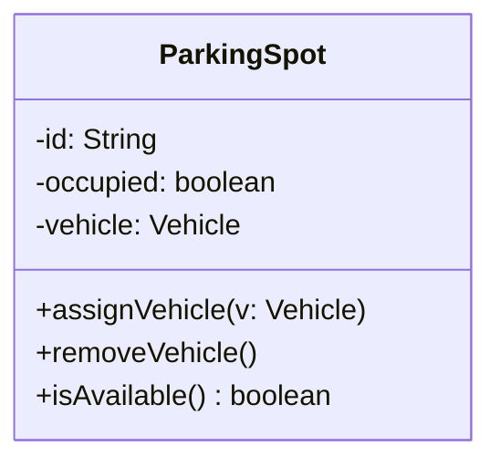
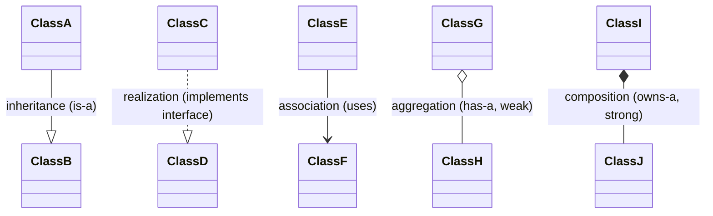
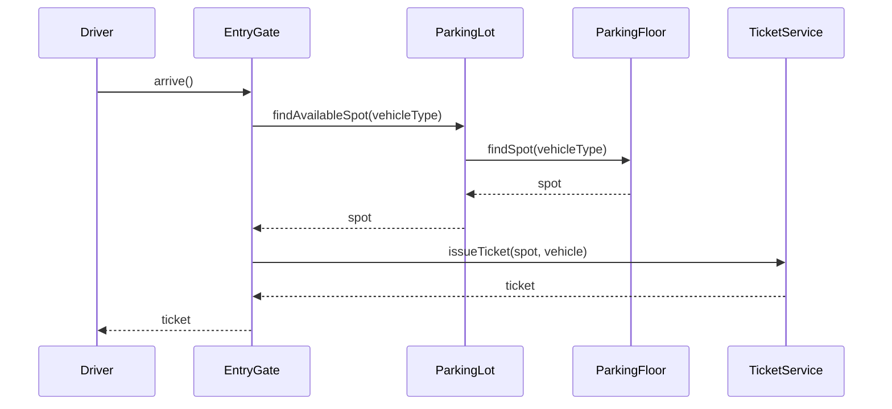
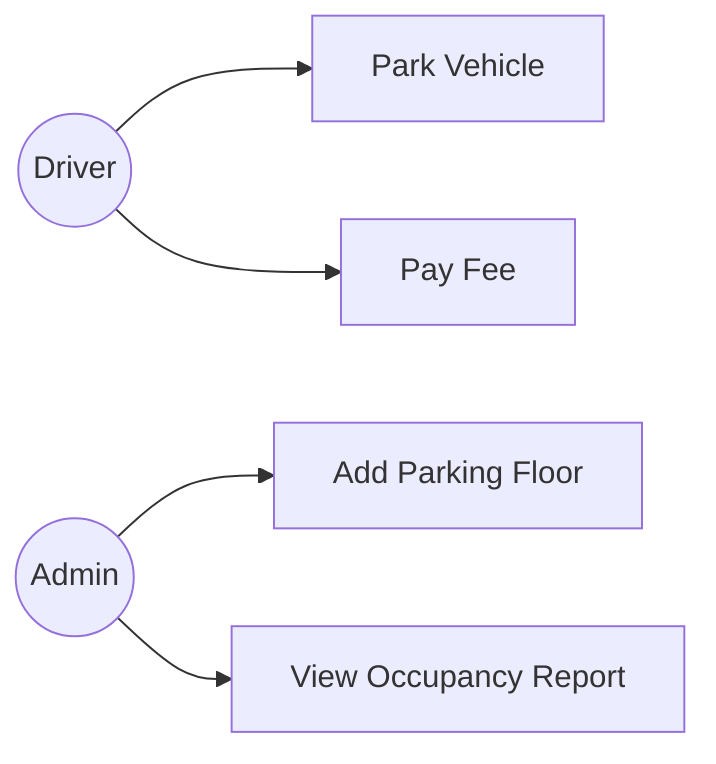

## You Don't Need All of UML — Just Three Diagram Types

UML (Unified Modeling Language) has 14 official diagram types. LLD interviews use exactly three,
and knowing them well matters far more than knowing all 14 shallowly:

1. **Class diagrams** — the static structure: classes, their fields/methods, and relationships.
2. **Sequence diagrams** — the dynamic behavior: which objects call which methods, in what order,
   for one specific scenario.
3. **Use-case diagrams** — the actors and the actions they can perform (used briefly, mostly during
   requirement clarification).

This series draws all diagrams in **Mermaid** syntax, which every chapter from here on will use —
this chapter is your reference for reading them.

## Class Diagrams

A class diagram box has three sections: class name, fields, methods.

Visibility symbols (borrowed from Java access modifiers):

| Symbol | Meaning |
|---|---|
| `+` | public |
| `-` | private |
| `#` | protected |
| `~` | package-private |

**Relationship arrows** — the ones you'll see constantly in this series:

- **Inheritance** (solid line, hollow triangle) — `Car --|> Vehicle`
- **Realization** (dashed line, hollow triangle) — `Car ..|> Payable` (implementing an interface)
- **Association** (solid line, arrow) — general "uses" relationship
- **Aggregation** (hollow diamond) and **Composition** (filled diamond) — from Chapter 4

## Sequence Diagrams

While a class diagram shows *structure*, a sequence diagram shows *one specific flow through
time* — exactly which method gets called on which object, in order. This is invaluable for
verifying your design actually works for a tricky scenario before you write a line of code.

Here's the flow for a vehicle entering a parking lot and getting a ticket:

Notice how this immediately surfaces a design question: does `EntryGate` talk to `ParkingLot`
directly, or does `ParkingLot` delegate to `ParkingFloor`? Drawing this out *before* coding forces
you to decide who's responsible for what — exactly the kind of decision an interviewer wants to see
you make deliberately, not accidentally.

## Use-Case Diagrams

Use-case diagrams are the simplest of the three and are mostly useful during the requirement
clarification phase (Chapter 41) to confirm you and the interviewer agree on scope.

*(Mermaid doesn't have a dedicated use-case diagram type, so a flowchart with actors as circles and
actions as boxes is the common substitute — this is what you'd sketch by hand on a whiteboard too.)*

## When to Draw Which Diagram in a 45-Minute Interview

A realistic time allocation:

1. **Use-case sketch (optional, 2 min)** — only if requirements are genuinely ambiguous and a
   quick visual helps confirm scope with the interviewer.
2. **Class diagram (10–15 min)** — this is where most of your design thinking happens. Draw it,
   narrate it, and revise it live as the interviewer asks questions.
3. **Sequence diagram (5–10 min, for 1–2 key flows only)** — pick the trickiest or most
   important flow (not every possible flow) to verify your class diagram actually holds together.
4. **Code (15–20 min)** — implement the core classes, focusing on the parts with real logic.

Don't try to draw a complete, exhaustive UML diagram for every single class and flow — that's a
losing time trade against actually writing code, which is usually weighted more heavily.

## Summary

- You need three UML diagram types for LLD interviews: class, sequence, and (occasionally)
  use-case diagrams.
- Class diagrams show static structure — classes, fields, methods, and the four relationship types
  from Chapter 4.
- Sequence diagrams show one specific flow through time and are excellent for catching design gaps
  before coding.
- Budget your interview time — class diagram first, one or two sequence diagrams for the trickiest
  flows, then code; don't over-invest in exhaustive diagramming.

---

## Interview Questions

**1. What are the three UML diagram types most relevant to LLD interviews, and what does each
one show?**
Class diagrams show static structure: classes, their fields, methods, and relationships to other
classes. Sequence diagrams show dynamic behavior: the exact order of method calls between objects
for one specific scenario. Use-case diagrams show actors (users/systems) and the actions
(use cases) available to them, mostly useful for confirming scope during requirement gathering.
*Follow-up: Which of the three would you draw first in an interview, and why?* Typically a class
diagram, since it establishes the structural skeleton everything else builds on — sequence
diagrams are then used to verify that skeleton actually supports the key flows correctly.

**2. What do the four visibility symbols (`+`, `-`, `#`, `~`) mean in a UML class diagram?**
`+` denotes public visibility, `-` denotes private, `#` denotes protected, and `~` denotes
package-private (default) visibility — these map directly onto Java's access modifier keywords, so
a UML class diagram can communicate the same access control decisions you'd write in actual Java
code.
*Follow-up: Why does visibility matter enough to include in a design diagram rather than deciding
it later while coding?* Because access control decisions are design decisions — deciding a field
should be private and only mutable through a validating method (Chapter 2's encapsulation
discussion) is part of protecting invariants, and stating it explicitly in the diagram forces you to
make that call deliberately rather than defaulting everything to public out of laziness.

**3. Explain the visual difference between inheritance and realization (interface
implementation) arrows in UML, and why they're distinguished at all.**
Both use a hollow (unfilled) triangle arrowhead pointing at the parent/interface, but inheritance
uses a solid line (`--|>`) while realization uses a dashed line (`..|>`). They're distinguished
because they represent different relationships in Java: `extends` (inheritance, sharing
implementation) versus `implements` (realization, fulfilling a contract with no shared
implementation) — exactly the distinction covered in Chapter 3.
*Follow-up: How would you draw a class that both extends an abstract class and implements an
interface?* You'd draw two separate arrows from that class: a solid line with hollow triangle to
the abstract class (inheritance) and a dashed line with hollow triangle to the interface
(realization) — both arrows can originate from the same class box simultaneously.

**4. What's the difference between aggregation and composition arrows in a class diagram, and
how does this connect to Chapter 4?**
Aggregation is drawn with a hollow (unfilled) diamond at the "whole" end of the line; composition
is drawn with a filled (solid) diamond at the "whole" end. This is the exact visual encoding of the
weak-ownership-versus-strong-ownership distinction from Chapter 4 — a hollow diamond signals "the
part can outlive the whole," a filled diamond signals "the part's lifecycle is bound to the whole."
*Follow-up: If you forget which diamond is which mid-interview, how could you avoid drawing it
incorrectly?* Rather than risk drawing the wrong diamond, you can state the relationship verbally
("this is a strong ownership — composition") while drawing a plain line, or use Mermaid/text
notation explicitly, since correctly *reasoning about* the lifecycle relationship matters far more
to an interviewer than perfectly recalling which diamond fill corresponds to which term.

**5. Why are sequence diagrams useful for catching design bugs before you write any code?**
A class diagram can look complete and elegant while still hiding a gap — for example, no object in
the diagram is actually responsible for finding an available parking spot across multiple floors.
Walking through a concrete sequence diagram forces you to trace an actual call path step by step,
which surfaces missing responsibilities, ambiguous method ownership, or awkward call chains (like
one object needing to reach three levels deep into another's internals) that a static class diagram
alone doesn't reveal.
*Follow-up: What's a common design flaw that only becomes visible in a sequence diagram, not a
class diagram?* Excessive "message chains" — where `A` calls `B`, which calls `C`, which calls
`D` just to get one piece of data back to `A` — become visually obvious as a long, snaking sequence
diagram, whereas the class diagram might show clean, individually-reasonable associations between
each adjacent pair.

**6. In a sequence diagram, what's the difference between a solid arrow and a dashed arrow?**
A solid arrow (`->>`) represents a synchronous method call/request from one participant to
another. A dashed arrow (`-->>`) represents the return value or response flowing back. This
distinction matters because it shows not just "who calls whom" but the full round-trip of a
request-response interaction, which is important for spotting unnecessary back-and-forth calls or
confirming a method actually needs to return a value at all.
*Follow-up: How would you represent an asynchronous call (fire-and-forget, no waiting for a
response) differently in a sequence diagram?* Asynchronous calls are typically drawn with an open
(unfilled) arrowhead rather than the solid filled arrowhead used for synchronous calls, signaling
that the caller doesn't block waiting for a response — though this distinction is rarely critical in
LLD interviews, since LLD problems are mostly single-threaded/synchronous in scope, unlike HLD.

**7. When would you use a use-case diagram in an LLD interview, and when would you skip it
entirely?**
Use it briefly (2 minutes or less) when the problem statement is genuinely ambiguous about scope
and a quick visual of "here are the actors and the actions I understand we need to support" helps
confirm alignment with the interviewer before you invest time in a full class diagram. Skip it
entirely when the problem statement already clearly enumerates the required actions, since drawing
a use-case diagram for an already-unambiguous scope just burns limited interview time without adding
clarity.
*Follow-up: Could a use-case diagram replace the verbal requirement-clarification conversation
covered in Chapter 41?* No — a use-case diagram is a *summary* of what's already been clarified
verbally, not a substitute for asking clarifying questions; drawing one without first having that
conversation risks locking in incorrect assumptions about scope.

**8. Why does this series recommend spending most of interview time on the class diagram rather
than an exhaustive, fully-detailed UML diagram covering every class and every flow?**
Because interview time is scarce (typically 45–60 minutes total), and the class diagram is what
establishes the core structural decisions an interviewer evaluates most heavily — writing actual,
working code that implements that structure is usually weighted at least as heavily as the diagram
itself. Spending 20+ minutes perfecting an exhaustive diagram with every method signature and every
possible flow leaves too little time to demonstrate you can translate the design into real Java.
*Follow-up: How would you signal to an interviewer that you're intentionally keeping the diagram
lightweight rather than being sloppy?* Narrate the trade-off explicitly: "I'll sketch the core
classes and relationships now, and we can dive into the specific method logic as we write the code,
so we have time for both the design and the implementation."

**9. What is a "message chain" in the context of sequence diagrams, and why is it considered a
code smell?**
A message chain is a sequence of calls where an object reaches through another object to get to yet
another (e.g., `orderService.getCustomer().getAddress().getZipCode()`), which tightly couples the
caller to the entire internal structure of the objects it's chaining through — if any intermediate
object's internal structure changes, the caller breaks even though it never directly depended on
that intermediate structure by design.
*Follow-up: What principle or technique addresses message chains directly?* The **Law of Demeter**
("only talk to your immediate friends," Chapter 13) directly addresses this — it suggests exposing
a method like `orderService.getCustomerZipCode()` instead, so the caller depends on one clear
contract rather than the transitive internal structure of three chained objects.

**10. How would you represent multiplicity (like "one parking floor has many parking spots") in
a UML class diagram?**
Multiplicity is written as a number or range near each end of the relationship line — for example,
`ParkingFloor "1" *-- "many" ParkingSpot` indicates one `ParkingFloor` is composed of many
`ParkingSpot` instances. Common multiplicity notations include `1` (exactly one), `0..1` (zero or
one), `0..*` or `*` (zero or many), and `1..*` (one or many).
*Follow-up: Why does multiplicity matter for the actual Java code, not just the diagram?* It
directly determines whether a field should be a single reference (`ParkingFloor floor`) or a
collection (`List<ParkingSpot> spots`), and whether that collection can legitimately be empty,
which affects null-safety and validation logic you need to write.

**11. Can Mermaid (the tool used throughout this series) represent every UML diagram type and
notation, or are there limitations?**
Mermaid supports class diagrams and sequence diagrams quite faithfully, including most
relationship arrows and multiplicity notation, and is well-suited to activity/flow diagrams as a
substitute for formal use-case diagrams. However, it doesn't have a dedicated use-case diagram
syntax (hence the flowchart substitution shown in this chapter) and lacks some of the more obscure,
rarely-used UML notations (like full OCL constraints) — none of which matter for LLD interview
purposes, since those advanced notations are essentially never expected in a live interview anyway.
*Follow-up: Is it acceptable to draw diagrams by hand on a physical/virtual whiteboard instead of
using formal notation like Mermaid during an actual interview?* Yes, completely — most real
interviews happen on a shared whiteboard tool or literal whiteboard, where hand-drawn boxes and
arrows with clear labels are entirely sufficient; strict UML notation compliance is not what's
being evaluated, clear communication of the design is.

**12. Why might an interviewer ask you to draw a sequence diagram for a specific edge case (like
"what happens if two drivers try to claim the last parking spot simultaneously") rather than the
happy path?**
Because the happy-path sequence is usually the easy part — the edge case reveals whether you've
actually thought about concurrency, race conditions, or failure handling, which is where real
system bugs live. A sequence diagram for this specific scenario would need to show where
locking or atomic operations occur (e.g., around the "find and reserve a spot" step) to prevent both
drivers from being assigned the same spot.
*Follow-up: How would your sequence diagram change to show a race condition being properly
handled?* You'd show the `ParkingFloor.findAndReserveSpot()` call as a single atomic operation
(perhaps annotated as synchronized or using a lock) rather than two separate `findSpot()` and
`reserveSpot()` calls, since splitting "find" and "reserve" into two steps is exactly what allows
the race condition to occur in the first place.

**13. What's the difference between a "participant" in a sequence diagram and a "class" in a
class diagram — are they always the same thing?**
Usually yes — participants in a sequence diagram typically correspond to objects/instances of
classes from your class diagram, and the calls between them mirror the methods defined on those
classes. However, a sequence diagram can also include external actors (like a human "Driver") or
external systems (like a "PaymentGateway") that aren't necessarily classes you're designing
yourself, just entities the system interacts with.
*Follow-up: Should every class in your class diagram also appear in every sequence diagram you
draw?* No — a sequence diagram typically focuses on the specific classes involved in one particular
flow; simple data classes with no behavior (like a plain `Ticket` value object with just getters)
often don't appear as active participants making calls, even though they appear as data passed
between the participants that do.

**14. If you're running low on time in an interview, which UML diagram would you sacrifice
first, and why?**
The use-case diagram, since it's the least essential of the three — it mainly supports the
requirement-clarification conversation, which can happen verbally without a formal diagram. Between
class and sequence diagrams, you'd keep the class diagram (it's the structural foundation you need
regardless) and trim the sequence diagram down to just one critical flow, or skip it in favor of
directly writing code if time is extremely tight, since demonstrating working code is usually the
higher-priority deliverable.
*Follow-up: Is it ever better to skip diagramming almost entirely and go straight to code?* Only
for very simple, well-understood problems where the class structure is genuinely obvious from the
problem statement — for anything with more than 3–4 classes or non-trivial relationships, skipping
diagramming usually costs more time in the long run through mid-coding restructuring than it
saves upfront.
