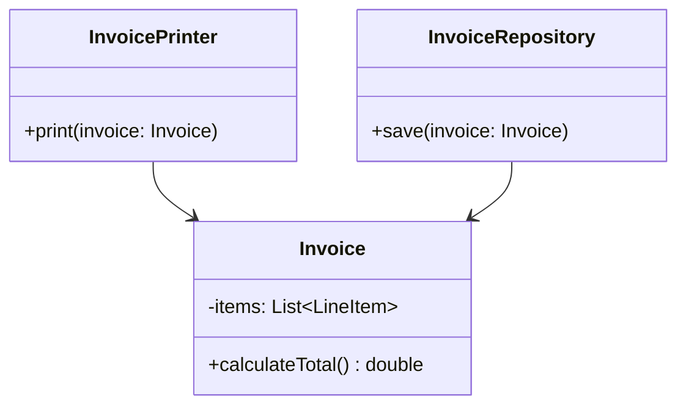

## Meet SOLID

Over the next eight chapters, we cover the five SOLID principles plus three closely related
guidelines (DRY, KISS, YAGNI, Law of Demeter). These aren't abstract theory — they're the concrete
rules that Chapter 5's "low coupling, high cohesion" goal breaks down into.

**S**ingle Responsibility · **O**pen/Closed · **L**iskov Substitution · **I**nterface Segregation ·
**D**ependency Inversion

We start with the "S" because it underpins the rest — a class that violates SRP will almost always
end up violating the others too.

## The Principle

> **A class should have only one reason to change.**

Not "a class should only have one method" — that's a common misreading. It means every piece of
logic inside a class should be driven by the same underlying business or technical concern, so a
change request always maps to exactly one class, not several.

## A Violation, Step by Step

```java
class Invoice {
    private List<LineItem> items;

    double calculateTotal() {
        return items.stream().mapToDouble(LineItem::getPrice).sum();
    }

    void printInvoice() {
        System.out.println("Invoice Total: " + calculateTotal());
        // formatting logic for console output
    }

    void saveToDatabase() {
        // JDBC / persistence logic
    }
}
```

This class has **three** reasons to change:

1. The business rule for calculating totals changes (e.g., adding tax logic).
2. The presentation format changes (e.g., switching from console to PDF output).
3. The persistence mechanism changes (e.g., switching from JDBC to JPA).

These three concerns are owned by different people on most real teams — a change to invoice
formatting shouldn't require touching, retesting, or risking the persistence code.

## The Fix

```java
class Invoice {
    private List<LineItem> items;

    double calculateTotal() {
        return items.stream().mapToDouble(LineItem::getPrice).sum();
    }
}

class InvoicePrinter {
    void print(Invoice invoice) {
        System.out.println("Invoice Total: " + invoice.calculateTotal());
    }
}

class InvoiceRepository {
    void save(Invoice invoice) {
        // persistence logic
    }
}
```

Now `Invoice` has exactly one reason to change: the rules for what an invoice *is* and how its
total is calculated. Presentation and persistence are separate concerns, owned by separate classes.



## The "One Sentence, No 'And'" Test

From Chapter 5: describe the class's job in one sentence without the word "and." If you find
yourself saying "this class calculates the invoice total **and** prints it **and** saves it," you've
just diagnosed the SRP violation out loud.

## A Common Misapplication: Splitting Too Aggressively

SRP doesn't mean every method needs its own class. `calculateTotal()` and a hypothetical
`applyDiscount()` method both belong on `Invoice` — they're both genuinely about "what an invoice's
total is," just two facets of the same responsibility. Splitting those into `TotalCalculator` and
`DiscountApplier` classes would be over-engineering; there's no real, distinct reason either would
change independently of the other.

**The test isn't "does this class have more than one method?"** — it's "do these methods represent
genuinely separate, independently-changing concerns?"

## Summary

- SRP: a class should have exactly one reason to change.
- Violations usually look like a class mixing business logic with formatting, persistence, or
  notification concerns.
- Use the "one sentence, no 'and'" test from Chapter 5 to catch violations while you're designing.
- Don't over-apply SRP by splitting genuinely related behavior into artificially separate classes —
  the test is "independent reasons to change," not "number of methods."

---

## Interview Questions

**1. State the Single Responsibility Principle precisely, and explain the common
misunderstanding around it.**
SRP states a class should have only one reason to change — one specific business or technical
concern that drives all of its behavior. The common misunderstanding is reading this as "a class
should only do one thing" in a literal, narrow sense (e.g., only have one method), when it actually
refers to having one *axis of change*, which can legitimately involve multiple related methods as
long as they'd all change together for the same underlying reason.
*Follow-up: Give an example of a class with multiple methods that still satisfies SRP.* A `Stack`
class with `push()`, `pop()`, and `peek()` has multiple methods, but all of them exist for the same
single reason — implementing stack behavior — so it fully satisfies SRP despite not being a
single-method class.

**2. Walk through identifying an SRP violation in the `Invoice` example and explain the fix.**
The original `Invoice` class mixed total calculation, console printing, and database persistence —
three concerns that change independently (business rules, presentation format, storage mechanism)
and are typically owned by different parts of a codebase or even different teams. The fix extracts
`InvoicePrinter` and `InvoiceRepository` as separate classes, leaving `Invoice` responsible only for
representing invoice data and calculating totals — each extracted class now depends on `Invoice`,
not the other way around.
*Follow-up: After this refactor, does `Invoice` need to know about `InvoicePrinter` or
`InvoiceRepository`?* No — and it shouldn't. The dependency direction runs one way: the printer and
repository depend on `Invoice`'s public data, but `Invoice` itself has zero knowledge that printing
or persistence even exist, which is exactly what keeps its one responsibility clean.

**3. Why is SRP often described as the foundation the other SOLID principles build on?**
A class that already violates SRP (mixing unrelated concerns) tends to also violate the Open/Closed
Principle (a change to one concern risks breaking the others bundled into the same class) and often
ends up violating Interface Segregation too (a bloated class's interface forces callers to depend on
methods irrelevant to their needs). Fixing SRP first — splitting responsibilities into focused
classes — often resolves or significantly simplifies the remaining SOLID violations as a natural
side effect.
*Follow-up: Can you have a class that satisfies SRP but violates the Open/Closed Principle?*
Yes — a class can have a single, well-defined responsibility (say, calculating shipping cost) while
still being implemented with a rigid `if/else` chain over shipping methods that requires
modification (not extension) every time a new shipping method is added; SRP and OCP address
different dimensions of design quality.

**4. How do you avoid over-applying SRP and splitting a class too aggressively?**
Apply the test of whether two pieces of behavior represent genuinely independent reasons to
change, not simply whether they're distinct pieces of logic. If `calculateTotal()` and
`applyDiscount()` on an `Invoice` would always need to change together whenever the business rules
around pricing change, they belong in the same class — splitting them into `TotalCalculator` and
`DiscountApplier` for no reason beyond method-count aesthetics adds indirection without any real
independent-change benefit.
*Follow-up: What's a practical cost of over-splitting responsibilities?* Excessive fragmentation
forces readers to jump across many small files to understand a single cohesive flow, and increases
the surface area of wiring code (constructors, dependency injection) needed just to assemble
objects that are always used together anyway.

**5. In a layered application (controller, service, repository), where does SRP typically
manifest as a design pattern you'd recognize?**
This layering itself is essentially SRP applied at an architectural level: the controller's
responsibility is handling HTTP request/response concerns, the service's responsibility is business
logic, and the repository's responsibility is persistence — each layer changes for a different
reason (API contract changes, business rule changes, database schema changes, respectively). A
controller directly containing SQL queries, or a repository containing business validation logic,
would be an SRP violation at this architectural scale.
*Follow-up: Does the Spring Boot `@Service`/`@Repository`/`@Controller` stereotype convention
enforce SRP, or just suggest it?* It only suggests it — Spring's annotations are organizational
hints for dependency injection and don't prevent a developer from putting business logic inside a
`@Repository`-annotated class; enforcing the actual separation of concerns still depends on the
developer's discipline, not the framework.

**6. Can two different classes both legitimately have "invoice-related" responsibilities without
violating SRP?**
Yes — `Invoice` (representing data and core calculations) and `InvoiceRepository` (persisting that
data) are both "invoice-related" in a loose sense, but they have different, independent reasons to
change: business rules for `Invoice` versus the storage mechanism for `InvoiceRepository`. SRP is
about the *reason for change* within a single class, not about eliminating all topical overlap
between classes that legitimately collaborate.
*Follow-up: How would you explain this distinction to someone who thinks SRP means "one class per
noun in the domain"?* SRP isn't about noun-counting — it's entirely possible, and often correct, to
have multiple classes centered around the same domain noun (`Invoice`, `InvoiceRepository`,
`InvoicePrinter`) as long as each one has its own single, independent axis of change; the domain
noun is a shared *subject*, not a shared *responsibility*.

**7. How would unit testing become harder for a class that violates SRP, using the original
`Invoice` example?**
A test for `calculateTotal()`'s business logic might be forced to also deal with side effects from
`saveToDatabase()` if they're entangled (e.g., through shared state or accidental coupling), or the
test suite for total-calculation logic might need database mocking infrastructure set up just
because it happens to live in the same class as persistence code. After the SRP fix, testing
`Invoice.calculateTotal()` requires zero database or console-output setup at all, since those
concerns are now in entirely separate classes.
*Follow-up: Does splitting responsibilities always reduce total test-suite complexity, or can it
sometimes increase it?* It generally reduces per-class test complexity and increases isolation, but
it can slightly increase the *number* of test files and some integration-level tests may still be
needed to verify the separated pieces correctly collaborate — the trade is fewer entangled unit
tests in exchange for a few more integration tests, which is almost always a net win for
maintainability.

**8. Is SRP violated if a class has private helper methods that support its single public
responsibility?**
No — private helper methods that exist solely to support and are only called in service of the
class's one public responsibility don't count as separate responsibilities; they're implementation
details of the single responsibility, not independent concerns. For example, `Invoice` could have a
private `roundToTwoDecimals()` helper used only inside `calculateTotal()` without violating SRP at
all.
*Follow-up: At what point does a "private helper" become a signal that a new responsibility, and
thus a new class, should be extracted?* When that helper method starts being useful or relevant to
more than one distinct responsibility (e.g., other unrelated classes also need to round currency
values), or when it grows complex enough to need its own independent testing and reasoning — at
that point it often deserves promotion to its own utility class.

**9. How does SRP relate to the "God class" anti-pattern discussed in Chapter 2?**
A God class is essentially the most extreme, cumulative violation of SRP — instead of mixing two or
three concerns like the original `Invoice` example, it mixes many, often a dozen or more unrelated
responsibilities, into one massive class. SRP is the principle whose repeated violation, left
unchecked over time as a codebase grows, produces a God class.
*Follow-up: If you inherited a God class in a real (non-interview) codebase, would you refactor it
all at once or incrementally, and why?* Incrementally, in most real production contexts — extracting
one clearly-separable responsibility at a time (with tests verifying behavior is preserved at each
step) is far lower-risk than a single large rewrite, which risks introducing regressions across
many entangled concerns simultaneously without adequate test coverage to catch them.

**10. Give an example of applying SRP to a `ParkingLot` class from the case studies covered
later in this series.**
A naive `ParkingLot` class might handle finding available spots, calculating parking fees,
processing payments, and printing tickets all in one place. Applying SRP splits this into
`ParkingLot` (managing spot allocation), a `FeeCalculator` or `FeeStrategy` (Chapter 28) for pricing
logic, a `PaymentProcessor` for handling payment, and a `TicketPrinter` for output formatting — each
with one clear, independently-changeable responsibility.
*Follow-up: Which of these responsibilities would you expect to change most frequently in a real
parking lot business, and how does SRP help accommodate that?* Fee calculation logic (pricing
promotions, new vehicle categories, weekend rates) tends to change most often in practice — SRP
ensures those frequent changes are isolated to the `FeeStrategy` implementation, with zero risk of
accidentally breaking spot allocation or ticket printing logic in the process.

**11. Does SRP apply only to classes, or can it apply to methods and packages/modules too?**
The core idea — "one reason to change" — scales to any unit of code organization. A method should
ideally do one clear thing (a method that both validates input and mutates unrelated state has too
many reasons to change). A package or module should ideally represent one cohesive area of
functionality, not an arbitrary grouping of unrelated classes. SRP is most commonly discussed at
the class level, but the underlying discipline is fractal across all levels of code organization.
*Follow-up: How would you recognize an SRP violation at the package level in a real project?* A
package named something generic like `util` or `common` that accumulates dozens of unrelated
classes over time (date formatting helpers next to database connection pooling next to email
templates) is a classic package-level SRP violation — a "God package" mirroring the God class
anti-pattern.

**12. How would you defend, in an interview, a design decision to keep two pieces of logic in the
same class when the interviewer suggests splitting them for SRP reasons?**
Argue from the "independent reason to change" test directly: explain specifically why the two
pieces of logic would always need to be modified together in response to the same kind of business
or technical change, and that splitting them would only add indirection (extra classes, extra
wiring) without buying any real independent-evolution benefit. Concrete reasoning beats reciting
"SRP" as a rule — show the specific scenario where keeping them together is actually the more
maintainable choice.
*Follow-up: What if the interviewer still disagrees after your reasoning?* Acknowledge the
trade-off explicitly ("I see the argument for splitting it if requirement X changes independently in
the future — that's a fair point, and I'd lean toward splitting if that's an expected direction of
change") — LLD interviews often reward demonstrating you understand the trade-off exists, even if
your initial call differs from the interviewer's preference.

**13. Can following SRP too rigidly ever conflict with the DRY principle (Chapter 12)?**
Yes, in edge cases — if splitting a class strictly along SRP lines results in near-identical
logic being duplicated across the newly separated classes (because the "separate" concerns actually
shared common sub-logic), you can end up violating DRY in service of SRP. The resolution is usually
to extract the shared sub-logic into its own small, focused component that both SRP-compliant
classes depend on, satisfying both principles simultaneously rather than sacrificing one for the
other.
*Follow-up: Give a concrete example of this tension.* If `InvoicePrinter` and an `InvoiceEmailer`
class both need to format a line item into a display string, duplicating that formatting logic in
both classes to preserve strict separation would violate DRY — extracting a shared
`LineItemFormatter` class that both depend on resolves the duplication while keeping each class's
core responsibility (printing vs. emailing) separate.

**14. How does SRP make code reviews easier, from a real engineering-team perspective?**
When a class has a single, well-defined responsibility, a code review for a change to that class
only needs to reason about one concern at a time — a reviewer looking at a diff to
`FeeCalculator` doesn't need to also verify that ticket printing or payment processing logic wasn't
accidentally affected, because those concerns live in entirely separate files with no entanglement.
This significantly reduces the cognitive load and risk surface of each individual code review.
*Follow-up: How does this connect to reducing merge conflicts in a team environment?* Since
SRP-compliant classes are smaller and more focused, two developers working on genuinely unrelated
features (say, fee calculation and ticket printing) are far less likely to be editing the same file
simultaneously, directly reducing the frequency and complexity of merge conflicts compared to
everyone repeatedly touching one large, multi-responsibility class.
