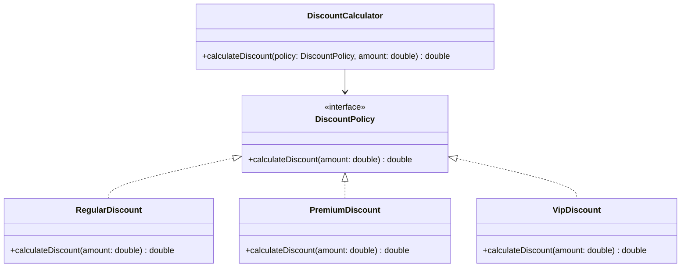

## The Principle

> **Software entities should be open for extension, but closed for modification.**

In plain terms: you should be able to add new behavior to a system **without editing existing,
already-tested code.** New requirements should mean *new classes*, not *changed classes*.

This is the principle most directly tested by the "now also support X" curveball mentioned back in
Chapter 1 — an interviewer adding a requirement mid-interview is checking whether your design is
open for extension or requires surgery.

## The Textbook Violation

```java
class DiscountCalculator {
    double calculateDiscount(String customerType, double amount) {
        if (customerType.equals("REGULAR")) {
            return amount * 0.05;
        } else if (customerType.equals("PREMIUM")) {
            return amount * 0.10;
        } else if (customerType.equals("VIP")) {
            return amount * 0.20;
        }
        return 0;
    }
}
```

Adding a new customer type means opening this class, adding another `else if` branch, and
re-testing the entire method — even though the existing branches didn't change. Every edit here
risks breaking a previously-working case through a typo or misplaced condition.

## The Fix: Polymorphism Instead of Conditionals

```java
interface DiscountPolicy {
    double calculateDiscount(double amount);
}

class RegularDiscount implements DiscountPolicy {
    public double calculateDiscount(double amount) { return amount * 0.05; }
}

class PremiumDiscount implements DiscountPolicy {
    public double calculateDiscount(double amount) { return amount * 0.10; }
}

class VipDiscount implements DiscountPolicy {
    public double calculateDiscount(double amount) { return amount * 0.20; }
}

class DiscountCalculator {
    double calculateDiscount(DiscountPolicy policy, double amount) {
        return policy.calculateDiscount(amount);
    }
}
```

Adding a `GoldDiscount` now means writing **one new class** — `DiscountCalculator` is never
touched again. This is the direct, practical payoff of polymorphism (Chapter 2) applied
deliberately: it's what "open for extension, closed for modification" looks like in code.



## OCP Doesn't Mean "No Code Ever Changes"

This is the principle's most common misreading. OCP is about protecting **existing, tested
abstractions** from modification — it doesn't mean literally nothing in the codebase ever changes
again. New concrete classes are added constantly; that's the "open for extension" half. What stays
closed is the core contract (`DiscountPolicy`) and the code that depends on it
(`DiscountCalculator`).

## Where to Draw the Line: You Can't Predict Every Extension Point

OCP has a real cost: designing every class to be infinitely extensible in every direction is both
impossible and wasteful (a direct conflict with YAGNI, covered in Chapter 12). The skill is
identifying the **specific axis of change** a problem statement hints at, and only building
extensibility along that axis.

In the discount example, "different customer types get different discount rates" is an obvious,
stated axis of variation — building an interface around it is justified. If nothing in the problem
suggested discount rates would ever vary, introducing `DiscountPolicy` upfront would be
speculative over-engineering.

## Summary

- OCP: classes should be extensible without modifying their existing, tested code.
- The classic violation is an `if/else` or `switch` chain over a type — the classic fix is an
  interface with one implementation per variant (this is literally the **Strategy pattern**,
  formalized in Chapter 28).
- OCP doesn't forbid all change — it protects *existing* abstractions while allowing new
  implementations to be added freely.
- Only build extensibility around axes of change the problem actually signals — speculative OCP
  compliance for unlikely future variation is over-engineering, not good design.

---

## Interview Questions

**1. State the Open/Closed Principle and explain what "open" and "closed" each refer to.**
A class should be "open for extension" — new behavior can be added — but "closed for
modification" — its existing, already-tested source code shouldn't need to change to support that
new behavior. In practice this means designing around interfaces/abstractions so that new
requirements are satisfied by adding new implementing classes, not by editing the classes that
already work.
*Follow-up: Is it realistic for a class to never be modified again once written?* Not absolutely —
OCP is a design goal to minimize modification for the *specific, anticipated* axes of variation in a
system, not an absolute guarantee that literally no future change will ever touch that class; bug
fixes or genuinely new axes of variation neither anticipated nor reasonably anticipatable may still
require edits.

**2. Walk through the `DiscountCalculator` violation and its fix.**
The violation used an `if/else` chain checking a `customerType` string to decide the discount
rate — adding a new customer type meant editing this method and re-testing every existing branch
alongside the new one. The fix introduces a `DiscountPolicy` interface with one implementing class
per customer type, so `DiscountCalculator` simply delegates to whichever policy it's given; a new
customer type becomes a new class implementing `DiscountPolicy`, with zero changes to
`DiscountCalculator` or any existing policy class.
*Follow-up: What GoF design pattern does this fix directly correspond to?* This is the **Strategy
pattern** (Chapter 28) — OCP is the *principle*, Strategy is the *named, reusable structural
solution* that satisfies it for this specific shape of problem (interchangeable algorithms/policies).

**3. How would you recognize a potential Open/Closed Principle violation just by reading a code
diff, without knowing the surrounding context?**
A diff that adds a new `else if` or `case` branch to an existing conditional block to support a new
type or category is the strongest textbook signal — it means an existing, previously-tested method
is being re-opened and re-risked for every new variant, rather than the variant being handled by an
entirely new, additively-introduced class.
*Follow-up: Is every `switch` statement automatically an OCP violation?* No — a `switch` over a
small, genuinely fixed, unlikely-to-grow set of values (like handling the seven days of the week)
isn't a meaningful OCP concern, since there's no real axis of future extension to protect; OCP
becomes relevant specifically when the set of cases is expected to grow over the system's
lifetime.

**4. What's the risk of over-applying OCP by introducing interfaces and extension points for
every possible future variation?**
It leads directly to over-engineering: unnecessary abstraction layers, more classes and interfaces
to navigate, and speculative flexibility that's never actually used, all while making the codebase
harder to read for no real benefit. This directly conflicts with YAGNI (Chapter 12) — the discipline
of not building for hypothetical future requirements that haven't been indicated by the actual
problem.
*Follow-up: How do you decide, in an interview, which axes of variation are worth protecting with
OCP versus which are speculative?* Look at what the problem statement explicitly mentions or
strongly implies will vary (e.g., "different vehicle types have different fees" clearly signals fee
calculation will vary) versus what you're inventing on your own with no signal from the requirements
(e.g., assuming the system will someday need multiple currencies when nothing in the problem
mentions currency at all).

**5. Can inheritance alone satisfy the Open/Closed Principle, or does it typically require
interfaces?**
Inheritance combined with polymorphism (an abstract class with an abstract method overridden by
subclasses) can satisfy OCP just as well as an interface — the key requirement is that a caller
depends only on the abstract type and dispatches to the correct behavior polymorphically, regardless
of whether that abstraction is expressed as an interface or an abstract class. The choice between
the two follows the Chapter 3 decision framework (shared state/behavior favors abstract class, pure
contract favors interface), independent of OCP itself.
*Follow-up: Does OCP favor composition or inheritance as the extension mechanism?* Modern design
guidance generally favors composition-based extension (like the Strategy or Decorator patterns,
where behavior is injected as an object) over pure inheritance-based extension, since composition
avoids the rigidity and subclass-explosion risks discussed in Chapter 2, while still satisfying
OCP's core requirement of not modifying existing code.

**6. How would you extend the `DiscountCalculator` design to support combining multiple
discounts (e.g., a customer who is both "PREMIUM" and has a "HOLIDAY" promotional discount)
without violating OCP?**
Rather than creating a combinatorial explosion of classes for every discount combination
(`PremiumHolidayDiscount`, `RegularHolidayDiscount`, etc.), you'd introduce a `CompositeDiscount`
that itself implements `DiscountPolicy` and internally holds a list of other `DiscountPolicy`
instances, summing (or otherwise combining) their results. Adding a new combination becomes
assembling existing policy objects together at runtime, not writing new combination-specific
classes — no existing code is modified.
*Follow-up: What design pattern is this composite approach an instance of?* This is a direct
application of the **Composite pattern** (Chapter 23), treating a group of `DiscountPolicy` objects
uniformly as if it were a single `DiscountPolicy` itself.

**7. Does the Open/Closed Principle apply only to business logic classes, or can it apply to data
structures and utility classes too?**
It applies broadly to any code where new variants or behaviors might be added over time — this
includes serialization logic (adding a new format shouldn't require editing every existing format's
code), validation logic (adding a new validation rule shouldn't require editing a monolithic
validator method), and even simple utility classes if they're structured around a conditional
dispatch over types that's expected to grow.
*Follow-up: Give an example of OCP applied to a validation scenario.* Instead of one
`validate(Order order)` method with a growing chain of `if` checks for each business rule, define a
`ValidationRule` interface with one implementation per rule (e.g., `MinimumOrderAmountRule`,
`ValidShippingAddressRule`), and have the validator iterate over an injected, configurable list of
rules — adding a new business rule means adding a new class, not editing the validator.

**8. How does violating OCP increase the risk of regression bugs specifically, compared to other
principle violations?**
Because OCP violations require editing code that's already shipped and tested to accommodate new
behavior, every such edit carries the risk of subtly breaking a previously-working case — for
example, misplacing an `else if` branch in the wrong order in a chain where earlier conditions
short-circuit later ones. A design that satisfies OCP eliminates this risk category entirely for new
feature additions, since the previously-tested code path for existing cases is never touched.
*Follow-up: Does this mean OCP-compliant code needs less regression testing over time?* For the
protected axis of variation specifically, yes — adding a new `DiscountPolicy` implementation
requires testing only that new class in isolation, with no need to re-run regression tests against
`RegularDiscount` or `PremiumDiscount`, since neither was touched.

**9. In a real production codebase, is it ever acceptable to deliberately violate OCP and just
edit an existing conditional chain instead of refactoring to an interface-based design?**
Yes, pragmatically — if a conditional chain is small, genuinely stable (rarely extended), and the
cost of introducing a full interface-based design outweighs the benefit for that specific case
(e.g., a one-off script, or a chain over 2–3 values that's extremely unlikely to grow), editing it
directly can be the more pragmatic choice. OCP is a guideline for managing the *cost of future
change*, not an absolute rule that must be applied everywhere regardless of context.
*Follow-up: How would you judge this trade-off differently in an LLD interview versus in a real
job?* In an interview, demonstrating awareness of OCP and applying it where the problem clearly
signals it's warranted is usually the expected behavior, since the interview is specifically testing
this skill. In a real job, you'd weigh actual maintenance cost, team velocity, and how likely the
variation point is to actually grow, sometimes reasonably choosing simplicity over textbook
compliance.

**10. How does the Open/Closed Principle relate to the concept of a "stable abstraction" from
Chapter 5's coupling discussion?**
A class satisfying OCP depends on a stable abstraction (like the `DiscountPolicy` interface) that
rarely if ever changes, while the volatile, frequently-changing part of the system (individual
discount implementations) is isolated behind that stable boundary. This is exactly the "high
afferent coupling on a stable interface is fine" idea from Chapter 5 — many discount
implementations can depend on `DiscountPolicy` without risk, precisely because that interface is
designed to remain closed for modification.
*Follow-up: What happens to OCP compliance if the "stable" abstraction itself turns out to need
frequent changes (e.g., `DiscountPolicy`'s method signature keeps changing)?* If the abstraction
itself is unstable, OCP's benefit collapses — every signature change to `DiscountPolicy` forces
edits across all implementing classes, which is exactly the modification-risk OCP was meant to
prevent; this signals the abstraction was drawn at the wrong boundary and needs to be redesigned
based on a better understanding of what's actually likely to vary.

**11. Explain how the Open/Closed Principle applies to the `NotificationService` example from
Chapter 1.**
The original `NotificationService` used an `if/else` chain checking a `type` string to decide how to
send a notification — a textbook OCP violation, since adding WhatsApp support meant editing that
method. The fixed version depends on a `NotificationChannel` interface, letting new channels
(WhatsApp, Slack, etc.) be added as new classes with zero modification to `NotificationService`
itself, directly satisfying "open for extension, closed for modification."
*Follow-up: If notification channels needed to be selected dynamically at runtime based on user
preference stored in a database, how would that interact with this OCP-compliant design?* You'd add
a factory or registry (Chapter 17/18) that maps a stored preference string to the correct
`NotificationChannel` implementation at lookup time — this factory would need updating when a new
channel type is added, but this is an acceptable, isolated "registration point" cost, distinct from
modifying the core `NotificationService` business logic itself.

**12. Can you satisfy the Open/Closed Principle using Java enums, or does OCP require
interfaces/inheritance?**
Standard Java enums with a `switch` statement elsewhere in the code have the same OCP problem as
string-based `if/else` chains — adding a new enum constant still requires finding and editing every
`switch` that handles it. However, Java allows enums to implement interfaces and even override
methods per-constant (`enum DiscountType implements DiscountPolicy { REGULAR { ... }, PREMIUM
{ ... } }`), which *does* satisfy OCP as long as no external `switch` statements exist over the enum
elsewhere — the behavior lives on the enum constant itself, polymorphically.
*Follow-up: Is per-constant enum method overriding actually used often in real Java codebases, or
is it more of a curiosity?* It's genuinely used in real codebases for small, fixed, unlikely-to-grow
sets of variants (this is itself a signal it's fine to be a "closed" enum rather than an open
interface) — for larger or more dynamic sets of variants, a full interface with separate classes is
generally preferred for clarity and testability.

**13. How would you respond if an interviewer said "just add another `else if` branch, it's
faster" when you propose an OCP-compliant refactor?**
Acknowledge the short-term speed trade-off honestly — adding an `else if` genuinely is faster to
type in the moment — but explain the cost is deferred, not eliminated: every future addition
compounds the risk of regression in the growing conditional, and the interface-based design pays a
small upfront cost in exchange for that risk disappearing on every subsequent addition. If time is
genuinely tight in the interview, it's reasonable to note both options and briefly justify picking
the OCP-compliant one, or to explicitly flag that you're taking the faster path for now given time
constraints, showing you understand it's a trade-off, not a default.
*Follow-up: Is there a scenario where the interviewer's suggestion is actually the better call?*
Yes — if the problem statement gives no signal that the set of cases will grow (a truly fixed,
small enumeration), adding a direct conditional is simpler and avoids unnecessary abstraction,
consistent with not over-applying OCP as discussed earlier in this chapter.

**14. What's the relationship between the Open/Closed Principle and the concept of "plugin
architecture" in larger systems?**
A plugin architecture is essentially OCP applied at a system-wide scale: the core application
defines stable extension points (interfaces or abstract classes) that third-party or later-added
plugins implement, without ever needing to modify the core application's source code to add new
functionality. IDEs like IntelliJ or browsers like Chrome are built this way — new plugins/extensions
are added constantly without recompiling or editing the core product's code, which is the same
principle as `DiscountCalculator` accepting new `DiscountPolicy` implementations, just applied at a
much larger scale.
*Follow-up: What would the "extension point" interface look like in a simplified plugin
architecture for a text editor supporting new file-format importers?* Something like an
`interface FileImporter { boolean supports(String extension); Document importFile(File file); }`,
where the core editor holds a list of registered `FileImporter` implementations and delegates to
whichever one supports a given file's extension — adding a new file format means adding a new class
implementing `FileImporter` and registering it, with zero changes to the editor's core code.
