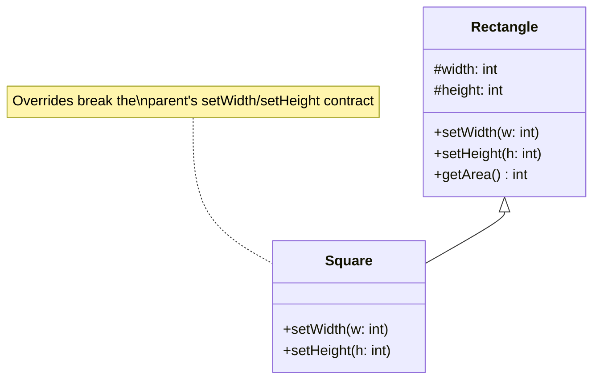

## The Principle

> **If `S` is a subtype of `T`, objects of type `T` should be replaceable with objects of type `S`
> without altering the correctness of the program.**

This is a more rigorous restatement of the Bird/Penguin test from Chapter 2. LSP isn't just "does
this code compile?" — it's "does every piece of code written against the parent type continue to
behave *correctly* when handed a child instance instead?"

## The Rectangle/Square Problem — LSP's Most Famous Example

This looks innocent at first:

```java
class Rectangle {
    protected int width;
    protected int height;

    void setWidth(int width) { this.width = width; }
    void setHeight(int height) { this.height = height; }
    int getArea() { return width * height; }
}

class Square extends Rectangle {
    @Override
    void setWidth(int width) {
        this.width = width;
        this.height = width; // must keep both sides equal
    }

    @Override
    void setHeight(int height) {
        this.width = height;
        this.height = height;
    }
}
```

Mathematically, a square *is* a rectangle. But now run this code, written entirely against the
`Rectangle` type:

```java
void resize(Rectangle r) {
    r.setWidth(5);
    r.setHeight(10);
    assert r.getArea() == 50; // fails if r is actually a Square!
}
```

If `r` is a `Square`, `setHeight(10)` silently overwrites the width too, so the area becomes 100,
not 50. The code is correct for every `Rectangle`, but breaks the instant a `Square` is substituted
in — a textbook LSP violation, despite the inheritance being conceptually "correct" in pure
mathematics.



**The fix:** don't model `Square` as a subtype of a *mutable* `Rectangle` at all. If both are
immutable value types with no independent `setWidth`/`setHeight`, or if they're modeled as two
separate `Shape` implementations with no inheritance relationship between them, the problem
disappears entirely.

## The Formal Rules Behind LSP (Design by Contract)

LSP has precise sub-rules, and interviewers occasionally probe these directly:

1. **Preconditions cannot be strengthened in a subtype.** If `Rectangle.setWidth(int w)` accepts
   any positive integer, a subclass can't suddenly reject widths above 100 — that would break
   callers who relied on the parent's looser contract.
2. **Postconditions cannot be weakened in a subtype.** If the parent guarantees
   `getArea()` returns a non-negative number, a subclass can't return negative values.
3. **Invariants of the parent must be preserved.** If `Rectangle` guarantees width and height are
   independently settable, `Square` breaking that (as shown above) is exactly the violation.
4. **A subtype shouldn't throw new exceptions the parent's contract didn't already allow**, unless
   they're subtypes of exceptions the original method already declared.

## A Second, Very Common Violation: The "Throws Unsupported" Trap

```java
interface Bird {
    void fly();
}

class Eagle implements Bird {
    public void fly() { /* soars */ }
}

class Penguin implements Bird {
    public void fly() {
        throw new UnsupportedOperationException("Penguins can't fly");
    }
}
```

Any code calling `bird.fly()` on a list of `Bird`s now needs to know, and specifically guard
against, which concrete types will explode at runtime — the entire point of polymorphism
(dispatching safely through a shared contract) is defeated. The fix, shown fully in Chapter 2, is
separating `fly()` into a `FlyingBird` sub-interface that only flight-capable birds implement.

## Summary

- LSP: subtypes must be fully substitutable for their parent type, in every context, without
  breaking correctness — not just compiling.
- The Rectangle/Square problem shows that "is-a" in plain English (a square is a rectangle) doesn't
  always mean "is-a" in the LSP sense (behaviorally substitutable).
- Concrete violation patterns to watch for: overridden setters with hidden side effects,
  strengthened preconditions, weakened postconditions, and methods that throw
  `UnsupportedOperationException` for certain subtypes.
- The fix is almost always to restructure the hierarchy — often replacing a single "is-a" chain
  with narrower interfaces that only make promises every implementer can actually keep.

---

## Interview Questions

**1. State the Liskov Substitution Principle in your own words, and explain how it differs from
simply "does the code compile."**
LSP requires that a subtype be behaviorally substitutable for its base type — any code written
against the base type must continue to work *correctly*, not just compile, when given an instance of
the subtype instead. Compilation only checks method signatures match; LSP is concerned with runtime
behavior and whether the subtype honors the base type's contract, including its guarantees about
side effects and return values.
*Follow-up: Can code that compiles perfectly still violate LSP?* Yes — the Rectangle/Square example
compiles without any errors, since `Square` correctly overrides methods with matching signatures,
but it violates LSP because the overridden behavior silently breaks an assumption
(`setWidth`/`setHeight` being independent) that code written against `Rectangle` relies on.

**2. Walk through the Rectangle/Square problem and explain exactly which LSP rule is broken.**
`Square` overrides `setWidth()` and `setHeight()` to keep both dimensions equal, which breaks the
`Rectangle` invariant that width and height can be set independently. This violates the
"invariants of the parent must be preserved" rule — code written against `Rectangle` (like a
`resize()` method that sets width and height separately, then checks the resulting area) produces
an incorrect result when handed a `Square`, even though mathematically a square is a valid
rectangle.
*Follow-up: Is the problem really with the `Square` class, or with the `Rectangle` class's
design?* It's arguably a flaw in `Rectangle`'s design — a *mutable* `Rectangle` with independent
`setWidth`/`setHeight` methods creates an implicit contract that no shape with equal, coupled sides
can honestly satisfy; an immutable `Rectangle` (constructed with both dimensions upfront, with no
setters) would sidestep this problem entirely, since there'd be no independent-mutation contract to
violate.

**3. What are the four sub-rules of Design by Contract that LSP formalizes?**
(1) Preconditions cannot be strengthened in a subtype — a subclass can't demand stricter input
requirements than its parent. (2) Postconditions cannot be weakened in a subtype — a subclass must
guarantee at least as much about its output/results as the parent promised. (3) Invariants of the
parent class must be preserved by the subtype. (4) A subtype shouldn't introduce new exceptions that
violate the parent's declared exception contract, beyond exceptions that are themselves subtypes of
already-declared ones.
*Follow-up: Give an example of a precondition being illegally strengthened.* If
`Rectangle.setWidth(int w)` accepts any positive integer, and `Square.setWidth(int w)` throws an
exception for widths above 1000 (because "squares in this system can't exceed 1000 units"), that's
an illegally strengthened precondition — code that worked fine passing 1500 to any `Rectangle` now
fails specifically when the object happens to be a `Square`.

**4. How does the "throws UnsupportedOperationException" pattern violate LSP, and how is it
typically fixed?**
When a subtype throws an exception the parent type's method contract didn't allow for a certain
input or in certain implementations (like `Penguin.fly()` throwing when `Bird.fly()`'s contract
implies flight is always possible), code written generically against the parent type
(`for (Bird b : birds) b.fly();`) breaks unexpectedly for that specific subtype, defeating the
purpose of depending on the shared abstraction in the first place. The fix is usually to narrow the
interface — separating out the specific capability (`fly()`) into its own sub-interface
(`FlyingBird`) that only genuinely flight-capable types implement, so the base `Bird` type makes no
promise that not every bird can keep.
*Follow-up: Is Java's own JDK ever guilty of this pattern, and if so, is it considered acceptable
there?* Yes — `Collections.unmodifiableList(...)` and `List.of(...)` return list implementations
whose mutating methods (`add`, `remove`) throw `UnsupportedOperationException`, technically
violating LSP against the full `List` contract. The JDK team accepted this as a pragmatic trade-off
for providing immutable collection views without introducing a completely separate type hierarchy,
but it's broadly understood as an intentional, documented exception rather than a pattern to
emulate casually in application code.

**5. How would you detect an LSP violation while reviewing someone else's inheritance hierarchy,
without running the code?**
Look for overridden methods that: throw new exceptions not implied by the parent's contract, return
values with looser guarantees than the parent promised (e.g., parent guarantees non-null, subclass
returns null), have side effects unexpected from the parent's perspective (like the Square example
mutating an unrelated field), or contain unusually strict validation compared to the parent's
looser acceptance criteria. Any of these are strong candidates for a manual trace-through: "would
code written purely against the parent type behave correctly here?"
*Follow-up: Is there a way to catch LSP violations automatically with tooling, or is this purely a
manual design review skill?* Static analysis tools can catch some superficial signals (like widened
exception throws), and thorough unit tests written against the *base type* (running the same test
suite against every subtype via parameterized tests) can catch behavioral LSP violations
empirically — but recognizing the underlying *design* flaw usually still requires human judgment
about whether the base type's contract genuinely makes sense for every subtype.

**6. What's the relationship between LSP and covariant return types in Java?**
Covariant return types (an overriding method returning a more specific subtype than its parent's
declared return type) are actually LSP-*compliant* by design — Java's compiler allows this
specifically because returning a more specific type only *strengthens* the postcondition (callers
expecting the parent's return type can always safely accept the more specific subtype too), which
doesn't violate any LSP rule. This is the one direction of "changing a contract" that's always safe.
*Follow-up: Is it therefore true that overriding methods can freely narrow return types but must
never widen them?* Yes, precisely — narrowing a return type (more specific) is safe and Java
permits it directly at the language level; widening a return type isn't even syntactically possible
in a Java override, since the override must return something assignable to the parent's declared
return type.

**7. Explain how LSP applies to exception handling specifically — what's the rule about checked
exceptions in Java overrides?**
An overriding method in Java cannot declare new checked exceptions beyond what the parent method
already declared (or subtypes of those already-declared exceptions) — the compiler enforces this
directly. This is a language-level enforcement of one of LSP's Design-by-Contract rules: a subtype
can't introduce new failure modes that callers written against the parent's contract have no way
of anticipating or catching.
*Follow-up: Does this compiler enforcement mean checked-exception-related LSP violations are
impossible in Java?* It prevents violations involving *checked* exceptions specifically, since the
compiler enforces that rule directly. It does not prevent violations involving unchecked
(`RuntimeException`) exceptions, like the `Penguin.fly()` example, since Java doesn't require
declaring or restricting those at compile time — this is exactly why the `UnsupportedOperationException`
pattern is a real, compiler-permitted LSP risk in Java despite the language's checked-exception
protections.

**8. How would you redesign the Bird/Penguin hierarchy to be fully LSP-compliant, and what
principle from Chapter 3 does this redesign rely on?**
Split the single `Bird` interface into a base `Bird` interface with only universally-true behavior
(like `eat()`), and a separate `FlyingBird` interface (extending or independent of `Bird`) with
`fly()`, so only birds that can genuinely fly implement it. `Eagle implements FlyingBird`,
`Penguin implements Bird` (not `FlyingBird`) — every implementer now honestly satisfies every
interface it claims to implement, with zero risk of an unsupported-operation exception. This relies
on the Chapter 3 principle of using interfaces to model precise, honest contracts rather than
lumping unrelated capabilities into one overly broad interface.
*Follow-up: Is this the same underlying fix as the Interface Segregation Principle covered in the
next chapter?* Yes — this exact restructuring (splitting a bloated interface into smaller, more
precise ones so implementers only commit to contracts they can honestly fulfill) is a direct preview
of ISP (Chapter 10); LSP and ISP violations often co-occur and are frequently fixed by the same
interface-splitting refactor.

**9. Can LSP violations occur with composition-based designs, or is it strictly an
inheritance-only concern?**
LSP is specifically about subtype substitutability, so it's inherently tied to inheritance/interface
implementation relationships (`extends`/`implements`) — a pure composition relationship (one class
holding a reference to another with no subtype relationship between them) has no "is substitutable
for" claim to violate in the first place. This is actually one more practical argument for favoring
composition over inheritance (Chapter 2, Chapter 13): composition sidesteps LSP risk entirely,
since there's no substitutability contract being made.
*Follow-up: Does this mean composition is strictly safer than inheritance from a design-correctness
standpoint?* In this specific narrow sense, yes — composition avoids an entire category of subtle,
runtime-only bugs that inheritance hierarchies can introduce; this is one of the concrete reasons
"favor composition over inheritance" is treated as close to a default rule in modern OOP design
guidance rather than just a stylistic preference.

**10. In an LLD interview, how would you test whether your proposed inheritance hierarchy is
LSP-compliant before finalizing your design?**
Mentally (or verbally) walk through every method on the base type and ask, for each subtype: "if
code only knows about the base type and calls this method, will it get correct, expected behavior
from this specific subtype, with no surprising exceptions, side effects, or weaker guarantees?" Do
this explicitly for the subtype that seems most likely to be the "odd one out" (in Bird/Penguin,
that's clearly `Penguin`, since it's the one breaking the "birds fly" assumption most people bring
into the problem).
*Follow-up: What's a practical time-efficient way to do this check without going through every
single method exhaustively in a live interview?* Focus specifically on any method whose name or
purpose suggests a capability that might not universally apply to every subtype you're planning
(like `fly()`, or any method involving a side effect like `setWidth()`) — these are the highest-risk
candidates, and exhaustively checking simple, universally-applicable methods (like `eat()` or
`getName()`) is rarely necessary since violations concentrate around capability or side-effect
methods.

**11. Does LSP require that every subtype behave *identically* to its parent, or is there room
for different behavior?**
LSP explicitly allows and expects different *implementations* — different subtypes are supposed to
do things differently (that's the entire point of polymorphism) — as long as the *contract*
(preconditions, postconditions, invariants) is honored. `Eagle.fly()` and a hypothetical
`Sparrow.fly()` can have completely different internal flight mechanics as long as both genuinely
achieve "flying" as the base contract promises; the principle is about honoring the contract's
guarantees, not about producing identical behavior.
*Follow-up: Where exactly is the line between "different but contract-honoring behavior" and an
LSP violation?* The line is whether a caller depending only on the base type's documented
guarantees would ever be surprised or given an incorrect result — different performance
characteristics, different internal algorithms, or different side-effect-free implementation
details are all fine; a difference that breaks an assumption the base type's contract explicitly or
implicitly promised (like "this operation always succeeds" or "this field can always be set
independently") is the violation.

**12. How does LSP interact with default method implementations in Java 8+ interfaces?**
A default method in an interface establishes a contract just like any abstract method would — if an
implementing class overrides that default method with behavior that breaks the guarantees the
default implementation (or the interface's documentation) established, that's just as much an LSP
violation as overriding a regular abstract method incorrectly would be. LSP concerns the *contract*
established by the type, regardless of whether that contract has a default implementation or is
purely abstract.
*Follow-up: Does providing a default method make LSP violations more or less likely in practice?*
Arguably somewhat more likely in careless codebases, since a default method's convenient
"working out of the box" behavior can lull developers into skipping the discipline of explicitly
thinking through what contract they're overriding when they do choose to customize it for a specific
implementing class.

**13. Is the Rectangle/Square problem specific to object-oriented programming, or does it reveal
something more general about modeling real-world "is-a" relationships in software?**
It reveals a general lesson: natural-language or mathematical "is-a" relationships (a square is a
kind of rectangle) don't automatically translate into safe behavioral subtyping relationships in
software, especially once *mutable state* and *methods with side effects* enter the picture. This
lesson generalizes well beyond geometry — any domain modeling exercise (employees and managers,
accounts and savings accounts, vehicles and electric vehicles) needs the same behavioral
substitutability check, not just a conceptual "is-a" gut check.
*Follow-up: Give a non-geometric example of this same trap.* A `SavingsAccount extends
BankAccount` where `BankAccount.withdraw()` allows any amount up to the balance, but
`SavingsAccount` overrides `withdraw()` to enforce a monthly withdrawal limit not present on the
parent — this strengthens a precondition/restricts what the parent contract allowed, breaking code
written generically against `BankAccount` that assumed any within-balance withdrawal would succeed.

**14. If violating LSP is sometimes pragmatically accepted (as with Java's immutable
`List.of()`), how do you decide in an interview whether a similar trade-off is acceptable for your
own design, versus something you should avoid?**
Weigh how likely and how costly the violation is to actually surface as a bug for realistic callers
of your abstraction. The JDK's immutable-list case is a narrow, well-documented, intentional
trade-off communicated clearly through naming and documentation (`List.of`) — it's not a
general-purpose `List` implementation being handed out silently. If your design's violation would
be silent, undocumented, and likely to surprise a caller who reasonably trusted the base type's
contract, it's a real risk worth fixing rather than accepting; if it's an extremely narrow, clearly
communicated, deliberate exception (and you can articulate why), it may be acceptable to flag and
move on given interview time constraints.
*Follow-up: How would you communicate this trade-off decision out loud to an interviewer?*
Something like: "I know this technically bends LSP slightly, similar to how Java's immutable
collections throw on mutation — I'm accepting that here because X, but if this were a larger
concern I'd restructure using two separate interfaces instead," demonstrating you recognize the
issue and are making a deliberate, informed choice rather than missing it entirely.
