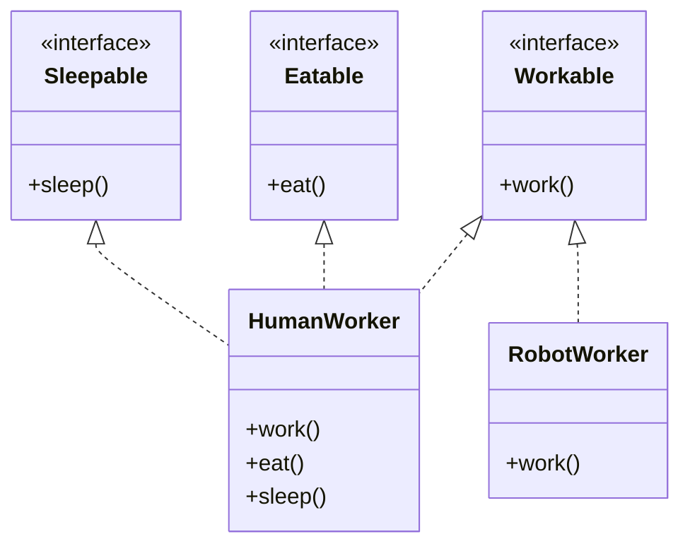

## The Principle

> **Clients should not be forced to depend on interfaces they do not use.**

ISP is about interface *shape*, not interface *existence*. A "fat" interface — one bundling many
unrelated methods — forces every implementer to either genuinely support all of them, or (far more
commonly) fake support with empty or exception-throwing stubs.

## The Fat Interface Violation

```java
interface Worker {
    void work();
    void eat();
    void sleep();
}

class HumanWorker implements Worker {
    public void work() { /* works */ }
    public void eat() { /* eats lunch */ }
    public void sleep() { /* sleeps at night */ }
}

class RobotWorker implements Worker {
    public void work() { /* works */ }
    public void eat() {
        throw new UnsupportedOperationException("Robots don't eat");
    }
    public void sleep() {
        throw new UnsupportedOperationException("Robots don't sleep");
    }
}
```

`RobotWorker` is forced to implement `eat()` and `sleep()` even though neither makes sense for it.
This should look familiar — it's the exact same shape as Chapter 9's Penguin problem, and it's not
a coincidence: **a fat interface is often the root cause of an LSP violation.** Fixing the
interface's shape fixes both problems at once.

## The Fix: Split by Actual Capability

```java
interface Workable {
    void work();
}

interface Eatable {
    void eat();
}

interface Sleepable {
    void sleep();
}

class HumanWorker implements Workable, Eatable, Sleepable {
    public void work() { }
    public void eat() { }
    public void sleep() { }
}

class RobotWorker implements Workable {
    public void work() { }
    // no eat() or sleep() to fake — RobotWorker only claims what it can honestly do
}
```

`RobotWorker` now implements exactly one interface, `Workable`, and makes no false promises. Code
that only cares about work assignment can depend on `Workable` alone, without knowing or caring
whether the worker behind it can eat or sleep.



## Why "Clients" Matters as Much as "Implementers"

ISP is phrased around **clients** (consumers of an interface), not just implementers, for a
reason. Consider a `TaskScheduler` that only needs to assign work:

```java
class TaskScheduler {
    void assign(Workable worker, Task task) {
        worker.work();
    }
}
```

If `TaskScheduler` depended on the original fat `Worker` interface instead, it would be coupled to
`eat()` and `sleep()` methods it never calls — meaning any change to those unrelated methods'
signatures could force `TaskScheduler` to recompile or be reviewed, even though it has nothing to
do with eating or sleeping. **Depending on a narrow interface reduces coupling for the client, not
just the implementer.**

## ISP in Practice: A Common Real-World Example

Java's own `java.io` package predates ISP-conscious design in places — but modern designs favor
small, focused interfaces. A well-known good example is splitting read and write capability:

```java
interface Readable {
    String read();
}

interface Writable {
    void write(String data);
}

class ReadOnlyFile implements Readable {
    public String read() { return "..."; }
}

class ReadWriteFile implements Readable, Writable {
    public String read() { return "..."; }
    public void write(String data) { }
}
```

A function that only ever reads data should accept a `Readable`, not a combined
`ReadableWritable` — this also prevents accidental writes by callers who only needed read access,
adding a small safety benefit on top of the pure design benefit.

## Summary

- ISP: don't force implementers (or clients) to depend on methods they don't actually use.
- Fat interfaces produce the same "throws UnsupportedOperationException" smell as LSP violations —
  the two principles are closely linked, and fixing interface shape often fixes both at once.
- The fix is splitting one broad interface into several narrow, capability-specific interfaces that
  classes can mix and match via multiple interface implementation.
- ISP benefits clients too, not just implementers — depending on a narrow interface reduces
  unnecessary coupling for the code consuming it.

---

## Interview Questions

**1. State the Interface Segregation Principle and explain what "client" means in this context.**
ISP states that no client should be forced to depend on methods it doesn't use — a "client" here
means any code that depends on an interface, whether it's a class implementing it or a class merely
consuming/calling it. The principle applies to both directions: implementers shouldn't be forced to
implement irrelevant methods, and consumers shouldn't be forced to depend on (and be coupled to)
methods they never call.
*Follow-up: Why does the principle explicitly protect consumers, not just implementers, given that
implementers are the ones who have to write the fake/stub code?* Because a consumer depending on a
fat interface is unnecessarily coupled to the entire interface's surface area — if any method on
that fat interface changes, even one the consumer never calls, the consumer's code may need
recompilation or review, which is an avoidable coupling cost entirely separate from the
implementer's stub-method problem.

**2. Walk through the `Worker`/`RobotWorker` example and explain the fix.**
The original `Worker` interface bundled `work()`, `eat()`, and `sleep()` together, forcing
`RobotWorker` — which genuinely can't eat or sleep — to implement those methods anyway, typically by
throwing `UnsupportedOperationException`. The fix splits `Worker` into three narrow interfaces
(`Workable`, `Eatable`, `Sleepable`), letting `HumanWorker` implement all three honestly while
`RobotWorker` implements only `Workable`, making no false promises about capabilities it doesn't
have.
*Follow-up: How is this different from just leaving `eat()` and `sleep()` as empty, no-op methods
on `RobotWorker` instead of splitting the interface?* Empty no-op implementations are actually worse
than throwing an exception in one sense — they silently succeed while doing nothing, which can mask
bugs where calling code assumes the action genuinely happened. Splitting the interface eliminates
the problem entirely rather than choosing between two flawed ways of faking compliance.

**3. How does ISP relate to LSP, and why are they often violated together?**
A fat interface forces implementers who can't honestly support every method to either throw
exceptions or provide meaningless no-op implementations — both of which are LSP violations, since
code written generically against the interface can no longer safely assume every method will behave
correctly for every implementer. Splitting the fat interface into narrower, capability-specific ones
(the ISP fix) directly resolves the LSP violation too, since implementers now only implement
interfaces whose contracts they can genuinely honor.
*Follow-up: Can you have an ISP violation without an accompanying LSP violation?* Yes — if every
implementer of a fat interface genuinely and correctly supports every method (no stubs, no
exceptions), there's no LSP violation, but there's still an ISP violation in the sense that clients
depending on the fat interface are unnecessarily coupled to methods they don't personally use, even
if every implementer handles them correctly.

**4. What's a practical warning sign, while writing an interface, that you might be violating
ISP?**
If you find yourself asking "will every single implementer of this interface actually need and be
able to support every one of these methods?" and the honest answer is "probably not for at least
one likely implementer," that's the warning sign. Concretely: an interface with more than roughly
3–5 methods spanning genuinely different concerns (not just multiple facets of one cohesive
capability) is worth scrutinizing for a possible split.
*Follow-up: Does having many methods on an interface always indicate an ISP violation?* No — an
interface like `List` has many methods, but they're all genuinely part of one cohesive "list
behavior" concept that essentially every real `List` implementation needs; ISP concerns methods that
represent genuinely separate, independently-optional capabilities being bundled together, not sheer
method count.

**5. How does ISP benefit unit testing, beyond the design cleanliness argument?**
When a class depends on a narrow interface (like `Workable` instead of the fat `Worker`), writing a
test double (mock or stub) for that dependency only requires implementing the one method the class
under test actually calls — a fake `Workable` needs only a fake `work()` method, versus a fake
`Worker` needing (fake or thrown-exception) implementations of `eat()` and `sleep()` too, purely to
satisfy the compiler, even though the test never exercises those methods.
*Follow-up: In a codebase using mocking frameworks like Mockito, does this benefit still matter,
since Mockito can auto-generate stub implementations for unused interface methods?* It matters less
mechanically (Mockito handles the boilerplate automatically), but it still matters for
comprehension — a test reader sees exactly which capability (`Workable`) the class under test
actually depends on, rather than a broad `Worker` mock whose relevant method is buried among several
irrelevant ones.

**6. Is there a risk of over-applying ISP by splitting interfaces too finely — one method per
interface, always?**
Yes — if methods are genuinely, permanently cohesive (always used and implemented together by every
realistic implementer, representing one indivisible capability), splitting them into separate
single-method interfaces adds unnecessary indirection without any real decoupling benefit, since no
implementer would ever want one without the other anyway. The goal is splitting along genuine
capability boundaries where implementers or clients realistically diverge, not mechanically
minimizing interface size for its own sake.
*Follow-up: Give an example where keeping two methods on the same interface is correct despite ISP.*
A `Comparable<T>` interface with just `compareTo()` is already minimal, but consider a
hypothetical `MutableList` interface bundling `add()` and `remove()` — nearly every realistic
"mutable list" implementer needs both together as one cohesive capability, so splitting them into
separate `Addable` and `Removable` interfaces would add ceremony without a real-world scenario where
an implementer wants one but not the other.

**7. How would ISP apply to designing a `Printer` interface for a system that needs to support
both simple printers and multi-function devices (print, scan, fax)?**
A single fat `MultiFunctionDevice` interface with `print()`, `scan()`, and `fax()` would force a
simple, print-only printer to implement `scan()` and `fax()` with stubs or exceptions. ISP suggests
three narrow interfaces — `Printable`, `Scannable`, `Faxable` — where a `SimplePrinter` implements
only `Printable`, and an `AllInOnePrinter` implements all three, letting each device honestly declare
exactly the capabilities it actually has.
*Follow-up: How would client code that needs to print a document, without caring whether the device
can scan or fax, benefit from this design?* That client code depends only on the `Printable`
interface parameter type, meaning it works uniformly with any printer — simple or multi-function —
and remains completely unaffected if a future `Scannable` interface's method signature changes,
since it never depended on `Scannable` in the first place.

**8. Does ISP apply to abstract classes as well as interfaces, or is it strictly an
interface-only concern?**
The same underlying idea — don't force a type's implementers/subclasses to depend on or implement
behavior irrelevant to them — applies conceptually to abstract classes too, though the term
"interface" in ISP's name reflects its most common and direct application. An abstract class with
many abstract methods that not every subclass can meaningfully implement suffers from the same
underlying design flaw, and the fix (splitting into smaller, focused abstract classes, or favoring
composition and interfaces instead) follows the same reasoning.
*Follow-up: Given this, would you generally prefer interfaces over abstract classes specifically
to make ISP compliance easier?* Interfaces do make it structurally easier to compose exactly the
capabilities a class needs (via multiple interface implementation), whereas Java's single
inheritance limits how many abstract classes a type can combine — this is one more practical reason
interfaces are often preferred for modeling optional, mix-and-matchable capabilities, reserving
abstract classes for cases with genuinely shared implementation (per the Chapter 3 framework).

**9. In the `Readable`/`Writable` split example, what safety benefit exists beyond pure design
cleanliness?**
Accepting a `Readable` parameter in a function that only reads data means the type system itself
prevents that function from accidentally calling a write method, even by mistake — the compiler
simply won't allow `readable.write(...)` to be called, since `Readable` doesn't declare it. This is
a concrete, compiler-enforced safety benefit on top of the pure decoupling argument, similar in
spirit to how Java's `final` keyword prevents accidental reassignment.
*Follow-up: Is this related to the concept of the "principle of least privilege" from security
engineering?* Yes, directly — ISP applied this way is essentially the principle of least privilege
expressed in type design: give each piece of code access to only the exact capabilities it needs,
nothing more, so that both accidental misuse and the blast radius of a bug are minimized.

**10. How would you refactor a `Vehicle` interface with `drive()`, `fly()`, and `sail()` methods
to properly support cars, planes, and boats (and, hypothetically, amphibious vehicles)?**
Split into three focused interfaces: `Driveable` (`drive()`), `Flyable` (`fly()`), `Sailable`
(`sail()`). A `Car` implements only `Driveable`, a `Plane` implements only `Flyable`, a `Boat`
implements only `Sailable`, and a hypothetical `AmphibiousVehicle` implements both `Driveable` and
`Sailable` — no class is ever forced to implement a capability method it doesn't genuinely have,
and combinations of capabilities are expressed naturally through implementing multiple interfaces.
*Follow-up: How does this compare to modeling the same problem with a class hierarchy
(`Vehicle` → `LandVehicle`, `AirVehicle`, `WaterVehicle`) instead of interfaces?* A rigid class
hierarchy struggles with the amphibious case — it's both a land and water vehicle, and single
inheritance means it can't extend two vehicle-type classes simultaneously; this is a strong,
concrete illustration of why capability-based interfaces (which support multiple implementation)
handle cross-cutting combinations far more gracefully than a strict single-inheritance class tree.

**11. Can ISP violations occur in interfaces designed for external consumption, like a public
API or SDK, and why is that especially costly?**
Yes, and it's especially costly there because external consumers of a published API can't easily
refactor around a fat interface the way internal codebase maintainers can — every consumer of a
poorly-segregated public interface is stuck implementing or depending on the entire bloated surface
area, and splitting the interface later is typically a breaking change requiring a major version
bump and migration effort across every downstream consumer.
*Follow-up: How does this consideration affect how much upfront design care you'd put into a
public-facing interface versus an internal, easily-refactorable one?* Public interfaces warrant
significantly more upfront scrutiny for exactly this reason — a mistake in a public interface has a
much longer, more expensive tail than the same mistake in an internal interface that can be
refactored in a single afternoon with a codebase-wide search and replace.

**12. Is it possible for a class to correctly implement multiple narrow, ISP-compliant
interfaces yet still end up violating the Single Responsibility Principle?**
Yes — SRP is about a *class's* reasons to change, while ISP is about *interface* shape; a class
implementing `Workable`, `Eatable`, and `Sleepable` (like `HumanWorker`) is perfectly ISP-compliant
since each interface is narrow and focused, but if that same class also independently handled,
say, database persistence logic unrelated to any of those three capabilities, it would separately
violate SRP. The two principles address different structural dimensions and can each be satisfied
or violated somewhat independently of the other.
*Follow-up: Does implementing many narrow interfaces on one class ever itself become an SRP
concern?* It can be a signal worth investigating if the interfaces represent genuinely unrelated
concerns with independent reasons to change (in which case splitting the class itself, not just the
interfaces, might be warranted) — but implementing several small, related interfaces (as
`HumanWorker` does) is not inherently an SRP violation if those capabilities are all cohesively part
of what a "human worker" fundamentally is.

**13. How would you explain, using the `Worker` example, why ISP violations are especially
common when retrofitting new implementer types onto an existing interface designed with only one
type of implementer in mind?**
The original `Worker` interface was almost certainly designed with only `HumanWorker`-like
implementers in mind, where `work()`, `eat()`, and `sleep()` all naturally cohered as "things a
worker does." The interface's flaws only surfaced once a fundamentally different kind of
implementer (`RobotWorker`) needed to be added — this is a common real-world pattern: an interface
that looks perfectly fine for its first implementer can reveal hidden ISP violations the moment a
genuinely different second implementer is introduced.
*Follow-up: Does this suggest you should always design interfaces defensively for hypothetical
future implementer types you haven't been asked to support yet?* Not necessarily — that would
conflict with YAGNI (Chapter 12); the practical lesson is more about recognizing, once a genuinely
different second implementer *does* appear, that it's a strong signal to revisit and potentially
split the interface, rather than forcing the new implementer to awkwardly fit the old, now-revealed-
to-be-too-broad contract.

**14. In an LLD interview, if you initially design one broad interface and later realize (or the
interviewer points out) it should be split per ISP, how would you handle that mid-interview
correction gracefully?**
Acknowledge the issue directly and explain the fix concretely rather than getting defensive:
"You're right — this forces [specific implementer] to support methods it doesn't actually need.
I'd split this into [specific narrower interfaces] instead," then show the updated class diagram or
code. Interviewers generally view catching and correcting this kind of issue live, when prompted or
even self-identified, as a positive signal of design maturity, not a mark against the candidate.
*Follow-up: Is it better to spend extra time upfront trying to get the interface shape perfectly
right the first time, or to design reasonably and be ready to iterate if a gap surfaces?* Given
realistic interview time constraints, designing reasonably well upfront (using the "will every
implementer need every method" check from earlier in this chapter) and being ready to iterate is
generally the more time-efficient and demonstrably-skilled approach — LLD interviews often reward
visible, well-reasoned iteration over a design that was correct from the very first line but took
excessive time to arrive at.
