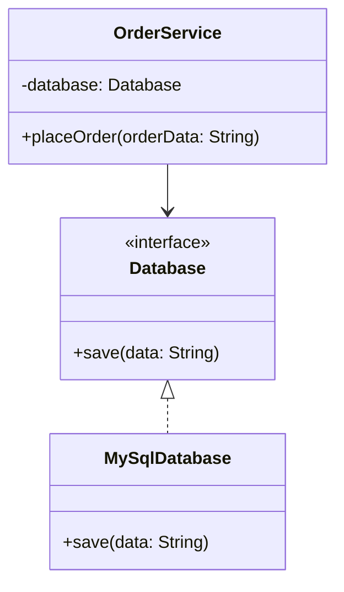

## The Principle

> **High-level modules should not depend on low-level modules. Both should depend on
> abstractions. Abstractions should not depend on details; details should depend on
> abstractions.**

That's the formal, slightly dense definition. The practical version, already previewed in Chapter
5's coupling discussion: **depend on interfaces, not concrete implementations.**

The "inversion" in the name refers to flipping the *usual* dependency direction. Normally you'd
expect a high-level policy (business logic) to depend directly on a low-level detail (a specific
database driver). DIP inverts this — both sides depend on an abstraction that sits between them,
and the low-level detail is what actually depends on (implements) that abstraction.

## The Violation

```java
class MySqlDatabase {
    void save(String data) { /* MySQL-specific save logic */ }
}

class OrderService { // high-level module
    private MySqlDatabase database = new MySqlDatabase(); // low-level module

    void placeOrder(String orderData) {
        database.save(orderData);
    }
}
```

`OrderService` (high-level: business logic) directly depends on `MySqlDatabase` (low-level:
implementation detail). This is backwards — the business rule "place an order" shouldn't care
which database technology exists underneath it, yet it's welded to one specific choice.

## The Fix: Both Sides Depend on an Abstraction

```java
interface Database { // the abstraction both sides depend on
    void save(String data);
}

class MySqlDatabase implements Database {
    public void save(String data) { /* MySQL-specific save logic */ }
}

class OrderService {
    private final Database database; // depends on the abstraction, not the detail

    OrderService(Database database) {
        this.database = database;
    }

    void placeOrder(String orderData) {
        database.save(orderData);
    }
}
```

Now `OrderService` (high-level) depends on `Database` (abstraction), and `MySqlDatabase`
(low-level) *also* depends on that same abstraction, by implementing it. Neither depends on the
other directly. Swapping to `PostgresDatabase` or an `InMemoryDatabase` for testing requires zero
changes to `OrderService`.



Notice the arrow directions: before the fix, `OrderService --> MySqlDatabase` pointed straight at a
concrete class. After the fix, both `OrderService` and `MySqlDatabase` point toward `Database` —
the dependency has been **inverted** away from the concrete low-level detail and onto a shared
abstraction.

## DIP Is Not the Same as Dependency Injection

These two terms are constantly conflated, and interviewers will notice if you conflate them too.

- **Dependency Inversion Principle (DIP)** is the *design principle*: depend on abstractions, not
  concretions.
- **Dependency Injection (DI)** is a *technique* for supplying a concrete implementation to a class
  from the outside (via constructor, setter, or field), rather than the class constructing it
  internally.

You can apply DI without DIP — passing a concrete `MySqlDatabase` object into `OrderService`'s
constructor is dependency injection, but if `OrderService`'s field is typed as `MySqlDatabase`
rather than `Database`, DIP is still violated, because `OrderService` is still coupled to the
concrete class, just constructed elsewhere. **DIP is about the type you depend on; DI is about who
constructs it.** They're complementary, and in good designs they're almost always used together,
but they answer different questions.

## Where This Shows Up in Spring Boot

If you've worked with Spring, this principle is the theoretical foundation behind `@Autowired` and
constructor injection:

```java
@Service
class OrderService {
    private final OrderRepository repository; // an interface

    OrderService(OrderRepository repository) { // Spring injects the concrete bean
        this.repository = repository;
    }
}
```

Spring's dependency injection *container* handles the mechanical wiring (DI), but the design
benefit only exists because `OrderRepository` is an interface `OrderService` depends on — the DIP
compliance is what makes the DI framework's swap-ability actually meaningful.

## Summary

- DIP: high-level modules and low-level modules should both depend on abstractions, not on each
  other directly.
- The "inversion" flips the naive dependency direction — instead of business logic depending on a
  specific implementation detail, both depend on a shared interface.
- DIP and Dependency Injection are related but distinct: DIP is about *what type* you depend on; DI
  is about *who constructs* the object you're given.
- This principle is the direct theoretical basis for why frameworks like Spring's dependency
  injection produce genuinely loosely-coupled, testable code — but only when interfaces are used
  correctly underneath.

---

## Interview Questions

**1. State the Dependency Inversion Principle precisely, and explain what "inversion" refers
to.**
DIP states that high-level modules (business logic/policy) should not depend directly on low-level
modules (implementation details); instead, both should depend on abstractions, and the
abstractions themselves should not depend on implementation details. "Inversion" refers to flipping
the naive, natural dependency direction — instead of business logic pointing directly at a specific
technical implementation, the dependency is redirected through a shared interface that the
implementation depends on (implements) instead of the other way around.
*Follow-up: Why is this called "inversion" rather than just "using interfaces"?* Because without
DIP, the natural instinct is for high-level code to directly reference and depend on low-level
details (since that's what "gets things done"); DIP requires actively reversing that instinct so
the low-level detail is the one adapting itself to fit an abstraction the high-level module
defines or depends on — a genuine flip from the default direction most developers write code in.

**2. Walk through the `OrderService`/`MySqlDatabase` example and explain exactly what changed
about the dependency direction.**
Before the fix, `OrderService` (high-level) directly instantiated and depended on the concrete
`MySqlDatabase` class (low-level) — the dependency arrow pointed from high-level straight to
low-level. After introducing the `Database` interface, both `OrderService` and `MySqlDatabase`
depend on `Database` instead: `OrderService` depends on it as a collaborator type, and
`MySqlDatabase` depends on it by implementing its contract. The direct high-level-to-low-level
dependency is eliminated entirely.
*Follow-up: Who "owns" the `Database` interface in this design — should it live in the same
package as `OrderService` or `MySqlDatabase`?* Best practice generally places the abstraction
alongside the high-level module (business logic) that defines what it needs, rather than alongside
the low-level implementation — this reflects the idea that the high-level module dictates the
contract it requires, and low-level implementations are the ones adapting to fit it, not the
reverse.

**3. What's the difference between the Dependency Inversion Principle and Dependency Injection?**
DIP is a design principle about which *type* a class depends on — an abstraction versus a concrete
implementation. Dependency Injection is a *technique* for supplying a dependency to a class from
the outside (via constructor, setter, or field) rather than having the class construct it
internally. You can perform dependency injection while still violating DIP, if the injected
dependency's declared type is a concrete class rather than an interface — the class is still
coupled to that concrete type even though it didn't construct the instance itself.
*Follow-up: Give a concrete code example of dependency injection that still violates DIP.*
`class OrderService { private final MySqlDatabase database; OrderService(MySqlDatabase database)
{ this.database = database; } }` — the dependency is injected externally (satisfying DI as a
technique), but `OrderService`'s field type is still the concrete `MySqlDatabase` class, so it
remains just as tightly coupled to that specific implementation as if it had constructed it
internally; DIP requires the field/parameter type to be an abstraction like `Database`, not merely
that construction happens elsewhere.

**4. How does DIP directly enable easier unit testing, using the `OrderService` example?**
Once `OrderService` depends on the `Database` interface rather than the concrete `MySqlDatabase`
class, a unit test can inject a lightweight fake or mock implementation of `Database` (one with no
real database connection, perhaps just storing data in an in-memory list) directly into
`OrderService`'s constructor, allowing the business logic in `placeOrder()` to be tested in complete
isolation, quickly and deterministically, with no database setup or teardown required.
*Follow-up: Would `OrderService` be testable at all if it directly instantiated
`new MySqlDatabase()` internally, without any interface?* Testing it would be far more difficult
without either a real MySQL instance available during tests (slow, environment-dependent, flaky)
or heavyweight tools that can intercept and replace `new` calls via bytecode manipulation — options
that are more complex and fragile than simply injecting a fake implementation of a well-designed
interface.

**5. Why does the principle specify that "abstractions should not depend on details"? Give an
example of an abstraction that violates this.**
This rule ensures the interface itself doesn't leak implementation-specific concepts, which would
undermine the entire point of abstracting away the detail in the first place. A violating example:
`interface Database { void executeMySqlQuery(String sql); }` — naming a method after a specific
database technology (MySQL) bakes a low-level detail directly into the supposedly technology-neutral
abstraction, meaning any code depending on this "abstraction" is still implicitly coupled to
MySQL-specific concepts, defeating the purpose of having an interface at all.
*Follow-up: How would you fix this specific violating interface?* Rename and reshape the method to
express the *behavior* being requested in technology-neutral terms —
`interface Database { void save(String data); }` — so a `PostgresDatabase` or `InMemoryDatabase`
implementation can fulfill the same contract without any hint of MySQL-specific naming or
concepts leaking through the interface itself.

**6. How does DIP relate to the Open/Closed Principle covered in Chapter 8?**
DIP is one of the primary *mechanisms* that makes OCP achievable — a class satisfies OCP (open for
extension, closed for modification) largely by depending on abstractions and letting new behavior
be added via new implementations of those abstractions, without editing the class that consumes
them. `OrderService` depending on `Database` means adding a `PostgresDatabase` implementation
extends the system's capability without modifying `OrderService` at all — DIP is what makes that
extension possible, and OCP is the resulting property of the design.
*Follow-up: Can you satisfy DIP without automatically satisfying OCP, or do they always come
together?* They're closely linked but not strictly identical — you could depend on an abstraction
(satisfying DIP) while still having an external factory or switch statement somewhere that picks
which implementation to use based on a growing `if/else` chain, which would still violate OCP at
that selection point even though the core business class itself is DIP-compliant; achieving both
fully typically requires combining DIP with a proper factory pattern (Chapter 17/18) for the
selection logic itself.

**7. What does it mean for an interface to be "owned" by the high-level module rather than the
low-level module, and why does this ownership direction matter?**
It means the abstraction is defined based on what the high-level business logic *needs*, and the
low-level implementation is written to conform to that pre-existing contract — rather than the
abstraction being an afterthought extracted from an already-written concrete implementation's
existing method signatures. This matters because an abstraction designed around the high-level
module's actual needs tends to be cleaner and more stable, while one extracted after-the-fact from a
specific implementation risks inheriting that implementation's incidental quirks and naming (as in
the "MySQL-specific abstraction" example above).
*Follow-up: Is this ownership direction a strict architectural rule enforced by Java, or purely a
design discipline?* Purely a design discipline — Java has no language mechanism that enforces which
side of an interface relationship "owns" the interface's design intent; it's a judgment call
developers and architects apply when structuring packages and modules, sometimes reinforced by
project conventions or architectural styles like Hexagonal/Ports-and-Adapters architecture.

**8. How does the Dependency Inversion Principle apply to designing a `NotificationService`
that might send emails today but needs to support SMS or push notifications later (connecting
back to Chapter 1's example)?**
`NotificationService` (high-level) should depend on a `NotificationChannel` interface (the
abstraction), not directly on a concrete `EmailSender` class. `EmailSender` (low-level) then
implements `NotificationChannel`. This is precisely DIP applied to that earlier example — and it's
also the exact mechanism that made the OCP fix in Chapter 1 and Chapter 8 possible: OCP describes
the *outcome* (new channels added without modifying `NotificationService`), and DIP describes the
*dependency structure* that produces that outcome.
*Follow-up: If `NotificationService` needed to log every notification attempt regardless of
channel, where would that logging logic go without violating DIP?* It could go directly inside
`NotificationService` itself (since logging attempts is arguably part of the notification-sending
business process, not a channel-specific detail), or, if logging needs to be swappable too
(e.ory, different logging backends), it could be extracted behind its own `Logger` abstraction that
`NotificationService` also depends on — the same DIP reasoning applied to a second, independent
concern.

**9. Does DIP mean every single class in a codebase should depend only on interfaces, with no
direct dependencies on concrete classes at all?**
No — this would be an over-application of the principle. Simple, stable data classes or value
objects (like a `Money` class or a `LineItem` record) with no meaningful variation in behavior don't
need an interface at all; depending on them directly is perfectly fine, since there's no
"implementation detail vs. abstraction" distinction to make when there's only one reasonable
implementation and no genuine need for substitutability. DIP specifically targets dependencies where
a high-level policy is coupled to a genuinely swappable or variable low-level detail (databases,
external services, notification channels), not every single class relationship in the system.
*Follow-up: How would you decide, case by case, whether a given dependency needs interface-based
inversion or can remain a direct concrete dependency?* Ask whether the concrete class represents a
genuinely swappable implementation detail (a database technology, an external API integration, a
notification mechanism) versus a stable, unlikely-to-vary data structure or utility — the former
warrants DIP, the latter typically doesn't need the extra abstraction layer.

**10. In a layered Spring Boot application, where does DIP typically manifest between the
service layer and the repository layer?**
The service layer (high-level business logic) depends on a repository *interface*
(`OrderRepository`), and the actual persistence implementation (`JpaOrderRepository`, or a
Spring Data-generated implementation) depends on and implements that interface. Spring's
dependency injection container then wires the concrete implementation into the service at runtime,
but the service class itself never directly references the concrete repository class — this is DIP
applied at exactly the layer boundary discussed in Chapter 7's SRP layering example.
*Follow-up: If a team skips defining a repository interface and has the service depend directly on
a concrete `JpaOrderRepository` class (which Spring Data JPA can technically allow), what design
principle is being violated, and what's the practical cost?* This violates DIP — the service is now
tightly coupled to the JPA-specific implementation, making it harder to swap persistence
technologies later and harder to unit test the service in isolation without a database or a
JPA-aware testing setup, even though Spring Data JPA's convenience might make this shortcut tempting
in the moment.

**11. Can a Java abstract class serve as the "abstraction" in DIP, or must it strictly be an
interface?**
An abstract class can serve this role just as well as an interface, as long as high-level and
low-level modules both depend on it rather than on a fully concrete implementation directly — DIP's
formal definition refers to "abstractions" generally, not specifically to the Java `interface`
keyword. The Chapter 3 decision framework (shared state/behavior favors abstract class, pure
contract favors interface) still applies independently when deciding which specific Java construct
to use for the abstraction.
*Follow-up: Would using an abstract class instead of an interface here limit any future design
flexibility, given Java's single-inheritance restriction?* Potentially yes — if a low-level
implementation needs to extend some other class for unrelated reasons, Java's single-class-
inheritance limit means it couldn't also extend the DIP abstraction as an abstract class, whereas
it could still implement it as an interface alongside extending something else; this is one
practical reason interfaces are more commonly used for DIP abstractions than abstract classes.

**12. How would you explain the business risk of violating DIP to a non-technical stakeholder,
without using terms like "coupling" or "abstraction"?**
Something like: "If our order-processing code is wired directly to one specific database
technology, switching database providers later — or even just testing our order logic without a
live database — becomes a much bigger, riskier project than it needs to be. Structuring the code so
our business logic doesn't care which specific technology is underneath means we can swap or test
independently, without touching the core logic that actually processes orders."
*Follow-up: Can you quantify or estimate this risk in a way that would resonate with a business
stakeholder?* You could frame it in terms of a hypothetical: "If we needed to migrate databases
next quarter, a DIP-compliant design might mean changing one class; a tightly-coupled design could
mean touching dozens of files across the business logic layer, each requiring careful re-testing" —
translating the abstract principle into a concrete migration-cost comparison.

**13. Is DIP violated if a high-level module depends on a low-level module's exception types
directly, even if it correctly depends on an interface for the main method calls?**
Yes, potentially — if `Database`'s `save()` method throws a `MySqlSpecificException` rather than a
generic or custom `DatabaseException`, callers of the interface are still indirectly coupled to a
MySQL-specific detail through the exception-handling code, even though the main method call is
properly abstracted. A fully DIP-compliant design would have the interface declare (or the
implementation wrap and re-throw as) a technology-neutral exception type that's part of the
abstraction itself, not leaked from the underlying implementation.
*Follow-up: How would you fix this in the `Database` interface example?* Define a custom
`DatabaseException` as part of the `Database` abstraction's contract, and have `MySqlDatabase` catch
any MySQL-driver-specific exceptions internally and wrap/rethrow them as this generic
`DatabaseException`, ensuring callers of the interface never need to know about or handle
MySQL-specific exception types directly.

**14. In an LLD interview, how would you justify introducing an interface purely for DIP
purposes when there's currently only one real implementation (e.g., only ever using MySQL, with
no planned migration)?**
The primary justification in that scenario is testability, not future implementation-swapping — even
with a single production implementation, depending on an interface lets you inject fast, isolated
test doubles for unit testing the business logic without a real database, which is a concrete,
present-day benefit independent of whether you'll ever actually swap databases. If testability
genuinely isn't a concern either (e.g., a throwaway script), introducing the interface purely for
DIP's sake with no other justification would be a case of over-applying the principle, similar to
premature interface creation discussed in Chapter 3.
*Follow-up: How would you weigh this decision differently for a component you're told explicitly
is likely to need multiple implementations soon (e.g., "we're evaluating both MySQL and DynamoDB")
versus one you're told is a stable, one-off internal tool?* For the former, introducing the
interface upfront is clearly justified given the explicit signal of upcoming variation; for the
latter, you'd lean toward a direct concrete dependency unless testability alone justifies the
abstraction, applying the same "does the problem signal this axis of variation" reasoning used for
OCP in Chapter 8.
