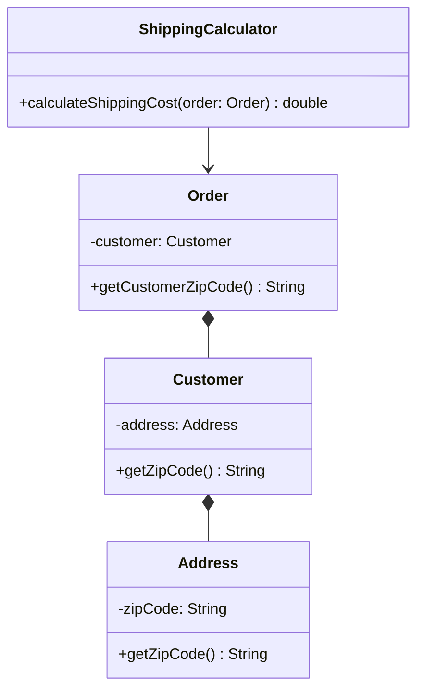

## Law of Demeter — "Only Talk to Your Immediate Friends"

> **A method of an object should only call methods belonging to: itself, its parameters, objects
> it creates, or its direct component objects — not objects returned by those calls.**

This directly formalizes the "message chain" smell flagged back in Chapter 6.

### The Violation

```java
class Order {
    private Customer customer;
    Customer getCustomer() { return customer; }
}

class Customer {
    private Address address;
    Address getAddress() { return address; }
}

class Address {
    private String zipCode;
    String getZipCode() { return zipCode; }
}

class ShippingCalculator {
    double calculateShippingCost(Order order) {
        String zip = order.getCustomer().getAddress().getZipCode(); // violation
        return lookupRateForZip(zip);
    }
}
```

`ShippingCalculator` reaches through `Order` to get a `Customer`, then through `Customer` to get an
`Address`, then finally to the `zipCode` it actually wants. It now depends on the internal
structure of **three** classes, not one — if `Customer` ever changes how it stores an address (say,
supporting multiple addresses), `ShippingCalculator` breaks even though it has no direct
relationship with `Customer` at all.

### The Fix

```java
class Order {
    private Customer customer;
    String getCustomerZipCode() { return customer.getZipCode(); }
}

class Customer {
    private Address address;
    String getZipCode() { return address.getZipCode(); }
}

class ShippingCalculator {
    double calculateShippingCost(Order order) {
        String zip = order.getCustomerZipCode(); // only one hop
        return lookupRateForZip(zip);
    }
}
```

Each class exposes exactly what its immediate callers need, delegating internally. This is often
described as "tell, don't ask" — `ShippingCalculator` *tells* `Order` what it needs, rather than
*asking* for internal objects and reaching in itself.



Notice `ShippingCalculator` now only depends on `Order` — the arrow to `Customer` and `Address` is
gone from its perspective entirely, even though the data still flows through them internally.

### Where the Line Sits

Law of Demeter is easy to over-apply into absurdity — forcing every single class to expose a
delegating method for every nested field would produce enormous, bloated interfaces (directly
conflicting with ISP from Chapter 10). The practical version most engineers apply: **avoid chains
through objects you don't own or that represent a different layer of abstraction**, but calling a
method on an object *returned by a parameter* that belongs to the same conceptual layer is
generally fine (e.g., `order.getLineItems().size()` is usually acceptable, since `List` is a
standard, stable, "safe to chain through" utility type — the concern is chaining through *your own
domain objects'* structure, not standard library collections).

## Composition Over Inheritance — Full Circle

This guideline was previewed in Chapter 2. With SOLID now covered, we can state precisely *why* it
holds:

- Inheritance often violates **LSP** the moment a subclass can't honestly satisfy every part of the
  parent's contract (Chapter 9).
- Inheritance often violates **OCP** because behavior baked into a class hierarchy at compile time
  can't be reconfigured without new subclasses — and combinatorial variations
  (`PetrolAutomaticCar`, `ElectricManualCar`, ...) explode class counts (Chapter 8).
- Inheritance can violate **ISP** when a broad base class forces subclasses to inherit methods they
  don't need (Chapter 10).
- Composition sidesteps all three, because there's no substitutability contract being made at
  all — you're just wiring together collaborating objects.

### A Combinatorial Explosion, Made Concrete

```java
// Inheritance approach — explodes as variations multiply
class PetrolCar extends Car { }
class ElectricCar extends Car { }
class PetrolAutomaticCar extends PetrolCar { }
class PetrolManualCar extends PetrolCar { }
class ElectricAutomaticCar extends ElectricCar { }
class ElectricManualCar extends ElectricCar { }
// 2 engine types x 2 transmission types = 4 classes, and growing multiplicatively
```

```java
// Composition approach — scales additively, not multiplicatively
interface Engine { void start(); }
interface Transmission { void shift(); }

class Car {
    private final Engine engine;
    private final Transmission transmission;

    Car(Engine engine, Transmission transmission) {
        this.engine = engine;
        this.transmission = transmission;
    }
}
// 2 engine classes + 2 transmission classes = 4 classes total, and any combination
// is just a Car constructed with the right pair — no new class needed, ever.
```

This is precisely the reasoning behind the **Strategy pattern** (Chapter 28) and **Decorator
pattern** (Chapter 24) — both formalize "swap in behavior via composition" as a reusable, named
solution.

## Summary

- **Law of Demeter**: only call methods on objects you directly hold a reference to — don't chain
  through the internal structure of objects you don't own.
- Message chains (`a.getB().getC().getD()`) signal LoD violations and create hidden coupling to
  multiple classes' internal structure at once.
- The fix is "tell, don't ask" — expose a method that does the work internally, rather than
  exposing internal structure for callers to reach through.
- **Composition over inheritance** avoids LSP, OCP, and ISP risks simultaneously by never making a
  substitutability promise in the first place — variations are composed additively instead of
  multiplying combinatorially through subclassing.

---

## Interview Questions

**1. State the Law of Demeter and explain the "immediate friends" metaphor.**
The Law of Demeter states a method should only invoke methods on itself, its parameters, objects it
creates internally, or its own direct component (field) objects — not on objects obtained by
calling methods on those. "Immediate friends" refers to this limited set of objects a method is
allowed to interact with directly; anything beyond that first hop is treated as a "friend of a
friend," which the method shouldn't reach into directly.
*Follow-up: Is the Law of Demeter considered one of the SOLID principles?* No — it's a separate,
complementary guideline, not one of the five SOLID principles, though it reinforces the same
underlying goal of reducing coupling that DIP and ISP also serve.

**2. Walk through the `ShippingCalculator` message-chain example and explain the fix.**
The violation, `order.getCustomer().getAddress().getZipCode()`, couples `ShippingCalculator` to the
internal structure of three separate classes — `Order`, `Customer`, and `Address` — any of which
changing its internal representation could break `ShippingCalculator`, despite it having no direct
design relationship with `Customer` or `Address`. The fix adds a delegating method,
`order.getCustomerZipCode()`, so `ShippingCalculator` depends only on `Order`'s public contract,
while `Order` and `Customer` internally handle delegating the call down to where the data actually
lives.
*Follow-up: Does this fix mean `Address` is no longer needed at all in the design?* No —
`Address` still exists and holds the `zipCode` data; the fix doesn't eliminate the class
relationships, it just ensures external callers (`ShippingCalculator`) don't need to know that
those intermediate relationships exist at all, interacting only with the outermost class's public
contract.

**3. What is the "tell, don't ask" principle, and how does it relate to the Law of Demeter?**
"Tell, don't ask" means you should tell an object what you want done (calling a method that
performs the work internally) rather than asking it for its internal data and then performing the
logic yourself externally. This is essentially the practical technique for satisfying the Law of
Demeter — instead of asking `Order` for its `Customer`, then asking `Customer` for its `Address`,
you tell `Order` "give me the zip code" and let it handle the internal delegation.
*Follow-up: Give an example where "asking" (getting data out) is actually the more appropriate
choice over "telling."* When a caller genuinely needs to display or transform raw data in ways the
owning object shouldn't need to know about — for example, a UI rendering component that needs an
`Order`'s list of line items to build a table, it's reasonable to ask for that list directly (via
`order.getLineItems()`) rather than forcing `Order` to know about UI rendering concerns; "tell,
don't ask" is strongest when the caller would otherwise have to reach through *multiple* layers of
internal structure to compute business logic that conceptually belongs elsewhere.

**4. Is calling `order.getLineItems().size()` a Law of Demeter violation? Why or why not?**
This is generally considered acceptable in practice, even though it's technically chaining two
method calls, because `List` (the return type of `getLineItems()`) is a standard, stable utility
type from the Java standard library, not one of your own domain objects whose internal structure
you're reaching through. The Law of Demeter is primarily concerned with avoiding coupling to the
internal structure of your *own domain model*, not with forbidding any two consecutive method calls
whatsoever.
*Follow-up: Would `order.getLineItems().get(0).getProduct().getSupplier().getName()` also be
acceptable by this same reasoning?* No — this chain reaches deep into domain objects
(`LineItem`, `Product`, `Supplier`) well beyond the standard-library exception, and represents
exactly the kind of multi-layer domain coupling the Law of Demeter warns against; it should be
replaced with a delegating method on `Order` or `LineItem` that encapsulates this traversal
internally.

**5. How can over-applying the Law of Demeter lead to an Interface Segregation Principle
violation?**
If you mechanically add a delegating "wrapper" method to every class for every possible nested
field access some caller might someday want, each class's public interface balloons with dozens of
narrow, single-purpose delegate methods that most callers never use — this bloats the interface in
a way directly analogous to the fat-interface problem ISP addresses, just arrived at via excessive
Law of Demeter compliance rather than careless initial design.
*Follow-up: How do you decide which delegating methods are actually worth adding versus
over-engineering?* Add a delegating method only when a real, current caller genuinely needs that
specific piece of information or behavior — following YAGNI's discipline (Chapter 12) rather than
speculatively wrapping every conceivable nested field access in advance of any actual demand for it.

**6. Explain, step by step, why favoring composition over inheritance reduces the risk of an LSP
violation.**
LSP violations arise specifically from broken substitutability promises within an inheritance
hierarchy — a subclass failing to honor the behavioral contract its parent established. Composition
makes no such promise in the first place: a `Car` holding an `Engine` reference isn't claiming to
*be* substitutable for anything, it's simply delegating specific behavior to a collaborator object.
Since there's no "is-a" claim being made, there's no substitutability contract that composition
could possibly violate — the entire category of LSP risk is structurally absent.
*Follow-up: Does this mean composition-based designs can never have any behavioral correctness
bugs at all?* No — composition can still have plenty of ordinary bugs (an `Engine` implementation
that behaves incorrectly, or a `Car` that wires the wrong `Engine` in), but these are ordinary
implementation bugs, not the specific structural category of substitutability violation that LSP
is concerned with.

**7. Walk through the combinatorial explosion example (`PetrolAutomaticCar`,
`ElectricManualCar`, etc.) and explain precisely why composition scales better.**
With inheritance, every new independent dimension of variation (engine type, transmission type,
and potentially more later — drivetrain, body style) multiplies the total number of required
subclasses, since each combination needs its own concrete class. With composition, each dimension
of variation is represented by its own small interface hierarchy (`Engine`, `Transmission`), and a
`Car` is simply constructed with whichever combination is needed at runtime — the total number of
classes grows additively (one new class per new variant within a dimension) rather than
multiplicatively (one new class per combination across all dimensions).
*Follow-up: If a third dimension, `DrivetrainType` (front-wheel, rear-wheel, all-wheel), were
added, how would the class count compare between the two approaches?* With inheritance, the class
count would multiply again — 2 engines × 2 transmissions × 3 drivetrains = 12 subclasses. With
composition, you'd simply add 3 `Drivetrain` implementations, bringing the total to 2 + 2 + 3 = 7
classes overall, with every one of the 12 possible combinations achievable by constructing a `Car`
with the right three components — no new class needed for any combination.

**8. Can the Law of Demeter apply to static method calls or utility classes, or is it strictly
about instance method chaining?**
The core concern — avoiding coupling to the internal structure of objects you don't directly
own — applies most clearly to instance method chains through domain objects, since static utility
methods (like `Collections.sort(list)` or `Math.max(a, b)`) don't expose or depend on any particular
object's internal structure in the same way; calling a static utility method isn't "reaching
through" anything, so it's not typically considered a Law of Demeter concern at all.
*Follow-up: What about a static factory method that returns a domain object, like
`OrderFactory.createDefault().getCustomer().getName()` — does the Law of Demeter apply here?* Yes —
the concern reappears once you're chaining through the *returned domain object's* structure
(`.getCustomer().getName()`), regardless of whether the object came from a static factory method or
an instance field; the violation is about chaining through domain object structure, not about how
the first object in the chain was obtained.

**9. In an LLD interview, how would you defend a design that includes a small message chain
(two method calls deep) if the interviewer flags it as a Law of Demeter concern?**
Evaluate whether the chain crosses genuine domain-object boundaries you don't own, or whether it's
a shallow, stable chain through something like a standard collection type — if it's the latter,
explain that reasoning directly ("this is chaining through a `List`, which is a stable, standard
type, not reaching into our own domain model's internal structure"). If it genuinely is a
domain-object chain, acknowledge the concern and propose the delegating-method fix rather than
defending the chain as-is.
*Follow-up: Is there a risk of appearing inflexible if you defend every two-hop chain as
acceptable?* Yes — the goal is calibrated judgment, not blanket defense; be ready to concede and fix
genuine violations while confidently distinguishing them from the standard-library exception case,
since conflating the two either way (over-flagging everything or defending everything) signals
weaker judgment than correctly distinguishing between them.

**10. How does the Law of Demeter interact with the Builder pattern (previewed in Chapter 19),
which often involves fluent method chaining like
`new PizzaBuilder().setSize(LARGE).addTopping(CHEESE).build()`?**
This is generally not considered a Law of Demeter violation, because each method in the fluent
chain returns the *same* builder object (`this`) rather than a different object whose internal
structure is being reached into — you're calling multiple methods on the *same* immediate friend
repeatedly, not chaining through a sequence of different, unrelated objects' internals. The Law of
Demeter is concerned with reaching through *different* objects' structure, not with calling
multiple methods on one object you already legitimately hold a reference to.
*Follow-up: Would the concern change if `addTopping()` returned a different, new object each time
instead of `this`?* If each call returned a genuinely different object type representing an
intermediate state, and the final `.build()` call were reaching through that returned object's own
further nested structure, it could reintroduce Law-of-Demeter-style concerns — but the standard
fluent Builder pattern deliberately returns the same builder instance (`this`) at each step
specifically to avoid this issue.

**11. Is there a scenario where strictly following the Law of Demeter would actually make code
worse, not better?**
Yes — if a class's only real purpose is to serve as a thin data-transfer object (DTO) with no
meaningful business logic of its own, forcing it to implement delegating wrapper methods purely to
avoid a two-hop chain elsewhere adds ceremony without benefit, since DTOs are meant to be
transparent data carriers, not encapsulated behavior-bearing domain objects. The Law of Demeter's
value is highest for objects with real behavior and invariants to protect (per Chapter 2's
encapsulation discussion) — applying it rigidly to simple, intentionally-transparent data
structures can be counterproductive.
*Follow-up: How would you distinguish, in an interview, between a class that should follow strict
Law of Demeter discipline versus one that's intentionally a transparent data carrier?* Ask whether
the class protects any invariants or encapsulates any real behavior beyond holding data — a
`ParkingTicket` with fields like `entryTime` and `spotId` and no complex internal logic is a
reasonable candidate for direct field/getter access, while a class like `Order` that coordinates
calculations, state transitions, or business rules warrants the stricter Law of Demeter treatment.

**12. Give a real-world Java standard library example of favoring composition over
inheritance.**
`java.util.Stack` is a well-known counter-example — it extends `Vector`, inheriting all of
`Vector`'s list-like methods (`insertElementAt`, `removeElementAt`), which breaks the stack
abstraction's discipline of only pushing/popping from one end, since callers can bypass the stack
interface entirely and manipulate it like an arbitrary list. Java's newer `Deque` interface
(via `ArrayDeque`), by contrast, is generally recommended for stack-like usage today specifically
because it's used through composition/interface-based design rather than inheriting from a general-
purpose list class, keeping the stack discipline intact.
*Follow-up: Why wasn't `Stack` redesigned to fix this, given it's a well-known design flaw?*
Backward compatibility — `Stack` has been part of the JDK since Java 1.0, and changing its class
hierarchy now would break any existing code that relies on `Stack` being a `Vector` (e.g., code
that passes a `Stack` somewhere a `Vector` or `List` is expected); this is the same
backward-compatibility trade-off discussed regarding marker interfaces in Chapter 3.

**13. How would you explain the relationship between the Law of Demeter and encapsulation
(Chapter 2) to someone who thinks they're the same concept?**
Encapsulation is about a class protecting its *own* internal state from being directly modified by
outside code (private fields, controlled mutation through validating methods). The Law of Demeter is
about how a class *interacts with other objects* — even objects with perfectly good encapsulation of
their own state can still be chained through in a way that couples the caller to the shape of the
overall object graph. Encapsulation protects one object's own invariants; the Law of Demeter limits
how far a caller reaches across multiple objects' public interfaces.
*Follow-up: Can a class have perfect encapsulation of its own fields yet still be involved in a Law
of Demeter violation as a caller?* Yes — a class can have entirely private, well-protected fields of
its own while its *methods* still commit Law of Demeter violations by chaining through other
classes' public getters (like `ShippingCalculator` calling `order.getCustomer().getAddress()...`) —
the two concerns are about different objects' responsibilities: the object being encapsulated versus
the object doing the (potentially excessive) reaching.

**14. If you had to pick just one of these two guidelines (Law of Demeter or Composition over
Inheritance) to explain first when introducing a junior engineer to good object-oriented design,
which would you choose and why?**
Composition over inheritance is arguably the more foundational, higher-leverage guideline to
introduce first, since it shapes the fundamental structural decisions (how classes relate to each
other) made at the very start of designing a system, whereas the Law of Demeter is more of a
day-to-day coding discipline applied continuously as methods are written on top of an already-
established class structure. Getting the composition-vs-inheritance decision right early prevents
entire categories of downstream problems (including many Law of Demeter violations, since deep
inheritance hierarchies often invite exactly the kind of chained internal-structure access the Law
of Demeter warns against) that would otherwise need to be corrected method-by-method later.
*Follow-up: Is there a case where introducing the Law of Demeter first would actually make more
sense pedagogically?* If the junior engineer is already writing code within an existing, mature
codebase (rather than designing a new system from scratch), the Law of Demeter's day-to-day
coding-discipline nature might be the more immediately actionable lesson, since they'll be writing
individual methods against an already-established class structure far more often than making
foundational composition-versus-inheritance architectural decisions in their early days on a team.
