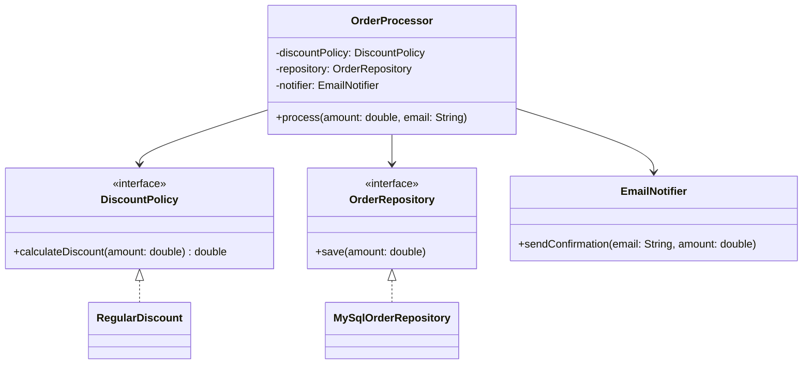

## The Exercise

Every principle in Part 2 has been shown in isolation. Real LLD problems never hand you one
violation at a time — they hand you a messy class with several problems tangled together, and
expect you to untangle them in the right order. This chapter does exactly that, start to finish,
with one class.

## The Starting Point: A Genuinely Bad Class

```java
class OrderProcessor {
    private MySqlConnection connection = new MySqlConnection();

    void process(String orderType, double amount, String customerEmail) {
        // calculate discount
        double discount = 0;
        if (orderType.equals("REGULAR")) {
            discount = amount * 0.05;
        } else if (orderType.equals("PREMIUM")) {
            discount = amount * 0.10;
        } else if (orderType.equals("VIP")) {
            discount = amount * 0.20;
        }
        double finalAmount = amount - discount;

        // save to database
        connection.executeMySqlQuery("INSERT INTO orders VALUES (" + finalAmount + ")");

        // send confirmation email
        System.out.println("Sending email to " + customerEmail +
            ": Your order total is " + finalAmount);
    }
}
```

Take a moment to spot every violation before reading on — this is exactly the diagnostic step an
interviewer expects, whether they show you code like this directly or you produce something like
it in your own first draft under time pressure.

## Step 1: Diagnose Every Violation

| Violation | Where | Which Principle |
|---|---|---|
| Three unrelated jobs in one class | discount calc + persistence + email | **SRP** (Ch. 7) |
| `if/else` chain over order type | discount calculation | **OCP** (Ch. 8) |
| Direct dependency on `MySqlConnection` | field declaration | **DIP** (Ch. 11) |
| Abstraction leaking implementation detail | `executeMySqlQuery` naming | **DIP** (Ch. 11) |
| No interfaces at all — nothing is swappable | entire class | **DIP**, **OCP** |

Notice ISP and LSP aren't violated here — there's no interface at all yet, so there's nothing to
segregate, and no inheritance hierarchy, so there's no substitutability to break. **Not every
principle applies to every piece of code**, and forcing an ISP or LSP fix where none is needed
would itself be over-engineering (Chapter 12).

## Step 2: Fix SRP First — It Untangles Everything Else

SRP is always the right starting point, because splitting responsibilities makes every subsequent
fix cleaner to apply to a smaller, focused piece of code.

```java
class DiscountCalculator {
    double calculateDiscount(String orderType, double amount) {
        if (orderType.equals("REGULAR")) return amount * 0.05;
        if (orderType.equals("PREMIUM")) return amount * 0.10;
        if (orderType.equals("VIP")) return amount * 0.20;
        return 0;
    }
}

class OrderRepository {
    private MySqlConnection connection = new MySqlConnection();
    void save(double amount) {
        connection.executeMySqlQuery("INSERT INTO orders VALUES (" + amount + ")");
    }
}

class EmailNotifier {
    void sendConfirmation(String email, double amount) {
        System.out.println("Sending email to " + email + ": Your order total is " + amount);
    }
}

class OrderProcessor {
    private DiscountCalculator discountCalculator = new DiscountCalculator();
    private OrderRepository repository = new OrderRepository();
    private EmailNotifier notifier = new EmailNotifier();

    void process(String orderType, double amount, String customerEmail) {
        double discount = discountCalculator.calculateDiscount(orderType, amount);
        double finalAmount = amount - discount;
        repository.save(finalAmount);
        notifier.sendConfirmation(customerEmail, finalAmount);
    }
}
```

Three classes now, each with one job. `OrderProcessor` has shifted from doing the work itself to
**coordinating** three collaborators — this is a common and healthy shape for a class to end up in
after an SRP pass.

## Step 3: Fix OCP Inside `DiscountCalculator`

The `if/else` chain survived the SRP split — it's now isolated in one place, but it's still a
violation on its own.

```java
interface DiscountPolicy {
    double calculateDiscount(double amount);
}

class RegularDiscount implements DiscountPolicy {
    public double calculateDiscount(double amount) { return amount * 0.05; }
}

class PremiumDiscount implements DiscountPolicy {
    public double calculateDiscount(double amount) { return amount * 0.10; }
}

class VipDiscount implements DiscountPolicy {
    public double calculateDiscount(double amount) { return amount * 0.20; }
}
```

`DiscountCalculator` itself disappears as a class with logic in it — its job is now fully expressed
through the `DiscountPolicy` interface and its implementations.

## Step 4: Fix DIP Inside `OrderRepository`

```java
interface OrderRepository {
    void save(double amount);
}

class MySqlOrderRepository implements OrderRepository {
    private MySqlConnection connection = new MySqlConnection();
    public void save(double amount) {
        connection.executeMySqlQuery("INSERT INTO orders VALUES (" + amount + ")");
    }
}
```

Note the MySQL-specific detail (`executeMySqlQuery`) is now safely contained *inside*
`MySqlOrderRepository` — it doesn't leak into the interface, satisfying the "abstractions should
not depend on details" rule from Chapter 11.

## Step 5: Wire It All Together With Dependency Injection

```java
class OrderProcessor {
    private final DiscountPolicy discountPolicy;
    private final OrderRepository repository;
    private final EmailNotifier notifier;

    OrderProcessor(DiscountPolicy discountPolicy, OrderRepository repository,
                   EmailNotifier notifier) {
        this.discountPolicy = discountPolicy;
        this.repository = repository;
        this.notifier = notifier;
    }

    void process(double amount, String customerEmail) {
        double discount = discountPolicy.calculateDiscount(amount);
        double finalAmount = amount - discount;
        repository.save(finalAmount);
        notifier.sendConfirmation(customerEmail, finalAmount);
    }
}
```

`OrderProcessor` now depends on three abstractions, injected from outside. It has zero knowledge of
MySQL, of `if/else` discount logic, or of how emails are actually sent. Every one of those concerns
can change, or gain new implementations, without touching this class.



## The Order Matters: Why SRP Goes First

If OCP or DIP had been tackled before SRP, the fixes would have had to happen *inside* one
tangled class, making each change riskier and harder to isolate. Splitting responsibilities first
gives each subsequent principle a small, focused target to apply to — this ordering (SRP →
everything else) is a reliable default sequence for any refactoring exercise you're handed cold in
an interview.

## Summary

- Real violations rarely arrive one at a time — diagnosing a messy class means checking it against
  all five SOLID principles methodically, not fixing the first thing you notice.
- Not every principle applies to every piece of code — don't force an ISP or LSP fix where no
  interface or inheritance hierarchy exists yet.
- **Fix SRP first.** It splits a tangled class into focused pieces, making every subsequent
  principle easier to apply correctly to a smaller surface area.
- The end state of a well-refactored coordinator class is often thin: it delegates to injected
  abstractions and contains little logic of its own — that's a feature, not a sign the class has
  become "useless."

---

## Interview Questions

**1. Given a messy class like the original `OrderProcessor`, what's the first thing you should
check for, and why start there?**
Check for a Single Responsibility Principle violation first — look for multiple unrelated concerns
bundled into the same class (in this example: discount calculation, persistence, and email
notification). Starting with SRP is preferred because splitting the class into focused pieces first
makes every other violation (OCP's conditional chain, DIP's concrete dependency) isolated to a
smaller, more manageable piece of code, rather than needing to be untangled from within one large,
multi-purpose class simultaneously.
*Follow-up: Is SRP always the correct principle to fix first, in every scenario?* It's a strong
general default, but not an absolute rule — if a class already has a single, clear responsibility
but still has an OCP violation (like a fee calculator with one job but a growing `if/else` chain),
there's no SRP splitting needed at all, and you'd go directly to the OCP fix; the "SRP first"
heuristic mainly applies when multiple unrelated concerns are tangled together in the same class.

**2. Why does the original `OrderProcessor` not have any Interface Segregation or Liskov
Substitution violations, even though it violates SRP, OCP, and DIP?**
ISP requires an existing interface to segregate — the original code has no interfaces at all, so
there's nothing to split. LSP requires an inheritance or interface-implementation relationship
where substitutability could be broken — there's no class hierarchy present in the original code
either. Both principles are structurally inapplicable until interfaces or inheritance are
introduced as part of the refactor; this illustrates that a real violation diagnosis should check
which principles actually *apply* to the code in front of you, not mechanically look for all five
in every snippet.
*Follow-up: Could introducing new interfaces during the DIP fix ever accidentally introduce a new
ISP or LSP violation that wasn't there before?* Yes, in principle — if the newly introduced
`OrderRepository` interface bundled unrelated methods (e.g., also including notification-sending
methods for no good reason), that would be a fresh ISP violation created by the refactor itself;
it's worth re-checking newly introduced abstractions against all five principles, not just the one
you were originally trying to fix.

**3. Explain why splitting `OrderProcessor` into `DiscountCalculator`, `OrderRepository`, and
`EmailNotifier` classes (the SRP step) doesn't yet fix the OCP violation, and why that's
expected.**
The `if/else` chain for discount calculation is simply relocated into the new
`DiscountCalculator` class during the SRP split — its underlying structure (a conditional chain
that must be edited for every new order type) is unchanged, so the OCP violation persists, just
now isolated to one focused class instead of buried inside a larger one. This is expected and
correct: SRP and OCP address different dimensions of design quality, and fixing one doesn't
automatically fix the other, though isolating the violation to a smaller class does make the
subsequent OCP fix easier and lower-risk to apply.
*Follow-up: Is it ever acceptable to stop after just the SRP fix and leave the OCP violation
unaddressed?* In a real-world context with limited time or low expected future variation in order
types, this could be an acceptable, pragmatic stopping point (echoing the KISS/YAGNI trade-offs
from Chapter 12) — but in an LLD interview specifically, if the problem statement or interviewer
signals that discount rules will grow or vary, leaving this violation unaddressed would likely be
viewed as an incomplete design.

**4. Walk through why `MySqlOrderRepository.executeMySqlQuery(...)` being renamed conceptually
(moved behind a generic `save()` method on the `OrderRepository` interface) matters for DIP
compliance, beyond just introducing an interface.**
Simply wrapping `MySqlConnection` inside a class that implements an interface isn't enough if the
interface's own method names or parameters still leak MySQL-specific concepts — the DIP fix
requires the abstraction itself (`OrderRepository.save(double amount)`) to be expressed in
technology-neutral terms, with the MySQL-specific detail (`executeMySqlQuery`) fully contained
inside the implementing class and never exposed through the interface's contract. An interface with
a leaky, technology-specific method signature only provides superficial DIP compliance while still
coupling every caller to MySQL-specific concepts indirectly.
*Follow-up: How would you recognize this "superficial DIP compliance" problem when reviewing an
interface someone else designed?* Check whether any method names, parameter types, or return types
on the interface reference a specific technology, vendor, or implementation detail (like
"MySql," "Jdbc," or a vendor-specific exception type) — a properly abstracted interface should read
naturally regardless of which concrete technology eventually implements it.

**5. After the full refactor, `OrderProcessor` contains very little logic of its own — it mostly
just calls three injected dependencies in sequence. Is this a sign the refactor went too far, or
is this the expected, healthy outcome?**
This is the expected, healthy outcome, not a red flag. A well-refactored coordinator class's job is
to orchestrate collaborators, not to contain business logic itself — the actual logic (discount
rules, persistence details, notification formatting) correctly lives in the specialized classes it
delegates to. A coordinator class becoming "thin" is a natural and desirable consequence of
correctly applying SRP and DIP, not a sign of over-engineering.
*Follow-up: At what point would a coordinator class becoming "thin" actually indicate a problem?*
If the coordination logic itself becomes trivial to the point of being unnecessary (e.g., if
`OrderProcessor` did nothing but call a single method on a single dependency with no real
sequencing or coordination happening), that might suggest the coordinator class itself could be
eliminated entirely, with callers invoking the one remaining dependency directly — but with three
genuinely sequenced steps (calculate discount, then persist, then notify), a coordinating class
still earns its place.

**6. If a new requirement arrived — "VIP customers should also get free expedited shipping
noted in their confirmation email" — walk through which of the refactored classes would need to
change, and confirm this doesn't violate OCP.**
`EmailNotifier.sendConfirmation()` would likely need a new parameter or an extended message format
to include shipping information, and the caller (`OrderProcessor.process()`) would need to
determine and pass along whether expedited shipping applies. This does involve modifying existing
code (`EmailNotifier` and `OrderProcessor`), which might initially look like an OCP violation — but
it's worth recognizing that OCP protects against modification specifically along axes of variation
you've already built an abstraction for (like discount policies); a genuinely new, previously
unanticipated requirement affecting the notification's content isn't automatically an OCP failure,
since OCP was never claimed to cover every conceivable future change, only the specific axis
(discount calculation) the design was built to be open along.
*Follow-up: How would you redesign the email notification step if this exact kind of variation
(different message content or format based on customer type) becomes a recurring pattern?* At that
point, introducing an `EmailContentStrategy`-style interface (mirroring the `DiscountPolicy`
pattern) to compute customer-specific email content would extend OCP-style extensibility to this
new axis of variation — but doing so preemptively, before this pattern actually recurred, would
have been an unjustified YAGNI violation at the time of the original refactor.

**7. In the final design, is `EmailNotifier` behind an interface like `DiscountPolicy` and
`OrderRepository` are, or is it left as a concrete class? Is that inconsistent?**
In the walkthrough as shown, `EmailNotifier` was left as a concrete class while `DiscountPolicy` and
`OrderRepository` were abstracted behind interfaces — this isn't an inconsistency, but a deliberate
reflection of which dependencies the problem statement signaled as genuinely variable. Discount
rules were shown varying by order type, and persistence technology is a classically swappable
detail; nothing in the scenario suggested multiple notification mechanisms were needed, so
introducing a `NotificationChannel` interface here (as Chapters 1 and 8 did in a different example)
would have been justified only if that variation were actually signaled.
*Follow-up: If the interviewer then said "we also need to support SMS notifications," how would
you extend this specific design?* Introduce a `NotificationChannel` interface (directly reusing the
pattern from Chapter 1/8's example) with `EmailNotifier` and a new `SmsNotifier` both implementing
it, and have `OrderProcessor` depend on the interface instead of the concrete `EmailNotifier` class
— applying DIP/OCP to this dependency now that the problem has actually signaled the need, exactly
matching the incremental-refactoring principle demonstrated throughout this chapter.

**8. Why is it useful, as a diagnostic habit, to build a table (violation → location → principle)
before writing any refactored code, rather than fixing issues as you spot them one at a time?**
Building the table first ensures you have a complete picture of every issue before committing to a
fix order — fixing issues ad hoc as you notice them risks making a change (like jumping straight to
the DIP fix) that has to be partially redone once you realize an SRP split would have made that same
fix simpler and more isolated. It also demonstrates, out loud in an interview, that you're
approaching the refactor systematically rather than reactively, which interviewers generally view
as a stronger signal of design maturity.
*Follow-up: Is there a risk that building this complete diagnostic table takes too much interview
time relative to its value?* For a class of this size (a few dozen lines, three clear violations),
the diagnostic step should take well under a minute of verbal reasoning — the time investment is
justified because it prevents costlier, less organized fixing later; for a much larger, more
complex class, you'd likely narrate the most obvious 2–3 violations first and address further ones
iteratively rather than attempting an exhaustive upfront table.

**9. Does refactoring `OrderProcessor` through all five SOLID principles guarantee the resulting
design is "done" and needs no further consideration?**
No — SOLID compliance addresses structural design quality (coupling, cohesion, extensibility) but
doesn't address other real concerns like error handling (what happens if `repository.save()`
throws an exception mid-process?), concurrency (what if `process()` is called from multiple threads
simultaneously?), or transactional consistency (should the save and the discount calculation be
atomic together?). A SOLID-compliant design is a strong structural foundation, not a complete
functional specification.
*Follow-up: Which of these additional concerns would you expect an LLD interviewer to raise as a
follow-up after a SOLID-focused refactor like this one?* Error handling is the most commonly raised
follow-up in practice — for example, "what happens if the email fails to send after the order was
already saved?" — which tests whether you think about partial-failure scenarios and whether the
sequence of operations in `process()` needs reordering, retry logic, or compensating actions,
beyond pure structural SOLID compliance.

**10. If time were extremely limited in an interview, which SOLID fix would you prioritize
completing fully, and which would you be comfortable leaving partially addressed or verbally
described rather than fully coded?**
Prioritize completing the SRP split fully in actual code, since it's foundational and relatively
quick to implement, and clearly narrate the OCP and DIP fixes even if you don't have time to write
every implementing class out in full — for example, sketching the `DiscountPolicy` interface and
one implementing class while verbally stating "the other two customer types would follow the same
pattern" is a reasonable time-saving move that still demonstrates full understanding of the fix.
*Follow-up: Would an interviewer typically penalize you for verbally describing rather than fully
coding every repetitive implementing class (like all three discount policy classes)?* Generally no
— once the pattern is clearly established with one or two concrete examples, most interviewers
accept verbal confirmation that the remaining, structurally identical classes would follow the same
shape, reserving their scrutiny for whether you correctly identified and structured the underlying
pattern itself, not for typing out every repetitive instance of it.

**11. How would you unit test the final, refactored `OrderProcessor` class, and how does this
differ from testing the original, unrefactored version?**
The refactored `OrderProcessor` can be tested by injecting fake/mock implementations of
`DiscountPolicy`, `OrderRepository`, and a testable `EmailNotifier` (or an interface for it, if
introduced), verifying that `process()` correctly sequences calls to each — calculating the
discount, saving the resulting amount, and triggering notification — entirely without a real
database, real email sending, or real discount business logic execution. Testing the *original*
unrefactored version would have required either a real MySQL connection and capturing console
output, or complex mocking of a concrete class's internals, making the test slower, more brittle,
and less isolated to the actual sequencing logic being verified.
*Follow-up: What specific behavior would a unit test for the refactored `OrderProcessor` want to
verify, given that the actual discount/persistence/notification logic is now tested separately in
each of their own classes?* It should verify the *orchestration* itself — that
`discountPolicy.calculateDiscount()` is called with the right input, that the result is correctly
used to compute `finalAmount`, that `repository.save()` receives that correct `finalAmount`, and
that `notifier.sendConfirmation()` is called with the right email and amount — essentially testing
that `OrderProcessor` correctly wires its collaborators together, not re-testing each
collaborator's own internal logic.

**12. Suppose an interviewer, midway through this exact refactor, asks "why not just make
`DiscountPolicy` an abstract class instead of an interface, since all three implementations are so
simple?" How would you respond?**
Reference the Chapter 3 decision framework: since `RegularDiscount`, `PremiumDiscount`, and
`VipDiscount` share no common state or method implementation — only the single-method contract —
there's no shared code an abstract class would provide any benefit for capturing, so an interface
is the more appropriate, minimal choice. If a genuinely shared piece of logic emerged later (e.g., a
common rounding step every discount policy needs), that would be a legitimate signal to reconsider
an abstract class, or a shared default method / composed helper, at that point.
*Follow-up: Would your answer change if all three discount policies needed to log every
calculation to a shared audit trail in an identical way?* If that shared logging behavior were
truly identical logic across all implementations, it would be a reasonable signal to introduce a
shared abstract class (or a default method on the interface, or a separate composed
`AuditLogger` dependency) to avoid duplicating that logging code across all three classes,
following the DRY reasoning from Chapter 12 in combination with the Chapter 3 abstract-class
decision framework.

**13. Does this refactoring exercise change if `OrderProcessor` needs to support processing
orders within a database transaction (all three steps succeed or all roll back together)? How
would SOLID-compliant design accommodate this new constraint?**
This introduces a new, genuine requirement (transactional consistency) that the original refactor
didn't address — accommodating it doesn't require abandoning the SOLID structure, but does mean
`OrderRepository`'s interface might need transaction-related methods (or the coordination of
transaction boundaries might move up into `OrderProcessor` or a dedicated transaction-management
collaborator), while still keeping persistence, discount calculation, and notification as separate,
DIP-compliant abstractions. The key insight is that new functional requirements are accommodated by
extending or adjusting the existing abstractions, not by re-merging the separated responsibilities
back together.
*Follow-up: Should the `EmailNotifier` call also be included within the same transaction boundary
as the database save, given that email sending typically can't be transactionally rolled back the
way a database write can?* Generally no — sending a notification is usually treated as a
non-transactional, "best effort, after the fact" side effect that happens only after the
transactional database write has successfully committed, precisely because most notification
mechanisms (email, SMS) have no rollback capability; this is a common, realistic design
consideration that distinguishes truly transactional operations (database writes) from
non-transactional side effects (notifications) in real systems.

**14. If you were mentoring a junior engineer who correctly identified all five SOLID violations
in a class but fixed them in a random, arbitrary order, would you consider their solution
"wrong"?**
Not necessarily "wrong" in terms of the final resulting code — if they eventually converge on the
same well-structured end state, the specific order of individual fixes matters less than the final
design's correctness. However, you'd likely point out that fixing SRP first is a more efficient and
lower-risk *process*, since it isolates subsequent fixes into smaller, more manageable pieces of
code — mentoring here would focus on improving their refactoring *workflow* and risk management, not
necessarily correcting a factually wrong outcome, especially if their final code was equivalent in
quality to the systematically-ordered approach.
*Follow-up: Is there a scenario where fixing principles in the "wrong" order could actually produce
an incorrect or worse final design, not just a less efficient process?* Yes — if, for example, DIP
were fixed first by introducing an `OrderRepository` interface around the *original*, still-tangled
`OrderProcessor` class (before the SRP split), the resulting interface might accidentally end up
bundling repository-saving concerns together with discount-calculation or notification concerns
that happened to be adjacent in the original messy code, producing a poorly-scoped interface that
would need to be revisited anyway once the SRP split eventually happened — illustrating a concrete
case where fix ordering does affect the quality of the intermediate and sometimes final result, not
just process efficiency.
