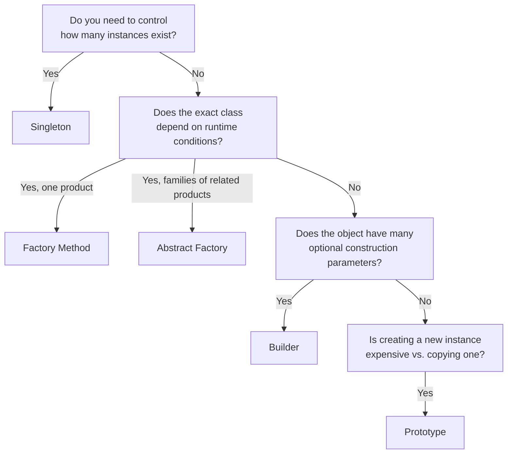

## What a Design Pattern Actually Is

A design pattern is **not** a piece of code you copy-paste. It's a **named, reusable solution to a
recurring design problem** — a description of the *shape* of a solution, expressed in terms of
classes and their relationships, that you adapt to your specific situation.

This distinction matters because interviewers can tell the difference between a candidate who has
memorized 23 pattern diagrams and one who recognizes *when a problem's shape matches a pattern* and
adapts it correctly. The second kind of knowledge is what this series builds toward.

## Where Patterns Come From: The Gang of Four

The term "design pattern" in this context traces back to the 1994 book *Design Patterns: Elements
of Reusable Object-Oriented Software*, written by four authors collectively nicknamed the "Gang of
Four" (GoF): Erich Gamma, Richard Helm, Ralph Johnson, and John Vlissides. They catalogued 23
patterns, organized into three categories based on **what kind of problem they solve**:

| Category | Solves problems about | Examples |
|---|---|---|
| **Creational** | How objects get created | Singleton, Factory Method, Builder |
| **Structural** | How objects are composed into larger structures | Adapter, Decorator, Composite |
| **Behavioral** | How objects communicate and distribute responsibility | Strategy, Observer, Command |

Parts 3, 4, and 5 of this series cover each category in turn.

## Why Creational Patterns Come First

Every other pattern assumes you already have objects to work with — creational patterns are about
**how those objects come into existence** in the first place. Before you can apply a Strategy
pattern (Chapter 28) to swap fee calculation logic, something has to decide *which* strategy object
to construct. That decision is exactly what creational patterns formalize.

## The Problem Every Creational Pattern Is Solving

Plain `new` works fine until one of these becomes true:

1. **Construction needs to be controlled or restricted** — e.g., only one instance should ever
   exist (Singleton, Chapter 16).
2. **The exact class to instantiate isn't known until runtime**, and depends on some condition
   (Factory Method, Chapter 17).
3. **Families of related objects need to be created together, consistently** (Abstract Factory,
   Chapter 18).
4. **An object has many optional parameters, and telescoping constructors become unreadable**
   (Builder, Chapter 19).
5. **Creating a new object is expensive, and cloning an existing one is cheaper** (Prototype,
   Chapter 20).

Each creational pattern in this Part maps directly to one of these five problems — as you read
each chapter, the pattern should feel like the obvious answer to its corresponding problem, not an
arbitrary structure to memorize.

## How to Recognize Which Pattern Applies (A Preview)

This flowchart is deliberately simplified — real problems are messier, and the following six
chapters go deep enough on each pattern that this decision tree becomes second nature rather than
something you consciously walk through.

## A Word of Caution: Patterns Are Tools, Not Goals

Chapter 12 already covered this from the KISS angle, but it bears repeating specifically for
patterns: **using a pattern is never the goal.** The goal is always solving the actual problem
well. If a plain constructor solves your problem cleanly, using it is the *correct* answer, even
in a pattern-focused interview. An interviewer who sees you force a Factory Method onto a class
with exactly one implementation, ever, learns that you pattern-match on vocabulary rather than on
actual design need — which is the opposite of the signal you want to send.

## Summary

- A design pattern is a named, reusable *solution shape*, not literal code to copy.
- The Gang of Four organized 23 patterns into three categories: Creational (object creation),
  Structural (object composition), Behavioral (object communication).
- Creational patterns solve five recurring problems: controlling instance count, deferring which
  class to instantiate, creating consistent families of objects, taming complex construction, and
  cheaply duplicating expensive objects.
- Recognizing *when* a pattern applies is the real skill — applying one where it isn't needed is a
  KISS/YAGNI violation, not a sign of sophistication.

---

## Interview Questions

**1. What is a design pattern, and how is it different from an algorithm or a library?**
A design pattern is a named, general, reusable solution *shape* to a recurring design problem,
described in terms of collaborating classes and their relationships — it's a template you adapt to
your specific context, not literal, runnable code. An algorithm is a precise, step-by-step
procedure for solving a computational problem (like sorting), and a library is actual, concrete,
directly-usable code. You can implement a design pattern using library code and algorithms
internally, but the pattern itself is a structural idea, not something you import.
*Follow-up: Can two completely different codebases both correctly implement the "same" design
pattern while looking quite different at the code level?* Yes, and this is expected — the pattern
describes the relationship between roles (like "context" and "strategy" in the Strategy pattern),
not exact class names or method signatures, so two valid implementations of the same pattern can
differ significantly in naming, language idioms, and specific details while still sharing the same
underlying structural solution.

**2. Name the three Gang of Four pattern categories and explain what distinguishes them from
each other.**
Creational patterns address how objects are created (Singleton, Factory Method, Abstract Factory,
Builder, Prototype). Structural patterns address how objects and classes are composed into larger
structures (Adapter, Decorator, Composite, Facade, Bridge, Flyweight, Proxy). Behavioral patterns
address how objects communicate, distribute responsibility, and interact (Strategy, Observer,
Command, State, and others). The distinguishing question for each category is, respectively:
"how does this object come to exist?", "how is this object structurally composed with others?",
and "how does this object interact and communicate with others?"
*Follow-up: Can a single class or design use patterns from more than one category
simultaneously?* Yes, and this is common in real systems — a `ParkingLot` case study (Chapter 45)
might use a Singleton (creational) for the lot manager, a Factory Method (creational) for creating
different spot types, and a Strategy (behavioral) for fee calculation, all within the same overall
design.

**3. Why do creational patterns logically come before structural and behavioral patterns when
learning design patterns?**
Every structural and behavioral pattern operates on objects that already exist — you can't apply
the Decorator pattern (structural) or Observer pattern (behavioral) without first having concrete
object instances to decorate or notify. Creational patterns address the earlier, more fundamental
question of how those objects come into being in the first place, which is a natural prerequisite
to reasoning about how they're subsequently composed or made to communicate.
*Follow-up: Is there a real-world LLD problem where you'd apply a creational pattern together with
a structural pattern to the same object at nearly the same point in the design?* Yes — a
`NotificationFactory` (Factory Method, creational) that creates the correct
`NotificationChannel` implementation, which is itself later wrapped by a `RetryDecorator`
(Decorator, structural) to add retry behavior — the factory decides *what* concrete object to
create, and the decorator subsequently *augments* that already-created object's behavior.

**4. What five specific problems do the five main creational patterns (covered in this Part)
each solve?**
Singleton controls how many instances of a class can exist (typically exactly one). Factory Method
defers the decision of exactly which concrete class to instantiate to a subclass or a separate
creation method, based on runtime conditions. Abstract Factory extends this to create entire
*families* of related objects that must stay consistent with each other. Builder tames the
construction of objects with many optional parameters, avoiding unreadable "telescoping"
constructors. Prototype creates new objects by cloning an existing, pre-configured instance rather
than constructing one from scratch, when construction is expensive.
*Follow-up: Which of these five problems is most commonly encountered in typical Java backend
LLD interview questions, in your experience?* Factory Method and Builder tend to come up most
frequently in interviews — Factory Method whenever a problem involves creating different
subtypes based on some input (like different vehicle types or notification channels), and Builder
whenever an object naturally has several optional configuration fields (like constructing a
complex `Pizza` or `HttpRequest` object).

**5. Why is it considered a red flag, rather than a strength, to force a design pattern onto a
problem that doesn't actually need it?**
Forcing an unnecessary pattern (like a Factory Method for a class with exactly one, permanently
fixed implementation) adds indirection and complexity without any corresponding benefit, directly
violating KISS and YAGNI (Chapter 12). It also signals to an interviewer that the candidate is
pattern-matching on vocabulary or trying to demonstrate memorized knowledge, rather than genuinely
reasoning about whether the pattern's structural benefit (flexibility, extensibility) is actually
needed for the problem at hand — which is the opposite of the judgment interviewers are trying to
assess.
*Follow-up: How would you recover gracefully if you realize mid-interview that you've applied an
unnecessary pattern?* Acknowledge it directly and simplify: "Actually, since there's only ever one
implementation of this and no signal it'll change, I don't think a Factory Method adds value here —
let me simplify this to a direct constructor call," then show the simplified version; this kind of
visible self-correction is generally viewed favorably.

**6. Explain the difference between a pattern's "intent" and its "implementation," and why
understanding intent is more valuable than memorizing a specific implementation.**
A pattern's intent is the underlying problem it solves and the reasoning behind its structure
(e.g., Strategy's intent is "let an algorithm vary independently from the clients that use it").
Its implementation is one specific, concrete way of realizing that intent in code (a particular
interface name, particular method signatures). Understanding intent lets you recognize the pattern
in a problem statement phrased completely differently from any textbook example and adapt the
implementation to fit your specific context, naming conventions, and constraints — memorizing one
canonical implementation without understanding intent leaves you unable to recognize or adapt the
pattern when the problem doesn't match the memorized shape exactly.
*Follow-up: Give an example of two very differently-implemented solutions that share the same
underlying pattern intent.* A `PaymentMethod` interface with `CreditCardPayment`/`UpiPayment`
implementations (Chapter 2) and a `DiscountPolicy` interface with `RegularDiscount`/
`PremiumDiscount` implementations (Chapter 8) look like completely different code, in completely
different domains, but both share the exact same Strategy pattern intent: letting an algorithm or
behavior vary independently from the code that uses it.

**7. How would you explain the value of learning named design patterns to someone who says "I can
just solve problems with plain OOP, why do I need to learn these specific 23 named patterns?"**
Named patterns provide a shared vocabulary that dramatically speeds up communication and design
discussion — saying "I'll use a Strategy pattern here" instantly communicates a specific, well-
understood structural approach to another engineer or interviewer, versus having to re-explain the
same reasoning about interfaces and polymorphism from scratch every time. Patterns also encode
accumulated, battle-tested wisdom about common trade-offs and edge cases for these particular
recurring problem shapes — learning them is less about gaining capability you didn't have (good
OOP fundamentals do get you most of the way there) and more about gaining efficiency, shared
language, and awareness of subtle pitfalls specific to each recurring problem shape.
*Follow-up: Is it possible to independently "reinvent" a GoF pattern without knowing its name,
just from strong OOP fundamentals?* Yes, and it happens constantly — a developer with strong SOLID
instincts will often naturally arrive at a Strategy-pattern-shaped or Factory-Method-shaped
solution without knowing the formal name, simply by applying "depend on abstractions" and "avoid
conditional chains over type" reasoning; knowing the name afterward mainly helps communicate and
recognize the same shape faster next time.

**8. What does it mean that design patterns are "language-agnostic," and are there any patterns
that become unnecessary or trivial in certain programming languages?**
The GoF patterns were originally described using C++ and Smalltalk examples, but their underlying
structural ideas apply across virtually any object-oriented language, including Java, Python, and
C#. Some patterns become less necessary or more trivial in languages with different feature sets —
for example, in Python's duck-typing model, some uses of the Adapter or Factory patterns are less
critical since Python doesn't require explicit interface implementation the way Java does; in Java
specifically, the language's static typing and explicit interfaces make several patterns
(especially Strategy and Factory Method) particularly natural and commonly used compared to more
dynamically-typed languages.
*Follow-up: Are there any patterns considered specific to Java or the JVM ecosystem that don't
appear in the original 1994 GoF catalog?* The original 23 patterns predate Java's mainstream
adoption and are indeed language-agnostic by design; however, newer, JVM/Java-ecosystem-specific
idioms have emerged since (such as the Dependency Injection container pattern popularized by
Spring), which build on GoF concepts like Dependency Inversion but aren't part of the original 1994
catalog itself.

**9. In an LLD interview, if you're asked to design something and don't immediately recognize
which named pattern applies, what should you do instead of guessing a pattern name?**
Reason from first principles using SOLID and the OOP fundamentals from Parts 1 and 2 — identify the
specific problem (does something need to vary independently? does construction need controlling?
are responsibilities tangled?) and design a clean solution using interfaces, composition, and the
appropriate SOLID principles, without worrying about naming it. Once you arrive at a working
design, you can often recognize afterward which named pattern it resembles, or it may not map to
any single named pattern at all — a well-reasoned, unnamed solution is always preferable to a
poorly-fitting solution forced to match a memorized pattern name.
*Follow-up: Is it acceptable to explicitly say "I don't know if this maps to a named pattern, but
here's my reasoning" out loud in an interview?* Yes, and this is generally viewed positively — it
demonstrates the ability to reason from fundamentals rather than relying purely on pattern
recognition, which is a more transferable and valuable skill than name-matching alone.

**10. How would you distinguish, when reviewing a design, between genuinely applying a pattern
correctly versus superficially mimicking its structure without understanding its purpose?**
Genuine application solves the actual underlying problem the pattern addresses — for instance, a
correctly-applied Factory Method actually defers a meaningful, runtime-dependent creation decision
to a separate method or class. Superficial mimicry might introduce a method literally named
`createSomething()` that always constructs the exact same single class with no actual variability
or decision logic involved — the "factory" name and shape are present, but there's no genuine
problem being solved, just an added, unnecessary layer of indirection around a trivial `new` call.
*Follow-up: How would you identify this kind of superficial pattern usage while reviewing someone
else's code?* Check whether removing the pattern's extra layer of indirection (inlining the
"factory" method's single line back to a direct constructor call at each call site) would change
anything meaningful about the code's behavior or flexibility — if it wouldn't, the pattern was
applied superficially rather than to solve a genuine problem.

**11. Some critics argue that "design patterns are workarounds for missing language features."
What's the origin of this critique, and does it apply equally to all 23 GoF patterns?**
This critique originated partly from observations that some patterns compensate for limitations in
the languages (like C++) the GoF authors originally used — for example, the Strategy pattern's
interface-plus-implementing-classes structure is, in more functionally-oriented or dynamically
typed languages, sometimes replaceable by simply passing a function/lambda directly, without needing
a full interface and class hierarchy. This critique applies unevenly: patterns like Singleton or
Observer address genuine structural or lifecycle concerns that exist regardless of language
features, while some behavioral patterns (Strategy, Command) do become simpler or partially
redundant in languages with first-class functions.
*Follow-up: Does Java's introduction of lambdas and functional interfaces (Java 8+) change how
some of these patterns are typically implemented?* Yes, significantly for some patterns — a simple
Strategy pattern with a single-method interface can now often be implemented with a lambda
expression assigned to a functional interface variable instead of a full named implementing class,
reducing boilerplate while preserving the same underlying structural intent; this is covered in
more detail when the Strategy pattern itself is discussed in Chapter 28.

**12. How would you use the "decision tree" flowchart from this chapter during an actual LLD
interview — is it something you'd draw out loud, or is it more of an internal mental model?**
It's best used as an internal mental model applied quickly and mostly silently, rather than something
literally drawn on the whiteboard during an interview — drawing a generic pattern-selection
flowchart would consume interview time without adding value specific to the actual problem being
solved. The value is in having internalized this reasoning well enough that pattern selection
becomes a fast, largely automatic step, freeing up your limited verbal/drawing time for the actual
problem-specific design and code.
*Follow-up: How would you demonstrate this reasoning to an interviewer without drawing the
flowchart itself?* Narrate the specific reasoning as it applies to the problem at hand — "since the
exact discount type depends on the customer's tier, which we won't know until runtime, I'll use a
Factory Method here to create the right `DiscountPolicy` implementation" — which conveys the same
underlying decision process in a naturally problem-specific way, without needing to reference or
draw the general decision framework itself.

**13. Why does this series introduce the five creational patterns as separate, individually
deep-dived chapters rather than covering all five briefly in one combined chapter?**
Each creational pattern has enough distinct nuance, common variations (like Singleton's several
thread-safety implementations), and its own set of common interview follow-up questions that a
combined, shallow treatment would leave gaps in exactly the areas interviewers tend to probe
deepest — for example, Singleton's thread-safety trade-offs alone warrant substantial dedicated
discussion that a single combined chapter covering all five patterns wouldn't have room for.
Separating them allows each to be covered with the depth actually expected at interview level.
*Follow-up: Given that separate treatment, how would you personally decide how much relative
interview-preparation time to spend on each of the five, if time were limited?* Prioritize based on
real-world interview frequency and depth of common follow-ups — Singleton and Factory Method tend
to appear most frequently and have the most commonly-probed subtleties (thread safety, and
runtime-dependent creation logic, respectively), making them reasonable priorities if forced to
choose, though Builder is close behind given how often LLD case studies involve objects with many
optional fields.

**14. If an interviewer explicitly says "please don't use any named design patterns for this
problem, just write clean code," how would you approach the problem differently, if at all?**
The underlying reasoning — depending on abstractions where genuine variability exists, keeping
classes focused (SRP), avoiding conditional chains over type (OCP/polymorphism) — would remain
identical, since that reasoning is what patterns formalize, not an alternative to it. The only
practical difference is that you'd avoid explicitly naming your structures after GoF patterns out
loud (e.g., not saying "I'll use the Strategy pattern here") and might land on slightly less
rigidly "textbook" class and method names, while still producing a design that likely does happen
to resemble one or more named patterns structurally, since good OOP naturally tends toward these
same recurring shapes.
*Follow-up: Why might an interviewer specifically request this constraint?* This constraint is
sometimes used specifically to test whether a candidate's design skill comes from genuine
first-principles reasoning about SOLID and OOP fundamentals, versus being purely pattern-name
pattern-matching without a deeper understanding of *why* each pattern's structure solves the
problem it solves — it isolates the underlying judgment skill from the vocabulary layer on top of
it.
