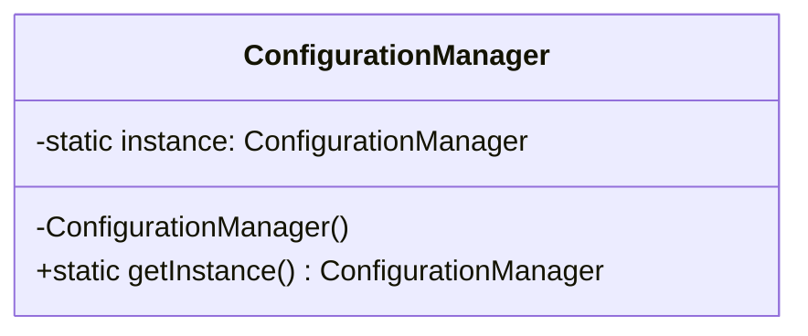
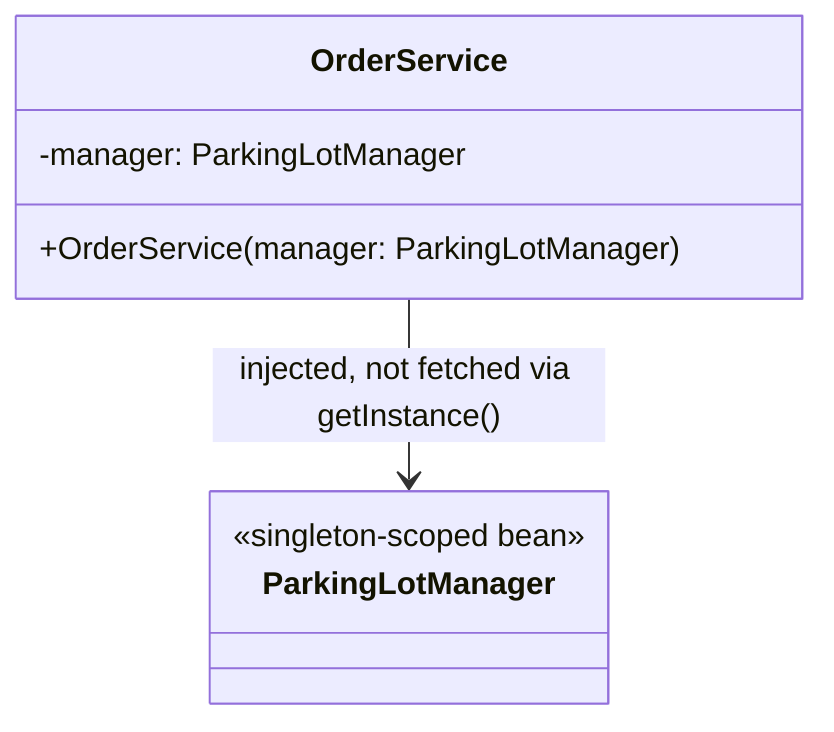

## Intent

> **Ensure a class has only one instance, and provide a global point of access to it.**

Singletons show up constantly in LLD case studies — a `ParkingLotManager`, a `Logger`, a
`ConfigurationManager`, a database `ConnectionPool` — anything where having a second instance would
either be wasteful or actively incorrect (two competing `ParkingLotManager`s could double-book the
same spot).

## The Basic Shape

```java
class ConfigurationManager {
    private static ConfigurationManager instance;

    private ConfigurationManager() { } // private constructor — no one else can call `new`

    static ConfigurationManager getInstance() {
        if (instance == null) {
            instance = new ConfigurationManager();
        }
        return instance;
    }
}
```

Three things make this a Singleton: a **private constructor** (prevents external instantiation), a
**private static field** holding the one instance, and a **public static access method**. This
basic version, however, is **not thread-safe** — and thread safety is where nearly every Singleton
interview question actually lives.



## The Race Condition, Explained

If two threads call `getInstance()` at nearly the same moment, both can see `instance == null`
before either has finished constructing it — resulting in **two separate instances**, silently
defeating the entire point of the pattern. This is exactly the kind of bug Chapter 5 warned about:
invisible until it isn't, and it only manifests under real concurrent load, making it easy to miss
in casual testing.

## Five Ways to Fix It, in Order of Sophistication

### 1. Eager Initialization

```java
class ConfigurationManager {
    private static final ConfigurationManager instance = new ConfigurationManager();

    private ConfigurationManager() { }

    static ConfigurationManager getInstance() {
        return instance;
    }
}
```

The instance is created when the class is loaded by the JVM, before any thread can call
`getInstance()` — the JVM's class-loading mechanism itself guarantees thread safety, with zero
explicit synchronization code needed. **Trade-off:** the instance is created even if the
application never actually calls `getInstance()`, wasting resources if construction is expensive.

### 2. Synchronized Method (Lazy, but Slow)

```java
class ConfigurationManager {
    private static ConfigurationManager instance;

    private ConfigurationManager() { }

    static synchronized ConfigurationManager getInstance() {
        if (instance == null) {
            instance = new ConfigurationManager();
        }
        return instance;
    }
}
```

`synchronized` ensures only one thread executes `getInstance()` at a time, fixing the race
condition. **Trade-off:** every single call — not just the first one — pays the cost of acquiring
the lock, even though synchronization is only actually needed once, the very first time.

### 3. Double-Checked Locking

```java
class ConfigurationManager {
    private static volatile ConfigurationManager instance;

    private ConfigurationManager() { }

    static ConfigurationManager getInstance() {
        if (instance == null) {                          // first check, no lock
            synchronized (ConfigurationManager.class) {
                if (instance == null) {                   // second check, inside the lock
                    instance = new ConfigurationManager();
                }
            }
        }
        return instance;
    }
}
```

This checks `instance == null` **twice** — once without a lock (fast path, taken by every call
after the first), and once again inside the lock (to handle the case where two threads both passed
the first check before either acquired the lock). The `volatile` keyword is not optional here — it
prevents a subtle JVM optimization (instruction reordering) from allowing another thread to see a
partially-constructed object. **This is the version most commonly expected as a "complete" answer
in interviews.**

### 4. Initialization-on-Demand Holder Idiom

```java
class ConfigurationManager {
    private ConfigurationManager() { }

    private static class Holder {
        private static final ConfigurationManager INSTANCE = new ConfigurationManager();
    }

    static ConfigurationManager getInstance() {
        return Holder.INSTANCE;
    }
}
```

The `Holder` inner class isn't loaded by the JVM until `getInstance()` is first called (Java
classes are loaded lazily), and the JVM's class-loading guarantee provides thread safety — the same
guarantee eager initialization relies on, but deferred until first use. This gets **lazy
initialization with no synchronization overhead at all** on every call, arguably the most elegant
solution.

### 5. Enum Singleton

```java
enum ConfigurationManager {
    INSTANCE;

    void doSomething() { /* business logic */ }
}
```

Java guarantees enum constants are instantiated exactly once, thread-safely, by the JVM itself —
and as a bonus, this approach is immune to a subtle attack the other four all remain vulnerable to:
**reflection can call a private constructor directly**, bypassing the Singleton entirely, for every
version above. Enums cannot be instantiated via reflection this way. Joshua Bloch, in *Effective
Java*, calls this "the best way to implement a singleton."

## A Comparison Table for Interview Recall

| Approach | Lazy? | Thread-safe? | Overhead per call | Reflection-safe? |
|---|---|---|---|---|
| Eager | No | Yes | None | No |
| Synchronized method | Yes | Yes | High (lock every call) | No |
| Double-checked locking | Yes | Yes | Low (lock only first call) | No |
| Holder idiom | Yes | Yes | None | No |
| Enum | Yes* | Yes | None | **Yes** |

*Enum instances are created on first reference to the enum, effectively lazy in practice.

## The Real Interview Trap: Singleton Overuse

Knowing five ways to implement Singleton correctly is necessary, but the more important interview
skill is knowing **when not to use it at all**. Singleton is one of the most overused and
criticized GoF patterns in practice, because it:

- **Introduces hidden global state**, making code harder to reason about and test — any class that
  calls `ConfigurationManager.getInstance()` internally has an invisible dependency not visible in
  its constructor signature (directly conflicting with the DIP-friendly, testable design from
  Chapter 11).
- **Makes unit testing harder**, since a real Singleton persists state across test cases unless
  explicitly reset, risking test pollution.

A stronger alternative in most real applications: let a dependency injection framework (like
Spring) manage a class as a "singleton-scoped bean," injected explicitly via constructor. This gets
the "exactly one instance" behavior **without** the hidden global-access-point problem — callers
still declare their dependency explicitly, satisfying DIP, rather than reaching for a static
`getInstance()` call buried inside a method body.



## Summary

- Singleton ensures exactly one instance of a class exists, accessed through a global access
  point.
- The naive lazy implementation has a race condition; five progressively better fixes exist —
  eager, synchronized method, double-checked locking, the holder idiom, and enum-based.
- The enum approach is the most robust: lazy, thread-safe, and immune to reflection-based
  instantiation attacks the other four remain vulnerable to.
- In real applications, prefer a DI framework's singleton-scoped bean over a manual
  `getInstance()` Singleton — it achieves the same one-instance guarantee without hidden global
  state or the testing difficulties that come with it.

---

## Interview Questions

**1. What is the Singleton pattern's intent, and what three structural elements make a class a
Singleton in Java?**
The Singleton pattern ensures a class has exactly one instance and provides a single, global point
of access to it. The three structural elements are: a private constructor (preventing external code
from calling `new`), a private static field holding the sole instance, and a public static method
(conventionally `getInstance()`) that returns that instance, creating it on first access if using
lazy initialization.
*Follow-up: Why must the constructor specifically be private, rather than just relying on
convention to not call `new` externally?* Making the constructor private is enforced by the
compiler — any external code attempting `new ConfigurationManager()` fails to compile, guaranteeing
the one-instance invariant structurally rather than relying on developer discipline, which is
exactly the kind of invariant-protection encapsulation (Chapter 2) is meant to provide.

**2. Explain the race condition in the naive, non-thread-safe lazy Singleton implementation,
step by step.**
If two threads call `getInstance()` concurrently, both can evaluate `instance == null` as `true`
before either thread finishes executing `instance = new ConfigurationManager()` — since checking
the condition and assigning the field are two separate, non-atomic operations. Both threads then
proceed to construct and assign their own separate `ConfigurationManager` instance, and whichever
assignment happens last "wins," silently leaving two distinct objects having briefly existed (one of
which is now unreferenced) instead of the guaranteed single instance the pattern promises.
*Follow-up: Would this race condition be caught by typical unit tests run on a single thread?* No —
single-threaded tests would never trigger the race condition at all, since the concurrent access
scenario that causes it simply doesn't exist without multiple threads calling `getInstance()`
simultaneously; this is exactly why the bug is a "silent, hard-to-detect-without-real-concurrent-
load" issue as described in Chapter 5's discussion of race conditions.

**3. Walk through double-checked locking and explain why the `volatile` keyword is required, not
optional.**
Double-checked locking checks `instance == null` once without a lock (a fast path for the common
case after initialization), and if null, acquires a lock and checks again before constructing, to
handle the case where two threads both passed the first check simultaneously. The `volatile`
keyword is required because, without it, the JVM is permitted to reorder instructions during
object construction — a thread could observe a non-null reference to `instance` that points to a
partially-initialized object (its constructor hasn't fully run) due to this reordering, and reading
the fields of that half-constructed object would produce corrupted or inconsistent state.
`volatile` establishes a happens-before relationship that prevents this specific reordering.
*Follow-up: Does removing `volatile` cause a compile error, a runtime exception, or something
else?* Neither — the code compiles and runs fine in the overwhelming majority of executions,
which is precisely what makes this bug so dangerous: it's a subtle, timing-and-hardware-dependent
correctness issue that may only manifest rarely, under specific JIT optimization and CPU
architecture conditions, making it very difficult to catch through ordinary testing.

**4. Why does the eager initialization approach guarantee thread safety without any explicit
synchronization code?**
The JVM guarantees that static field initializers run exactly once, during class loading, and that
class loading itself is thread-safe — the JVM's class loader uses internal locking to ensure only
one thread performs the loading and initialization of a given class, even if multiple threads
trigger the class-loading process concurrently. Since the `ConfigurationManager` instance is
created directly at the point of static field declaration, this class-loading guarantee is
sufficient to ensure the instance is created exactly once, with no additional synchronization needed
in application code.
*Follow-up: If eager initialization is this simple and safe, why isn't it always the preferred
choice over the more complex double-checked locking or holder idiom?* Its downside is the lack of
laziness — the instance is constructed immediately when the class is loaded, regardless of whether
`getInstance()` is ever actually called, which wastes resources (memory, initialization time,
potentially expensive I/O like opening a database connection) if construction is costly and the
Singleton might not always be used in a given application run.

**5. Explain how the Initialization-on-Demand Holder idiom achieves both laziness and thread
safety without any explicit locking.**
The static nested `Holder` class isn't loaded by the JVM until it's first referenced — which only
happens the first time `getInstance()` is called and accesses `Holder.INSTANCE`. This defers
initialization (achieving laziness) while still relying on the exact same JVM class-loading thread-
safety guarantee that eager initialization uses, just applied to the `Holder` class instead of the
outer `ConfigurationManager` class directly — giving you the best of both approaches: lazy
initialization with zero synchronization overhead on every call.
*Follow-up: Is there any scenario where the Holder idiom would not be considered strictly
superior to double-checked locking?* In practice, the Holder idiom is generally considered simpler
and equally or more efficient than double-checked locking for standard Singleton use cases in Java,
with essentially no downside — double-checked locking is more commonly taught and asked about in
interviews mainly because it more directly demonstrates understanding of the underlying
concurrency concepts (race conditions, `volatile`, the happens-before relationship), which
interviewers specifically want to probe.

**6. Why is the enum-based Singleton considered immune to reflection-based attacks that the
other four approaches remain vulnerable to?**
Java's reflection API allows calling `Constructor.setAccessible(true)` to bypass a private
constructor's access modifier and invoke it directly, creating a second instance of what was
intended to be a Singleton — this attack works against the eager, synchronized-method,
double-checked-locking, and holder-idiom approaches, since they're all backed by ordinary classes
with ordinary (if private) constructors. Enum constants, by contrast, are instantiated exclusively
by the JVM during class loading through a special mechanism, and the Java language specification
explicitly disallows reflective instantiation of enum types, throwing an exception if attempted —
making enum the only one of the five approaches genuinely immune to this specific attack vector.
*Follow-up: Is the reflection attack a realistic concern in most real-world applications, or is
this mostly a theoretical/academic distinction?* It's a legitimate concern primarily in
security-sensitive contexts, or in codebases where reflection is used liberally by frameworks or
libraries that might inadvertently or maliciously bypass access modifiers — for most typical
business application code, it's a less pressing practical concern, but it's frequently asked about
in interviews specifically because it's the concrete, well-known reason Joshua Bloch's
*Effective Java* recommends enum as the singular best Singleton implementation.

**7. Besides reflection, name another way a "broken" Singleton implementation can accidentally
end up with multiple instances, and explain how enum protects against it too.**
Java serialization can also break a Singleton — deserializing a previously-serialized instance of
a class creates a brand-new object via a special deserialization mechanism that bypasses the
constructor entirely, potentially producing a second instance distinct from the original singleton
(this requires implementing a `readResolve()` method to fix for the ordinary class-based
approaches). Enum types have built-in, JVM-guaranteed correct serialization behavior — Java
specifically handles enum serialization by serializing just the constant's name and deserializing
it back to the exact same singleton instance, with no `readResolve()` workaround needed.
*Follow-up: If you were using the double-checked-locking approach and needed to support Java
serialization safely, what would you need to add to prevent this issue?* You'd implement a
`readResolve()` method on the class that returns the existing singleton instance
(`return getInstance();`) instead of the newly deserialized object, which Java's serialization
mechanism will honor, discarding the improperly-created duplicate and substituting the correct,
singular instance in its place.

**8. What are the main criticisms of the Singleton pattern in real-world application design,
beyond the multithreading complexities of implementing it correctly?**
Singleton introduces hidden global state accessed via a static method call buried anywhere in the
code, rather than an explicit constructor dependency — this makes classes that use a Singleton
harder to unit test in isolation (the global instance persists state across test runs unless
manually reset, risking test pollution and order-dependent test failures) and violates the spirit
of Dependency Inversion (Chapter 11), since the dependency on `ConfigurationManager` is invisible
in the consuming class's public API (its constructor), rather than being explicit and injectable.
*Follow-up: How would you demonstrate awareness of this criticism while still correctly answering
a question that explicitly asks you to implement a Singleton?* Implement the requested Singleton
correctly (showing you know the mechanics), but proactively note the trade-off: "This gives us the
one-instance guarantee, though in a larger real application I'd likely prefer managing this as a
singleton-scoped bean through dependency injection instead, to keep the dependency explicit and the
class easily testable" — demonstrating both mechanical competence and design judgment.

**9. How would you unit test a class that depends on a traditional `getInstance()`-style
Singleton, and what specific difficulty does this introduce compared to testing a class using
constructor-injected dependencies?**
Testing becomes difficult because the class under test internally calls
`ConfigurationManager.getInstance()`, giving the test no way to substitute a fake or
differently-configured instance for that specific test case — the test is forced to either work
around the real Singleton's actual behavior and state (which may carry over undesired state from a
previous test) or resort to advanced techniques like reflection-based state resetting or
specialized mocking libraries capable of intercepting static method calls, both of which are more
complex and fragile than simply injecting a fake `ConfigurationManager`-shaped dependency via a
constructor, as discussed for `OrderService` in Chapter 11.
*Follow-up: Does designing `ConfigurationManager` to also implement an interface
(`Configuration`) help this testing problem at all, given that the class using it still calls the
static `getInstance()` method internally?* Only partially — even if `ConfigurationManager`
implements a `Configuration` interface, as long as the consuming class calls the static
`getInstance()` method directly rather than receiving a `Configuration` instance through its
constructor, the consuming class remains hard-coded to fetch that specific global singleton,
regardless of the interface's existence; the interface alone doesn't solve the core testability
problem without also changing how the dependency is obtained (i.e., via injection).

**10. In an LLD interview, if asked to design a `ParkingLotManager` that must be a Singleton,
which of the five implementation approaches would you choose by default, and why?**
The enum-based approach or the Initialization-on-Demand Holder idiom are both strong defaults —
enum for its combined thread safety, laziness, and reflection/serialization robustness in one
concise implementation, or the Holder idiom if the interviewer specifically wants to see the more
traditional class-based approach with full understanding of the underlying JVM class-loading
guarantee demonstrated. Double-checked locking is a reasonable choice specifically when the
interviewer's intent seems to be probing your understanding of `volatile` and memory visibility
concepts directly.
*Follow-up: Would your answer change if the interviewer explicitly said "assume this application
does not use multiple threads at all"?* In that specific case, the simplest non-thread-safe lazy
implementation (or eager initialization) would be entirely sufficient and appropriate — introducing
double-checked locking or the Holder idiom's added complexity for a genuinely single-threaded
application would be unnecessary over-engineering, directly conflicting with KISS/YAGNI (Chapter
12), since the entire justification for those more complex approaches is protecting against
concurrent access that, by the interviewer's own stated constraint, cannot occur.

**11. Can a Singleton class be subclassed in Java? If so, does subclassing a Singleton typically
make sense from a design perspective?**
Technically, a Singleton with a `private` constructor cannot be subclassed at all outside its own
enclosing class (Java requires a subclass to be able to call some constructor of its parent, and a
fully private constructor blocks this from any external class); using `protected` instead of
`private` would allow subclassing, but this weakens the "exactly one instance" guarantee, since a
subclass could then be instantiated independently, producing multiple instances across the
`Singleton`/subclass family. From a design perspective, subclassing a Singleton is generally
considered contradictory to the pattern's core intent and is rarely done in practice.
*Follow-up: Is there a legitimate design scenario where you'd want "a family of related Singleton-
like classes," and if so, how would you model that instead of subclassing a single Singleton?*
If you needed several distinct singleton-like managers sharing common behavior (e.g., separate
singleton managers for logging, configuration, and caching that share some common lifecycle logic),
you'd more appropriately model the shared behavior through composition or a shared abstract base
class each manager extends independently — each still enforcing its own single-instance guarantee
separately — rather than trying to force a true inheritance relationship between actual Singleton
instances themselves.

**12. How does the Singleton pattern's "global point of access" characteristic relate to (and
differ from) simply using static utility methods, like `Math.max()`?**
A Singleton provides global access to one specific, stateful *instance* of a class — it has
identity and typically holds mutable or configured state across its lifetime (like a
`ConfigurationManager` holding loaded configuration values). A static utility method like
`Math.max()` has no instance or state at all — it's a pure, stateless function attached to a class
namespace purely for organizational convenience, with no "instance" to speak of and no lifecycle
concerns. The Singleton pattern is specifically about controlling and providing access to object
*instances*, not about organizing stateless functions.
*Follow-up: If a class has genuinely no state and all its methods are stateless, is implementing
it as a Singleton ever the right choice over just making all its methods static?* If a class
genuinely has zero state and no plans to ever hold state, making its methods `static` directly
(a plain utility class) is simpler and avoids the unnecessary ceremony of Singleton's instance-
management machinery entirely — Singleton's value specifically comes from managing a stateful
instance's lifecycle and access, which provides no benefit for a class that will never actually
hold any state.

**13. Explain why Spring Boot's default bean scope is effectively "singleton," and how this
differs mechanically from the classic GoF Singleton pattern implemented manually.**
Spring's default singleton scope means the Spring IoC (Inversion of Control) container creates and
manages exactly one instance of a given bean class per application context, and injects that same
shared instance wherever it's requested via `@Autowired` or constructor injection — achieving the
same "exactly one instance" outcome as the GoF pattern. Mechanically, it differs because there's no
private constructor or static `getInstance()` method involved at all — the class can have an
entirely ordinary public constructor, and the "one instance" guarantee is enforced by the Spring
container's bean registry and lifecycle management, external to the class itself, rather than being
baked into the class's own code.
*Follow-up: Does this mean a Spring singleton-scoped bean is immune to the reflection-based
multiple-instantiation attack discussed earlier?* No, technically it's actually more vulnerable in
one sense — since the class has an ordinary public constructor (unlike the private-constructor GoF
Singleton), any code with access to the class, not just reflection-based attackers, could call
`new` directly to create an additional instance outside of Spring's management entirely; Spring's
singleton guarantee only applies to instances *it* creates and manages through its container, not
to instances created directly via the class's own public constructor by code that bypasses Spring
entirely.

**14. If you were designing a `ParkingLot` case study (covered fully in Chapter 45) and needed
exactly one `ParkingLot` instance managing the whole facility, would you use a classic Singleton
pattern, or is there a better-fitting alternative given everything discussed in this chapter?**
Given the testing and hidden-dependency criticisms discussed, a stronger real-world choice would be
constructing a single `ParkingLot` instance explicitly at application startup (e.g., in a `main()`
method or a dependency-injection configuration) and passing that one instance explicitly to every
class that needs it via constructor injection, rather than baking a `getInstance()` method directly
into the `ParkingLot` class itself. This achieves the same practical "exactly one instance exists
and is shared" outcome the interviewer is likely testing for, while keeping every dependency on
`ParkingLot` explicit and the resulting classes easily testable with a fake `ParkingLot` instance
in unit tests.
*Follow-up: If the interviewer specifically insists on seeing the classic `getInstance()`-style
GoF Singleton implemented, would you push back, or comply and note the trade-off?* Comply and note
the trade-off briefly — many interviewers specifically want to see whether you can correctly
implement one of the five thread-safe variants discussed in this chapter as a demonstration of
concurrency knowledge, and complying while briefly noting the real-world alternative demonstrates
both the requested mechanical skill and broader design judgment, without appearing to argue with
the interviewer's explicit request.
