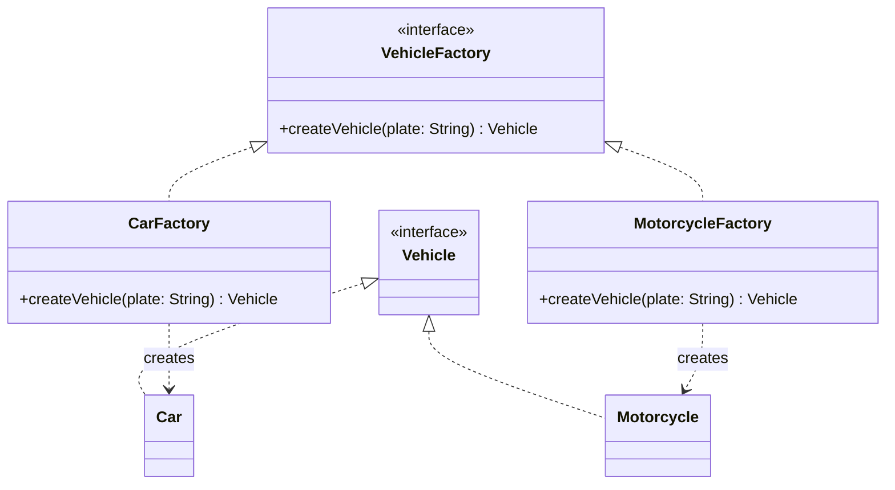

## Intent

> **Define an interface for creating an object, but let subclasses (or a dedicated method) decide
> which class to instantiate.**

Factory Method solves a very specific problem: **you know you need "a `Vehicle`," but which
concrete kind — `Car`, `Motorcycle`, `Truck` — depends on information only available at runtime.**

## The Problem Without a Factory

```java
class ParkingLot {
    void parkVehicle(String vehicleType, String licensePlate) {
        Vehicle vehicle;
        if (vehicleType.equals("CAR")) {
            vehicle = new Car(licensePlate);
        } else if (vehicleType.equals("MOTORCYCLE")) {
            vehicle = new Motorcycle(licensePlate);
        } else if (vehicleType.equals("TRUCK")) {
            vehicle = new Truck(licensePlate);
        } else {
            throw new IllegalArgumentException("Unknown vehicle type");
        }
        // ... park the vehicle
    }
}
```

This should look immediately familiar — it's the exact `if/else`-over-type shape flagged as an OCP
violation in Chapter 8, except this time the thing varying is **which class gets constructed**,
not which behavior gets executed. Adding a `Bicycle` type means editing `ParkingLot` directly.

## The Fix

```java
interface VehicleFactory {
    Vehicle createVehicle(String licensePlate);
}

class CarFactory implements VehicleFactory {
    public Vehicle createVehicle(String licensePlate) {
        return new Car(licensePlate);
    }
}

class MotorcycleFactory implements VehicleFactory {
    public Vehicle createVehicle(String licensePlate) {
        return new Motorcycle(licensePlate);
    }
}

class ParkingLot {
    void parkVehicle(VehicleFactory factory, String licensePlate) {
        Vehicle vehicle = factory.createVehicle(licensePlate);
        // ... park the vehicle
    }
}
```

Adding a `Bicycle` type now means writing a new `BicycleFactory` — `ParkingLot` is never touched.
This is the Factory Method pattern applied via composition (a common, flexible variant); the
"classic" GoF version instead uses inheritance, with subclasses overriding a factory method — both
achieve the same intent.



## Where the Registration Problem Goes

There's an obvious follow-up: **something still needs to map `"CAR"` to `CarFactory` in the first
place.** Isn't that just moving the `if/else` chain elsewhere?

```java
class VehicleFactoryProvider {
    private static final Map<String, VehicleFactory> factories = Map.of(
        "CAR", new CarFactory(),
        "MOTORCYCLE", new MotorcycleFactory(),
        "TRUCK", new TruckFactory()
    );

    static VehicleFactory getFactory(String vehicleType) {
        VehicleFactory factory = factories.get(vehicleType);
        if (factory == null) {
            throw new IllegalArgumentException("Unknown vehicle type: " + vehicleType);
        }
        return factory;
    }
}
```

Yes and no. There's still one place where string-to-implementation mapping happens — but it's now
a **data lookup** (a `Map`), not a **branching conditional over business logic**. Adding a new
vehicle type means adding one line to the map, not adding a new branch with its own logic embedded
in the conditional. This is a meaningfully smaller, more mechanical, lower-risk change — and it's
the honest, practical answer to "doesn't this just move the problem?" that interviewers expect you
to articulate rather than dodge.

## Factory Method vs. a Plain Static Factory Method

Java developers often use the term "factory method" loosely to mean *any* static method that
returns an object, like `List.of(...)`. This is a related but distinct idea from the GoF pattern:

```java
class Vehicle {
    static Vehicle createCar(String plate) { // a "static factory method" — not the GoF pattern
        return new Car(plate);
    }
}
```

This is a legitimate, useful technique (it can return a subtype, cache instances, or give a more
descriptive name than a constructor) — but it's not the **GoF Factory Method pattern**, because
there's no interface or polymorphism involved; it's just a static method with a better name than
`new`. Interviewers who ask specifically about "the Factory Method pattern" want the
interface-based, polymorphic version shown above — be precise about which one you mean.

## Summary

- Factory Method defers the decision of *which concrete class to instantiate* to a dedicated
  method or object, replacing an `if/else`-over-type chain at construction time.
- The pattern doesn't eliminate the type-to-class mapping — it moves it into a focused,
  data-driven lookup (often a `Map`) rather than leaving it as branching logic scattered through
  business code.
- Distinguish the GoF Factory Method pattern (interface + polymorphic creator classes) from the
  colloquial "static factory method" (just a well-named static method) — they solve related but
  different problems.
- This pattern pairs naturally with the Strategy pattern (Chapter 28): factories decide *which*
  strategy object to construct.

---

## Interview Questions

**1. State the Factory Method pattern's intent, and explain what specific problem it solves that
a plain constructor call doesn't.**
Factory Method defines an interface or method for creating an object while deferring the decision
of exactly which concrete class to instantiate until runtime, based on some condition or input. A
plain constructor call (`new Car(plate)`) hardcodes the exact concrete type at compile time — if the
correct type to construct depends on runtime information (like a `vehicleType` string), you need
some form of decision logic to choose between constructors, and Factory Method formalizes that
decision logic behind a clean, extensible abstraction rather than an inline conditional.
*Follow-up: Could you solve the same underlying problem without any named pattern at all, just
using an `if/else` chain?* Yes, mechanically — an `if/else` chain of `new` calls does solve the
immediate problem of picking the right class, but it violates the Open/Closed Principle (Chapter 8)
since adding a new type requires modifying that chain directly, which is precisely the drawback the
Factory Method pattern is designed to eliminate.

**2. Walk through the `ParkingLot`/`VehicleFactory` example and explain exactly how it satisfies
the Open/Closed Principle.**
The original code used an `if/else` chain inside `ParkingLot.parkVehicle()` to decide which
concrete `Vehicle` subclass to construct — adding a new vehicle type required editing this method
directly. The fix introduces a `VehicleFactory` interface with one implementing factory class per
vehicle type; `ParkingLot` now depends only on the `VehicleFactory` interface, receiving whichever
concrete factory it's given, so adding a new vehicle type means writing one new `XyzFactory` class
implementing `VehicleFactory` — `ParkingLot`'s existing code is never modified.
*Follow-up: Does introducing `VehicleFactory` also improve testability of `ParkingLot`, similar to
the DIP discussion in Chapter 11?* Yes — a unit test for `ParkingLot.parkVehicle()` can inject a
fake `VehicleFactory` implementation that returns a controllable test double `Vehicle` instance,
without needing to construct real `Car` or `Motorcycle` objects, isolating the test to
`ParkingLot`'s own logic.

**3. How does the Factory Method pattern relate to the Open/Closed Principle from Chapter 8 and
the Dependency Inversion Principle from Chapter 11 simultaneously?**
It satisfies OCP because adding new creatable types requires adding new factory classes rather than
modifying existing code, and it satisfies DIP because the consuming class (`ParkingLot`) depends on
the abstract `VehicleFactory` interface rather than directly on concrete `Vehicle` subclasses or
their constructors — both principles are addressed by the same single structural change of
introducing the factory abstraction.
*Follow-up: Is it possible to satisfy OCP for object creation without satisfying DIP, or do the
two always come together in this context?* In principle you could have `ParkingLot` internally
contain several concrete factory objects it switches between via some other extensible mechanism
without formally depending on a shared `VehicleFactory` interface — but this would be an unusual
and less clean design; in virtually all practical Factory Method implementations, introducing the
shared interface (satisfying DIP) is exactly the mechanism that also satisfies OCP, so the two
tend to arrive together as a natural pair in this pattern specifically.

**4. Explain the difference between the "classic" GoF Factory Method pattern (using
inheritance and an overridden method) and the composition-based variant shown in this chapter
(using a separate `VehicleFactory` object).**
The classic GoF version typically involves an abstract creator class with an abstract "factory
method" that concrete subclasses override to return different product types (e.g., an abstract
`ParkingLot` class with an abstract `createVehicle()` method, and subclasses `CarParkingLot`,
`MotorcycleParkingLot` each overriding it). The composition-based variant, shown in this chapter,
instead passes a separate factory *object* implementing an interface to the consuming class as a
collaborator, achieving the same "defer concrete type decision" outcome without requiring
inheritance or subclassing `ParkingLot` itself.
*Follow-up: Which variant would you generally prefer in a modern Java LLD design, and why?* The
composition-based variant is generally preferred, since it avoids the combinatorial subclass
explosion risk discussed in Chapter 13 (imagine needing `CarParkingLot`,
`MotorcycleAndCarParkingLot`, etc., if a single lot needed to handle multiple vehicle types
simultaneously) and keeps the design more flexible — a single `ParkingLot` instance can simply be
given different factory objects for different scenarios, without needing a distinct subclass for
each combination.

**5. How does the `VehicleFactoryProvider`'s `Map`-based lookup differ meaningfully from the
original `if/else` chain, given that both ultimately map a string to a concrete implementation?**
The key difference is *what kind of code* needs to change when a new type is added. The original
`if/else` chain mixed the type-selection logic with the actual object-construction logic in one
branching conditional embedded in business code — every new branch is a new piece of logic requiring
careful placement and testing. The `Map`-based lookup separates "which factory corresponds to this
string" (a simple, mechanical data association) from "how does this factory actually create its
product" (delegated entirely to each factory's own focused `createVehicle()` method) — adding a new
type means adding one line to a data structure, which is lower-risk and more mechanical than
inserting a new conditional branch into existing control flow.
*Follow-up: Is the `Map`-based lookup itself immune to ever needing modification as new types are
added?* No — the `VehicleFactoryProvider`'s map still technically needs a new entry added for every
new vehicle type, so it isn't a "true" zero-modification solution in the strictest sense; the
practical honest framing (as this chapter states) is that this remaining registration point is a
much smaller, safer, and more mechanical change than the original branching conditional, not a
perfect elimination of all future modification.

**6. What's the difference between a GoF Factory Method pattern and a colloquial "static factory
method" like `List.of(...)`, and why does this distinction matter in an interview?**
The GoF Factory Method pattern specifically involves polymorphism — an interface or abstract class
with multiple implementations, where the *decision* of which concrete class to instantiate is
deferred and can vary. A "static factory method" like `List.of(...)` is simply a static method used
instead of a public constructor — often for naming clarity, to enable caching, or to return an
interface type rather than the concrete implementation — but it typically doesn't involve deferring
a decision to separate, swappable creator classes. The distinction matters in interviews because
using the term "Factory Method pattern" imprecisely (to mean any static creation method) can signal
confusion about what the actual pattern's structural value is.
*Follow-up: Does `List.of(...)` deferring the exact concrete `List` implementation it returns
(which might differ based on the number of arguments) make it a genuine Factory Method pattern
after all?* This is a legitimate gray area — `List.of()` does internally select between different
concrete implementations based on input (an optimization detail), which has some Factory-Method-like
characteristics; however, since callers can't supply their own custom "creator" implementation the
way they can with a `VehicleFactory` interface, it's generally considered closer to the "static
factory method" idiom than a full, extensible GoF Factory Method pattern application.

**7. In the `ParkingLot` example, would it make sense to make `VehicleFactory` a Singleton
(Chapter 16), given that `CarFactory` and `MotorcycleFactory` likely hold no meaningful state?**
Yes, this is a common and sensible combination — since factory implementations like `CarFactory`
typically hold no internal state (their `createVehicle()` method is effectively stateless, purely
constructing and returning a new object each call), there's no reason to construct multiple
instances of `CarFactory` itself; treating each concrete factory as a Singleton (or, more simply,
using the enum-based approach, or even a single shared `static final` instance) avoids unnecessary
object churn, though the practical benefit here is fairly minor given how lightweight these factory
objects typically are.
*Follow-up: Would this reasoning change if `CarFactory` needed to hold configuration state, like a
default insurance provider to attach to every created `Car`?* If `CarFactory` held meaningful,
potentially-varying configuration state, you might legitimately want multiple differently-configured
`CarFactory` instances (e.g., one per region with different default settings) rather than a single
global Singleton instance — at that point, treating it as an ordinary, explicitly-constructed and
injected object (rather than a Singleton) would be the more appropriate design.

**8. How would you extend the Factory Method pattern to support creating a *family* of related
objects together — for example, if choosing "CAR" should also determine the correct `Ticket` type
and `FeeStrategy` to use, not just the `Vehicle`?**
This is precisely the problem the Abstract Factory pattern (Chapter 18) formalizes — instead of one
factory method producing a single product (`Vehicle`), an abstract factory produces an entire
consistent family of related products (`Vehicle`, `Ticket`, `FeeStrategy`) that are guaranteed to be
compatible with each other, since they all come from the same concrete factory implementation.
*Follow-up: What risk does using three separate, independent Factory Method-style factories (one
each for `Vehicle`, `Ticket`, and `FeeStrategy`) introduce that Abstract Factory specifically
avoids?* Using three independent factories risks an inconsistent combination being assembled by
mistake — for example, accidentally pairing a `Car` (from `CarFactory`) with a
`MotorcycleFeeStrategy` (from a separately-selected fee factory), since nothing structurally
enforces that related product choices stay consistent with each other; Abstract Factory groups
these related creation decisions into one cohesive factory object specifically to prevent this
mismatch.

**9. Is it a Factory Method pattern violation if `CarFactory.createVehicle()` does some
additional setup beyond just calling `new Car(plate)` — for example, registering the new vehicle
in an audit log?**
No — the Factory Method pattern's contract is about the *interface* (returning the correct product
type) and the *decision* of which concrete implementation is used, not about restricting what
additional logic a factory implementation is allowed to perform during creation. Factories commonly
perform additional setup, validation, or side effects (like logging, caching, or registering the
newly created object somewhere) as part of their creation process — this is a legitimate and common
use of the pattern, not a violation of it.
*Follow-up: At what point would additional logic inside a factory method become a Single
Responsibility Principle concern instead?* If the factory's creation logic grows to include
significant, unrelated business logic (like full order-processing or payment logic unrelated to
constructing the object itself), that would suggest the factory has taken on responsibilities
beyond object creation, and that unrelated logic should likely be extracted into its own dedicated
class, following the SRP reasoning from Chapter 7 — a factory should stay focused on the concern of
"correctly constructing and preparing this object," not absorb arbitrary additional business
processes.

**10. How would you use the Factory Method pattern for the `NotificationChannel` example from
Chapter 1, if the correct channel to use depends on a user's stored notification preference?**
Introduce a `NotificationChannelFactory` interface (or a simpler `Map`-based provider, following
the `VehicleFactoryProvider` pattern) that maps a stored preference string (like "EMAIL", "SMS") to
the correct `NotificationChannel` implementation. `NotificationService` would receive the
appropriate `NotificationChannel` instance from this factory/provider based on the looked-up user
preference, rather than containing any conditional logic itself about which channel to construct.
*Follow-up: Would you recommend the `Map`-based provider approach or the full interface-based
Factory Method (with separate factory classes per channel) for this specific scenario, and why?*
Given that constructing a `NotificationChannel` implementation like `EmailChannel` is likely a
simple, stateless, parameterless construction (`new EmailChannel()`), the lighter-weight `Map`-based
provider approach is usually sufficient and avoids unnecessary extra factory classes; the full
interface-based Factory Method with separate factory classes becomes more valuable specifically
when each type's construction logic is non-trivial or requires different constructor
parameters/setup per type, which isn't clearly the case here.

**11. Can Factory Method be combined with the Singleton pattern for the factory *provider* itself
(like `VehicleFactoryProvider`), and does this combination make sense?**
Yes, and it's a common, sensible combination — `VehicleFactoryProvider`'s map of factories is
typically static, shared, immutable configuration data with no reason to have multiple differing
instances across an application, making it a reasonable candidate to be accessed via a static
method or held as a Singleton, similar to the reasoning applied to individual stateless factories
in an earlier question. The combination doesn't create any conflict between the two patterns —
Factory Method concerns *what gets created*, and Singleton concerns *how many instances of the
provider itself exist*, addressing entirely separate, orthogonal concerns.
*Follow-up: Given the DI-related criticisms of Singleton discussed in Chapter 16, would you
recommend making `VehicleFactoryProvider` a classic `getInstance()`-style Singleton, or handling it
through dependency injection instead in a real application?* Following the same reasoning from
Chapter 16, a real application would more likely register `VehicleFactoryProvider` (or simply the
underlying map of factories) as a singleton-scoped Spring bean, injected explicitly into
`ParkingLot` or wherever it's needed, rather than using a manual `getInstance()` static access
point — preserving explicit, testable dependencies while still achieving the "one shared provider
instance" goal.

**12. What would happen, functionally, if `VehicleFactoryProvider.getFactory()` were called with
an unrecognized vehicle type string, and how does the current implementation handle this?**
The shown implementation throws an `IllegalArgumentException` with a descriptive message when the
map lookup returns `null` for an unrecognized type — this is a deliberate, explicit failure mode
rather than silently returning `null` and letting a `NullPointerException` occur later at some
unrelated point in the code when the caller tries to use the (non-existent) factory, which would be
much harder to debug since the error would surface far from its actual root cause.
*Follow-up: Is throwing an unchecked `IllegalArgumentException` here the right design choice, or
would a checked exception be more appropriate?* An unchecked exception is generally the more
idiomatic choice for this kind of programming error (an invalid, unexpected input that likely
indicates a bug or a genuinely invalid user request, rather than an expected, recoverable
condition every caller must explicitly handle) — checked exceptions in Java are more typically
reserved for conditions callers are expected to anticipate and specifically handle as part of
normal control flow, like a file not being found.

**13. In an LLD interview, how would you decide between using the composition-based Factory
Method (a separate `VehicleFactory` object) versus simply using a static factory method directly
on the `Vehicle` interface or a `VehicleFactory` utility class with a single static method
containing the `if/else` (or `Map`) lookup internally?**
If the set of vehicle types is genuinely fixed and unlikely to require external extension (no
plausible scenario where new vehicle types would be added by code outside your control, like a
plugin system), a single static factory method with an internal `Map`-based lookup
(`VehicleFactoryProvider.getFactory()`-style) is simpler and sufficient, leaning on KISS/YAGNI
(Chapter 12). The full interface-based Factory Method with separate implementing classes becomes
more valuable specifically when you want external code (a different module, a plugin, or a test)
to be able to supply entirely new `VehicleFactory` implementations without modifying your core
provider code at all — true extensibility, not just internal organization.
*Follow-up: Given a typical "design a parking lot" interview problem with a small, fixed,
interviewer-stated set of vehicle types, which approach would you lean toward by default?* Lean
toward the simpler `Map`-based static lookup approach by default, since interview problems usually
present a small, explicitly bounded set of types with no signal of needing external, pluggable
extensibility — reserving the full interface-based Factory Method for cases where the interviewer
specifically emphasizes needing to support arbitrary future vehicle types added by other teams or
plugins.

**14. How would you explain, concretely, why "the Factory Method pattern doesn't eliminate
conditional logic, it relocates and simplifies it" to someone skeptical that the pattern provides
real value?**
Demonstrate with the actual before/after: the original `if/else` chain in `ParkingLot` mixed
branching logic directly with business code that has nothing to do with "which vehicle type to
construct" — any change to vehicle-type handling required touching and re-testing
`ParkingLot.parkVehicle()` itself. After the refactor, the only remaining "conditional-like" logic
is a simple, isolated data-lookup in `VehicleFactoryProvider`, completely separated from
`ParkingLot`'s actual parking logic — `ParkingLot` no longer needs to change, be re-reviewed, or be
re-tested at all when a new vehicle type is added, which is the concrete, demonstrable value the
pattern provides, even though a lookup of *some* kind necessarily still exists somewhere in the
system.
*Follow-up: Is there a way to eliminate even this remaining lookup/registration point entirely, or
is it an unavoidable, irreducible part of any type-based dispatch system?* In fully dynamic,
plugin-based architectures, this registration point can be made fully external and configuration-
driven — for example, using Java's `ServiceLoader` mechanism or a reflection-based class-scanning
approach to automatically discover and register `VehicleFactory` implementations found in the
classpath at startup, removing the need for a manually-maintained map entirely — though this adds
its own complexity and is generally reserved for genuinely plugin-oriented systems rather than a
typical LLD interview's scope.
