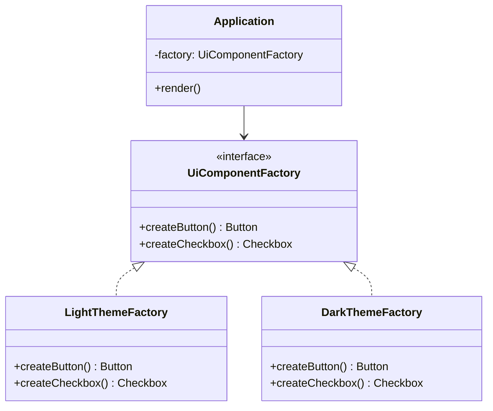
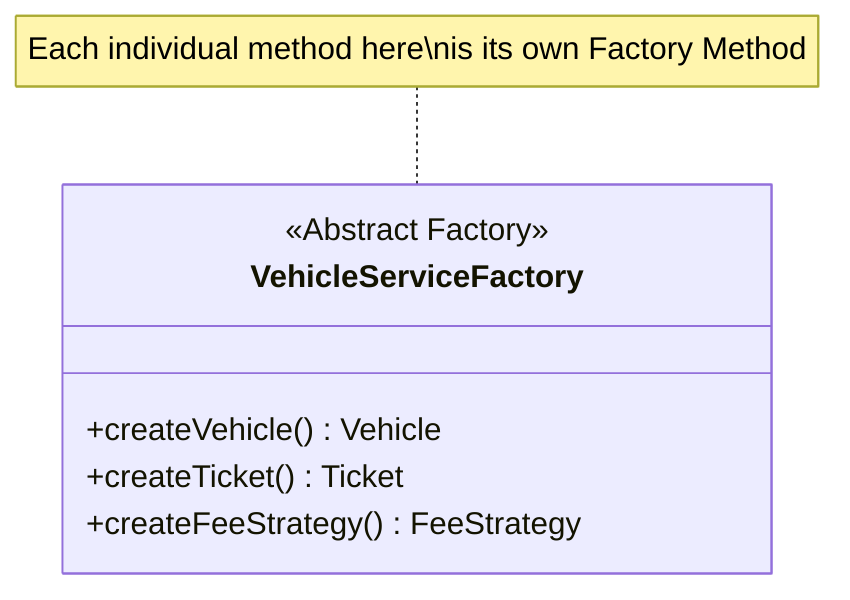

## Intent

> **Provide an interface for creating families of related or dependent objects without specifying
> their concrete classes.**

Factory Method (Chapter 17) creates **one** product. Abstract Factory creates **several related
products that must be consistent with each other** — get one family member right and the wrong
kind, and you've introduced a bug that's easy to miss until runtime.

## The Problem: Independent Factories Can Produce Inconsistent Combinations

Imagine a UI toolkit that must render consistently in either a "Light" or "Dark" theme, where a
`Button` and a `Checkbox` both need to match the active theme.

```java
class LightButtonFactory {
    Button createButton() { return new LightButton(); }
}

class DarkCheckboxFactory {
    Checkbox createCheckbox() { return new DarkCheckbox(); }
}
```

Nothing stops a caller from accidentally combining `LightButtonFactory` with
`DarkCheckboxFactory`, producing a light button next to a dark checkbox — a jarring, inconsistent
UI, and a bug that's purely a matter of the caller making an uncoordinated choice across two
unrelated factories.

## The Fix: One Factory, One Family

```java
interface UiComponentFactory {
    Button createButton();
    Checkbox createCheckbox();
}

class LightThemeFactory implements UiComponentFactory {
    public Button createButton() { return new LightButton(); }
    public Checkbox createCheckbox() { return new LightCheckbox(); }
}

class DarkThemeFactory implements UiComponentFactory {
    public Button createButton() { return new DarkButton(); }
    public Checkbox createCheckbox() { return new DarkCheckbox(); }
}

class Application {
    private final UiComponentFactory factory;

    Application(UiComponentFactory factory) {
        this.factory = factory;
    }

    void render() {
        Button button = factory.createButton();
        Checkbox checkbox = factory.createCheckbox();
        // both guaranteed to be from the same theme
    }
}
```

`Application` receives **one** factory and gets an entire, guaranteed-consistent family of
components from it — it's structurally impossible to accidentally mix a `LightButton` with a
`DarkCheckbox`, because both come from the same concrete factory object.



## Applying This to LLD Case Studies: Vehicle + Ticket + Fee Family

Recall the follow-up question from Chapter 17: "what if choosing 'CAR' should also determine the
correct `Ticket` type and `FeeStrategy`?" Abstract Factory answers it directly:

```java
interface VehicleServiceFactory {
    Vehicle createVehicle(String plate);
    Ticket createTicket();
    FeeStrategy createFeeStrategy();
}

class CarServiceFactory implements VehicleServiceFactory {
    public Vehicle createVehicle(String plate) { return new Car(plate); }
    public Ticket createTicket() { return new StandardTicket(); }
    public FeeStrategy createFeeStrategy() { return new HourlyFeeStrategy(); }
}

class TruckServiceFactory implements VehicleServiceFactory {
    public Vehicle createVehicle(String plate) { return new Truck(plate); }
    public Ticket createTicket() { return new OversizedTicket(); }
    public FeeStrategy createFeeStrategy() { return new FlatFeeStrategy(); }
}
```

Selecting `CarServiceFactory` guarantees you get a `Car`, a `StandardTicket`, and an
`HourlyFeeStrategy` together — never an accidental mismatch like a `Car` paired with an
`OversizedTicket`.

## Factory Method vs. Abstract Factory: The Precise Distinction

This is one of the most commonly confused pattern pairs in interviews — be ready to state the
difference precisely:

| | Factory Method | Abstract Factory |
|---|---|---|
| **Produces** | One product | A family of related products |
| **Typical structure** | One creation method | Multiple creation methods on one interface |
| **Consistency guarantee** | None needed (only one product) | Guarantees all products in the family match |
| **Relationship** | Often used *inside* an Abstract Factory's methods | Composed of multiple Factory Methods |

Notice the last row: `CarServiceFactory.createVehicle()` is itself a Factory Method — Abstract
Factory is best understood as **several Factory Methods grouped behind one interface**, not a
totally separate mechanism.



## Summary

- Abstract Factory creates families of related objects that must remain mutually consistent —
  Factory Method creates just one product at a time.
- The core risk it prevents is **inconsistent combinations** arising from independently choosing
  each related product separately.
- Structurally, an Abstract Factory is a single interface bundling several Factory Methods — one
  per product in the family.
- Reach for Abstract Factory specifically when a problem states or implies that multiple related
  objects must vary *together*, consistently, based on the same underlying condition (a theme, a
  vehicle category, a region).

---

## Interview Questions

**1. State the Abstract Factory pattern's intent, and explain precisely how it differs from
Factory Method.**
Abstract Factory provides an interface for creating families of related or dependent objects
without specifying their concrete classes, ensuring all objects produced by one concrete factory
implementation are mutually consistent. Factory Method, by contrast, defers the creation of a
*single* product to a method or object. The key distinction is scope: Factory Method handles one
product; Abstract Factory handles a *group* of related products that must vary together
consistently.
*Follow-up: Is Abstract Factory ever appropriate when there's only one product to create?* No —
if there's only ever one product involved, the added complexity of an Abstract Factory interface
with multiple creation methods provides no benefit over a plain Factory Method; introducing
Abstract Factory for a single-product scenario would be an unjustified, KISS-violating
over-application of the pattern.

**2. Walk through the `LightThemeFactory`/`DarkThemeFactory` example and explain exactly what bug
it prevents that two independent factories (`LightButtonFactory`, `DarkCheckboxFactory`) would
not.**
With two independent factories, nothing in the code structurally prevents a caller from mismatching
them — accidentally combining `LightButtonFactory.createButton()` with
`DarkCheckboxFactory.createCheckbox()` produces an inconsistent light-button/dark-checkbox UI, a
bug purely caused by uncoordinated selection across two unrelated factory objects. With a single
`UiComponentFactory` interface (implemented once per theme), a caller only ever selects *one*
concrete factory object, and every product it produces is guaranteed to come from that same,
internally-consistent implementation — the mismatch becomes structurally impossible rather than
merely a discipline the caller must remember to maintain.
*Follow-up: Could this same consistency be achieved without Abstract Factory, just through
disciplined naming conventions and documentation telling callers "always use matching factory
pairs"?* Technically, discipline alone could prevent the bug in principle, but relying on
convention rather than the type system to prevent an entire class of bugs is fragile and doesn't
scale as more developers or more product families are added — Abstract Factory encodes the
consistency guarantee structurally, which is strictly more reliable than relying on every future
developer remembering and following an unenforced convention.

**3. Explain the statement "an Abstract Factory is best understood as several Factory Methods
grouped behind one interface." Is this always literally true?**
Each individual creation method on an Abstract Factory interface (like `createButton()` or
`createVehicle()`) independently satisfies the Factory Method pattern's intent on its own — deferring
which concrete product class gets instantiated. Abstract Factory's additional value comes purely
from grouping several of these Factory Methods together on one interface, so a single concrete
implementation (like `LightThemeFactory`) provides consistent, coordinated answers for all of them
at once. This framing is a genuinely accurate way to understand the relationship in the vast
majority of real implementations, though the GoF's original formal definitions treat them as
distinct, separately-named patterns with their own canonical structure.
*Follow-up: If someone claimed "Abstract Factory is just multiple Factory Methods, so I don't need
to learn it as a separate concept," how would you respond?* While mechanically true at the
method level, treating them as fully interchangeable misses the point of *why* you'd group several
Factory Methods together in the first place — the specific problem of guaranteeing consistency
across a family of related products is Abstract Factory's distinct, valuable contribution, and
recognizing *when* that grouping and consistency guarantee is needed (versus when independent
Factory Methods are perfectly fine) is the actual interview-relevant skill, not just knowing the
mechanical relationship between the two patterns.

**4. In the `VehicleServiceFactory` example, why is it important that `createVehicle()`,
`createTicket()`, and `createFeeStrategy()` all live on the *same* interface, rather than being
three separate, independently-implemented Factory Method interfaces?**
Living on the same interface means selecting one concrete implementation (`CarServiceFactory`)
provides all three related objects together as a single, atomic choice — a caller can't
accidentally pick `CarServiceFactory` for the vehicle but a mismatched `TruckTicketFactory` for
the ticket, since there's no separate ticket-factory selection step at all; the single interface
structurally couples the three related creation decisions into one consistent choice.
*Follow-up: What would you lose, specifically, if you instead had three separate factory
interfaces (`VehicleFactory`, `TicketFactory`, `FeeStrategyFactory`) and simply documented that
callers should always select matching implementations for a given vehicle type?* You'd lose the
compile-time/structural guarantee of consistency entirely — a caller could still, through error or
unfamiliarity with the convention, select `CarFactory` alongside `OversizedTicketFactory`, producing
exactly the inconsistent combination Abstract Factory is specifically designed to prevent; you'd be
relying on documentation and developer discipline instead of the type system.

**5. How would you extend the `VehicleServiceFactory` design if a new requirement required
adding a fourth related product — say, an `InsurancePolicy` — to the family, for every existing
vehicle type?**
Add a new `createInsurancePolicy()` method to the `VehicleServiceFactory` interface, and implement
it in every existing concrete factory (`CarServiceFactory`, `TruckServiceFactory`, and any others).
This is a genuine modification to existing code — extending an interface and touching every
existing implementation — which is worth explicitly acknowledging as a real cost of the Abstract
Factory pattern.
*Follow-up: Does this scenario represent an Open/Closed Principle violation, and if so, is this
considered an acceptable trade-off of the pattern?* Yes, this is a genuine, well-known limitation
of Abstract Factory — adding a *new product to the family* requires modifying the interface and
every existing concrete factory implementation, unlike adding a *new family* (e.g., a new vehicle
type), which only requires a new class with no existing code touched. This is an accepted, explicit
trade-off of the pattern: it optimizes for easily adding new *families* at the cost of making it
more invasive to add new *members* to an existing family — worth stating explicitly in an interview
if this scenario comes up, rather than claiming the pattern has no OCP trade-offs at all.

**6. Given the previous question's answer, when would you specifically prefer Abstract Factory
despite this OCP limitation around adding new family members?**
Prefer Abstract Factory when the *number and identity* of products in the family is expected to
stay relatively stable over time (you know upfront it's "vehicle, ticket, fee strategy" and this is
unlikely to keep growing), while the *number of families* (new vehicle types) is the axis expected
to grow and vary more frequently — this matches the pattern's actual OCP profile: cheap to extend
along the "add new family" axis, more costly along the "add new family member" axis. If the
opposite is true (few, stable families but a frequently-growing list of product types within each),
Abstract Factory would be a poor structural fit.
*Follow-up: How would you redesign the system if you learned partway through an interview that
new products would actually be added to the family more often than new vehicle-type families?*
You might reconsider using independent Factory Methods (or a more flexible registry-based
composition approach) for each product type instead, accepting the reduced consistency guarantee in
exchange for making it cheaper to add new product types — explicitly trading Abstract Factory's
consistency benefit for better extensibility along the axis that actually matters more for this
specific, now-clarified problem.

**7. Can an Abstract Factory itself be implemented as a Singleton, and does this combination make
sense?**
Yes, and it's a common combination for the same reasoning discussed with Factory Method in Chapter
17 — a concrete factory implementation like `CarServiceFactory` is typically stateless (its
creation methods don't depend on any per-instance configuration), so there's no need for multiple
instances of it to exist; treating each concrete Abstract Factory implementation as a Singleton (or
a single shared instance registered in a lookup, similar to `VehicleFactoryProvider` from Chapter
17) avoids unnecessary object churn without changing anything about how the Abstract Factory
pattern itself works.
*Follow-up: Would the `VehicleServiceFactory` lookup mechanism (mapping "CAR" to
`CarServiceFactory`) look structurally similar to the `VehicleFactoryProvider` from the previous
chapter?* Yes, essentially identical in structure — a `Map<String, VehicleServiceFactory>` mapping
vehicle-type strings to their corresponding concrete Abstract Factory implementations, following the
exact same registration pattern discussed in Chapter 17, just now returning a richer factory that
produces multiple related products instead of just one.

**8. Is it possible for a class to depend on an Abstract Factory interface for testing purposes,
similar to the DIP-driven testability benefits discussed in Chapter 11?**
Yes — `Application`'s dependency on the abstract `UiComponentFactory` interface (rather than a
concrete `LightThemeFactory` or `DarkThemeFactory`) means a unit test can inject a fake factory
implementation that returns simple, controllable test-double `Button` and `Checkbox` objects,
allowing `Application.render()`'s logic to be tested in isolation without needing real theme-
specific UI component implementations at all — the exact same testability benefit DIP provides,
applied here through the Abstract Factory abstraction specifically.
*Follow-up: Would a fake `TestUiComponentFactory` used purely for testing need to maintain the
same "family consistency" guarantee that `LightThemeFactory` and `DarkThemeFactory` do in
production?* Not necessarily in the same meaningful sense — since a test double's `Button` and
`Checkbox` implementations are typically simple stand-ins with no real visual theme to be
"consistent" about, the consistency guarantee matters less for test doubles; what still matters is
that the fake factory correctly implements the full `UiComponentFactory` interface contract so
`Application`'s code compiles and runs correctly against it.

**9. How would you distinguish, when reading a class diagram, whether a given interface is
meant to represent a Factory Method or an Abstract Factory?**
Count the number of distinct product-creation methods declared on the interface, and consider
whether those products are meant to vary *together*, consistently, based on the same selection
criterion. An interface with exactly one creation method (like `VehicleFactory.createVehicle()`
from Chapter 17) is a Factory Method. An interface with multiple creation methods that are meant to
be selected together as a matched, consistent set (like `UiComponentFactory`'s `createButton()` and
`createCheckbox()`) is an Abstract Factory.
*Follow-up: Could an interface have multiple creation methods and still just be "several
unrelated Factory Methods coincidentally on one interface," rather than a true Abstract
Factory?* If the multiple products don't actually need to be *consistent* with each other (no risk
of a meaningful "mismatch" bug if they were selected independently), bundling them on one interface
provides little real Abstract-Factory-specific value beyond organizational convenience — true
Abstract Factory's defining characteristic is the *consistency guarantee* across the family, not
merely having multiple creation methods on one interface for its own sake.

**10. In an LLD interview for a "design a vending machine" problem, how might Abstract Factory
apply if the machine needs to dispense different families of consumable products (like "Snack
Kit" containing a snack + a napkin + a receipt template) that must be internally consistent?**
If different product "kits" (say, a "Healthy Snack Kit" versus a "Regular Snack Kit") each require
a coordinated combination of a specific snack type, packaging, and pricing/receipt format that must
stay consistent within a kit, an Abstract Factory (`SnackKitFactory` interface with
`createSnack()`, `createPackaging()`, `createReceipt()` methods) would ensure selecting a kit type
produces a fully consistent set of components, rather than risking an accidental mismatch (like a
"Healthy" snack packaged with "Regular" kit branding) from independently-chosen components.
*Follow-up: Is this level of design complexity likely to be warranted for a typical "design a
vending machine" interview problem, or would this be an example of over-applying Abstract
Factory?* For most standard vending machine interview problems (a machine dispensing one item per
slot, selected and paid for independently), this level of "family consistency" complexity is
unlikely to be warranted and would likely be an over-application, per the same YAGNI reasoning
from Chapter 12 — Abstract Factory should be reached for only if the interviewer's stated
requirements genuinely describe coordinated families of related products, not preemptively applied
to any scenario involving multiple types of objects.

**11. What's a concrete, real-world Java or JDK example (beyond invented business examples) that
resembles the Abstract Factory pattern?**
The `javax.xml.parsers.DocumentBuilderFactory` and related XML/JAXP APIs follow an Abstract-
Factory-like structure — different underlying XML parser implementations (from different vendors)
need to produce a consistent family of related objects (parsers, document builders) that are
guaranteed to work correctly together, and the factory abstraction lets the JDK swap in different
concrete parser implementations without application code needing to know which specific vendor's
classes are actually being instantiated underneath.
*Follow-up: Why is family consistency particularly important in this specific real-world
example?* Different XML parser vendor implementations are often incompatible with each other at
the object level (a `Document` object created by one vendor's parser might not work correctly with
another vendor's `Node` manipulation methods) — the Abstract Factory structure ensures that once
you select a `DocumentBuilderFactory` implementation, every related object you get from it
(documents, nodes, builders) is guaranteed to be from that same, internally compatible
implementation family, preventing exactly the kind of cross-implementation incompatibility bugs
that would otherwise be easy to introduce by mixing vendor-specific objects.

**12. Does Abstract Factory necessarily require every concrete factory implementation to
implement every single method on the interface, or can some methods be selectively unsupported?**
In a correctly-designed Abstract Factory, every concrete implementation should genuinely support
every method on the interface — if a specific concrete factory (say, a hypothetical
`MotorcycleServiceFactory`) can't meaningfully provide one of the family's products (perhaps
motorcycles don't need an `InsurancePolicy` the way cars do), throwing an exception or returning a
meaningless stub from that method would reproduce exactly the Liskov Substitution Principle
violation discussed in Chapter 9 — a strong signal that the interface's shape doesn't actually fit
every family it's being forced onto, and needs to be reconsidered (perhaps splitting into narrower,
more precisely-scoped family interfaces).
*Follow-up: How would you redesign the family interface if you discovered, partway through an LLD
interview, that one type genuinely couldn't support a required product from the family?* Split the
interface following the same reasoning as the ISP-related fixes in Chapter 10 — perhaps a smaller,
more universally-applicable `VehicleServiceFactory` interface covering only the products every
vehicle type genuinely needs (vehicle, ticket, fee strategy), with a separate, optional
`InsurableVehicleServiceFactory` extension interface adding `createInsurancePolicy()` only for
vehicle types that genuinely require it.

**13. How would you unit test that two different concrete Abstract Factory implementations
(`LightThemeFactory` and `DarkThemeFactory`) each correctly maintain internal consistency across
their products?**
Write a parameterized test that runs against both concrete factory implementations, verifying for
each one that the products it creates share the expected consistent characteristic — for example,
checking that `factory.createButton().getThemeName()` and
`factory.createCheckbox().getThemeName()` return the same theme name for whichever concrete factory
is under test. Running the identical assertion logic against every concrete factory implementation
(rather than writing separate, differently-structured tests for each) both verifies correctness and
implicitly documents the consistency contract the Abstract Factory interface is meant to guarantee.
*Follow-up: Does this kind of "same test logic run against every implementation" testing approach
have a more general name or connection to a concept covered earlier in this series?* Yes — this
connects directly to the LSP-verification technique mentioned in Chapter 9's discussion
(parameterized tests run against every subtype to verify substitutability) — here applied
specifically to verify each concrete Abstract Factory's internal family-consistency guarantee,
which is itself a form of contract every implementation must honor identically.

**14. In an LLD interview, if you're not sure whether a problem genuinely calls for Abstract
Factory versus several independent Factory Methods, what specific question would you ask the
interviewer (or reason through yourself) to decide?**
Ask (or reason through) whether the different products involved genuinely need to vary
*together*, consistently, based on the same underlying selector — specifically: "if someone chose
mismatched implementations for these two products independently, would that actually produce a
bug or an invalid state in this system?" If yes, Abstract Factory's consistency guarantee is
warranted. If the products can legitimately be selected and combined independently without any risk
of an invalid combination, several independent Factory Methods are sufficient, and introducing the
combined Abstract Factory interface would be unnecessary, YAGNI-violating complexity.
*Follow-up: Give a concrete example, within a single interview problem, where you might correctly
use Factory Method for one part of the design and Abstract Factory for another part.* In a "design
a parking lot" problem, you might use a simple Factory Method for `PaymentMethod` selection (since
a customer's chosen payment method — cash, card, UPI — is independent of and doesn't need to stay
"consistent with" their vehicle type), while using an Abstract Factory for the
`Vehicle`/`Ticket`/`FeeStrategy` family specifically because those three genuinely must stay
consistent with each other based on vehicle type, as shown throughout this chapter — both patterns
coexisting correctly within the same overall design, applied to the specific parts of the problem
each one actually fits.
