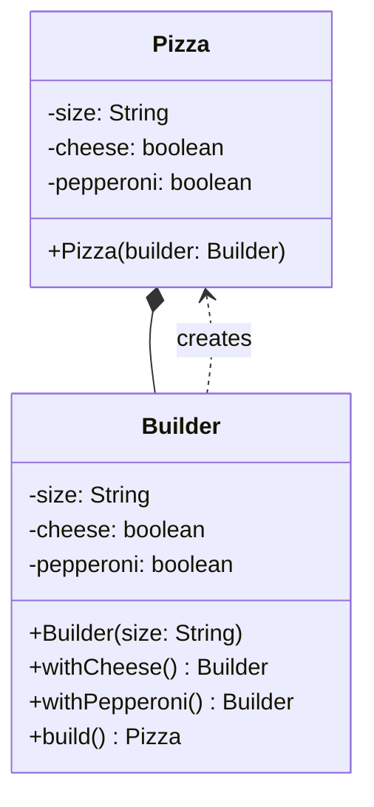

## Intent

> **Separate the construction of a complex object from its representation, so the same
> construction process can create different representations.**

In practice, in Java interviews, Builder is used for a narrower, more immediately practical
purpose: **making objects with many fields — especially many optional fields — constructible
without an unreadable, error-prone parameter list.**

## The Problem: Telescoping Constructors

```java
class Pizza {
    Pizza(String size, boolean cheese, boolean pepperoni, boolean mushroom,
          boolean thinCrust, boolean extraSauce, boolean glutenFree) {
        // ...
    }
}

// Calling it:
Pizza pizza = new Pizza("Large", true, false, true, false, true, false);
```

Two problems, both serious in practice:

1. **Readability collapses.** What does the fourth `true` mean? A reader has to count parameters
   and cross-reference the constructor signature every time.
2. **Every combination of optional parameters needs its own overload**, if you try to avoid
   forcing callers to specify irrelevant booleans (`Pizza(String size, boolean cheese)`,
   `Pizza(String size, boolean cheese, boolean pepperoni)`, and so on) — this is the "telescoping
   constructor" anti-pattern, and it scales combinatorially with the number of optional fields.

## The Fix: A Fluent Builder

```java
class Pizza {
    private final String size;
    private final boolean cheese;
    private final boolean pepperoni;
    private final boolean mushroom;
    private final boolean thinCrust;

    private Pizza(Builder builder) {
        this.size = builder.size;
        this.cheese = builder.cheese;
        this.pepperoni = builder.pepperoni;
        this.mushroom = builder.mushroom;
        this.thinCrust = builder.thinCrust;
    }

    static class Builder {
        private final String size; // required
        private boolean cheese = false;
        private boolean pepperoni = false;
        private boolean mushroom = false;
        private boolean thinCrust = false;

        Builder(String size) { // required fields go in the Builder's own constructor
            this.size = size;
        }

        Builder withCheese() { this.cheese = true; return this; }
        Builder withPepperoni() { this.pepperoni = true; return this; }
        Builder withMushroom() { this.mushroom = true; return this; }
        Builder thinCrust() { this.thinCrust = true; return this; }

        Pizza build() {
            return new Pizza(this);
        }
    }
}
```

```java
Pizza pizza = new Pizza.Builder("Large")
    .withCheese()
    .withMushroom()
    .thinCrust()
    .build();
```

Every call is now self-documenting — `withCheese()` and `thinCrust()` read as plain English, and
callers only specify the optional fields they actually care about, in any order, with no
positional confusion.



## Enforcing Required Fields at Compile Time

A plain Builder still lets a caller call `.build()` without setting anything meaningful. For
required fields, put them in the **Builder's own constructor** (as shown above with `size`) rather
than a setter-style method — this makes it impossible to construct a `Builder` at all without
supplying them, catching the omission at compile time rather than via a runtime check inside
`build()`.

```java
// This won't compile — size is required by the Builder's constructor:
Pizza pizza = new Pizza.Builder().withCheese().build(); // compile error
```

This is the Chapter 5 "temporal coupling" fix in action — making an invalid construction sequence
*unrepresentable*, rather than merely validated after the fact.

## Builder vs. Java Records: When You Don't Need Builder At All

Since Java 16, the `record` keyword provides a concise, immutable data carrier with a generated
constructor, `equals()`, `hashCode()`, and `toString()`. For an object with a small number of
**required** fields and no meaningfully "optional" ones, a record is simpler than a Builder and
should be preferred:

```java
record Point(int x, int y) { }

Point p = new Point(3, 4); // clear, no ambiguity, no Builder needed
```

**The decision rule:** if every field is required and the field count is small (roughly 4 or
fewer), a constructor or record is simpler and the Builder pattern would be over-engineering
(Chapter 12's KISS principle applies directly). Reach for Builder specifically when fields are
numerous, mostly optional, or when constructing the object involves multi-step validation logic
that benefits from being centralized in one `build()` method.

## Builder vs. Factory Method: A Common Point of Confusion

Both patterns are creational, and both can involve a method returning a constructed object — but
they solve different problems:

| | Factory Method | Builder |
|---|---|---|
| **Solves** | *Which* concrete class to instantiate | *How* to assemble one object's many fields |
| **Number of steps** | Usually one call | Multiple chained calls, then `build()` |
| **Variability axis** | Type/subclass selection | Field/configuration selection |

A Builder can *internally* use a Factory Method if, say, `.build()` needs to decide which concrete
`Pizza` subclass to construct based on the accumulated options — the two patterns compose cleanly
rather than competing.

## A Case-Study Preview: Builder for `HttpRequest`-Style Objects

Builder is the natural fit anywhere an object has several optional configuration knobs — this
exact shape reappears in Chapter 56 (Logging Framework) for building a configured `Logger`, and in
several other case studies for constructing complex request/configuration objects.

## Summary

- Builder separates constructing a complex object from representing it, primarily solving the
  "too many constructor parameters, especially optional ones" problem in Java.
- Telescoping constructors (an overload for every combination of optional parameters) is the
  anti-pattern Builder directly replaces.
- Put required fields in the Builder's own constructor, not in setter-style methods, to catch
  missing required data at compile time rather than at runtime.
- Don't reach for Builder when a small, all-required field set makes a plain constructor or a
  Java `record` simpler and just as clear — that's a KISS/YAGNI call, not a Builder use case.

---

## Interview Questions

**1. State the Builder pattern's intent and the specific practical problem it solves in Java.**
Builder separates the construction of a complex object from its final representation, allowing the
same step-by-step construction process to produce different configurations of that object. In
practice, in Java, it most commonly solves the problem of objects with many fields — especially
many *optional* ones — becoming unreadable and error-prone to construct via a single large
constructor, replacing that with a fluent, self-documenting, step-by-step construction API.
*Follow-up: Is Builder considered a creational pattern, and if so, why does it belong in that
category alongside Singleton and Factory Method?* Yes — it's categorized as creational because its
entire concern is *how an object comes into existence*, specifically addressing the complexity of
that construction process, which is the defining characteristic of the creational pattern category
as established in Chapter 15.

**2. What is the "telescoping constructor" anti-pattern, and how does Builder solve it?**
Telescoping constructors occur when a class provides multiple overloaded constructors, each
accepting progressively more parameters, to let callers specify only the optional fields they care
about — this quickly becomes unmanageable as the number of optional fields grows, since the number
of meaningful overload combinations grows combinatorially, and callers still have no way to specify,
say, the 4th and 6th optional parameters without also being forced to pass values for the 5th.
Builder solves this by replacing the constructor entirely with a chain of individually-named
methods (`withCheese()`, `thinCrust()`), letting callers set exactly and only the fields they need,
in any order, with self-documenting method names instead of positional, easily-miscounted
arguments.
*Follow-up: Even without full telescoping (just one large constructor with many optional
boolean parameters, all defaulting to some value), why is Builder still preferable to positional
boolean arguments?* Positional boolean arguments are notoriously easy to misread and misorder at
the call site (`new Pizza("Large", true, false, true, false, true, false)` gives no indication
which boolean corresponds to which topping without checking the signature) — Builder's named
methods eliminate this ambiguity entirely, regardless of whether the constructor technically
"telescopes" through multiple overloads or not.

**3. How does putting required fields in the Builder's own constructor (rather than in
`build()`'s runtime validation) improve on a Builder that validates required fields only inside
`build()`?**
Requiring fields via the Builder's constructor means the compiler itself prevents constructing a
`Builder` instance at all without supplying them (`new Pizza.Builder("Large")` — the `size`
argument is mandatory syntax, not optional) — any missing required field is caught immediately at
compile time. A Builder that instead checks for required fields only inside `build()` (throwing an
exception if `size` was never set) defers this feedback to runtime, meaning a bug could
theoretically reach production or a late test run before the missing-required-field issue
surfaces, rather than being impossible to write in the first place.
*Follow-up: Is there ever a legitimate reason to still validate a "required" field inside
`build()` in addition to (or instead of) enforcing it via the constructor?* Yes — for
required *relationships between* multiple fields (like "if `glutenFree` is true, `thinCrust` must
also be true" business-rule-style constraints) that can't be expressed as a single field's mere
presence, `build()`-time validation is still necessary and appropriate, since the compiler has no
way to enforce cross-field business rules the way it can enforce "this single argument must be
supplied."

**4. When would you choose a Java `record` over the Builder pattern, and why is this decision
directly connected to the KISS principle from Chapter 12?**
Choose a `record` when the object has a small number of fields that are all genuinely required,
with no meaningfully "optional" configuration — in this case, a record's concise, generated
constructor (`new Point(3, 4)`) is simpler, requires no additional Builder class to write and
maintain, and is just as clear as a fluent Builder chain would be, if not clearer. Introducing a
full Builder for a simple, all-required, small object would add unnecessary ceremony and an extra
class purely for the sake of "using a pattern," directly violating KISS's guidance to avoid
unnecessary complexity.
*Follow-up: At what rough threshold of field count or "percentage optional" would you personally
switch from recommending a record/plain constructor to recommending a Builder in an interview?*
There's no hard rule, but a common practical heuristic is considering Builder once a class has more
than around 4-5 constructor parameters, or once even a single field is genuinely optional in a way
that would otherwise require an awkward `null` or sentinel-value placeholder in a plain
constructor call — both of these are reasonable signals that a Builder's improved readability and
flexibility are starting to earn their added complexity.

**5. Explain precisely how Builder differs from Factory Method, given that both are creational
patterns that can involve a method call returning a fully-constructed object.**
Factory Method addresses *which concrete class* to instantiate, typically resolved via a single
method call based on some runtime condition. Builder addresses *how to assemble one object's many
fields* step by step, typically via a chain of multiple method calls setting individual pieces of
configuration before a final `build()` call. They solve fundamentally different problems — type
selection versus field assembly — even though both ultimately produce a constructed object as their
result.
*Follow-up: Could a single `build()` method internally use a Factory Method to decide which
concrete subclass of the target object to actually construct, combining both patterns?* Yes — for
example, a `Pizza.Builder.build()` method could internally decide to construct either a
`RegularPizza` or a `GlutenFreePizza` subclass based on the accumulated builder state
(`glutenFree` flag), using Factory-Method-style logic internally while the overall construction
process is still driven by the Builder's fluent API — the two patterns compose cleanly rather than
being mutually exclusive alternatives.

**6. Is the Builder pattern compatible with immutability, or does its step-by-step
"set, set, set, build" nature inherently require the final object to be mutable?**
Builder is fully compatible with, and commonly used specifically to produce, immutable final
objects — the *Builder* object itself is mutable during the construction process (its fields are
set incrementally), but the final `Pizza` object it constructs via `build()` can have entirely
`final` fields set once, permanently, in `Pizza`'s private constructor, exactly as shown in this
chapter's example. This separation (mutable builder, immutable final product) is one of Builder's
most valuable properties, since it combines flexible, incremental construction with the safety and
thread-safety benefits of an immutable final object.
*Follow-up: Why is producing an immutable final object generally preferable to a mutable one for
something like a `Pizza` order, from a design-quality perspective?* An immutable `Pizza` object
protects its own invariants permanently once constructed (per Chapter 2's encapsulation discussion)
— no code anywhere in the system can later mutate a `Pizza`'s toppings after it's been created and
potentially already used elsewhere (like being added to an order total calculation or sent to a
kitchen display), eliminating an entire class of bugs where an object's state changes unexpectedly
out from under code that's relying on it staying constant.

**7. How would you implement a Builder that enforces a specific, meaningful ordering of method
calls — for example, requiring `.withCheese()` to always be called before `.withPepperoni()` if
both are used together — using Java's type system, rather than a runtime check?**
This can be achieved with a technique sometimes called the "staged builder" or "type-safe builder"
pattern, where each builder method returns a *different* interface or class type representing the
next allowed stage, so the compiler itself only exposes the methods valid at each stage — for
example, `withCheese()` could return a `CheeseAddedBuilder` type that's the only type exposing
`withPepperoni()`, making it a compile error to call `withPepperoni()` before `withCheese()`. This
is a much more rigorous, if more verbose, way to prevent invalid call sequences than a runtime
check inside `build()`.
*Follow-up: Is this staged/type-safe builder technique commonly used in typical LLD interview
answers, or is it more of an advanced, specialized technique?* It's a more advanced technique
generally reserved for library or API design where enforcing correct usage at compile time provides
substantial value to many callers (like certain fluent HTTP client builders) — for a typical LLD
interview answer, mentioning awareness of the technique is a good signal of depth, but implementing
the simpler, standard fluent Builder (with `build()`-time validation for any genuinely necessary
ordering constraints) is usually sufficient and more time-appropriate given interview constraints.

**8. Explain how the Builder pattern satisfies (or doesn't directly relate to) the Single
Responsibility Principle from Chapter 7.**
Builder supports SRP by cleanly separating the responsibility of "representing a fully-constructed,
valid `Pizza`" (the `Pizza` class itself) from the responsibility of "managing the incremental,
step-by-step process of assembling one" (the `Builder` class) — without Builder, a class might be
tempted to embed complex, multi-step construction logic (like conditional validation of many
optional fields) directly inside its own constructor, mixing "being a pizza" with "the process of
becoming one" into a single class.
*Follow-up: Is it ever appropriate to skip the separate static nested `Builder` class and instead
add builder-style methods directly onto the target class itself?* This is uncommon and generally
discouraged for immutable final objects, since it would require the target class itself to be
mutable during a "building" phase and then somehow become immutable afterward, which complicates
the class's own invariants and lifecycle; keeping the Builder as a fully separate class (even if
nested) cleanly preserves the target class's own simplicity and immutability.

**9. How would the `HourlyFeeStrategy` and other simple, single-field-configuration classes from
earlier chapters differ from `Pizza` in terms of whether they'd benefit from a Builder?**
`HourlyFeeStrategy` has essentially no configurable construction complexity — it's typically
constructed with zero or very few required parameters and has no combination of "optional toppings"
to assemble; wrapping it in a Builder would add pure ceremony with zero corresponding benefit,
following the same KISS-driven reasoning discussed for records. `Pizza`, by contrast, genuinely has
several independent, optional configuration dimensions that benefit from named, chainable methods —
the presence of multiple, genuinely optional fields is the specific signal that differentiates
"needs a Builder" from "just use a plain constructor."
*Follow-up: If `HourlyFeeStrategy` later needed to support several optional configuration
parameters (a discount rate, a rounding mode, a minimum charge), would that change your
recommendation?* Yes — at that point, `HourlyFeeStrategy` would have crossed the same threshold
that justified `Pizza`'s Builder, and introducing a Builder for it at that point would become the
appropriate, non-over-engineered choice, following the exact same "several optional fields"
decision rule applied consistently.

**10. Is the Builder pattern's fluent, chained method-call style (`.withCheese().withMushroom()`)
an essential part of the pattern, or is it a stylistic convention that could be omitted?**
The fluent chaining style (each method returning `this`) is a widely-adopted convention that
significantly improves readability and ergonomics, but it's not strictly essential to the GoF
Builder pattern's core intent — a Builder could technically use void-returning setter-style methods
(`builder.setCheese(true); builder.setMushroom(true);` on separate lines) and still satisfy the
pattern's fundamental purpose of separating step-by-step construction from the final object's
representation. The fluent chaining is a valuable, near-universal Java idiom layered on top of the
pattern, not a strict structural requirement of it.
*Follow-up: What's the specific mechanical reason fluent chaining is possible — what does each
builder method need to return to enable it?* Each intermediate builder method must return a
reference to the builder object itself (typically `return this;`), so the result of one method call
can immediately have another method called on it in the same expression — this is why the method
signatures in the example chapter code all declare `Builder` as their return type rather than
`void`.

**11. How would you handle a scenario where a Builder needs to construct an object whose exact
final concrete type (not just configuration) depends on the combination of options set — for
example, a `glutenFree` `Pizza` needing to actually be a different subclass with different
behavior, not just a flag?**
The `build()` method itself becomes the natural place to apply Factory-Method-style logic — instead
of always calling `new Pizza(this)`, `build()` could inspect the accumulated builder state and
decide to construct and return either a `RegularPizza` or `GlutenFreePizza` instance (both
presumably implementing a shared `Pizza` interface or extending a common `Pizza` abstract class),
based on which fields were set. This is a direct, practical example of Builder and Factory Method
composing together within a single `build()` method, as mentioned earlier in this chapter.
*Follow-up: Would you need to change the Builder's own class structure (beyond just the logic
inside `build()`) to support this, or is this purely an internal implementation detail of
`build()`?* In most cases, this can remain purely an internal implementation detail of `build()` —
the Builder's public fluent API (`withCheese()`, `withMushroom()`, etc.) and its field-setting
logic don't need to change at all; only the final decision of which concrete class to instantiate
and return, made inside `build()`, needs the added conditional/Factory-Method-style logic.

**12. In an LLD interview, if asked to design a `ParkingTicket` class with fields like
`ticketId`, `entryTime`, `vehicle`, and `spotId` — all of which are required, with no optional
fields — would you use a Builder, and why or why not?**
No — since every field is required with no meaningful optionality, a plain constructor (or a Java
`record`, if immutability and conciseness are desired) is simpler and equally clear:
`new ParkingTicket(ticketId, entryTime, vehicle, spotId)` reads perfectly well without needing
named builder methods, since there's no ambiguity about optional versus required fields to resolve
and no combinatorial explosion of optional-parameter combinations to tame. Introducing a Builder
here would be unjustified added complexity for a problem Builder isn't actually needed to solve.
*Follow-up: If the interviewer later added a requirement that `ParkingTicket` should optionally
support a `discountCode` and an optional `promotionalMessage`, would your answer change?* At that
point, with two genuinely optional fields added to an otherwise required set, it becomes a
reasonable, judgment-call decision point — a small number of optional fields (just two) might still
be comfortably handled with an overloaded constructor or nullable parameters without necessarily
requiring a full Builder, but if you expect further optional fields to be added over time, or want
the resulting code's readability benefits, introducing a Builder at this point would be a
defensible, no-longer-over-engineered choice.

**13. How does the Builder pattern relate to, or differ from, using a plain mutable class with
public setters and a no-argument constructor (the "JavaBean" style) to achieve similarly flexible,
step-by-step construction?**
Both approaches allow setting fields incrementally after initial object creation, but they differ
significantly in safety: the JavaBean style produces an object that starts in an invalid,
incompletely-initialized state immediately after construction (before any setters are called) and
remains mutable indefinitely afterward, with no way to guarantee all required fields were ever set
or to prevent later, unexpected mutation. Builder, by contrast, only exposes the fully-constructed
object via `build()` once all required data (enforced by the constructor, as discussed in Question
3) has been provided, and typically produces a genuinely immutable final object — Builder achieves
the same construction flexibility while avoiding the JavaBean pattern's "temporarily invalid,
permanently mutable" downsides.
*Follow-up: Are there legitimate contexts where the JavaBean style with public setters is still
preferred over Builder despite these downsides?* Yes — certain frameworks and libraries
(particularly some older serialization/deserialization frameworks, and some ORM tools) historically
required or strongly favored a no-argument constructor plus public setters for their own internal
reflection-based instantiation mechanisms; in those specific framework-driven contexts, the
JavaBean style may be a practical necessity despite its general design downsides, though many modern
frameworks now support constructor-based or Builder-friendly instantiation instead.

**14. If an interviewer asks you to implement the Builder pattern for a `ParkingLot` case study's
configuration object (say, a `ParkingLotConfig` with fields for `numberOfFloors`,
`spotsPerFloor`, `allowedVehicleTypes`, `hourlyRate`, and an optional `weekendDiscountRate`), walk
through how you'd structure the Builder, including which fields you'd make required versus
optional.**
`numberOfFloors`, `spotsPerFloor`, and `allowedVehicleTypes` are likely required (a parking lot
without floors or spot capacity doesn't make sense), so these would go in the Builder's own
constructor: `new ParkingLotConfig.Builder(numberOfFloors, spotsPerFloor, allowedVehicleTypes)`.
`hourlyRate` might be required or have a sensible default depending on the problem's framing, and
`weekendDiscountRate` is genuinely optional, defaulting to zero if never set, exposed via a chained
`.withWeekendDiscount(rate)` method. The final `build()` method would validate any cross-field
business rules (e.g., "weekendDiscountRate must be between 0 and 1 if set") before constructing the
immutable `ParkingLotConfig` object.
*Follow-up: Would you make `ParkingLotConfig` itself immutable, and if so, why does that matter
for a configuration object specifically, beyond the general immutability benefits discussed
earlier?* Yes, strongly — a configuration object is typically read by many other parts of the
system throughout the application's lifetime (fee calculators, spot allocators, reporting
components), and if it were mutable, any one of those consumers could accidentally alter shared
configuration state that other parts of the system are simultaneously relying on staying constant,
which would be a particularly dangerous and hard-to-trace class of bug specifically because
configuration objects tend to be widely shared and long-lived throughout an application's runtime.
