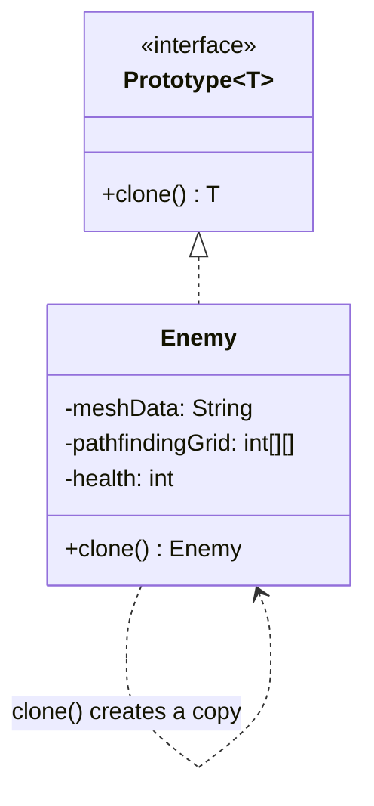

## Intent

> **Specify the kinds of objects to create using a prototypical instance, and create new objects
> by copying this prototype.**

Prototype is the least frequently used of the five creational patterns in typical LLD interviews,
but it solves a real, specific problem: **when constructing a new object from scratch is
expensive, and a pre-configured template already exists that's cheaper to copy.**

## The Motivating Problem

Imagine a game with an `Enemy` object whose construction involves loading a 3D model, parsing
configuration, and computing pathfinding data — genuinely expensive work.

```java
class Enemy {
    private String meshData;   // loaded from a large file
    private int[][] pathfindingGrid; // computed at construction time
    private int health;
    private int x, y;

    Enemy(String meshFile) {
        this.meshData = loadMeshFromDisk(meshFile);        // slow
        this.pathfindingGrid = computePathfinding(meshFile); // slow
        this.health = 100;
    }
}
```

If a level needs to spawn 50 identical enemies, calling `new Enemy("goblin.mesh")` fifty times
means redoing the expensive mesh-loading and pathfinding computation fifty times, even though the
result is identical each time except for position.

## The Fix: Clone a Pre-Built Prototype

```java
interface Prototype<T> {
    T clone();
}

class Enemy implements Prototype<Enemy> {
    private String meshData;
    private int[][] pathfindingGrid;
    private int health;
    private int x, y;

    Enemy(String meshFile) {
        this.meshData = loadMeshFromDisk(meshFile);
        this.pathfindingGrid = computePathfinding(meshFile);
        this.health = 100;
    }

    private Enemy(Enemy source) { // copy constructor used internally by clone()
        this.meshData = source.meshData;             // safe to share — immutable data
        this.pathfindingGrid = deepCopy(source.pathfindingGrid); // must deep-copy — mutable
        this.health = source.health;
        this.x = source.x;
        this.y = source.y;
    }

    public Enemy clone() {
        return new Enemy(this);
    }

    void setPosition(int x, int y) { this.x = x; this.y = y; }
}
```

```java
Enemy goblinPrototype = new Enemy("goblin.mesh"); // pay the expensive cost exactly once

for (int i = 0; i < 50; i++) {
    Enemy goblin = goblinPrototype.clone(); // cheap — no re-loading, no re-computing
    goblin.setPosition(i * 10, 0);
    spawnEnemy(goblin);
}
```

The expensive `loadMeshFromDisk()` and `computePathfinding()` work happens exactly once, for the
prototype — every subsequent enemy is a cheap copy.



## The Trap: Shallow Copy vs. Deep Copy

This is where nearly every Prototype interview question actually lives, and it's the single most
important detail in this chapter.

**Shallow copy** copies an object's fields as-is — for a field that's a reference to another
object (like `pathfindingGrid`, an array), the copy gets a reference to the **same** underlying
array, not a new one.

```java
private Enemy(Enemy source) {
    this.pathfindingGrid = source.pathfindingGrid; // SHALLOW — same array, shared!
}
```

With this shallow version, mutating one clone's `pathfindingGrid` — say, updating it as the enemy
moves and its pathfinding recalculates — **silently corrupts every other clone's pathfinding data
too**, since they all point to the exact same array in memory. This is a severe, hard-to-trace bug:
each `Enemy` object looks independent, but they're secretly entangled.

**Deep copy** recursively copies mutable referenced objects too, so each clone gets its own
independent copy of every mutable field:

```java
private Enemy(Enemy source) {
    this.pathfindingGrid = deepCopy(source.pathfindingGrid); // DEEP — new array, independent
}

private static int[][] deepCopy(int[][] original) {
    int[][] copy = new int[original.length][];
    for (int i = 0; i < original.length; i++) {
        copy[i] = original[i].clone(); // clone each row too — arrays of arrays need this
    }
    return copy;
}
```

**The rule of thumb:** immutable fields (`String`, primitives, `LocalDate`) are always safe to
share via shallow copy — since they can't be mutated, there's no entanglement risk. Mutable fields
(arrays, `List`s, other mutable objects) must be deep-copied, or every clone silently shares state
with the prototype and with each other.

## Java's `Cloneable` Interface: Why This Series Avoids It

Java has a built-in `Cloneable` interface and `Object.clone()` method — but it's widely considered
a design mistake in the language, and most modern Java code avoids it entirely:

- `Cloneable` is a marker interface (Chapter 3) with **no `clone()` method of its own** — it
  doesn't actually declare the method it's supposedly marking support for.
- `Object.clone()` performs a **shallow copy by default**, and overriding it correctly requires
  fragile, easy-to-get-wrong boilerplate (calling `super.clone()`, casting, manually deep-copying
  mutable fields).
- It interacts awkwardly with `final` fields and constructors, since `Object.clone()` bypasses
  constructors entirely.

**The recommended, safer approach** (shown throughout this chapter) is a manual **copy
constructor** or a dedicated static factory method — both give you full, explicit control over
which fields are shallow-copied and which are deep-copied, with no hidden framework behavior to get
wrong.

## When Prototype Is (and Isn't) the Right Call

Reach for Prototype specifically when:

- Object construction is **measurably expensive** (I/O, computation, network calls) — not just
  "has several fields," which is Builder's territory (Chapter 19), not Prototype's.
- Many similar objects, differing only in a few fields, are needed from the same expensive base
  configuration.

Don't reach for it when construction is already cheap — cloning machinery adds real complexity
(especially the deep-copy discipline above), and applying it to cheap-to-construct objects is a
clear KISS/YAGNI violation (Chapter 12) with no corresponding benefit.

## Summary

- Prototype creates new objects by cloning a pre-built prototype instance, avoiding the cost of
  repeating expensive construction work.
- The critical risk is confusing shallow copy (sharing mutable references — a serious bug) with
  deep copy (independent copies of mutable state — the usually-correct choice).
- Avoid Java's built-in `Cloneable`/`Object.clone()` — a manual copy constructor gives explicit,
  auditable control over exactly which fields need deep copying.
- Only use Prototype when construction is genuinely expensive — for cheap objects, this pattern's
  added complexity isn't justified.

---

## Interview Questions

**1. State the Prototype pattern's intent, and describe the specific circumstance where it
provides real value over just calling a constructor directly.**
Prototype creates new objects by copying an existing, pre-configured prototypical instance rather
than constructing each new object from scratch. It provides real value specifically when object
construction is expensive (involving significant computation, I/O, or resource loading), and many
similar instances are needed — cloning an already-built prototype avoids repeating that expensive
work for every new instance, since only the (typically much cheaper) copying operation is repeated.
*Follow-up: If constructing an object is cheap (a few field assignments, no I/O or heavy
computation), would Prototype still ever be worth using?* Generally no — if construction is
already cheap, the added complexity of implementing correct cloning (especially the deep-copy
discipline) provides no meaningful performance benefit and would be an unjustified complexity cost,
consistent with the KISS/YAGNI reasoning applied throughout this series.

**2. Explain the difference between shallow copy and deep copy, using the `Enemy`/
`pathfindingGrid` example.**
A shallow copy copies an object's fields by value for primitives, but for reference-type fields
(like an array or object reference), it copies the *reference itself*, not the object it points to
— meaning the original and the copy both end up pointing to the exact same underlying object. A
deep copy instead recursively creates independent copies of referenced mutable objects, so the
original and the copy have entirely separate, non-shared instances of every mutable field. In the
`Enemy` example, a shallow copy of `pathfindingGrid` means every cloned `Enemy` shares the exact
same array — mutating one clone's grid corrupts all of them; a deep copy gives each clone its own
independent grid.
*Follow-up: Would a shallow copy of the `health` field (an `int`) cause the same sharing problem
as the shallow copy of `pathfindingGrid`?* No — `int` is a primitive value type, not a reference
type, so copying it (shallow or otherwise) always produces an independent value; there's no
"reference" to share in the first place, which is exactly why primitive and immutable fields are
always safe to copy shallowly with no risk, unlike mutable reference-type fields like arrays.

**3. Why are immutable fields (like `String`) always safe to share via shallow copy, while
mutable fields (like arrays or `ArrayList`s) are not?**
An immutable object's state can never change after construction — even if two `Enemy` clones share
the exact same `String meshData` reference, there's no way for either clone to mutate that shared
`String` and affect the other, since `String` provides no mutating methods at all. A mutable
object's state, by contrast, *can* be changed after construction — if two clones share the same
`int[][] pathfindingGrid` reference, mutating the array through one clone's reference (e.g.,
`clone1.pathfindingGrid[0][0] = 5`) is visible through the other clone's reference too, since
they're the literal same array object in memory, not merely equal-valued separate arrays.
*Follow-up: Does this mean you never need to worry about shallow-copying a field whose type is a
custom, user-defined class, as long as you're confident that class is immutable?* Correct — if a
custom class is genuinely, verifiably immutable (all fields `final`, no mutator methods, and any of
its own reference-type fields are either also immutable or properly deep-copied/defensively-copied
at construction time), sharing a reference to it via shallow copy carries the same zero-risk
guarantee as sharing a `String` reference; the safety comes from actual immutability, not from the
type being a "primitive" versus a "custom class."

**4. Why does this series specifically recommend avoiding Java's built-in `Cloneable` interface
and `Object.clone()` method in favor of a manual copy constructor?**
`Cloneable` is a marker interface with no `clone()` method declared on it at all, meaning
implementing `Cloneable` alone doesn't actually give you a usable `clone()` method or enforce any
contract — you still have to override `Object.clone()` separately and correctly cast its return
type. `Object.clone()`'s default behavior performs only a shallow copy, and correctly overriding it
to perform deep copies where needed requires calling `super.clone()`, handling
`CloneNotSupportedException`, and manually deep-copying each mutable field — a process
widely regarded (including by Joshua Bloch in *Effective Java*) as fragile and easy to implement
incorrectly. A manual copy constructor (as shown in this chapter) achieves the exact same outcome
with plain, explicit, easily-reviewable code and no framework-specific pitfalls.
*Follow-up: Does using a copy constructor instead of `Cloneable` sacrifice any capability, such as
being able to clone an object without knowing its exact concrete type at compile time?* Yes, this
is a genuine trade-off — `Object.clone()`, because it's inherited from `Object`, can in principle be
called polymorphically on any object without knowing its concrete type; a copy constructor requires
knowing (or being told, via an interface method like `Prototype<T>.clone()` as shown in this
chapter) the concrete type to invoke the right constructor. This is exactly why the pattern is
typically implemented with a custom `Prototype<T>` interface exposing a `clone()` method — it
recovers the polymorphic-cloning capability without inheriting `Object.clone()`'s pitfalls.

**5. In the `Prototype<T>` interface shown in this chapter, why does the `clone()` method's
return type matter, and what Java feature makes this work cleanly for different concrete
classes?**
`Prototype<T>` uses a generic type parameter so each implementing class can specify its own
concrete return type — `Enemy implements Prototype<Enemy>` means `Enemy.clone()` returns an
`Enemy`, not a generic `Object` requiring an unsafe cast at every call site. This relies on Java
generics combined with covariant return types (mentioned in Chapter 9) — without generics, a shared
`clone()` method would need to return `Object`, forcing every caller to manually cast the result
back to the correct concrete type, reintroducing exactly the kind of unsafe, error-prone casting
that using `Object.clone()` directly would also require.
*Follow-up: What would go wrong, concretely, if `Prototype` were defined without generics, as
`interface Prototype { Object clone(); }`?* Every call site would need an explicit cast:
`Enemy goblin = (Enemy) goblinPrototype.clone();` — and if a developer accidentally cast to the
wrong type, this would only be caught at runtime via a `ClassCastException`, rather than being
caught at compile time as it is with the generic version, reintroducing a category of bug the
generic interface specifically eliminates.

**6. How would you decide, for a specific field on a class implementing Prototype, whether it
needs a deep copy, a shallow copy, or something else entirely (like re-fetching fresh data)?**
Ask whether the field's type is genuinely immutable (safe for shallow copy), a mutable object whose
independent state matters for each clone (needs deep copy), or represents something that
conceptually *shouldn't* be duplicated at all — like a shared resource such as a database
connection or a reference to a genuinely singleton object that every clone should legitimately
continue to share intentionally (in which case shallow-copying the reference is actually the
*correct*, deliberate choice, not an oversight).
*Follow-up: Give an example of a field where sharing the same reference across all clones is
actually the deliberately correct design choice, not a bug.* If `Enemy` held a reference to a
shared `GameWorld` singleton object that all enemies in the same level should genuinely interact
with as the same shared world instance, shallow-copying that reference (so every cloned `Enemy`
points to the same `GameWorld`) would be correct and intentional — deep-copying it (giving each
enemy clone its own separate `GameWorld` instance) would actually be the bug in that scenario, since
it would break the intended shared-world behavior.

**7. Could the Prototype pattern be combined with the Factory Method pattern (Chapter 17)? If
so, how?**
Yes — a factory could internally maintain a set of pre-built, pre-configured prototype instances
(one per "type" it can produce) and, instead of constructing a brand-new object from scratch on
every call, simply clone the appropriate cached prototype and return the clone. This combines
Factory Method's "defer which type to produce" decision-making with Prototype's "avoid repeating
expensive construction" optimization — particularly valuable when a factory needs to produce many
instances of an expensive-to-construct type.
*Follow-up: How would this combined design change the `VehicleFactory` example from Chapter 17
if constructing a `Vehicle` (say, loading a detailed 3D model for a simulation) were expensive?*
Instead of `CarFactory.createVehicle()` calling `new Car(plate)` directly every time, it could hold
a single pre-built `Car` prototype instance internally and have `createVehicle()` call
`carPrototype.clone()` followed by setting the specific `plate` on the clone — combining both
patterns' benefits: `VehicleFactory` still defers type selection (Factory Method), while avoiding
the repeated expensive construction cost for every new car (Prototype).

**8. Is Prototype ever confused with the Singleton pattern (Chapter 16) in interviews, given that
both involve a "one special instance"? How would you clearly distinguish them if asked?**
They address opposite goals: Singleton ensures exactly *one* instance of a class ever exists, with
all code sharing that single instance. Prototype uses one pre-built instance specifically as a
*template* to produce *many* independent copies from — the entire point of Prototype is producing
multiple distinct objects, whereas the entire point of Singleton is preventing multiple objects from
ever existing. Confusing the two in an interview would be a significant, easily-corrected
misunderstanding worth explicitly avoiding.
*Follow-up: Could a Prototype's "template" instance itself be implemented as a Singleton?* Yes,
and this can make sense — if there's only ever one canonical "goblin template" that the whole
application should use as the source for all cloning operations, storing that specific prototype
instance as a Singleton (or simply a single shared, cached field somewhere) is a reasonable,
complementary combination of the two patterns, addressing two entirely separate concerns (how many
template instances exist, versus how new working instances get created from that template) at the
same time.

**9. In a real Java application (not a game), give a realistic example where the Prototype
pattern's "expensive construction" justification would genuinely apply.**
Consider an application that constructs complex, deeply-nested configuration objects by parsing a
large JSON or XML file, or an object representing a fully-configured database connection pool with
extensive validation and warm-up logic performed at construction time — if the application needs to
create several near-identical variants of such an object (differing only in a small number of
fields, like a per-tenant configuration that's 95% identical across tenants), cloning a fully-parsed
and validated prototype configuration and adjusting only the tenant-specific fields avoids
re-parsing and re-validating the entire configuration from scratch for every tenant.
*Follow-up: Would caching the constructed prototype itself introduce any new concerns, such as
thread safety, if multiple threads might clone it concurrently?* Yes — if multiple threads clone
the same shared prototype instance concurrently, the cloning operation itself (reading the
prototype's fields to build the copy) needs to be either inherently safe for concurrent reads (which
it typically is, as long as the prototype itself is never mutated after being fully constructed) or
explicitly synchronized if there's any risk of the prototype's own state being modified while a
clone operation is in progress — treating the prototype instance itself as effectively immutable
after its initial setup avoids this concern entirely.

**10. How would you unit test that a class's `clone()` method correctly performs a deep copy
rather than accidentally performing a shallow copy of a mutable field?**
Write a test that clones an instance, then mutates a mutable field (like an array element) on
*either* the original or the clone, and asserts that the corresponding field on the *other* object
remains unchanged — if the deep copy is implemented correctly, mutating one object's mutable field
should have zero effect on the other; if a shallow copy bug exists, the assertion would fail because
the mutation would be visible on both objects due to the shared reference.
*Follow-up: Would this same test also catch a bug where a deep copy was performed one level deep,
but a nested mutable object two levels deep (an array of mutable objects, not just an array of
primitives) was still shallow-copied?* Only if the test specifically mutates a field at that deeper
nesting level and checks for independence there too — a test that only mutates and checks the
outer array's direct elements might miss a bug in copying nested, deeper mutable structures within
those elements; thoroughly testing deep-copy correctness requires deliberately exercising every
level of nested mutable state the object actually contains, not just the outermost layer.

**11. What would happen if `Enemy`'s copy constructor forgot to deep-copy `pathfindingGrid` but
the bug wasn't discovered until production, when 50 cloned enemies started exhibiting bizarre,
seemingly-random pathfinding glitches that were hard to reproduce consistently?**
This is a realistic description of exactly how shallow-copy bugs typically manifest in production —
the symptoms (glitchy, inconsistent behavior across supposedly-independent objects) often don't
obviously point to "shared mutable state" as the root cause, since each `Enemy` object appears, by
its own internal logic, to be behaving independently; the bug only becomes apparent when a developer
specifically investigates whether multiple objects are unexpectedly referencing the exact same
underlying array, often requiring careful debugging with reference-equality checks
(`grid1 == grid2`) rather than value-equality checks, which is a less commonly-reached-for debugging
technique.
*Follow-up: What debugging technique would specifically help identify this class of bug once
you suspect it might be the cause?* Using `==` (reference equality) rather than `.equals()` (value
equality) to directly check whether two clones' supposedly-independent mutable fields are actually
the exact same object in memory (`enemy1.pathfindingGrid == enemy2.pathfindingGrid` returning `true`
would immediately confirm the shallow-copy bug), since `.equals()` on two independently-deep-copied
but value-identical arrays would return `true` in both the buggy and correct scenarios, making it
unable to distinguish between them.

**12. If a class has 15 fields, and only 2 of them are mutable reference types needing deep
copies, is it worth using the Prototype pattern's copy-constructor approach, or would you
consider this an unnecessary complexity given how few fields actually need special handling?**
This scenario is a reasonable, judgment-based decision rather than an obvious call either way — if
construction (not cloning) is genuinely expensive due to those 15 fields' initial setup (e.g.,
several of them require I/O or computation to populate initially), the Prototype pattern's benefit
(avoiding repeating that expensive initial setup) still applies regardless of how many of the
resulting fields happen to need deep-copy handling during cloning; the *number* of fields needing
deep copies isn't itself the deciding factor — whether construction from scratch is expensive
enough to justify cloning at all is the deciding factor, per this chapter's core "when to use
Prototype" guidance.
*Follow-up: Would your answer change if none of the 15 fields' initial construction were expensive
at all — just a simple case of "many fields, mostly required, a couple mutable"?* Yes — if initial
construction genuinely isn't expensive, Prototype provides no real performance benefit at all in
this scenario, and a plain constructor (or Builder, if many of the fields happen to also be
optional, per Chapter 19) would be the more appropriate, simpler choice; Prototype's entire
justification hinges on construction cost, not merely field count or mutability considerations in
isolation.

**13. How would you explain to an interviewer why you're choosing not to use the Prototype
pattern for a specific LLD case study, if they ask "why didn't you consider cloning here?"**
Explain the reasoning directly in terms of the pattern's actual justification: "Constructing a new
[object] here is a straightforward, cheap operation — just a few field assignments with no
expensive I/O, computation, or resource loading involved — so cloning an existing instance wouldn't
provide any meaningful performance benefit over calling the constructor directly, and it would add
unnecessary deep-copy complexity and risk for fields that don't need it." This response
demonstrates that you understand Prototype's actual value proposition (avoiding expensive
construction) rather than treating it as a pattern to apply reflexively wherever object duplication
of any kind might conceivably occur.
*Follow-up: How would this answer change if the interviewer specifically told you that
construction of this particular object does involve a network call to fetch initial configuration
data?* At that point, the justification for Prototype becomes concrete and applicable — you'd
explain that given the expensive network-call-based construction, caching a single successfully-
constructed prototype instance and cloning it for subsequent similar objects would avoid repeating
that network call, and you'd then walk through which fields (the network-fetched configuration
data, presumably immutable once fetched) are safe to shallow-copy versus which fields (any mutable
per-instance state layered on top) would need deep-copying in the clone implementation.

**14. Of the five creational patterns covered in this Part (Singleton, Factory Method, Abstract
Factory, Builder, Prototype), which do you expect to use least frequently in real Java backend
development, and why does that align with Prototype being covered last in this chapter
sequence?**
Prototype is generally the least frequently applicable of the five in typical Java backend/web
application development, since most backend objects (DTOs, entities, service objects) are cheap to
construct from already-available data (database rows, deserialized JSON) rather than requiring
genuinely expensive, from-scratch computation or I/O during construction itself — the specific
"expensive construction, need many similar copies" scenario Prototype targets is comparatively rare
outside of specific domains like gaming, simulation, CAD/graphics software, or certain caching-
heavy scenarios. This relative rarity is reflected in Prototype's position as the final, least-
emphasized pattern in this chapter sequence, though understanding it thoroughly (especially the
deep-copy discipline, which is broadly useful defensive-copying knowledge beyond just this one
pattern) remains valuable interview preparation regardless of how often the full named pattern
appears in typical backend interview problems.
*Follow-up: Beyond the Prototype pattern itself, where else in everyday Java backend development
does the shallow-copy-versus-deep-copy distinction covered in this chapter become directly
relevant, even without explicitly implementing the Prototype pattern?* This distinction is broadly
relevant any time a method returns or accepts a reference to a mutable field and needs to decide
whether to expose the actual internal object (risking external mutation of internal state) or a
defensive copy of it — for example, a getter method returning a `List` field should often return an
unmodifiable view or a copy rather than the actual internal list reference, to prevent callers from
mutating the object's internal state from outside, directly applying the same shallow-versus-deep-
copy reasoning this chapter covers, entirely independent of whether the Prototype pattern itself is
ever used.
